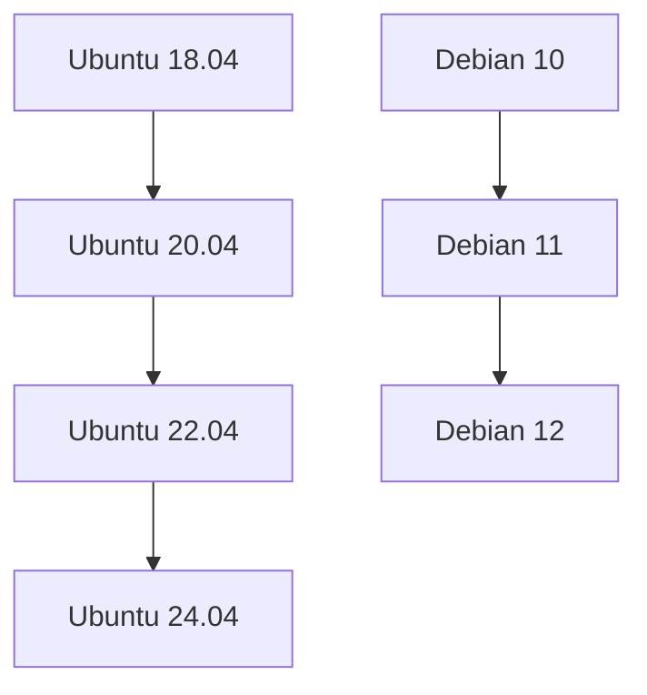
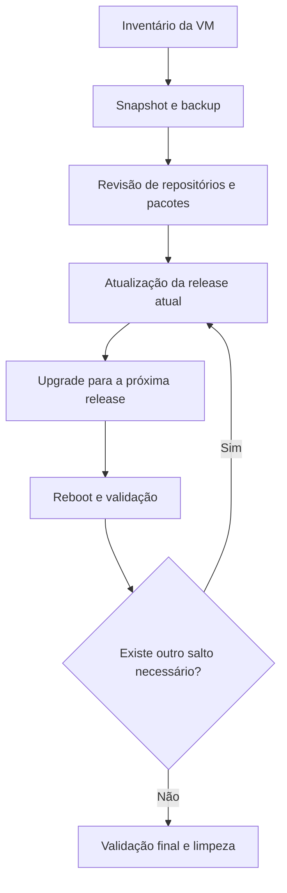

Fala pessoALL! Tranquilidade total?

Surgiu aquela necessidade de atualizarmos VMs com o S.O. Linux Ubuntu Server (versões 16, 18 ou 20) ou Debian 10, o caminho mais seguro seria: **criar uma nova máquina, instalar tudo novamente, migrar a aplicação e depois desligar a antiga**.

Mas e o esforço administrativo da equipe de Infra e aplicação para realizar esta atividade com o menor tempo possível? Com a chegada da IA onde empresas estão automatizando o que for possível automatizar e assim aumentando a sua produção, a equipe de TI/Infra precisa entregar o igual ou maior com o menor esforço possível, e é justamente aqui que o **upgrade in-place** pode fazer sentido.

**Daremos continuidade aos artigos anteriores ([Upgrade In-Place para Windows Server](https://blog.ruizsolutions.online/posts/upgrade-in-place-windows-server-azure-vm) e [Upgrade In-Place para Windows Client](https://blog.ruizsolutions.online/posts/upgrade-in-place-windows-client-azure-vm/))Neste artigo, realizaremos um upgrade in-place em VMs Linux do Azure**


A ideia aqui não é sair dando `upgrade` em tudo de qualquer jeito. A ideia é entender **quando esse método faz sentido, o que precisa ser validado antes, como reduzir risco e como executar os saltos de versão de forma segura**.

Agora, aqui vai um ponto importante:

> Nem toda VM Linux é uma boa candidata para upgrade in-place. Se a máquina tiver muitos repositórios de terceiros, kernels customizados, dependências legadas, pacotes em hold ou aplicação muito amarrada a versão antiga do sistema, talvez seja mais inteligente reconstruir do zero. Portando seja cauteloso e busque aprovação de todos os responsáveis antes de seguir.
{: .prompt-warning }

---

## Matriz e fluxos sugeridos para este artigo





> Esse é o fluxo que eu seguiria em ambiente real. Nada de pular de uma versão muito antiga direto para a final sem validar no meio do caminho.
{: .prompt-tip }

---

## Pré-requisitos

- Possuir no mínimo permissão de **Contributor** na Subscription ou no Resource Group onde a VM está;
- Acesso administrativo ao sistema operacional via **SSH(Terminal)** ou **Azure Bastion**;
- Criar **snapshot do OS Disk** e, se existir, também dos discos de dados;
- Validar se existe espaço livre suficiente em `/`, `/boot` e, quando existir, em volumes usados por logs e cache;
- revisar **repositórios de terceiros**, PPAs, backports, pinning e pacotes em hold;
- alinhar uma janela de manutenção realista;
- validar se há dependência de agentes de monitoramento, backup, segurança, EDR ou antivírus que possam precisar de ajuste após o upgrade.

> Não existe diretamente uma documentação na Microsoft que informa o mínimo de recursos que você precisará para realizar esta atividade, como por exemplo X de vCPU, Y de GBs de RAM e Z de GBs livres.
{: .prompt-info }

---

## Mão na massa!

### Passo 1

Antes de pensar em destino, descubra o estado atual da VM.

1 - Conecte-se via SSH e execute:

```bash
cat /etc/os-release
uname -r
df -h
sudo apt-mark showhold
```

*Se quiser uma visão ainda melhor dos repositórios ativos:*

```bash
grep -RhvE '^\s*#|^\s*$' /etc/apt/sources.list /etc/apt/sources.list.d/* 2>/dev/null
```
**VM UBUNTU**
{: .shadow .rounded-10 }
<br>

**VM DEBIAN**
{: .shadow .rounded-10 }
<br>

Aqui o objetivo é responder estas perguntas:

1. Estou realmente em **Ubuntu 18.04, 20.04 ou 22.04**?
2. Estou realmente em **Debian 10 ou 11**?
3. Existem pacotes presos com `hold`?
4. Existem repositórios não oficiais ativos?
5. Tenho espaço suficiente para passar pelo processo?

Se você identificar muito resíduo, muito pacote fora do padrão ou muitas dependências de terceiros, pare e organize primeiro.

---

### Passo 2

Assim como os artigos anteriores, para isso se faz necessário realizar um **snapshot** do disco do Sistema Operacional (e caso tenha disco de dados também é altamente recomendável).

Como já abordamos no artigo anterior como realizar esses passos, basta seguir as etapas já publicadas [AQUI!](https://blog.ruizsolutions.online/posts/upgrade-in-place-windows-server-azure-vm/#passo-2)

> Se o upgrade falhar, o snapshot vai ser o seu caminho mais rápido para restauração.
{: .prompt-tip }

---

### Passo 3 — Atualize totalmente a release atual antes de mudar de versão

Antes de trocar a release, deixe a release atual no último estado possível.

#### Ubuntu e Debian

```bash
sudo apt update && apt upgrade && apt full-upgrade
```

> Esse cuidado evita levar pendência de uma versão antiga para dentro da próxima.
{: .prompt-info }

> Caso a VM Debian não esteja mais atualizando diretamente retornando o erro **404 Not Found**, pode ser o apontamento que esteja incorreto, e para ajustar o arquivo 'sources.list' para 'non-free'. Assim a VM se comunicará corretamente com as distribuições que foram arquivadas.
{: .prompt-warning }

{: .shadow .rounded-10 }
<br>

```bash
cat > /etc/apt/sources.list <<'EOF'
deb https://archive.debian.org/debian buster main contrib non-free
deb https://archive.debian.org/debian-security buster/updates main contrib non-free
EOF
```

{: .shadow .rounded-10 }
<br>

---

### Passo 4

Agora vamos enfim iniciar os upgrades. O upgrade no Ubuntu 18.04 para 20.04, o caminho recomendado é feito com o `do-release-upgrade`.

Primeiro, garanta que o sistema está configurado para seguir somente LTS:

```bash
sudo sed -i 's/^Prompt=.*/Prompt=lts/' /etc/update-manager/release-upgrades
cat /etc/update-manager/release-upgrades
```

{: .shadow .rounded-10 }
<br>

Validadas as informações acima, agora vamos para o que interessa: **O upgrade!**

Execute o comando abaixo:

```bash
sudo do-release-upgrade
```

1 - Nesta primeira tela pode digitar a letra Y e pressionar a tecla ENTER

{: .shadow .rounded-10 }
<br>

Em seguida clique em ENTER novamente (as telas podem variar, por isso analise com cuidado antes de sair aceitando nas primeiras tentativas)

2 - Por último ele irá questionar se está confiante de seguir para o upgrade, informando que serão removidos alguns pacotes e incluídos novos pacotes. Inclusive também fornecerá a informação do tamanho do download.
Após analizado, pode digitar Y e novamente pressionar a tecla ENTER.

{: .shadow .rounded-10 }
<br>

3 - Irá aparecer uma informação sobre os pacotes que serão instalados e posteriormente precisarão ser restartados, ou seja, ao final do processo irá reinicializar a VM. Basta selecionar YES e continuar.

{: .shadow .rounded-10 }
<br>

4 - Após as atualizações dos pacotes, a distro irá lhe retornar algumas opções de configuração (como eu mencionei, isso pode variar de ambiente pra ambiente). Caso apareça o mesmo do print abaixo, eu recomendo que só pressione ENTER ou digite N e em seguida pressione a tecla ENTER para manter as configurações anteriores.

{: .shadow .rounded-10 }
<br>

Caso apareça uma informação sobre o pacote LXD, pode manter a versão 4.0 (já que estamos atualizando, manteremos sempre as últimas versões disponíveis em todos os pacotes)

{: .shadow .rounded-10 }
<br>

5 - Este será o último passo antes de realizar o upgrade por completo antes da reinicialização, a confirmação dos pacotes que serão removidos. Basta digitar Y e pressionar ENTER.

{: .shadow .rounded-10 }
<br>

6 - Ao final irá solicitar que você reinicialize a VM, bastar digitar Y e pressionar ENTER novamente e aguardar o retorno da VM para validar o funcionamento.

> Valide no portal do Microsoft Azure como está atualmente a versão desta VM.
{: .prompt-tip }

**Versão Anterior - Linux (ubuntu 18.04)**

{: .shadow .rounded-10 }
<br>

**Versão Atual - Linux (ubuntu 20.04)**

{: .shadow .rounded-10 }
<br>

---

Agora conecte-se novamente na VM devidamente atualizada via SSH e execute esses comandos para revalidar conforme fizemos antes da atualização:

```bash
cat /etc/os-release
uname -r
df -h
sudo apt-mark showhold
```

```bash
grep -RhvE '^\s*#|^\s*$' /etc/apt/sources.list /etc/apt/sources.list.d/* 2>/dev/null
```

{: .shadow .rounded-10 }
<br>

> Nesse momento aferimos que a VM está totalmente atualizada e pronta para receber a próxima versão.
{: .prompt-info }

> Antes de avançarmos para o upgrade da próxima versão do SO, execute novamente os comandos para atualizar toda a base antes.
{: .prompt-warning }

```bash
sudo apt update && apt upgrade && apt full-upgrade
```

> Recomendo fortemente que após o upgrade realizado, você execute um autoremove e clean para remover dependencias e pacotes e também limpar o cache local.
{: .prompt-tip }

```bash
sudo apt autoremove --purge -y && sudo apt clean
```

> Aqui eu não vou refazer todo o processo, basta você seguir os mesmos passos acima até a última versão disponível, nesse caso do Ubuntu é 24.04.
{: .prompt-tip }

---

**Linux (ubuntu 20.04) -> Linux (ubuntu 22.04)**

```bash
sudo do-release-upgrade
```

{: .shadow .rounded-10 }
<br>

---

**Linux (ubuntu 22.04) -> Linux (ubuntu 24.04)**

```bash
sudo do-release-upgrade
```

{: .shadow .rounded-10 }
<br>

> Valide novamente tudo o que for crítico no seu ambiente.
{: .prompt-danger }

---

### Passo 8

Agora faremos o  **Upgrdade do Debian 10 para 11**. Aqui existe um detalhe importante.

O **Debian 10 (buster)** já saiu do ciclo LTS e normalmente exige uma atenção maior com repositórios antigos. Em muitos casos, antes do salto você precisará revisar os repositórios e, se necessário, utilizar temporariamente o **Debian Archive**.

Primeiro, confira a versão:

```bash
cat /etc/debian_version
```

Se o seu `sources.list` ainda estiver apontando para entradas antigas e sem resposta, revise o arquivo.

Um exemplo de base para **buster em archive** pode ficar assim:

```bash
sudo nano /etc/apt/sources.list
```

```text
deb http://archive.debian.org/debian buster main contrib non-free
deb http://archive.debian.org/debian-security buster/updates main contrib non-free
```

Se o APT reclamar de metadata expirada por conta de release arquivada, você pode usar temporariamente:

```bash
echo 'Acquire::Check-Valid-Until "false";' | sudo tee /etc/apt/apt.conf.d/99buster-archive
```

Depois atualize o Debian 10 ao máximo:

```bash
sudo apt update
sudo apt upgrade -y
sudo apt full-upgrade -y
sudo apt autoremove -y
sudo reboot
```

Agora ajuste o `sources.list` para **bullseye**:

```text
deb http://deb.debian.org/debian bullseye main contrib non-free
deb http://security.debian.org/debian-security bullseye-security main contrib non-free
deb http://deb.debian.org/debian bullseye-updates main contrib non-free
```

Então siga o processo recomendado pelo Debian:

```bash
sudo apt update
sudo apt upgrade --without-new-pkgs -y
sudo apt full-upgrade -y
sudo apt autoremove -y
sudo reboot
```

Depois valide:

```bash
cat /etc/debian_version
uname -r
systemctl --failed
```

Se tudo estiver bem, remova a configuração temporária do `Check-Valid-Until`, caso ela tenha sido usada:

```bash
sudo rm -f /etc/apt/apt.conf.d/99buster-archive
```

---

## Como acompanhar o reboot no Azure

Em ambiente Linux, um dos medos mais comuns é simples:

**“E se a VM não voltar no SSH?”**

Se isso acontecer, vá para o portal do Azure e valide:

- **Boot diagnostics**
- **Serial console**
- **Activity log**
- **Status do disco e da VM**

Se necessário, esse é exatamente o momento em que o snapshot vira seu melhor amigo.

---

## Pós-upgrade

Terminou? Ainda não acabou.

Depois de cada salto, eu validaria no mínimo:

- versão do sistema operacional;
- kernel atual;
- serviços críticos;
- portas em escuta;
- conectividade de rede;
- uso de disco;
- agentes de segurança, backup e monitoramento;
- logs de boot e de serviços.

Comandos úteis:

```bash
cat /etc/os-release
uname -r
systemctl --failed
journalctl -p err -b
df -h
free -m
ip a
ss -tulpen
```

Também vale uma limpeza final:

```bash
sudo apt autoremove -y
sudo apt clean
```

No caso do Ubuntu, revise se algum repositório de terceiros precisa ser reabilitado.

No caso do Debian, revise se ficaram entradas antigas no `sources.list` ou arquivos em `/etc/apt/sources.list.d/` que não fazem mais sentido.

---

## Conclusão

Upgrade in-place em Linux no Azure **funciona**, mas precisa ser tratado com disciplina.

No Ubuntu, o caminho seguro aqui foi:

- **18.04 → 20.04 → 22.04 → 24.04**

No Debian, o caminho seguro aqui foi:

- **10 → 11 → 12**

Perceba que o segredo não está no comando em si.

O segredo está em:

- não pular etapas;
- revisar repositórios;
- atualizar totalmente antes de cada salto;
- fazer snapshot;
- validar a aplicação entre uma etapa e outra.

Se você respeitar isso, o processo deixa de ser um salto no escuro e passa a ser uma mudança muito mais controlada.

---

## Referências oficiais

- [Ubuntu Server - How to upgrade your Ubuntu release](https://ubuntu.com/server/docs/how-to/software/upgrade-your-release/)
- [Ubuntu 24.04 LTS release notes](https://documentation.ubuntu.com/release-notes/24.04/)
- [Ubuntu release cycle](https://ubuntu.com/about/release-cycle)
- [Debian 11 Release Notes](https://www.debian.org/releases/bullseye/releasenotes)
- [Debian 12 Release Notes](https://www.debian.org/releases/bookworm/releasenotes)
- [Debian Releases](https://www.debian.org/releases/)
- [Debian 12 release information](https://www.debian.org/releases/bookworm/)
- [Debian Distribution Archives](https://www.debian.org/distrib/archive)

