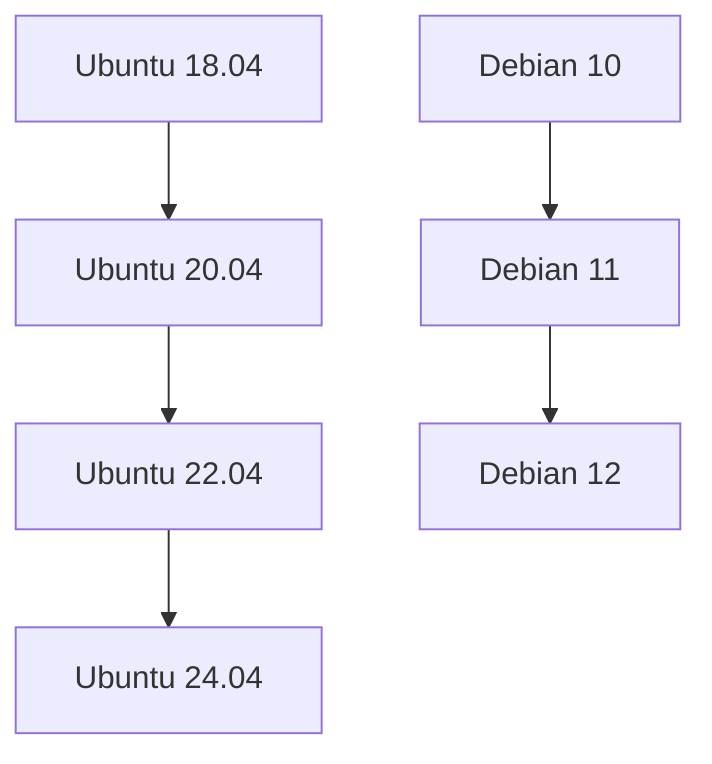
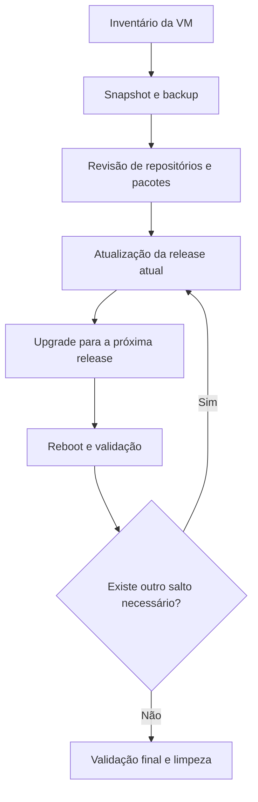

Fala pessoALL! Tranquilidade total?

Dando sequência aos artigos de atualizações de S.O., mas agora falaremos sobre distros Linux (Ubuntu e Debian). 

Surgiu aquela necessidade de atualizarmos VMs no Azure com o S.O. Linux Ubuntu Server (versões 16, 18 ou 20) ou Debian (versões 10 ou 11), o caminho mais seguro seria: **criar uma nova máquina, instalar tudo novamente, migrar a aplicação e depois desligar a antiga**.

Mas e o esforço administrativo da equipe de Infra e aplicação para realizar esta atividade com o menor tempo possível? Com a chegada da IA onde empresas estão automatizando o que for possível automatizar e assim aumentando a sua produção, a equipe de TI/Infra precisa entregar o igual ou maior com o menor esforço possível, e é justamente aqui que o **upgrade in-place** pode fazer sentido.

**Daremos continuidade aos artigos anteriores ([Upgrade In-Place para Windows Server](https://blog.ruizsolutions.online/posts/upgrade-in-place-windows-server-azure-vm) e [Upgrade In-Place para Windows Client](https://blog.ruizsolutions.online/posts/upgrade-in-place-windows-client-azure-vm/))Neste artigo, realizaremos um upgrade in-place em VMs Linux do Azure**


A ideia aqui não é sair dando *upgrade* em tudo de qualquer jeito. O que eu quero é fazer você entender **quando esse método faz sentido, o que precisa ser validado antes, como reduzir risco e como executar os saltos de versão de forma segura**.

Agora, aqui vai um ponto importante:

> Nem toda VM Linux é uma boa candidata para upgrade in-place. Se a máquina tiver muitos repositórios de terceiros, kernels customizados, dependências legadas, pacotes em hold ou aplicação muito amarrada a versão antiga do sistema, talvez seja mais inteligente reconstruir do zero. Portando seja cauteloso e busque aprovação de todos os responsáveis antes de seguir.
{: .prompt-warning }

---

### Matriz e fluxos sugeridos para este artigo

**Matriz de Atualizações**:


---

**Fluxo Sugerido para atualizações**:


> Esse é o fluxo que eu seguiria em ambiente real. Nada de pular de uma versão muito antiga direto para a final sem validar no meio do caminho.
{: .prompt-tip }

---

### Pré-requisitos

- Possuir no mínimo permissão de **Contributor** na Subscription;
- Acesso administrativo ao sistema operacional via **SSH(Terminal)** ou **Azure Bastion**;
- Criar **snapshot do OS Disk** e, se existir, também dos discos de dados;
- Validar se existe espaço livre suficiente em **/**, **/boot** e, quando existir, em volumes usados por logs e cache;
- revisar **repositórios de terceiros**, PPAs, backports, pinning e pacotes em hold;
- alinhar uma janela de manutenção realista;
- validar se há dependência de agentes de monitoramento, backup, segurança, EDR ou antivírus que possam precisar de ajuste após o upgrade.

> Não existe diretamente uma documentação na Microsoft que informa o mínimo de recursos que você precisará para realizar esta atividade, como por exemplo X de vCPU, Y de GBs de RAM e Z de GBs livres.
{: .prompt-info }

---

## Mão na massa!

#### Passo 1

Antes de pensar em destino, descubra o estado atual da VM.

1 - Acesse as VMs que irão realizar o upgrade via SSH e execute os comandos abaixo:

```bash
cat /etc/os-release
uname -r
df -h
sudo apt-mark showhold
```

---

*Se quiser uma visão ainda melhor dos repositórios ativos:*

```bash
grep -RhvE '^\s*#|^\s*$' /etc/apt/sources.list /etc/apt/sources.list.d/* 2>/dev/null
```
**VM UBUNTU**
{: .shadow .rounded-10 }
<br>

---

**VM DEBIAN**
{: .shadow .rounded-10 }
<br>

Aqui o objetivo é responder estas perguntas:

1. Estou realmente em **Ubuntu 18.04, 20.04 ou 22.04**?
2. Estou realmente em **Debian 10 ou 11**?
3. Existem pacotes presos com **hold**?
4. Existem repositórios não oficiais ativos?
5. Tenho espaço suficiente para passar pelo processo?

> Se você identificar muito resíduo, muito pacote fora do padrão ou muitas dependências de terceiros, **pare imediatamente**, organize as pendências primeiro e só então retome os próximos passos para seguir com o upgrade.
{: .prompt-danger }

---

#### Passo 2

Assim como os artigos anteriores, para isso se faz necessário realizar um **snapshot** do disco do Sistema Operacional (e caso tenha disco de dados também é altamente recomendável).

Como já abordamos no artigo anterior como realizar esses passos, basta seguir as etapas já publicadas [AQUI!](https://blog.ruizsolutions.online/posts/upgrade-in-place-windows-server-azure-vm/#passo-2)

> Se o upgrade falhar, o snapshot vai ser o seu caminho mais rápido para restauração.
{: .prompt-tip }

---

#### Passo 3

Nesse ponto eu sugiro que você atualize totalmente a release atual antes de mudar de versão.

O comando abaixo funcionará tanto no **Ubuntu** quanto no **Debian**:

```bash
sudo apt update && apt upgrade && apt full-upgrade
```

> Esse cuidado evita levar pendência de uma versão antiga para dentro da próxima.
{: .prompt-info }

> Caso a VM Debian não esteja mais atualizando diretamente retornando o erro **404 Not Found**, pode ser o apontamento que esteja incorreto, e para ajustar o arquivo 'sources.list' para 'non-free'. Assim a VM se comunicará corretamente com as distribuições que foram arquivadas.
{: .prompt-warning }

{: .shadow .rounded-10 }
<br>

**Para resolvermos isso basta atualizarmos o repositório para o deposito correto:**

```bash
cat > /etc/apt/sources.list <<'EOF'
deb https://archive.debian.org/debian buster main contrib non-free
deb https://archive.debian.org/debian-security buster/updates main contrib non-free
EOF
```

{: .shadow .rounded-10 }
<br>

---

#### Passo 4

##### Agora vamos enfim iniciar os upgrades. Primeiramente faremos o upgrade do **Ubuntu 18.04 para 20.04**.

Primeiro, garanta que o sistema está configurado para seguir somente LTS:

```bash
sudo sed -i 's/^Prompt=.*/Prompt=lts/' /etc/update-manager/release-upgrades
cat /etc/update-manager/release-upgrades
```

{: .shadow .rounded-10 }
<br>

Validadas as informações acima, agora vamos para o que interessa: **O upgrade!**

Execute o comando abaixo:

```bash
sudo do-release-upgrade
```

1 - Nesta primeira tela pode digitar a letra **Y** e pressionar a tecla **ENTER**:

{: .shadow .rounded-10 }
<br>

Em seguida clique em **ENTER** novamente *(as telas podem variar, por isso analise com cuidado antes de sair aceitando nas primeiras tentativas)*:

---

2 - Receberemos o questionamento se gostaríamos de inicializar mesmo o upgrade, com algumas informações que serão removidos alguns pacotes e incluídos novos pacotes. Inclusive também fornecerá a informação do tamanho do download.
Após analizado, pode digitar **Y** e novamente pressionar a tecla **ENTER**:

{: .shadow .rounded-10 }
<br>

---

3 - Irá aparecer uma informação sobre os pacotes que serão instalados e posteriormente precisarão ser restartados, ou seja, ao final do processo irá reinicializar a VM. Basta selecionar **YES**:

{: .shadow .rounded-10 }
<br>

---

4 - Após as atualizações dos pacotes, a distro irá lhe retornar algumas opções de configuração *(como eu mencionei, isso pode variar de ambiente pra ambiente)*. Caso apareça o mesmo do print abaixo, eu recomendo que só pressione **ENTER** ou digite **N** e em seguida pressione a tecla **ENTER** para manter as configurações anteriores:

{: .shadow .rounded-10 }
<br>

Caso apareça uma informação sobre o pacote LXD, pode manter a versão 4.0 (já que estamos atualizando, manteremos sempre as últimas versões disponíveis em todos os pacotes):

{: .shadow .rounded-10 }
<br>

---

5 - Este será o último passo antes de realizar o upgrade por completo antes da reinicialização, a confirmação dos pacotes que serão removidos. Basta digitar **Y** e pressionar **ENTER**.

{: .shadow .rounded-10 }
<br>

---

6 - Ao final irá solicitar que você reinicialize a VM, bastar digitar **Y** e pressionar **ENTER** novamente e aguardar o retorno da VM para validar o funcionamento.

> Valide no portal do Microsoft Azure como está atualmente a versão desta VM.
{: .prompt-tip }

**Versão Anterior - Linux (ubuntu 18.04)**

{: .shadow .rounded-10 }
<br>

**Versão Atual - Linux (ubuntu 20.04)**

{: .shadow .rounded-10 }
<br>

---

Agora conecte-se novamente na VM devidamente atualizada via SSH e execute esses comandos para revalidar conforme fizemos antes da atualização:

```bash
cat /etc/os-release
uname -r
df -h
sudo apt-mark showhold
```

```bash
grep -RhvE '^\s*#|^\s*$' /etc/apt/sources.list /etc/apt/sources.list.d/* 2>/dev/null
```

{: .shadow .rounded-10 }
<br>

> Nesse momento aferimos que a VM está totalmente atualizada e pronta para receber a próxima versão.
{: .prompt-info }

> Antes de avançarmos para o upgrade da próxima versão do SO, **execute novamente os comandos para atualizar toda a base antes**.
{: .prompt-warning }

```bash
sudo apt update && apt upgrade && apt full-upgrade
```

---

> Recomendo fortemente que após o upgrade realizado, você execute um **autoremove** e **clean** para remover dependencias e pacotes e também limpar o cache local.
{: .prompt-tip }

```bash
sudo apt autoremove --purge -y && sudo apt clean
```

---

> Aqui eu não vou refazer todo o processo, basta você seguir os mesmos passos acima até a última versão disponível, nesse caso do Ubuntu é 24.04.
{: .prompt-tip }

---

##### **Upgrading Linux (ubuntu 20.04) → Linux (ubuntu 22.04)**

```bash
sudo do-release-upgrade
```

{: .shadow .rounded-10 }
<br>

---

##### **Upgrading Linux (ubuntu 22.04) → Linux (ubuntu 24.04)**

```bash
sudo do-release-upgrade
```

{: .shadow .rounded-10 }
<br>

> Nesse momento todo upgrade para a VM Linux Ubuntu foi finalizada, agora valide novamente tudo o que for crítico no seu ambiente.
{: .prompt-tip }

---

#### Passo 5

Agora faremos o  **Upgrdade do Debian 10 para 11**. Aqui existe um detalhe importante: Não será possível utilizarmos o comando "**sudo do-release-upgrade**" - Portanto precisaremos mudar o 'source.list' apontando para a versão subsequente.

> O processo de upgrade para as versões 11 e 12 são direcionáveis através da biblioteca, ou seja, para atualizarmos para o Debian 11 precisamos apontar a bibliioteca **Bullseye**, enquanto para o Debian 12 apontaremos para a biblioteca **Bookworm**.
{: .prompt-tip }

O **Debian 10 (buster)** já saiu do ciclo LTS e normalmente exige uma atenção maior com repositórios antigos. Em muitos casos, antes do salto você precisará revisar os repositórios e, se necessário, utilizar temporariamente o **Debian Archive**.

1 - Primeiramente vamos conferir como está a versão atual:

```bash
cat /etc/debian_version
```

{: .shadow .rounded-10 }
<br>

---

2 - Se o seu **sources.list** ainda estiver apontando para entradas antigas e sem resposta, revise o arquivo.

> Um exemplo de base para **[buster em archive](https://www.debian.org/distrib/archive)** pode ficar assim:
{: .prompt-info }

```bash
sudo nano /etc/apt/sources.list
```

Copie abaixo o texto e cole no documento:

```bash
deb http://archive.debian.org/debian buster main contrib non-free
deb http://archive.debian.org/debian-security buster/updates main contrib non-free
```

{: .shadow .rounded-10 }
<br>

Pressione em seguida **CTRL+X** para Salvar, digite **Y** e em seguida clique em **ENTER** para **Sair**

---

3 - Após alterado, agora vamos executar os comandos para atualizar os pacotes para preparar antes mesmo de realizarmos o upgrade. Para isso execute o comando abaixo:

```bash
sudo apt update && apt upgrade && apt full-upgrade
```

---

#### Passo 6

Agora com o terreno bem estruturado, partiremos para o **upgrade**!

##### **Upgrading Linux (Debian 10) → Linux (Debian 11)**

1 - Vamos alterar novamente o arquivo **source.list** para **Bullseye**, removendo o *buster*. Acesse o arquivo utilizando o comando nano (ou vim) e cole o texto abaixo:

```bash
sudo nano /etc/apt/sources.list
```

```bash
deb http://deb.debian.org/debian bullseye main contrib non-free
deb http://security.debian.org/debian-security bullseye-security main contrib non-free
deb http://deb.debian.org/debian bullseye-updates main contrib non-free
```

{: .shadow .rounded-10 }
<br>

---

2 - Com o arquivo devidamente alterado, execute o comando abaixo para realizarmos o upgrade

```bash
sudo apt update && apt upgrade && apt full-upgrade
```

> Assim como acompanhamos com a VM Linux Ubuntu, nessas etapas aparecerão praticamente as mesmas telas questionando sobre quais aplicações serão atualizadas e quais não serão
{: .prompt-info }

Abaixo apresento um print com o quantitativo de recursos que serão atualizados e quais não serão, como sempre, isso pode variar de recursos instalados por VM.

Basta digitar **Y** e pressionar **ENTER**.

{: .shadow .rounded-10 }
<br>

---

3 - Logo em seguida aparecerão mais informações sobre os serviços e grep options, caso não apareça na tela todas as informações, role com o 'scroll' do mouse pra **baixo** ou tecle **page down** no teclado, assim você verá em seguida pedirá que pressione a tecla **Q** para sair

{: .shadow .rounded-10 }
<br>

---

4 - Agora aparecerão algumas informações em sequência como a biblioteca que estão armazenados os recursos como `libpam`, `libc` e `libssl`, nesse ponto ele informa apenas que os serviços precisarão serem restartados.

Basta selecionar **YES** e em seguida pressionar **ENTER** para continuar a configuração:

{: .shadow .rounded-10 }
<br>

---

5 - Caso a versão do openssh esteja desatualizada, pode aparecer uma informação sobre a nova versão como a imagem logo abaixo. Eu não oriento a fazer essa atualização no momento, primeiramente avalie com a sua equipe de Segurança da Informação em algum comitê para aprovar esta etapa:

{: .shadow .rounded-10 }
<br>

---

6 - Ao final mostrará um resumo refernete aos pacotes que serão removidos, os que serão atualizados e outros que serão instalados como novos, basta escrever a tecla **Y** e pressionar **ENTER** para finalizar:

{: .shadow .rounded-10 }
<br>

> Pode aparecer novamente algumas informações repetidas acima, basta ler com atenção e seguir as orientações que já foram repassadas anteriormente.
{: .prompt-tip }

---

7 - A VM não irá reincializar, simplesmente finalizará o processo e vai 'estacionar' no prompt aguardando alguma interação:

{: .shadow .rounded-10 }
<br>

Vamos validar com os comandos abaixo, se deu tudo certo:

```bash
cat /etc/debian_version
uname -r
systemctl --failed
```

{: .shadow .rounded-10 }
<br>

Da mesma maneira, podemos validar diretamente no Portal do Azure como está o *status* atual dessa VM:

{: .shadow .rounded-10 }
<br>

---

8 - Antes de seguirmos para o próximo distro, assim como fizemos com o Ubuntu Server, vamos remover todo 'lixo' que poderia ofuscar e atrapalhar durante o próximo upgrade.

Execute o comando abaixo:

```bash
sudo apt autoremove --purge -y && sudo apt clean
```

{: .shadow .rounded-10 }
<br>

Se tudo estiver bem, remova a configuração temporária do `Check-Valid-Until`, caso ela tenha sido usada:

```bash
sudo rm -f /etc/apt/apt.conf.d/99buster-archive
```

---

##### **Upgrading Linux (Debian 11) → Linux (Debian 12)**

Aqui usaremos a mesma lógica que fizemos para o Debian 11, vamos simplesmente alterar o arquivo **sources.list** de *Bullseye* para **BOOKWORM**

1 - Com seu editor favorito (eu prefiro o nano) edite o arquivo `sources.list` através do caminho `/etc/apt/sources.list`:

```bash
sudo nano /etc/apt/sources.list
```

Apague todo o conteúdo neste arquivo, copie todo o conteúdo deste repositório abaixo e cole:

```bash
deb http://deb.debian.org/debian bookworm main contrib non-free non-free-firmware
deb http://security.debian.org/debian-security bookworm-security main contrib non-free non-free-firmware
deb http://deb.debian.org/debian bookworm-updates main contrib non-free non-free-firmware
```

Para salvar basta pressionar as teclas **CTRL + X** em seguida digite a tecla **Y** e por final tecle **ENTER** para sair.

{: .shadow .rounded-10 }
<br>

---

2 - Com o arquivo devidamente alterado, vamos executar novamente o comando abaixo para a realização do upgrade:

```bash
sudo apt update && apt upgrade && apt full-upgrade
```

> Nessa etapa não vou repetir os prints, pois serão exatamente iguais ao upgrade que fizemos do Debian 10 para o Debian 11
{: .prompt-info }

> Valide com muita cautela cada etapa, funcionalidade, pacote e bibliotecas. Assim o processo de upgrade será bem sucedido sem nenhuma surpresa
{: .prompt-warning }

---

3 - E esse é o resultado final do upgrade realizado do Debian 11 para o Debian 12:

```bash
cat /etc/debian_version
uname -r
systemctl --failed
```

{: .shadow .rounded-10 }
<br>

---

{: .shadow .rounded-10 }
<br>

---

4 - E por último não se esqueça de remover todos os resíduos deixados durante o upgrade:

```bash
sudo apt autoremove --purge -y && sudo apt clean
```

---

### Checklist

- [x] Passo 1 - Validar a versão atual do sistema operacional, kernel, espaço em disco e pacotes em hold;
- [x] Passo 2 - Revisar repositórios ativos e dependências de terceiros;
- [x] Passo 3 - Criar snapshot do disco do sistema e, se necessário, dos discos de dados;
- [x] Passo 4 - Atualizar totalmente a release atual antes de iniciar qualquer salto de versão;
- [x] Passo 5 - Executar os upgrades sequenciais no **Ubuntu** até a versão final;
- [x] Passo 6 - Executar os upgrades sequenciais no **Debian** até a versão final;
- [x] Passo 7 - Validar sistema operacional, kernel, rede, disco e serviços após cada upgrade;
- [x] Passo 8 - Remover pacotes obsoletos e limpar o cache do APT ao final de cada etapa;

---

## Artigos

| Nome | Link |
| :---: | :---: |
| Criando snasphots de várias VMs rapidamente | <https://blog.ruizsolutions.online/posts/criando-snapshot-de-vms-atraves-de-tags/>
| Ubuntu Server - How to upgrade your Ubuntu release | <https://ubuntu.com/server/docs/how-to/software/upgrade-your-release> |
| Ubuntu 24.04 LTS release notes | <https://documentation.ubuntu.com/release-notes/24.04> |
| Ubuntu release cycle | <https://ubuntu.com/about/release-cycle> |
| Debian Releases | <https://www.debian.org/releases> |
| Debian 12 release information | <https://www.debian.org/releases/bookworm> |

---

## The End!

É isso ai pessoal, finalmente chegamos ao fim de mais um artigo com bastante detalhe técnico.

O que eu queria destacar é que é possível sim realizar o upgrade in-place também para as distribuições de VMs Linux Ubuntu e Debian. Mas eu adiantei que o melhor a se fazer é ir versão a versão.

No Ubuntu, o caminho que seguimos foi:

- **18.04 → 20.04 → 22.04 → 24.04**

---

E no Debian:

- **10 → 11 → 12**

---

Se você seguir essa linha o upgrade deixa de ser um salto no escuro e passa a ser um processo muito mais previsível, seguro e organizado.

Espero que vocês tenham curtido tanto quanto eu curti de produzi-lo. Deixem seus comentários no meu Linkedin sobre o que você achou e se fez sentido! 

Obrigado mais uma vez por me acompnharem até aqui! Nos vemos na próxima!