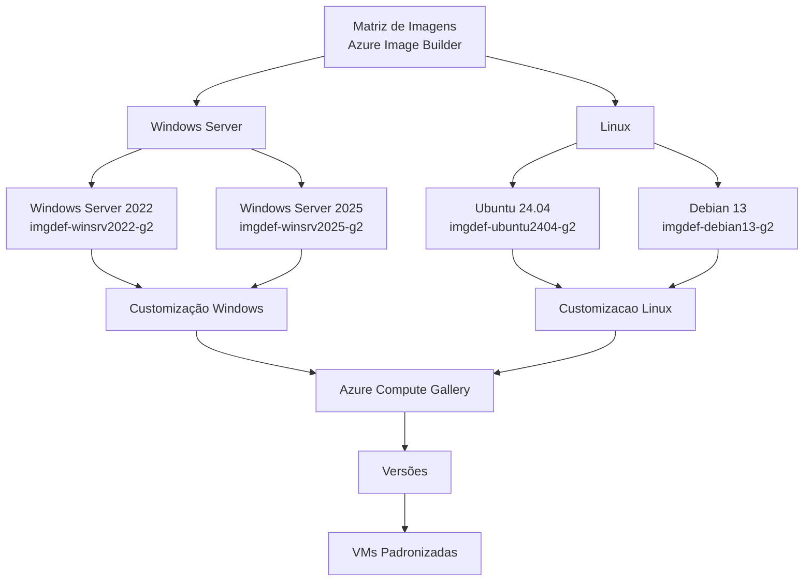
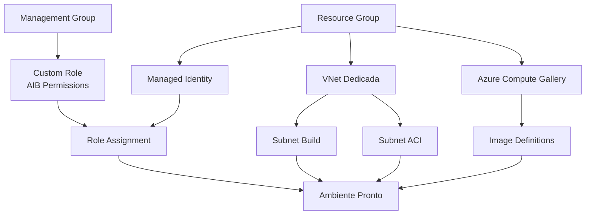

Fala pessoALL! Chegamos pra mais um super conteúdo pra toda comunidade!

Seguimos evoluindo e agora para o próximo nível o tema será **Golden Images**. Para a criação de uma imagem padronizada para Windows (Server ou Client) e Linux, é muito comum começarmos pelo caminho mais simples: Diretamente no portal do Azure escolhemos uma imagem do Marketplace, definimos o tamanho do disco, definimos o usuário padrão, senha ou chave SSH (caso escolha o Linux), executamos um snapshot, realizamos a captura, publicamos em uma galeria e pronto, temos uma Golden Image funcional e pronta para uso.

E isso funciona muito bem para laboratório, estudo, testes rápidos e até mesmo a padronização de grandes empresas, mas quando começamos a falar de ambiente corporativo de alto padrão, governança, segurança, atualização recorrente e escala, esse modelo começa a ficar um pouco limitado por ser muito manual.

Agora imagine o seguinte cenário:
1. Toda VM Windows precisa nascer com alguns pacotes básicos;
2. Toda VM Linux precisa nascer atualizada, com timezone correto e ferramentas mínimas;
3. Algumas imagens precisam ter agentes corporativos;
4. As imagens precisam ser versionadas;
5. O time precisa conseguir criar novas VMs sempre a partir de uma base padronizada.

É um tema sensivel e trabalhoso, mas é exatamente aqui que entra o **Azure Image Builder**.

**Neste artigo construiremos juntos na prática uma estrutura de imagens customizadas no Azure usando o Azure Image Builder, definiremos onde ficarão todas as Golden Imagens dentro do Azure Compute Gallery. Focaremos principalmente nos S.Os vai utilizados em todo o mundo:**
* Windows Server 2022;
* Windows Server 2025;
* Ubuntu 24.04 LTS;
* Debian 13.

> Vou seguir um modelo um pouco mais completo usando VNet dedicada para o processo de build. Existe também o caminho mais simples, sem VNet customizada, mas para um conteúdo mais técnico e próximo de ambiente corporativo, vale a pena já entender o fluxo mais controlado. 
{: .prompt-info }

---

## Mas antes de começarmos, o que é e pra que serve o Azure VM Image Builder?

O **Azure VM Image Builder** é um serviço do Azure que permite automatizar a criação de imagens customizadas de máquinas virtuais. Na prática ele pega uma imagem base e executa as customizações de forma automatizada e em seguida publica o resultado em algum destino, armazenando em:

1. Managed Image; ou
2. VHD; ou
3. Azure Compute Gallery.

Neste artigo decidi focar somente no **Azure Compute Gallery**, simplesmente porque a Azure Compute Gallery permite:

* Criar definições de imagem;
* Versionar imagens;
* Replicar imagens entre regiões;
* Reutilizar imagens em múltiplos deployments;
* Padronizar Windows e Linux;
* Ter um modelo mais profissional de Golden Image.

De forma bem resumida, o fluxo fica assim:



---

## O que vamos construir neste laboratório?

Neste laboratório vamos criar quatro imagens customizadas:

| Sistema Operacional | Imagem base                                   | Destino               |
| ------------------- | --------------------------------------------- | --------------------- |
| Windows Server 2022 | Windows Server 2022 Datacenter: Azure Edition | Azure Compute Gallery |
| Windows Server 2025 | Windows Server 2025 Datacenter: Azure Edition | Azure Compute Gallery |
| Ubuntu 24.04 LTS    | Ubuntu 24.04 LTS Server Gen2                  | Azure Compute Gallery |
| Debian 13           | Debian 13 Gen2                                | Azure Compute Gallery |

---

## Arquitetura do laboratório

A arquitetura final do laboratório será parecida com esta:



---

## Sobre a nomenclatura

Para manter um padrão mais próximo do **Cloud Adoption Framework**, vou usar nomes mais organizados e fáceis de entender.

| Recurso                       | Nome sugerido                |
| ----------------------------- | ---------------------------- |
| Resource Group                | `rg-aib-lab-wus2-001`        |
| Virtual Network               | `vnet-aib-lab-wus2-001`      |
| Subnet para Build VM          | `snet-aib-build-wus2-001`    |
| Subnet para ACI               | `snet-aib-aci-wus2-001`      |
| Managed Identity              | `id-aib-lab-wus2-001`        |
| Azure Compute Gallery         | `gal_aib_lab_wus2_001`       |
| Custom Role                   | `role-aib-lab-image-builder` |
| Image Definition Windows 2022 | `imgdef-winsrv2022-g2`       |
| Image Definition Windows 2025 | `imgdef-winsrv2025-g2`       |
| Image Definition Ubuntu 24.04 | `imgdef-ubuntu2404-g2`       |
| Image Definition Debian 13    | `imgdef-debian13-g2`         |

> A Azure Compute Gallery não aceita hífen em todos os campos da mesma forma que outros recursos, por isso o nome da galeria está usando underline. Esse tipo de detalhe parece pequeno, mas evita erro bobo durante o laboratório. 
{: .prompt-info }

---

## Pré-requisitos

Antes de iniciar, vamos considerar alguns pré-requisitos:

* Permissão de **Owner** para criar Resource Groups, VNet, Managed Identity, Compute Gallery e Custom RBAC;
* Região com suporte ao Azure VM Image Builder;
* Cotas disponíveis para criação temporária de recursos de build;
* Nenhuma Azure Policy bloqueando recursos temporários, como:
  * Virtual Machine;
  * Network Interface;
  * Disk;
  * Storage Account;
  * Azure Container Instance;
  * Network Security Group;
  * Private Endpoint, dependendo da topologia.

> O Azure Image Builder cria recursos temporários durante o build. Então, se existir uma Azure Policy muito restritiva permitindo apenas alguns tipos de recursos, o build pode falhar mesmo que o template esteja correto. 
{: .prompt-warning }

---

## Imagens base que serão utilizadas

Vamos utilizar imagens oficiais do Marketplace.

### Windows Server 2022

```text
Publisher: MicrosoftWindowsServer
Offer: WindowsServer
SKU: 2022-datacenter-azure-edition
Version: latest
```

### Windows Server 2025

```text
Publisher: MicrosoftWindowsServer
Offer: WindowsServer
SKU: 2025-datacenter-azure-edition
Version: latest
```

### Ubuntu 24.04 LTS

```text
Publisher: Canonical
Offer: ubuntu-24_04-lts
SKU: server
Version: latest
```

### Debian 13

```text
Publisher: Debian
Offer: debian-13
SKU: 13-gen2
Version: latest
```

---

## Passo 1 — Registrar os providers necessários

Antes de usar o Azure Image Builder, precisamos garantir que alguns providers estejam registrados na assinatura.

No Cloud Shell:

```bash
az provider register --namespace Microsoft.VirtualMachineImages
az provider register --namespace Microsoft.Compute
az provider register --namespace Microsoft.KeyVault
az provider register --namespace Microsoft.Storage
az provider register --namespace Microsoft.Network
az provider register --namespace Microsoft.ContainerInstance
az provider register --namespace Microsoft.ManagedIdentity
```

{: .shadow .rounded-10 }
<br>

Em seguida valide se os providers foram registrados corretamente:

```bash
az provider show --namespace Microsoft.VirtualMachineImages --query registrationState -o tsv
az provider show --namespace Microsoft.Compute --query registrationState -o tsv
az provider show --namespace Microsoft.Network --query registrationState -o tsv
az provider show --namespace Microsoft.ContainerInstance --query registrationState -o tsv
```

{: .shadow .rounded-10 }
<br>

O retorno esperado é **Registered**

> Se algum provider ainda aparecer como `Registering`, aguarde alguns minutos e valide novamente. Essa etapa é simples, mas é uma das primeiras coisas que podem causar erro se for esquecida. 
{: .prompt-info }

---

## Passo 2 — Criar o Resource Group

Vamos começar criando o Resource Group do laboratório.

Pelo portal:

1. Acesse o **Azure Portal**;
2. Pesquise por **Resource groups**;
3. Clique em **Create**;
4. Informe:
   * Subscription: Informe a subscription que será utilizada para a geração das imagens e alocação dos demais recursos;
   * Resource group: 
   ```text
   rg-aib-lab-wus2-001
   ```
   * Region: `West US 2`;
5. Clique em **Review + Create**;
6. Clique em **Create**.

{: .shadow .rounded-10 }
<br>

---

## Passo 3 — Criar a VNet dedicada para o build

Agora vamos criar uma VNet dedicada para o processo de build.

Neste exemplo iremos utilizar 2 subnets:

| Subnet                    | Finalidade                                                              |
| ------------------------- | ----------------------------------------------------------------------- |
| `snet-aib-build-wus2-001` | Subnet onde a VM temporária de build será criada                        |
| `snet-aib-aci-wus2-001`   | Subnet reservada para o Azure Container Instance usado no build isolado |

> O Azure Container Instance não é um componente da imagem final e também não é uma aplicação que estamos hospedando. Ele será utilizado pelo Azure VM Image Builder durante o processo de Isolated Image Build, como recurso temporário responsável por parte da execução e orquestração da customização da imagem.
{: .prompt-info }

1. Pesquise por **Virtual networks**;
2. Clique em **Create**;
3. Informe:

   * Resource group: `rg-aib-lab-wus2-001`;
   * Name:
   ```text
   vnet-aib-lab-wus2-001
   ```
   * Region: `West US 2`;
4. Em **IP Addresses**, configure:

   * Address space:
   ```text
   10.250.0.0/16`
   ```
5. Crie as subnets:

   * Subnet para criação da VM Temporária:
   ```text
   snet-aib-build-wus2-001
   ``` 
   com 
   ```text
   10.250.1.0/24
   ```
   
   * Subnet para criação do ACI de forma isolada:
    ```text
    snet-aib-aci-wus2-001
    ``` 
    com 
    ```text
    10.250.2.0/24
    ```
6. Clique em **Review + Create**;
7. Clique em **Create**.

{: .shadow .rounded-10 }
<br>

> Desde o dia 31/03/2026 a Microsoft deixou de forma padrão habilitado a criação de todas subnets com Private Subnet, ou seja, sem acesso 'default' externo. Se atende a essa marcação durante a criação do seu recurso em seu ambiente.
{: .prompt-warning }

---

## Passo 4 — Ajustar a subnet do ACI

Para o cenário com build isolado e subnet dedicada para o Azure Container Instance, precisamos delegar a subnet do ACI.

Para esse passo, vamos utilizar o Cloud Shell:

```bash
az network vnet subnet update \
  --resource-group rg-aib-lab-wus2-001 \
  --vnet-name vnet-aib-lab-wus2-001 \
  --name snet-aib-aci-wus2-001 \
  --delegations Microsoft.ContainerInstance/containerGroups
```

{: .shadow .rounded-10 }
<br>

Agora vamos guardar os IDs das subnets, pois eles serão usados no template do Image Builder:

```bash
BUILD_SUBNET_ID=$(az network vnet subnet show \
  --resource-group rg-aib-lab-wus2-001 \
  --vnet-name vnet-aib-lab-wus2-001 \
  --name snet-aib-build-wus2-001 \
  --query id \
  -o tsv)

ACI_SUBNET_ID=$(az network vnet subnet show \
  --resource-group rg-aib-lab-wus2-001 \
  --vnet-name vnet-aib-lab-wus2-001 \
  --name snet-aib-aci-wus2-001 \
  --query id \
  -o tsv)

echo $BUILD_SUBNET_ID
echo $ACI_SUBNET_ID
```

{: .shadow .rounded-10 }
<br>

> Guarde esses valores. Eles serão usados no `vmProfile` dos templates do Azure Image Builder. 
{: .prompt-tip }

---

## Passo 5 — Criar a User Assigned Managed Identity

O Azure Image Builder precisa de uma identidade para conseguir escrever a imagem final na Azure Compute Gallery e também interagir com alguns recursos necessários durante o build.

Criaremos uma **User Assigned Managed Identity**:

1. Pesquise por **Managed Identities** e clique em **Create**:
{: .shadow .rounded-10 }
<br>

2. Informe:

   * Resource group: `rg-aib-lab-wus2-001`;
   * Region: `West US 2`;
   * Name: 
   ```text
   id-aib-lab-wus2-001
   ```
3. Não será necessário selecionar Isolation Scope, basta clicar em **Next**;
4. Coloque as tags padrões elegíveis na governança conforme a sua necessidade;
5. Clique em **Create**.
{: .shadow .rounded-10 }
<br>

Agora vamos capturar os IDs da identidade, pois iremos utiliza-lo nos próximos passos:

```bash
SUBSCRIPTION_ID=$(az account show --query id -o tsv)

IDENTITY_ID=$(az identity show \
  --resource-group rg-aib-lab-wus2-001 \
  --name id-aib-lab-wus2-001 \
  --query id \
  -o tsv)

IDENTITY_CLIENT_ID=$(az identity show \
  --resource-group rg-aib-lab-wus2-001 \
  --name id-aib-lab-wus2-001 \
  --query clientId \
  -o tsv)

echo $IDENTITY_ID
echo $IDENTITY_CLIENT_ID
```

{: .shadow .rounded-10 }
<br>

---

## Passo 6 — Criar a Azure Compute Gallery

Agora vamos criar a galeria que receberá as imagens customizadas.

Pelo portal:

1. Pesquise por **Azure Compute Galleries**;
2. Clique em **Create**;
3. Informe:

   * Resource group: `rg-aib-lab-wus2-001`;
   * Name: `gal_aib_lab_wus2_001`;
   * Region: `West US 2`;
4. Clique em **Review + Create**;
5. Clique em **Create**.


---

## Passo 7 — Criar as Image Definitions

A Azure Compute Gallery trabalha com alguns conceitos importantes:

| Conceito         | Explicação                                                   |
| ---------------- | ------------------------------------------------------------ |
| Gallery          | Galeria onde as imagens ficam organizadas                    |
| Image Definition | Definição lógica da imagem                                   |
| Image Version    | Versão publicada da imagem                                   |
| Generalized      | Imagem preparada para criar novas VMs                        |
| Specialized      | Imagem ainda ligada à identidade/configuração original da VM |

Darei preferencia em trabalhar com imagens **Generalized**, que é o cenário mais comum para criação de novas VMs padronizadas.

### Windows Server 2022

```bash
az sig image-definition create \
  --resource-group rg-aib-lab-wus2-001 \
  --gallery-name gal_aib_lab_wus2_001 \
  --gallery-image-definition imgdef-winsrv2022-g2 \
  --publisher RuizSolutions \
  --offer base-windows \
  --sku winsrv2022-g2 \
  --os-type Windows \
  --os-state Generalized \
  --hyper-v-generation V2 \
  --features SecurityType=TrustedLaunchSupported
```

### Windows Server 2025

```bash
az sig image-definition create \
  --resource-group rg-aib-lab-wus2-001 \
  --gallery-name gal_aib_lab_wus2_001 \
  --gallery-image-definition imgdef-winsrv2025-g2 \
  --publisher RuizSolutions \
  --offer base-windows \
  --sku winsrv2025-g2 \
  --os-type Windows \
  --os-state Generalized \
  --hyper-v-generation V2 \
  --features SecurityType=TrustedLaunchSupported
```

### Ubuntu 24.04

```bash
az sig image-definition create \
  --resource-group rg-aib-lab-wus2-001 \
  --gallery-name gal_aib_lab_wus2_001 \
  --gallery-image-definition imgdef-ubuntu2404-g2 \
  --publisher RuizSolutions \
  --offer base-linux \
  --sku ubuntu2404-g2 \
  --os-type Linux \
  --os-state Generalized \
  --hyper-v-generation V2 \
  --features SecurityType=TrustedLaunchSupported
```

### Debian 13

```bash
az sig image-definition create \
  --resource-group rg-aib-lab-wus2-001 \
  --gallery-name gal_aib_lab_wus2_001 \
  --gallery-image-definition imgdef-debian13-g2 \
  --publisher RuizSolutions \
  --offer base-linux \
  --sku debian13-g2 \
  --os-type Linux \
  --os-state Generalized \
  --hyper-v-generation V2 \
  --features SecurityType=TrustedLaunchSupported
```


> O Hyper-V Generation da definição da imagem precisa bater com a geração da imagem base. Se você criar uma definição Gen1 e tentar publicar uma imagem Gen2, o processo vai falhar. 
{: .prompt-warning }

---

## Passo 8 — Criar a role customizada para o Azure Image Builder

Agora vem uma das partes mais importantes do laboratório: permissões.

O Azure Image Builder precisa conseguir:

* Ler a galeria;
* Ler as definições de imagem;
* Criar versões de imagem;
* Ler a VNet;
* Fazer join na subnet;
* Interagir com recursos temporários do processo de build.

Para isso vamos criar uma role customizada diretamente no portal

Crie um arquivo chamado:

```bash
role-aib-lab-image-builder.json
```

Com o conteúdo abaixo:

```json
{
  "Name": "role-aib-lab-image-builder",
  "IsCustom": true,
  "Description": "Permissões necessárias para o Azure VM Image Builder criar imagens em Azure Compute Gallery usando VNet dedicada.",
  "Actions": [
    "Microsoft.Compute/galleries/read",
    "Microsoft.Compute/galleries/images/read",
    "Microsoft.Compute/galleries/images/versions/read",
    "Microsoft.Compute/galleries/images/versions/write",
    "Microsoft.Compute/images/read",
    "Microsoft.Compute/images/write",
    "Microsoft.Compute/images/delete",
    "Microsoft.Network/virtualNetworks/read",
    "Microsoft.Network/virtualNetworks/subnets/read",
    "Microsoft.Network/virtualNetworks/subnets/join/action",
    "Microsoft.Network/networkInterfaces/read",
    "Microsoft.Network/networkInterfaces/write",
    "Microsoft.Network/networkInterfaces/delete",
    "Microsoft.Network/networkSecurityGroups/read",
    "Microsoft.Network/networkSecurityGroups/write",
    "Microsoft.Network/networkSecurityGroups/delete",
    "Microsoft.Network/privateEndpoints/read",
    "Microsoft.Network/privateEndpoints/write",
    "Microsoft.Network/privateEndpoints/delete",
    "Microsoft.ContainerInstance/containerGroups/read",
    "Microsoft.ContainerInstance/containerGroups/write",
    "Microsoft.ContainerInstance/containerGroups/delete",
    "Microsoft.Storage/storageAccounts/read",
    "Microsoft.Storage/storageAccounts/write",
    "Microsoft.Storage/storageAccounts/delete"
  ],
  "NotActions": [],
  "AssignableScopes": [
    "/subscriptions/<SUBSCRIPTION_ID>/resourceGroups/rg-aib-lab-wus2-001"
  ]
}
```

Agora substitua o `<SUBSCRIPTION_ID>`:

```bash
sed -i "s/<SUBSCRIPTION_ID>/$SUBSCRIPTION_ID/g" role-aib-lab-image-builder.json
```

Crie a role:

```bash
az role definition create \
  --role-definition role-aib-lab-image-builder.json
```

Atribua a role à Managed Identity:

```bash
az role assignment create \
  --assignee $IDENTITY_CLIENT_ID \
  --role "role-aib-lab-image-builder" \
  --scope /subscriptions/$SUBSCRIPTION_ID/resourceGroups/rg-aib-lab-wus2-001
```


> Em alguns casos, a propagação de RBAC pode levar alguns minutos. Se o build falhar logo após a criação da role, aguarde um pouco e tente novamente antes de sair alterando tudo. {: .prompt-info }

---

## Passo 9 — Entender o que o Image Builder cria nos bastidores

Antes de criar a primeira imagem, vale entender uma coisa importante.

Quando você executa o Azure VM Image Builder, ele cria recursos temporários na assinatura para realizar o build.

Você provavelmente verá um Resource Group temporário parecido com:

```text
IT_rg-aib-lab-wus2-001_<nome-do-template>
```

Dentro dele podem aparecer recursos como:

* VM temporária de build;
* Discos temporários;
* NIC;
* Storage Account;
* Azure Container Instance;
* NSG;
* Recursos de rede temporários.

Esses recursos existem durante o processo de build e são removidos ao final.

> Não saia apagando manualmente o Resource Group temporário no meio do processo. Se for necessário limpar, o ideal é excluir primeiro o Image Template. Apagar recursos temporários na mão pode deixar o template em estado inconsistente. 
{: .prompt-danger }


---

## Passo 10 — Criar o template da imagem Windows Server 2022

Agora vamos criar a primeira imagem.

Crie o arquivo:

```bash
aib-winsrv2022-template.json
```

Conteúdo:

```json
{
  "type": "Microsoft.VirtualMachineImages/imageTemplates",
  "apiVersion": "2024-02-01",
  "location": "westus2",
  "identity": {
    "type": "UserAssigned",
    "userAssignedIdentities": {
      "<IDENTITY_ID>": {}
    }
  },
  "properties": {
    "buildTimeoutInMinutes": 180,
    "source": {
      "type": "PlatformImage",
      "publisher": "MicrosoftWindowsServer",
      "offer": "WindowsServer",
      "sku": "2022-datacenter-azure-edition",
      "version": "latest"
    },
    "customize": [
      {
        "type": "PowerShell",
        "name": "CreateBaseFolders",
        "inline": [
          "New-Item -Path 'C:\\Temp' -ItemType Directory -Force",
          "New-Item -Path 'C:\\BuildInfo' -ItemType Directory -Force",
          "Set-Content -Path 'C:\\BuildInfo\\image-info.txt' -Value 'Imagem base Windows Server 2022 criada via Azure VM Image Builder'"
        ]
      },
      {
        "type": "PowerShell",
        "name": "InstallBasicWindowsFeatures",
        "inline": [
          "Install-WindowsFeature -Name Web-Server -IncludeManagementTools",
          "Set-TimeZone -Id 'E. South America Standard Time'"
        ]
      },
      {
        "type": "WindowsUpdate",
        "name": "InstallWindowsUpdates",
        "searchCriteria": "IsInstalled=0",
        "filters": [
          "exclude:$_.Title -like '*Preview*'",
          "include:$true"
        ],
        "updateLimit": 20
      },
      {
        "type": "WindowsRestart",
        "name": "RestartAfterUpdates",
        "restartTimeout": "30m"
      },
      {
        "type": "PowerShell",
        "name": "CorporateOptionalExamples",
        "inline": [
          "New-Item -Path 'C:\\Corporate' -ItemType Directory -Force",
          "Set-Content -Path 'C:\\Corporate\\README.txt' -Value 'Aqui poderiam entrar agentes corporativos, hardening, scripts de segurança ou ferramentas internas.'"
        ]
      }
    ],
    "distribute": [
      {
        "type": "SharedImage",
        "galleryImageId": "/subscriptions/<SUBSCRIPTION_ID>/resourceGroups/rg-aib-lab-wus2-001/providers/Microsoft.Compute/galleries/gal_aib_lab_wus2_001/images/imgdef-winsrv2022-g2",
        "runOutputName": "runoutput-winsrv2022-g2",
        "artifactTags": {
          "source": "azure-image-builder",
          "os": "windows-server-2022",
          "environment": "lab"
        },
        "replicationRegions": [
          "westus2"
        ],
        "excludeFromLatest": false
      }
    ],
    "vmProfile": {
      "vmSize": "Standard_D2ds_v5",
      "osDiskSizeGB": 127,
      "vnetConfig": {
        "subnetId": "<BUILD_SUBNET_ID>",
        "containerInstanceSubnetId": "<ACI_SUBNET_ID>"
      }
    }
  }
}
```

Agora substitua os parâmetros:

```bash
sed -i "s|<IDENTITY_ID>|$IDENTITY_ID|g" aib-winsrv2022-template.json
sed -i "s|<SUBSCRIPTION_ID>|$SUBSCRIPTION_ID|g" aib-winsrv2022-template.json
sed -i "s|<BUILD_SUBNET_ID>|$BUILD_SUBNET_ID|g" aib-winsrv2022-template.json
sed -i "s|<ACI_SUBNET_ID>|$ACI_SUBNET_ID|g" aib-winsrv2022-template.json
```

Crie o Image Template:

```bash
az resource create \
  --resource-group rg-aib-lab-wus2-001 \
  --name aib-winsrv2022-g2 \
  --resource-type Microsoft.VirtualMachineImages/imageTemplates \
  --properties @aib-winsrv2022-template.json \
  --is-full-object
```


Agora execute o build:

```bash
az resource invoke-action \
  --resource-group rg-aib-lab-wus2-001 \
  --resource-type Microsoft.VirtualMachineImages/imageTemplates \
  --name aib-winsrv2022-g2 \
  --action Run
```

---

## Passo 11 — Acompanhar o build da imagem Windows Server 2022

Durante o build, acesse:

1. Resource Group `rg-aib-lab-wus2-001`;
2. Procure pelo recurso `aib-winsrv2022-g2`;
3. Acesse o template;
4. Valide o status da última execução.

Também é possível acompanhar pelo Cloud Shell:

```bash
az resource show \
  --resource-group rg-aib-lab-wus2-001 \
  --resource-type Microsoft.VirtualMachineImages/imageTemplates \
  --name aib-winsrv2022-g2 \
  --query properties.lastRunStatus
```

O retorno esperado ao final é algo como:

```json
{
  "runState": "Succeeded",
  "runSubState": "Completed",
  "message": ""
}
```


---

## Passo 12 — Validar a versão criada na Azure Compute Gallery

Após o build ser concluído, acesse:

1. **Azure Compute Gallery**;
2. Galeria `gal_aib_lab_wus2_001`;
3. Image definition `imgdef-winsrv2022-g2`;
4. Clique em **Versions**.

Você deverá visualizar uma versão criada automaticamente.


---

## Passo 13 — Criar o template da imagem Windows Server 2025

Agora vamos repetir o processo para Windows Server 2025.

A ideia é a mesma, alterando:

* Nome do template;
* SKU da imagem base;
* Image Definition de destino;
* Run Output Name;
* Tags.

Crie o arquivo:

```bash
aib-winsrv2025-template.json
```

Conteúdo:

```json
{
  "type": "Microsoft.VirtualMachineImages/imageTemplates",
  "apiVersion": "2024-02-01",
  "location": "westus2",
  "identity": {
    "type": "UserAssigned",
    "userAssignedIdentities": {
      "<IDENTITY_ID>": {}
    }
  },
  "properties": {
    "buildTimeoutInMinutes": 180,
    "source": {
      "type": "PlatformImage",
      "publisher": "MicrosoftWindowsServer",
      "offer": "WindowsServer",
      "sku": "2025-datacenter-azure-edition",
      "version": "latest"
    },
    "customize": [
      {
        "type": "PowerShell",
        "name": "CreateBaseFolders",
        "inline": [
          "New-Item -Path 'C:\\Temp' -ItemType Directory -Force",
          "New-Item -Path 'C:\\BuildInfo' -ItemType Directory -Force",
          "Set-Content -Path 'C:\\BuildInfo\\image-info.txt' -Value 'Imagem base Windows Server 2025 criada via Azure VM Image Builder'"
        ]
      },
      {
        "type": "PowerShell",
        "name": "InstallBasicWindowsFeatures",
        "inline": [
          "Install-WindowsFeature -Name Web-Server -IncludeManagementTools",
          "Set-TimeZone -Id 'E. South America Standard Time'"
        ]
      },
      {
        "type": "WindowsUpdate",
        "name": "InstallWindowsUpdates",
        "searchCriteria": "IsInstalled=0",
        "filters": [
          "exclude:$_.Title -like '*Preview*'",
          "include:$true"
        ],
        "updateLimit": 20
      },
      {
        "type": "WindowsRestart",
        "name": "RestartAfterUpdates",
        "restartTimeout": "30m"
      },
      {
        "type": "PowerShell",
        "name": "CorporateOptionalExamples",
        "inline": [
          "New-Item -Path 'C:\\Corporate' -ItemType Directory -Force",
          "Set-Content -Path 'C:\\Corporate\\README.txt' -Value 'Exemplo de ponto para instalação de Azure Monitor Agent, Defender, ferramentas internas ou hardening corporativo.'"
        ]
      }
    ],
    "distribute": [
      {
        "type": "SharedImage",
        "galleryImageId": "/subscriptions/<SUBSCRIPTION_ID>/resourceGroups/rg-aib-lab-wus2-001/providers/Microsoft.Compute/galleries/gal_aib_lab_wus2_001/images/imgdef-winsrv2025-g2",
        "runOutputName": "runoutput-winsrv2025-g2",
        "artifactTags": {
          "source": "azure-image-builder",
          "os": "windows-server-2025",
          "environment": "lab"
        },
        "replicationRegions": [
          "westus2"
        ],
        "excludeFromLatest": false
      }
    ],
    "vmProfile": {
      "vmSize": "Standard_D2ds_v5",
      "osDiskSizeGB": 127,
      "vnetConfig": {
        "subnetId": "<BUILD_SUBNET_ID>",
        "containerInstanceSubnetId": "<ACI_SUBNET_ID>"
      }
    }
  }
}
```

Substitua os parâmetros:

```bash
sed -i "s|<IDENTITY_ID>|$IDENTITY_ID|g" aib-winsrv2025-template.json
sed -i "s|<SUBSCRIPTION_ID>|$SUBSCRIPTION_ID|g" aib-winsrv2025-template.json
sed -i "s|<BUILD_SUBNET_ID>|$BUILD_SUBNET_ID|g" aib-winsrv2025-template.json
sed -i "s|<ACI_SUBNET_ID>|$ACI_SUBNET_ID|g" aib-winsrv2025-template.json
```

Crie o template:

```bash
az resource create \
  --resource-group rg-aib-lab-wus2-001 \
  --name aib-winsrv2025-g2 \
  --resource-type Microsoft.VirtualMachineImages/imageTemplates \
  --properties @aib-winsrv2025-template.json \
  --is-full-object
```

Execute o build:

```bash
az resource invoke-action \
  --resource-group rg-aib-lab-wus2-001 \
  --resource-type Microsoft.VirtualMachineImages/imageTemplates \
  --name aib-winsrv2025-g2 \
  --action Run
```


---

## Passo 14 — Criar o template da imagem Ubuntu 24.04

Agora vamos para Linux.

A estrutura muda um pouco porque agora os customizers são do tipo `Shell`.

Crie o arquivo:

```bash
aib-ubuntu2404-template.json
```

Conteúdo:

```json
{
  "type": "Microsoft.VirtualMachineImages/imageTemplates",
  "apiVersion": "2024-02-01",
  "location": "westus2",
  "identity": {
    "type": "UserAssigned",
    "userAssignedIdentities": {
      "<IDENTITY_ID>": {}
    }
  },
  "properties": {
    "buildTimeoutInMinutes": 120,
    "source": {
      "type": "PlatformImage",
      "publisher": "Canonical",
      "offer": "ubuntu-24_04-lts",
      "sku": "server",
      "version": "latest"
    },
    "customize": [
      {
        "type": "Shell",
        "name": "UpdatePackages",
        "inline": [
          "sudo apt-get update -y",
          "sudo DEBIAN_FRONTEND=noninteractive apt-get upgrade -y"
        ]
      },
      {
        "type": "Shell",
        "name": "InstallBasicPackages",
        "inline": [
          "sudo DEBIAN_FRONTEND=noninteractive apt-get install -y curl wget vim net-tools htop unzip ca-certificates gnupg lsb-release"
        ]
      },
      {
        "type": "Shell",
        "name": "ConfigureTimezone",
        "inline": [
          "sudo timedatectl set-timezone America/Sao_Paulo"
        ]
      },
      {
        "type": "Shell",
        "name": "CreateBuildInfo",
        "inline": [
          "sudo mkdir -p /opt/buildinfo",
          "echo 'Imagem base Ubuntu 24.04 criada via Azure VM Image Builder' | sudo tee /opt/buildinfo/image-info.txt",
          "date | sudo tee -a /opt/buildinfo/image-info.txt"
        ]
      },
      {
        "type": "Shell",
        "name": "ValidateAzureLinuxAgent",
        "inline": [
          "systemctl status walinuxagent --no-pager || true"
        ]
      },
      {
        "type": "Shell",
        "name": "CleanUp",
        "inline": [
          "sudo apt-get autoremove -y",
          "sudo apt-get clean",
          "sudo rm -rf /var/lib/apt/lists/*"
        ]
      }
    ],
    "distribute": [
      {
        "type": "SharedImage",
        "galleryImageId": "/subscriptions/<SUBSCRIPTION_ID>/resourceGroups/rg-aib-lab-wus2-001/providers/Microsoft.Compute/galleries/gal_aib_lab_wus2_001/images/imgdef-ubuntu2404-g2",
        "runOutputName": "runoutput-ubuntu2404-g2",
        "artifactTags": {
          "source": "azure-image-builder",
          "os": "ubuntu-24.04",
          "environment": "lab"
        },
        "replicationRegions": [
          "westus2"
        ],
        "excludeFromLatest": false
      }
    ],
    "vmProfile": {
      "vmSize": "Standard_D2ds_v5",
      "osDiskSizeGB": 64,
      "vnetConfig": {
        "subnetId": "<BUILD_SUBNET_ID>",
        "containerInstanceSubnetId": "<ACI_SUBNET_ID>"
      }
    }
  }
}
```

Substitua os parâmetros:

```bash
sed -i "s|<IDENTITY_ID>|$IDENTITY_ID|g" aib-ubuntu2404-template.json
sed -i "s|<SUBSCRIPTION_ID>|$SUBSCRIPTION_ID|g" aib-ubuntu2404-template.json
sed -i "s|<BUILD_SUBNET_ID>|$BUILD_SUBNET_ID|g" aib-ubuntu2404-template.json
sed -i "s|<ACI_SUBNET_ID>|$ACI_SUBNET_ID|g" aib-ubuntu2404-template.json
```

Crie o template:

```bash
az resource create \
  --resource-group rg-aib-lab-wus2-001 \
  --name aib-ubuntu2404-g2 \
  --resource-type Microsoft.VirtualMachineImages/imageTemplates \
  --properties @aib-ubuntu2404-template.json \
  --is-full-object
```

Execute o build:

```bash
az resource invoke-action \
  --resource-group rg-aib-lab-wus2-001 \
  --resource-type Microsoft.VirtualMachineImages/imageTemplates \
  --name aib-ubuntu2404-g2 \
  --action Run
```


---

## Passo 15 — Criar o template da imagem Debian 13

Agora vamos criar a imagem Debian 13.

Crie o arquivo:

```bash
aib-debian13-template.json
```

Conteúdo:

```json
{
  "type": "Microsoft.VirtualMachineImages/imageTemplates",
  "apiVersion": "2024-02-01",
  "location": "westus2",
  "identity": {
    "type": "UserAssigned",
    "userAssignedIdentities": {
      "<IDENTITY_ID>": {}
    }
  },
  "properties": {
    "buildTimeoutInMinutes": 120,
    "source": {
      "type": "PlatformImage",
      "publisher": "Debian",
      "offer": "debian-13",
      "sku": "13-gen2",
      "version": "latest"
    },
    "customize": [
      {
        "type": "Shell",
        "name": "UpdatePackages",
        "inline": [
          "sudo apt-get update -y",
          "sudo DEBIAN_FRONTEND=noninteractive apt-get upgrade -y"
        ]
      },
      {
        "type": "Shell",
        "name": "InstallBasicPackages",
        "inline": [
          "sudo DEBIAN_FRONTEND=noninteractive apt-get install -y curl wget vim net-tools htop unzip ca-certificates gnupg lsb-release"
        ]
      },
      {
        "type": "Shell",
        "name": "ConfigureTimezone",
        "inline": [
          "sudo timedatectl set-timezone America/Sao_Paulo"
        ]
      },
      {
        "type": "Shell",
        "name": "CreateBuildInfo",
        "inline": [
          "sudo mkdir -p /opt/buildinfo",
          "echo 'Imagem base Debian 13 criada via Azure VM Image Builder' | sudo tee /opt/buildinfo/image-info.txt",
          "date | sudo tee -a /opt/buildinfo/image-info.txt"
        ]
      },
      {
        "type": "Shell",
        "name": "ValidateAzureLinuxAgent",
        "inline": [
          "systemctl status walinuxagent --no-pager || true"
        ]
      },
      {
        "type": "Shell",
        "name": "CleanUp",
        "inline": [
          "sudo apt-get autoremove -y",
          "sudo apt-get clean",
          "sudo rm -rf /var/lib/apt/lists/*"
        ]
      }
    ],
    "distribute": [
      {
        "type": "SharedImage",
        "galleryImageId": "/subscriptions/<SUBSCRIPTION_ID>/resourceGroups/rg-aib-lab-wus2-001/providers/Microsoft.Compute/galleries/gal_aib_lab_wus2_001/images/imgdef-debian13-g2",
        "runOutputName": "runoutput-debian13-g2",
        "artifactTags": {
          "source": "azure-image-builder",
          "os": "debian-13",
          "environment": "lab"
        },
        "replicationRegions": [
          "westus2"
        ],
        "excludeFromLatest": false
      }
    ],
    "vmProfile": {
      "vmSize": "Standard_D2ds_v5",
      "osDiskSizeGB": 64,
      "vnetConfig": {
        "subnetId": "<BUILD_SUBNET_ID>",
        "containerInstanceSubnetId": "<ACI_SUBNET_ID>"
      }
    }
  }
}
```

Substitua os parâmetros:

```bash
sed -i "s|<IDENTITY_ID>|$IDENTITY_ID|g" aib-debian13-template.json
sed -i "s|<SUBSCRIPTION_ID>|$SUBSCRIPTION_ID|g" aib-debian13-template.json
sed -i "s|<BUILD_SUBNET_ID>|$BUILD_SUBNET_ID|g" aib-debian13-template.json
sed -i "s|<ACI_SUBNET_ID>|$ACI_SUBNET_ID|g" aib-debian13-template.json
```

Crie o template:

```bash
az resource create \
  --resource-group rg-aib-lab-wus2-001 \
  --name aib-debian13-g2 \
  --resource-type Microsoft.VirtualMachineImages/imageTemplates \
  --properties @aib-debian13-template.json \
  --is-full-object
```

Execute o build:

```bash
az resource invoke-action \
  --resource-group rg-aib-lab-wus2-001 \
  --resource-type Microsoft.VirtualMachineImages/imageTemplates \
  --name aib-debian13-g2 \
  --action Run
```


---

## Passo 16 — Validar todas as versões na Azure Compute Gallery

Depois que todos os builds forem concluídos, acesse:

1. **Azure Compute Galleries**;
2. `gal_aib_lab_wus2_001`;
3. Valide cada Image Definition:

   * `imgdef-winsrv2022-g2`;
   * `imgdef-winsrv2025-g2`;
   * `imgdef-ubuntu2404-g2`;
   * `imgdef-debian13-g2`;
4. Em cada uma, acesse **Versions**.

Você deve ter uma versão publicada para cada imagem.


---

## Passo 17 — Criar uma VM a partir da imagem customizada

Agora vamos validar se a imagem realmente funciona.

### Criando uma VM Windows Server 2022

```bash
az vm create \
  --resource-group rg-aib-lab-wus2-001 \
  --name vm-test-winsrv2022-aib-001 \
  --location westus2 \
  --image "/subscriptions/$SUBSCRIPTION_ID/resourceGroups/rg-aib-lab-wus2-001/providers/Microsoft.Compute/galleries/gal_aib_lab_wus2_001/images/imgdef-winsrv2022-g2/versions/latest" \
  --admin-username azureuser \
  --admin-password "Troque@EssaSenha123456!" \
  --size Standard_D2s_v5 \
  --security-type TrustedLaunch
```

> Use uma senha segura no seu ambiente. A senha acima está apenas como exemplo para laboratório. 
{: .prompt-warning }

Depois de criada, acesse a VM via RDP ou Bastion e valide:

```powershell
dir C:\
dir C:\BuildInfo
dir C:\Corporate
Get-WindowsFeature Web-Server
Get-TimeZone
```


---

### Criando uma VM Ubuntu 24.04

```bash
az vm create \
  --resource-group rg-aib-lab-wus2-001 \
  --name vm-test-ubuntu2404-aib-001 \
  --location westus2 \
  --image "/subscriptions/$SUBSCRIPTION_ID/resourceGroups/rg-aib-lab-wus2-001/providers/Microsoft.Compute/galleries/gal_aib_lab_wus2_001/images/imgdef-ubuntu2404-g2/versions/latest" \
  --admin-username azureuser \
  --generate-ssh-keys \
  --size Standard_D2s_v5 \
  --security-type TrustedLaunch
```

Valide:

```bash
cat /opt/buildinfo/image-info.txt
timedatectl
which curl
which wget
which vim
systemctl status walinuxagent --no-pager
```


---

### Criando uma VM Debian 13

```bash
az vm create \
  --resource-group rg-aib-lab-wus2-001 \
  --name vm-test-debian13-aib-001 \
  --location westus2 \
  --image "/subscriptions/$SUBSCRIPTION_ID/resourceGroups/rg-aib-lab-wus2-001/providers/Microsoft.Compute/galleries/gal_aib_lab_wus2_001/images/imgdef-debian13-g2/versions/latest" \
  --admin-username azureuser \
  --generate-ssh-keys \
  --size Standard_D2s_v5 \
  --security-type TrustedLaunch
```

Valide:

```bash
cat /opt/buildinfo/image-info.txt
timedatectl
which curl
which wget
which vim
systemctl status walinuxagent --no-pager
```


---

## O que poderíamos adicionar em um cenário corporativo?

Até aqui fizemos customizações básicas, ótimas para laboratório.

Mas em um ambiente corporativo, o Azure Image Builder pode ir bem além.

Alguns exemplos:

### Windows

* Instalação do Azure Monitor Agent;
* Instalação de agente de segurança;
* Configuração de baseline;
* Instalação de ferramentas internas;
* Configuração de proxy;
* Configuração de timezone;
* Instalação de roles específicas;
* Aplicação de scripts PowerShell;
* Cópia de arquivos base;
* Preparação para workloads específicos.

### Linux

* Instalação de pacotes padrão;
* Hardening básico;
* Configuração de NTP/timezone;
* Configuração de repositórios internos;
* Instalação de agentes;
* Ajuste de logs;
* Configuração de proxy;
* Instalação de ferramentas de troubleshooting;
* Preparação para NGINX, Apache, Docker ou aplicações internas.

> O ponto importante é: quanto mais coisa você coloca na imagem, mais controle você precisa ter sobre versionamento, documentação e testes. Golden Image sem processo vira só mais uma fonte de problema. 
{: .prompt-warning }

---

## Boas práticas para usar Azure Image Builder

Alguns cuidados que fazem bastante diferença:

### 1. Não misture tudo em uma única imagem

Evite criar uma imagem “faz tudo”.

O ideal é separar por finalidade:

* Base Windows Server;
* Base Linux;
* Base Web Server;
* Base Aplicação;
* Base Banco de Dados, se fizer sentido;
* Base AVD, se o cenário for esse.

### 2. Versione as imagens

Use versões como:

```text
1.0.0
1.0.1
1.1.0
2.0.0
```

Exemplo prático:

| Versão  | Significado              |
| ------- | ------------------------ |
| `1.0.0` | Primeira imagem base     |
| `1.0.1` | Correção pequena         |
| `1.1.0` | Novos pacotes ou ajustes |
| `2.0.0` | Mudança maior na imagem  |

### 3. Teste antes de liberar

Nunca publique uma imagem como padrão sem criar uma VM de teste antes.

Valide:

* Boot;
* Login;
* Rede;
* Agentes;
* Atualizações;
* Logs;
* Aplicações;
* Políticas;
* Monitoramento.

### 4. Cuidado com secrets

Não grave senha, token, chave de API ou segredo dentro da imagem.

Se precisar acessar secrets durante o build, prefira Key Vault e Managed Identity.

### 5. Documente cada imagem

Mantenha um histórico simples:

```text
Imagem: imgdef-ubuntu2404-g2
Versão: 1.0.0
Data: 07/06/2026
Base: Canonical:ubuntu-24_04-lts:server:latest
Customizações:
- apt update/upgrade
- pacotes básicos
- timezone America/Sao_Paulo
- limpeza de cache
Responsável: Cloud Team
```

### 6. Cuidado com Azure Policy

Se houver políticas bloqueando recursos, valide antes:

* ACI permitido;
* Storage Account permitido;
* VM temporária permitida;
* NSG permitido;
* Private Endpoint permitido, dependendo da topologia;
* Região permitida;
* SKU de VM permitida.

### 7. Não apague o Resource Group temporário manualmente

Se precisar limpar, remova o Image Template corretamente.

---

## Erros comuns

### Erro de permissão na galeria

Normalmente ocorre quando a Managed Identity não tem permissão para gravar versões na Azure Compute Gallery.

Valide:

```bash
az role assignment list \
  --assignee $IDENTITY_CLIENT_ID \
  --all \
  --output table
```

---

### Erro de subnet

Pode ocorrer quando a identidade não tem permissão de join na subnet.

A ação necessária é:

```text
Microsoft.Network/virtualNetworks/subnets/join/action
```

---

### Erro de imagem não encontrada

Pode acontecer se a SKU não existir na região.

Valide:

```bash
az vm image list \
  --all \
  --location westus2 \
  --publisher Debian \
  --offer debian-13 \
  --output table
```

---

### Erro por Azure Policy

Se a organização bloqueia determinados recursos, o Image Builder pode falhar ao criar recursos temporários.

Nesses casos, valide:

* Activity Log;
* Policy compliance;
* Resource Group temporário;
* Mensagem do último run;
* Logs do build.

---

## Checklist final

Antes de considerar o laboratório finalizado, valide:

* [ ] Resource Group criado;
* [ ] Providers registrados;
* [ ] VNet criada;
* [ ] Subnet de build criada;
* [ ] Subnet de ACI criada e delegada;
* [ ] Managed Identity criada;
* [ ] Azure Compute Gallery criada;
* [ ] Image Definitions criadas;
* [ ] Role customizada criada;
* [ ] Role atribuída à Managed Identity;
* [ ] Template Windows Server 2022 criado;
* [ ] Build Windows Server 2022 concluído;
* [ ] Template Windows Server 2025 criado;
* [ ] Build Windows Server 2025 concluído;
* [ ] Template Ubuntu 24.04 criado;
* [ ] Build Ubuntu 24.04 concluído;
* [ ] Template Debian 13 criado;
* [ ] Build Debian 13 concluído;
* [ ] Versões publicadas na Azure Compute Gallery;
* [ ] VMs de teste criadas;
* [ ] Customizações validadas;
* [ ] Evidências coletadas;
* [ ] Recursos temporários revisados.

---

## Sugestão de prints para o artigo

Para manter o artigo bem documentado, a sugestão é coletar os seguintes prints:

| Arquivo                                     | Print sugerido                   |
| ------------------------------------------- | -------------------------------- |
| `001-azure-image-builder-windows-linux.png` | Capa do artigo                   |
| `002-resource-group-aib.png`                | Resource Group criado            |
| `003-provider-registration.png`             | Providers registrados            |
| `004-vnet-aib.png`                          | VNet e subnets                   |
| `005-managed-identity-aib.png`              | Managed Identity                 |
| `006-compute-gallery.png`                   | Azure Compute Gallery            |
| `007-image-definitions.png`                 | Image Definitions                |
| `008-role-assignment-aib.png`               | RBAC da Managed Identity         |
| `009-temporary-resource-group.png`          | Resource Group temporário do AIB |
| `010-template-windows-2022.png`             | Template Windows 2022            |
| `011-build-windows-2022-running.png`        | Build Windows 2022 em execução   |
| `012-build-windows-2022-success.png`        | Build Windows 2022 finalizado    |
| `013-gallery-version-windows-2022.png`      | Versão Windows 2022 na galeria   |
| `014-template-windows-2025.png`             | Template Windows 2025            |
| `015-template-ubuntu-2404.png`              | Template Ubuntu 24.04            |
| `016-template-debian-13.png`                | Template Debian 13               |
| `017-all-gallery-images.png`                | Todas as imagens na galeria      |
| `018-validate-windows-vm.png`               | Validação da VM Windows          |
| `019-validate-ubuntu-vm.png`                | Validação da VM Ubuntu           |
| `020-validate-debian-vm.png`                | Validação da VM Debian           |

---

## Limpeza do ambiente

Se quiser remover o laboratório depois, comece pelos Image Templates:

```bash
az resource delete \
  --resource-group rg-aib-lab-wus2-001 \
  --resource-type Microsoft.VirtualMachineImages/imageTemplates \
  --name aib-winsrv2022-g2
```

```bash
az resource delete \
  --resource-group rg-aib-lab-wus2-001 \
  --resource-type Microsoft.VirtualMachineImages/imageTemplates \
  --name aib-winsrv2025-g2
```

```bash
az resource delete \
  --resource-group rg-aib-lab-wus2-001 \
  --resource-type Microsoft.VirtualMachineImages/imageTemplates \
  --name aib-ubuntu2404-g2
```

```bash
az resource delete \
  --resource-group rg-aib-lab-wus2-001 \
  --resource-type Microsoft.VirtualMachineImages/imageTemplates \
  --name aib-debian13-g2
```

Depois, remova o Resource Group, se for realmente um laboratório:

```bash
az group delete \
  --name rg-aib-lab-wus2-001 \
  --yes \
  --no-wait
```

> Em ambiente real, muito cuidado com esse comando. Ele remove tudo dentro do Resource Group. {: .prompt-danger }

---

## The End

Chegamos ao final de mais um laboratório bem interessante.

E esse é um daqueles temas que parecem simples quando olhamos de longe, mas que na prática envolvem vários detalhes importantes: imagem base, identidade gerenciada, permissões, rede, galeria, versionamento, customização, logs e validação.

O Azure Image Builder resolve um problema muito comum em ambientes corporativos: criar imagens padronizadas sem depender de um processo totalmente manual.

Mas ele também exige cuidado.

Não basta apenas criar uma imagem. É preciso entender como ela foi construída, quais scripts foram executados, qual versão foi publicada, quem tem permissão para usar, como ela será atualizada e como será testada antes de virar padrão.

Para laboratório, o processo que fizemos aqui já entrega bastante coisa.

Para produção, o próximo passo natural seria evoluir esse modelo para um pipeline, usando GitHub Actions, Azure DevOps, Bicep ou Terraform, mantendo os templates versionados em repositório e criando um processo mais controlado de release de imagens.

No fim das contas, Golden Image boa não é aquela cheia de coisa instalada.

Golden Image boa é aquela que nasce documentada, testada, versionada e confiável.

E como sempre: ambiente corporativo não combina com clique perdido e configuração na memória. Documente tudo.

---

## Referências oficiais

* [Azure VM Image Builder overview](https://learn.microsoft.com/en-us/azure/virtual-machines/image-builder-overview)
* [Create a Windows VM image by using Azure VM Image Builder](https://learn.microsoft.com/en-us/azure/virtual-machines/windows/image-builder)
* [Create a Linux image and distribute it to Azure Compute Gallery](https://learn.microsoft.com/en-us/azure/virtual-machines/linux/image-builder)
* [Configure Azure VM Image Builder permissions](https://learn.microsoft.com/en-us/azure/virtual-machines/linux/image-builder-permissions-cli)
* [Azure VM Image Builder networking options](https://learn.microsoft.com/en-us/azure/virtual-machines/linux/image-builder-networking)
* [Isolated Image Builds for Azure VM Image Builder](https://learn.microsoft.com/en-us/azure/virtual-machines/security-isolated-image-builds-image-builder)
* [Azure Compute Gallery overview](https://learn.microsoft.com/en-us/azure/virtual-machines/shared-image-galleries)
* [Cloud Adoption Framework - Naming convention](https://learn.microsoft.com/pt-br/azure/cloud-adoption-framework/ready/azure-best-practices/resource-naming)
* [Ubuntu images on Azure](https://documentation.ubuntu.com/azure/azure-how-to/instances/find-ubuntu-images/)
* [Debian on Microsoft Azure](https://wiki.debian.org/Cloud/MicrosoftAzure)
