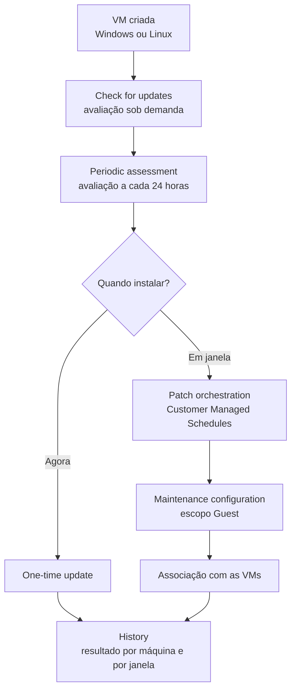

Fala pessoALL! Tudo bem com vocês?

Hoje começamos uma série nova aqui no blog, e o assunto é um que todo mundo de infra conhece bem: **patch**.

Em muito ambiente a atualização das VMs ainda funciona assim: uma planilha com a lista de servidores, alguém entrando máquina por máquina via RDP ou SSH em um sábado à noite, um `apt upgrade` aqui, um Windows Update ali, e a torcida para ninguém esquecer de nenhuma. Funciona com dez VMs. Com cem, vira loteria.

Tem também o outro grupo, o de quem herdou um ambiente que usava o **Update Management do Azure Automation**. Esse serviço foi aposentado em 31 de agosto de 2024, junto com o agente do Log Analytics do qual ele dependia. Se você abriu um Automation Account antigo e encontrou agendamentos de update parados lá dentro, é disso que estou falando. Não conte com eles.

<!-- LUIZ: você já pegou ambiente herdado com o Automation Update Management ainda configurado depois da aposentadoria? Se sim, o que encontrou (agendamentos órfãos, agente antigo instalado)? Uma ou duas frases, sem identificar o ambiente. -->

O substituto é o **Azure Update Manager**, que não depende de Automation Account, de Log Analytics workspace nem do Azure Monitor Agent. É uma capacidade nativa da própria VM.

Só que ele tem uma pegadinha logo na largada, que faz muita janela agendada rodar sem instalar nada. Vamos chegar nela.

**Neste artigo, vamos montar o Azure Update Manager do zero em duas VMs de laboratório, uma Windows Server e uma Ubuntu: avaliação sob demanda, avaliação periódica, o modo de orquestração de patch que a janela agendada exige, uma instalação imediata e a primeira maintenance configuration com escopo Guest. Fechamos conferindo o histórico de execução.**

> O Update Manager não atende tudo. Windows 10 e 11, Virtual Machine Scale Sets e nós de AKS ficam de fora, e cada um tem o seu próprio caminho de atualização. Se o seu problema é um desses, este artigo não resolve.
{: .prompt-warning }

---

## Mas antes, o que o Update Manager faz e o que ele não faz?

O Update Manager é um orquestrador. Ele manda a VM verificar o que está faltando, manda instalar, controla o reboot e guarda o resultado. Quem faz o trabalho dentro do S.O. continua sendo o **Windows Update Agent** no Windows e o **gerenciador de pacotes** no Linux (APT, YUM, Zypper).

Isso tem uma consequência direta: **ele não hospeda nem distribui patch**. A VM busca as atualizações de onde ela já está configurada para buscar. Se o Windows aponta para um WSUS, é o WSUS que manda. Se o Ubuntu aponta para um repositório interno, é dele que vem o pacote.

O que ele cobre:

* VMs do Azure com Windows Server e Linux, de imagem do Marketplace suportada ou de imagem customizada;
* Servidores fora do Azure, desde que conectados pelo **Azure Arc**;
* Avaliação sob demanda e periódica, instalação imediata e instalação agendada;
* Resultado de tudo gravado no Azure Resource Graph.

E o que ele não cobre, que é onde mora a frustração de quem chega esperando outra coisa:

* Windows 10 e 11. Para estação de trabalho a recomendação da Microsoft é o Intune;
* Virtual Machine Scale Sets, que têm o upgrade automático de imagem do próprio scale set;
* Nós de AKS, com processo próprio de atualização, assunto para um próximo artigo;
* Drivers. Eles aparecem na avaliação, mas não são instalados;
* Atualização que exige aceite de EULA, porque ele não aceita em seu nome;
* S.O. de 32 bits;
* **Rollback**. Não existe. Patch aplicado não é desfeito pelo Update Manager.

Se o patch quebrar a aplicação, o serviço não tem botão de voltar. O plano de retorno precisa existir antes da janela, e para isso o blog já tem o artigo de [snapshots de várias VMs por TAGs](https://blog.ruizsolutions.online/posts/criando-snapshot-de-vms-atraves-de-tags/).

Sobre custo: para **VM do Azure** não há cobrança adicional. Para servidor conectado por **Azure Arc** existe cobrança por servidor, com algumas isenções.

---

## O fluxo que vamos seguir



Repare que **avaliar** e **instalar** são coisas separadas. Dá para ligar a avaliação periódica no ambiente inteiro sem instalar um patch sequer, e eu sugiro começar assim em ambiente real: primeiro enxergar, depois mexer.

---

## Os modos de patch orchestration, e a pegadinha

Toda VM do Azure tem uma propriedade chamada **patch orchestration** (no JSON da VM, `patchMode`). Ela diz quem decide a hora de instalar patch naquela máquina.

| No portal | No JSON da VM | Quem decide quando instala |
| --- | --- | --- |
| **Customer Managed Schedules** | `patchMode` = `AutomaticByPlatform` e `bypassPlatformSafetyChecksOnUserSchedule` = `true` | Você, pela maintenance configuration |
| **Azure Managed - Safe Deployment** | `patchMode` = `AutomaticByPlatform` | O Azure, fora do horário de pico da VM |
| **Windows Automatic Updates** | `patchMode` = `AutomaticByOS` | O próprio Windows |
| **Manual updates** | `patchMode` = `Manual` | Ninguém. Só Windows, as atualizações automáticas ficam desligadas |
| **Image Default** | `patchMode` = `ImageDefault` | A configuração que veio na imagem. Só Linux |

Uma VM Windows criada sem ninguém informar o modo nasce em `AutomaticByOS`. Uma VM Linux nasce em `ImageDefault`.

E a janela agendada só funciona em **Customer Managed Schedules**. É pré-requisito documentado: com a VM em qualquer outro modo, o agendamento falha em aplicar o patch.

Agora a pegadinha. Olhe as duas primeiras linhas da tabela. O `patchMode` é o mesmo, `AutomaticByPlatform`. O que separa uma da outra é uma segunda propriedade, a `bypassPlatformSafetyChecksOnUserSchedule`.

Com ela em `true`, a VM espera a sua janela.

Sem ela, a VM entra no **automatic VM guest patching**: o Azure instala sozinho os patches classificados como Critical e Security, fora do horário de pico, no dia que a plataforma escolher dentro do mês. Reboot incluído.

Quem ajusta só o `patchMode` por script ou template, achando que preparou a VM para a janela, entregou a decisão do horário para a plataforma. Em ambiente corporativo, reboot em horário que ninguém combinou é incidente.

E é fácil cair nisso, porque o exemplo de CLI que o Learn traz para VM existente é um `az vm update --set` que muda só o `patchMode`. Ele está na página de automatic VM guest patching e faz exatamente o que a página promete: liga o patch automático da plataforma. Não procure nele o bypass. Até a data deste artigo eu não encontrei no Learn um comando de CLI documentado que grave as duas propriedades em uma VM que já existe. Os caminhos documentados são o portal, que usamos no Passo 4, o template e a Azure Policy.

<!-- LUIZ: já viu VM em AutomaticByPlatform sem o bypass ser atualizada ou reiniciar fora de janela? Se tiver um caso real, cabe aqui em duas frases, sem identificar o ambiente. -->

> Existe um efeito colateral útil nisso. Uma VM em Customer Managed Schedules **sem nenhum agendamento associado** não recebe patch nenhum até você decidir. A própria documentação sugere essa combinação para quem quer desligar as atualizações automáticas de uma VM que nasceu em `AutomaticByOS`.
{: .prompt-tip }

---

## Pré-requisitos

Para o laboratório:

* Uma assinatura do Azure com permissão de **Contributor**. Em ambiente real dá para ser mais restrito: **Virtual Machine Contributor** nas VMs e as permissões de `Microsoft.Maintenance` no resource group onde ficam os agendamentos;
* O provider `Microsoft.Maintenance` registrado na assinatura (o script do Passo 1 faz isso);
* Azure Cloud Shell em **Bash**, ou Azure CLI instalado na sua máquina.

E o que cada tipo de máquina precisa ter para o Update Manager funcionar:

| Tipo de máquina | O que precisa |
| --- | --- |
| VM do Azure com Windows Server | Azure VM Agent, serviço Windows Update em execução e acesso aos endpoints do Windows Update ou ao WSUS configurado |
| VM do Azure com Linux | Azure Linux Agent, Python 2.7 ou superior, conta root no `/etc/sudoers` e acesso aos repositórios de pacotes |
| Servidor fora do Azure | Estar conectado pelo Azure Arc, com o Connected Machine agent |

Você não instala extensão nenhuma. Na primeira operação do Update Manager em uma VM do Azure, a plataforma coloca sozinha a `Microsoft.CPlat.Core.WindowsPatchExtension` ou a `Microsoft.CPlat.Core.LinuxPatchExtension` e cuida do ciclo de vida dela.

> Esse laboratório gera custo. O Update Manager em si não cobra nada para VM do Azure, mas as duas VMs, os discos e os dois IPs públicos Standard cobram enquanto existirem. Se for só estudo, rode a limpeza do final do artigo no mesmo dia.
{: .prompt-info }

---

## Mão na massa!

**Os arquivos deste laboratório estão no meu repositório: [Azure Update Manager](https://github.com/lfrleite/Ruiz-Online/tree/main/Azure%20Update%20Manager)**

A nomenclatura segue o padrão CAF dos últimos artigos:

| Recurso | Nome |
| --- | --- |
| Resource Group | `rg-aum-lab-wus2-001` |
| Virtual Network | `vnet-aum-lab-wus2-001` |
| Subnet | `snet-aum-lab-wus2-001` |
| Network Security Group | `nsg-aum-lab-wus2-001` |
| VM Windows Server 2022 | `vm-aum-win-001` |
| VM Ubuntu 24.04 | `vm-aum-lnx-001` |
| Maintenance configuration | `mc-aum-lab-wus2-001` |

### Passo 1 - Criar as duas VMs do laboratório

Precisamos de duas VMs ligadas, uma Windows e uma Linux, criadas de imagem suportada. Vou criar pelo Cloud Shell para ninguém perder tempo em tela de criação de VM.

Dois detalhes do script.

Cada VM recebe um **IP público Standard**, mas o NSG é criado **sem nenhuma regra de entrada** (`--nsg-rule NONE`). Não vamos fazer RDP nem SSH neste laboratório. O IP público está ali para dar saída explícita para a internet: as subnets de VNets novas nascem privadas, sem o antigo acesso de saída padrão, como já comentei no artigo do [Azure Image Builder](https://blog.ruizsolutions.online/posts/azure-image-builder-windows-linux/). VM sem saída não alcança o Windows Update nem os repositórios APT, e a avaliação falha.

E o script **não define o modo de patch**. Quero que as VMs nasçam no padrão, do jeito que você vai encontrar a maioria das máquinas em um ambiente herdado.

Crie o arquivo `009-criar-lab.sh` com o conteúdo abaixo:

```bash
#!/usr/bin/env bash
# Laboratório do artigo "Azure Update Manager do zero"
# Cria o resource group e duas VMs (Windows Server 2022 e Ubuntu 24.04) sem regra de entrada no NSG.
# Uso: bash 009-criar-lab.sh
# Requisitos: Azure CLI autenticado (az login) ou Cloud Shell em Bash.

set -euo pipefail

RG="rg-aum-lab-wus2-001"
LOCATION="westus2"
VNET="vnet-aum-lab-wus2-001"
SUBNET="snet-aum-lab-wus2-001"
NSG="nsg-aum-lab-wus2-001"
VM_WIN="vm-aum-win-001"
VM_LNX="vm-aum-lnx-001"
VM_SIZE="Standard_D2s_v5"
ADMIN_USER="azureuser"

trap 'echo "ERRO na linha $LINENO. Nada mais foi executado depois deste ponto." >&2' ERR

if ! az account show --only-show-errors >/dev/null 2>&1; then
  echo "Sessão do Azure CLI não encontrada. Rode 'az login' e tente de novo." >&2
  exit 1
fi

echo "Assinatura em uso: $(az account show --query name -o tsv)"

echo "Registrando o provider Microsoft.Maintenance..."
az provider register --namespace Microsoft.Maintenance --only-show-errors

for i in $(seq 1 30); do
  STATE=$(az provider show --namespace Microsoft.Maintenance --query registrationState -o tsv)
  echo "  registrationState: $STATE"
  if [ "$STATE" = "Registered" ]; then
    break
  fi
  if [ "$i" -eq 30 ]; then
    echo "O provider não chegou em Registered depois de 5 minutos. Confira no portal e rode o script de novo." >&2
    exit 1
  fi
  sleep 10
done

echo "Criando o resource group $RG em $LOCATION..."
az group create --name "$RG" --location "$LOCATION" --only-show-errors --output none

# Se o script for rodado de novo, a VM que já existe é mantida como está.
if az vm show --resource-group "$RG" --name "$VM_WIN" --only-show-errors --output none 2>/dev/null; then
  echo "A VM $VM_WIN já existe, seguindo para a próxima."
else
  # A senha do administrador do Windows é digitada na hora e não fica gravada em arquivo nenhum.
  read -r -s -p "Senha do usuário $ADMIN_USER da VM Windows: " WIN_PASSWORD
  echo
  if [ -z "$WIN_PASSWORD" ]; then
    echo "Senha vazia. Abortando." >&2
    exit 1
  fi

  echo "Criando a VM Windows $VM_WIN..."
  az vm create \
    --resource-group "$RG" \
    --name "$VM_WIN" \
    --location "$LOCATION" \
    --image "MicrosoftWindowsServer:WindowsServer:2022-datacenter-azure-edition:latest" \
    --size "$VM_SIZE" \
    --admin-username "$ADMIN_USER" \
    --admin-password "$WIN_PASSWORD" \
    --vnet-name "$VNET" \
    --subnet "$SUBNET" \
    --nsg "$NSG" \
    --nsg-rule NONE \
    --public-ip-address "pip-$VM_WIN" \
    --public-ip-sku Standard \
    --only-show-errors \
    --output none

  unset WIN_PASSWORD
fi

if az vm show --resource-group "$RG" --name "$VM_LNX" --only-show-errors --output none 2>/dev/null; then
  echo "A VM $VM_LNX já existe, nada a criar."
else
  echo "Criando a VM Linux $VM_LNX..."
  az vm create \
    --resource-group "$RG" \
    --name "$VM_LNX" \
    --location "$LOCATION" \
    --image "Canonical:ubuntu-24_04-lts:server:latest" \
    --size "$VM_SIZE" \
    --admin-username "$ADMIN_USER" \
    --generate-ssh-keys \
    --vnet-name "$VNET" \
    --subnet "$SUBNET" \
    --nsg "$NSG" \
    --nsg-rule NONE \
    --public-ip-address "pip-$VM_LNX" \
    --public-ip-sku Standard \
    --only-show-errors \
    --output none
fi

echo
echo "VMs criadas:"
az vm list --resource-group "$RG" --show-details \
  --query "[].{Nome:name, SO:storageProfile.osDisk.osType, Estado:powerState}" \
  --output table

echo
echo "Modo de patch com que cada VM nasceu:"
az vm show --resource-group "$RG" --name "$VM_WIN" \
  --query "osProfile.windowsConfiguration.patchSettings" --output json
az vm show --resource-group "$RG" --name "$VM_LNX" \
  --query "osProfile.linuxConfiguration.patchSettings" --output json
```

Execute:

```bash
bash 009-criar-lab.sh
```

O script pede a senha do administrador da VM Windows na hora. Ela não fica gravada em arquivo nenhum.

<!-- PRINT 002: Cloud Shell com o final da execução do 009-criar-lab.sh, mostrando a tabela com vm-aum-win-001 e vm-aum-lnx-001 em "VM running" e os dois blocos de patchSettings -->
{: .shadow .rounded-10 }
<br>

No final ele mostra o `patchSettings` de cada VM. O formato esperado é parecido com este (exemplo, os seus valores podem trazer mais campos):

```json
{
  "assessmentMode": "ImageDefault",
  "patchMode": "AutomaticByOS"
}
```

Na VM Linux, o `patchMode` deve aparecer como `ImageDefault`.

<!-- PRINT 003: Portal, resource group rg-aum-lab-wus2-001 com a lista de recursos criados (duas VMs, discos, NICs, IPs públicos, VNet e NSG) -->
{: .shadow .rounded-10 }
<br>

---

### Passo 2 - Olhar o estado inicial no Update Manager

Antes de mudar qualquer coisa, vamos ver como o Update Manager enxerga VMs que ninguém configurou.

1. No portal, pesquise por **Azure Update Manager**;
2. No menu da esquerda, clique em **Machines**;
3. Filtre pela sua assinatura e pelo resource group `rg-aum-lab-wus2-001`.

<!-- PRINT 004: Azure Update Manager > Machines filtrado pelo rg-aum-lab-wus2-001, mostrando as duas VMs com a coluna Patch orchestration (Automatic by OS na Windows e Image default na Linux) e o status No updates data -->
{: .shadow .rounded-10 }
<br>

A coluna **Patch orchestration** mostra a VM Windows com atualizações automáticas do S.O. e a Linux com o padrão da imagem. Nenhuma das duas serve para janela agendada.

E as duas aparecem como **No updates data**. Elas podem estar cheias de pendências, só que ninguém perguntou ainda.

---

### Passo 3 - Check for updates: a avaliação sob demanda

A avaliação é a operação mais inofensiva do serviço: ela só lista o que está faltando. Não instala e não reinicia.

1. Ainda em **Machines**, marque as duas VMs;
2. Clique em **Check for updates**;
3. Confirme em **Assess now**.

Aparece uma notificação de avaliação em andamento e, alguns minutos depois, outra de avaliação concluída. É nesse momento que a extensão de patch é instalada nas VMs pela primeira vez. Como a imagem do Marketplace é atualizada com frequência, pode ser que apareçam poucas pendências. O fluxo é o mesmo.

<!-- PRINT 005: Azure Update Manager > Machines depois da avaliação, com as duas VMs mostrando a quantidade de atualizações pendentes e a notificação de Assessment concluída -->
{: .shadow .rounded-10 }
<br>

Clique no nome da VM Windows para abrir a visão de atualizações dela. A lista de **Recommended updates** mostra cada KB com a classificação.

<!-- PRINT 006: VM vm-aum-win-001 > Updates, com a seção Recommended updates listando os KBs pendentes e as classificações -->
{: .shadow .rounded-10 }
<br>

A mesma operação pelo Cloud Shell:

```bash
az vm assess-patches --resource-group rg-aum-lab-wus2-001 --name vm-aum-win-001
az vm assess-patches --resource-group rg-aum-lab-wus2-001 --name vm-aum-lnx-001
```

> A avaliação só funciona em VM **ligada**. Máquina parada ou desalocada não é avaliada e fica sem dados. Se o seu ambiente desliga VMs à noite, como no artigo de [Start/Stop por TAGs](https://blog.ruizsolutions.online/posts/azure-tag-start-stop-vms/), leve isso em conta na hora de escolher o horário.
{: .prompt-warning }

---

### Passo 4 - Ligar a avaliação periódica e trocar o modo de patch

A avaliação sob demanda é uma foto. Para ter o filme, ligamos a **periodic assessment**, que refaz a avaliação a cada 24 horas sem ninguém clicar em nada. No JSON da VM, é a propriedade `assessmentMode` passando para `AutomaticByPlatform`.

Vamos aproveitar a mesma tela para trocar o modo de patch das duas VMs.

1. Em **Azure Update Manager > Machines**, marque as duas VMs;
2. Clique em **Update settings**;
3. Na tela **Change update settings**, as VMs aparecem separadas por S.O.;
4. Em **Periodic assessment**, selecione **Enable** para as duas;
5. Em **Patch orchestration**, selecione **Customer Managed Schedules** para as duas;
6. Deixe **Hotpatch** como está. É um recurso do Windows Server Azure Edition que fica para outro artigo desta série;
7. Clique em **Save**.

<!-- PRINT 007: Tela Change update settings com as duas VMs, Periodic assessment em Enable e Patch orchestration em Customer Managed Schedules, antes de clicar em Save -->
{: .shadow .rounded-10 }
<br>

Ao escolher **Customer Managed Schedules**, o portal ajusta por você as duas propriedades que vimos na tabela: `patchMode` em `AutomaticByPlatform` e `bypassPlatformSafetyChecksOnUserSchedule` em `true`.

Não confie só na tela. Confira:

```bash
az vm show \
  --resource-group rg-aum-lab-wus2-001 \
  --name vm-aum-win-001 \
  --query "osProfile.windowsConfiguration.patchSettings"

az vm show \
  --resource-group rg-aum-lab-wus2-001 \
  --name vm-aum-lnx-001 \
  --query "osProfile.linuxConfiguration.patchSettings"
```

O retorno esperado, nas duas, tem este formato (exemplo):

```json
{
  "assessmentMode": "AutomaticByPlatform",
  "automaticByPlatformSettings": {
    "bypassPlatformSafetyChecksOnUserSchedule": true
  },
  "patchMode": "AutomaticByPlatform"
}
```

<!-- PRINT 008: Cloud Shell com a saída dos dois comandos az vm show, mostrando assessmentMode e patchMode em AutomaticByPlatform e bypassPlatformSafetyChecksOnUserSchedule em true nas duas VMs -->
{: .shadow .rounded-10 }
<br>

Se o `bypassPlatformSafetyChecksOnUserSchedule` não aparecer como `true`, pare aqui e refaça o passo. É exatamente o caso da pegadinha.

> No Windows, a propriedade `enableAutomaticUpdates` só pode ser definida na criação da VM, e ela limita as trocas de modo depois. Uma VM criada com ela em `true` alterna entre `AutomaticByOS` e `AutomaticByPlatform`. Uma criada com ela em `false` alterna entre `Manual` e `AutomaticByPlatform`. Ir direto de `AutomaticByOS` para `Manual` não é suportado.
{: .prompt-info }

Para quem cria VM por template, o trecho que já deixa a máquina pronta para janela agendada é este, e ele vai dentro do `osProfile`:

```bicep
windowsConfiguration: {
  provisionVMAgent: true
  enableAutomaticUpdates: true
  patchSettings: {
    patchMode: 'AutomaticByPlatform'
    assessmentMode: 'AutomaticByPlatform'
    automaticByPlatformSettings: {
      bypassPlatformSafetyChecksOnUserSchedule: true
      rebootSetting: 'IfRequired'
    }
  }
}
```

Em escala, o caminho é Azure Policy. Para a avaliação periódica existe a built-in **Configure periodic checking for missing system updates on Azure virtual machines**. Para o modo de patch existe a **Set prerequisite for Scheduling recurring updates on Azure virtual machines**, que coloca a VM em Customer Managed Schedules gravando as duas propriedades. Os links estão na tabela do final.

---

### Passo 5 - One-time update: instalar agora, em uma VM só

Antes de agendar, vamos instalar sob demanda. É o que você usa em patch emergencial fora de janela e em teste de uma máquina antes de liberar para o resto.

Vou aplicar **só na VM Linux**. A VM Windows fica com as pendências dela de propósito, para a janela do Passo 6 ter o que instalar.

1. Em **Azure Update Manager > Machines**, marque apenas a `vm-aum-lnx-001`;
2. Clique em **One-time update** e depois em **Install now**;
3. Na aba **Machines**, confirme que só a VM Linux está na lista e clique em **Next**;
4. Na aba **Updates**, em **Include update classification**, mantenha as classificações que você quer instalar. A seção **Selected Updates** mostra a prévia do que vai entrar, com base na última avaliação;

<!-- PRINT 009: Install one-time updates > aba Updates, com as classificações selecionadas e a lista Selected Updates da vm-aum-lnx-001 -->
{: .shadow .rounded-10 }
<br>

5. Na aba **Properties**, em **Reboot option**, selecione **Reboot if required**;
6. Em **Maximum duration (in minutes)**, informe:
   ```text
   120
   ```
7. Em **Review + install**, confira o resumo e clique em **Install**.

<!-- PRINT 010: Install one-time updates > aba Properties, com Reboot if required e Maximum duration em 120 minutos -->
{: .shadow .rounded-10 }
<br>

O limite desse campo é **235 minutos**. E ele não funciona como um cronômetro que corta a instalação: quando o tempo acaba, o que já começou termina, e o que ainda não começou nem é tentado.

O equivalente pelo Cloud Shell:

```bash
az vm install-patches \
  --resource-group rg-aum-lab-wus2-001 \
  --name vm-aum-lnx-001 \
  --maximum-duration PT2H \
  --reboot-setting IfRequired \
  --classifications-to-include-linux Critical Security
```

O portal leva você para a tela de **History** assim que a instalação é disparada. Acompanhe por lá até o status mudar para sucesso.

<!-- PRINT 011: Azure Update Manager > History com a execução do one-time update da vm-aum-lnx-001 em status Succeeded e a contagem de atualizações instaladas -->
{: .shadow .rounded-10 }
<br>

> O reboot pode acontecer mesmo com **Never reboot** selecionado. Chaves de registro do Windows Update que controlam reinício continuam valendo dentro do S.O. Se a máquina não pode reiniciar de jeito nenhum naquele horário, confira essas chaves antes, não depois.
{: .prompt-warning }

---

### Passo 6 - Criar a primeira maintenance configuration com escopo Guest

Chegamos na janela agendada.

O Update Manager não tem agendador próprio. Ele usa um recurso do Azure chamado **maintenance configuration**, o mesmo que controla manutenção de host dedicado e de scale set. O que diz que aquele agendamento é de patch dentro do S.O. é o **escopo Guest** (no CLI e na API, `InGuestPatch`).

Os limites do escopo Guest que você precisa conhecer antes de preencher a tela:

| Regra | Valor |
| --- | --- |
| Duração mínima da janela | 1 hora e 30 minutos |
| Duração máxima da janela | 3 horas e 55 minutos |
| Intervalo mínimo de repetição | 6 horas |
| Início da primeira janela | Pelo menos 15 minutos depois da criação do agendamento |
| VM ligada | Pelo menos 15 minutos antes do início da janela |

Para o laboratório vou criar uma janela **diária** começando em 30 minutos, só para vermos a execução acontecer hoje. No final eu mostro como ficaria a recorrência que eu usaria de verdade.

<!-- VALIDAR: conferir na tela real de criação os rótulos da aba Basics (Configuration name, Maintenance scope, Reboot setting), o rótulo do fuso no painel Add/Modify schedule e a ordem das abas (Dynamic scopes, Machines ou Resources, Updates, Tags). A documentação não descreve Reboot setting nem Time zone, e usa duas grafias para o escopo Guest. Ajustar os itens abaixo e os prints 012 a 016 ao que aparecer. -->
1. No portal, pesquise por **Maintenance Configurations** e clique em **Create**;
2. Na aba **Basics**, informe:
   * Subscription: a assinatura do laboratório;
   * Resource group: `rg-aum-lab-wus2-001`;
   * Configuration name:
   ```text
   mc-aum-lab-wus2-001
   ```
   * Region: `West US 2`;
   * Maintenance scope: **Guest (Azure VM, Arc-enabled VMs/servers)**;
   * Reboot setting: **Reboot if required**;

<!-- PRINT 012: Maintenance Configurations > Create > aba Basics preenchida com o resource group rg-aum-lab-wus2-001, nome mc-aum-lab-wus2-001, região West US 2, scope Guest e Reboot if required -->
{: .shadow .rounded-10 }
<br>

3. Ainda em **Basics**, clique em **Add a schedule** e preencha:
   * Start on: a data de hoje, com horário 30 minutos à frente;
   * Time zone: o fuso de Brasília (UTC-03:00);
   * Maintenance window: `2` horas;
   * Repeats: `1` `Day`;
   * Clique em **Save**;

<!-- PRINT 013: Painel Add/Modify schedule com Start on, fuso de Brasília, Maintenance window de 2 horas, Repeats a cada 1 dia e o Schedule summary -->
{: .shadow .rounded-10 }
<br>

4. Pule a parte de escopo dinâmico. Esse é o assunto inteiro do próximo artigo;
5. Na aba **Machines**, clique em **Add machine**, selecione `vm-aum-win-001` e `vm-aum-lnx-001` e confirme;

<!-- PRINT 014: Maintenance Configurations > Create > aba Machines com vm-aum-win-001 e vm-aum-lnx-001 adicionadas -->
{: .shadow .rounded-10 }
<br>

6. Na aba **Updates**, deixe incluídas as classificações **Critical** e **Security**, para Windows e para Linux;

<!-- PRINT 015: Maintenance Configurations > Create > aba Updates com as classificações Critical e Security selecionadas para Windows e Linux -->
{: .shadow .rounded-10 }
<br>

7. Na aba **Tags**, coloque as TAGs da sua governança;
8. Em **Review + create**, confira e clique em **Create**.

<!-- PRINT 016: Maintenance Configurations > Create > Review + create com o resumo da configuração validado -->
{: .shadow .rounded-10 }
<br>

A Microsoft adora mudar o layout do portal. Se alguma aba estiver com nome ou ordem diferente no seu, os campos são os mesmos.

> Existe uma faixa de horário ruim para criar agendamento: entre 23:45 e 00:00. A plataforma avalia o gatilho com atraso e reconfere a data antes de executar, e um agendamento criado nesse intervalo pode simplesmente não disparar. A documentação avisa. Eu evito a última meia hora do dia para qualquer ajuste em maintenance configuration.
{: .prompt-warning }

#### Se preferir pelo Cloud Shell

O script abaixo faz o mesmo que as telas acima. Ele confere se as duas VMs estão em Customer Managed Schedules antes de criar qualquer coisa, e para com erro se não estiverem.

Use o portal **ou** o script, não os dois.

Crie o arquivo `009-maintenance-config.sh`:

```bash
#!/usr/bin/env bash
# Laboratório do artigo "Azure Update Manager do zero"
# Cria a maintenance configuration com escopo Guest (InGuestPatch) e associa as duas VMs do laboratório.
# Uso: bash 009-maintenance-config.sh
# Requisitos: Azure CLI autenticado e as VMs já em Customer Managed Schedules (Passo 4 do artigo).

set -euo pipefail

RG="rg-aum-lab-wus2-001"
LOCATION="westus2"
MC="mc-aum-lab-wus2-001"
VMS=("vm-aum-win-001" "vm-aum-lnx-001")
TIME_ZONE="E. South America Standard Time"
DURATION="02:00"
RECURRENCE="Day"

trap 'echo "ERRO na linha $LINENO. Nada mais foi executado depois deste ponto." >&2' ERR

if ! az account show --only-show-errors >/dev/null 2>&1; then
  echo "Sessão do Azure CLI não encontrada. Rode 'az login' e tente de novo." >&2
  exit 1
fi

# A janela precisa começar pelo menos 15 minutos depois da criação do agendamento.
# Aqui ela começa em 30 minutos, no horário de Brasília, que é o fuso informado em TIME_ZONE.
START=$(TZ="America/Sao_Paulo" date -d "+30 minutes" "+%Y-%m-%d %H:%M")
echo "Início da primeira janela: $START ($TIME_ZONE)"

echo "Conferindo o modo de patch das VMs..."
for VM in "${VMS[@]}"; do
  OS=$(az vm show --resource-group "$RG" --name "$VM" --query "storageProfile.osDisk.osType" -o tsv)
  if [ "$OS" = "Windows" ]; then
    CFG="windowsConfiguration"
  else
    CFG="linuxConfiguration"
  fi
  MODE=$(az vm show --resource-group "$RG" --name "$VM" \
    --query "osProfile.$CFG.patchSettings.patchMode" -o tsv)
  BYPASS=$(az vm show --resource-group "$RG" --name "$VM" \
    --query "osProfile.$CFG.patchSettings.automaticByPlatformSettings.bypassPlatformSafetyChecksOnUserSchedule" -o tsv)
  echo "  $VM: patchMode=$MODE bypassPlatformSafetyChecksOnUserSchedule=$BYPASS"
  if [ "$MODE" != "AutomaticByPlatform" ] || [ "$BYPASS" != "true" ]; then
    echo "A VM $VM não está em Customer Managed Schedules. Ajuste em Update settings antes de seguir." >&2
    exit 1
  fi
done

echo "Criando a maintenance configuration $MC..."
az maintenance configuration create \
  --resource-group "$RG" \
  --resource-name "$MC" \
  --location "$LOCATION" \
  --maintenance-scope InGuestPatch \
  --maintenance-window-start-date-time "$START" \
  --maintenance-window-duration "$DURATION" \
  --maintenance-window-time-zone "$TIME_ZONE" \
  --maintenance-window-recur-every "$RECURRENCE" \
  --reboot-setting IfRequired \
  --install-patches-windows-parameters classifications-to-include="[Critical,Security]" \
  --install-patches-linux-parameters classifications-to-include="[Critical,Security]" \
  --extension-properties InGuestPatchMode="User" \
  --only-show-errors \
  --output none

MC_ID=$(az maintenance configuration show \
  --resource-group "$RG" \
  --resource-name "$MC" \
  --query id -o tsv)

for VM in "${VMS[@]}"; do
  echo "Associando $VM..."
  az maintenance assignment create \
    --resource-group "$RG" \
    --location "$LOCATION" \
    --resource-name "$VM" \
    --resource-type virtualMachines \
    --provider-name Microsoft.Compute \
    --configuration-assignment-name "$MC" \
    --maintenance-configuration-id "$MC_ID" \
    --only-show-errors \
    --output none
done

echo
echo "Associações:"
for VM in "${VMS[@]}"; do
  az maintenance assignment list \
    --provider-name Microsoft.Compute \
    --resource-group "$RG" \
    --resource-name "$VM" \
    --resource-type virtualMachines \
    --query "[].{VM:'$VM', Configuracao:name}" \
    --output table
done
```

Execute:

```bash
bash 009-maintenance-config.sh
```

Dois parâmetros que não são óbvios: o `--extension-properties InGuestPatchMode="User"`, que acompanha todo agendamento de escopo Guest nos exemplos oficiais, e o `--maintenance-window-recur-every`, que aceita texto como `Day`, `Week Saturday,Sunday` ou `Month Fourth Monday`.

---

### Passo 7 - Conferir a associação das VMs

Agendamento criado sem VM associada é um calendário vazio. Vamos conferir que as duas máquinas estão ligadas a ele.

```bash
az maintenance assignment list \
  --provider-name Microsoft.Compute \
  --resource-group rg-aum-lab-wus2-001 \
  --resource-name vm-aum-win-001 \
  --resource-type virtualMachines \
  --query "[].{resource:resourceGroup, configName:name}" \
  --output table
```

Repita trocando o `--resource-name` para `vm-aum-lnx-001`.

<!-- PRINT 017: Cloud Shell com a saída do az maintenance assignment list para as duas VMs, mostrando a associação com a mc-aum-lab-wus2-001 -->
{: .shadow .rounded-10 }
<br>

No portal, a mesma informação está em **Maintenance Configurations > mc-aum-lab-wus2-001 > Machines**.

Esse tipo de associação, VM por VM, se chama **estática**. Para duas máquinas de laboratório resolve.

---

### Passo 8 - Acompanhar a janela e ler o histórico

Agora é esperar o horário. Não desligue as VMs.

Quando a janela dispara, o Update Manager faz, em cada máquina, nesta ordem: uma avaliação nova, a instalação das atualizações que batem com as classificações escolhidas, o reboot se for necessário e uma avaliação final. No Windows as atualizações entram uma por vez. No Linux, em lotes.

1. Abra **Azure Update Manager** e clique em **History**;
2. Selecione a visão **By maintenance run ID**.

Cada linha é uma execução de janela, com o status, a quantidade de máquinas atualizadas, a maintenance configuration e o horário de início e fim.

<!-- PRINT 018: Azure Update Manager > History > By maintenance run ID, com a execução da mc-aum-lab-wus2-001, status e quantidade de máquinas atualizadas -->
{: .shadow .rounded-10 }
<br>

3. Clique no **Maintenance run ID** para abrir o detalhe.

<!-- PRINT 019: Detalhe do maintenance run, com o gráfico de status por máquina e a lista de máquinas e atualizações instaladas -->
{: .shadow .rounded-10 }
<br>

Como a VM Linux já tinha sido atualizada no Passo 5, o esperado é que ela apareça com pouca coisa ou nada instalado, e que o trabalho pesado fique com a VM Windows.

Um detalhe que confunde quem confere por dentro do servidor: as atualizações instaladas pelo Update Manager **não aparecem** no histórico da tela Windows Update da VM. Ele instala pela API do Windows Update Agent, e essa tela só mostra o que passou pelo fluxo normal do S.O. A fonte da verdade é o History do portal.

Sobre como ler o status:

| Status | O que significa |
| --- | --- |
| **Succeeded** | Tudo que foi selecionado instalou, e reboot e avaliação final deram certo |
| **Failed** | Pelo menos uma atualização falhou, o reboot não aconteceu ou estourou o tempo, ou a avaliação inicial ou final falhou |
| **Completed with warnings** | Instalou, mas ficou algo pendente. O caso clássico é atualização que pede reboot com **Never reboot** selecionado |

Todo esse histórico mora no **Azure Resource Graph**, e dá para consultar direto. Salve a consulta abaixo como `009-historico.kql`, ou cole no **Resource Graph Explorer**:

```kusto
// Histórico de instalação de patches dos últimos 30 dias (Azure Resource Graph)
// Uma linha por execução e por máquina, da mais recente para a mais antiga.
patchinstallationresources
| where type !has "softwarepatches"
| extend prop = parse_json(properties)
| extend
    Maquina = tostring(split(id, "/")[8]),
    Inicio = todatetime(prop.startDateTime),
    SO = tostring(prop.osType),
    Status = tostring(prop.status),
    IniciadoPor = tostring(prop.startedBy),
    Instalados = toint(prop.installedPatchCount),
    Falharam = toint(prop.failedPatchCount),
    Pendentes = toint(prop.pendingPatchCount),
    Reboot = tostring(prop.rebootStatus),
    JanelaEstourou = tostring(prop.maintenanceWindowExceeded),
    MaintenanceRunId = tostring(prop.maintenanceRunId)
| where Inicio > ago(30d)
| project Inicio, Maquina, resourceGroup, SO, Status, IniciadoPor, Instalados, Falharam, Pendentes, Reboot, JanelaEstourou, MaintenanceRunId
| order by Inicio desc
```

<!-- PRINT 020: Resource Graph Explorer com a consulta 009-historico.kql executada e as linhas do one-time update e da janela agendada no resultado -->
{: .shadow .rounded-10 }
<br>

A coluna `IniciadoPor` separa o que foi disparado por usuário do que foi disparado pela plataforma, e a `MaintenanceRunId` vem preenchida nas execuções de janela.

> O Resource Graph guarda as atualizações pendentes por **7 dias** e os resultados de instalação por **30 dias**. Se a sua auditoria pede histórico de um ano, o Update Manager sozinho não entrega, e é preciso exportar esses dados para um lugar seu. Relatório de compliance fica para um próximo artigo desta série.
{: .prompt-danger }

---

## E a recorrência de verdade?

Janela diária foi só para o laboratório render no mesmo dia.

Em ambiente real eu amarro a janela ao **Patch Tuesday**, a segunda terça-feira do mês. No portal, a repetição mensal permite escolher "segunda terça-feira" e somar um deslocamento de -6 a +6 dias. Segunda terça com +4 cai no sábado seguinte. No CLI, o mesmo valor vai no `--maintenance-window-recur-every`:

```text
Month Second Tuesday Offset4
```

Sobre o tamanho da janela, três regras que eu sigo.

Não uso menos de 2 horas para Windows Server. O Update Manager reserva 10 minutos para reboot, e com menos de 25 minutos restantes ele nem tenta a próxima atualização. O resultado aparece como **Maintenance window exceeded**.

Não deixo **Never reboot** como padrão. Patch que pede reboot e não reinicia é patch que não está valendo.

E não coloco todas as máquinas no mesmo agendamento. A maintenance configuration dispara em **todas as VMs associadas ao mesmo tempo**, e só as que estão em um mesmo availability set deixam de ser atualizadas juntas. Dois servidores da mesma aplicação na mesma janela podem reiniciar juntos.

<!-- LUIZ: qual duração de janela você costuma usar para Windows Server com cumulative update, e já viu "Maintenance window exceeded" com janela menor? Uma frase com o número que você pratica fecha bem este trecho. -->

---

## Erros comuns

Esta série vai ter um artigo só de troubleshooting. Aqui ficam os que aparecem na primeira tentativa.

### A janela rodou e não instalou nada

Quase sempre é a VM fora de Customer Managed Schedules. Confira as duas propriedades:

```bash
az vm show \
  --resource-group rg-aum-lab-wus2-001 \
  --name vm-aum-win-001 \
  --query "osProfile.windowsConfiguration.patchSettings"
```

Se o `bypassPlatformSafetyChecksOnUserSchedule` não estiver em `true`, volte ao Passo 4.

---

### A VM estava desligada

Máquina desligada não recebe patch, e precisa estar ligada pelo menos 15 minutos antes da janela. Ela pode até aparecer no portal como se tivesse perdido a associação com o agendamento. É só exibição. Confirme o estado e a associação:

```bash
az vm list \
  --resource-group rg-aum-lab-wus2-001 \
  --show-details \
  --query "[].{Nome:name, Estado:powerState}" \
  --output table
```

```bash
az maintenance assignment list \
  --provider-name Microsoft.Compute \
  --resource-group rg-aum-lab-wus2-001 \
  --resource-name vm-aum-win-001 \
  --resource-type virtualMachines \
  --output table
```

---

### A avaliação falha ou a VM fica sem dados

Comece pela rede. VM sem saída para a internet, ou com proxy e firewall bloqueando os endpoints de atualização, não consegue avaliar. No Windows o sintoma costuma vir como um código `HRESULT` na tela, e códigos como `0x8024402C` apontam para conectividade.

O teste mais simples é tentar atualizar por dentro do S.O. Se o `apt update` ou o Windows Update local também falham, o problema não é do Update Manager.

Depois, olhe a extensão de patch:

```bash
az vm extension list \
  --resource-group rg-aum-lab-wus2-001 \
  --vm-name vm-aum-lnx-001 \
  --output table
```

Se a extensão de patch existir e não estiver em `Succeeded`, remova a extensão e dispare um **Check for updates** para ela ser reinstalada.

Os logs ficam dentro da VM:

```text
Windows: C:\WindowsAzure\Logs\Plugins\Microsoft.CPlat.Core.WindowsPatchExtension<versão>\WindowsUpdateExtension.log
Linux:   /var/log/azure/Microsoft.CPlat.Core.LinuxPatchExtension/<número de sequência>.core.log
```

No Linux, se esse log trouxer `Unable to invoke sudo successfully`, a conta root não está no `/etc/sudoers`. A extensão roda como root e precisa dessa entrada.

---

## Checklist

- [x] Passo 1 - Criar as duas VMs do laboratório e registrar o provider `Microsoft.Maintenance`;
- [x] Passo 2 - Conferir o estado inicial das VMs no Update Manager;
- [x] Passo 3 - Executar a avaliação sob demanda com Check for updates;
- [x] Passo 4 - Ligar a periodic assessment e trocar o modo para Customer Managed Schedules;
- [x] Passo 5 - Instalar atualizações sob demanda na VM Linux com One-time update;
- [x] Passo 6 - Criar a maintenance configuration com escopo Guest;
- [x] Passo 7 - Conferir a associação das VMs com o agendamento;
- [x] Passo 8 - Acompanhar a janela e ler o histórico no portal e no Resource Graph.

---

## Limpeza do ambiente

Tudo do laboratório está em um resource group só, incluindo a maintenance configuration. Para remover:

```bash
az group delete \
  --name rg-aum-lab-wus2-001 \
  --yes \
  --no-wait
```

> Em ambiente real, muito cuidado com esse comando. Ele remove tudo dentro do resource group, sem pedir confirmação.
{: .prompt-danger }

Se você pretende seguir a série, pode manter o resource group, que o próximo artigo continua nele. Nesse caso, desaloque as máquinas no fim do dia para não pagar computação à toa.

---

## Artigos

| Nome | Link |
| :---: | :---: |
| Arquivos deste laboratório | <https://github.com/lfrleite/Ruiz-Online/tree/main/Azure%20Update%20Manager> |
| Criando snapshots de várias VMs por TAGs | <https://blog.ruizsolutions.online/posts/criando-snapshot-de-vms-atraves-de-tags/> |
| Start/Stop de VMs por TAGs | <https://blog.ruizsolutions.online/posts/azure-tag-start-stop-vms/> |
| Azure Image Builder na prática | <https://blog.ruizsolutions.online/posts/azure-image-builder-windows-linux/> |
| What is Azure Update Manager? | <https://learn.microsoft.com/en-us/azure/update-manager/overview> |
| How Update Manager works | <https://learn.microsoft.com/en-us/azure/update-manager/workflow-update-manager> |
| Prerequisites for Azure Update Manager | <https://learn.microsoft.com/en-us/azure/update-manager/prerequisites> |
| Supported operating systems | <https://learn.microsoft.com/en-us/azure/update-manager/support-matrix-updates> |
| Unsupported workloads | <https://learn.microsoft.com/en-us/azure/update-manager/unsupported-workloads> |
| Update options and orchestration | <https://learn.microsoft.com/en-us/azure/update-manager/updates-maintenance-schedules> |
| Manage update configuration settings | <https://learn.microsoft.com/en-us/azure/update-manager/manage-update-settings> |
| Assessment options | <https://learn.microsoft.com/en-us/azure/update-manager/assessment-options> |
| Check update compliance | <https://learn.microsoft.com/en-us/azure/update-manager/view-updates> |
| Deploy updates now and track results | <https://learn.microsoft.com/en-us/azure/update-manager/deploy-updates> |
| Schedule recurring updates | <https://learn.microsoft.com/en-us/azure/update-manager/scheduled-patching> |
| Manage multiple machines | <https://learn.microsoft.com/en-us/azure/update-manager/manage-multiple-machines> |
| Automate assessment at scale by using Azure Policy | <https://learn.microsoft.com/en-us/azure/update-manager/periodic-assessment-at-scale> |
| Manage updates programmatically for Azure VMs | <https://learn.microsoft.com/en-us/azure/update-manager/manage-vms-programmatically> |
| Query Update Manager data in Azure Resource Graph | <https://learn.microsoft.com/en-us/azure/update-manager/query-logs> |
| Sample Azure Resource Graph queries | <https://learn.microsoft.com/en-us/azure/update-manager/sample-query-logs> |
| Troubleshoot known issues with Azure Update Manager | <https://learn.microsoft.com/en-us/azure/update-manager/troubleshoot> |
| Roles and permissions in Azure Update Manager | <https://learn.microsoft.com/en-us/azure/update-manager/roles-permissions> |
| Azure Update Manager FAQ | <https://learn.microsoft.com/en-us/azure/update-manager/update-manager-faq> |
| Automatic Guest Patching for Azure VMs | <https://learn.microsoft.com/en-us/azure/virtual-machines/automatic-vm-guest-patching> |
| Azure Policy built-in definitions for Azure Virtual Machines | <https://learn.microsoft.com/en-us/azure/virtual-machines/policy-reference> |
| Managing VM updates with Maintenance Configurations | <https://learn.microsoft.com/en-us/azure/virtual-machines/maintenance-configurations> |
| Maintenance Configurations with the Azure CLI | <https://learn.microsoft.com/en-us/azure/virtual-machines/maintenance-configurations-cli> |
| az maintenance configuration | <https://learn.microsoft.com/en-us/cli/azure/maintenance/configuration> |
| Scalable Windows virtual machine patch management | <https://learn.microsoft.com/en-us/azure/architecture/virtual-machines/patch-management> |
| Default outbound access in Azure | <https://learn.microsoft.com/en-us/azure/virtual-network/ip-services/default-outbound-access> |
| What's new in Azure Automation | <https://learn.microsoft.com/en-us/azure/automation/whats-new> |

---

## The End!

Chegamos ao fim do primeiro artigo da série de patch.

O Update Manager é simples. O que derruba é a propriedade que ninguém confere: janela criada, máquinas associadas, tudo verde no portal, e a VM em `AutomaticByOS` ignorando o agendamento. Ou pior, em `AutomaticByPlatform` sem o bypass, sendo atualizada no horário que a plataforma escolheu.

Por isso a minha ordem em qualquer ambiente é sempre a mesma. Primeiro a avaliação periódica em tudo, que não instala nada e já mostra o tamanho do problema. Depois as VMs em Customer Managed Schedules. Só então a janela.

O que fizemos hoje tem um limite claro: associamos duas VMs na mão. Com vinte ainda dá. Com duzentas, a VM criada na semana passada fica de fora da janela e ninguém percebe até a auditoria perguntar.

É isso que resolvemos no próximo artigo: ondas de patch para DEV, HML e PRD com escopo dinâmico, onde a TAG da máquina decide em qual janela ela entra.

Janela que roda não é o mesmo que máquina atualizada. Confira o histórico.

Espero que vocês tenham curtido tanto quanto eu curti de produzi-lo. Deixem seus comentários no meu Linkedin sobre o que você achou e se fez sentido!

Obrigado mais uma vez por me acompanharem até aqui! Nos vemos na próxima!
