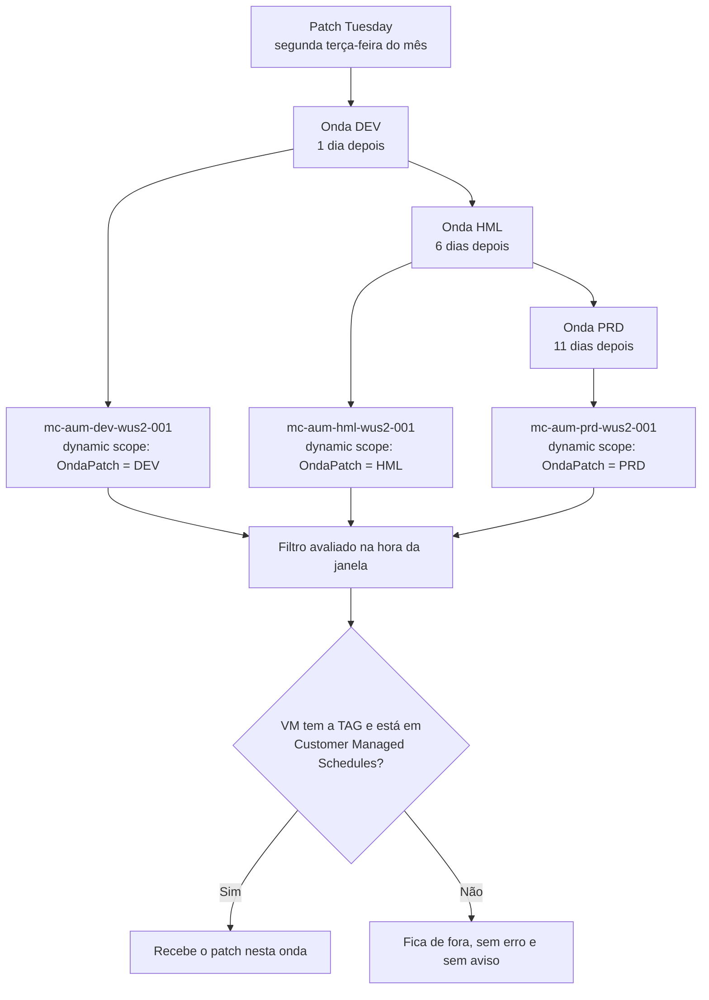

Fala pessoALL! Bora continuar a série de patch?

No [artigo anterior](https://blog.ruizsolutions.online/posts/azure-update-manager-do-zero/) nós saímos do zero no **Azure Update Manager**: avaliação periódica, modos de orquestração e uma maintenance configuration com duas VMs associadas na mão. Para duas VMs funciona muito bem.

Agora imagine um ambiente com 300 VMs.

Alguém precisa lembrar de entrar na maintenance configuration e adicionar cada máquina nova. Alguém precisa tirar a que foi desativada. E alguém precisa saber, de cabeça, que aquele servidor é de homologação e não pode ir na mesma noite que a produção. Esse "alguém" normalmente é uma planilha, e planilha não avisa quando fica desatualizada.

O pior da lista manual é que a VM esquecida não gera erro. Ela nunca aparece em nenhuma janela, passa meses sem patch e só é descoberta quando sai num relatório de vulnerabilidade.

<!-- LUIZ: você já encontrou VM que ficou fora da janela de patch porque ninguém incluiu na lista? Uma ou duas frases contando como foi descoberto, sem citar onde. -->

No artigo de [Start/Stop de VMs com TAGs](https://blog.ruizsolutions.online/posts/azure-tag-start-stop-vms/) e no de [snapshots por TAG](https://blog.ruizsolutions.online/posts/criando-snapshot-de-vms-atraves-de-tags/) nós já usamos a mesma saída: a própria VM carrega uma TAG dizendo como deve ser tratada, e a automação procura pela TAG. Para patch, quem faz esse papel é o **dynamic scope**.

**Neste artigo, vamos montar três ondas de patch (DEV, HML e PRD), cada uma com a sua maintenance configuration e o seu dynamic scope filtrando por TAG, com defasagem entre elas amarrada ao Patch Tuesday. Depois vamos criar uma VM nova para ver o que acontece com quem chega depois e conferir no Resource Graph quais máquinas cada escopo resolve.**

> Não adote esse modelo antes de ter governança de TAG. Com dynamic scope a TAG deixa de ser etiqueta e passa a decidir qual servidor reinicia em qual noite. Se qualquer pessoa consegue criar ou alterar TAG em VM de produção sem passar por GMUD, resolva isso primeiro.
{: .prompt-warning }

---

## Associação estática ou escopo dinâmico?

A maintenance configuration com escopo **Guest** aceita dois jeitos de dizer quais máquinas ela atualiza, e eles podem conviver no mesmo agendamento.

Na **associação estática** você escolhe as máquinas uma a uma. Foi o que fizemos no artigo anterior. A lista fica gravada no agendamento e só muda quando alguém edita.

No **dynamic scope** você grava um filtro: assinatura, resource group, região, tipo de S.O. e TAGs. A lista de máquinas não existe até a hora da janela. A documentação é bem direta nesse ponto: os critérios são avaliados **no momento da execução**, e as máquinas que aparecem na prévia durante a criação podem ser diferentes das que serão atualizadas.

É isso que resolve o problema da VM esquecida. Colocou a TAG, entrou. Tirou a TAG, saiu. Ninguém abre o agendamento.

Sendo bem sincero, associação estática não se sustenta acima de algumas dezenas de VMs. E ela tem um efeito colateral pouco conhecido: se uma VM é recriada com o mesmo nome, a associação antiga continua apontando para a máquina que não existe mais, e a janela pode falhar com `ShutdownOrUnresponsive`. O Learn informa que o sistema refaz a associação sozinho, e o prazo muda conforme a página: 8 horas no troubleshooting do Update Manager, 12 horas no de Maintenance Configurations. Eu conto com as 12. Se a janela cair nesse intervalo, a VM fica sem patch naquele mês.

O desenho das ondas fica assim:



Por que uma maintenance configuration por onda e não uma só com três escopos? Porque ela dispara a atualização de **todos os recursos associados ao mesmo tempo**. Quem separa ambiente é o agendamento, e a própria documentação recomenda configurações separadas para desenvolvimento e produção, em horários que não se sobreponham.

E por que uma única chave de TAG com três valores? Porque uma VM só consegue ter um valor por chave. Com `OndaPatch` valendo `DEV`, `HML` ou `PRD`, é impossível a mesma máquina cair em duas ondas por engano.

---

## Como fica a defasagem entre as ondas

O patch entra primeiro onde quebrar dói menos, e você ganha alguns dias para perceber problema antes de chegar na produção.

O detalhe está em como amarrar as datas. O primeiro impulso é agendar a produção para "o terceiro sábado do mês". Só que o terceiro sábado não tem distância fixa do Patch Tuesday. Em outubro de 2026 o Patch Tuesday cai no dia 13 e o terceiro sábado no dia 17, quatro dias depois. Em novembro o Patch Tuesday é dia 10 e o terceiro sábado é dia 21, onze dias depois. Sua defasagem muda todo mês sem ninguém ter mexido em nada.

A maintenance configuration resolve isso com **offset**: você ancora a recorrência em um dia da semana do mês e soma ou subtrai de 1 a 6 dias. Com isso as três ondas ficam presas ao Patch Tuesday:

| Onda | TAG na VM | Recorrência | Quando cai | Outubro de 2026 |
| --- | --- | --- | --- | --- |
| DEV | `OndaPatch=DEV` | `Month Second Tuesday Offset1` | quarta-feira, 1 dia depois | 14/10 |
| HML | `OndaPatch=HML` | `Month Second Tuesday Offset6` | segunda-feira, 6 dias depois | 19/10 |
| PRD | `OndaPatch=PRD` | `Month Third Tuesday Offset4` | sábado, 11 dias depois | 24/10 |

O offset vai no máximo até 6. Para chegar nos 11 dias da produção eu ancorei na **terceira** terça-feira, que é sempre exatamente uma semana depois da segunda, e somei 4.

<!-- LUIZ: qual defasagem entre HML e PRD você costuma praticar e por quê? Se já teve um patch que quebrou em HML e foi segurado antes de chegar em PRD, vale uma frase. -->

> As ondas não conversam entre si. Não encontrei na documentação nenhuma dependência entre maintenance configurations: a de PRD dispara no horário dela, tenha a de DEV dado certo ou não. O intervalo só protege se alguém olhar o resultado da onda anterior. Existe um jeito de cancelar uma execução a partir de um pre-event, e isso fica para o próximo artigo.
{: .prompt-danger }

---

## Limites do dynamic scope

Antes de desenhar as ondas de um ambiente grande, confira os números. Todos estão na documentação de scheduled patching:

| Item | Limite |
| --- | --- |
| Recursos associados em cada dynamic scope | 1.000 |
| Total de recursos associados a um agendamento | 3.000 |
| Dynamic scopes por agendamento | 200 |
| Assinaturas somadas em todos os dynamic scopes de um agendamento | 200 |
| Agendamentos por assinatura por região | 250 |
| Dynamic scopes por resource group ou assinatura por região | 250 |
| Filtros de TAG por dynamic scope | 50 |
| Filtros de resource group por dynamic scope | 50 |

Fora os números, quatro comportamentos pegam quem está começando:

- O dynamic scope é criado no nível de **assinatura** ou de **resource group**, e essa escolha não pode ser editada depois;
- Um dynamic scope pertence a um único agendamento;
- Pelo **portal**, o filtro aceita um único valor por chave de TAG. Para dois valores na mesma chave, só por CLI ou PowerShell, por exemplo `--filter-tags "{OndaPatch:[PRD1,PRD2]}"`;
- Em VM do Azure, o dynamic scope exige o **Patch orchestration** em **Customer Managed Schedules**. Servidor com Azure Arc não tem esse pré-requisito.

Onda com mais de 1.000 VMs em uma assinatura precisa ser quebrada, por exemplo em `PRD1` e `PRD2`. O Passo 5 tem a consulta que mostra o tamanho de cada onda.

---

## Pré-requisitos

- Uma assinatura de laboratório com permissão de **Contributor**. A documentação de Maintenance Configurations pede no mínimo essa role e o registro do resource provider **Microsoft.Maintenance**;
- Em ambiente real, para quem só opera agendamento, a recomendação do Learn é a role **Scheduled Patching Contributor** no escopo onde o dynamic scope é criado e no escopo da maintenance configuration;
- **Azure CLI** na versão 2.75.0 ou superior, que é o que a extensão `maintenance` pede, ou o **Cloud Shell** em Bash;
- Ter lido o [artigo anterior](https://blog.ruizsolutions.online/posts/azure-update-manager-do-zero/). Aqui eu não repito o que é patch orchestration nem periodic assessment.

> O que custa dinheiro neste laboratório: quatro VMs `Standard_D2s_v5` ligadas, os discos e os IPs públicos Standard, mais as duas VMs do artigo anterior se você manteve o laboratório. O Azure Update Manager não tem cobrança adicional para VMs do Azure. Faça a limpeza do final do artigo no mesmo dia.
{: .prompt-info }

---

## Mão na massa!

### Passo 1 - Criar as VMs de cada onda

Vamos subir uma VM Ubuntu por onda, já com a TAG. Usei Linux nas três para o laboratório sair mais barato e sem senha. Para Windows nada muda no dynamic scope.

**O script está no meu repositório: [010-lab-vms.sh](https://github.com/lfrleite/Ruiz-Online/blob/main/Azure%20Update%20Manager/010-lab-vms.sh)**

```bash
#!/usr/bin/env bash
# Artigo 010 - Ondas de patch com escopo dinâmico e TAGs
# Cria o resource group e uma VM Ubuntu por onda (DEV, HML e PRD), cada uma com a TAG da sua onda.
# Usa os mesmos nomes de resource group, VNet, subnet e NSG do laboratório do artigo 009.
# Se eles ainda existirem, são reaproveitados. Se não, são criados agora.
# Uso: ./010-lab-vms.sh
# Autenticação: use o Cloud Shell ou rode "az login" antes. Nenhuma credencial fica no script.

set -euo pipefail

RG="${RG:-rg-aum-lab-wus2-001}"
LOCATION="${LOCATION:-westus2}"
VNET="${VNET:-vnet-aum-lab-wus2-001}"
SUBNET="${SUBNET:-snet-aum-lab-wus2-001}"
NSG="${NSG:-nsg-aum-lab-wus2-001}"
IMAGE="${IMAGE:-Canonical:ubuntu-24_04-lts:server:latest}"
SIZE="${SIZE:-Standard_D2s_v5}"
TAG_KEY="${TAG_KEY:-OndaPatch}"
ONDAS="${ONDAS:-DEV HML PRD}"

trap 'echo "ERRO na linha $LINENO. Nada foi removido, corrija e rode de novo." >&2' ERR

command -v az >/dev/null 2>&1 || { echo "Azure CLI não encontrada." >&2; exit 1; }
az account show --only-show-errors --output none || { echo "Sem sessão ativa. Rode az login." >&2; exit 1; }

echo "Assinatura em uso: $(az account show --query name --output tsv)"

echo "Registrando o provider Microsoft.Maintenance..."
az provider register --namespace Microsoft.Maintenance --only-show-errors --output none

echo "Criando o resource group $RG em $LOCATION..."
az group create --name "$RG" --location "$LOCATION" --only-show-errors --output none

for ONDA in $ONDAS; do
  VM="vm-aum-$(echo "$ONDA" | tr '[:upper:]' '[:lower:]')-001"

  if az vm show --resource-group "$RG" --name "$VM" --only-show-errors --output none 2>/dev/null; then
    echo "A VM $VM já existe, seguindo para a próxima."
    continue
  fi

  echo "Criando a VM $VM com a TAG $TAG_KEY=$ONDA..."
  az vm create \
    --resource-group "$RG" \
    --name "$VM" \
    --location "$LOCATION" \
    --image "$IMAGE" \
    --size "$SIZE" \
    --admin-username azureuser \
    --generate-ssh-keys \
    --vnet-name "$VNET" \
    --subnet "$SUBNET" \
    --nsg "$NSG" \
    --nsg-rule NONE \
    --public-ip-address "pip-$VM" \
    --public-ip-sku Standard \
    --tags "$TAG_KEY=$ONDA" Ambiente=Lab \
    --only-show-errors \
    --output none
done

echo "VMs do laboratório:"
az vm list \
  --resource-group "$RG" \
  --query "[].{Nome:name, Onda:tags.$TAG_KEY, SO:storageProfile.osDisk.osType}" \
  --output table

echo "Estado do provider Microsoft.Maintenance: $(az provider show --namespace Microsoft.Maintenance --query registrationState --output tsv)"
```

No Cloud Shell:

```bash
chmod +x 010-lab-vms.sh
./010-lab-vms.sh
```

<!-- PRINT 002: Cloud Shell com o final da execução do 010-lab-vms.sh, mostrando a tabela com vm-aum-dev-001, vm-aum-hml-001 e vm-aum-prd-001, a coluna Onda com DEV, HML e PRD e o provider Microsoft.Maintenance como Registered -->
{: .shadow .rounded-10 }
<br>

> O script usa os mesmos nomes de resource group, VNet, subnet e NSG do laboratório do artigo anterior. Se você ainda está com ele de pé, as VMs novas entram ao lado das antigas. Se já apagou, tudo é criado de novo.
{: .prompt-info }

> Repare no `--nsg-rule NONE`: nenhuma porta de entrada é aberta. O IP público de cada VM está ali só para dar saída para a internet, porque subnet nova nasce privada e VM sem saída não baixa patch. Em ambiente real o caminho é NAT Gateway ou firewall, como fizemos no artigo de [Azure Image Builder](https://blog.ruizsolutions.online/posts/azure-image-builder-windows-linux/).
{: .prompt-tip }

---

### Passo 2 - Colocar as VMs em Customer Managed Schedules

As VMs nasceram com o modo de patch padrão da imagem, e o dynamic scope exige **Customer Managed Schedules**. Esse ajuste vem antes de qualquer agendamento.

1. No portal, pesquise por **Azure Update Manager** e abra **Machines**;
2. Filtre pelo resource group `rg-aum-lab-wus2-001` e observe a coluna **Patch orchestration**;

<!-- PRINT 003: Azure Update Manager > Machines filtrado por rg-aum-lab-wus2-001, com as três VMs do laboratório e a coluna Patch orchestration ainda no modo padrão da imagem (o esperado para Linux é Image Default) -->
{: .shadow .rounded-10 }
<br>

3. Marque as três VMs e clique em **Update settings**;
4. Na tela **Change update settings**, ajuste para as três:
   * **Periodic assessment**: `Enable`;
   * **Patch orchestration**: `Customer Managed Schedules`;
5. Clique em **Save**.

<!-- PRINT 004: tela Change update settings com as três VMs listadas, Periodic assessment em Enable e Patch orchestration em Customer Managed Schedules, antes do clique em Save -->
{: .shadow .rounded-10 }
<br>

Por baixo, essa opção grava duas propriedades na VM: `patchMode` igual a `AutomaticByPlatform` e `bypassPlatformSafetyChecksOnUserSchedule` igual a `true`. Dá para conferir pelo Cloud Shell:

```bash
az vm show \
  --resource-group rg-aum-lab-wus2-001 \
  --name vm-aum-dev-001 \
  --query "osProfile.linuxConfiguration.patchSettings" \
  --output json
```

O formato esperado é este (exemplo):

```json
{
  "assessmentMode": "AutomaticByPlatform",
  "automaticByPlatformSettings": {
    "bypassPlatformSafetyChecksOnUserSchedule": true
  },
  "patchMode": "AutomaticByPlatform"
}
```

<!-- PRINT 005: Cloud Shell com a saída do az vm show da vm-aum-dev-001 mostrando patchMode AutomaticByPlatform e bypassPlatformSafetyChecksOnUserSchedule true -->
{: .shadow .rounded-10 }
<br>

> VM em **Customer Managed Schedules** sai do patch automático e passa a depender só do agendamento. Mudou o modo e esqueceu a TAG? Você acabou de criar um servidor que nunca mais atualiza.
{: .prompt-danger }

---

### Passo 3 - Criar a onda DEV pelo portal

A primeira onda eu faço pelo portal para vocês verem cada tela. Como ninguém vai esperar o Patch Tuesday para ver a janela rodar, a DEV do laboratório fica com recorrência **diária** e começa daqui a pouco. A recorrência de verdade é a da tabela lá de cima.

<!-- VALIDAR: conferir na tela real os rótulos da aba Basics (Configuration name, Region, Maintenance scope, Reboot setting se existir) e o rótulo do fuso no painel Add/Modify schedule. A documentação só diz "all options in Instance details". Manter igual ao Passo 6 do artigo 009. -->
1. No **Azure Update Manager**, em **Overview**, clique em **Schedule updates**;
2. Na aba **Basics** de **Create a maintenance configuration**, informe:
   * Resource group: `rg-aum-lab-wus2-001`;
   * Configuration name:
   ```text
   mc-aum-dev-wus2-001
   ```
   * Region: `West US 2`;
   * Maintenance scope: **Guest (Azure VM, Arc-enabled VMs/servers)**;

<!-- PRINT 006: Create a maintenance configuration, aba Basics preenchida com rg-aum-lab-wus2-001, mc-aum-dev-wus2-001, West US 2 e Maintenance scope Guest (Azure VM, Arc-enabled VMs/servers) -->
{: .shadow .rounded-10 }
<br>

3. Clique em **Add a schedule** e, no painel **Add/Modify schedule**, defina:
   * **Start on**: hoje, uns 40 minutos à frente do horário atual, no fuso de Brasília;
   * **Maintenance window**: 2 horas;
   * **Repeats**: a cada 1 dia;
4. Confira o **Schedule summary** e salve o agendamento.

<!-- PRINT 007: painel Add/Modify schedule com Start on cerca de 40 minutos à frente, fuso de Brasília, Maintenance window de 2 horas, Repeats diário e o Schedule summary visível -->
{: .shadow .rounded-10 }
<br>

> A janela do escopo Guest tem mínimo de 1 hora e 30 minutos e máximo de 3 horas e 55 minutos. O início precisa ficar pelo menos 15 minutos depois da criação, e qualquer mudança no agendamento ou no escopo tem que terminar 15 minutos antes do disparo. Por isso os 40 minutos de folga. A documentação também pede para não criar agendamento novo entre 23h45 e 00h00.
{: .prompt-warning }

Agora a parte que interessa.

5. Vá para a aba **Dynamic scopes** e clique em **Add a dynamic scope**;
6. Selecione a sua **subscription**, que é o campo obrigatório;

<!-- PRINT 008: aba Dynamic scopes com o painel Add a dynamic scope aberto e a assinatura do laboratório selecionada -->
{: .shadow .rounded-10 }
<br>

7. Em **Filter by**, clique em **Select** e preencha:
   * Resource group: `rg-aum-lab-wus2-001`;
   * Location: `West US 2`;
   * OS type: `Windows` e `Linux`;
   * Tags: chave `OndaPatch`, valor `DEV`;
8. Clique em **Ok**;

<!-- PRINT 009: painel Select Filter by preenchido com resource group rg-aum-lab-wus2-001, location West US 2, os dois tipos de S.O. e a TAG OndaPatch com valor DEV -->
{: .shadow .rounded-10 }
<br>

9. Em **Preview of machines based on above scope** deve aparecer somente a `vm-aum-dev-001`. Clique em **Save**;

<!-- PRINT 010: Preview of machines based on above scope listando apenas a vm-aum-dev-001 -->
{: .shadow .rounded-10 }
<br>

10. O portal abre o painel **Configure Azure VMs for schedule updates** com duas opções. Escolha **Continue with supported machines only** e clique em **Save**.

<!-- PRINT 011: painel Configure Azure VMs for schedule updates com as opções Change the required options to ensure schedule supportability e Continue with supported machines only, a segunda marcada -->
{: .shadow .rounded-10 }
<br>

A outra opção, **Change the required options to ensure schedule supportability**, muda em seu nome o Patch orchestration das VMs que o filtro alcançar. No laboratório tanto faz, porque já ajustamos no Passo 2. Em ambiente real eu não oriento usar: mudança de modo de patch tem que ser decisão consciente, registrada em GMUD, e não efeito colateral de um filtro por TAG.

11. Na aba **Updates**, em **Include update classification**, deixe apenas **Critical** e **Security** para Windows e para Linux;

<!-- PRINT 012: aba Updates com Include update classification mostrando somente Critical e Security selecionados para Windows e para Linux -->
{: .shadow .rounded-10 }
<br>

12. Avance até **Review + create**, confira e clique em **Create**.

<!-- PRINT 013: aba Review + create da mc-aum-dev-wus2-001 com o resumo do agendamento, do dynamic scope e das classificações, antes do clique em Create -->
{: .shadow .rounded-10 }
<br>

A aba **Machines** ficou vazia de propósito. O agendamento aceita máquina estática e dynamic scope juntos, mas misturar os dois é o jeito mais rápido de ninguém mais saber por que uma VM está naquela janela.

---

### Passo 4 - Criar as ondas HML e PRD por script

Repetir doze cliques para cada onda é pedir para errar um campo. As outras duas vão pela CLI, já com a recorrência mensal da tabela.

<!-- VALIDAR: (1) o tutorial oficial cria o dynamic scope de assinatura com "-l global", e a página Manage a dynamic scope diz que a atribuição no nível de assinatura deve ter location vazio. Rodar como está e, se o comando recusar ou o escopo não aparecer em Dynamic scopes, remover a linha --location global. (2) conferir se --filter-tags "{OndaPatch:[HML]}" e --filter-resource-groups são aceitos pela versão instalada da extensão maintenance, já que o comando é Experimental. -->
**Baixe o script: [010-criar-ondas.sh](https://github.com/lfrleite/Ruiz-Online/blob/main/Azure%20Update%20Manager/010-criar-ondas.sh)**

```bash
#!/usr/bin/env bash
# Artigo 010 - Ondas de patch com escopo dinâmico e TAGs
# Cria uma maintenance configuration (escopo Guest) por onda e associa a ela um dynamic scope
# no nível da assinatura, filtrando pela TAG da onda.
#
# Uso padrão (cria HML e PRD, a DEV foi criada pelo portal no Passo 3):
#   ./010-criar-ondas.sh
#
# Tudo pela CLI, com a DEV em recorrência diaria para o teste do laboratório:
#   ONDAS="DEV HML PRD" DEV_RECUR="Day" \
#   DEV_START="$(TZ=America/Sao_Paulo date -d '+40 minutes' '+%Y-%m-%d %H:%M')" \
#   ./010-criar-ondas.sh
#
# Autenticação: use o Cloud Shell ou rode "az login" antes. Nenhuma credencial fica no script.

set -euo pipefail

RG="${RG:-rg-aum-lab-wus2-001}"
LOCATION="${LOCATION:-westus2}"
TAG_KEY="${TAG_KEY:-OndaPatch}"
TIME_ZONE="${TIME_ZONE:-E. South America Standard Time}"
DURATION="${DURATION:-02:00}"
START_TIME="${START_TIME:-22:00}"
ONDAS="${ONDAS:-HML PRD}"

# A data de início é só o ponto de partida. A primeira execução acontece na primeira
# recorrência depois dela, então amanhã serve para qualquer onda mensal.
START_DATE="${START_DATE:-$(TZ=America/Sao_Paulo date -d '+1 day' '+%Y-%m-%d')}"

trap 'echo "ERRO na linha $LINENO. Confira a mensagem acima antes de rodar de novo." >&2' ERR

command -v az >/dev/null 2>&1 || { echo "Azure CLI não encontrada." >&2; exit 1; }
az account show --only-show-errors --output none || { echo "Sem sessão ativa. Rode az login." >&2; exit 1; }

SUBSCRIPTION_ID="$(az account show --query id --output tsv)"

ESTADO_RP="$(az provider show --namespace Microsoft.Maintenance --query registrationState --output tsv)"
if [ "$ESTADO_RP" != "Registered" ]; then
  echo "O provider Microsoft.Maintenance está como '$ESTADO_RP'. Registre e aguarde antes de continuar:" >&2
  echo "  az provider register --namespace Microsoft.Maintenance" >&2
  exit 1
fi

az group show --name "$RG" --only-show-errors --output none || { echo "Resource group $RG não encontrado." >&2; exit 1; }

for ONDA in $ONDAS; do
  case "$ONDA" in
    DEV)
      RECUR="${DEV_RECUR:-Month Second Tuesday Offset1}"
      START="${DEV_START:-$START_DATE $START_TIME}"
      ;;
    HML)
      RECUR="Month Second Tuesday Offset6"
      START="$START_DATE $START_TIME"
      ;;
    PRD)
      RECUR="Month Third Tuesday Offset4"
      START="$START_DATE $START_TIME"
      ;;
    *)
      echo "Onda desconhecida: $ONDA. Use DEV, HML ou PRD." >&2
      exit 1
      ;;
  esac

  SUFIXO="$(echo "$ONDA" | tr '[:upper:]' '[:lower:]')"
  MC_NAME="mc-aum-$SUFIXO-wus2-001"
  DS_NAME="ds-aum-$SUFIXO"

  echo "[$ONDA] Criando a maintenance configuration $MC_NAME ($RECUR, início em $START)..."
  az maintenance configuration create \
    --resource-group "$RG" \
    --resource-name "$MC_NAME" \
    --maintenance-scope InGuestPatch \
    --location "$LOCATION" \
    --maintenance-window-duration "$DURATION" \
    --maintenance-window-recur-every "$RECUR" \
    --maintenance-window-start-date-time "$START" \
    --maintenance-window-time-zone "$TIME_ZONE" \
    --install-patches-linux-parameters classifications-to-include="[Critical,Security]" \
    --install-patches-windows-parameters classifications-to-include="[Critical,Security]" \
    --reboot-setting IfRequired \
    --extension-properties InGuestPatchMode="User" \
    --tags "$TAG_KEY=$ONDA" Ambiente=Lab \
    --only-show-errors \
    --output none

  MC_ID="$(az maintenance configuration show \
    --resource-group "$RG" \
    --resource-name "$MC_NAME" \
    --query id \
    --output tsv)"

  echo "[$ONDA] Criando o dynamic scope $DS_NAME com o filtro $TAG_KEY=$ONDA..."
  az maintenance assignment create-or-update-subscription \
    --subscription "$SUBSCRIPTION_ID" \
    --name "$DS_NAME" \
    --maintenance-configuration-id "$MC_ID" \
    --location global \
    --filter-resource-groups "$RG" \
    --filter-locations "$LOCATION" \
    --filter-os-types windows linux \
    --filter-tags "{$TAG_KEY:[$ONDA]}" \
    --filter-tags-operator All \
    --only-show-errors \
    --output none

  echo "[$ONDA] Pronto."
done

echo "Dynamic scopes da assinatura:"
az maintenance assignment list-subscription --output json
```

Execute:

```bash
chmod +x 010-criar-ondas.sh
./010-criar-ondas.sh
```

<!-- PRINT 014: Cloud Shell com a execução do 010-criar-ondas.sh mostrando as linhas [HML] e [PRD] de criação da maintenance configuration e do dynamic scope, terminando em Pronto -->
{: .shadow .rounded-10 }
<br>

Três pontos do script merecem explicação.

O comando `az maintenance assignment create-or-update-subscription` está marcado como **Experimental** na referência da CLI, então a sintaxe pode mudar entre versões da extensão. Em PowerShell, o equivalente é o `New-AzConfigurationAssignment` com `-FilterTag`, `-FilterOsType` e `-FilterLocation`.

O escopo foi criado no nível da **assinatura** com `--location global`, como no tutorial oficial, e o resource group entrou como filtro. Não confunda os dois parâmetros de região: `--location` é da atribuição e `--filter-locations` é o filtro das VMs. Em ambiente real eu tiraria o filtro de resource group, porque a graça é qualquer VM da assinatura com a TAG entrar na onda.

E a data de início de um agendamento mensal não é a data da primeira execução. A primeira execução acontece na **primeira recorrência depois** dela.

Confira as três configurações no portal:

1. No **Azure Update Manager**, abra **Machines** e clique em **Maintenance configurations**;
2. Abra a `mc-aum-hml-wus2-001` e clique em **Dynamic scopes**.

<!-- PRINT 015: lista Maintenance configurations com mc-aum-dev-wus2-001, mc-aum-hml-wus2-001 e mc-aum-prd-wus2-001, todas com scope InGuestPatch -->
{: .shadow .rounded-10 }
<br>

<!-- PRINT 016: mc-aum-hml-wus2-001 > Dynamic scopes mostrando o escopo ds-aum-hml com o filtro de TAG OndaPatch = HML -->
{: .shadow .rounded-10 }
<br>

---

### Passo 5 - Conferir quais máquinas cada escopo resolve

Aqui mora a pergunta que mais importa em ambiente real: **quem vai ser atualizado na próxima janela?**

O portal responde em três lugares:

- Na maintenance configuration, em **Dynamic scopes**, você vê o filtro gravado e as máquinas que ele alcança;
- No **Azure Update Manager**, em **Machines**, a coluna **Associated schedules** mostra o agendamento de cada VM;
- Na própria VM, em **Updates**, a aba **Scheduling** mostra a mesma informação.

Só que nenhum desses lugares mostra quem **deveria** estar e não está. Para isso eu prefiro reproduzir o filtro no **Azure Resource Graph** e cruzar com o modo de patch e com o estado da VM.

**As quatro consultas deste passo estão no arquivo [010-ondas-de-patch.kql](https://github.com/lfrleite/Ruiz-Online/blob/main/Azure%20Update%20Manager/010-ondas-de-patch.kql)**

Abra o **Resource Graph Explorer** e rode a primeira:

```kusto
// 1. Quem cada onda vai pegar: TAG, modo de patch e estado da VM
resources
| where type =~ 'microsoft.compute/virtualmachines'
| extend onda = tostring(tags['OndaPatch'])
| extend osType = tostring(properties.storageProfile.osDisk.osType)
| extend patchSettings = iff(osType =~ 'Windows',
    properties.osProfile.windowsConfiguration.patchSettings,
    properties.osProfile.linuxConfiguration.patchSettings)
| extend patchMode = tostring(patchSettings.patchMode)
| extend bypass = coalesce(tobool(patchSettings.automaticByPlatformSettings.bypassPlatformSafetyChecksOnUserSchedule), false)
| extend powerState = tostring(properties.extended.instanceView.powerState.code)
| extend situacao = case(
    isempty(onda), 'Sem TAG de onda',
    onda !in ('DEV', 'HML', 'PRD'), 'Valor de TAG fora do padrão',
    patchMode != 'AutomaticByPlatform' or bypass == false, 'TAG ok, modo de patch errado',
    powerState != 'PowerState/running', 'TAG ok, VM desligada',
    'Pronta para a janela')
| project name, resourceGroup, subscriptionId, osType, onda, patchMode, bypass, powerState, situacao
| order by onda asc, name asc
```

<!-- PRINT 017: Resource Graph Explorer com o resultado da consulta 1, mostrando as três VMs do laboratório com onda DEV, HML e PRD e a coluna situacao como Pronta para a janela -->
{: .shadow .rounded-10 }
<br>

A coluna `situacao` separa cinco casos. Os que me preocupam são **TAG ok, modo de patch errado** e **Sem TAG de onda**: nos dois a VM fica fora de qualquer janela e nada acusa erro.

Se o laboratório do artigo anterior ainda estiver de pé, a `vm-aum-win-001` e a `vm-aum-lnx-001` aparecem como **Sem TAG de onda**. Elas continuam recebendo patch pela associação estática de lá, e a consulta não sabe disso. É mais um motivo para não misturar os dois modelos.

> Padronize a grafia. Na consulta, `tags['OndaPatch']` não encontra `ondapatch`, e o valor `Dev` cai em **Valor de TAG fora do padrão**. Eu sugiro chave e valores definidos em um único lugar e, mais para frente, aplicados por Azure Policy.
{: .prompt-info }

A segunda consulta mostra o tamanho de cada onda contra o limite de 1.000 recursos por dynamic scope:

```kusto
// 2. Tamanho de cada onda por assinatura e região, comparado ao limite de 1.000 recursos por dynamic scope
resources
| where type =~ 'microsoft.compute/virtualmachines'
| extend onda = tostring(tags['OndaPatch'])
| where isnotempty(onda)
| summarize vms = count() by onda, subscriptionId, location
| extend percentualDoLimite = round(100.0 * vms / 1000, 1)
| order by vms desc
```

A terceira lista as atribuições gravadas, ou seja, qual recurso está ligado a qual maintenance configuration:

```kusto
// 3. Atribuições gravadas: qual recurso está ligado a qual maintenance configuration
maintenanceresources
| where type =~ 'microsoft.maintenance/configurationassignments'
| project atribuicao = name,
    configuracao = tostring(properties.maintenanceConfigurationId),
    recurso = tostring(properties.resourceId)
| order by configuracao asc
```

As mesmas consultas rodam pela CLI com `az graph query -q "<consulta>"`. Na primeira vez a CLI instala a extensão `resource-graph`.

---

### Passo 6 - O que acontece com a VM criada depois

Esse é o teste que justifica o artigo inteiro. Vamos criar uma VM nova com a TAG da onda DEV e não encostar em nenhum agendamento.

```bash
az vm create \
  --resource-group rg-aum-lab-wus2-001 \
  --name vm-aum-dev-002 \
  --location westus2 \
  --image Canonical:ubuntu-24_04-lts:server:latest \
  --size Standard_D2s_v5 \
  --admin-username azureuser \
  --generate-ssh-keys \
  --vnet-name vnet-aum-lab-wus2-001 \
  --subnet snet-aum-lab-wus2-001 \
  --nsg nsg-aum-lab-wus2-001 \
  --nsg-rule NONE \
  --public-ip-address pip-vm-aum-dev-002 \
  --public-ip-sku Standard \
  --tags OndaPatch=DEV Ambiente=Lab
```

Rode de novo a consulta 1 do passo anterior.

<!-- PRINT 018: Resource Graph Explorer com a consulta 1 mostrando a vm-aum-dev-002 com onda DEV e situacao TAG ok, modo de patch errado, ao lado das outras VMs como Pronta para a janela -->
{: .shadow .rounded-10 }
<br>

A VM tem a TAG certa e mesmo assim aparece como **TAG ok, modo de patch errado**.

É o erro que todo mundo comete na primeira tentativa. O dynamic scope resolve a lista sozinho, mas não muda o modo de patch de VM que nasceu depois. A TAG é metade do requisito.

Para corrigir esta VM:

1. Abra a `vm-aum-dev-002`, vá em **Updates** e clique em **Update settings**;
2. Ajuste **Patch orchestration** para `Customer Managed Schedules` e **Periodic assessment** para `Enable`;
3. Clique em **Save**.

Rode a consulta mais uma vez e a situação muda para **Pronta para a janela**. Abra a `mc-aum-dev-wus2-001`, vá em **Dynamic scopes** e a lista de máquinas do escopo agora traz as duas VMs, sem ninguém ter editado o agendamento.

<!-- PRINT 019: mc-aum-dev-wus2-001 > Dynamic scopes com a lista de máquinas do escopo mostrando vm-aum-dev-001 e vm-aum-dev-002 -->
{: .shadow .rounded-10 }
<br>

Em ambiente real, corrigir na mão depois não escala. E não conte com um `az vm update` para isso: o único exemplo de CLI do Learn para VM existente muda só o `patchMode`, sem o bypass, e isso entrega a VM para o patch automático da plataforma. A VM precisa nascer certa, e os caminhos documentados são estes:

- Na criação pelo portal, aba **Management**, em **Patch orchestration options**, escolher **Azure-orchestrated**. Segundo o Learn, essa opção grava as duas propriedades de uma vez;
- Em template (Bicep ou Terraform), declarar `patchMode` e `bypassPlatformSafetyChecksOnUserSchedule` no perfil de S.O. da VM;
- Atribuir a policy built-in **Set prerequisite for Scheduling recurring updates on Azure virtual machines**, que coloca a VM em Customer Managed Schedules gravando as duas propriedades. É a que combina com dynamic scope: a policy cuida do modo e a TAG cuida da onda;
- Usar a policy built-in **Schedule recurring updates using Azure Update Manager**, que associa as máquinas a um agendamento filtrando também por TAG e, segundo a documentação, acerta o Patch orchestration das VMs do Azure. É uma alternativa ao dynamic scope, com remediação e relatório de compliance, e com uma atribuição de policy a mais para cuidar.

O caminho inverso também funciona pela TAG. Para mover uma VM de onda, troque o valor:

```bash
VM_ID=$(az vm show \
  --resource-group rg-aum-lab-wus2-001 \
  --name vm-aum-dev-002 \
  --query id \
  --output tsv)

az tag update \
  --resource-id "$VM_ID" \
  --operation Merge \
  --tags OndaPatch=HML
```

Para tirar a VM de todas as ondas, remova a TAG. A documentação confirma que remover a TAG desfaz a associação automaticamente. Só respeite os 15 minutos antes da janela.

Quem tem permissão de escrever TAG em uma VM tem, na prática, o poder de colocar ou tirar esse servidor de uma janela com reboot.

<!-- LUIZ: como você trata alteração de TAG em VM de produção no dia a dia (GMUD, Policy com deny, role específica)? Uma frase com a prática que você recomenda fecha bem este trecho. -->

> Antes de seguir, devolva a `vm-aum-dev-002` para a onda DEV com o mesmo comando e `OndaPatch=DEV`, e confirme que ainda faltam mais de 15 minutos para a janela.
{: .prompt-tip }

---

### Passo 7 - Acompanhar a janela da onda DEV

Aguarde o horário definido no Passo 3. As VMs precisam estar ligadas pelo menos 15 minutos antes do início. Máquina desligada não recebe patch.

1. No **Azure Update Manager**, abra **History** e selecione **By maintenance run ID**;

<!-- PRINT 020: Azure Update Manager > History > By maintenance run ID mostrando a execução da mc-aum-dev-wus2-001 com Status, Updated machines, Operation start time e Operation end time -->
{: .shadow .rounded-10 }
<br>

2. Clique no **Maintenance run ID** para abrir o detalhe, com o gráfico de status e a lista de máquinas e de updates daquela rodada.

<!-- PRINT 021: detalhe do maintenance run da onda DEV com o gráfico de status das máquinas e a lista contendo vm-aum-dev-001 e vm-aum-dev-002 -->
{: .shadow .rounded-10 }
<br>

A `vm-aum-dev-002` tem que estar na lista. Ela foi criada depois do agendamento, ninguém a associou a nada, e entra porque o filtro é avaliado na hora.

A `vm-aum-hml-001` e a `vm-aum-prd-001` ficam de fora. As ondas delas só rodam depois do próximo Patch Tuesday.

A quarta consulta do arquivo mostra o mesmo resultado pelo Resource Graph, uma linha por rodada:

```kusto
// 4. Execuções das janelas: quantas VMs cada rodada de cada onda alcançou
maintenanceresources
| where type =~ 'microsoft.maintenance/applyupdates'
| where properties.maintenanceScope =~ 'InGuestPatch'
| extend configuracao = tostring(properties.maintenanceConfigurationId)
| extend execucao = tostring(properties.correlationId)
| extend vm = tostring(properties.resourceId)
| extend inicio = todatetime(properties.startDateTime)
| extend fim = todatetime(properties.endDateTime)
| summarize vms = dcount(vm), inicio = min(inicio), fim = max(fim) by configuracao, execucao
| order by inicio desc
```

<!-- PRINT 022: Resource Graph Explorer com o resultado da consulta 4, mostrando a execução da mc-aum-dev-wus2-001 com vms igual a 2 e as colunas inicio e fim -->
{: .shadow .rounded-10 }
<br>

O `correlationId` é o identificador da rodada. Com ele você encontra todas as VMs que participaram da mesma execução, e essa é a evidência que eu anexaria na GMUD antes de liberar a onda seguinte.

---

## Erros comuns

### A VM tem a TAG e não foi atualizada

Quase sempre é o modo de patch. Confira as duas propriedades:

```bash
az vm show \
  --resource-group rg-aum-lab-wus2-001 \
  --name vm-aum-dev-002 \
  --query "osProfile.linuxConfiguration.patchSettings" \
  --output json
```

Para Windows, troque `linuxConfiguration` por `windowsConfiguration`. Se `patchMode` não for `AutomaticByPlatform` ou o `bypassPlatformSafetyChecksOnUserSchedule` não for `true`, ajuste em **Update settings**.

Se as propriedades estiverem certas, olhe o estado das VMs:

```bash
az vm list \
  --resource-group rg-aum-lab-wus2-001 \
  --show-details \
  --query "[].{Nome:name, Onda:tags.OndaPatch, Estado:powerState}" \
  --output table
```

Quem usa Start/Stop por TAG para desligar máquina à noite precisa combinar os horários, ou a janela vai encontrar a VM desligada.

---

### A criação do dynamic scope falha

A documentação de troubleshooting lista duas causas. A primeira é permissão: a assinatura precisa estar registrada no provider e quem cria precisa de acesso no escopo do dynamic scope e no da maintenance configuration.

```bash
az provider show \
  --namespace Microsoft.Maintenance \
  --query registrationState \
  --output tsv
```

A segunda só vale para escopo criado no nível de resource group: a validação falha quando a lista de regiões do filtro vai vazia. Informe a região.

---

### O agendamento mensal não rodou na data de início

Não é erro. A primeira execução é a primeira recorrência depois da data de início. O portal mostra as quatro primeiras execuções na criação, e eu sugiro conferir ali antes de prometer data para alguém. Para ver o que ficou gravado:

```bash
az maintenance configuration show \
  --resource-group rg-aum-lab-wus2-001 \
  --resource-name mc-aum-prd-wus2-001 \
  --output json
```

---

### A VM está em duas maintenance configurations e só uma dispara

Acontece quando as duas têm o mesmo horário de disparo. O Learn trata como limitação atual e recomenda mudar o horário de uma delas. Com uma única chave de TAG isso só aparece quando sobra associação estática antiga. A consulta 3 do Passo 5 mostra quem está ligado a quê.

---

### O patch parou depois que a VM mudou de resource group

Mover o recurso de resource group ou de assinatura faz o agendamento parar de funcionar para ele. Com dynamic scope, o procedimento documentado é esperar a próxima execução para a atribuição antiga ser removida, mover a VM e só então recriar a atribuição.

---

### O dynamic scope não executa e nenhuma VM é atualizada

Em ambiente grande, a causa documentada é throttling na hora de resolver o filtro. Confirme que a soma de assinaturas nos dynamic scopes do agendamento não passa de 200:

```bash
az maintenance assignment list-subscription --output json
```

---

## Checklist

- [x] Passo 1 - Criar uma VM por onda com a TAG `OndaPatch`;
- [x] Passo 2 - Colocar as VMs em Customer Managed Schedules e ligar o Periodic assessment;
- [x] Passo 3 - Criar a maintenance configuration da onda DEV com dynamic scope pelo portal;
- [x] Passo 4 - Criar as ondas HML e PRD por script, com recorrência ancorada no Patch Tuesday;
- [x] Passo 5 - Conferir no Resource Graph quais máquinas cada escopo resolve;
- [x] Passo 6 - Criar uma VM depois do agendamento, corrigir o modo de patch e ver a VM entrar na onda;
- [x] Passo 7 - Acompanhar a janela da onda DEV no History e no Resource Graph.

---

## Limpeza do ambiente

Os dynamic scopes foram criados no nível da assinatura, fora do resource group. Eu não contaria com a exclusão do resource group para limpar esses escopos, então eles saem primeiro.

O da onda DEV foi criado pelo portal: abra a `mc-aum-dev-wus2-001`, vá em **Dynamic scopes**, selecione o escopo e clique em **Remove dynamic scope**.

Os outros dois saem pela CLI, e a listagem no final confirma que não sobrou nada:

```bash
for ONDA in hml prd; do
  az maintenance assignment delete-subscription --name "ds-aum-$ONDA" --yes
done

az maintenance assignment list-subscription --output json
```

Depois apague o resource group, que leva as VMs, os discos, os IPs públicos e as três maintenance configurations:

```bash
az group delete \
  --name rg-aum-lab-wus2-001 \
  --yes \
  --no-wait
```

<!-- PRINT 023: Cloud Shell com a saída do az maintenance assignment list-subscription sem nenhum escopo do laboratório e o comando az group delete executado -->
{: .shadow .rounded-10 }
<br>

> Em ambiente real, muito cuidado com esse comando. Ele remove tudo dentro do resource group, inclusive o laboratório do artigo anterior, se ele ainda estiver lá.
{: .prompt-danger }

> Se for recriar uma maintenance configuration com o mesmo nome, espere 20 minutos. O Learn registra que a nova pode herdar propriedades da que foi apagada.
{: .prompt-info }

---

## Artigos

| Nome | Link |
| :---: | :---: |
| Arquivos deste laboratório | <https://github.com/lfrleite/Ruiz-Online/tree/main/Azure%20Update%20Manager> |
| Azure Update Manager do zero | <https://blog.ruizsolutions.online/posts/azure-update-manager-do-zero/> |
| Start/Stop de VMs com TAGs | <https://blog.ruizsolutions.online/posts/azure-tag-start-stop-vms/> |
| Criando snapshots de várias VMs rapidamente | <https://blog.ruizsolutions.online/posts/criando-snapshot-de-vms-atraves-de-tags/> |
| Azure Image Builder na prática | <https://blog.ruizsolutions.online/posts/azure-image-builder-windows-linux/> |
| About dynamic scoping | <https://learn.microsoft.com/en-us/azure/update-manager/dynamic-scope-overview> |
| Manage a dynamic scope | <https://learn.microsoft.com/en-us/azure/update-manager/manage-dynamic-scoping> |
| Tutorial: Schedule updates on dynamic scopes | <https://learn.microsoft.com/en-us/azure/update-manager/tutorial-dynamic-grouping-for-scheduled-patching> |
| Schedule recurring updates for machines | <https://learn.microsoft.com/en-us/azure/update-manager/scheduled-patching> |
| Automatic Guest Patching for Azure VMs | <https://learn.microsoft.com/en-us/azure/virtual-machines/automatic-vm-guest-patching> |
| Azure Policy built-in definitions for Azure Virtual Machines | <https://learn.microsoft.com/en-us/azure/virtual-machines/policy-reference> |
| Troubleshoot known issues with Azure Update Manager | <https://learn.microsoft.com/en-us/azure/update-manager/troubleshoot> |
| Managing VM updates with Maintenance Configurations | <https://learn.microsoft.com/en-us/azure/virtual-machines/maintenance-configurations> |
| Control updates with Maintenance Configurations and the Azure CLI | <https://learn.microsoft.com/en-us/azure/virtual-machines/maintenance-configurations-cli> |
| Troubleshoot problems with Maintenance Configurations | <https://learn.microsoft.com/en-us/azure/virtual-machines/troubleshoot-maintenance-configurations> |
| Manage update configuration settings | <https://learn.microsoft.com/en-us/azure/update-manager/manage-update-settings> |
| Manage multiple machines with Azure Update Manager | <https://learn.microsoft.com/en-us/azure/update-manager/manage-multiple-machines> |
| Roles and permissions in Azure Update Manager | <https://learn.microsoft.com/en-us/azure/update-manager/roles-permissions> |
| Access Azure Update Manager operations data using Azure Resource Graph | <https://learn.microsoft.com/en-us/azure/update-manager/query-logs> |
| Sample Azure Resource Graph queries | <https://learn.microsoft.com/en-us/azure/update-manager/sample-query-logs> |
| az maintenance configuration | <https://learn.microsoft.com/en-us/cli/azure/maintenance/configuration> |
| az maintenance assignment | <https://learn.microsoft.com/en-us/cli/azure/maintenance/assignment> |
| New-AzConfigurationAssignment | <https://learn.microsoft.com/en-us/powershell/module/az.maintenance/new-azconfigurationassignment> |
| Azure Update Manager frequently asked questions | <https://learn.microsoft.com/en-us/azure/update-manager/update-manager-faq> |

---

## The End!

Chegamos ao fim de mais um laboratório da série.

Com o dynamic scope, a lista de servidores de cada janela sai da planilha e vai para a própria VM. Quem sobe a máquina escolhe a onda na hora de criar, e ninguém mais edita agendamento por causa de uma VM.

O cuidado vem junto. A TAG sozinha não basta: sem o modo de patch certo, a VM fica de fora e ninguém é avisado. E alterar TAG virou mudança, porque é ela que decide quem reinicia.

Minha opinião: acima de algumas dezenas de VMs, associação estática é dívida. Escopo dinâmico sem a consulta de conferência do Passo 5 também é. Rode aquela consulta antes de cada Patch Tuesday e trate **Sem TAG de onda** e **TAG ok, modo de patch errado** como pendência.

O próximo passo é parar de depender de gente para a TAG existir: exigir e herdar TAG por Azure Policy, assunto de um próximo artigo aqui do blog.

E ficou uma ponta solta. As ondas instalam o patch, mas não tiram snapshot, não testam a aplicação e não desfazem nada.

Onda de patch sem ponto de retorno é aposta.

No próximo artigo da série vamos fazer a própria janela disparar o snapshot das VMs antes de instalar, usando pre-event.

Espero que vocês tenham curtido tanto quanto eu curti de produzi-lo. Deixem seus comentários no meu Linkedin sobre o que você achou e se fez sentido!

Obrigado mais uma vez por me acompanharem até aqui! Nos vemos na próxima!
