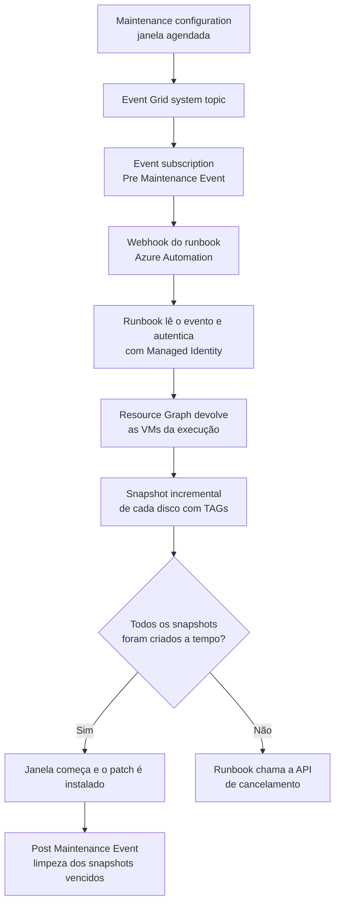

Fala pessoALL! Bora fechar a ponta que ficou solta nos últimos dois artigos?

No [primeiro artigo da série](https://blog.ruizsolutions.online/posts/azure-update-manager-do-zero/) colocamos o Azure Update Manager para rodar, e no [segundo](https://blog.ruizsolutions.online/posts/azure-update-manager-escopo-dinamico-tags/) separamos as VMs em ondas de DEV, HML e PRD usando TAGs. A janela abre sozinha, o patch entra sozinho, a VM reinicia sozinha.

E se o patch quebrar a aplicação?

Lá em 2025 eu publiquei um artigo sobre [como criar snapshots de várias VMs com TAGs](https://blog.ruizsolutions.online/posts/criando-snapshot-de-vms-atraves-de-tags/) e outro sobre [como remover esses snapshots depois](https://blog.ruizsolutions.online/posts/removendo-snapshots-de-forma-automatizada/). Os dois funcionam, mas dependem de alguém lembrar de executar o script antes da janela. Com a janela abrindo às 3 da manhã, esse alguém ou acorda, ou roda o script às 18h e aceita um snapshot com nove horas de atraso, ou esquece.

Sendo bem sincero, quase sempre esquece.

O Azure Update Manager tem um recurso feito para esse buraco: os **pre e post maintenance events**. Antes de a janela começar, a maintenance configuration publica um evento no **Event Grid**, e você pendura nesse evento o que quiser que aconteça antes do patch.

<!-- LUIZ: você já precisou voltar uma VM por snapshot depois de um patch que quebrou algo? Se sim, vale contar em duas frases o que quebrou e quanto tempo levou a volta, sem citar onde. -->

**Neste artigo, vamos ligar o pre-event de uma maintenance configuration a um runbook do Azure Automation, com Managed Identity e PowerShell 7.4, que descobre quais VMs estão na janela e cria um snapshot incremental de cada disco com TAGs de rastreio. No final entra um post-event opcional para limpar os snapshots vencidos.**

> Snapshot de disco não é backup. Ele serve para voltar rápido de um patch ruim nos dias seguintes à janela. Retenção longa, restauração de arquivo e proteção contra exclusão continuam sendo trabalho do Azure Backup. Este artigo também não cobre servidores Azure Arc: o evento funciona para eles, mas não existe managed disk para fotografar.
{: .prompt-warning }

---

## Mas antes, como funcionam o pre e o post event?

Toda maintenance configuration pode ser origem de eventos no Event Grid. Ela emite dois tipos:

| Evento | Quando é publicado |
| --- | --- |
| `Microsoft.Maintenance.PreMaintenanceEvent` | Antes de a janela começar |
| `Microsoft.Maintenance.PostMaintenanceEvent` | Depois que a instalação termina |

Você cria uma **event subscription** na maintenance configuration, escolhe o tipo de evento e aponta para um destino. Neste laboratório o destino é o **webhook** de um runbook do Azure Automation, mas poderia ser uma Azure Function ou qualquer outro handler que o Event Grid aceite.

O que mais confunde é o horário. A documentação usa como exemplo uma janela que começa às 15:00, e eu vou manter o mesmo exemplo para você poder comparar:

| Horário | O que acontece |
| --- | --- |
| 14:19 | Último momento para alterar máquinas ou escopos da janela com pre-event |
| 14:20 a 14:30 | O pre-event é disparado em algum ponto desse intervalo |
| 14:30 a 14:50 | Tempo que o pre-event tem para terminar o trabalho |
| 14:50 | Último momento para chamar a API de cancelamento |
| 15:00 | A janela começa e os updates são instalados |
| Fim da instalação | O post-event é disparado, mesmo que a janela ainda tenha tempo sobrando |

Traduzindo: o runbook é acionado pelo menos **30 minutos antes** da janela e tem uns **20 minutos** para trabalhar.

E agora a parte que você precisa gravar.

**O Update Manager não espera o pre-event terminar e não olha se ele deu certo.** Se o runbook falhar, travar ou demorar mais que o previsto, o patch é instalado do mesmo jeito às 15:00. O status da execução no histórico reflete só a instalação dos updates. O serviço não cancela nada sozinho por causa de pre-event com erro.

Quem quiser o comportamento "sem snapshot, sem patch" precisa programar isso: o próprio runbook chama a **API de cancelamento** quando algo dá errado, e essa chamada tem que acontecer pelo menos 10 minutos antes do início da janela. O cancelamento vale para aquela execução, não para o agendamento. Na semana seguinte a janela abre normalmente.

O fluxo completo fica assim:



> O Event Grid trabalha com entrega *at-least-once*. Em situações raras o mesmo evento chega duas vezes e o runbook roda duas vezes. Por isso o nome do snapshot neste laboratório é montado com o nome do disco e o ID da execução: a segunda rodada encontra o snapshot pronto e não cria outro.
{: .prompt-info }

---

## O que vamos usar no laboratório

Sigo o padrão de nomes dos artigos anteriores, em `West US 2`:

| Recurso | Nome |
| --- | --- |
| Resource group das VMs e da maintenance configuration | `rg-aum-lab-wus2-001` |
| Maintenance configuration da onda DEV | `mc-aum-dev-wus2-001` |
| VMs da onda DEV (TAG `OndaPatch=DEV`) | `vm-aum-dev-001` e `vm-aum-dev-002` |
| Resource group dos snapshots | `rg-aum-snap-lab-wus2-001` |
| Automation Account | `aa-aum-lab-wus2-001` |
| Runtime environment | `rte-ps74-aum` |
| Runbook do pre-event | `Invoke-AumPreEventSnapshot` |
| Runbook do post-event | `Invoke-AumPostEventCleanup` |
| Event Grid system topic | `evgst-aum-dev-wus2-001` |

> Se você deu outros nomes ao resource group e à maintenance configuration nos artigos anteriores, mantenha os seus e troque nos comandos. O que importa é a maintenance configuration ter escopo **Guest** e pelo menos uma VM do Azure associada.
{: .prompt-tip }

Os snapshots ficam em um resource group separado de propósito: a identidade do runbook só ganha permissão de escrita nele.

---

## Pré-requisitos

- A maintenance configuration `mc-aum-dev-wus2-001` do [artigo anterior](https://blog.ruizsolutions.online/posts/azure-update-manager-escopo-dinamico-tags/) funcionando, com pelo menos uma VM do Azure na janela. Se você rodou a limpeza no final dele, refaça os Passos 1 a 3 de lá antes de continuar;
- Permissão de **Owner** ou de **Contributor** somado a **User Access Administrator** no escopo do laboratório, porque vamos criar role assignments;
- Provider `Microsoft.EventGrid` registrado na assinatura;
- VMs com **managed disks**;
- Uma janela que você possa agendar para dali a pelo menos 45 minutos. Não existe botão de "disparar pre-event agora".

> O que custa dinheiro aqui: os snapshots incrementais, cobrados pelo espaço realmente usado, e o tempo de execução dos jobs do Automation depois da cota gratuita mensal. O Event Grid também é um serviço cobrado, mas aqui são dois eventos por janela. Preço muda, então confira na calculadora do Azure antes de levar para um ambiente grande.
{: .prompt-info }

---

## Mão na massa!

### Passo 1 - Registrar o provider e criar o resource group dos snapshots

No Cloud Shell (Bash), registre o provider do Event Grid caso a assinatura nunca tenha usado o serviço:

```bash
az provider register --namespace Microsoft.EventGrid
az provider show --namespace Microsoft.EventGrid --query "registrationState"
```

Quando o retorno for `Registered`, crie o resource group que vai guardar os snapshots:

```bash
az group create --name rg-aum-snap-lab-wus2-001 --location westus2
```

<!-- PRINT 002: Cloud Shell com o retorno "Registered" do provider Microsoft.EventGrid e o JSON de criação do resource group rg-aum-snap-lab-wus2-001 -->
{: .shadow .rounded-10 }
<br>

> Snapshot incremental só pode ser criado na mesma assinatura do disco de origem. Se a sua janela alcança VMs de várias assinaturas, crie um resource group com esse mesmo nome em cada uma delas. O runbook troca de assinatura conforme a VM e grava sempre no resource group com esse nome.
{: .prompt-warning }

---

### Passo 2 - Criar o Automation Account

1. Pesquise por **Automation Accounts** e clique em **Create**;
2. Na aba **Basics** informe:
   * Resource group: `rg-aum-lab-wus2-001`;
   * Automation account name:
   ```text
   aa-aum-lab-wus2-001
   ```
   * Region: `West US 2`;
3. Na aba **Advanced**, confirme que **System assigned** está marcado. É o padrão, mas vale conferir;
4. Na aba **Networking**, mantenha **Public Access**;
5. Clique em **Review + Create** e depois em **Create**.

<!-- PRINT 003: Tela Create an Automation Account, aba Advanced, com a opção System assigned marcada -->
{: .shadow .rounded-10 }
<br>

Depois de criado, abra o recurso e vá em **Account Settings > Identity**. Na aba **System assigned** o **Status** deve estar em **On**, com um **Object (principal) ID** preenchido.

<!-- PRINT 004: Automation Account > Identity > aba System assigned com Status On e o Object (principal) ID visível -->
{: .shadow .rounded-10 }
<br>

---

### Passo 3 - Dar permissão à Managed Identity

Aqui mora o erro mais comum desse tipo de automação: dar **Contributor** na assinatura inteira para o runbook "funcionar logo". Funciona, e deixa uma identidade com poder de apagar o ambiente pendurada em uma URL de webhook.

Eu não oriento esse caminho. O runbook precisa de quatro coisas, e cada uma tem o seu escopo:

| O que o runbook faz | Role | Escopo |
| --- | --- | --- |
| Ler VMs e discos e consultar o Resource Graph | `Reader` | `rg-aum-lab-wus2-001` |
| Usar o disco como origem do snapshot | `Disk Backup Reader` | `rg-aum-lab-wus2-001` |
| Criar e apagar snapshots | `Disk Snapshot Contributor` | `rg-aum-snap-lab-wus2-001` |
| Cancelar a execução da janela | Custom role (abaixo) | `rg-aum-lab-wus2-001` |

<!-- VALIDAR: confirmar no laboratório se Reader + Disk Backup Reader no resource group das VMs é o mínimo para o New-AzSnapshot ler o disco de origem em outro resource group. O Learn documenta as ações de cada role, mas não diz qual ação o snapshot exige no disco. Se o snapshot funcionar só com Reader, tirar a Disk Backup Reader da tabela, dos comandos, do print da tela de role assignments e da seção Erros comuns. -->

Primeiro capture a assinatura e o principal ID da identidade:

```bash
SUBSCRIPTION_ID=$(az account show --query id -o tsv)

AA_PRINCIPAL_ID=$(az resource show \
  --resource-group rg-aum-lab-wus2-001 \
  --resource-type Microsoft.Automation/automationAccounts \
  --name aa-aum-lab-wus2-001 \
  --query identity.principalId \
  -o tsv)

echo $AA_PRINCIPAL_ID
```

Agora as três roles built-in:

```bash
az role assignment create \
  --assignee-object-id $AA_PRINCIPAL_ID \
  --assignee-principal-type ServicePrincipal \
  --role "Reader" \
  --scope /subscriptions/$SUBSCRIPTION_ID/resourceGroups/rg-aum-lab-wus2-001

az role assignment create \
  --assignee-object-id $AA_PRINCIPAL_ID \
  --assignee-principal-type ServicePrincipal \
  --role "Disk Backup Reader" \
  --scope /subscriptions/$SUBSCRIPTION_ID/resourceGroups/rg-aum-lab-wus2-001

az role assignment create \
  --assignee-object-id $AA_PRINCIPAL_ID \
  --assignee-principal-type ServicePrincipal \
  --role "Disk Snapshot Contributor" \
  --scope /subscriptions/$SUBSCRIPTION_ID/resourceGroups/rg-aum-snap-lab-wus2-001
```

<!-- VALIDAR: confirmar no laboratório (Passo 10) que Microsoft.Maintenance/applyUpdates/write é suficiente para o PUT de cancelamento devolver 200 ou 201. A ação existe na lista de permissões do provider, mas nenhuma página do Learn a associa ao cancelamento. Se vier 403, testar acrescentando Microsoft.Maintenance/maintenanceConfigurations/write. -->

Para o cancelamento não existe role built-in enxuta. A `Scheduled Patching Contributor`, que seria a candidata, só tem `applyUpdates/read`. Então vamos criar uma custom role com três ações. **Baixe o arquivo [role-aum-cancel-maintenance-run.json](https://github.com/lfrleite/Ruiz-Online/tree/main/Azure%20Update%20Manager%20-%20Pre%20Event%20Snapshot) no meu repositório** ou crie com o conteúdo abaixo:

```json
{
  "Name": "role-aum-lab-cancel-maintenance-run",
  "IsCustom": true,
  "Description": "Permite que o runbook de pre-event cancele a execucao de uma maintenance configuration do Azure Update Manager.",
  "Actions": [
    "Microsoft.Maintenance/maintenanceConfigurations/read",
    "Microsoft.Maintenance/applyUpdates/read",
    "Microsoft.Maintenance/applyUpdates/write"
  ],
  "NotActions": [],
  "AssignableScopes": [
    "/subscriptions/<SUBSCRIPTION_ID>"
  ]
}
```

Troque o `<SUBSCRIPTION_ID>`, crie a role e faça a atribuição:

```bash
sed -i "s|<SUBSCRIPTION_ID>|$SUBSCRIPTION_ID|g" role-aum-cancel-maintenance-run.json

az role definition create --role-definition @role-aum-cancel-maintenance-run.json

az role assignment create \
  --assignee-object-id $AA_PRINCIPAL_ID \
  --assignee-principal-type ServicePrincipal \
  --role "role-aum-lab-cancel-maintenance-run" \
  --scope /subscriptions/$SUBSCRIPTION_ID/resourceGroups/rg-aum-lab-wus2-001
```

> Esse JSON está no formato do `az role definition create`, com `Name`, `IsCustom` e `Actions` na raiz. Ele é diferente do formato que o Portal espera em **Start from JSON**, como vimos no [artigo do Azure Image Builder](https://blog.ruizsolutions.online/posts/azure-image-builder-windows-linux/). Não misture os dois.
{: .prompt-warning }

Confira o resultado em **Automation Account > Identity > Azure role assignments**:

<!-- PRINT 005: Tela Azure role assignments da Managed Identity do Automation Account listando Reader, Disk Backup Reader, Disk Snapshot Contributor e role-aum-lab-cancel-maintenance-run com seus resource groups -->
{: .shadow .rounded-10 }
<br>

> A propagação de RBAC pode levar alguns minutos. Se o primeiro teste do runbook devolver `AuthorizationFailed`, aguarde e rode de novo antes de sair aumentando permissão.
{: .prompt-info }

---

### Passo 4 - Criar o runtime environment com PowerShell 7.4

O tutorial oficial de pre e post events pede runbook em **PowerShell 7.4**, e essa versão só existe na experiência de **Runtime Environments** do Automation.

1. No Automation Account, na página **Overview**, clique em **Try Runtime Environment experience** se o menu **Runtime Environments** ainda não aparecer;
2. Em **Process Automation**, clique em **Runtime Environments** e depois em **Create**;
3. Na aba **Basics** informe:
   * Name:
   ```text
   rte-ps74-aum
   ```
   * Language: `PowerShell`;
   * Runtime version: `7.4`;
4. Na aba **Packages**, o pacote **Az** já vem selecionado. Clique em **Add from gallery**, procure por `Az.ResourceGraph` e adicione;
5. Clique em **Next** e em **Create**.

<!-- PRINT 006: Tela Create Runtime Environment, aba Packages, mostrando o pacote Az e o Az.ResourceGraph adicionado da galeria -->
{: .shadow .rounded-10 }
<br>

O `Az.ResourceGraph` entra porque é ele que traz o `Search-AzGraph`. A importação pode levar alguns minutos, então espere o runtime environment ficar pronto antes do próximo passo. O Automation já lista também o PowerShell 7.6, mas fiquei no 7.4 porque é a versão que o tutorial do Update Manager cita.

---

### Passo 5 - Criar o runbook do pre-event

Antes do código, um detalhe que muda o desenho do runbook.

Quem veio do antigo Automation Update Management lembra do parâmetro `SoftwareUpdateConfigurationRunContext`, que entregava a lista de máquinas pronta para o script de pre-task. No Update Manager **esse parâmetro não existe**. O evento traz o ID da execução, o início e o fim da janela e as assinaturas envolvidas. A lista de máquinas não vem. Para saber quais VMs estão na janela, o runbook consulta o **Azure Resource Graph**, na tabela `maintenanceresources`, filtrando pelo `CorrelationId` do evento.

O `data` do evento chega neste formato. Os valores abaixo são de exemplo:

```json
{
  "CorrelationId": "/subscriptions/<sub>/resourceGroups/rg-aum-lab-wus2-001/providers/Microsoft.Maintenance/maintenanceConfigurations/mc-aum-dev-wus2-001/providers/microsoft.maintenance/applyupdates/20261013030000",
  "MaintenanceConfigurationId": "/subscriptions/<sub>/resourceGroups/rg-aum-lab-wus2-001/providers/Microsoft.Maintenance/maintenanceConfigurations/mc-aum-dev-wus2-001",
  "StartDateTime": "2026-10-13T03:00:00Z",
  "EndDateTime": "2026-10-13T05:00:00Z",
  "CancellationCutOffDateTime": "2026-10-13T02:59:00Z",
  "ResourceSubscriptionIds": ["<sub>"]
}
```

O último trecho do `CorrelationId` é o ID da execução. O runbook usa esse número no nome do snapshot e em uma TAG.

**Acesse o meu repositório e baixe o arquivo [Invoke-AumPreEventSnapshot.ps1](https://github.com/lfrleite/Ruiz-Online/tree/main/Azure%20Update%20Manager%20-%20Pre%20Event%20Snapshot)**, ou copie daqui:

```powershell
<#
.SYNOPSIS
    Pre-event do Azure Update Manager: cria snapshot incremental de todos os discos
    das VMs que fazem parte da janela de manutenção que está para começar.

.DESCRIPTION
    Runbook PowerShell 7.4 para Azure Automation, disparado por webhook a partir de uma
    Event Subscription (Pre Maintenance Event) da maintenance configuration.

    Fluxo:
      1. Lê o evento entregue pelo Event Grid no WebhookData e valida o formato dos IDs.
      2. Ignora qualquer evento que não seja Microsoft.Maintenance.PreMaintenanceEvent.
      3. Autentica com a Managed Identity do Automation Account.
      4. Consulta o Azure Resource Graph para descobrir as VMs da execução (CorrelationId).
      5. Cria um snapshot incremental por disco, com TAGs de rastreio.
      6. Se algo falhar, se nenhuma VM for encontrada ou se o tempo acabar, cancela a
         execução da janela (opcional).

    O nome do snapshot é determinístico (disco + ID da execução). Se o Event Grid entregar
    o mesmo evento duas vezes, a segunda execução encontra os snapshots e não duplica nada.

.PARAMETER WebhookData
    Objeto entregue pelo webhook do Azure Automation. O evento vem em RequestBody.

.PARAMETER SnapshotResourceGroupName
    Resource group que recebe os snapshots. Precisa existir na mesma assinatura dos discos.

.PARAMETER RetentionDays
    Dias até a data gravada na TAG "Excluir em".

.PARAMETER CancelOnFailure
    Quando $true, cancela a execução da janela se algum snapshot falhar, se nenhuma VM
    for encontrada ou se o tempo acabar.

.PARAMETER SafetyMarginMinutes
    Minutos antes do início da janela em que o runbook para de criar snapshot e decide.
    O cancelamento precisa ser chamado pelo menos 10 minutos antes do início da janela.

.NOTES
    Requisitos: runtime environment PowerShell 7.4 com os pacotes Az e Az.ResourceGraph.
    Nenhuma credencial fica no código. A autenticação é feita por Managed Identity.
#>

param
(
    [Parameter(Mandatory = $false)]
    [object] $WebhookData,

    [Parameter(Mandatory = $false)]
    [string] $SnapshotResourceGroupName = "rg-aum-snap-lab-wus2-001",

    [Parameter(Mandatory = $false)]
    [int] $RetentionDays = 7,

    [Parameter(Mandatory = $false)]
    [bool] $CancelOnFailure = $true,

    [Parameter(Mandatory = $false)]
    [int] $SafetyMarginMinutes = 12
)

$ErrorActionPreference = "Stop"

$preEventType = "Microsoft.Maintenance.PreMaintenanceEvent"
$cancelApiVersion = "2023-09-01-preview"
$graphAttempts = 3
$graphRetrySeconds = 30

# Formato esperado do CorrelationId: o ID ARM da execucao (applyUpdates) de uma maintenance configuration.
# O valor vem de fora, pelo webhook, e e usado em uma consulta e em uma chamada PUT. Por isso e validado.
$correlationIdPattern = '^/subscriptions/[0-9a-f-]{36}/resourceGroups/[^/]+/providers/Microsoft\.Maintenance/maintenanceConfigurations/[^/]+/providers/Microsoft\.Maintenance/applyUpdates/[a-z0-9-]{1,40}$'
$subscriptionIdPattern = '^[0-9a-f-]{36}$'

function Write-Log {
    param([string] $Message)
    Write-Output ("{0:yyyy-MM-dd HH:mm:ss}Z  {1}" -f (Get-Date).ToUniversalTime(), $Message)
}

function Stop-MaintenanceRun {
    param(
        [string] $CorrelationId,
        [string] $Reason
    )

    Write-Log "Cancelando a execucao da janela. Motivo: $Reason"

    $payload = '{ "properties": { "status": "Cancel" } }'
    $response = Invoke-AzRestMethod `
        -Path "$CorrelationId`?api-version=$cancelApiVersion" `
        -Method PUT `
        -Payload $payload

    if ($response.StatusCode -eq 200 -or $response.StatusCode -eq 201) {
        Write-Log "Cancelamento aceito (HTTP $($response.StatusCode))."
    }
    else {
        Write-Log "O cancelamento NAO foi aceito (HTTP $($response.StatusCode)). Resposta: $($response.Content)"
        Write-Log "Sem cancelamento, a instalacao dos updates segue no horario da janela."
    }
}

# ---------------------------------------------------------------------------
# 1. Leitura e validacao do evento
# ---------------------------------------------------------------------------

if ($null -eq $WebhookData) {
    throw "WebhookData vazio. Este runbook so faz sentido quando disparado pelo webhook."
}

# No Test pane o WebhookData chega como texto. Pelo webhook chega como objeto.
if ($WebhookData -is [string]) {
    $WebhookData = ConvertFrom-Json -InputObject $WebhookData
}

$requestBody = $WebhookData.RequestBody
if ($null -eq $requestBody -or [string]::IsNullOrWhiteSpace([string] $requestBody)) {
    throw "RequestBody vazio. O Event Grid nao enviou nenhum evento neste disparo."
}

if ($requestBody -is [string]) {
    $notificationPayload = ConvertFrom-Json -InputObject $requestBody
}
else {
    $notificationPayload = $requestBody
}

$evt = @($notificationPayload)[0]
$eventType = $evt.eventType

if ($eventType -ne $preEventType) {
    Write-Log "Evento '$eventType' ignorado. Este runbook so trata $preEventType."
    return
}

$data = $evt.data
$correlationId = [string] $data.CorrelationId
$maintenanceConfigurationId = [string] $data.MaintenanceConfigurationId

if ($correlationId -notmatch $correlationIdPattern) {
    throw "CorrelationId ausente ou fora do formato esperado. Sem ele nao e possivel achar as VMs nem cancelar."
}

# @($null) tem um elemento. O filtro abaixo descarta nulos e qualquer valor que nao seja um GUID.
$resourceSubscriptionIds = @($data.ResourceSubscriptionIds | Where-Object { $_ -and ([string] $_) -match $subscriptionIdPattern })

if ($null -eq $data.StartDateTime) {
    throw "O evento nao trouxe StartDateTime. Sem o inicio da janela nao ha como calcular o limite."
}

$runId = ($correlationId -split "/")[-1]
$maintenanceConfigurationName = ($maintenanceConfigurationId -split "/")[-1]

# O ConvertFrom-Json do PowerShell 7 ja entrega datas ISO 8601 como DateTime.
# O cast abaixo funciona nos dois casos (texto ou DateTime).
$windowStart = ([datetime] $data.StartDateTime).ToUniversalTime()
$deadline = $windowStart.AddMinutes(-1 * $SafetyMarginMinutes)

Write-Log "Maintenance configuration: $maintenanceConfigurationName"
Write-Log "Execucao (run ID): $runId"
Write-Log "Inicio da janela (UTC): $($windowStart.ToString('yyyy-MM-dd HH:mm:ss'))"
Write-Log "Limite para terminar os snapshots (UTC): $($deadline.ToString('yyyy-MM-dd HH:mm:ss'))"

# ---------------------------------------------------------------------------
# 2. Autenticacao com Managed Identity
# ---------------------------------------------------------------------------

# Se a autenticacao falhar, o job termina aqui como Failed e nao existe como cancelar a janela.
Disable-AzContextAutosave -Scope Process | Out-Null
Connect-AzAccount -Identity | Out-Null
Write-Log "Autenticado com a Managed Identity do Automation Account."

# ---------------------------------------------------------------------------
# 3. Snapshots
# ---------------------------------------------------------------------------

$created = 0
$skipped = 0
$timedOut = $false
$failures = [System.Collections.Generic.List[string]]::new()

try {
    if ($resourceSubscriptionIds.Count -eq 0) {
        throw "o evento nao trouxe nenhuma assinatura valida em ResourceSubscriptionIds."
    }

    $argQuery = @"
maintenanceresources
| where type =~ 'microsoft.maintenance/applyupdates'
| where properties.correlationId =~ '$correlationId'
| where id has '/providers/microsoft.compute/virtualmachines/'
| project id, resourceId = tostring(properties.resourceId)
| order by id asc
"@

    Write-Log "Consultando o Resource Graph em $($resourceSubscriptionIds.Count) assinatura(s)."

    $allMachines = [System.Collections.ArrayList]@()

    for ($attempt = 1; $attempt -le $graphAttempts; $attempt++) {
        $allMachines.Clear()
        $skipToken = $null

        do {
            $result = Search-AzGraph -Query $argQuery -First 1000 -SkipToken $skipToken -Subscription $resourceSubscriptionIds
            $skipToken = $result.SkipToken
            foreach ($row in $result.Data) {
                [void] $allMachines.Add($row)
            }
        } while ($null -ne $skipToken -and $skipToken.Length -ne 0)

        if ($allMachines.Count -gt 0) {
            break
        }

        if ($attempt -lt $graphAttempts) {
            Write-Log "Nenhuma VM encontrada (tentativa $attempt de $graphAttempts). Nova consulta em $graphRetrySeconds segundos."
            Start-Sleep -Seconds $graphRetrySeconds
        }
    }

    # Lista vazia e tratada como falha: sem lista de VMs nao existe snapshot, e o patch nao deve seguir.
    # A causa mais comum e a identidade sem a role Reader no resource group das VMs.
    if ($allMachines.Count -eq 0) {
        throw "o Resource Graph nao devolveu nenhuma VM para esta execucao."
    }

    Write-Log "VMs na janela: $($allMachines.Count)"

    $currentSubscription = ""
    $deleteAfter = (Get-Date).ToUniversalTime().AddDays($RetentionDays).ToString("dd-MM-yyyy")

    # Nome de snapshot aceita ate 80 caracteres: "snap-" + nome do disco + "-" + run ID.
    $maxDiskNameLength = 80 - 6 - $runId.Length

    foreach ($machine in $allMachines) {
        if ((Get-Date).ToUniversalTime() -ge $deadline) {
            $timedOut = $true
            break
        }

        $vmId = [string] $machine.resourceId
        $vmParts = $vmId -split "/"
        $vmName = $vmId

        try {
            if ($vmParts.Count -lt 9) {
                throw "resourceId fora do formato esperado."
            }

            $subscriptionId = $vmParts[2]
            $vmResourceGroup = $vmParts[4]
            $vmName = $vmParts[8]

            if ($currentSubscription -ne $subscriptionId) {
                Set-AzContext -Subscription $subscriptionId | Out-Null
                $currentSubscription = $subscriptionId
            }

            $vm = Get-AzVM -ResourceGroupName $vmResourceGroup -Name $vmName

            $diskIds = [System.Collections.Generic.List[string]]::new()
            if ($vm.StorageProfile.OsDisk.ManagedDisk.Id) {
                $diskIds.Add($vm.StorageProfile.OsDisk.ManagedDisk.Id)
            }
            foreach ($dataDisk in $vm.StorageProfile.DataDisks) {
                if ($dataDisk.ManagedDisk.Id) {
                    $diskIds.Add($dataDisk.ManagedDisk.Id)
                }
            }

            if ($diskIds.Count -eq 0) {
                throw "nenhum managed disk encontrado na VM."
            }

            Write-Log "VM $vmName ($vmResourceGroup): $($diskIds.Count) disco(s)."

            foreach ($diskId in $diskIds) {
                if ((Get-Date).ToUniversalTime() -ge $deadline) {
                    $timedOut = $true
                    throw "tempo esgotado antes de terminar os snapshots."
                }

                $diskParts = $diskId -split "/"
                $diskResourceGroup = $diskParts[4]
                $diskName = $diskParts[8]

                $shortDiskName = $diskName
                if ($shortDiskName.Length -gt $maxDiskNameLength) {
                    $shortDiskName = $shortDiskName.Substring(0, $maxDiskNameLength)
                }
                $snapshotName = "snap-$shortDiskName-$runId"

                $existing = Get-AzSnapshot `
                    -ResourceGroupName $SnapshotResourceGroupName `
                    -SnapshotName $snapshotName `
                    -ErrorAction SilentlyContinue

                if ($existing) {
                    # O nome so prova que o snapshot existe. A origem prova que ele e deste disco.
                    # Dois discos com o mesmo nome em resource groups diferentes cairiam no mesmo nome.
                    if ($existing.CreationData.SourceResourceId -ne $diskId) {
                        throw "o nome $snapshotName ja esta em uso por um snapshot de outro disco."
                    }
                    if ($existing.ProvisioningState -ne "Succeeded") {
                        throw "o snapshot $snapshotName existe, mas esta em estado $($existing.ProvisioningState)."
                    }

                    Write-Log "  $snapshotName ja existe. Nada a fazer."
                    $skipped++
                    continue
                }

                $disk = Get-AzDisk -ResourceGroupName $diskResourceGroup -DiskName $diskName

                $tags = @{
                    "CriadoPor"   = "aum-pre-event"
                    "PatchRunId"  = $runId
                    "Maintenance" = $maintenanceConfigurationName
                    "VM"          = $vmName
                    "Disco"       = $diskName
                    "Chamado"     = "AUM-$runId"
                    "Solicitante" = "Azure Update Manager"
                    "Excluir em"  = $deleteAfter
                }

                $snapshotConfig = New-AzSnapshotConfig `
                    -SourceUri $disk.Id `
                    -Location $disk.Location `
                    -CreateOption Copy `
                    -Incremental `
                    -Tag $tags

                New-AzSnapshot `
                    -ResourceGroupName $SnapshotResourceGroupName `
                    -SnapshotName $snapshotName `
                    -Snapshot $snapshotConfig | Out-Null

                Write-Log "  $snapshotName criado."
                $created++
            }
        }
        catch {
            $message = "VM $vmName - $($_.Exception.Message)"
            Write-Log "  FALHA: $message"
            $failures.Add($message)
        }

        # Com o tempo esgotado nao adianta visitar as outras VMs. O que importa e cancelar logo.
        if ($timedOut) {
            break
        }
    }

    if ($timedOut) {
        throw "tempo esgotado antes de terminar os snapshots de todas as VMs."
    }

    if ($failures.Count -gt 0) {
        throw "$($failures.Count) VM(s) ficaram sem snapshot completo."
    }

    Write-Log "Concluido. Snapshots criados: $created. Ja existentes: $skipped."
}
catch {
    $failure = $_
    Write-Log "ERRO: $($failure.Exception.Message)"
    Write-Log "Snapshots criados ate aqui: $created. Ja existentes: $skipped. Falhas: $($failures.Count)."

    if ($CancelOnFailure) {
        try {
            Stop-MaintenanceRun -CorrelationId $correlationId -Reason $failure.Exception.Message
        }
        catch {
            Write-Log "Falha ao chamar a API de cancelamento: $($_.Exception.Message)"
        }
    }
    else {
        Write-Log "CancelOnFailure esta desligado. A instalacao dos updates segue no horario da janela."
    }

    # Faz o job terminar como Failed para aparecer no historico e nos alertas.
    throw $failure
}
```

Alguns pontos do script que valem explicação:

O **filtro de tipo de evento** logo no começo não é enfeite. Um webhook dispara para qualquer evento que alguém associar ao mesmo endpoint.

A **validação do `CorrelationId`** existe pelo mesmo motivo. Quem tem a URL do webhook manda o corpo que quiser, e esse valor entra em uma consulta e no caminho de uma chamada `PUT` feita com a identidade do Automation Account. O runbook só segue se o valor tiver o formato do ID de uma execução de maintenance configuration.

**Lista vazia é falha.** Se o Resource Graph não devolver nenhuma VM depois de três tentativas, o runbook trata como erro e cancela a janela. Parece exagero, mas o caso mais provável de lista vazia é a identidade sem leitura no resource group das VMs, e aí o patch entraria sem nenhum snapshot e com o job em verde.

Antes de pular um snapshot que "já existe", o runbook confere se a **origem** dele é o mesmo disco. Dois discos com o mesmo nome em resource groups diferentes gerariam o mesmo nome de snapshot, e o segundo ficaria sem cópia sem ninguém perceber.

As **TAGs** `Chamado`, `Solicitante` e `Excluir em` são as mesmas que usei nos artigos de snapshot de 2025. Fiz assim para que o [script de remoção](https://blog.ruizsolutions.online/posts/removendo-snapshots-de-forma-automatizada/) continue servindo para esses snapshots também. As outras (`CriadoPor`, `PatchRunId`, `Maintenance`, `VM`, `Disco`) respondem à pergunta que sempre aparece três meses depois: de onde veio esse snapshot?

O **`SafetyMarginMinutes`** define quando o runbook para de tentar. O cancelamento precisa ser chamado pelo menos 10 minutos antes da janela, então deixei 12. Chegou nesse ponto sem terminar, ele abandona as VMs que faltam e cancela a execução.

E o **`CancelOnFailure`** vem ligado. Essa é uma decisão minha e você pode discordar: em PRD eu prefiro uma VM sem patch por mais uma semana do que uma VM com patch e sem caminho de volta. Em DEV talvez valha desligar.

Um limite que o código não resolve: se a autenticação com a Managed Identity falhar, o job termina como **Failed** e não há como cancelar nada, porque o cancelamento depende da mesma identidade. Esse caso só aparece para quem monitora os jobs.

> Não assine este runbook em uma maintenance configuration que só tenha servidores Azure Arc. A consulta filtra VMs do Azure, a lista viria vazia e toda execução seria cancelada.
{: .prompt-warning }

Agora crie o runbook:

1. No Automation Account, em **Process Automation**, clique em **Runbooks** e depois em **Create**;
2. Informe:
   * Name:
   ```text
   Invoke-AumPreEventSnapshot
   ```
   * Runbook type: `PowerShell`;
   * Runtime environment: selecione `rte-ps74-aum`;
3. Clique em **Create**;
4. No editor, cole o conteúdo do arquivo e clique em **Save**.

<!-- PRINT 007: Tela Create a runbook com Name Invoke-AumPreEventSnapshot, Runbook type PowerShell e Runtime environment rte-ps74-aum -->
{: .shadow .rounded-10 }
<br>

---

### Passo 6 - Testar no Test pane e publicar

Sem janela agendada não existe pre-event de verdade, mas dá para validar antes a leitura do evento, a autenticação e a consulta ao Resource Graph.

1. No editor do runbook, clique em **Test pane**;
2. No parâmetro **WEBHOOKDATA**, cole o conteúdo do arquivo [webhookdata-teste.json](https://github.com/lfrleite/Ruiz-Online/tree/main/Azure%20Update%20Manager%20-%20Pre%20Event%20Snapshot), trocando o `00000000-0000-0000-0000-000000000000` pelo ID da sua assinatura;
3. No parâmetro **CANCELONFAILURE**, informe `false`. O ID de execução do arquivo é fictício e não faz sentido mandar um cancelamento para ele;
4. Deixe os outros parâmetros em branco e clique em **Start**.

O conteúdo do arquivo é uma linha só, com o `RequestBody` escapado, que é como o webhook entrega:

```json
{"WebhookName": "wh-aum-pre-snapshot", "RequestBody": "[{\"id\": \"/subscriptions/00000000-0000-0000-0000-000000000000/resourceGroups/rg-aum-lab-wus2-001/providers/Microsoft.Maintenance/maintenanceConfigurations/mc-aum-dev-wus2-001/providers/microsoft.maintenance/applyupdates/20261013030000\", \"topic\": \"/subscriptions/00000000-0000-0000-0000-000000000000/resourceGroups/rg-aum-lab-wus2-001/providers/Microsoft.Maintenance/maintenanceConfigurations/mc-aum-dev-wus2-001\", \"subject\": \"mc-aum-dev-wus2-001\", \"data\": {\"CorrelationId\": \"/subscriptions/00000000-0000-0000-0000-000000000000/resourceGroups/rg-aum-lab-wus2-001/providers/Microsoft.Maintenance/maintenanceConfigurations/mc-aum-dev-wus2-001/providers/microsoft.maintenance/applyupdates/20261013030000\", \"MaintenanceConfigurationId\": \"/subscriptions/00000000-0000-0000-0000-000000000000/resourceGroups/rg-aum-lab-wus2-001/providers/Microsoft.Maintenance/maintenanceConfigurations/mc-aum-dev-wus2-001\", \"StartDateTime\": \"2026-10-13T03:00:00Z\", \"EndDateTime\": \"2026-10-13T05:00:00Z\", \"CancellationCutOffDateTime\": \"2026-10-13T02:59:00Z\", \"ResourceSubscriptionIds\": [\"00000000-0000-0000-0000-000000000000\"]}, \"eventType\": \"Microsoft.Maintenance.PreMaintenanceEvent\", \"eventTime\": \"2026-10-13T02:25:00Z\", \"dataVersion\": \"1.0\", \"metadataVersion\": \"1\"}]"}
```

<!-- VALIDAR: conferir no Test pane e depois no primeiro disparo real como o WebhookData chega no runtime 7.4 (texto ou objeto) e se o RequestBody é lido sem erro. A página de webhooks do Automation ainda traz a nota de que runbook PowerShell 7 recebe o parâmetro como JSON inválido (problema conhecido do 7.1), enquanto o tutorial do Update Manager exige 7.4. O runbook aceita os dois formatos, mas só o laboratório confirma. -->

Como o ID de execução do arquivo não existe, o resultado esperado é o runbook autenticar, consultar três vezes com 30 segundos de intervalo, não achar VM e terminar como **Failed** sem cancelar nada. A saída tem este formato, com os horários do seu teste:

```text
<data e hora>Z  Maintenance configuration: mc-aum-dev-wus2-001
<data e hora>Z  Execucao (run ID): 20261013030000
<data e hora>Z  Inicio da janela (UTC): 2026-10-13 03:00:00
<data e hora>Z  Limite para terminar os snapshots (UTC): 2026-10-13 02:48:00
<data e hora>Z  Autenticado com a Managed Identity do Automation Account.
<data e hora>Z  Consultando o Resource Graph em 1 assinatura(s).
<data e hora>Z  Nenhuma VM encontrada (tentativa 1 de 3). Nova consulta em 30 segundos.
<data e hora>Z  Nenhuma VM encontrada (tentativa 2 de 3). Nova consulta em 30 segundos.
<data e hora>Z  ERRO: o Resource Graph nao devolveu nenhuma VM para esta execucao.
<data e hora>Z  Snapshots criados ate aqui: 0. Ja existentes: 0. Falhas: 0.
<data e hora>Z  CancelOnFailure esta desligado. A instalacao dos updates segue no horario da janela.
```

<!-- PRINT 008: Test pane do runbook com os parâmetros WEBHOOKDATA e CANCELONFAILURE preenchidos e a saída terminando em "CancelOnFailure esta desligado", com o status Failed -->
{: .shadow .rounded-10 }
<br>

Aqui o **Failed** é o resultado certo. Se a saída chegou até a linha do Resource Graph, a leitura do evento funciona, a identidade autentica e o módulo `Az.ResourceGraph` carrega. Feche o Test pane, clique em **Publish** e confirme com **Yes**.

> Webhook só pode ser criado em runbook publicado. E toda alteração futura no código precisa de um novo **Publish**: enquanto você não publica, o webhook continua executando a versão antiga.
{: .prompt-warning }

---

### Passo 7 - Criar o webhook

1. Na página **Overview** do runbook, clique em **Add webhook**;
2. Clique em **Create new webhook**;
3. Informe:
   * Name:
   ```text
   wh-aum-pre-snapshot
   ```
   * Enabled: mantenha habilitado;
   * Expires: defina a data de expiração. O campo vem preenchido com um ano à frente;
4. **Copie a URL** e guarde em local seguro;

<!-- PRINT 009: Tela Create a new webhook com o nome wh-aum-pre-snapshot, a data de expiração e o campo URL (com o token borrado) -->
{: .shadow .rounded-10 }
<br>

5. Clique em **OK**;
6. Clique em **Configure parameters and run settings**. Aqui você pode fixar `SNAPSHOTRESOURCEGROUPNAME`, `RETENTIONDAYS` e `CANCELONFAILURE` para este webhook. Deixando em branco valem os padrões do script. Clique em **OK**;
7. Clique em **Create**.

> A URL do webhook aparece uma única vez e carrega um token que dispensa qualquer outra autenticação. Quem tem a URL dispara o runbook. Trate como senha: nada de colar em chamado, wiki ou repositório.
{: .prompt-danger }

Guarde também a data de expiração em algum lugar que alguém vá olhar. Enquanto o webhook não venceu, dá para estender a data em **Runbook > Webhooks**. Depois de vencido ele não pode ser reativado, só recriado, e aí a event subscription do próximo passo precisa ser refeita com a URL nova. Eu sugiro um lembrete de calendário para um mês antes do vencimento.

---

### Passo 8 - Criar a event subscription do pre-event

Agora ligamos a maintenance configuration ao webhook.

1. Acesse **Azure Update Manager**;
2. Em **Manage**, clique em **Machines** e depois em **Maintenance Configurations**;
3. Selecione `mc-aum-dev-wus2-001`;
4. Em **Settings**, clique em **Events**;

<!-- PRINT 010: Maintenance configuration mc-aum-dev-wus2-001 com o menu Settings > Events aberto e o botão + Event Subscription visível -->
{: .shadow .rounded-10 }
<br>

5. Clique em **+ Event Subscription**;
6. Na tela **Create Event Subscription** informe:
   * Name:
   ```text
   evgs-aum-pre-snapshot
   ```
   * Event Schema: mantenha `Event Grid Schema`;
   * System Topic Name:
   ```text
   evgst-aum-dev-wus2-001
   ```
   * Filter to Event Types: marque somente **Pre Maintenance Event**;
   * Endpoint Type: `Web Hook`;
   * Clique em **Configure an endpoint**, cole a URL do webhook e confirme;
7. Clique em **Create**.

<!-- PRINT 011: Tela Create Event Subscription preenchida com evgs-aum-pre-snapshot, Event Grid Schema, system topic evgst-aum-dev-wus2-001, tipo Pre Maintenance Event e endpoint Web Hook -->
{: .shadow .rounded-10 }
<br>

Dois detalhes dessa tela:

O **Event Schema** precisa ficar em `Event Grid Schema`. O runbook lê a propriedade `eventType`, que só existe nesse formato. No Cloud Event Schema o campo se chama `type` e o script ignoraria o evento.

O *handshake* de validação que o Event Grid exige de endpoints webhook não dá trabalho aqui: para webhook do Azure Automation a própria plataforma cuida disso.

> Evento novo ou alterado precisa de antecedência. Se você criar ou editar uma janela com pre-event faltando menos de 40 minutos para o início, aquela execução é cancelada automaticamente. Para o teste do próximo passo, agende a janela para dali a 45 minutos ou mais.
{: .prompt-warning }

---

### Passo 9 - Validar com uma janela de verdade

<!-- VALIDAR: este é o ponto central do laboratório. Confirmar que, no momento do pre-event (30 a 40 minutos antes da janela), a consulta maintenanceresources já devolve as VMs resolvidas pelo dynamic scope da onda DEV, e que a role Reader no resource group das VMs basta para a identidade enxergar essas linhas. Se a consulta vier vazia, o runbook cancela a janela e o artigo precisa de outro jeito de descobrir as VMs. -->

Confira antes se a `vm-aum-dev-001` e a `vm-aum-dev-002` estão ligadas. Depois edite o agendamento da `mc-aum-dev-wus2-001` para uma data e hora dali a pelo menos 45 minutos, salve e espere. Vá tomar um café!

Uns 30 a 40 minutos antes da janela, abra **Automation Account > Runbooks > Invoke-AumPreEventSnapshot**. Na página **Overview** do runbook deve aparecer um job novo na lista de jobs recentes. Abra o job e veja a saída:

<!-- PRINT 012: Job do runbook Invoke-AumPreEventSnapshot com status Completed e a aba Output mostrando vm-aum-dev-001 e vm-aum-dev-002 e os snapshots criados -->
{: .shadow .rounded-10 }
<br>

A saída esperada tem este formato, com os horários da sua janela e os nomes dos seus discos:

```text
2026-10-13 02:27:11Z  Maintenance configuration: mc-aum-dev-wus2-001
2026-10-13 02:27:11Z  Execucao (run ID): 20261013030000
2026-10-13 02:27:11Z  Inicio da janela (UTC): 2026-10-13 03:00:00
2026-10-13 02:27:11Z  Limite para terminar os snapshots (UTC): 2026-10-13 02:48:00
2026-10-13 02:27:14Z  Autenticado com a Managed Identity do Automation Account.
2026-10-13 02:27:15Z  Consultando o Resource Graph em 1 assinatura(s).
2026-10-13 02:27:17Z  VMs na janela: 2
2026-10-13 02:27:19Z  VM vm-aum-dev-001 (rg-aum-lab-wus2-001): 1 disco(s).
2026-10-13 02:27:24Z    snap-<disco>-20261013030000 criado.
2026-10-13 02:27:26Z  VM vm-aum-dev-002 (rg-aum-lab-wus2-001): 1 disco(s).
2026-10-13 02:27:31Z    snap-<disco>-20261013030000 criado.
2026-10-13 02:27:31Z  Concluido. Snapshots criados: 2. Ja existentes: 0.
```

Agora confira os snapshots. Pelo Cloud Shell:

```bash
az snapshot list \
  --resource-group rg-aum-snap-lab-wus2-001 \
  --query "[].{Nome:name, Incremental:incremental, Execucao:tags.PatchRunId, VM:tags.VM}" \
  --output table
```

<!-- PRINT 013: Resource group rg-aum-snap-lab-wus2-001 no Portal listando os snapshots criados, com um deles aberto na aba Tags mostrando CriadoPor, PatchRunId, VM, Disco, Chamado, Solicitante e Excluir em -->
{: .shadow .rounded-10 }
<br>

No Resource Graph Explorer, a consulta abaixo traz os snapshots do pre-event de todas as assinaturas que você enxerga:

```kusto
// Snapshots criados pelo runbook de pre-event, com as TAGs de rastreio.
resources
| where type =~ 'microsoft.compute/snapshots'
| where tags['CriadoPor'] =~ 'aum-pre-event'
| project name, resourceGroup, location,
    execucao = tostring(tags['PatchRunId']),
    vm = tostring(tags['VM']),
    disco = tostring(tags['Disco']),
    excluirEm = tostring(tags['Excluir em'])
| order by execucao desc, vm asc
```

Depois que a janela terminar, vá em **Azure Update Manager > History**, aba **By Maintenance run ID**, abra a execução e clique na aba **Events**. Ali aparecem os eventos da execução, com o tipo e o endpoint de cada um, e o atalho **View runbook history** leva direto para os jobs.

<!-- PRINT 014: Azure Update Manager > History > By Maintenance run ID, execução aberta na aba Events mostrando o evento evgs-aum-pre-snapshot, o tipo Pre Maintenance Event e o link View runbook history -->
{: .shadow .rounded-10 }
<br>

<!-- LUIZ: quanto tempo o job levou no seu laboratório do disparo até o último snapshot, e com quantos discos? Esse número ajuda o leitor a dimensionar a folga dos 20 minutos. -->

---

### Passo 10 - Forçar uma falha e ver o cancelamento

Automação que só foi testada no caminho feliz não foi testada. Eu sugiro provocar o erro uma vez para ver o cancelamento acontecer.

O jeito mais simples: remova temporariamente a role `Disk Snapshot Contributor` do resource group dos snapshots e agende outra janela para dali a 45 minutos.

```bash
az role assignment delete \
  --assignee $AA_PRINCIPAL_ID \
  --role "Disk Snapshot Contributor" \
  --scope /subscriptions/$SUBSCRIPTION_ID/resourceGroups/rg-aum-snap-lab-wus2-001
```

Quando o pre-event disparar, o job deve terminar como **Failed**, com as linhas de `FALHA` para cada VM e, no final, a chamada de cancelamento aceita.

<!-- PRINT 015: Job do runbook com status Failed e a saída mostrando as linhas FALHA, "Cancelando a execucao da janela" e "Cancelamento aceito" -->
{: .shadow .rounded-10 }
<br>

No **History** do Update Manager, a execução aparece como cancelada. Clicando no status você vê a mensagem dizendo que a manutenção foi cancelada pela API de cancelamento.

<!-- PRINT 016: Azure Update Manager > History > By Maintenance run ID com a execução em status Cancelled e o painel de detalhes mostrando a mensagem de cancelamento via cancellation API -->
{: .shadow .rounded-10 }
<br>

Terminado o teste, **devolva a role**:

```bash
az role assignment create \
  --assignee-object-id $AA_PRINCIPAL_ID \
  --assignee-principal-type ServicePrincipal \
  --role "Disk Snapshot Contributor" \
  --scope /subscriptions/$SUBSCRIPTION_ID/resourceGroups/rg-aum-snap-lab-wus2-001
```

> Existe um segundo tipo de cancelamento, feito pela própria plataforma: quando o sistema não consegue enviar o pre-event ao endpoint, a execução daquela janela é cancelada. Ou seja, um endpoint quebrado pode significar VM sem patch e sem aviso nenhum na sua caixa de entrada. Monitore os jobs do runbook e o histórico do Update Manager, não só um dos dois.
{: .prompt-danger }

---

### Passo 11 (opcional) - Post-event para limpar os snapshots vencidos

Snapshot esquecido vira custo, e automação que só cria é metade do trabalho.

O post-event é disparado assim que a instalação termina, e ele traz no evento o `Status` da execução. Vamos usar esse gatilho para apagar os snapshots do pre-event cuja data em `Excluir em` já passou. Repare que o runbook **não toca** nos snapshots da execução que acabou de terminar: é justamente nos dias seguintes ao patch que você pode precisar deles.

**Baixe o arquivo [Invoke-AumPostEventCleanup.ps1](https://github.com/lfrleite/Ruiz-Online/tree/main/Azure%20Update%20Manager%20-%20Pre%20Event%20Snapshot)** ou copie:

```powershell
<#
.SYNOPSIS
    Post-event do Azure Update Manager: remove os snapshots vencidos que foram criados
    pelo runbook de pre-event.

.DESCRIPTION
    Runbook PowerShell 7.4 para Azure Automation, disparado por webhook a partir de uma
    Event Subscription (Post Maintenance Event) da maintenance configuration.

    Ele NAO apaga os snapshots da execucao que acabou de terminar. So entram na lista os
    snapshots com a TAG CriadoPor = aum-pre-event cuja data em "Excluir em" ja passou.

    Por padrao roda em modo relatorio (ReportOnly = $true) e apenas lista o que apagaria.

.PARAMETER WebhookData
    Objeto entregue pelo webhook do Azure Automation. O evento vem em RequestBody.

.PARAMETER SnapshotResourceGroupName
    Resource group onde o runbook de pre-event grava os snapshots.

.PARAMETER ReportOnly
    Quando $true, so lista os snapshots vencidos. Quando $false, apaga.

.NOTES
    Requisitos: runtime environment PowerShell 7.4 com o pacote Az.
    Autenticacao por Managed Identity. Nenhuma credencial no codigo.
#>

param
(
    [Parameter(Mandatory = $false)]
    [object] $WebhookData,

    [Parameter(Mandatory = $false)]
    [string] $SnapshotResourceGroupName = "rg-aum-snap-lab-wus2-001",

    [Parameter(Mandatory = $false)]
    [bool] $ReportOnly = $true
)

$ErrorActionPreference = "Stop"

$postEventType = "Microsoft.Maintenance.PostMaintenanceEvent"

function Write-Log {
    param([string] $Message)
    Write-Output ("{0:yyyy-MM-dd HH:mm:ss}Z  {1}" -f (Get-Date).ToUniversalTime(), $Message)
}

if ($null -eq $WebhookData) {
    throw "WebhookData vazio. Este runbook so faz sentido quando disparado pelo webhook."
}

if ($WebhookData -is [string]) {
    $WebhookData = ConvertFrom-Json -InputObject $WebhookData
}

$requestBody = $WebhookData.RequestBody
if ($null -eq $requestBody -or [string]::IsNullOrWhiteSpace([string] $requestBody)) {
    throw "RequestBody vazio. O Event Grid nao enviou nenhum evento neste disparo."
}

if ($requestBody -is [string]) {
    $notificationPayload = ConvertFrom-Json -InputObject $requestBody
}
else {
    $notificationPayload = $requestBody
}

$evt = @($notificationPayload)[0]
$eventType = $evt.eventType

if ($eventType -ne $postEventType) {
    Write-Log "Evento '$eventType' ignorado. Este runbook so trata $postEventType."
    return
}

$data = $evt.data
$runId = (([string] $data.CorrelationId) -split "/")[-1]
# @($null) tem um elemento. O filtro descarta nulos e qualquer valor que nao seja um GUID.
$resourceSubscriptionIds = @($data.ResourceSubscriptionIds | Where-Object { $_ -and ([string] $_) -match '^[0-9a-f-]{36}$' })

Write-Log "Execucao (run ID): $runId"
Write-Log "Status informado pela janela: $($data.Status)"
Write-Log "Modo: $(if ($ReportOnly) { 'relatorio (nada sera apagado)' } else { 'exclusao' })"

if ($resourceSubscriptionIds.Count -eq 0) {
    Write-Log "O evento nao trouxe nenhuma assinatura valida em ResourceSubscriptionIds. Nada a fazer."
    return
}

Disable-AzContextAutosave -Scope Process | Out-Null
Connect-AzAccount -Identity | Out-Null
Write-Log "Autenticado com a Managed Identity do Automation Account."

$today = (Get-Date).ToUniversalTime().Date
$expired = 0
$removed = 0
$errors = 0

foreach ($subscriptionId in $resourceSubscriptionIds) {
    try {
        Set-AzContext -Subscription $subscriptionId | Out-Null
        $snapshots = @(Get-AzSnapshot -ResourceGroupName $SnapshotResourceGroupName)
    }
    catch {
        Write-Log "Assinatura ${subscriptionId}: nao foi possivel listar os snapshots. $($_.Exception.Message)"
        $errors++
        continue
    }

    foreach ($snapshot in $snapshots) {
        $tags = $snapshot.Tags
        if ($null -eq $tags) { continue }
        if ($tags["CriadoPor"] -ne "aum-pre-event") { continue }

        # Nunca toca nos snapshots da execucao que acabou de terminar.
        if ($tags["PatchRunId"] -eq $runId) { continue }

        $deleteAfterText = $tags["Excluir em"]
        if ([string]::IsNullOrWhiteSpace($deleteAfterText)) { continue }

        $deleteAfter = [datetime]::MinValue
        $parsed = [datetime]::TryParseExact(
            $deleteAfterText,
            "dd-MM-yyyy",
            [System.Globalization.CultureInfo]::InvariantCulture,
            [System.Globalization.DateTimeStyles]::None,
            [ref] $deleteAfter)

        if (-not $parsed) {
            Write-Log "  $($snapshot.Name): TAG 'Excluir em' com valor invalido ($deleteAfterText). Ignorado."
            continue
        }

        if ($deleteAfter -ge $today) { continue }

        $expired++

        if ($ReportOnly) {
            Write-Log "  $($snapshot.Name): vencido em $deleteAfterText. Seria apagado."
            continue
        }

        try {
            Remove-AzSnapshot `
                -ResourceGroupName $SnapshotResourceGroupName `
                -SnapshotName $snapshot.Name `
                -Force | Out-Null
            Write-Log "  $($snapshot.Name): apagado (vencido em $deleteAfterText)."
            $removed++
        }
        catch {
            Write-Log "  $($snapshot.Name): FALHA ao apagar. $($_.Exception.Message)"
            $errors++
        }
    }
}

Write-Log "Concluido. Vencidos: $expired. Apagados: $removed. Erros: $errors."

if ($errors -gt 0) {
    throw "$errors erro(s) durante a limpeza. Veja o log acima."
}
```

Aqui eu não vou refazer todo o processo, basta repetir os passos 5 a 8 com estas diferenças:

| Item | Valor |
| --- | --- |
| Runbook | `Invoke-AumPostEventCleanup` |
| Webhook | `wh-aum-post-cleanup` |
| Event subscription | `evgs-aum-post-cleanup` |
| Filter to Event Types | **Post Maintenance Event** |

O system topic é o mesmo: na segunda event subscription da mesma maintenance configuration, use `evgst-aum-dev-wus2-001` de novo.

<!-- PRINT 017: Maintenance configuration > Events listando as duas event subscriptions, evgs-aum-pre-snapshot (Pre Maintenance Event) e evgs-aum-post-cleanup (Post Maintenance Event) -->
{: .shadow .rounded-10 }
<br>

O parâmetro `ReportOnly` vem em `$true`: o runbook lista o que apagaria e não apaga nada. Rode assim por algumas janelas, leia a saída, e só então configure `REPORTONLY` como `false` nos parâmetros do webhook.

Apagar direto, sem ter visto a lista antes, é aposta.

<!-- PRINT 018: Job do runbook Invoke-AumPostEventCleanup em modo relatório, com a saída listando os snapshots vencidos que seriam apagados -->
{: .shadow .rounded-10 }
<br>

Se você prefere manter a exclusão manual, o [artigo de remoção de snapshots](https://blog.ruizsolutions.online/posts/removendo-snapshots-de-forma-automatizada/) continua valendo: as TAGs `Chamado`, `Solicitante` e `Excluir em` estão nos snapshots para isso.

---

## E na hora de voltar?

Para o disco de S.O.: abra o snapshot da execução, clique em **Create disk**, crie o disco na mesma região e zona da VM e depois, na VM, vá em **Disks > Swap OS disk** e escolha o disco novo. O disco novo precisa ter o mesmo tamanho do original e a mesma configuração de criptografia. Para disco de dados, o caminho é desanexar o disco atual e anexar o que foi criado a partir do snapshot.

Agora o limite: o runbook fotografa **um disco por vez, com a VM ligada**, e os discos de uma mesma VM saem com alguns segundos de diferença entre si. Para um servidor web de disco único, resolve. Para banco de dados com dados e log em discos separados, eu não confiaria só nisso. Aí o recurso certo são os **VM restore points**, que capturam todos os discos da VM de forma coordenada, ou o próprio Azure Backup.

---

## Erros comuns

### O job nem aparece no horário esperado

Primeiro confirme se o Event Grid entregou o evento. Na maintenance configuration, em **Settings > Events**, os gráficos mostram **Published Events**, **Matched Events** e **Delivered Events**, e os três números precisam bater. Se houve publicação e não houve entrega, o problema está no endpoint: webhook expirado, desabilitado ou URL colada errada.

Se nem publicação houve, confira se a janela foi criada ou editada com menos de 40 minutos de antecedência.

### AuthorizationFailed ao criar o snapshot

A mensagem do erro diz qual ação faltou e em qual escopo. Liste o que a identidade tem de fato:

```bash
az role assignment list \
  --assignee $AA_PRINCIPAL_ID \
  --all \
  --output table
```

Os dois esquecimentos mais prováveis são a `Disk Backup Reader` no resource group das VMs e o resource group de snapshots inexistente na assinatura da VM.

### "The term 'Search-AzGraph' is not recognized"

O pacote `Az.ResourceGraph` não está no runtime environment do runbook, ou o runbook foi criado apontando para outro runtime. Volte ao Passo 4 e confira os dois.

### O job falha dizendo que não achou VM, e a janela é cancelada

O `CorrelationId` da execução está em **Azure Update Manager > History > By Maintenance run ID**. Rode a consulta do runbook no Resource Graph Explorer com ele:

```kusto
// VMs que fazem parte de uma execucao (maintenance run) do Azure Update Manager.
// Troque <CORRELATION_ID> pelo valor de data.CorrelationId do evento. Ele aparece em
// Azure Update Manager > History > By Maintenance run ID e no parametro WEBHOOKDATA do job (aba Input).
maintenanceresources
| where type =~ 'microsoft.maintenance/applyupdates'
| where properties.correlationId =~ '<CORRELATION_ID>'
| where id has '/providers/microsoft.compute/virtualmachines/'
| project id, resourceId = tostring(properties.resourceId)
| order by id asc
```

Se a consulta devolve linhas para você e não para o runbook, falta a role `Reader` para a identidade no resource group das VMs. O Resource Graph não devolve erro quando falta permissão de leitura, ele devolve vazio.

Se não devolve linhas nem para você, a janela não tem VM do Azure associada naquela execução. Com escopo dinâmico, confira se a TAG das VMs bate com o filtro, como fizemos no artigo anterior.

### O cancelamento não foi aceito

O log mostra o código HTTP da resposta. Um `403` geralmente aponta para a custom role do Passo 3 ausente ou ainda propagando. Se o runbook só chegou ao cancelamento faltando menos de 10 minutos para a janela, o prazo passou e o patch segue. Nesse caso aumente o `SafetyMarginMinutes` ou reduza o trabalho do pre-event.

### O runbook não termina a tempo

Esse runbook cria os snapshots em sequência, um disco por vez. Para uma onda com centenas de discos, os 20 minutos não vão dar, e a saída honesta é dividir a onda em maintenance configurations menores ou paralelizar a criação com `Start-ThreadJob`, que é o que o exemplo oficial de start e stop de VMs faz. Não tente resolver isso diminuindo a margem de segurança.

---

## Checklist

- [x] Passo 1 - Registrar o provider `Microsoft.EventGrid` e criar o resource group dos snapshots;
- [x] Passo 2 - Criar o Automation Account com System Assigned Managed Identity;
- [x] Passo 3 - Atribuir as roles mínimas e a custom role de cancelamento;
- [x] Passo 4 - Criar o runtime environment PowerShell 7.4 com `Az.ResourceGraph`;
- [x] Passo 5 - Criar o runbook `Invoke-AumPreEventSnapshot`;
- [x] Passo 6 - Testar no Test pane e publicar;
- [x] Passo 7 - Criar o webhook e guardar a URL e a data de expiração;
- [x] Passo 8 - Criar a event subscription de Pre Maintenance Event;
- [x] Passo 9 - Validar com uma janela agendada e conferir snapshots e TAGs;
- [x] Passo 10 - Forçar uma falha e ver a execução ser cancelada;
- [x] Passo 11 - Configurar o post-event de limpeza em modo relatório.

---

## Limpeza do ambiente

Se o laboratório acabou por aqui, remova primeiro as event subscriptions e o system topic, para a maintenance configuration parar de publicar eventos em um webhook que não vai mais existir:

```bash
az eventgrid system-topic event-subscription delete \
  --name evgs-aum-pre-snapshot \
  --resource-group rg-aum-lab-wus2-001 \
  --system-topic-name evgst-aum-dev-wus2-001

az eventgrid system-topic event-subscription delete \
  --name evgs-aum-post-cleanup \
  --resource-group rg-aum-lab-wus2-001 \
  --system-topic-name evgst-aum-dev-wus2-001

az eventgrid system-topic delete \
  --name evgst-aum-dev-wus2-001 \
  --resource-group rg-aum-lab-wus2-001
```

Depois o resource group dos snapshots:

```bash
az group delete \
  --name rg-aum-snap-lab-wus2-001 \
  --yes \
  --no-wait
```

> Esse comando apaga todos os snapshots de uma vez. Em ambiente real, confirme antes que nenhuma VM patcheada nos últimos dias ainda depende deles.
{: .prompt-danger }

O Automation Account e a custom role podem ser removidos pelo Portal. Se você vai continuar a série, deixe o `rg-aum-lab-wus2-001` como está.

---

## Artigos

| Nome | Link |
| :---: | :---: |
| Arquivos deste laboratório | <https://github.com/lfrleite/Ruiz-Online/tree/main/Azure%20Update%20Manager%20-%20Pre%20Event%20Snapshot> |
| Azure Update Manager do zero | <https://blog.ruizsolutions.online/posts/azure-update-manager-do-zero/> |
| Ondas de patch com escopo dinâmico e TAGs | <https://blog.ruizsolutions.online/posts/azure-update-manager-escopo-dinamico-tags/> |
| Criando Snapshots de VMs no Azure com TAGs | <https://blog.ruizsolutions.online/posts/criando-snapshot-de-vms-atraves-de-tags/> |
| Removendo Snapshots de forma automatizada | <https://blog.ruizsolutions.online/posts/removendo-snapshots-de-forma-automatizada/> |
| About pre and post events | <https://learn.microsoft.com/en-us/azure/update-manager/pre-post-scripts-overview> |
| Create pre and post events | <https://learn.microsoft.com/en-us/azure/update-manager/pre-post-events-schedule-maintenance-configuration> |
| Manage pre and post events | <https://learn.microsoft.com/en-us/azure/update-manager/manage-pre-post-events> |
| Tutorial: pre and post events using a webhook with Automation runbooks | <https://learn.microsoft.com/en-us/azure/update-manager/tutorial-webhooks-using-runbooks> |
| Azure Maintenance Configuration as an Event Grid source | <https://learn.microsoft.com/en-us/azure/event-grid/event-schema-maintenance-configuration> |
| Apply Updates - Create Or Update Or Cancel | <https://learn.microsoft.com/en-us/rest/api/maintenance/apply-updates/create-or-update-or-cancel> |
| Start a runbook from a webhook | <https://learn.microsoft.com/en-us/azure/automation/automation-webhooks> |
| Azure Automation runbook types | <https://learn.microsoft.com/en-us/azure/automation/automation-runbook-types> |
| Create an Automation account using the Azure portal | <https://learn.microsoft.com/en-us/azure/automation/quickstarts/create-azure-automation-account-portal> |
| Create an incremental snapshot for managed disks | <https://learn.microsoft.com/en-us/azure/virtual-machines/disks-incremental-snapshots> |
| New-AzSnapshotConfig | <https://learn.microsoft.com/en-us/powershell/module/az.compute/new-azsnapshotconfig> |

---

## The End!

Chegamos ao fim de mais um laboratório. O que nos artigos de snapshot de 2025 dependia de alguém rodar um script na véspera agora acontece meia hora antes do patch, sozinho, com TAG dizendo de qual janela veio.

Mas eu quero que você saia daqui com o risco bem claro na cabeça.

O pre-event é um aviso, não uma trava. O Update Manager avisa que a janela vai abrir e segue em frente, com ou sem o seu snapshot. Quem transforma o aviso em trava é o seu código, chamando o cancelamento. Se você copiar só a parte que cria o snapshot e deixar o cancelamento de lado, no dia em que o runbook falhar você vai descobrir pelo pior caminho: precisando do snapshot que não existe.

Por isso o Passo 10 não é opcional na minha cabeça. Quebre de propósito, veja a execução ser cancelada, e só então leve para a onda de PRD.

Com patch agendado, ondas por TAG e snapshot antes da janela, falta responder a pergunta que o gestor sempre faz: afinal, o ambiente está atualizado ou não? Em um próximo artigo da série vamos montar o relatório de compliance de patch direto do Resource Graph.

Espero que vocês tenham curtido tanto quanto eu curti de produzi-lo. Deixem seus comentários no meu Linkedin sobre o que você achou e se fez sentido!

Obrigado mais uma vez por me acompanharem até aqui! Nos vemos na próxima!
