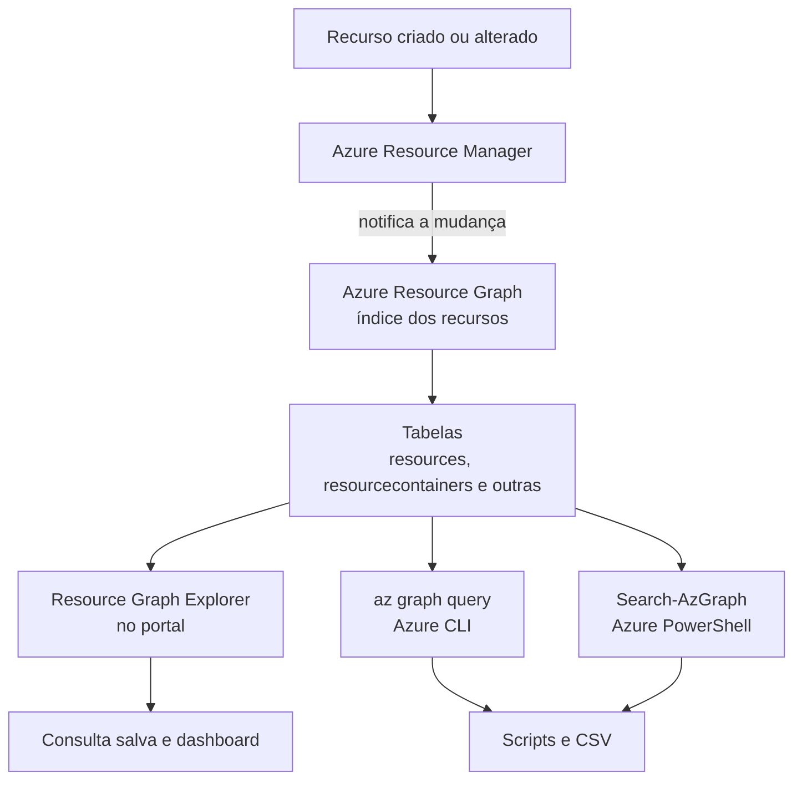

Fala pessoALL! Bora pra mais um?

Quem administra Azure há algum tempo conhece bem esse tipo de pergunta: "quantas VMs a gente tem ligadas agora?", "tem alguma máquina com RDP aberto pra internet?", "esse IP público é de quem?". Quase sempre ela chega no meio de uma reunião, e quase sempre a resposta esperada é para os próximos cinco minutos.

O caminho que a maioria segue é abrir o portal, entrar em **Virtual machines**, trocar de assinatura, filtrar, exportar, colar no Excel e repetir para a assinatura seguinte. Com duas assinaturas dá para viver assim. Com quinze, você passa a tarde nisso e ainda entrega um número que já mudou.

O outro caminho comum é um script com `Get-AzVM` dentro de um `foreach` de assinaturas. Funciona, mas vai uma assinatura por vez, e o tempo de execução cresce junto com o ambiente.

O **Azure Resource Graph** resolve exatamente esse ponto. Ele mantém um índice dos recursos de todas as assinaturas que você enxerga e responde em KQL, a mesma linguagem do Log Analytics. Uma consulta, todas as assinaturas, resposta em segundos. E é gratuito.

<!-- LUIZ: qual foi a pergunta de inventário mais "pra ontem" que você já precisou responder e que hoje resolveria com uma consulta salva? Conte em duas linhas, sem identificar o ambiente. -->

**Neste artigo, vamos conhecer o Resource Graph Explorer e o `az graph query`, entender as tabelas, os limites de linhas e a paginação, consultar por management group e montar um conjunto de consultas KQL para deixar salvo: inventário de VMs, VMs sem TAG, IPs públicos e seus donos, discos por SKU, recursos por região e NSG com regra aberta para a internet. No final, salvamos a consulta e fixamos o resultado em um dashboard.**

> O Resource Graph enxerga a configuração dos recursos no Azure Resource Manager. Ele não entra no S.O., não lê métrica de CPU e não mostra custo. Para isso existem o Azure Monitor e o Cost Management. Se a pergunta é "o que existe e como está configurado", é aqui. Se é "como está se comportando", não é.
{: .prompt-warning }

---

## Mas antes, o que é o Azure Resource Graph?

É um serviço do Azure que guarda uma cópia indexada das propriedades dos recursos. Toda vez que um recurso é criado ou alterado, o Azure Resource Manager avisa o Resource Graph, que atualiza o índice. Talvez você já use sem saber: a barra de pesquisa do portal e a tela **All resources** rodam em cima dele.



Duas consequências práticas desse desenho:

A primeira é que o dado **não é fortemente consistente**. A própria documentação avisa que a indexação tem uma latência curta. Recurso que você acabou de criar pode levar um pouco para aparecer.

A segunda é a permissão. O Resource Graph só devolve aquilo que a sua conta consegue ler. Com **Reader** em três assinaturas, o resultado traz três assinaturas, e ele não avisa que existem outras. Quando o resultado vem vazio, quase sempre o problema está no acesso ou no escopo, e a consulta está certa.

### As tabelas que mais importam

A linguagem é KQL, só que em um subconjunto. E os dados ficam separados em tabelas. Estas são as que eu mais uso:

| Tabela | O que tem dentro |
| --- | --- |
| `resources` | A tabela padrão. VMs, discos, NICs, IPs públicos, NSGs, Storage Accounts e a maior parte dos recursos |
| `resourcecontainers` | Management groups, assinaturas e resource groups. É dela que sai o nome da assinatura |
| `advisorresources` | Recomendações do Azure Advisor |
| `policyresources` | Estado de compliance do Azure Policy |
| `authorizationresources` | Role assignments e role definitions |
| `securityresources` | Dados do Defender for Cloud |
| `patchassessmentresources` e `patchinstallationresources` | Avaliação e instalação de patch do Update Manager |
| `resourcechanges` | Alterações de propriedade dos recursos nos últimos 14 dias |

Para descobrir quais tipos de recurso existem em uma tabela no seu ambiente, a documentação sugere um atalho simples: `<tabela> | distinct type`.

> As duas tabelas de patch vão ganhar um artigo próprio mais para frente, com o relatório de compliance do Update Manager. Hoje ficamos em `resources` e `resourcecontainers`, que já respondem a maioria das perguntas do dia a dia.
{: .prompt-info }

### E o ARI, que já apareceu aqui no blog?

Lá em 2025 eu mostrei como [inventariar qualquer ambiente com o Azure Resource Inventory](https://blog.ruizsolutions.online/posts/inventariando-qualquer-ambiente-do-azure-com-ari/). Os dois continuam valendo, cada um para uma coisa. O ARI entrega uma fotografia completa do ambiente em Excel, com diagrama de rede no Draw.io, ótimo para um assessment ou para a documentação inicial de um ambiente que você acabou de assumir (hoje ele é um módulo de PowerShell, executado com `Invoke-ARI`). O Resource Graph responde uma pergunta específica em segundos, sem instalar nada, e o resultado pode ficar vivo em um dashboard. Eu uso o ARI quando preciso entregar um documento e o Resource Graph quando preciso de uma resposta.

<!-- LUIZ: em que situação você ainda prefere rodar o ARI mesmo tendo as consultas do Resource Graph salvas? Uma frase com o seu critério. -->

---

## Pré-requisitos

* Permissão de **Reader** nas assinaturas (ou no management group) que você quer consultar. Para o laboratório opcional do Passo 1, **Contributor** em uma assinatura de teste;
* Para salvar consulta compartilhada, permissão de escrita no resource group onde ela vai ficar;
* **Azure CLI** na versão 2.22.0 ou superior, que é o mínimo exigido pela extensão `resource-graph`. O Cloud Shell já atende;
* **Azure PowerShell** atualizado, se preferir o `Search-AzGraph`. O módulo `Az.ResourceGraph` já vem junto nas versões recentes.

> O Resource Graph em si não tem custo. O que gera custo é o laboratório opcional do Passo 1: duas VMs, três IPs públicos Standard e os discos. Se for criar, rode a limpeza do final do artigo no mesmo dia.
{: .prompt-info }

---

## Mão na massa!

### Passo 1 - Preparar um laboratório (opcional)

As consultas deste artigo só leem. Você pode rodar todas no ambiente que já tem, sem risco nenhum.

Se a sua assinatura de estudo está vazia, o script abaixo cria um conjunto pequeno de recursos pensado para dar resultado em cada consulta: uma VM Linux com TAGs, uma VM Windows sem TAG e desalocada, um disco solto, um IP público sem associação e um NSG com RDP aberto para a internet.

**Os arquivos deste artigo estão no meu repositório: [Azure Resource Graph](https://github.com/lfrleite/Ruiz-Online/tree/main/Azure%20Resource%20Graph)**

```bash
#!/usr/bin/env bash
# Arquivo: 012-lab-resource-graph.sh
# Cria um laboratório pequeno para testar as consultas do Azure Resource Graph.
# Uso: bash 012-lab-resource-graph.sh
# Pré-requisito: az login já executado e a assinatura de laboratório selecionada.

set -euo pipefail
trap 'echo "ERRO: falha na linha $LINENO. Confira a mensagem acima." >&2' ERR

RG="rg-arg-lab-wus2-001"
LOCATION="westus2"
VM_LNX="vm-arg-lnx-wus2-001"
VM_WIN="vm-arg-win-wus2-001"
DISK="disk-arg-solto-wus2-001"
PIP="pip-arg-solto-wus2-001"
NSG="nsg-arg-aberto-wus2-001"
VM_SIZE="Standard_D2s_v5"

if ! command -v az >/dev/null 2>&1; then
  echo "ERRO: Azure CLI não encontrado." >&2
  exit 1
fi

if ! az account show >/dev/null 2>&1; then
  echo "ERRO: nenhuma sessão ativa. Rode 'az login' antes." >&2
  exit 1
fi

echo "Assinatura em uso: $(az account show --query name -o tsv)"
read -r -p "Criar o laboratório nessa assinatura? (s/N) " CONFIRMA
if [[ "${CONFIRMA}" != "s" && "${CONFIRMA}" != "S" ]]; then
  echo "Cancelado."
  exit 0
fi

# A senha é digitada na hora e não fica gravada em arquivo.
read -r -s -p "Defina a senha do administrador da VM Windows: " WIN_PASSWORD
echo
if [[ -z "${WIN_PASSWORD}" ]]; then
  echo "ERRO: a senha não pode ficar vazia." >&2
  exit 1
fi

echo "Criando o resource group ${RG}..."
az group create --name "$RG" --location "$LOCATION" --output none

echo "Criando a VM Linux (com TAGs)..."
az vm create \
  --resource-group "$RG" \
  --name "$VM_LNX" \
  --location "$LOCATION" \
  --image "Canonical:ubuntu-24_04-lts:server:latest" \
  --size "$VM_SIZE" \
  --admin-username azureuser \
  --generate-ssh-keys \
  --public-ip-sku Standard \
  --nsg-rule NONE \
  --tags Ambiente=DEV Dono=infra \
  --output none

echo "Criando a VM Windows (sem TAG)..."
az vm create \
  --resource-group "$RG" \
  --name "$VM_WIN" \
  --location "$LOCATION" \
  --image "MicrosoftWindowsServer:WindowsServer:2022-datacenter-azure-edition:latest" \
  --size "$VM_SIZE" \
  --admin-username azureuser \
  --admin-password "$WIN_PASSWORD" \
  --public-ip-sku Standard \
  --nsg-rule NONE \
  --output none
unset WIN_PASSWORD

echo "Desalocando a VM Windows para ter dois estados de energia..."
az vm deallocate --resource-group "$RG" --name "$VM_WIN" --output none

echo "Criando um disco que não será anexado a nenhuma VM..."
az disk create \
  --resource-group "$RG" \
  --name "$DISK" \
  --size-gb 32 \
  --sku StandardSSD_LRS \
  --output none

echo "Criando um IP público sem associação..."
az network public-ip create \
  --resource-group "$RG" \
  --name "$PIP" \
  --sku Standard \
  --output none

echo "Criando um NSG com RDP aberto para a internet (não associado a nada)..."
az network nsg create --resource-group "$RG" --name "$NSG" --output none
az network nsg rule create \
  --resource-group "$RG" \
  --nsg-name "$NSG" \
  --name Allow-RDP-Internet \
  --access Allow \
  --protocol Tcp \
  --direction Inbound \
  --priority 100 \
  --source-address-prefix Internet \
  --source-port-range "*" \
  --destination-port-range 3389 \
  --output none

echo "Laboratório criado em ${RG}. Lembre de apagar no final: az group delete --name ${RG}"
```

Repare em dois cuidados. As VMs são criadas com `--nsg-rule NONE`, então nenhuma porta de gerência fica exposta, já que ninguém vai precisar entrar nelas. E o NSG com RDP aberto não é associado a subnet nem a NIC: ele existe só para a consulta ter o que encontrar.

<!-- PRINT 002: Resource group rg-arg-lab-wus2-001 > Overview, listando as duas VMs, os discos, os IPs públicos, as NICs, os NSGs e a VNet criados pelo script -->
{: .shadow .rounded-10 }
<br>

---

### Passo 2 - A primeira consulta no Resource Graph Explorer

O Explorer é o melhor lugar para escrever e testar. Depois que a consulta está redonda, ela vai para o CLI ou para um script.

1. No portal, pesquise por **Resource Graph Explorer** e abra o serviço;
2. No seletor de escopo, que na documentação aparece como **Directory**, confirme o diretório, o management group ou as assinaturas que quer consultar;
3. Na aba **Query 1**, cole a consulta abaixo;
4. Clique em **Run query**.

```kusto
resources
| where type =~ 'microsoft.compute/virtualmachines'
| project name, location, resourceGroup
| order by name asc
```

<!-- PRINT 003: Resource Graph Explorer com a consulta colada na aba Query 1, o seletor de escopo visível no topo e a aba Results listando as duas VMs do laboratório -->
{: .shadow .rounded-10 }
<br>

O resultado sai na aba **Results**. Ao lado dela, a aba **Messages** mostra quantos registros voltaram e quanto tempo a consulta levou. Erro de sintaxe também aparece ali.

Três coisas nessa consulta valem para todas as outras:

O `=~` compara sem diferenciar maiúsculas de minúsculas. O `==` diferencia. Como o `type` vem em minúsculas no Resource Graph, eu uso `=~` por hábito e não penso mais nisso.

O `project` escolhe as colunas. Sem ele vem o objeto inteiro, com `properties` e tudo, o que é ótimo para descobrir o que existe e péssimo para ler.

E o `order by` não é enfeite. Sem ordenação, a documentação avisa que o resultado pode vir em ordem diferente a cada execução.

Do lado esquerdo fica o **schema browser**, com as tabelas e os tipos de recurso que existem no seu tenant. Clicar em um tipo ou em uma propriedade joga o trecho correspondente na consulta.

<!-- PRINT 004: Resource Graph Explorer com o schema browser expandido em resources > microsoft.compute/virtualmachines > properties > hardwareProfile, mostrando a propriedade vmSize -->
{: .shadow .rounded-10 }
<br>

---

### Passo 3 - A mesma consulta pelo Azure CLI e pelo PowerShell

No Azure CLI, o Resource Graph vem em uma extensão. Na primeira vez que você roda `az graph`, o CLI oferece a instalação. Para instalar na mão:

```bash
az extension add --name resource-graph
```

A consulta vai no parâmetro `-q`:

```bash
az graph query \
  -q "resources | where type =~ 'microsoft.compute/virtualmachines' | project name, location, resourceGroup | order by name asc" \
  --first 100 \
  --output table
```

O formato esperado da saída é este (os valores são exemplo do laboratório):

```text
Name                 Location    ResourceGroup
-------------------  ----------  -------------------
vm-arg-lnx-wus2-001  westus2     rg-arg-lab-wus2-001
vm-arg-win-wus2-001  westus2     rg-arg-lab-wus2-001
```

<!-- PRINT 005: Cloud Shell com o az graph query executado e a saída em tabela com as duas VMs do laboratório -->
{: .shadow .rounded-10 }
<br>

Por padrão o CLI consulta todas as assinaturas que a sua conta acessa. Para mudar o escopo existem dois parâmetros.

Assinaturas específicas:

```bash
az graph query \
  -q "resources | summarize total = count()" \
  --subscriptions 11111111-1111-1111-1111-111111111111 22222222-2222-2222-2222-222222222222
```

Um management group inteiro, com tudo o que está abaixo dele:

```bash
az graph query \
  -q "resources | summarize total = count()" \
  --management-groups "<MANAGEMENT_GROUP_ID>"
```

O valor é o **ID** do management group, não o nome de exibição. Se não souber de cabeça:

```bash
az account management-group list --query "[].{Nome:displayName, Id:name}" -o table
```

E para o tenant inteiro, a documentação usa o próprio ID do tenant como management group, que é o Tenant Root Group:

```bash
tenantid=$(az account show --query tenantId --output tsv)
az graph query -q "resources | summarize total = count()" --management-groups $tenantid
```

No PowerShell o cmdlet é o `Search-AzGraph`, com os parâmetros `-Subscription`, `-ManagementGroup` e `-UseTenantScope`:

```powershell
Search-AzGraph -Query "resources | where type =~ 'microsoft.compute/virtualmachines' | project name, location, resourceGroup | order by name asc" -First 100
```

> O `Search-AzGraph` consulta, por padrão, as assinaturas do contexto atual, e não todas as que você acessa. Se o número vier menor que o do portal, confira a lista com `(Get-AzContext).Account.ExtendedProperties.Subscriptions` ou use `-UseTenantScope`.
{: .prompt-warning }

---

### Passo 4 - Limites de linhas e paginação

Esse é o ponto em que o Resource Graph engana quem está começando.

A consulta roda, você exporta e manda para frente. Só que o ambiente tem 2.300 discos e a planilha tem exatamente 1.000 linhas.

Os limites documentados são estes:

| Limite | Valor |
| --- | --- |
| Registros por resposta | 1.000, e esse também é o máximo aceito em `--first` e `-First` |
| Padrão do `Search-AzGraph` quando você não informa `-First` | 100 |
| **Download as CSV** no Explorer | 55.000 registros |
| Tempo máximo de uma consulta | 30 segundos |
| `join` e `union` na mesma consulta (CLI, PowerShell e SDK) | 3, somados |
| `mv-expand` na mesma consulta | 3 |
| Linhas geradas por registro em um `mv-expand` | 128 por padrão, até 2.000 |
| Assinaturas em uma consulta por management group | As primeiras 10.000 |

Para passar de 1.000 registros existe a paginação. A resposta traz um **skip token**, e a chamada seguinte devolve esse token para receber a próxima página. No CLI é o parâmetro `--skip-token`, no PowerShell é o `-SkipToken`.

Tem três condições para o token aparecer, e as três pegam gente:

1. A consulta não pode ter `limit`, `take` ou `sample`;
2. As colunas do resultado não podem ser todas do tipo `dynamic` ou nulas;
3. A coluna `id` precisa estar no resultado. A referência do `Search-AzGraph` é direta nisso: manter o `id` é obrigatório para receber o skip token.

Por isso todas as consultas de listagem deste artigo projetam o `id` e ordenam por ele no final. A ordenação por uma coluna única é a recomendação da documentação para a paginação não repetir nem pular registro.

> Resultado com exatamente 100 ou exatamente 1.000 linhas é suspeito. Antes de confiar no número, rode a mesma consulta terminando em `| count`.
{: .prompt-danger }

O Resource Graph também limita a quantidade de consultas por usuário. O exemplo da documentação é de 15 consultas a cada janela de 5 segundos, com o aviso de que o valor pode mudar. Em script com laço, isso aparece.

---

### Passo 5 - As consultas para deixar salvas

Agora a parte que interessa. Cada consulta abaixo está também como arquivo `.kql` no repositório, com o mesmo conteúdo.

#### 5.1 - Inventário de VMs com tamanho, S.O. e estado

```kusto
// Arquivo: 012-01-inventario-vms.kql
// Inventário de VMs: assinatura, tamanho, tipo de S.O., imagem de origem e estado de energia.
resources
| where type =~ 'microsoft.compute/virtualmachines'
| extend vmSize = tostring(properties.hardwareProfile.vmSize),
         osType = tostring(properties.storageProfile.osDisk.osType),
         imagem = strcat(tostring(properties.storageProfile.imageReference.offer), ' / ', tostring(properties.storageProfile.imageReference.sku)),
         estado = tostring(properties.extended.instanceView.powerState.code)
// O nome da assinatura não está em resources. Ele vem de resourcecontainers.
| join kind=leftouter (
    resourcecontainers
    | where type =~ 'microsoft.resources/subscriptions'
    | project subscriptionId, assinatura = name
  ) on subscriptionId
| project assinatura, resourceGroup, name, location, vmSize, osType, imagem, estado, id
| order by assinatura asc, resourceGroup asc, name asc, id asc
```

<!-- PRINT 006: Resource Graph Explorer com a consulta 012-01-inventario-vms e a aba Results mostrando as colunas assinatura, resourceGroup, name, location, vmSize, osType, imagem e estado das duas VMs, uma PowerState/running e outra PowerState/deallocated -->
{: .shadow .rounded-10 }
<br>

O estado de energia vem de `properties.extended.instanceView.powerState.code`. O bloco `extended` é o que a documentação chama de propriedades estendidas, um recurso ainda em preview com dados que não fazem parte do objeto padrão do Resource Manager.

A coluna `imagem` mostra a imagem que foi usada para **criar** a VM. Se a máquina passou por upgrade in-place depois, essa coluna continua dizendo a versão antiga. Para inventário geral ela serve. Para caçar S.O. em fim de suporte, ela engana, e esse é o assunto do próximo artigo.

A mesma base, resumida por estado, vira um número para a reunião:

```kusto
// Arquivo: 012-02-vms-por-estado.kql
// Quantidade de VMs por estado de energia.
resources
| where type =~ 'microsoft.compute/virtualmachines'
| summarize total = count() by estado = tostring(properties.extended.instanceView.powerState.code)
| order by total desc
```

#### 5.2 - VMs sem TAG

Quem acompanha o blog sabe que boa parte da automação aqui depende de TAG: o [Start/Stop de VMs](https://blog.ruizsolutions.online/posts/azure-tag-start-stop-vms/), os snapshots, as [ondas de patch com escopo dinâmico](https://blog.ruizsolutions.online/posts/azure-update-manager-escopo-dinamico-tags/). VM sem a TAG certa fica de fora de tudo isso, em silêncio.

```kusto
// Arquivo: 012-03-vms-sem-tag.kql
// VMs que não têm a TAG Ambiente. Troque o nome da TAG pelo padrão do seu ambiente.
resources
| where type =~ 'microsoft.compute/virtualmachines'
| where isempty(tags['Ambiente'])
| project subscriptionId, resourceGroup, name, location, tags, id
| order by resourceGroup asc, name asc, id asc
```

<!-- PRINT 007: Resource Graph Explorer com a consulta 012-03-vms-sem-tag e a aba Results mostrando apenas a vm-arg-win-wus2-001 -->
{: .shadow .rounded-10 }
<br>

> O nome da TAG entre colchetes diferencia maiúsculas de minúsculas na consulta. `tags['Ambiente']` não encontra uma TAG gravada como `ambiente`. Se o seu ambiente tem as duas grafias, a consulta abaixo vai mostrar.
{: .prompt-warning }

Para a versão mais ampla, VMs sem TAG nenhuma, troque a linha do filtro por esta:

```kusto
| where isnull(tags) or array_length(bag_keys(tags)) == 0
```

E antes de cobrar TAG de alguém, vale olhar o que existe hoje. Esta consulta lista cada par de nome e valor em uso e quantos recursos carregam cada um:

```kusto
// Arquivo: 012-04-tags-em-uso.kql
// Todas as TAGs em uso nos recursos, com o valor e a quantidade de recursos.
resources
| where isnotempty(tags)
| project tags
| mv-expand tags
| extend tagKey = tostring(bag_keys(tags)[0])
| extend tagValue = tostring(tags[tagKey])
| where tagKey !startswith 'hidden-'
| summarize recursos = count() by tagKey, tagValue
| order by tagKey asc, recursos desc
```

<!-- PRINT 008: Resource Graph Explorer com a consulta 012-04-tags-em-uso e a aba Results mostrando as colunas tagKey, tagValue e recursos, com as TAGs Ambiente=DEV e Dono=infra do laboratório -->
{: .shadow .rounded-10 }
<br>

É nessa lista que aparecem `Ambiente`, `ambiente`, `Environment` e `env` convivendo no mesmo tenant. Sendo bem sincero, eu ainda não vi ambiente com mais de um ano de vida em que essa consulta não trouxesse uma surpresa.

#### 5.3 - IPs públicos e a quem pertencem

```kusto
// Arquivo: 012-05-ips-publicos.kql
// IPs públicos, SKU, tipo de alocação e o recurso ao qual cada um está associado.
resources
| where type =~ 'microsoft.network/publicipaddresses'
| extend ip = tostring(properties.ipAddress),
         skuIp = tostring(sku.name),
         alocacao = tostring(properties.publicIPAllocationMethod),
         ipConfigId = tostring(properties.ipConfiguration.id),
         natGatewayId = tostring(properties.natGateway.id)
| extend associadoA = iff(isnotempty(ipConfigId), ipConfigId, natGatewayId)
// No ID do recurso, a posição 7 é o tipo (networkInterfaces, loadBalancers...) e a 8 é o nome.
| extend tipoDono = iff(isempty(associadoA), 'SEM ASSOCIACAO', tostring(split(associadoA, '/')[7])),
         dono = tostring(split(associadoA, '/')[8])
| project subscriptionId, resourceGroup, name, location, ip, skuIp, alocacao, tipoDono, dono, id
| order by tipoDono asc, name asc, id asc
```

<!-- PRINT 009: Resource Graph Explorer com a consulta 012-05-ips-publicos e a aba Results mostrando os três IPs do laboratório, dois com tipoDono networkInterfaces e o pip-arg-solto-wus2-001 com SEM ASSOCIACAO -->
{: .shadow .rounded-10 }
<br>

A coluna `tipoDono` diz em que tipo de recurso o IP está pendurado: NIC, Load Balancer, Application Gateway, Bastion, NAT Gateway. A coluna `dono` traz o nome desse recurso.

Quando o dono é uma NIC, você ainda está a um passo do nome da VM. A documentação tem um exemplo pronto que parte da VM, passa pela NIC e chega ao IP público com dois `join` (está nos exemplos avançados, na tabela de artigos). Eu preferi partir do IP porque a pergunta costuma ser "de quem é esse endereço?", e não "qual o IP dessa VM?".

IP com `SEM ASSOCIACAO` é o primeiro candidato a revisão: ou alguém reservou o endereço de propósito, ou ele sobrou de um recurso que já foi apagado. A caça aos recursos órfãos vai ter artigo próprio, com os cuidados de falso positivo.

#### 5.4 - Discos, SKU e estado

```kusto
// Arquivo: 012-06-discos-sku.kql
// Discos gerenciados com SKU, tamanho, estado e a VM dona.
resources
| where type =~ 'microsoft.compute/disks'
| extend skuDisco = tostring(sku.name),
         tamanhoGB = toint(properties.diskSizeGB),
         estadoDisco = tostring(properties.diskState),
         vm = tostring(split(managedBy, '/')[8])
| project subscriptionId, resourceGroup, name, location, skuDisco, tamanhoGB, estadoDisco, vm, id
| order by estadoDisco desc, tamanhoGB desc, id asc
```

<!-- PRINT 010: Resource Graph Explorer com a consulta 012-06-discos-sku e a aba Results mostrando os três discos do laboratório com estadoDisco Attached, Reserved e Unattached -->
{: .shadow .rounded-10 }
<br>

O `diskState` merece atenção, porque tem um valor que confunde:

* `Attached`: o disco está em uma VM em execução;
* `Reserved`: o disco está em uma VM parada e desalocada;
* `Unattached`: o disco não está em VM nenhuma.

Disco `Reserved` **não é órfão**. É o disco da VM que o Start/Stop desligou ontem à noite. Quem filtra só por "não está Attached" e sai apagando vai ter uma manhã bem ruim.

Para olhar o conjunto, a versão resumida:

```kusto
// Arquivo: 012-07-discos-resumo.kql
// Quantidade de discos e total de GB provisionados por SKU e estado.
resources
| where type =~ 'microsoft.compute/disks'
| summarize discos = count(), totalGB = sum(toint(properties.diskSizeGB)) by skuDisco = tostring(sku.name), estadoDisco = tostring(properties.diskState)
| order by totalGB desc
```

Premium SSD em estado `Unattached` é o primeiro lugar onde eu olho quando alguém pede redução de custo.

#### 5.5 - Recursos por região

```kusto
// Arquivo: 012-08-recursos-por-regiao.kql
// Quantidade de recursos por região. Boa para gráfico e para conferir se algo foi criado fora do padrão.
resources
| summarize total = count() by location
| order by total desc
```

<!-- PRINT 011: Resource Graph Explorer com a consulta 012-08-recursos-por-regiao, aba Charts selecionada e o gráfico de barras por região -->
{: .shadow .rounded-10 }
<br>

Parece simples demais para salvar. Só que recurso em região que a empresa não usa quase sempre é teste esquecido ou alguém que aceitou o padrão do portal sem olhar.

Como ela devolve uma contagem, dá para ir na aba **Charts** e escolher **Bar chart** ou **Donut chart**. Consulta que devolve lista não vira gráfico.

A variação por assinatura, já com o nome, é um exemplo direto da documentação:

```kusto
// Arquivo: 012-09-recursos-por-assinatura.kql
// Quantidade de recursos por assinatura, com o nome da assinatura.
resources
| summarize resourceCount = count() by subscriptionId
| join (
    resourcecontainers
    | where type == 'microsoft.resources/subscriptions'
    | project SubName = name, subscriptionId
  ) on subscriptionId
| project-away subscriptionId, subscriptionId1
```

#### 5.6 - NSG com regra aberta para a internet

<!-- VALIDAR: rodar no Explorer e pelo Search-AzGraph para confirmar que o Resource Graph aceita "mv-expand regra = properties.securityRules limit 1000". O limite de 128 por padrão e 2.000 no máximo está documentado, mas não há exemplo oficial com a palavra limit. Se der erro, tirar o "limit 1000" do artigo e do arquivo 012-10-nsg-aberto-internet.kql. -->

```kusto
// Arquivo: 012-10-nsg-aberto-internet.kql
// Regras de entrada que liberam tráfego vindo de qualquer origem ou da service tag Internet.
resources
| where type =~ 'microsoft.network/networksecuritygroups'
// O padrão do mv-expand no Resource Graph é 128 linhas por registro. O limit sobe esse teto.
| mv-expand regra = properties.securityRules limit 1000
| extend nomeRegra = tostring(regra.name),
         acesso = tostring(regra.properties.access),
         direcao = tostring(regra.properties.direction),
         prioridade = toint(regra.properties.priority),
         protocolo = tostring(regra.properties.protocol),
         origem = tostring(regra.properties.sourceAddressPrefix),
         origens = tostring(regra.properties.sourceAddressPrefixes),
         porta = tostring(regra.properties.destinationPortRange),
         portas = tostring(regra.properties.destinationPortRanges)
| where acesso =~ 'Allow' and direcao =~ 'Inbound'
| where origem in~ ('*', 'Internet', '0.0.0.0/0') or origens contains '0.0.0.0/0' or origens contains 'Internet'
// Para olhar só portas de gerência, tire o comentário da linha abaixo.
// | where porta in ('22', '3389', '*')
| project subscriptionId, resourceGroup, nsg = name, nomeRegra, prioridade, protocolo, porta, portas, origem, origens, id
| order by nsg asc, prioridade asc, id asc
```

<!-- PRINT 012: Resource Graph Explorer com a consulta 012-10-nsg-aberto-internet e a aba Results mostrando o nsg-arg-aberto-wus2-001 com a regra Allow-RDP-Internet, porta 3389 e origem Internet -->
{: .shadow .rounded-10 }
<br>

Aqui entra o `mv-expand`, que transforma a lista de regras de cada NSG em uma linha por regra.

Uma regra de NSG pode guardar a origem em dois lugares: `sourceAddressPrefix`, quando é um valor só, e `sourceAddressPrefixes`, quando é uma lista. O mesmo vale para a porta de destino. Por isso a consulta tem duas colunas para cada coisa e o filtro olha os dois campos de origem.

Leia o resultado com calma antes de abrir chamado para alguém. Regra aberta em NSG que não está associado a nada, como o do laboratório, não expõe coisa alguma. Porta 443 aberta em NSG de Application Gateway é o esperado. E a consulta só olha `properties.securityRules`, que são as regras criadas por você. As regras padrão ficam em `defaultSecurityRules` e não entram.

O que não tem desculpa é 3389 ou 22 com origem `*` em NSG associado a NIC de VM com IP público. Em ambiente real eu trato isso como incidente e resolvo no mesmo dia.

<!-- LUIZ: você tem um caso anonimizado de porta de gerência aberta encontrada por uma consulta dessas? Quanto tempo a regra estava lá e como foi descoberta? -->

---

### Passo 6 - Exportar o resultado completo, com paginação

Para ambiente pequeno, o botão **Download as CSV** do Explorer resolve. Para rodar agendado, juntar várias consultas ou passar do que o portal exporta, o script abaixo lê um arquivo `.kql`, pagina com o skip token e grava o CSV.

```powershell
# Arquivo: 012-Export-ArgQuery.ps1
<#
.SYNOPSIS
    Executa uma consulta do Azure Resource Graph a partir de um arquivo .kql,
    pagina o resultado com skip token e exporta tudo para CSV.

.DESCRIPTION
    Usa a sessão já autenticada do Azure PowerShell (Connect-AzAccount).
    Nenhuma credencial é lida ou gravada pelo script.
    A consulta precisa projetar a coluna id e não pode usar limit, take ou sample,
    senão o Resource Graph não devolve o skip token e o resultado para na primeira página.

.EXAMPLE
    ./012-Export-ArgQuery.ps1 -QueryFile ./012-01-inventario-vms.kql -OutputCsv ./inventario-vms.csv -UseTenantScope

.EXAMPLE
    ./012-Export-ArgQuery.ps1 -QueryFile ./012-06-discos-sku.kql -OutputCsv ./discos.csv -ManagementGroup 'mg-landingzones'
#>
[CmdletBinding(DefaultParameterSetName = 'Contexto')]
param(
    [Parameter(Mandatory)]
    [string]$QueryFile,

    [Parameter(Mandatory)]
    [string]$OutputCsv,

    [Parameter(ParameterSetName = 'Assinatura', Mandatory)]
    [string[]]$Subscription,

    [Parameter(ParameterSetName = 'ManagementGroup', Mandatory)]
    [string[]]$ManagementGroup,

    [Parameter(ParameterSetName = 'Tenant', Mandatory)]
    [switch]$UseTenantScope,

    [ValidateRange(1, 1000)]
    [int]$PageSize = 1000
)

$ErrorActionPreference = 'Stop'

if (-not (Get-Command -Name Search-AzGraph -ErrorAction SilentlyContinue)) {
    throw "Cmdlet Search-AzGraph não encontrado. Instale o módulo: Install-Module -Name Az.ResourceGraph -Repository PSGallery -Scope CurrentUser"
}

if (-not (Get-AzContext)) {
    throw "Nenhuma sessão ativa no Azure PowerShell. Rode Connect-AzAccount antes."
}

if (-not (Test-Path -Path $QueryFile -PathType Leaf)) {
    throw "Arquivo de consulta não encontrado: $QueryFile"
}

$query = Get-Content -Path $QueryFile -Raw
if ([string]::IsNullOrWhiteSpace($query)) {
    throw "O arquivo $QueryFile está vazio."
}

$parametros = @{
    Query = $query
    First = $PageSize
}
switch ($PSCmdlet.ParameterSetName) {
    'Assinatura'      { $parametros.Subscription = $Subscription }
    'ManagementGroup' { $parametros.ManagementGroup = $ManagementGroup }
    'Tenant'          { $parametros.UseTenantScope = $true }
}

$registros = [System.Collections.Generic.List[object]]::new()
$pagina = 0

try {
    do {
        $pagina++
        $resposta = Search-AzGraph @parametros

        foreach ($item in $resposta.Data) {
            $registros.Add($item)
        }
        Write-Host ("Página {0}: {1} registros (acumulado: {2})" -f $pagina, @($resposta.Data).Count, $registros.Count)

        $parametros.SkipToken = $resposta.SkipToken

        # Pausa curta para não esbarrar no limite de consultas por usuário.
        if ($resposta.SkipToken) { Start-Sleep -Milliseconds 400 }
    } while ($resposta.SkipToken)
}
catch {
    throw "Falha ao consultar o Resource Graph na página $pagina. Detalhe: $($_.Exception.Message)"
}

if ($registros.Count -eq 0) {
    Write-Warning "A consulta não retornou registros. Confira o escopo e as permissões de leitura."
    return
}

if ($pagina -eq 1 -and $registros.Count -eq $PageSize) {
    Write-Warning "Vieram exatamente $PageSize registros e nenhum skip token. O resultado pode estar truncado: confira se a consulta projeta a coluna id e não usa limit, take ou sample."
}

# Colunas dinâmicas (tags, por exemplo) viram JSON em texto para caber em uma célula do CSV.
$linhas = foreach ($item in $registros) {
    $linha = [ordered]@{}
    foreach ($prop in $item.PSObject.Properties) {
        if ($null -eq $prop.Value -or $prop.Value -is [string] -or $prop.Value -is [ValueType]) {
            $linha[$prop.Name] = $prop.Value
        }
        else {
            $linha[$prop.Name] = ($prop.Value | ConvertTo-Json -Compress -Depth 10)
        }
    }
    [pscustomobject]$linha
}

try {
    $linhas | Export-Csv -Path $OutputCsv -NoTypeInformation -Encoding utf8
}
catch {
    throw "Falha ao gravar o CSV em $OutputCsv. Detalhe: $($_.Exception.Message)"
}

Write-Host ("Exportados {0} registros para {1}" -f $registros.Count, $OutputCsv)
```

Para rodar o inventário de VMs no tenant inteiro:

```powershell
Connect-AzAccount
./012-Export-ArgQuery.ps1 -QueryFile ./012-01-inventario-vms.kql -OutputCsv ./inventario-vms.csv -UseTenantScope
```

<!-- PRINT 013: Terminal PowerShell com a execução do 012-Export-ArgQuery.ps1, mostrando as linhas "Página 1: N registros" e a mensagem final "Exportados N registros para ./inventario-vms.csv" -->
{: .shadow .rounded-10 }
<br>

> Quando o ambiente muda no meio da paginação, com recurso sendo criado ou apagado entre uma página e outra, a documentação admite que pode haver registro repetido ou faltando, mesmo ordenando por `id`. Para inventário do dia a dia isso não pesa. Para relatório de auditoria, rode em horário de pouca mudança e confira o total com `| count`.
{: .prompt-info }

---

### Passo 7 - Salvar a consulta

Consulta boa que ficou só no histórico do navegador é consulta perdida. O Explorer salva de dois jeitos.

**Private query** fica nas suas configurações do portal. Só você vê e só existe dentro do portal.

**Shared query** é um recurso do Azure, do tipo `Microsoft.ResourceGraph/queries`. Fica em um resource group, aceita RBAC, TAG e resource lock, e qualquer pessoa com permissão consegue abrir e rodar.

Para o time, eu recomendo sempre a compartilhada. Vamos salvar o inventário de VMs:

1. Com a consulta `012-01-inventario-vms` aberta no Explorer, clique em **Save as**;
2. Em **Name**, informe:
   ```text
   Inventario de VMs
   ```
3. Em **Type**, selecione **Shared query**;
4. Em **Description**, descreva o que a consulta devolve;
5. Em **Subscription**, escolha a assinatura onde o recurso da consulta vai ser criado;
6. Mantenha marcada a opção **Publish to resource-graph-queries resource group**, ou desmarque para escolher um resource group seu;
7. Clique em **Save**.

<!-- PRINT 014: Painel Save query preenchido com o nome Inventario de VMs, Type Shared query, descrição, assinatura e a opção Publish to resource-graph-queries resource group marcada -->
{: .shadow .rounded-10 }
<br>

O nome da aba muda de **Query 1** para o nome da consulta. Na primeira vez o salvamento demora um pouco mais, porque o resource group `resource-graph-queries` ainda está sendo criado.

Para abrir depois, clique em **Open a query**, selecione o tipo **Shared query** e confira a assinatura e o resource group.

<!-- PRINT 015: Painel Open a query com Type Shared query selecionado e a consulta Inventario de VMs listada -->
{: .shadow .rounded-10 }
<br>

> O resource group padrão facilita encontrar as consultas, mas em ambiente corporativo eu sugiro um resource group próprio, dentro do padrão de nomenclatura e com o RBAC que o time já usa. Consulta compartilhada é recurso como qualquer outro e merece a mesma governança.
{: .prompt-tip }

---

### Passo 8 - Fixar o resultado em um dashboard

O último passo é tirar a consulta do Explorer e colocar em um lugar onde as pessoas olham.

1. Abra a consulta de recursos por região (ou a de VMs por estado) e clique em **Run query**;
2. Salve a consulta antes de fixar. Sem isso, o bloco aparece no dashboard com o título **Query 1**;
3. Na aba **Charts**, escolha **Bar chart** ou **Donut chart**;
4. Clique em **Pin to dashboard**;
5. Selecione um dashboard existente ou crie um novo;
6. Abra o menu do portal e clique em **Dashboard** para conferir.

<!-- PRINT 016: Aba Charts com o gráfico de barras de recursos por região e o painel Pin to dashboard aberto com o dashboard de destino selecionado -->
{: .shadow .rounded-10 }
<br>

<!-- PRINT 017: Dashboard do portal com os blocos fixados: gráfico de recursos por região, VMs por estado de energia e a lista de NSGs com regra aberta -->
{: .shadow .rounded-10 }
<br>

Listas também podem ser fixadas, não só gráficos. A de NSG aberto e a de VMs sem TAG são boas candidatas.

O bloco roda a consulta de novo toda vez que o dashboard carrega, então ele está sempre atual. Só guarde dois detalhes:

O bloco usa o **escopo que estava selecionado na hora em que você fixou**. Se fixou olhando uma assinatura só, o dashboard vai mostrar uma assinatura só para sempre.

E se a consulta compartilhada for apagada, o bloco passa a mostrar erro. Aí é remover o bloco com **Remove from dashboard** e fixar de novo.

---

## Erros comuns

### A consulta volta vazia ou com menos do que deveria

Quase sempre é escopo ou permissão. O Resource Graph não avisa que o resultado é parcial.

No portal, confira o seletor de escopo. No PowerShell, veja quais assinaturas estão no contexto:

```powershell
(Get-AzContext).Account.ExtendedProperties.Subscriptions
```

Se você acabou de ganhar acesso a uma assinatura nova, saia e entre de novo. A lista de assinaturas é montada no login.

---

### Resultado com exatamente 100 ou 1.000 linhas

É truncamento. Confirme o total real:

```bash
az graph query -q "resources | where type =~ 'microsoft.compute/disks' | count"
```

Depois confira as três condições do skip token no Passo 4: sem `limit`, `take` ou `sample`, com pelo menos uma coluna que não seja `dynamic`, e com o `id` projetado.

---

### A coluna vem vazia, mas a propriedade existe

O nome da propriedade diferencia maiúsculas de minúsculas. `properties.hardwareprofile.vmsize` devolve nulo sem erro nenhum. O certo é `properties.hardwareProfile.vmSize`. Para ver a grafia exata:

```kusto
resources
| where type =~ 'microsoft.compute/virtualmachines'
| limit 1
```

---

### O join não casa nenhum registro

A documentação avisa que o mesmo valor pode vir com grafia diferente dependendo da tabela. O nome do resource group em `resourcecontainers` vem como aparece no portal. O `resourceGroup` em `resources` vem em minúsculas. Com resource IDs acontece coisa parecida.

A saída é normalizar os dois lados com `tolower()` antes do `join`.

---

### Erro ao adicionar mais um join ou mv-expand

O limite é de três `join` ou `union` somados e três `mv-expand` por consulta no CLI, no PowerShell e no SDK. O Explorer do portal tem um limite mais alto, então uma consulta pode funcionar no portal e falhar no script. Se o erro trouxer o código `DisallowedMaxNumberOfRemoteTables`, você usou a mesma tabela mais de uma vez do lado direito de um `join`.

Quando eu chego nesse limite, quebro em duas consultas e junto no script.

---

### Erro RateLimiting

É o limite de consultas por usuário. Aparece em laço que dispara uma consulta por assinatura ou por recurso.

A recomendação da documentação é agrupar: uma consulta maior, com várias assinaturas, custa menos cota que várias consultas pequenas. Na maioria dos casos nem precisa de laço, porque o Resource Graph já consulta todas as assinaturas de uma vez.

---

## Checklist

- [x] Passo 1 - Criar o laboratório opcional com VMs, disco, IP público e NSG;
- [x] Passo 2 - Rodar a primeira consulta no Resource Graph Explorer e conhecer o schema browser;
- [x] Passo 3 - Rodar a mesma consulta com `az graph query` e `Search-AzGraph`, por assinatura e por management group;
- [x] Passo 4 - Entender os limites de linhas e as condições do skip token;
- [x] Passo 5 - Executar as consultas de inventário, TAGs, IPs públicos, discos, regiões e NSG;
- [x] Passo 6 - Exportar o resultado completo para CSV com paginação;
- [x] Passo 7 - Salvar a consulta como Shared query;
- [x] Passo 8 - Fixar o resultado em um dashboard.

---

## Limpeza do ambiente

Se você criou o laboratório do Passo 1, apague o resource group:

```bash
az group delete \
  --name rg-arg-lab-wus2-001 \
  --yes \
  --no-wait
```

> Em ambiente real, muito cuidado com esse comando. Ele remove tudo o que está dentro do resource group.
{: .prompt-danger }

As consultas compartilhadas não geram custo, mas se foram só teste, remova também. No Explorer, abra **Open a query**, selecione **Shared query** e use o ícone da lixeira na linha da consulta. Se você usou o resource group padrão `resource-graph-queries` só para este laboratório, pode apagá-lo junto.

No dashboard, remova os blocos fixados com **Remove from dashboard**.

---

## Artigos

| Nome | Link |
| :---: | :---: |
| Arquivos deste laboratório | <https://github.com/lfrleite/Ruiz-Online/tree/main/Azure%20Resource%20Graph> |
| Inventariando qualquer ambiente do Azure com o ARI | <https://blog.ruizsolutions.online/posts/inventariando-qualquer-ambiente-do-azure-com-ari/> |
| O que é o Azure Resource Graph? | <https://learn.microsoft.com/pt-br/azure/governance/resource-graph/overview> |
| Understanding the Azure Resource Graph query language | <https://learn.microsoft.com/en-us/azure/governance/resource-graph/concepts/query-language> |
| Working with large Azure resource data sets | <https://learn.microsoft.com/en-us/azure/governance/resource-graph/concepts/work-with-data> |
| Guidance for pagination | <https://learn.microsoft.com/en-us/azure/governance/resource-graph/concepts/paging-results> |
| Guidance for throttled requests | <https://learn.microsoft.com/en-us/azure/governance/resource-graph/concepts/guidance-for-throttled-requests> |
| Explore your Azure resources with Resource Graph | <https://learn.microsoft.com/en-us/azure/governance/resource-graph/concepts/explore-resources> |
| Quickstart: Run Resource Graph query using Azure portal | <https://learn.microsoft.com/en-us/azure/governance/resource-graph/first-query-portal> |
| Quickstart: Run Resource Graph query using Azure CLI | <https://learn.microsoft.com/en-us/azure/governance/resource-graph/first-query-azurecli> |
| Quickstart: Run Resource Graph query using Azure PowerShell | <https://learn.microsoft.com/en-us/azure/governance/resource-graph/first-query-powershell> |
| Starter Resource Graph query samples | <https://learn.microsoft.com/en-us/azure/governance/resource-graph/samples/starter> |
| Advanced Resource Graph query samples | <https://learn.microsoft.com/en-us/azure/governance/resource-graph/samples/advanced> |
| Tutorial: Create and share an Azure Resource Graph query | <https://learn.microsoft.com/en-us/azure/governance/resource-graph/tutorials/create-share-query> |
| az graph | <https://learn.microsoft.com/en-us/cli/azure/graph> |
| Search-AzGraph | <https://learn.microsoft.com/en-us/powershell/module/az.resourcegraph/search-azgraph> |
| ARI (Azure Resource Inventory) | <https://github.com/microsoft/ARI> |

---

## The End!

Chegamos ao fim de mais um.

O Resource Graph é daquelas ferramentas que muita gente só abre quando alguém manda um link. É uma pena, porque a pergunta que custava uma tarde de portal e Excel passa a custar uma consulta salva.

O que eu queria que ficasse deste artigo é o hábito. Toda vez que alguém fizer uma pergunta sobre o ambiente e você precisar clicar em mais de três telas para responder, escreva a consulta e salve como compartilhada. Em poucas semanas o time tem uma biblioteca.

E o cuidado que eu não abro mão: desconfie do número redondo. Mil linhas certinhas não é inventário, é truncamento.

No próximo artigo a gente continua com o Resource Graph para um problema bem específico: descobrir quais VMs estão com S.O. em fim de suporte, e por que a informação da imagem, que usamos hoje no inventário, não basta para isso. É a ponte para a trilogia de upgrade in-place que já está aqui no blog.

Qual consulta você tem salva e que não entrou nessa lista? Me conta lá no LinkedIn, que eu quero aumentar a minha.

Nos vemos na próxima!
