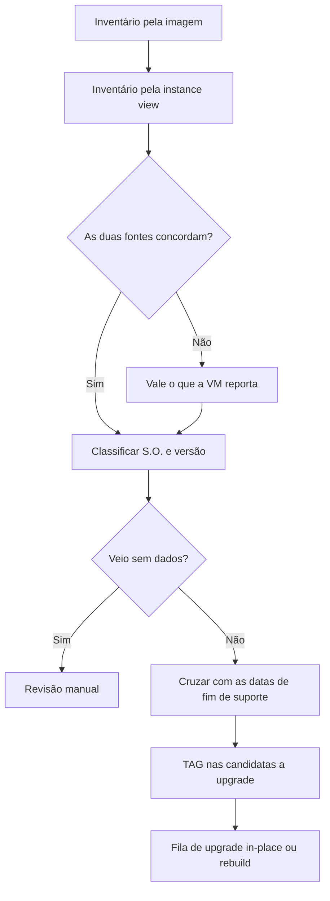

Fala pessoALL! Tudo certo por aí?

No [artigo anterior](https://blog.ruizsolutions.online/posts/azure-resource-graph-consultas-essenciais/) montamos o conjunto de consultas do Resource Graph que eu considero obrigatório para quem administra Azure. Hoje vamos usar a mesma ferramenta para responder uma pergunta que sempre chega com prazo curto: **quantas VMs nós temos rodando sistema operacional fora de suporte?**

A pergunta costuma vir da auditoria, do time de Segurança ou de um relatório de vulnerabilidades. E a resposta que quase todo mundo dá primeiro é abrir a lista de VMs no portal, exportar, filtrar pela imagem e contar.

Só que a imagem diz com qual S.O. a VM **nasceu**. Ela não diz qual S.O. está rodando hoje.

Quem acompanhou a trilogia de upgrade in-place aqui do blog ([Windows Server](https://blog.ruizsolutions.online/posts/upgrade-in-place-windows-server-azure-vm/), [Windows Client](https://blog.ruizsolutions.online/posts/upgrade-in-place-windows-client-azure-vm/) e [Linux](https://blog.ruizsolutions.online/posts/upgrade-in-place-linux-azure-vm/)) já viu isso acontecer na prática: a VM sai do Windows Server 2016 para o 2025, ou do Ubuntu 18.04 para o 24.04, e a referência de imagem continua apontando para a versão antiga. O inventário feito pela imagem acusa uma máquina que já foi tratada e, pior, deixa passar a que foi criada a partir de imagem customizada e não tem publisher nem SKU para filtrar.

E o calendário não ajuda. O terceiro e último ano de ESU do Windows Server 2012 e 2012 R2 terminou em 13 de outubro de 2026, o Windows Server 2016 sai do suporte estendido em 12 de janeiro de 2027 e o Debian 11 perdeu o LTS no fim de agosto. Tem muita VM mudando de categoria neste semestre.

**Neste artigo, vamos montar uma consulta do Resource Graph que classifica as VMs por S.O. e versão usando o que o sistema reporta de dentro da máquina, cruzar com as datas oficiais de fim de suporte de Windows Server, Ubuntu e Debian e marcar com TAG as candidatas a upgrade.**

> O Resource Graph só enxerga o que o Azure Resource Manager conhece. Ele não substitui uma ferramenta de inventário de software nem um scanner de vulnerabilidades, e não vê servidores fora do Azure que não estejam no Azure Arc. O que sai daqui é a lista de onde olhar primeiro.
{: .prompt-warning }

---

## De onde vem a informação de S.O. de uma VM?

Uma VM do Azure guarda o sistema operacional em dois lugares diferentes, e eles respondem perguntas diferentes.

O primeiro é o `properties.storageProfile.imageReference`, com `publisher`, `offer`, `sku` e `version`. É o registro da imagem usada na criação. A própria documentação de upgrade in-place do Windows Server avisa que, depois do upgrade, a informação da imagem de origem nas propriedades da VM **permanece inalterada**: a imagem usada no deploy continua a mesma e só o S.O. é atualizado.

O segundo é a **instance view**, o estado de execução da VM. Ali existem dois campos, `osName` e `osVersion`, descritos na API como o sistema operacional e a versão que estão rodando na máquina. No Resource Graph eles aparecem dentro de `properties.extended.instanceView`, no mesmo bloco em que fica o `powerState`.

| Campo | O que representa | Quando engana |
| --- | --- | --- |
| `storageProfile.imageReference` | Imagem usada para criar a VM | Depois de upgrade in-place, em VM criada de imagem customizada ou de disco anexado |
| `extended.instanceView.osName` e `osVersion` | S.O. reportado de dentro da VM | Quando vem vazio: VM sem agente respondendo ou que nunca reportou |
| `storageProfile.osDisk.osType` | Somente `Windows` ou `Linux` | Não tem versão, serve só como filtro |

Nenhum dos dois resolve sozinho. O `imageReference` mente depois de um upgrade e o `instanceView` pode vir vazio. Por isso a consulta deste artigo usa o `instanceView` como fonte principal, cai para a imagem quando ele está vazio e **registra em uma coluna qual das duas fontes foi usada**.

> Na documentação do Resource Graph, as propriedades em `properties.extended` aparecem como recurso em *preview*. Funcionam bem para inventário, mas eu não amarraria um processo crítico só nelas sem uma conferência de vez em quando.
{: .prompt-info }

O fluxo que vamos seguir:



---

## As datas de fim de suporte

Antes de escrever a consulta, precisamos da régua. Todas as datas abaixo foram conferidas nas páginas oficiais de lifecycle em 02/10/2026, e os links estão na tabela de artigos no final.

### Windows Server

O Windows Server segue a política fixa da Microsoft: suporte mainstream, depois suporte estendido, em que só saem correções de segurança.

| Versão | Fim do mainstream | Fim do suporte estendido | Situação em outubro de 2026 |
| --- | :---: | :---: | --- |
| Windows Server 2012 e 2012 R2 | 09/10/2018 | 10/10/2023 | Sem suporte. O ESU terminou em 13/10/2026 |
| Windows Server 2016 | 11/01/2022 | 12/01/2027 | Estendido, com menos de três meses pela frente |
| Windows Server 2019 | 09/01/2024 | 09/01/2029 | Estendido |
| Windows Server 2022 | 13/10/2026 | 14/10/2031 | Acabou de entrar no estendido |
| Windows Server 2025 | 13/11/2029 | 14/11/2034 | Mainstream |

Sobre o **ESU (Extended Security Updates)**: é o programa que entrega correções críticas e importantes por um período depois do fim do suporte estendido. Para Windows Server 2012 e 2012 R2 ele durou três anos, e nas VMs hospedadas no Azure foi entregue automaticamente e sem custo adicional. Esse período acabou. A Microsoft descreve o ESU como último recurso, e eu concordo: ele compra tempo para planejar, não resolve o problema.

### Ubuntu

A Canonical trabalha com cinco anos de manutenção de segurança padrão para cada LTS. Depois disso, as correções continuam só com **ESM (Expanded Security Maintenance)**, que faz parte da assinatura Ubuntu Pro e leva a cobertura a dez anos. Acima disso a Canonical ainda vende um add-on Legacy do Ubuntu Pro, que estica a cobertura até quinze anos. É o único caminho que sobrou para o 16.04.

| Versão | Fim do suporte padrão | Fim do ESM (Ubuntu Pro) | Situação em outubro de 2026 |
| --- | :---: | :---: | --- |
| Ubuntu 16.04 LTS | 04/2021 | 05/2026 | Padrão e ESM encerrados. Resta só o add-on Legacy, pago |
| Ubuntu 18.04 LTS | 05/2023 | 05/2028 | Só com Ubuntu Pro |
| Ubuntu 20.04 LTS | 05/2025 | 05/2030 | Só com Ubuntu Pro |
| Ubuntu 22.04 LTS | 05/2027 | 05/2032 | Suporte padrão, com menos de 12 meses pela frente |
| Ubuntu 24.04 LTS | 05/2029 | 05/2034 | Suporte padrão |
| Ubuntu 26.04 LTS | 05/2031 | 05/2036 | Suporte padrão |

A documentação do Azure Update Manager reforça o ponto: para Ubuntu 18.04 e 20.04, a Canonical deixou de publicar correções de segurança no repositório `Main` fora do Ubuntu Pro.

### Debian

O Debian dá três anos de suporte completo e mais dois de **LTS**. O detalhe que muita gente desconhece: o LTS não é mantido pelo time de segurança do Debian, e sim por um grupo separado de voluntários e empresas. Depois dele só existe o ELTS, que é pago e de terceiros.

| Versão | Fim do suporte completo | Fim do LTS | Situação em outubro de 2026 |
| --- | :---: | :---: | --- |
| Debian 10 (Buster) | 10/09/2022 | 30/06/2024 | Sem suporte |
| Debian 11 (Bullseye) | 14/08/2024 | 31/08/2026 | Sem suporte, o LTS acabou de encerrar |
| Debian 12 (Bookworm) | 11/07/2026 | 30/06/2028 | Em LTS |
| Debian 13 (Trixie) | 09/08/2028 | 30/06/2030 | Suporte completo |

> Essas datas mudam. A Microsoft já estendeu o prazo do Windows Server 2012 uma vez, por exemplo. Antes de apresentar o relatório para alguém, abra as páginas de lifecycle e confira de novo. A consulta deste artigo tem as datas escritas dentro dela, então ela também precisa de revisão periódica.
{: .prompt-warning }

---

## Pré-requisitos

- Permissão de **Reader** no escopo que será consultado (assinatura ou management group). Sem leitura no recurso, o Resource Graph simplesmente não devolve a linha;
- Para aplicar a TAG no final: **Tag Contributor** ou **Virtual Machine Contributor** no mesmo escopo;
- **Azure Cloud Shell** ou uma estação com Azure CLI 2.22.0 ou superior e a extensão `resource-graph`;
- Para o script do Passo 6: PowerShell com os módulos `Az.Accounts`, `Az.ResourceGraph` e `Az.Resources`;
- Pelo menos duas ou três VMs para testar. As duas VMs do resource group `rg-arg-lab-wus2-001`, criadas no artigo anterior, já servem. Se você executou os laboratórios de upgrade in-place, melhor ainda: naquelas VMs a imagem e o S.O. real já não batem.

> Nenhuma consulta deste artigo cria recurso. O que gera cobrança são as VMs que você mantiver ligadas para o teste, então desligue ou remova as de laboratório quando terminar.
{: .prompt-info }

---

## Mão na massa!

### Passo 1 - O inventário pela imagem, que é o que todo mundo faz

Vamos começar pelo caminho comum, para ter com o que comparar.

1. No portal do Azure, pesquise por **Resource Graph Explorer**;
2. Se precisar mudar o escopo, clique em **Directory** e selecione o diretório, o management group ou a assinatura que deseja consultar;
3. Cole a consulta abaixo e clique em **Run query**.

```kusto
Resources
| where type =~ 'microsoft.compute/virtualmachines'
| extend publisher = tostring(properties.storageProfile.imageReference.publisher)
| extend offer = tostring(properties.storageProfile.imageReference.offer)
| extend sku = tostring(properties.storageProfile.imageReference.sku)
| summarize VMs = count() by publisher, offer, sku
| order by VMs desc
```

<!-- PRINT 002: Resource Graph Explorer com a consulta por imageReference e a aba Results mostrando as colunas publisher, offer, sku e VMs, incluindo uma linha com os três campos vazios -->
{: .shadow .rounded-10 }
<br>

Repare em duas coisas no resultado.

A primeira é a linha com `publisher`, `offer` e `sku` vazios. São as VMs que não nasceram de uma imagem do Marketplace: criadas a partir de imagem da Compute Gallery (como as do artigo de [Azure Image Builder](https://blog.ruizsolutions.online/posts/azure-image-builder-windows-linux/)), de imagem gerenciada ou de um disco já existente. Para essas, o inventário pela imagem não diz nada.

A segunda só aparece se você tem VM que passou por upgrade in-place: ela continua contada na versão antiga.

<!-- LUIZ: você já pegou um inventário ou relatório apontando versão errada de S.O. por causa de upgrade in-place ou de imagem customizada? Vale um parágrafo curto contando como percebeu, sem identificar o ambiente. -->

---

### Passo 2 - O que a VM reporta de dentro

Agora a mesma contagem, usando a instance view:

```kusto
Resources
| where type =~ 'microsoft.compute/virtualmachines'
| extend osName = tostring(properties.extended.instanceView.osName)
| extend osVersion = tostring(properties.extended.instanceView.osVersion)
| summarize VMs = count() by osName, osVersion
| order by VMs desc
```

<!-- PRINT 003: Resource Graph Explorer com a consulta por instanceView e a aba Results mostrando osName, osVersion e VMs, com pelo menos uma linha Windows, uma Ubuntu e uma Debian -->
{: .shadow .rounded-10 }
<br>

Esse é o passo mais importante do artigo, e eu sugiro que você não pule: **olhe os valores reais do seu ambiente antes de confiar em qualquer classificação**. No exemplo da documentação da API, uma VM Windows aparece com `osName` igual a `Windows Server 2016 Datacenter` e `osVersion` igual a `Microsoft Windows NT 10.0.14393.0`. Em Linux o esperado é o nome da distribuição em `osName` e o número da release em `osVersion`, mas o formato exato depende do que o agente da VM envia.

<!-- VALIDAR: anotar no laboratório os valores exatos de osName e osVersion para Windows Server 2016/2019/2022/2025, Ubuntu 18.04/20.04/22.04/24.04 e Debian 10/11/12/13. A consulta do Passo 4 assume "ubuntu" e "debian" em osName e a release no início de osVersion. -->

O mesmo levantamento pelo Azure CLI, para quem prefere terminal:

```bash
az graph query -q "Resources | where type =~ 'microsoft.compute/virtualmachines' | extend osName = tostring(properties.extended.instanceView.osName), osVersion = tostring(properties.extended.instanceView.osVersion) | summarize VMs = count() by osName, osVersion | order by VMs desc" --first 1000 --output table
```

> Na primeira vez que você roda `az graph`, o CLI oferece a instalação da extensão. Se preferir instalar antes, use `az extension add --name resource-graph`.
{: .prompt-tip }

---

### Passo 3 - Colocando as duas fontes lado a lado

Com as duas visões na mão, vamos listar as VMs em que a imagem e o S.O. reportado contam histórias diferentes. Aqui a comparação é visual, sem tentar adivinhar por regra:

```kusto
Resources
| where type =~ 'microsoft.compute/virtualmachines'
| extend imgOffer = tostring(properties.storageProfile.imageReference.offer)
| extend imgSku = tostring(properties.storageProfile.imageReference.sku)
| extend osName = tostring(properties.extended.instanceView.osName)
| extend osVersion = tostring(properties.extended.instanceView.osVersion)
| extend PowerState = tostring(properties.extended.instanceView.powerState.code)
| project name, resourceGroup, imgOffer, imgSku, osName, osVersion, PowerState
| order by name asc
```

<!-- PRINT 004: resultado da consulta lado a lado, destacando uma VM em que imgSku indica a versão antiga (por exemplo 2016-Datacenter ou 18.04-LTS) e osName/osVersion indicam a versão atual depois do upgrade in-place -->
{: .shadow .rounded-10 }
<br>

Se quiser ver a mesma divergência em uma VM só, abra a VM no portal: o campo **Operating system** da tela **Overview** mostra o que a máquina reporta, enquanto o **JSON View** continua exibindo o `imageReference` original.

<!-- PRINT 005: VM que passou por upgrade in-place, tela Overview com o campo Operating system na versão nova e, ao lado, o JSON View aberto mostrando storageProfile.imageReference com o sku antigo -->
{: .shadow .rounded-10 }
<br>

> Um ponto que a documentação da Microsoft deixa explícito: depois do upgrade in-place de Windows Server, recursos que dependem da informação de imagem, como Automatic VM guest patching, Hotpatch e o próprio Azure Update Manager, não são oficialmente suportados e podem falhar. A divergência que você está vendo na tela tem consequência operacional.
{: .prompt-danger }

---

### Passo 4 - A consulta de classificação

Agora juntamos tudo. A consulta abaixo faz quatro coisas, nesta ordem:

1. Lê o `osName` e o `osVersion` da instance view e, quando estão vazios, usa `offer` e `sku` da imagem como plano B;
2. Grava na coluna **Fonte** de onde veio a informação (`instanceView`, `imageReference` ou `sem dados`);
3. Normaliza o resultado em um nome de S.O. legível na coluna **SO**;
4. Aplica a régua de datas e devolve **Situacao**, **Prioridade** e **Candidata**.

**O arquivo está no meu repositório: [013-so-fim-de-suporte.kql](https://github.com/lfrleite/Ruiz-Online/tree/main/Azure%20Resource%20Graph)**

<!-- VALIDAR: rodar a consulta no Explorer, no az graph query e no Search-AzGraph. As funções case(), iff(), strcat() e tolower() são KQL padrão, mas a página da linguagem do Resource Graph só fala em "subconjunto" e não lista as funções escalares aceitas. Não há exemplo oficial do Resource Graph com case(). Se o case() for recusado, trocar por iff() encadeado no artigo e no arquivo .kql. -->

```kusto
Resources
| where type =~ 'microsoft.compute/virtualmachines'
| extend osType = tostring(properties.storageProfile.osDisk.osType)
| extend osName = tostring(properties.extended.instanceView.osName)
| extend osVersion = tostring(properties.extended.instanceView.osVersion)
| extend imgOffer = tostring(properties.storageProfile.imageReference.offer)
| extend imgSku = tostring(properties.storageProfile.imageReference.sku)
| extend PowerState = tostring(properties.extended.instanceView.powerState.code)
| extend TagUpgrade = tostring(tags['UpgradeSO'])
| extend Fonte = case(isnotempty(osName), 'instanceView', isnotempty(imgSku), 'imageReference', 'sem dados')
| extend nome = tolower(iff(isnotempty(osName), osName, strcat(imgOffer, ' ', imgSku)))
| extend versao = tolower(iff(isnotempty(osName), osVersion, strcat(imgOffer, ' ', imgSku)))
| extend ehWinServer = osType =~ 'Windows' and nome contains 'server'
| extend SO = case(
    ehWinServer and (nome contains '2012 r2' or nome contains '2012-r2'), 'Windows Server 2012 R2',
    ehWinServer and nome contains '2012', 'Windows Server 2012',
    ehWinServer and nome contains '2016', 'Windows Server 2016',
    ehWinServer and nome contains '2019', 'Windows Server 2019',
    ehWinServer and nome contains '2022', 'Windows Server 2022',
    ehWinServer and nome contains '2025', 'Windows Server 2025',
    nome contains 'ubuntu' and (versao contains '16.04' or versao contains '16_04' or versao contains 'xenial'), 'Ubuntu 16.04 LTS',
    nome contains 'ubuntu' and (versao contains '18.04' or versao contains '18_04' or versao contains 'bionic'), 'Ubuntu 18.04 LTS',
    nome contains 'ubuntu' and (versao contains '20.04' or versao contains '20_04' or versao contains 'focal'), 'Ubuntu 20.04 LTS',
    nome contains 'ubuntu' and (versao contains '22.04' or versao contains '22_04' or versao contains 'jammy'), 'Ubuntu 22.04 LTS',
    nome contains 'ubuntu' and (versao contains '24.04' or versao contains '24_04' or versao contains 'noble'), 'Ubuntu 24.04 LTS',
    nome contains 'ubuntu' and (versao contains '26.04' or versao contains '26_04'), 'Ubuntu 26.04 LTS',
    nome contains 'debian' and (versao startswith '10' or versao contains 'debian-10'), 'Debian 10',
    nome contains 'debian' and (versao startswith '11' or versao contains 'debian-11'), 'Debian 11',
    nome contains 'debian' and (versao startswith '12' or versao contains 'debian-12'), 'Debian 12',
    nome contains 'debian' and (versao startswith '13' or versao contains 'debian-13'), 'Debian 13',
    'Nao classificado')
| extend Situacao = case(
    SO in ('Windows Server 2012', 'Windows Server 2012 R2'), 'Sem suporte: ESU encerrado em 13/10/2026',
    SO == 'Windows Server 2016', 'Suporte estendido ate 12/01/2027',
    SO == 'Windows Server 2019', 'Suporte estendido ate 09/01/2029',
    SO == 'Windows Server 2022', 'Suporte estendido ate 14/10/2031',
    SO == 'Windows Server 2025', 'Mainstream ate 13/11/2029',
    SO == 'Ubuntu 16.04 LTS', 'Sem suporte: padrao e ESM encerrados (resta so o add-on Legacy, pago)',
    SO == 'Ubuntu 18.04 LTS', 'Sem suporte padrao desde 05/2023, ESM (Ubuntu Pro) ate 05/2028',
    SO == 'Ubuntu 20.04 LTS', 'Sem suporte padrao desde 05/2025, ESM (Ubuntu Pro) ate 05/2030',
    SO == 'Ubuntu 22.04 LTS', 'Suporte padrao ate 05/2027',
    SO == 'Ubuntu 24.04 LTS', 'Suporte padrao ate 05/2029',
    SO == 'Ubuntu 26.04 LTS', 'Suporte padrao ate 05/2031',
    SO == 'Debian 10', 'Sem suporte: LTS encerrado em 30/06/2024',
    SO == 'Debian 11', 'Sem suporte: LTS encerrado em 31/08/2026',
    SO == 'Debian 12', 'LTS ate 30/06/2028',
    SO == 'Debian 13', 'Suporte completo ate 09/08/2028',
    'Revisar manualmente')
| extend Prioridade = case(
    SO in ('Windows Server 2012', 'Windows Server 2012 R2', 'Ubuntu 16.04 LTS', 'Debian 10', 'Debian 11'), '1 - Sem suporte',
    SO in ('Ubuntu 18.04 LTS', 'Ubuntu 20.04 LTS'), '2 - So com suporte pago',
    SO in ('Windows Server 2016', 'Ubuntu 22.04 LTS'), '3 - Vence em ate 12 meses',
    SO == 'Nao classificado', '9 - Revisar manualmente',
    '4 - Suportado')
| extend Candidata = iff(Prioridade startswith '1' or Prioridade startswith '2' or Prioridade startswith '3', 'Sim', 'Nao')
| project id, name, resourceGroup, subscriptionId, location, SO, Situacao, Prioridade, Candidata, Fonte, PowerState, osName, osVersion, imgOffer, imgSku, TagUpgrade
| order by Prioridade asc, id asc
```

Cole no Resource Graph Explorer e clique em **Run query**.

<!-- PRINT 006: Resource Graph Explorer com a consulta de classificação e a aba Results mostrando as colunas name, SO, Situacao, Prioridade, Candidata e Fonte, com VMs em prioridades diferentes -->
{: .shadow .rounded-10 }
<br>

Alguns detalhes que eu só deixei assim depois de pensar no que dá errado:

- No Windows a comparação é feita **só no nome**, nunca no `osVersion`. O número de build do Windows pode conter uma sequência como `2012` ou `2016` e gerar classificação errada;
- A coluna auxiliar `ehWinServer` exige a palavra `server` no nome. Sem ela, no plano B pela imagem, uma VM de SQL Server com oferta `sql2019-ws2022` seria classificada como Windows Server 2019, e um Windows 10 LTSC 2019 também;
- No plano B pela imagem, as ofertas do Ubuntu mudaram de padrão ao longo dos anos, então a consulta procura a versão com ponto, com underline e pelo codinome (`18.04`, `18_04`, `bionic`);
- A ordem das condições importa. O `case()` devolve a primeira que for verdadeira, por isso `2012 r2` vem antes de `2012`;
- O que não encaixa em nenhuma regra vira **Nao classificado** com prioridade **9 - Revisar manualmente**. Windows 10 e 11, RHEL, SLES e appliances de Marketplace caem aqui de propósito. Prefiro uma lista para revisar do que uma classificação inventada.

As prioridades ficaram assim:

| Prioridade | Quem entra | O que fazer |
| --- | --- | --- |
| `1 - Sem suporte` | Windows Server 2012 e 2012 R2, Ubuntu 16.04, Debian 10 e 11 | Upgrade ou substituição com data marcada |
| `2 - So com suporte pago` | Ubuntu 18.04 e 20.04 | Confirmar se há Ubuntu Pro. Se não há, tratar como prioridade 1 |
| `3 - Vence em ate 12 meses` | Windows Server 2016, Ubuntu 22.04 | Entrar no planejamento agora |
| `4 - Suportado` | Demais versões reconhecidas | Acompanhar |
| `9 - Revisar manualmente` | O que a consulta não reconheceu | Olhar uma a uma |

> A consulta não tem como saber se uma VM Ubuntu 18.04 ou 20.04 tem Ubuntu Pro ativo. Esse dado mora dentro do S.O. e não no Resource Manager. Em ambiente real eu trato essas VMs como sem suporte até alguém provar o contrário.
{: .prompt-warning }

Para o resumo que vai no relatório, troque as duas últimas linhas da consulta (`project` e `order by`) por:

```kusto
| summarize VMs = count() by Prioridade
| order by Prioridade asc
```

Com o resultado em contagem, a aba **Charts** permite escolher **Bar chart** ou **Donut chart**.

<!-- PRINT 007: aba Charts do Resource Graph Explorer com Donut chart mostrando a quantidade de VMs por Prioridade -->
{: .shadow .rounded-10 }
<br>

Salve a consulta para não precisar remontar: clique em **Save**, informe um nome, mantenha o tipo **Private queries** e confirme em **Save**. Depois de salva, o gráfico pode ser fixado com **Pin to dashboard**, exatamente como fizemos no artigo anterior.

<!-- PRINT 008: painel Save query preenchido com o nome "SO - Fim de suporte" e o tipo Private queries selecionado -->
{: .shadow .rounded-10 }
<br>

---

### Passo 5 - As VMs que vieram sem dados

Antes de marcar qualquer coisa, vamos olhar o que a consulta não conseguiu confirmar pela instance view. Essa lista é pequena na maioria dos ambientes, mas é justamente onde costuma estar a VM esquecida.

```kusto
Resources
| where type =~ 'microsoft.compute/virtualmachines'
| extend osName = tostring(properties.extended.instanceView.osName)
| where isempty(osName)
| extend PowerState = tostring(properties.extended.instanceView.powerState.code)
| extend imgOffer = tostring(properties.storageProfile.imageReference.offer)
| extend imgSku = tostring(properties.storageProfile.imageReference.sku)
| project name, resourceGroup, subscriptionId, PowerState, imgOffer, imgSku
| order by PowerState asc, name asc
```

<!-- PRINT 009: resultado da consulta de VMs com osName vazio, mostrando a coluna PowerState com pelo menos uma VM em PowerState/deallocated -->
{: .shadow .rounded-10 }
<br>

Como ler o resultado:

- Se o PowerState é diferente de `PowerState/running`, a VM não está ligada para reportar. Quando ela tem `imgSku`, a classificação caiu no plano B. Se foi desligada depois de um upgrade, a imagem está mentindo, então confirme antes de marcar;
- Com `PowerState/running` e `osName` vazio, a VM está ligada e não reporta. O primeiro suspeito é o agente da VM. Confira o campo **Agent status** na aba **Properties** da VM;
- A VM sem `osName` e sem `imgSku` é a linha `sem dados`. Só entrando na máquina ou perguntando para o dono.

<!-- VALIDAR: conferir no laboratório se uma VM desalocada mantém o último osName/osVersion em properties.extended.instanceView ou se os campos voltam vazios. O texto acima assume que podem vir vazios. -->

> VM desligada há meses e com S.O. fora de suporte é uma ótima candidata a outra conversa: ela ainda precisa existir? Isso é assunto para o artigo de recursos órfãos que vem mais à frente nesta série.
{: .prompt-tip }

---

### Passo 6 - Marcando as candidatas com TAG

Lista conferida, hora de transformar em algo que outras ferramentas enxerguem. Eu sugiro uma TAG simples:

```text
UpgradeSO = Candidata
```

Por que TAG e não uma planilha? Porque a TAG acompanha o recurso. Ela vira filtro no portal, critério de consulta no Resource Graph e alvo de automação: o artigo de [snapshots por TAG](https://blog.ruizsolutions.online/posts/criando-snapshot-de-vms-atraves-de-tags/) e o de [ondas de patch com escopo dinâmico](https://blog.ruizsolutions.online/posts/azure-update-manager-escopo-dinamico-tags/) funcionam exatamente assim.

<!-- LUIZ: qual nome e quais valores de TAG você costuma usar para fila de upgrade (por exemplo Candidata, Agendada, Concluída)? Se tiver um padrão seu, substitua o sugerido aqui. -->

Para uma VM só, o Azure CLI resolve:

```bash
VM_ID=$(az resource show -g rg-arg-lab-wus2-001 -n vm-arg-win-wus2-001 --resource-type Microsoft.Compute/virtualMachines --query "id" --output tsv)

az tag update --resource-id $VM_ID --operation Merge --tags UpgradeSO=Candidata
```

> Use sempre `--operation Merge`. O `az tag create` e a operação `Replace` **substituem todas as TAGs do recurso**. Em uma VM que depende de TAG para start/stop, snapshot ou janela de patch, isso quebra a automação sem dar erro nenhum.
{: .prompt-danger }

Para várias VMs, o script abaixo roda a consulta do Passo 4 com paginação, grava o resultado em CSV e só aplica a TAG quando você pede.

**Baixe os dois arquivos da pasta [Azure Resource Graph](https://github.com/lfrleite/Ruiz-Online/tree/main/Azure%20Resource%20Graph) e mantenha-os no mesmo diretório.**

```powershell
<#
.SYNOPSIS
    Classifica as VMs por S.O. e situacao de suporte com o Azure Resource Graph,
    gera um CSV e, se solicitado, marca as candidatas a upgrade com uma TAG.

.DESCRIPTION
    Executa a consulta do arquivo 013-so-fim-de-suporte.kql com paginacao,
    exporta o resultado completo em CSV e lista as VMs com Candidata = Sim.
    Sem o parametro -Apply nada e alterado. Com -Apply, a TAG e aplicada com
    Update-AzTag em modo Merge, que preserva as TAGs existentes.
    A coluna TagUpgrade da consulta le a TAG UpgradeSO. Se voce trocar -TagName,
    troque tambem o nome da TAG dentro do arquivo .kql.

.EXAMPLE
    ./013-Marcar-CandidatasUpgrade.ps1
    Somente relatorio, em todas as assinaturas do contexto atual.

.EXAMPLE
    ./013-Marcar-CandidatasUpgrade.ps1 -ManagementGroup 'mg-lab' -Apply -WhatIf
    Mostra quais VMs receberiam a TAG, sem aplicar.

.EXAMPLE
    ./013-Marcar-CandidatasUpgrade.ps1 -Subscription '00000000-0000-0000-0000-000000000000' -Apply
    Aplica a TAG nas candidatas de uma assinatura.
#>
[CmdletBinding(SupportsShouldProcess = $true, ConfirmImpact = 'Medium')]
param(
    [string]$QueryFile = (Join-Path $PSScriptRoot '013-so-fim-de-suporte.kql'),
    [string[]]$Subscription,
    [string]$ManagementGroup,
    [string]$CsvPath = (Join-Path (Get-Location) '013-so-fim-de-suporte.csv'),
    [string]$TagName = 'UpgradeSO',
    [string]$TagValue = 'Candidata',
    [switch]$Apply
)

$ErrorActionPreference = 'Stop'

foreach ($module in 'Az.Accounts', 'Az.ResourceGraph', 'Az.Resources') {
    if (-not (Get-Module -ListAvailable -Name $module)) {
        throw "Modulo $module nao encontrado. Instale com: Install-Module -Name $module -Scope CurrentUser"
    }
}

if (-not (Get-AzContext)) {
    throw 'Nenhuma sessao ativa no Azure. Execute Connect-AzAccount antes de rodar o script.'
}

if ($Subscription -and $ManagementGroup) {
    throw 'Informe -Subscription ou -ManagementGroup, nao os dois.'
}

if (-not (Test-Path -Path $QueryFile -PathType Leaf)) {
    throw "Arquivo de consulta nao encontrado: $QueryFile"
}

$query = Get-Content -Path $QueryFile -Raw

$scope = @{}
if ($ManagementGroup) {
    $scope.ManagementGroup = $ManagementGroup
}
elseif ($Subscription) {
    $scope.Subscription = $Subscription
}

# Paginacao: o Resource Graph devolve no maximo 1000 registros por chamada.
$rows = [System.Collections.Generic.List[object]]::new()
$skipToken = $null
do {
    $page = @{ Query = $query; First = 1000 }
    if ($skipToken) {
        $page.SkipToken = $skipToken
    }

    try {
        $response = Search-AzGraph @page @scope
    }
    catch {
        throw "Falha ao consultar o Resource Graph: $($_.Exception.Message)"
    }

    foreach ($row in $response.Data) {
        $rows.Add($row)
    }
    $skipToken = $response.SkipToken
} while ($skipToken)

# Sem a coluna id, ou com limit/take na consulta, o Resource Graph nao devolve skip token.
if ($rows.Count -eq 1000) {
    Write-Warning 'Vieram exatamente 1000 registros. Se o ambiente tem mais VMs, confira se a consulta projeta a coluna id e nao usa limit ou take.'
}

if ($rows.Count -eq 0) {
    Write-Warning 'A consulta nao retornou nenhuma VM. Confira o escopo e se a sua conta tem permissao de leitura.'
    return
}

$columns = 'name', 'resourceGroup', 'subscriptionId', 'location', 'SO', 'Situacao', 'Prioridade',
           'Candidata', 'Fonte', 'PowerState', 'osName', 'osVersion', 'imgOffer', 'imgSku', 'TagUpgrade', 'id'

$rows | Select-Object -Property $columns | Export-Csv -Path $CsvPath -NoTypeInformation -Encoding utf8
Write-Host "VMs analisadas: $($rows.Count). CSV gravado em $CsvPath"

$rows | Group-Object -Property Prioridade | Sort-Object -Property Name |
    Select-Object -Property @{ Name = 'Prioridade'; Expression = { $_.Name } }, @{ Name = 'VMs'; Expression = { $_.Count } } |
    Format-Table -AutoSize | Out-Host

$candidates = @($rows | Where-Object { $_.Candidata -eq 'Sim' })
Write-Host "Candidatas a upgrade: $($candidates.Count)"

if (-not $Apply) {
    Write-Host 'Nenhuma TAG foi aplicada. Revise o CSV e rode de novo com -Apply (use -WhatIf para simular).'
    return
}

$tagged = 0
$skipped = 0
$failed = 0

foreach ($vm in $candidates) {
    if ($TagName -eq 'UpgradeSO' -and $vm.TagUpgrade -eq $TagValue) {
        $skipped++
        continue
    }

    if ($PSCmdlet.ShouldProcess($vm.name, "Aplicar TAG $TagName=$TagValue")) {
        try {
            Update-AzTag -ResourceId $vm.id -Tag @{ $TagName = $TagValue } -Operation Merge | Out-Null
            $tagged++
            Write-Host "TAG aplicada: $($vm.name) ($($vm.SO))"
        }
        catch {
            $failed++
            Write-Warning "Falha ao aplicar TAG em $($vm.name): $($_.Exception.Message)"
        }
    }
}

Write-Host "Resumo: $tagged marcadas, $skipped ja estavam marcadas, $failed com falha."

if ($failed -gt 0) {
    Write-Error "$failed VM(s) nao receberam a TAG. Veja os avisos acima." -ErrorAction Continue
    exit 1
}
```

Primeiro rode sem parâmetro nenhum. Nada é alterado, você só recebe o CSV e o resumo:

```powershell
./013-Marcar-CandidatasUpgrade.ps1
```

<!-- PRINT 010: Cloud Shell (PowerShell) com a saída do script sem -Apply: total de VMs analisadas, caminho do CSV, tabela por Prioridade e a quantidade de candidatas -->
{: .shadow .rounded-10 }
<br>

A saída segue este formato. Os números são apenas exemplo:

```text
VMs analisadas: 42. CSV gravado em /home/usuario/013-so-fim-de-suporte.csv

Prioridade                VMs
----------                ---
1 - Sem suporte             6
3 - Vence em ate 12 meses   9
4 - Suportado              25
9 - Revisar manualmente     2

Candidatas a upgrade: 15
Nenhuma TAG foi aplicada. Revise o CSV e rode de novo com -Apply (use -WhatIf para simular).
```

Abra o CSV e revise. É esse arquivo que vai para a GMUD e para a conversa com os donos das aplicações.

<!-- PRINT 011: arquivo 013-so-fim-de-suporte.csv aberto, mostrando as colunas name, SO, Situacao, Prioridade, Candidata e Fonte -->
{: .shadow .rounded-10 }
<br>

Em seguida simule a marcação:

```powershell
./013-Marcar-CandidatasUpgrade.ps1 -Apply -WhatIf
```

E, se a lista estiver correta, aplique:

```powershell
./013-Marcar-CandidatasUpgrade.ps1 -Apply
```

<!-- PRINT 012: Cloud Shell com a saída do script com -Apply, mostrando as linhas "TAG aplicada" e o resumo final com marcadas, já marcadas e falhas -->
{: .shadow .rounded-10 }
<br>

Para limitar o escopo, use `-Subscription` com um ou mais IDs de assinatura, ou `-ManagementGroup` com o ID do management group. Os dois não podem ser usados juntos.

> O script marca todas as candidatas, incluindo as que caíram no plano B da imagem. Se o seu Passo 5 mostrou VMs desligadas que já passaram por upgrade, tire-as da lista antes: ajuste a consulta para marcar somente `Fonte == 'instanceView'` ou remova a TAG depois.
{: .prompt-warning }

---

### Passo 7 - Validando e acompanhando a fila

Confira a TAG em uma das VMs pelo portal, na tela **Tags**:

<!-- PRINT 013: tela Tags de uma VM candidata mostrando a TAG UpgradeSO com valor Candidata ao lado das TAGs que já existiam -->
{: .shadow .rounded-10 }
<br>

E a visão geral pelo Resource Graph:

```kusto
Resources
| where type =~ 'microsoft.compute/virtualmachines'
| where tags['UpgradeSO'] =~ 'Candidata'
| extend osName = tostring(properties.extended.instanceView.osName)
| extend osVersion = tostring(properties.extended.instanceView.osVersion)
| project name, resourceGroup, subscriptionId, osName, osVersion
| order by name asc
```

<!-- PRINT 014: resultado da consulta filtrando tags['UpgradeSO'] igual a Candidata, listando as VMs marcadas com osName e osVersion -->
{: .shadow .rounded-10 }
<br>

Essa consulta é a sua fila. Conforme os upgrades forem acontecendo, o `osName` e o `osVersion` mudam sozinhos e a VM sai da lista de candidatas na próxima execução da consulta de classificação. A TAG, essa não sai sozinha: remova quando a VM for atualizada, ou troque o valor para registrar que foi concluída.

Daqui para frente o caminho de cada VM está nos artigos de upgrade:

- Para Windows Server, siga o [Atualizando o Windows Server em uma VM do Azure sem surpresas](https://blog.ruizsolutions.online/posts/upgrade-in-place-windows-server-azure-vm/). O Windows Server 2025 aceita upgrade direto a partir do 2012 R2 em servidores sem cluster;
- Ubuntu e Debian estão no [Atualizando VMs Linux no Azure sem reconstruir tudo do zero](https://blog.ruizsolutions.online/posts/upgrade-in-place-linux-azure-vm/), versão a versão;
- Apareceu Windows 10 na lista de revisão manual? O caminho está em [Atualizando uma VM do Azure com Windows 10 para Windows 11 sem formatação](https://blog.ruizsolutions.online/posts/upgrade-in-place-windows-client-azure-vm/).

E vale repetir o que eu disse em todos eles: upgrade in-place sem snapshot é aposta. Nem toda VM da lista é boa candidata, e para algumas a resposta certa é reconstruir em uma imagem nova.

---

## Erros comuns

### A consulta não retorna nada ou retorna menos VMs que o esperado

O Resource Graph só devolve o que a sua conta consegue ler. Confira o escopo selecionado em **Directory** no Explorer e, no CLI, as assinaturas visíveis:

```bash
az account list --output table
```

### O resultado do PowerShell para em 100 linhas

O `Search-AzGraph` devolve 100 registros por padrão. O máximo por chamada é 1000, com `-First 1000`, e acima disso é preciso paginar com `-SkipToken`, que é o que o script do Passo 6 faz.

### A paginação não devolve o skip token

Acontece quando a consulta tem `limit`, `take` ou `sample`, ou quando a projeção não inclui a coluna `id`. A consulta de classificação mantém o `id` e ordena por ele no final justamente por isso.

### Erro ao rodar az graph

Confira se a extensão está instalada:

```bash
az extension list --output table
```

### A TAG não aplica pelo portal com Tag Contributor

É o comportamento documentado: a role **Tag Contributor** não aplica TAG em recursos e resource groups pelo portal. A documentação garante todas as operações de TAG por Azure PowerShell e REST API, então use o script do Passo 6.

### A VM já foi atualizada e continua aparecendo na versão antiga

Veja a coluna **Fonte**. Se estiver `imageReference`, a VM não está reportando pela instance view e a consulta usou a imagem. Ligue a VM, confira o agente e rode de novo.

### Falha ao aplicar TAG em uma VM específica

Um recurso aceita no máximo 50 TAGs. Liste as atuais antes de insistir:

```bash
az tag list --resource-id $VM_ID
```

---

## Checklist

- [x] Passo 1 - Inventário pela imagem (`imageReference`) e identificação das VMs sem publisher e SKU;
- [x] Passo 2 - Inventário pelo S.O. reportado (`osName` e `osVersion`) e conferência dos valores reais do ambiente;
- [x] Passo 3 - Comparação das duas fontes lado a lado;
- [x] Passo 4 - Consulta de classificação com situação de suporte e prioridade, salva no Explorer;
- [x] Passo 5 - Revisão das VMs sem dados na instance view;
- [x] Passo 6 - Exportação em CSV e marcação das candidatas com a TAG `UpgradeSO`;
- [x] Passo 7 - Validação da TAG e consulta de acompanhamento da fila.

---

## Limpeza do ambiente

Se você marcou VMs só para testar, remova a TAG:

```bash
az tag update --resource-id $VM_ID --operation Delete --tags UpgradeSO=Candidata
```

A consulta salva sai pelo próprio Explorer: **Open a query**, tipo **Private queries**, e o ícone de lixeira ao lado do nome.

A extensão do CLI, se não for mais usar:

```bash
az extension remove --name resource-graph
```

E não esqueça das VMs de laboratório. São elas que geram custo.

---

## Artigos

| Nome | Link |
| :---: | :---: |
| Arquivos deste laboratório | <https://github.com/lfrleite/Ruiz-Online/tree/main/Azure%20Resource%20Graph> |
| Resource Graph: as consultas essenciais | <https://blog.ruizsolutions.online/posts/azure-resource-graph-consultas-essenciais/> |
| Atualizando o Windows Server em uma VM do Azure sem surpresas | <https://blog.ruizsolutions.online/posts/upgrade-in-place-windows-server-azure-vm/> |
| Atualizando uma VM do Azure com Windows 10 para Windows 11 sem formatação | <https://blog.ruizsolutions.online/posts/upgrade-in-place-windows-client-azure-vm/> |
| Atualizando VMs Linux no Azure sem reconstruir tudo do zero | <https://blog.ruizsolutions.online/posts/upgrade-in-place-linux-azure-vm/> |
| Understanding the Azure Resource Graph query language | <https://learn.microsoft.com/en-us/azure/governance/resource-graph/concepts/query-language> |
| Working with large Azure resource data sets | <https://learn.microsoft.com/en-us/azure/governance/resource-graph/concepts/work-with-data> |
| Quickstart: Run Resource Graph query using Azure portal | <https://learn.microsoft.com/en-us/azure/governance/resource-graph/first-query-portal> |
| Quickstart: Run Resource Graph query using Azure CLI | <https://learn.microsoft.com/en-us/azure/governance/resource-graph/first-query-azurecli> |
| Search-AzGraph | <https://learn.microsoft.com/en-us/powershell/module/az.resourcegraph/search-azgraph> |
| Virtual Machines - Instance View (REST API) | <https://learn.microsoft.com/en-us/rest/api/compute/virtual-machines/instance-view> |
| In-place upgrade for VMs running Windows Server in Azure | <https://learn.microsoft.com/en-us/azure/virtual-machines/windows-in-place-upgrade> |
| Apply tags with Azure CLI | <https://learn.microsoft.com/en-us/azure/azure-resource-manager/management/tag-resources-cli> |
| Use tags to organize your Azure resources | <https://learn.microsoft.com/en-us/azure/azure-resource-manager/management/tag-resources> |
| Windows Server 2012 - Lifecycle | <https://learn.microsoft.com/en-us/lifecycle/products/windows-server-2012> |
| Windows Server 2012 R2 - Lifecycle | <https://learn.microsoft.com/en-us/lifecycle/products/windows-server-2012-r2> |
| Windows Server 2016 - Lifecycle | <https://learn.microsoft.com/en-us/lifecycle/products/windows-server-2016> |
| Windows Server 2019 - Lifecycle | <https://learn.microsoft.com/en-us/lifecycle/products/windows-server-2019> |
| Windows Server 2022 - Lifecycle | <https://learn.microsoft.com/en-us/lifecycle/products/windows-server-2022> |
| Windows Server 2025 - Lifecycle | <https://learn.microsoft.com/en-us/lifecycle/products/windows-server-2025> |
| Windows Server release information | <https://learn.microsoft.com/en-us/windows/release-health/windows-server-release-info> |
| Lifecycle FAQ - Extended Security Updates | <https://learn.microsoft.com/en-us/lifecycle/faq/extended-security-updates> |
| Extended Security Updates for Windows Server overview | <https://learn.microsoft.com/en-us/windows-server/get-started/extended-security-updates-overview> |
| Guidance on security awareness and Ubuntu Pro support | <https://learn.microsoft.com/en-us/azure/update-manager/security-awareness-ubuntu-support> |
| Ubuntu release cycle | <https://ubuntu.com/about/release-cycle> |
| Debian Releases | <https://www.debian.org/releases/> |
| Debian Long Term Support | <https://www.debian.org/lts/> |

---

## The End!

Esse aqui teve menos clique e mais consulta do que o normal.

O que eu queria deixar é uma ideia só: inventário de S.O. feito pela imagem conta a história de quando a VM foi criada. Para saber o que está rodando hoje, a pergunta tem que ser feita para a instance view, e a resposta precisa vir acompanhada de qual fonte foi usada. Uma coluna a mais na consulta evita muita reunião discutindo se o número está certo.

Sendo bem sincero, a consulta é a parte fácil. O trabalho de verdade começa depois que a lista existe: achar o dono de cada VM, negociar janela, decidir entre upgrade in-place e rebuild. Mas sem a lista essa conversa nem começa, e com a TAG aplicada ela deixa de depender de planilha na máquina de alguém.

Lista de fim de suporte sem dono e sem data é só mais um relatório.

Em um próximo artigo voltamos ao Azure Update Manager para montar o relatório de compliance de patch, também em cima do Resource Graph. As duas visões se completam: uma diz se o S.O. ainda recebe correção, a outra diz se a correção foi aplicada.

Quantas VMs caíram na prioridade 1 quando você rodou a consulta no seu ambiente? Me conta lá no LinkedIn, e conta também se apareceu algum S.O. que a classificação não reconheceu, porque eu quero melhorar o `case()`.

Obrigado por me acompanharem até aqui. Nos vemos na próxima!
