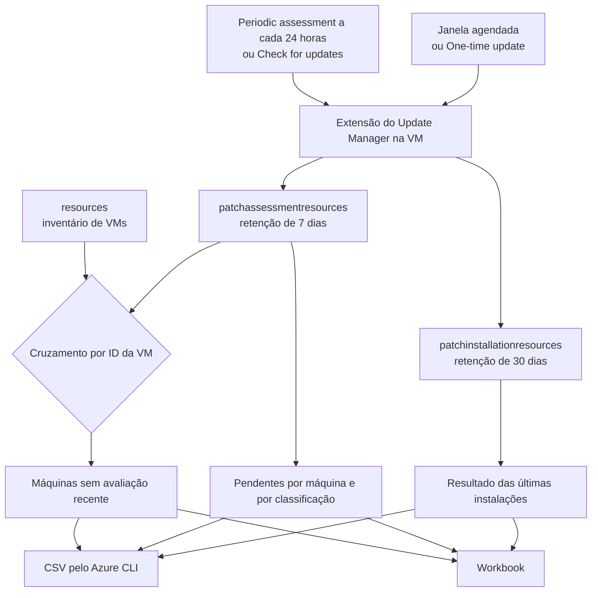

Fala pessoALL! Prontos pra mais um da série de patch?

Nos últimos artigos nós montamos a operação inteira: o [Azure Update Manager do zero](https://blog.ruizsolutions.online/posts/azure-update-manager-do-zero/), as [ondas de DEV, HML e PRD com escopo dinâmico e TAGs](https://blog.ruizsolutions.online/posts/azure-update-manager-escopo-dinamico-tags/) e o [snapshot automático antes do patch](https://blog.ruizsolutions.online/posts/azure-update-manager-snapshot-pre-evento/). A janela dispara, as VMs atualizam, o histórico fica verde.

Aí chega a pergunta que sempre chega, do gestor ou da auditoria: **"nós estamos em dia com patch?"**

A resposta mais comum é abrir o histórico da maintenance configuration, mostrar que a janela do mês rodou com sucesso e encerrar o assunto. Eu não oriento a responder assim. O histórico diz que a janela executou nas máquinas que estavam dentro dela. Ele não diz nada sobre a VM que nunca entrou em nenhuma janela, sobre a que ficou desligada naquela madrugada, nem sobre a que está há semanas sem sequer ser avaliada.

Sendo bem sincero: máquina que nunca foi avaliada não aparece em vermelho em lugar nenhum. Ela simplesmente não aparece.

<!-- LUIZ: você já recebeu um pedido de evidência de patch (auditoria, Segurança, gestor) em que o histórico da janela não foi suficiente? Vale uma ou duas frases contando o que faltava, sem citar onde. -->

Os dados para responder direito já existem e não custam nada a mais. O Update Manager grava o resultado de cada avaliação e de cada instalação no **Azure Resource Graph**, em duas tabelas próprias. Quem leu o artigo das [consultas essenciais de Resource Graph](https://blog.ruizsolutions.online/posts/azure-resource-graph-consultas-essenciais/) já sabe o caminho, aqui nós só vamos apontar para outras tabelas.

**Neste artigo, vamos consultar as tabelas `patchassessmentresources` e `patchinstallationresources`, tirar os updates pendentes por máquina e por classificação, o resultado das últimas instalações e a lista de máquinas sem avaliação recente, exportar tudo em CSV pelo Azure CLI e montar um Workbook simples para acompanhar no portal.**

> O Resource Graph guarda a avaliação por **7 dias** e o resultado das instalações por **30 dias**. Se a sua necessidade é provar o que aconteceu há três meses, consulta ao vivo não serve. Nesse caso o CSV exportado todo mês passa a ser a sua evidência, e ele precisa ser guardado em algum lugar.
{: .prompt-warning }

---

## Mas antes, de onde vêm esses dados?

Toda vez que o Update Manager avalia ou instala alguma coisa, a extensão que roda dentro da máquina devolve o resultado para a plataforma, e esse resultado vai parar no Resource Graph. São três tabelas que interessam para relatório:

| Tabela | O que guarda | Retenção |
| --- | --- | --- |
| `patchassessmentresources` | A última avaliação de cada máquina e a lista de updates pendentes | 7 dias |
| `patchinstallationresources` | Cada execução de instalação e o estado de cada update dentro dela | 30 dias |
| `maintenanceresources` | As execuções das maintenance configurations e os vínculos entre máquina e janela | Não informada por tabela |

As duas primeiras guardam dois tipos de registro cada, e esse é o detalhe que mais confunde na primeira consulta. Existe o registro de **resumo**, um por máquina ou por execução, com os contadores. E existe o registro de **item**, um por update, cujo `type` termina em `softwarepatches`. É por isso que quase toda consulta desse artigo começa com `where type !has "softwarepatches"` ou com `where type has "softwarepatches"`: é a escolha entre o resumo e o detalhe.



Repare na caixa do meio. As tabelas de patch só conhecem máquina que já foi avaliada. Para achar a que nunca foi, a consulta precisa partir do inventário, a tabela `resources`, e só depois cruzar com a avaliação. Relatório que nasce de `patchassessmentresources` já nasce sem as máquinas mais problemáticas.

---

## O que eu considero compliance de patch

Antes de escrever consulta, vale combinar o que o relatório precisa responder. Eu trabalho com três perguntas, nesta ordem:

1. **A máquina está sendo avaliada?** Sem avaliação recente, qualquer número de pendência é chute;
2. **O que está pendente nela, e de qual classificação?** Dez updates de definição pendentes e um crítico pendente são conversas bem diferentes;
3. **A última instalação terminou como?** Sucesso, falha, reinício pendente, janela estourada.

Só a terceira pergunta aparece no histórico da janela. As outras duas ficam de fora, e é nelas que o problema costuma estar.

> Os prazos são seus. O relatório mostra o que está pendente e desde quando, mas quem define em quantos dias um update crítico precisa estar aplicado é a política da sua empresa. Feche esse número com o time de Segurança antes de sair pintando máquina de vermelho.
{: .prompt-info }

---

## Pré-requisitos

- As duas VMs de laboratório do [primeiro artigo da série](https://blog.ruizsolutions.online/posts/azure-update-manager-do-zero/) (uma Windows Server e uma Linux), ou qualquer VM suportada pelo Update Manager. Aqui eu uso o resource group `rg-aum-lab-wus2-001` com as VMs `vm-aum-win-001` e `vm-aum-lnx-001`. Se as VMs das ondas do segundo artigo (`vm-aum-dev-001`, `vm-aum-hml-001` e `vm-aum-prd-001`) ainda existirem, elas aparecem nas consultas do mesmo jeito. Se os nomes do seu laboratório forem outros, é só trocar;
- Permissão de **Reader** no escopo que será consultado. O Resource Graph só devolve o que você consegue ler, e sem leitura ele devolve uma lista vazia, sem erro;
- Para disparar avaliação sob demanda, **Virtual Machine Contributor** nas VMs. É a role pronta que a documentação do Update Manager indica para VM do Azure;
- Para salvar o Workbook, permissão de escrita em um resource group (no laboratório, **Contributor** no `rg-aum-lab-wus2-001`);
- **Azure CLI** na versão 2.22.0 ou superior, que é o mínimo da extensão `resource-graph`, ou o **Cloud Shell**;
- **jq** para converter o resultado em CSV. Confirme com `jq --version` antes de rodar o script.

> O que gera custo neste laboratório são as VMs ligadas, e elas já existiam. A documentação descreve o Resource Graph como um serviço sem custo e sem nada para implantar, e as consultas deste artigo não criam nenhum recurso.
{: .prompt-info }

---

## Mão na massa!

### Passo 1 - Garantir que existe dado para consultar

A retenção da avaliação é de 7 dias. Se o laboratório ficou parado desde o último artigo, a tabela pode estar vazia, e o primeiro reflexo é achar que a consulta está errada.

A avaliação só acontece em VM **ligada**. Máquina em `Stopped` ou `Stopped (deallocated)` não é avaliada. Então ligue as duas e dispare a avaliação pelo Cloud Shell:

```bash
az vm start --resource-group rg-aum-lab-wus2-001 --name vm-aum-win-001
az vm start --resource-group rg-aum-lab-wus2-001 --name vm-aum-lnx-001

az vm assess-patches --resource-group rg-aum-lab-wus2-001 --name vm-aum-win-001
az vm assess-patches --resource-group rg-aum-lab-wus2-001 --name vm-aum-lnx-001
```

<!-- PRINT 002: Cloud Shell com o retorno do az vm assess-patches da vm-aum-win-001, mostrando o status da avaliação e as contagens de patches -->
{: .shadow .rounded-10 }
<br>

Agora confirme que os registros chegaram:

1. No portal, pesquise por **Resource Graph Explorer**;
2. Se precisar trocar o escopo, clique em **Directory** e escolha o diretório, o management group ou a assinatura;
3. Cole a consulta abaixo e clique em **Run query**.

```kusto
patchassessmentresources
| distinct type
```

O retorno esperado são os tipos de resumo e de item, para VM do Azure e, se você tiver, para servidor com Azure Arc.

<!-- PRINT 003: Resource Graph Explorer com a consulta patchassessmentresources | distinct type e a aba Results mostrando os tipos patchassessmentresults e patchassessmentresults/softwarepatches -->
{: .shadow .rounded-10 }
<br>

> Se a tabela `patchinstallationresources` vier vazia, é porque nenhuma instalação rodou nos últimos 30 dias. Rode um **One-time update** em uma das VMs, como fizemos no primeiro artigo da série, e volte aqui.
{: .prompt-tip }

---

### Passo 2 - Updates pendentes por máquina

A primeira consulta usa o registro de resumo. Cada linha é uma máquina, com a data da última avaliação e a quantidade de updates pendentes em cada classificação. Os contadores ficam dentro de `properties.availablePatchCountByClassification`.

**Todas as consultas e o script deste artigo estão no meu repositório: [Azure Update Manager](https://github.com/lfrleite/Ruiz-Online/tree/main/Azure%20Update%20Manager)**

Arquivo `compliance-01-pendentes-por-maquina.kql`:

```kusto
// Compliance 01 - Resumo da ultima avaliacao de cada maquina
// Uma linha por maquina, com a contagem de updates pendentes por classificacao.
// Retencao desta tabela no Resource Graph: 7 dias.
patchassessmentresources
| where type !has "softwarepatches"
| extend prop = parse_json(properties)
| extend maquina = tostring(split(id, "/")[8]),
         so = tostring(prop.osType),
         ultimaAvaliacao = todatetime(prop.lastModifiedDateTime),
         rebootPendente = tostring(prop.rebootPending),
         criticos = toint(prop.availablePatchCountByClassification.critical),
         seguranca = toint(prop.availablePatchCountByClassification.security),
         updateRollup = toint(prop.availablePatchCountByClassification.updateRollup),
         featurePack = toint(prop.availablePatchCountByClassification.featurePack),
         servicePack = toint(prop.availablePatchCountByClassification.servicePack),
         definicoes = toint(prop.availablePatchCountByClassification.definition),
         ferramentas = toint(prop.availablePatchCountByClassification.tools),
         atualizacoes = toint(prop.availablePatchCountByClassification.updates),
         outros = toint(prop.availablePatchCountByClassification.other)
| order by criticos desc, seguranca desc, maquina asc, id asc
| project maquina, resourceGroup, subscriptionId, so, ultimaAvaliacao, rebootPendente, criticos, seguranca, updateRollup, featurePack, servicePack, definicoes, ferramentas, atualizacoes, outros
```

<!-- PRINT 004: Resource Graph Explorer com o resultado da consulta 01, mostrando as duas VMs do laboratório, a coluna ultimaAvaliacao e as colunas criticos e seguranca -->
{: .shadow .rounded-10 }
<br>

Dois pontos sobre o que aparece nessa tela.

A data vem em **UTC**. Quem lê o relatório no Brasil vai achar que a avaliação rodou três horas depois do que rodou de verdade.

E a classificação é a que o próprio S.O. informa. Quando o Windows Update ou o gerenciador de pacotes não diz a categoria, a documentação avisa que o update cai em `Updates` no Windows e em `Others` no Linux. Em distribuição Linux é comum quase tudo aparecer em `outros`, e isso não quer dizer que não exista correção de segurança ali no meio.

---

### Passo 3 - A lista dos pendentes, um por linha

O resumo diz quantos. Para saber quais, a consulta muda para o registro de item, o que tem `softwarepatches` no tipo.

Arquivo `compliance-02-pendentes-detalhe.kql`:

```kusto
// Compliance 02 - Lista dos updates pendentes, um por linha
// kb vem preenchido em Windows e versao vem preenchida em Linux.
patchassessmentresources
| where type has "softwarepatches"
| extend prop = parse_json(properties)
| extend maquina = tostring(split(id, "/")[8]),
         classificacao = tostring(prop.classifications),
         patch = tostring(prop.patchName),
         kb = tostring(prop.kbId),
         versao = tostring(prop.version),
         publicadoEm = todatetime(prop.publishedDateTime),
         exigeReboot = tostring(prop.rebootRequired),
         registradoEm = todatetime(prop.lastModifiedDateTime)
| order by maquina asc, classificacao asc, patch asc, id asc
| project maquina, resourceGroup, subscriptionId, classificacao, patch, kb, versao, publicadoEm, exigeReboot, registradoEm
```

<!-- PRINT 005: Resource Graph Explorer com o resultado da consulta 02, mostrando linhas da VM Windows com a coluna kb preenchida e linhas da VM Linux com a coluna versao preenchida -->
{: .shadow .rounded-10 }
<br>

A coluna `kb` só faz sentido no Windows e a `versao` só no Linux. A `publicadoEm`, que seria ótima para calcular há quantos dias o update existe, hoje não vem preenchida para Linux, segundo a própria documentação. Se a sua régua de prazo depende dessa data, ela só funciona para Windows.

Para a visão por classificação no ambiente todo, o caminho é contar os itens.

Arquivo `compliance-03-pendentes-por-classificacao.kql`:

```kusto
// Compliance 03 - Total de updates pendentes por classificacao no escopo consultado
patchassessmentresources
| where type has "softwarepatches"
| extend classificacao = tostring(properties.classifications)
| summarize pendentes = count() by classificacao
| order by pendentes desc, classificacao asc
```

Como essa consulta devolve contagem, o Resource Graph Explorer consegue desenhar. Depois do **Run query**, abra a aba **Charts** e troque o tipo para **Bar chart** ou **Donut chart**.

<!-- PRINT 006: Resource Graph Explorer na aba Charts com o gráfico Bar chart da consulta 03, mostrando a quantidade de updates pendentes por classificação -->
{: .shadow .rounded-10 }
<br>

---

### Passo 4 - O resultado das últimas instalações

Agora a tabela é a `patchinstallationresources`. O registro de resumo traz uma linha por execução, com o status e os contadores do que foi instalado, do que falhou e do que ficou para trás.

Arquivo `compliance-04-instalacoes-30-dias.kql`:

```kusto
// Compliance 04 - Execucoes de instalacao dos ultimos 30 dias
// Uma linha por execucao, da mais recente para a mais antiga dentro de cada maquina.
// Retencao desta tabela no Resource Graph: 30 dias.
patchinstallationresources
| where type !has "softwarepatches"
| extend prop = parse_json(properties)
| extend maquina = tostring(split(id, "/")[8]),
         so = tostring(prop.osType),
         inicio = todatetime(prop.startDateTime),
         atualizadoEm = todatetime(prop.lastModifiedDateTime),
         status = tostring(prop.status),
         iniciadoPor = tostring(prop.startedBy),
         reboot = tostring(prop.rebootStatus),
         janelaEstourada = tostring(prop.maintenanceWindowExceeded),
         instalados = toint(prop.installedPatchCount),
         comFalha = toint(prop.failedPatchCount),
         pendentes = toint(prop.pendingPatchCount),
         excluidos = toint(prop.excludedPatchCount),
         naoSelecionados = toint(prop.notSelectedPatchCount),
         erros = tostring(prop.errorDetails)
| where atualizadoEm > ago(30d)
| order by maquina asc, inicio desc, id asc
| project maquina, resourceGroup, subscriptionId, so, inicio, status, iniciadoPor, reboot, janelaEstourada, instalados, comFalha, pendentes, excluidos, naoSelecionados, erros, execucao = name
```

<!-- PRINT 007: Resource Graph Explorer com o resultado da consulta 04, mostrando as execuções das duas VMs com as colunas status, reboot, janelaEstourada, instalados e comFalha -->
{: .shadow .rounded-10 }
<br>

A consulta ordena por máquina e, dentro dela, da execução mais recente para a mais antiga. A primeira linha de cada máquina é a última instalação.

O que eu olho nessas colunas:

- `status` pode ser `Succeeded`, `Failed`, `CompletedWithWarnings`, `InProgress` ou `NotStarted`. A execução inteira é marcada como `Failed` se **um único** update falhar, então `Failed` com 40 instalados e 1 com falha é bem diferente de `Failed` com zero instalados;
- `reboot` com valor `Required` significa que os updates foram aplicados e a máquina ainda não reiniciou. Para efeito de compliance, eu trato como pendente;
- `janelaEstourada` em `true` indica que a duração da maintenance configuration está curta para aquela máquina;
- `iniciadoPor` separa o que veio de agendamento do que alguém disparou na mão.

Para saber quantas execuções cada máquina teve em cada status no mês:

Arquivo `compliance-05-instalacoes-por-status.kql`:

```kusto
// Compliance 05 - Quantidade de execucoes por maquina e por status nos ultimos 30 dias
patchinstallationresources
| where type !has "softwarepatches"
| extend maquina = tostring(split(id, "/")[8]),
         status = tostring(properties.status),
         atualizadoEm = todatetime(properties.lastModifiedDateTime)
| where atualizadoEm > ago(30d)
| summarize execucoes = count() by maquina, resourceGroup, subscriptionId, status
| order by maquina asc, resourceGroup asc, subscriptionId asc, status asc
```

E, quando houver falha, quais updates ficaram pelo caminho:

Arquivo `compliance-06-patches-com-falha.kql`:

```kusto
// Compliance 06 - Updates que falharam ou ficaram pendentes dentro de uma execucao
// A coluna execucao e o identificador que aparece na consulta 04.
patchinstallationresources
| where type has "softwarepatches"
| extend prop = parse_json(properties)
| extend maquina = tostring(split(id, "/")[8]),
         execucao = tostring(split(id, "/")[10]),
         estado = tostring(prop.installationState),
         classificacao = tostring(prop.classifications),
         patch = tostring(prop.patchName),
         kb = tostring(prop.kbId),
         versao = tostring(prop.version),
         atualizadoEm = todatetime(prop.lastModifiedDateTime)
| where estado in ("Failed", "Pending")
| order by maquina asc, atualizadoEm desc, id asc
| project maquina, resourceGroup, subscriptionId, execucao, estado, classificacao, patch, kb, versao, atualizadoEm
```

<!-- PRINT 008: Resource Graph Explorer com o resultado da consulta 06. Se o laboratório não tiver nenhuma falha, tirar o print da aba Results vazia com a aba Messages mostrando zero resultados -->
{: .shadow .rounded-10 }
<br>

> Em laboratório recém-criado o mais provável é essa consulta voltar vazia, e é o resultado certo. A causa de cada falha e onde procurar o log dentro do S.O. ficam para um próximo artigo, que fecha a série com troubleshooting.
{: .prompt-info }

---

### Passo 5 - As máquinas sem avaliação recente

Essa é a consulta que justifica o artigo.

<!-- VALIDAR: rodar a consulta 07 com uma VM ligada e uma desalocada no escopo. Dois pontos dependem do laboratório: (1) properties.extended.instanceView.powerState.code é uma extended property em preview no Resource Graph; se vier vazia, toda VM sem avaliação cai em "VM fora de execucao". (2) O cruzamento pelo id em minúsculas precisa casar a VM com o registro .../patchAssessmentResults/latest. -->

Ela parte da tabela `resources`, com todas as VMs do escopo, e faz um `join kind=leftouter` com o resumo da avaliação. VM que não tem registro em `patchassessmentresources` continua na lista, com a data em branco. O cruzamento é pelo ID da VM, que nas tabelas de patch é o começo do `id` do registro, antes de `/patchAssessmentResults`.

Arquivo `compliance-07-maquinas-sem-avaliacao.kql`:

```kusto
// Compliance 07 - Todas as VMs do escopo e a situacao da avaliacao de cada uma
// Parte do inventario (resources) e so depois cruza com a avaliacao.
// E esta consulta que mostra a maquina que nunca foi avaliada.
resources
| where type =~ "microsoft.compute/virtualmachines"
| extend vmId = tolower(id),
         so = tostring(properties.storageProfile.osDisk.osType),
         powerState = tostring(properties.extended.instanceView.powerState.code),
         modoWindows = tostring(properties.osProfile.windowsConfiguration.patchSettings.assessmentMode),
         modoLinux = tostring(properties.osProfile.linuxConfiguration.patchSettings.assessmentMode)
| extend modoAvaliacao = iff(so =~ "Windows", modoWindows, modoLinux)
| project vmId, maquina = name, resourceGroup, subscriptionId, so, powerState, modoAvaliacao
| join kind=leftouter (
    patchassessmentresources
    | where type !has "softwarepatches"
    | extend vmId = tolower(substring(id, 0, indexof(tolower(id), "/patchassessmentresults"))),
             ultimaAvaliacao = todatetime(properties.lastModifiedDateTime)
    | project vmId, ultimaAvaliacao
  ) on vmId
| extend situacao = case(
    isnull(ultimaAvaliacao) and powerState !has "running", "Sem avaliacao - VM fora de execucao",
    isnull(ultimaAvaliacao), "Sem avaliacao nos ultimos 7 dias",
    ultimaAvaliacao < ago(2d), "Avaliacao com mais de 48 horas",
    "Avaliacao em dia")
| order by situacao desc, maquina asc, vmId asc
| project maquina, resourceGroup, subscriptionId, so, powerState, modoAvaliacao, ultimaAvaliacao, situacao
```

<!-- PRINT 009: Resource Graph Explorer com o resultado da consulta 07, mostrando as VMs do laboratório com as colunas powerState, modoAvaliacao, ultimaAvaliacao e situacao. O ideal é ter uma VM desalocada para aparecer a situação Sem avaliacao - VM fora de execucao -->
{: .shadow .rounded-10 }
<br>

A coluna `situacao` separa quatro casos:

| Situação | Como ler |
| --- | --- |
| Avaliacao em dia | Avaliada nas últimas 48 horas |
| Avaliacao com mais de 48 horas | Existe registro, mas o periodic assessment deveria ter rodado de novo e não rodou |
| Sem avaliacao nos ultimos 7 dias | A VM está ligada e não tem nenhum registro dentro da retenção |
| Sem avaliacao - VM fora de execucao | Sem registro, e a VM não está em execução. Avaliação só roda em máquina ligada |

O corte de 48 horas é meu. O periodic assessment roda a cada 24 horas, então eu dou um ciclo de folga antes de chamar de atraso. Ajuste no `ago(2d)` se quiser outra régua.

A coluna `modoAvaliacao` vem da configuração da própria VM. `AutomaticByPlatform` é o periodic assessment ligado. `ImageDefault` ou vazio quer dizer que a máquina só é avaliada quando alguém manda, e nesse caso ficar sem avaliação é o comportamento esperado, por pior que seja.

> A quarta situação é a que mais engana. VM que passa a noite desligada pelo [Start/Stop](https://blog.ruizsolutions.online/posts/azure-tag-start-stop-vms/) e só liga em horário comercial pode ficar fora da janela de patch por meses e seguir funcionando normalmente. Ela não gera erro em nenhum lugar, porque para o Update Manager ela nunca esteve ali para falhar.
{: .prompt-danger }

<!-- LUIZ: já encontrou VM que ficou fora de patch por muito tempo por estar desligada na hora da janela ou por nunca ter tido o periodic assessment ligado? Se sim, conte em duas frases como descobriu, sem números nem nomes de ambiente. -->

Tem um limite do Resource Graph que aparece justamente aqui. Uma consulta aceita até três operações de `join` ou `union`, e só uma delas pode cruzar tabelas diferentes. A exceção é o cruzamento entre `resources` e `resourcecontainers`. Na prática: não dá para juntar, em uma consulta só, o inventário com a avaliação **e** com a instalação. Por isso avaliação e instalação ficaram em arquivos separados, e quem junta as duas visões é o CSV ou o Workbook.

Para corrigir o que a consulta mostrou, o caminho em escala é a policy **Configure periodic checking for missing system updates on Azure virtual machines**, da categoria **Azure Update Manager**, com remediation task. Ela precisa de uma atribuição para Windows e outra para Linux.

---

### Passo 6 - Exportar em CSV pelo CLI

Pelo portal, o botão **Download as CSV** do Resource Graph Explorer resolve o pedido avulso, com limite de 55.000 registros por arquivo.

<!-- PRINT 010: Resource Graph Explorer com o resultado da consulta 07 e o botão Download as CSV destacado na barra de ferramentas -->
{: .shadow .rounded-10 }
<br>

Para relatório mensal eu prefiro o CLI. Não depende de alguém lembrar de clicar e gera sempre os mesmos arquivos, com os mesmos nomes.

O comando é o `az graph query`. Ele devolve no máximo **1.000 registros** por chamada, que é o teto do parâmetro `--first`, e para passar disso é preciso paginar com `--skip`. Duas condições para a paginação funcionar: a consulta precisa ter `order by`, senão as páginas não são repetíveis, e não pode usar `limit` nem `take`, porque nesse caso o `--skip` é ignorado.

Tem um terceiro cuidado, que a documentação de paginação descreve e que pega quem ordena só pelo nome da máquina: se a coluna do `order by` tem valores repetidos, a posição dos empates muda entre uma chamada e outra, e o resultado paginado sai com linha duplicada ou faltando. Por isso as consultas de lista deste artigo terminam a ordenação com o `id` do registro, que é único. Repare que o `order by` vem antes do `project` justamente para o `id` ainda estar disponível.

Um teste rápido com uma consulta só:

```bash
az graph query \
  -q "patchassessmentresources | where type !has 'softwarepatches' | project id, lastModified = tostring(properties.lastModifiedDateTime) | order by id asc" \
  --first 1000 \
  --output table
```

<!-- PRINT 011: Cloud Shell com o retorno em tabela do az graph query acima, listando o id das avaliações e a data de cada uma -->
{: .shadow .rounded-10 }
<br>

O script abaixo faz isso para todos os arquivos `compliance-*.kql` da pasta: lê cada consulta, pagina de 1.000 em 1.000 e grava um CSV por consulta. Não tem credencial dentro dele, ele usa a sessão do `az login` que já estiver aberta.

Arquivo `compliance-export-csv.sh`:

```bash
#!/usr/bin/env bash
#
# compliance-export-csv.sh
# Exporta para CSV o resultado das consultas compliance-*.kql desta pasta,
# usando o Azure Resource Graph pelo Azure CLI.
#
# Uso:
#   ./compliance-export-csv.sh                              # todas as assinaturas que o login enxerga
#   ./compliance-export-csv.sh -s "<subId1> <subId2>"       # assinaturas especificas
#   ./compliance-export-csv.sh -m "<managementGroupId>"     # um management group
#   ./compliance-export-csv.sh -o ./relatorios              # pasta de saida
#
# Requisitos: Azure CLI 2.22.0 ou superior, extensao resource-graph, jq e uma
# sessao ja autenticada (az login). O script nao guarda nem pede credencial.
# Permissao: leitura (Reader) nos recursos consultados.

set -euo pipefail

PAGE_SIZE=1000   # valor maximo aceito pelo parametro --first
SCRIPT_DIR="$(cd "$(dirname "${BASH_SOURCE[0]}")" && pwd)"
OUT_DIR="./compliance-$(date +%Y-%m-%d)"
SUBSCRIPTIONS=""
MANAGEMENT_GROUPS=""

usage() {
  sed -n '2,15p' "$0" | sed 's/^# \{0,1\}//'
  exit "${1:-0}"
}

fail() {
  echo "ERRO: $*" >&2
  exit 1
}

while getopts ":s:m:o:h" opt; do
  case "$opt" in
    s) SUBSCRIPTIONS="$OPTARG" ;;
    m) MANAGEMENT_GROUPS="$OPTARG" ;;
    o) OUT_DIR="$OPTARG" ;;
    h) usage 0 ;;
    :) fail "a opcao -$OPTARG exige um valor." ;;
    \?) fail "opcao invalida: -$OPTARG. Use -h para ver o uso." ;;
  esac
done

if [ -n "$SUBSCRIPTIONS" ] && [ -n "$MANAGEMENT_GROUPS" ]; then
  fail "use -s ou -m, nao os dois ao mesmo tempo."
fi

command -v az >/dev/null 2>&1 || fail "Azure CLI nao encontrado."
command -v jq >/dev/null 2>&1 || fail "jq nao encontrado."

az account show --query id -o tsv >/dev/null 2>&1 \
  || fail "nenhuma sessao ativa. Rode 'az login' antes."

# A extensao resource-graph e quem entrega o comando 'az graph'.
EXT_COUNT="$(az extension list --query "[?name=='resource-graph'] | length(@)" -o tsv)"
if [ "$EXT_COUNT" = "0" ]; then
  echo "Instalando a extensao resource-graph..."
  az extension add --name resource-graph >/dev/null
fi

FAILED=0
SCOPE_ARGS=()
if [ -n "$SUBSCRIPTIONS" ]; then
  # shellcheck disable=SC2206
  SCOPE_ARGS=(--subscriptions $SUBSCRIPTIONS)
elif [ -n "$MANAGEMENT_GROUPS" ]; then
  # shellcheck disable=SC2206
  SCOPE_ARGS=(--management-groups $MANAGEMENT_GROUPS)
fi

shopt -s nullglob
QUERY_FILES=("$SCRIPT_DIR"/compliance-*.kql)
shopt -u nullglob
[ "${#QUERY_FILES[@]}" -gt 0 ] || fail "nenhum arquivo compliance-*.kql em $SCRIPT_DIR."

mkdir -p "$OUT_DIR"

# Converte a lista de objetos devolvida em 'data' para CSV.
# Colunas que vierem como objeto ou lista viram texto JSON dentro da celula.
JQ_HEADER='.data[0] | keys_unsorted | @csv'
JQ_ROWS='(.data[0] | keys_unsorted) as $cols
  | .data[]
  | [ .[$cols[]] | if type == "object" or type == "array" then tojson else . end ]
  | @csv'

for query_file in "${QUERY_FILES[@]}"; do
  name="$(basename "$query_file" .kql)"
  csv_file="$OUT_DIR/$name.csv"
  query="$(cat "$query_file")"
  skip=0
  total=0
  : > "$csv_file"

  echo "Consultando $name..."

  query_failed=0

  while :; do
    skip_args=()
    if [ "$skip" -gt 0 ]; then
      skip_args=(--skip "$skip")
    fi

    if ! page="$(az graph query -q "$query" --first "$PAGE_SIZE" \
        ${skip_args[@]+"${skip_args[@]}"} \
        ${SCOPE_ARGS[@]+"${SCOPE_ARGS[@]}"} \
        -o json)"; then
      query_failed=1
      break
    fi

    # Se o retorno nao for o JSON esperado, a consulta conta como falha.
    if ! rows="$(jq -e '.data | length' <<<"$page" 2>/dev/null)"; then
      query_failed=1
      break
    fi

    if [ "$rows" -eq 0 ]; then
      break
    fi

    if [ "$total" -eq 0 ]; then
      if ! jq -r "$JQ_HEADER" <<<"$page" >> "$csv_file"; then
        query_failed=1
        break
      fi
    fi
    if ! jq -r "$JQ_ROWS" <<<"$page" >> "$csv_file"; then
      query_failed=1
      break
    fi

    total=$((total + rows))

    # Pagina incompleta significa que acabou.
    if [ "$rows" -lt "$PAGE_SIZE" ]; then
      break
    fi
    skip=$((skip + PAGE_SIZE))
  done

  if [ "$query_failed" -eq 1 ]; then
    # Resultado parcial engana mais do que ajuda: o arquivo incompleto e removido.
    rm -f "$csv_file"
    FAILED=$((FAILED + 1))
    echo "  FALHOU. Rode o arquivo no Resource Graph Explorer para ver a mensagem completa." >&2
  elif [ "$total" -eq 0 ]; then
    rm -f "$csv_file"
    echo "  sem registros no escopo consultado."
  else
    echo "  $total linha(s) em $csv_file"
  fi
done

if [ "$FAILED" -gt 0 ]; then
  fail "$FAILED consulta(s) falharam. Os demais arquivos estao em: $OUT_DIR"
fi

echo "Concluido. Arquivos em: $OUT_DIR"
```

No Cloud Shell, com os arquivos do repositório na mesma pasta:

```bash
chmod +x compliance-export-csv.sh

# Todas as assinaturas que o seu login enxerga
./compliance-export-csv.sh

# Só uma assinatura
./compliance-export-csv.sh -s "<SUBSCRIPTION_ID>"

# Um management group inteiro
./compliance-export-csv.sh -m "<MANAGEMENT_GROUP_ID>"
```

A saída tem este formato. Os números abaixo são só exemplo:

```text
Consultando compliance-01-pendentes-por-maquina...
  2 linha(s) em ./compliance-2026-10-22/compliance-01-pendentes-por-maquina.csv
Consultando compliance-02-pendentes-detalhe...
  37 linha(s) em ./compliance-2026-10-22/compliance-02-pendentes-detalhe.csv
Consultando compliance-06-patches-com-falha...
  sem registros no escopo consultado.
Concluido. Arquivos em: ./compliance-2026-10-22
```

<!-- PRINT 012: Cloud Shell com a execução completa do compliance-export-csv.sh e, em seguida, o comando ls -l da pasta de saída listando os arquivos CSV gerados -->
{: .shadow .rounded-10 }
<br>

> O parâmetro `-m` recebe o **ID** do management group, não o nome de exibição. E a consulta por management group considera as primeiras 10.000 assinaturas abaixo dele.
{: .prompt-info }

> Esses CSVs são a sua memória além dos 30 dias. Em ambiente real eu agendaria a execução mensal, logo depois da última onda de patch, e guardaria os arquivos em um Storage Account com acesso restrito. Sem isso, a evidência de três meses atrás não existe mais.
{: .prompt-warning }

---

### Passo 7 - Montar o Workbook

CSV atende quem pede evidência. Para o acompanhamento do dia a dia, o Workbook é mais prático, porque roda as mesmas consultas ao vivo toda vez que alguém abre.

Antes de criar do zero, saiba que o Update Manager já tem um relatório pronto. Em **Azure Update Manager**, no menu **Monitoring**, entre em **Update reports** e abra o bloco **Azure Update Manager** e depois **Overview**. Ele traz quatro seções: **Machines overall status & configuration**, **Updates Data Overview**, **Schedules/Maintenance configurations** e **History of Installation runs**. Para muita gente isso já basta.

O que nós vamos montar é menor e gira em torno da pergunta que o relatório pronto não destaca: quem não está sendo avaliado.

1. Acesse **Azure Update Manager**;
2. Em **Monitoring**, clique em **Update reports**;
3. No bloco **Quick start**, clique em **Empty**.

<!-- PRINT 013: Tela Azure Update Manager | Update reports | Gallery com os blocos Quick start e Azure Update Manager visíveis -->
{: .shadow .rounded-10 }
<br>

**Primeiro bloco: o título**

1. Clique em **Add** e depois em **Add text**;
2. Escreva em markdown o título e uma linha explicando o que o relatório mostra e a retenção dos dados (7 dias para avaliação, 30 dias para instalação);
3. Clique em **Done Editing**.

Parece detalhe, mas quem abre o relatório daqui a seis meses não vai lembrar que os dados expiram.

**Segundo bloco: VMs por situação de avaliação**

1. Clique em **Add** e depois em **Add query**;
2. Em **Data source**, selecione **Azure Resource Graph**;
3. Escolha o nível da consulta (assinaturas, management groups ou o diretório inteiro) e selecione as assinaturas que o relatório deve cobrir;
4. Cole a consulta do arquivo `compliance-08-resumo-situacao.kql`;
5. Em **Visualization**, selecione **Pie**;
6. Clique em **Run Query** e depois em **Done Editing**.

Arquivo `compliance-08-resumo-situacao.kql`:

```kusto
// Compliance 08 - Quantidade de VMs por situacao de avaliacao
// Mesma logica da consulta 07, resumida para virar grafico no Workbook.
resources
| where type =~ "microsoft.compute/virtualmachines"
| extend vmId = tolower(id),
         powerState = tostring(properties.extended.instanceView.powerState.code)
| project vmId, powerState
| join kind=leftouter (
    patchassessmentresources
    | where type !has "softwarepatches"
    | extend vmId = tolower(substring(id, 0, indexof(tolower(id), "/patchassessmentresults"))),
             ultimaAvaliacao = todatetime(properties.lastModifiedDateTime)
    | project vmId, ultimaAvaliacao
  ) on vmId
| extend situacao = case(
    isnull(ultimaAvaliacao) and powerState !has "running", "Sem avaliacao - VM fora de execucao",
    isnull(ultimaAvaliacao), "Sem avaliacao nos ultimos 7 dias",
    ultimaAvaliacao < ago(2d), "Avaliacao com mais de 48 horas",
    "Avaliacao em dia")
| summarize maquinas = count() by situacao
| order by maquinas desc, situacao asc
```

<!-- PRINT 014: Workbook em modo de edição com o bloco de query preenchido: Data source em Azure Resource Graph, as assinaturas selecionadas, a consulta 08 colada e Visualization em Pie, antes de clicar em Done Editing -->
{: .shadow .rounded-10 }
<br>

> A Microsoft adora mudar o layout do portal. O campo que escolhe o Resource Graph aparece na documentação ora como **Data source**, ora como **Query type**. Se na sua tela o nome estiver diferente, o que importa é a opção **Azure Resource Graph**.
{: .prompt-info }

**Terceiro bloco: a lista de máquinas sem avaliação**

Repita o processo com a consulta do arquivo `compliance-07-maquinas-sem-avaliacao.kql` e deixe a **Visualization** em **Grid**. Essa é a tabela de trabalho: quem aparece nela fora de "Avaliacao em dia" tem dono e prazo para corrigir.

**Quarto bloco: pendentes por classificação**

Consulta do arquivo `compliance-03-pendentes-por-classificacao.kql`, com **Visualization** em **Bar (categorical)**.

**Quinto bloco: últimas instalações**

Consulta do arquivo `compliance-04-instalacoes-30-dias.kql`, com **Visualization** em **Grid**.

<!-- PRINT 015: Workbook em modo de edição com os cinco blocos montados: texto de título, gráfico de pizza por situação, grid de máquinas sem avaliação, gráfico de barras por classificação e grid das últimas instalações -->
{: .shadow .rounded-10 }
<br>

Para terminar:

1. Clique em **Done Editing** na barra superior;
2. Clique em **Save**;
3. Informe um nome, por exemplo:
   ```text
   Compliance de Patch - Lab
   ```
4. Escolha onde o Workbook será gravado. No laboratório, a mesma assinatura das VMs, o resource group `rg-aum-lab-wus2-001` e a região `West US 2`;
5. Confirme o salvamento.

<!-- PRINT 016: Painel de salvamento do Workbook preenchido com o nome Compliance de Patch - Lab, a assinatura, o resource group rg-aum-lab-wus2-001 e a região West US 2 -->
{: .shadow .rounded-10 }
<br>

<!-- PRINT 017: Workbook Compliance de Patch - Lab salvo, em modo de leitura, com os gráficos e as duas tabelas carregados -->
{: .shadow .rounded-10 }
<br>

> O Workbook roda as consultas com a permissão de **quem está abrindo**. Duas pessoas com acessos diferentes vão ver totais diferentes no mesmo relatório, e nenhuma das duas telas avisa disso. Se o número vai para uma apresentação, quem tira o print precisa ter leitura no escopo inteiro.
{: .prompt-warning }

---

## Erros comuns

### A consulta volta vazia e sem erro

É o mais frequente, e tem três causas possíveis: não houve avaliação nos últimos 7 dias, o escopo selecionado não inclui a assinatura das VMs, ou falta permissão de leitura. O Resource Graph não acusa falta de acesso, ele só não devolve nada.

Confirme o que o seu login enxerga:

```bash
az graph query -q "resources | where type =~ 'microsoft.compute/virtualmachines' | summarize vms = count() by subscriptionId" --output table
```

Se as VMs aparecem aqui e não aparecem nas tabelas de patch, falta avaliação. Volte ao Passo 1.

---

### O CSV parou em 1.000 linhas

O `az graph query` sem paginação devolve só a primeira página. O script do Passo 6 já pagina. Se você adaptou alguma consulta e o total travou em 1.000, procure um `limit` ou `take` no meio dela, ou um `order by` que sumiu.

Para saber o total real antes de exportar:

```bash
az graph query -q "patchassessmentresources | where type has 'softwarepatches' | summarize total = count()" --output table
```

---

### Erro ao adicionar mais um join

Mensagem citando limite de `join` ou o código `DisallowedMaxNumberOfRemoteTables`. É o limite que comentei no Passo 5: até três `join` ou `union` por consulta, com um só cruzamento entre tabelas diferentes, e a mesma tabela não pode aparecer mais de uma vez no lado direito.

A saída é separar em duas consultas e juntar depois, no CSV ou em blocos diferentes do Workbook.

---

### A consulta com `$left` e `$right` falha só no CLI

Dentro de aspas duplas o Bash tenta interpretar `$left` como variável, e a consulta chega quebrada no Resource Graph. Na linha de comando é preciso escapar com barra invertida: `\$left` e `\$right`. No PowerShell o escape é o acento grave.

O script deste artigo não tem esse problema porque lê a consulta de um arquivo.

---

### A consulta estoura o tempo

O Resource Graph corta a consulta em 30 segundos. Em escopo grande, a consulta 07 é a candidata, por causa do `join`. Reduza o escopo:

```bash
./compliance-export-csv.sh -s "<SUBSCRIPTION_ID>"
```

A documentação também recomenda que o lado esquerdo do `join` seja o menor possível. Se você só precisa de VMs de produção, filtre pela TAG logo depois do `where type`, antes do `join`.

---

### VM desalocada aparecendo como fora de compliance

Não é erro, é o comportamento documentado: avaliação só roda em VM ligada. A consulta 07 já separa esse caso em uma situação própria para você decidir o que fazer com ele. Eu sugiro não tirar do relatório. VM desligada há meses e sem patch vai ser ligada um dia, e vai voltar para a rede exatamente como estava.

---

## Checklist

- [x] Passo 1 - Ligar as VMs, disparar a avaliação e confirmar os registros no Resource Graph;
- [x] Passo 2 - Consultar os updates pendentes por máquina;
- [x] Passo 3 - Listar os pendentes um a um e totalizar por classificação;
- [x] Passo 4 - Consultar o resultado das instalações dos últimos 30 dias;
- [x] Passo 5 - Cruzar o inventário com a avaliação e achar as máquinas sem avaliação recente;
- [x] Passo 6 - Exportar as consultas em CSV pelo Azure CLI;
- [x] Passo 7 - Montar e salvar o Workbook de compliance.

---

## Limpeza do ambiente

As consultas e o CSV não criam recurso nenhum no Azure. O único item novo é o Workbook, que fica salvo no resource group.

Se você vai seguir para o próximo artigo da série, mantenha as VMs e apenas desaloque para não pagar computação:

```bash
az vm deallocate --resource-group rg-aum-lab-wus2-001 --name vm-aum-win-001
az vm deallocate --resource-group rg-aum-lab-wus2-001 --name vm-aum-lnx-001
```

Para apagar só o Workbook, abra **Update reports**, entre na aba **Workbooks**, localize o `Compliance de Patch - Lab` e exclua.

Se o laboratório acabou aqui, o resource group das VMs não é a única coisa a apagar. Os dynamic scopes do [artigo das ondas](https://blog.ruizsolutions.online/posts/azure-update-manager-escopo-dinamico-tags/) ficam no nível da assinatura, e o resource group `rg-aum-snap-lab-wus2-001` e a custom role do [artigo do snapshot](https://blog.ruizsolutions.online/posts/azure-update-manager-snapshot-pre-evento/) ficam fora do `rg-aum-lab-wus2-001`. Siga antes a limpeza de cada um deles. Depois:

```bash
az group delete \
  --name rg-aum-lab-wus2-001 \
  --yes \
  --no-wait
```

> Em ambiente real, muito cuidado com esse comando. Ele remove tudo dentro do Resource Group, inclusive as maintenance configurations dos artigos anteriores.
{: .prompt-danger }

---

## Artigos

| Nome | Link |
| :---: | :---: |
| Arquivos deste laboratório | <https://github.com/lfrleite/Ruiz-Online/tree/main/Azure%20Update%20Manager> |
| Azure Update Manager do zero | <https://blog.ruizsolutions.online/posts/azure-update-manager-do-zero/> |
| Ondas de patch com escopo dinâmico e TAGs | <https://blog.ruizsolutions.online/posts/azure-update-manager-escopo-dinamico-tags/> |
| Snapshot automático antes do patch | <https://blog.ruizsolutions.online/posts/azure-update-manager-snapshot-pre-evento/> |
| Resource Graph: as consultas essenciais | <https://blog.ruizsolutions.online/posts/azure-resource-graph-consultas-essenciais/> |
| Start/Stop de VMs com TAGs | <https://blog.ruizsolutions.online/posts/azure-tag-start-stop-vms/> |
| Acessar dados de operações do Azure Update Manager usando o Azure Resource Graph | <https://learn.microsoft.com/pt-br/azure/update-manager/query-logs> |
| Exemplos de consultas do Azure Resource Graph para o Azure Update Manager | <https://learn.microsoft.com/pt-br/azure/update-manager/sample-query-logs> |
| Criar relatórios no Azure Update Manager | <https://learn.microsoft.com/pt-br/azure/update-manager/manage-workbooks> |
| About workbooks in Azure Update Manager | <https://learn.microsoft.com/en-us/azure/update-manager/workbooks> |
| Assessment options in Update Manager | <https://learn.microsoft.com/en-us/azure/update-manager/assessment-options> |
| Automate assessment at scale by using Azure Policy | <https://learn.microsoft.com/en-us/azure/update-manager/periodic-assessment-at-scale> |
| How to programmatically manage updates for Azure VMs | <https://learn.microsoft.com/en-us/azure/update-manager/manage-vms-programmatically> |
| Roles and permissions in Azure Update Manager | <https://learn.microsoft.com/en-us/azure/update-manager/roles-permissions> |
| Working with large Azure resource data sets | <https://learn.microsoft.com/en-us/azure/governance/resource-graph/concepts/work-with-data> |
| Understanding the Azure Resource Graph query language | <https://learn.microsoft.com/en-us/azure/governance/resource-graph/concepts/query-language> |
| Quickstart: Run Resource Graph query using Azure portal | <https://learn.microsoft.com/en-us/azure/governance/resource-graph/first-query-portal> |
| az graph query | <https://learn.microsoft.com/en-us/cli/azure/graph?view=azure-cli-latest> |
| Azure Workbooks data sources | <https://learn.microsoft.com/en-us/azure/azure-monitor/visualize/workbooks-data-sources> |
| Azure Workbooks chart visualizations | <https://learn.microsoft.com/en-us/azure/azure-monitor/visualize/workbooks-chart-visualizations> |

---

## The End!

Chegamos ao fim de mais um, e esse aqui tem menos clique e mais consulta.

O que eu queria deixar é a diferença entre duas frases que parecem iguais. "A janela de patch rodou com sucesso" fala da janela. "As máquinas estão em dia" fala das máquinas. O histórico da maintenance configuration só sustenta a primeira.

Compliance medido só por "janela executou" esconde justamente a máquina que nunca foi avaliada, e é ela que vai aparecer no dia do incidente.

Então, se for para levar uma única consulta deste artigo, leve a 07. Ela parte do inventário e não da lista de quem já está sendo cuidado. E não confie na memória do Resource Graph: 7 dias para avaliação e 30 para instalação é pouco para qualquer auditoria. Exporte o CSV todo mês e guarde.

<!-- LUIZ: quer fechar com a sua régua pessoal de prazo (por exemplo, em quantos dias você considera aceitável aplicar update crítico em PRD)? Se sim, uma frase aqui com a sua opinião. -->

O relatório vai mostrar falha, e falha precisa de diagnóstico. No próximo artigo nós fechamos a série de Update Manager com troubleshooting organizado por sintoma, começando pela máquina que nem aparece no Update Manager.

Espero que vocês tenham curtido tanto quanto eu curti de produzi-lo. Deixem seus comentários no meu Linkedin sobre o que você achou e se fez sentido!

Obrigado mais uma vez por me acompanharem até aqui! Nos vemos na próxima!
