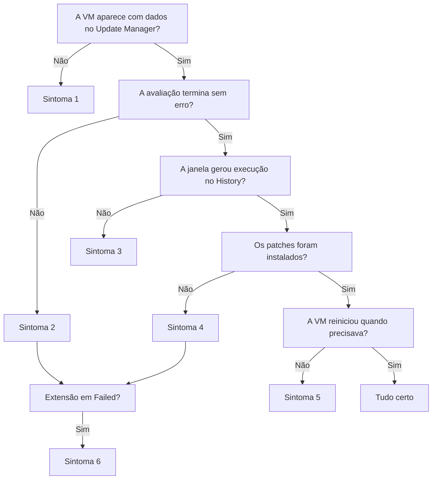

Fala pessoALL! Bora fechar a série de patch?

Nos últimos artigos montamos o Azure Update Manager do começo: a [primeira janela](https://blog.ruizsolutions.online/posts/azure-update-manager-do-zero/), as [ondas DEV, HML e PRD com TAGs](https://blog.ruizsolutions.online/posts/azure-update-manager-escopo-dinamico-tags/), o [snapshot automático antes do patch](https://blog.ruizsolutions.online/posts/azure-update-manager-snapshot-pre-evento/) e o [relatório de compliance](https://blog.ruizsolutions.online/posts/azure-update-manager-relatorio-compliance/). No laboratório tudo funciona. Duas VMs novas, imagem do Marketplace, saída livre para a internet.

Em ambiente real a conversa é outra.

Tem VM que veio de migração, VM restaurada de backup, VM atrás de proxy, VM apontando para um WSUS que ninguém lembra quem administra, VM com GPO de dez anos atrás. E aí a janela roda, o portal mostra um **Failed** com uma mensagem de duas linhas e você fica olhando para a tela sem saber por onde começar.

A primeira reação costuma ser abrir o log dentro do S.O. Só que, na maior parte das vezes, a resposta está fora da VM: no modo de patch, na associação com a maintenance configuration, no estado da extensão.

**Neste artigo, vamos organizar o troubleshooting do Azure Update Manager por sintoma: máquina que não aparece, avaliação que falha, janela que não dispara, janela que dispara e não instala, patch que instala e não reinicia, e extensão em estado de falha. Para cada um, a causa provável, onde olhar e como corrigir, sempre com base no que a Microsoft documenta.**

> Os caminhos de log e os nomes de extensão deste artigo valem para **VMs do Azure**. Servidores conectados por Azure Arc usam outras extensões e outra pasta de log, então não tente aplicar os mesmos caminhos lá.
{: .prompt-warning }

---

## Antes de abrir qualquer log, entenda as três camadas

O Update Manager não instala nada por conta própria. Quem instala é o Windows Update Agent no Windows e o gerenciador de pacotes no Linux. O serviço só manda a ordem e recolhe o resultado.

Essa ordem atravessa três camadas, e cada sintoma mora em uma delas:

| Camada | O que faz | Onde olhar |
| --- | --- | --- |
| Plataforma | Guarda o modo de patch, a maintenance configuration e a associação com a VM | Propriedades da VM, **History**, Activity Log, Resource Graph |
| Agente e extensão | O agente da VM recebe a ordem e aciona a extensão `Microsoft.CPlat.Core.WindowsPatchExtension` ou `Microsoft.CPlat.Core.LinuxPatchExtension` | **Extensions + applications**, instance view, logs da extensão |
| Sistema operacional | Windows Update Agent, `apt`, `yum` ou `zypper` buscam e instalam o pacote | Teste local de atualização, logs do S.O., rede e proxy |

A extensão é instalada sozinha na primeira operação do Update Manager na máquina, seja um **Check for updates**, uma instalação pontual, a avaliação periódica ou a primeira janela agendada. Você não instala nem atualiza na mão.

O roteiro que eu sigo é sempre de cima para baixo:



---

## Pré-requisitos

* O laboratório do [primeiro artigo da série](https://blog.ruizsolutions.online/posts/azure-update-manager-do-zero/) no ar, com uma VM Windows e uma VM Linux associadas a uma maintenance configuration de escopo Guest. Nos exemplos eu uso `rg-aum-lab-wus2-001`, `vm-aum-win-001` e `vm-aum-lnx-001`. Troque pelos nomes do seu ambiente;
* Permissão de **Contributor** nas VMs e de leitura na assinatura para o Resource Graph;
* Azure CLI atualizado ou o Cloud Shell. O `az maintenance` depende de uma extensão do CLI. Se ele pedir para instalar, aceite;
* Um jeito de rodar comando dentro do S.O., para os casos em que a causa está lá dentro. As VMs do laboratório foram criadas sem regra de entrada no NSG, então nelas eu uso o **Run command** do portal (**RunPowerShellScript** no Windows e **RunShellScript** no Linux). Em ambiente real, vale o acesso que você já tem: Bastion, RDP ou SSH.

> Nada aqui cria recurso novo, mas os comandos de correção mexem na VM. Em ambiente real, trate remoção de extensão e **Reapply** como mudança, em horário combinado.
{: .prompt-info }

> O **Run command** devolve só os últimos 4.096 bytes de saída e roda um script por vez. Para ler log grande por ele, filtre ou reduza o `-Tail` em vez de despejar o arquivo inteiro.
{: .prompt-tip }

---

## Mão na massa!

### O raio-x da VM antes de qualquer sintoma

Todo diagnóstico de patch começa pelas mesmas perguntas. A VM está ligada? O agente está **Ready**? Qual é o modo de patch? A extensão está saudável? Ela está associada a alguma maintenance configuration?

Em vez de clicar em cinco telas, deixei um script que responde tudo isso de uma vez. Ele só lê, não altera nada.

**O script e as consultas deste artigo estão no meu repositório: [Azure Update Manager](https://github.com/lfrleite/Ruiz-Online/tree/main/Azure%20Update%20Manager)**

Crie o arquivo `015-diagnostico-aum.sh` no Cloud Shell com o conteúdo abaixo:

```bash
#!/usr/bin/env bash
# 015-diagnostico-aum.sh
# Coleta, de fora da VM, tudo o que o Azure Update Manager precisa para funcionar.
# Somente leitura: nenhum comando deste script altera a VM.
#
# Uso: ./015-diagnostico-aum.sh -g <resource-group> -n <nome-da-vm>

set -euo pipefail

usage() {
  echo "Uso: $0 -g <resource-group> -n <nome-da-vm>" >&2
  exit 1
}

RG=""
VM=""
while getopts ":g:n:" opt; do
  case "$opt" in
    g) RG="$OPTARG" ;;
    n) VM="$OPTARG" ;;
    *) usage ;;
  esac
done
[[ -z "$RG" || -z "$VM" ]] && usage

command -v az >/dev/null 2>&1 || { echo "Azure CLI não encontrado." >&2; exit 1; }
az account show >/dev/null 2>&1 || { echo "Sem sessão ativa. Rode 'az login' antes." >&2; exit 1; }

VM_ID=$(az vm show -g "$RG" -n "$VM" --query id -o tsv 2>/dev/null) || {
  echo "VM '$VM' não encontrada no resource group '$RG'." >&2
  exit 1
}

secao() { printf '\n===== %s =====\n' "$1"; }

secao "1. Estado da VM"
az vm show -g "$RG" -n "$VM" -d \
  --query "{Nome:name, Regiao:location, PowerState:powerState, SO:storageProfile.osDisk.osType}" \
  -o table

secao "2. Agente da VM"
az vm get-instance-view -g "$RG" -n "$VM" \
  --query "instanceView.vmAgent.{Versao:vmAgentVersion, Status:statuses[0].displayStatus, Mensagem:statuses[0].message}" \
  -o table || echo "Não foi possível ler o status do agente."

secao "3. Extensões permitidas (allowExtensionOperations)"
ALLOW_EXT=$(az vm show -g "$RG" -n "$VM" --query "osProfile.allowExtensionOperations" -o tsv)
echo "${ALLOW_EXT:-propriedade não definida nesta VM}"

secao "4. Configuração de patch (patchSettings)"
az vm show -g "$RG" -n "$VM" \
  --query "{Windows:osProfile.windowsConfiguration.patchSettings, Linux:osProfile.linuxConfiguration.patchSettings}" \
  -o json

secao "5. Extensão de patch"
az vm get-instance-view -g "$RG" -n "$VM" \
  --query "instanceView.extensions[?contains(type, 'PatchExtension')].{Nome:name, Tipo:type, Versao:typeHandlerVersion, Status:statuses[0].displayStatus, Mensagem:statuses[0].message}" \
  -o json || echo "Não foi possível ler as extensões."

secao "6. Maintenance configurations associadas"
az maintenance assignment list \
  --provider-name Microsoft.Compute \
  --resource-group "$RG" \
  --resource-name "$VM" \
  --resource-type virtualMachines \
  --query "[].{Associacao:name, Configuracao:maintenanceConfigurationId}" \
  -o table || echo "Não foi possível listar as associações (a extensão 'maintenance' do CLI está instalada?)."

secao "7. Última avaliação e última instalação (patchStatus)"
az vm get-instance-view -g "$RG" -n "$VM" \
  --query "instanceView.patchStatus" -o json || echo "Sem patchStatus na instance view."

secao "8. Operações com falha no Activity Log (últimos 3 dias)"
az monitor activity-log list \
  --resource-id "$VM_ID" \
  --offset 3d \
  --status Failed \
  --max-events 20 \
  --query "[].{Quando:eventTimestamp, Operacao:operationName.value, Status:status.value}" \
  -o table || echo "Não foi possível consultar o Activity Log."

echo
echo "Diagnóstico concluído para $VM."
```

Dê permissão e execute:

```bash
chmod +x 015-diagnostico-aum.sh
./015-diagnostico-aum.sh -g rg-aum-lab-wus2-001 -n vm-aum-win-001
```

<!-- PRINT 002: Cloud Shell com a saída do script 015-diagnostico-aum.sh para a VM Windows, mostrando as oito seções -->
{: .shadow .rounded-10 }
<br>

Guarde essa saída. Ela vai ser citada em todos os sintomas abaixo.

---

### Sintoma 1 - A máquina não aparece ou aparece sem dados

No **Azure Update Manager**, em **Overview**, o bloco **Update status of machines** tem uma fatia chamada **No updates data**. É ali que cai a máquina que "sumiu". A documentação lista três motivos para isso: nenhuma avaliação nos últimos sete dias, S.O. sem suporte ou região sem suporte.

O prazo de sete dias tem explicação. O resultado da avaliação fica na tabela `patchassessmentresources` do Resource Graph, e ela guarda o dado por 7 dias. Avaliação periódica desligada e ninguém clicou em **Check for updates** na última semana? A máquina fica sem dado, mesmo saudável.

<!-- PRINT 003: Azure Update Manager > Machines com uma VM exibindo No updates data na coluna de status de atualização e a coluna Patch orchestration visível -->
{: .shadow .rounded-10 }
<br>

Esta consulta mostra de uma vez quem está sem avaliação. Rode no **Resource Graph Explorer**:

```kusto
// 1. VMs e a data da última avaliação. Linha com UltimaAvaliacao vazia = sem dado de avaliação.
resources
| where type =~ 'microsoft.compute/virtualmachines'
| extend vmId = tolower(id)
| extend PowerState = tostring(properties.extended.instanceView.powerState.displayStatus)
| join kind=leftouter (
    patchassessmentresources
    | where type !has 'softwarepatches'
    | extend vmId = tostring(split(tolower(id), '/patchassessmentresults/')[0])
    | project vmId,
              UltimaAvaliacao = todatetime(properties.lastModifiedDateTime),
              IniciadaPor = tostring(properties.startedBy),
              RebootPendente = tostring(properties.rebootPending)
  ) on vmId
| project name, resourceGroup, PowerState, UltimaAvaliacao, IniciadaPor, RebootPendente
| order by UltimaAvaliacao asc
```

<!-- PRINT 004: Resource Graph Explorer com o resultado da consulta 1, uma linha com UltimaAvaliacao vazia e PowerState VM deallocated -->
{: .shadow .rounded-10 }
<br>

Com a lista na mão, eu confiro quatro coisas, nessa ordem.

A primeira é se a VM estava ligada. A avaliação só busca atualizações em VM no estado **Running**. Máquina em **Stopped** ou **Stopped (deallocated)** não é avaliada. Se a coluna `PowerState` da consulta mostra a VM desalocada, não tem defeito nenhum.

Depois, a avaliação periódica. Na seção 4 do script, o campo `assessmentMode` precisa estar como `AutomaticByPlatform` para a plataforma avaliar a máquina a cada 24 horas. Com `ImageDefault`, a avaliação só acontece quando alguém pede.

A terceira é o tipo de workload. O Update Manager não atende Windows cliente (Windows 10 e 11), Virtual Machine Scale Sets nem nós de AKS. Para esses, a Microsoft aponta o Intune, os automatic upgrades do scale set e o patch de nó do próprio AKS.

E a imagem. Imagem do Marketplace precisa estar na lista de publisher, offer e plan suportados. Imagem customizada, inclusive de Compute Gallery, é aceita quando o S.O. de origem está entre os suportados, mas com uma restrição que pega muita gente: nela o patch automático da plataforma (**Azure Managed - Safe Deployment**) não funciona, mesmo com o modo em `AutomaticByPlatform`. Sobram a janela agendada e a instalação sob demanda.

Para os dois primeiros casos, ligue a VM e peça uma avaliação na hora:

```bash
az vm assess-patches \
  --resource-group rg-aum-lab-wus2-001 \
  --name vm-aum-win-001
```

Depois, ligue a avaliação periódica, como fizemos no primeiro artigo.

> Se você liga a avaliação periódica por Azure Policy, fique de olho nas VMs **especializadas, migradas e restauradas**. A documentação reconhece que, nesses casos, a policy não configura a propriedade na criação e a máquina aparece como não conforme. A saída é rodar uma **remediation task**.
{: .prompt-tip }

---

### Sintoma 2 - A avaliação falha

Aqui a máquina aparece, mas o **Check for updates** termina com erro, ou a VM fica como **Not assessed** com uma exceção em vermelho.

A causa documentada é direta: o agente de atualização do S.O. não está configurado corretamente. Se o Windows Update Agent ou o gerenciador de pacotes não respondem, o serviço não tem o que mostrar.

<!-- PRINT 005: VM > Updates com a avaliação em falha e a mensagem de exceção HRESULT expandida -->
{: .shadow .rounded-10 }
<br>

O teste mais honesto é tentar atualizar localmente. Se falhar na mão, o problema nunca foi o Update Manager.

**No Windows**, confira o serviço, a origem das atualizações e o log da extensão:

```powershell
Get-Service wuauserv

Get-ItemProperty 'HKLM:\SOFTWARE\Policies\Microsoft\Windows\WindowsUpdate' -ErrorAction SilentlyContinue
Get-ItemProperty 'HKLM:\SOFTWARE\Policies\Microsoft\Windows\WindowsUpdate\AU' -ErrorAction SilentlyContinue

Get-ChildItem 'C:\WindowsAzure\Logs\Plugins' -Recurse -Filter 'WindowsUpdateExtension.log' |
  Sort-Object LastWriteTime -Descending |
  Select-Object -First 1 |
  Get-Content -Tail 80
```

O `WindowsUpdateExtension.log` registra o que foi avaliado, o que foi instalado e o erro encontrado. Ao lado dele fica o `CommandExecution.log`, que diz se a operação chegou a ser chamada. Se a primeira chave de registro trouxer `WUServer` preenchido, a máquina busca atualização em um WSUS, e a pergunta passa a ser se ela ainda alcança esse servidor.

<!-- PRINT 006: PowerShell na VM Windows com o serviço wuauserv em Running e o final do WindowsUpdateExtension.log -->
{: .shadow .rounded-10 }
<br>

**No Linux**, o caminho é parecido:

```bash
sudo systemctl status walinuxagent --no-pager
sudo tail -n 50 /var/log/waagent.log
sudo ls -lt /var/log/azure/Microsoft.CPlat.Core.LinuxPatchExtension/ | head
sudo apt-get update
```

Em algumas distribuições o serviço do agente se chama `waagent` em vez de `walinuxagent`. Na pasta da extensão, o arquivo `<número de sequência>.core.log` tem o detalhe das ações de patch, e os arquivos `.ext.log` mostram se a operação foi invocada. Em distribuições baseadas em Red Hat ou SUSE, troque o último comando pelo equivalente do `yum` ou do `zypper`.

<!-- PRINT 007: Terminal da VM Linux com a listagem de /var/log/azure/Microsoft.CPlat.Core.LinuxPatchExtension/ e o final de um arquivo core.log -->
{: .shadow .rounded-10 }
<br>

As causas que a documentação lista para falha de avaliação, e que valem a conferência:

* Rede ou proxy bloqueando os endpoints do Windows Update, o WSUS ou o repositório de pacotes da distribuição;
* TLS 1.0 ou 1.1 em uso. O mínimo é TLS 1.2;
* Sem saída HTTPS a partir da máquina;
* No Linux, `root` fora do `/etc/sudoers`. A extensão roda como root e falha com `Unable to invoke sudo successfully`;
* No Linux, Python ausente. O pré-requisito é Python 2.7 ou superior;
* No Linux, o serviço `MsftLinuxPatchAutoAssess` parado, que derruba só a avaliação periódica.

Sobre a rede, vale o que vimos no [artigo do Image Builder](https://blog.ruizsolutions.online/posts/azure-image-builder-windows-linux/): subnet privada sem NAT Gateway ou outra saída explícita não chega no Windows Update nem no repositório APT.

Para ver os erros de avaliação de todas as máquinas sem entrar em uma por uma:

<!-- VALIDAR: conferir no laboratório o formato de properties.errorDetails em uma avaliação SEM erro. Se vier objeto ou lista vazia em vez de nulo, o isnotempty não filtra e a consulta lista todas as máquinas; nesse caso ajustar o filtro. -->

```kusto
// 3. Erros registrados na última avaliação de cada máquina.
patchassessmentresources
| where type !has 'softwarepatches'
| extend Maquina = tostring(split(id, '/')[8])
| extend Erros = properties.errorDetails
| where isnotempty(Erros)
| project Maquina, resourceGroup,
          Quando = todatetime(properties.lastModifiedDateTime),
          SO = tostring(properties.osType),
          Erros
```

<!-- LUIZ: Qual código HRESULT ou mensagem de erro de avaliação você mais encontrou até hoje, e qual era a causa real por trás? -->

---

### Sintoma 3 - A janela não dispara

Esse é o que mais gera dúvida. O horário da janela passa, você abre **History** e não tem execução nenhuma para aquela máquina.

#### O modo de patch não é o que a janela exige

A janela agendada só funciona em VM do Azure com **Patch orchestration** em **Customer Managed Schedules**. Por baixo, isso são duas propriedades: `patchMode` igual a `AutomaticByPlatform` e `bypassPlatformSafetyChecksOnUserSchedule` igual a `true`.

As duas, juntas.

Se a VM tem só `AutomaticByPlatform`, sem o bypass, ela está em **Azure Managed - Safe Deployment**. Nesse modo é o Azure que aplica os patches críticos e de segurança, no horário de menor uso da VM, e não a sua janela. É o caso clássico do "a janela não rodou, mas apareceu patch instalado de madrugada".

A consulta abaixo mostra o modo de todas as VMs:

<!-- VALIDAR: rodar no Resource Graph Explorer e confirmar que o iff com valor dinâmico é aceito e que PatchMode, Bypass e AssessmentMode voltam preenchidos nas duas VMs do laboratório. O caminho das propriedades vem do esquema ARM, sem exemplo de consulta no Learn. -->

```kusto
// 2. Modo de patch de cada VM. A janela agendada exige AutomaticByPlatform + Bypass = true.
resources
| where type =~ 'microsoft.compute/virtualmachines'
| extend SO = tostring(properties.storageProfile.osDisk.osType)
| extend ps = iff(SO =~ 'Windows',
                  properties.osProfile.windowsConfiguration.patchSettings,
                  properties.osProfile.linuxConfiguration.patchSettings)
| project name, resourceGroup, SO,
          PatchMode = tostring(ps.patchMode),
          Bypass = tostring(ps.automaticByPlatformSettings.bypassPlatformSafetyChecksOnUserSchedule),
          AssessmentMode = tostring(ps.assessmentMode)
| order by PatchMode asc
```

<!-- PRINT 008: Resource Graph Explorer com o resultado da consulta 2, destacando uma VM com PatchMode AutomaticByOS e outra com AutomaticByPlatform e Bypass true -->
{: .shadow .rounded-10 }
<br>

Para corrigir pelo portal:

1. Acesse **Azure Update Manager** e clique em **Machines**;
2. Marque as máquinas com o modo errado;
3. Clique em **Update settings**;
4. Em **Patch orchestration**, selecione **Customer Managed Schedules**;
5. Clique em **Save**.

<!-- PRINT 009: Tela Change update settings com a coluna Patch orchestration em Customer Managed Schedules para as duas VMs, antes do Save -->
{: .shadow .rounded-10 }
<br>

> No Windows, a troca direta entre `AutomaticByOS` e `Manual` não é suportada, porque `enableAutomaticUpdates` só pode ser definida na criação da VM. Se a intenção é que nada seja instalado fora do seu controle, a recomendação documentada é deixar a VM em **Customer Managed Schedules** sem associar nenhuma janela.
{: .prompt-info }

#### A VM estava desligada

A máquina precisa estar ligada pelo menos **15 minutos antes** do início da janela. VM desligada não recebe patch.

E tem um efeito colateral que assusta: com a VM desligada no horário da janela, o portal pode mostrar a maintenance configuration como desassociada. A documentação trata isso como problema de exibição. A associação continua lá, e dá para confirmar pelo CLI:

```bash
az maintenance assignment list \
  --provider-name Microsoft.Compute \
  --resource-group rg-aum-lab-wus2-001 \
  --resource-name vm-aum-win-001 \
  --resource-type virtualMachines \
  --query "[].{resource:resourceGroup, configName:name}" \
  --output table
```

Se você usa o [Start/Stop por TAG](https://blog.ruizsolutions.online/posts/azure-tag-start-stop-vms/), alinhe os horários. Desligar às 22h e abrir janela de patch às 23h não funciona.

A mesma conferência pelo Resource Graph:

```kusto
// 7. A quais maintenance configurations uma VM está associada. Troque o ID.
maintenanceresources
| where type =~ 'microsoft.maintenance/configurationassignments'
| where properties.resourceId =~ '<ID completo da VM>'
| project Associacao = name, Configuracao = tostring(properties.maintenanceConfigurationId)
```

<!-- PRINT 010: VM > Updates > aba Scheduling mostrando a maintenance configuration associada à VM -->
{: .shadow .rounded-10 }
<br>

#### O agendamento não é o que você pensa

Alguns comportamentos documentados de maintenance configuration que parecem defeito e não são:

* A primeira execução acontece na **primeira recorrência depois** da data de início, não necessariamente na data de início. Janela criada em uma quarta com recorrência toda segunda só roda na segunda seguinte;
* O horário de início precisa estar pelo menos 15 minutos à frente do momento da criação, e qualquer alteração (incluir VM, tirar VM, mexer no escopo dinâmico) deve terminar 15 minutos antes da janela. Para alterar a configuração em si, a recomendação é pelo menos 1 hora de antecedência;
* Duas maintenance configurations com o mesmo horário associadas à mesma VM: só uma dispara na hora marcada. A página do Update Manager diz que a outra roda quando a primeira termina, e a de Maintenance Configurations manda trocar o horário de uma delas. Eu fico com a segunda orientação;
* Máquina recém-criada pode ter atraso de 15 minutos no disparo.

#### A VM foi movida ou recriada

Maintenance configuration não acompanha VM movida de resource group ou de assinatura. O patch agendado para de funcionar, e o caminho documentado é remover a associação, mover o recurso e associar de novo. Com escopo dinâmico, é preciso esperar a próxima execução agendada limpar a associação antes de mover.

VM apagada e recriada com o mesmo nome também dá trabalho. A janela falha com `ShutdownOrUnresponsive`. A página do Update Manager fala em 8 horas para o problema sumir, e a de Maintenance Configurations fala em 12 horas para a reassociação automática. Na dúvida, eu considero as 12 ou refaço a associação na mão.

#### O escopo dinâmico não resolveu a máquina

Se a onda usa escopo dinâmico por TAG, como no [segundo artigo da série](https://blog.ruizsolutions.online/posts/azure-update-manager-escopo-dinamico-tags/), os critérios são avaliados **na hora da execução**. A lista que o portal mostra na criação é uma prévia. TAG removida ou com grafia diferente tira a máquina da janela sem aviso.

Para confirmar o que de fato rodou para uma VM:

```kusto
// 6. Execuções de janela (maintenance runs) de uma VM. Troque o ID.
maintenanceresources
| where ['id'] contains "/subscriptions/<subscription-id>/resourcegroups/<resource-group>/providers/microsoft.compute/virtualmachines/<vm-name>"
| where ['type'] == "microsoft.maintenance/applyupdates"
| where properties.maintenanceScope == "InGuestPatch"
```

<!-- LUIZ: Das causas de "janela não disparou" listadas acima, qual você mais viu acontecer na prática e como descobriu? -->

---

### Sintoma 4 - A janela dispara e não instala

Agora existe execução em **History**, mas o status é **Failed** ou a contagem de instalados está zerada.

Comece por **Azure Update Manager** > **History** > **By maintenance run ID**. Cada execução aparece com status, máquinas atualizadas e horário de início e fim. Clicando no registro você chega no detalhe por máquina e por atualização.

<!-- PRINT 011: Azure Update Manager > History > By maintenance run ID com uma execução em Failed -->
{: .shadow .rounded-10 }
<br>

A mesma informação, para todas as máquinas, sai desta consulta:

```kusto
// 4. Instalações dos últimos 30 dias que não terminaram como Succeeded.
patchinstallationresources
| where type !has 'softwarepatches'
| extend Maquina = tostring(split(id, '/')[8])
| extend p = parse_json(properties)
| extend Status = tostring(p.status)
| where Status != 'Succeeded'
| project Maquina, resourceGroup,
          Inicio = todatetime(p.startDateTime),
          Status,
          JanelaExcedida = tostring(p.maintenanceWindowExceeded),
          Reboot = tostring(p.rebootStatus),
          Instalados = toint(p.installedPatchCount),
          Pendentes = toint(p.pendingPatchCount),
          Falhas = toint(p.failedPatchCount),
          NaoSelecionados = toint(p.notSelectedPatchCount),
          IniciadaPor = tostring(p.startedBy),
          RunId = tostring(p.maintenanceRunId),
          Erros = p.errorDetails
| order by Inicio desc
```

O resultado de instalação fica 30 dias no Resource Graph.

#### Maintenance window exceeded

O erro que mais engana. A janela tinha duas horas, a instalação levou vinte minutos, e mesmo assim o histórico diz que a janela foi excedida.

O motivo está na conta que o serviço faz antes de cada etapa. Antes de buscar a lista de atualizações, baixar ou instalar, ele verifica se sobra tempo: 15 minutos para a atualização mais 10 minutos reservados para reboot, 25 no total. Para service pack do Windows são 20 mais 10. No Linux a reserva de reboot é de 15 minutos.

Se o tempo restante é menor que isso, o serviço pula a varredura e a instalação, marca a execução como **Failed** e liga a propriedade `maintenanceWindowExceeded`. Nada foi instalado, e não foi por erro de pacote.

A janela de escopo Guest aceita no mínimo 1 hora e 30 minutos e no máximo 3 horas e 55 minutos. Sendo bem sincero, eu não oriento usar o mínimo em servidor que acumula patch.

<!-- PRINT 012: Detalhe de uma execução no History com status Failed e a propriedade Maintenance window exceeded em true -->
{: .shadow .rounded-10 }
<br>

#### A seleção de atualizações não bate com o que existe

A execução termina sem erro e sem instalar nada. Normalmente a janela inclui só **Critical** e **Security**, e o que está pendente é de outra classificação. Para ver esse caso, tire o filtro de status da consulta e repare na coluna `NaoSelecionados`.

Outros casos documentados do mesmo tipo:

* Máquina em WSUS com atualização ainda não aprovada. O Update Manager só enxerga o que o Windows Update Agent enxerga;
* Atualização de driver. Aparece na avaliação, mas a instalação não é suportada;
* Atualização que exige aceite de licença (EULA). O serviço não aceita em nome do usuário;
* No Ubuntu 18.04 ou anterior sem Ubuntu Pro, os pacotes ESM são pulados e a execução fica como **Completed with warnings**.

#### VMs do mesmo availability set

VMs de um mesmo availability set não são atualizadas ao mesmo tempo. Se elas estão em janelas diferentes no mesmo horário, a documentação avisa que podem não receber patch ou falhar por janela excedida. A saída é aumentar a janela ou separar os horários.

#### Internal execution error

Falha de comunicação entre o serviço e a VM: instabilidade temporária da plataforma, agente sem resposta ou desatualizado, VM sob carga, ou rede. Tente de novo em alguns minutos. Se repetir, olhe a seção 2 do script. Agente em **Not Ready** leva direto para o Sintoma 6.

Para repetir a instalação sem esperar a próxima janela:

```bash
az vm install-patches \
  --resource-group rg-aum-lab-wus2-001 \
  --name vm-aum-win-001 \
  --maximum-duration PT2H \
  --reboot-setting IfRequired \
  --classifications-to-include-win Critical Security
```

Na VM Linux, troque o último parâmetro por `--classifications-to-include-linux Critical Security`.

> Esse comando instala patch e pode reiniciar a VM na hora. Em ambiente real ele é uma mudança como qualquer outra. Snapshot antes, como sempre.
{: .prompt-danger }

---

### Sintoma 5 - Instala e não reinicia

Patches instalados, máquina com reboot pendente, e a VM seguiu no ar como se nada tivesse acontecido.

Esta consulta lista quem ficou devendo reboot:

```kusto
// 5. Instalou e ficou devendo reboot.
patchinstallationresources
| where type !has 'softwarepatches'
| extend Maquina = tostring(split(id, '/')[8])
| extend p = parse_json(properties)
| where tostring(p.rebootStatus) in ('Required', 'Failed')
| project Maquina, resourceGroup,
          Inicio = todatetime(p.startDateTime),
          Status = tostring(p.status),
          Reboot = tostring(p.rebootStatus),
          JanelaExcedida = tostring(p.maintenanceWindowExceeded)
| order by Inicio desc
```

<!-- PRINT 013: Resource Graph Explorer com o resultado da consulta 5, VM com Reboot igual a Required -->
{: .shadow .rounded-10 }
<br>

O campo `rebootStatus` conta a história: `NotNeeded`, `Required`, `Started`, `Failed` ou `Completed`. O motivo costuma ser um destes.

#### A janela está configurada para não reiniciar

Com **Never reboot**, se alguma atualização pede reinício, a execução termina como **Completed with warnings** e o reboot fica por sua conta. A configuração fez o que foi pedido.

#### Não sobrou tempo

O reboot só é disparado se restarem 10 minutos de janela no Windows ou 15 no Linux. Caso contrário, é pulado. Costuma andar junto com o `maintenanceWindowExceeded` do sintoma anterior.

#### O reboot começou e não voltou a tempo

Depois de mandar reiniciar, o serviço espera no máximo 15 minutos pela volta de uma VM do Azure. Passou disso, marca como falha, mesmo que a máquina suba no minuto seguinte.

#### GPO brigando com a janela

A documentação é explícita: com **Always reboot** configurado, uma GPO ou chave de registro pode impedir o reinício. E o contrário também acontece, a máquina reinicia mesmo com **Never reboot**. As políticas para alinhar são **Configure Automatic Updates**, **No auto-restart with logged on users** e **Always automatically restart at the scheduled time**.

Para ver o que a GPO deixou na máquina, use as mesmas chaves do Sintoma 2. Em VM com patch orquestrado pelo Azure, o próprio serviço pode gravar `AUOptions` na chave `AU`. Se uma GPO impõe outro valor, ele perde o controle do horário.

> Patch instalado sem reinício, em boa parte dos casos, é correção que ainda não está valendo. A máquina aparece como atualizada no relatório e continua exposta.
{: .prompt-warning }

---

### Sintoma 6 - Extensão em estado de falha

Chegou aqui quem viu a seção 5 do script com status diferente de sucesso, ou quem recebeu erro de extensão na avaliação ou na instalação.

Pelo portal, o estado fica na VM, em **Settings** > **Extensions + applications**.

<!-- PRINT 014: VM > Extensions + applications com a extensão de patch listada e o status de provisionamento em falha -->
{: .shadow .rounded-10 }
<br>

A ordem de verificação que eu sigo:

**1. Extensões estão permitidas?** A seção 3 do script mostra `allowExtensionOperations`. Se estiver `false`, nenhuma extensão roda nessa VM, e a correção documentada é voltar a propriedade para `true`. Quando o script diz que a propriedade não está definida, o bloqueio não é esse.

**2. O agente está Ready?** Sem agente, não existe extensão. Em **Overview**, na aba **Properties**, o campo **Agent status** precisa mostrar **Ready**. No Windows, confira o serviço `WindowsAzureGuestAgent`. No Linux, o agente precisa falar com o host do Azure:

```bash
sudo curl http://168.63.129.16/?comp=versions
```

Se esse endereço estiver bloqueado por firewall local ou proxy, o agente fica em **Not Ready** e nenhuma extensão é processada. Para patch orquestrado pela plataforma no Linux, o agente precisa estar na versão 2.2.53.1 ou superior.

**3. Remover e deixar reinstalar.** Com agente saudável e extensão em falha, a correção documentada é remover a extensão e disparar uma operação sob demanda. O Update Manager reinstala sozinho.

Pegue o nome exato da extensão na seção 5 do script e remova:

```bash
az vm extension delete \
  --resource-group rg-aum-lab-wus2-001 \
  --vm-name vm-aum-win-001 \
  --name <NOME_DA_EXTENSAO>
```

Em seguida, peça uma avaliação:

```bash
az vm assess-patches \
  --resource-group rg-aum-lab-wus2-001 \
  --name vm-aum-win-001
```

<!-- PRINT 015: Cloud Shell com az vm extension delete concluído e a saída do az vm assess-patches logo em seguida -->
{: .shadow .rounded-10 }
<br>

**4. Reapply.** Se a extensão nem chega a ser processada, vale forçar a plataforma a reenviar o estado desejado para a VM. No portal, em **Support + troubleshooting** > **Redeploy + reapply** > **Reapply**. Pelo CLI:

```bash
az vm reapply \
  --resource-group rg-aum-lab-wus2-001 \
  --name vm-aum-win-001
```

<!-- PRINT 016: VM > Redeploy + reapply com a opção Reapply em destaque -->
{: .shadow .rounded-10 }
<br>

> O Reapply normalmente não reinicia a VM, mas a documentação avisa que em casos raros ele pode disparar uma atualização pendente que exige reinício. Faça em um momento em que uma parada curta seja tolerável.
{: .prompt-warning }

Atenção para VM criada a partir de disco especializado de outra VM, como em clone ou restauração por [snapshot](https://blog.ruizsolutions.online/posts/criando-snapshot-de-vms-atraves-de-tags/). Os arquivos das extensões antigas vêm no disco e o status reportado pode estar errado. A orientação é remover as extensões na origem antes de gerar a VM nova.

---

## Erros comuns

Mensagens que aparecem no portal ou nos logs, com a causa documentada.

### Códigos HRESULT na avaliação do Windows

| Código ou mensagem | O que significa | O que fazer |
| --- | --- | --- |
| `0x8024402C`, `0x8024401C`, `0x8024402F` | Problema de conectividade de rede | Validar saída para os endpoints do Windows Update. Com WSUS, conferir `WUServer` e `WUStatusServer` |
| `0x80072EE2` | Falha de rede ou de comunicação com o WSUS | Conferir a configuração do WSUS e se o servidor responde a partir da VM |
| `0x8024001E` | O serviço ou o sistema estava sendo desligado durante a operação | Repetir a operação |
| `0x8024002E` | Serviço Windows Update desabilitado | Habilitar o serviço |
| `0x80070422` | O serviço não pôde ser iniciado | Garantir que o `wuauserv` não está desabilitado |
| `0x80070005` | Acesso negado | Conferir permissão na pasta `%WinDir%\SoftwareDistribution`, espaço livre no C: e configuração do Windows Update |

Para confirmar pelo lado do S.O.:

```powershell
Get-Service wuauserv | Select-Object Name, Status, StartType
```

---

### Unable to invoke sudo successfully (exit code 88)

Aparece no Linux, em avaliação ou instalação. A extensão roda como `root` e não conseguiu usar `sudo`.

Diagnóstico:

```bash
sudo grep -E '^root' /etc/sudoers
```

Se não voltar nada, edite com `sudo visudo` e inclua a linha:

```text
root ALL=(ALL) ALL
```

---

### ShutdownOrUnresponsive

A documentação associa esse erro a VM apagada e recriada com o mesmo ID pouco antes da janela. Confira a seção 6 do script e, se a VM foi recriada, refaça a associação.

---

## Checklist

- [x] Raio-x - Rodar o `015-diagnostico-aum.sh` e guardar a saída antes de qualquer alteração;
- [x] Sintoma 1 - Conferir estado da VM, avaliação periódica e suporte do S.O. e da imagem;
- [x] Sintoma 2 - Testar atualização local, serviço de atualização, rede, proxy, TLS e sudo;
- [x] Sintoma 3 - Validar **Customer Managed Schedules**, VM ligada 15 minutos antes, recorrência e associação;
- [x] Sintoma 4 - Abrir o **History** por maintenance run ID e checar janela excedida e classificações;
- [x] Sintoma 5 - Conferir `rebootStatus`, configuração de reboot da janela e GPO;
- [x] Sintoma 6 - Validar `allowExtensionOperations`, agente **Ready**, remover a extensão e reavaliar;
- [x] Depois da correção - Rodar o script de novo e comparar com a saída inicial.

---

## Limpeza do ambiente

Este artigo não cria recurso novo. Como é o último da série, se o laboratório não for mais usado, comece pelo que mora fora do resource group das VMs: os dynamic scopes do [artigo das ondas](https://blog.ruizsolutions.online/posts/azure-update-manager-escopo-dinamico-tags/), que ficam no nível da assinatura, e o resource group `rg-aum-snap-lab-wus2-001` com a custom role do [artigo do snapshot](https://blog.ruizsolutions.online/posts/azure-update-manager-snapshot-pre-evento/). Cada um tem a própria seção de limpeza.

Depois, remova o resource group:

```bash
az group delete \
  --name rg-aum-lab-wus2-001 \
  --yes \
  --no-wait
```

> Confira o nome duas vezes. Esse comando apaga tudo o que estiver dentro do resource group, e a maintenance configuration só vai junto se estiver nele.
{: .prompt-danger }

---

## Artigos

| Nome | Link |
| :---: | :---: |
| Arquivos deste laboratório | <https://github.com/lfrleite/Ruiz-Online/tree/main/Azure%20Update%20Manager> |
| Solucionar problemas com o Gerenciador de Atualizações do Azure | <https://learn.microsoft.com/pt-br/azure/update-manager/troubleshoot> |
| Troubleshoot problems with Maintenance Configurations | <https://learn.microsoft.com/en-us/azure/virtual-machines/troubleshoot-maintenance-configurations> |
| Managing VM updates with Maintenance Configurations | <https://learn.microsoft.com/en-us/azure/virtual-machines/maintenance-configurations> |
| How Update Manager works | <https://learn.microsoft.com/en-us/azure/update-manager/workflow-update-manager> |
| Prerequisites for Azure Update Manager | <https://learn.microsoft.com/en-us/azure/update-manager/prerequisites> |
| Schedule recurring updates for machines | <https://learn.microsoft.com/en-us/azure/update-manager/scheduled-patching> |
| Configure Windows Update settings for Azure Update Manager | <https://learn.microsoft.com/en-us/azure/update-manager/configure-wu-agent> |
| Access Azure Update Manager operations data using Azure Resource Graph | <https://learn.microsoft.com/en-us/azure/update-manager/query-logs> |
| Sample Azure Resource Graph queries for Update Manager | <https://learn.microsoft.com/en-us/azure/update-manager/sample-query-logs> |
| Unsupported workloads for Azure Update Manager | <https://learn.microsoft.com/en-us/azure/update-manager/unsupported-workloads> |
| Supported operating systems and images for Update Manager | <https://learn.microsoft.com/en-us/azure/update-manager/support-matrix-updates> |
| Manage updates for customized images | <https://learn.microsoft.com/en-us/azure/update-manager/manage-updates-customized-images> |
| Assessment options in Update Manager | <https://learn.microsoft.com/en-us/azure/update-manager/assessment-options> |
| Manage update configuration settings | <https://learn.microsoft.com/en-us/azure/update-manager/manage-update-settings> |
| Automatic Guest Patching for Azure Virtual Machines | <https://learn.microsoft.com/en-us/azure/virtual-machines/automatic-vm-guest-patching> |
| Troubleshooting Azure Windows VM extension failures | <https://learn.microsoft.com/en-us/azure/virtual-machines/extensions/troubleshoot> |
| Troubleshoot the Azure Linux Agent | <https://learn.microsoft.com/en-us/troubleshoot/azure/virtual-machines/linux/linux-azure-guest-agent> |
| Run scripts in your Windows VM by using action Run Commands | <https://learn.microsoft.com/en-us/azure/virtual-machines/windows/run-command> |

---

## The End!

E assim fechamos a série de patch com o Azure Update Manager.

Se eu tivesse que deixar uma única orientação deste artigo, seria a ordem. Primeiro a plataforma: modo de patch, associação, histórico. Depois o agente e a extensão. Só no fim o sistema operacional. Quem começa pelo log do Windows Update perde tempo em problema que se resolvia em uma propriedade da VM.

A segunda é sobre a janela. Muito do que chega como "falha do Update Manager" é janela curta demais, VM desligada no horário ou GPO antiga disputando o reboot. O serviço fez o que foi configurado.

E não confie em status verde sem olhar o reboot pendente.

Em um próximo artigo vamos falar de Hotpatch no Windows Server 2025, que mexe justamente na parte mais chata de toda janela, o reinício.

Qual desses seis sintomas mais aparece aí no seu ambiente? Me conta lá no LinkedIn, quero saber se a minha lista bate com a de vocês.

Obrigado por acompanharem a série até aqui! Nos vemos na próxima!
