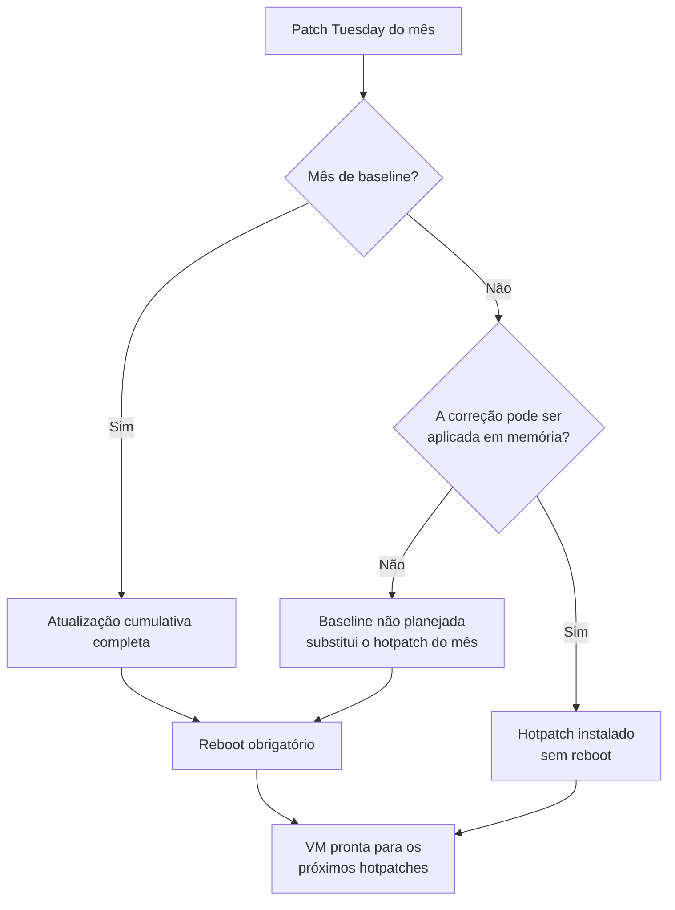

Fala pessoALL! Prontos para falar do assunto que todo mundo de infra já pediu um dia?

Patch sem reboot.

Quem cuida de Windows Server sabe que instalar a atualização nunca foi a parte difícil. A parte difícil é negociar a janela. É o dono da aplicação pedindo para adiar, é o serviço que só sobe na ordem certa. O reboot mensal é o motivo real de muita VM ficar dois, três meses sem patch de segurança.

Nos artigos anteriores desta série nós montamos o [Azure Update Manager do zero](https://blog.ruizsolutions.online/posts/azure-update-manager-do-zero/), separamos as [ondas de patch por TAG](https://blog.ruizsolutions.online/posts/azure-update-manager-escopo-dinamico-tags/) e fechamos com o [troubleshooting](https://blog.ruizsolutions.online/posts/azure-update-manager-troubleshooting/). Tudo aquilo continua valendo. O que muda aqui é a pergunta: e se a maior parte dos meses não precisasse de reboot?

É isso que o **Hotpatch** promete. E promete com letras miúdas, que são justamente a parte que eu quero mostrar.

**Neste artigo, vamos criar uma VM com Windows Server 2025 Datacenter: Azure Edition já com Hotpatch ligado, conferir se uma VM existente está de fato recebendo hotpatch, ver como o Azure Update Manager mostra isso e entender o calendário de baseline, que é onde o reboot continua morando.**

> Hotpatch não elimina reboot. Ele reduz. Se a sua expectativa é nunca mais reiniciar servidor, pare aqui e leia a seção do calendário antes de vender essa ideia para alguém.
{: .prompt-warning }

---

## Mas antes, o que é o Hotpatch?

Hotpatch é uma forma de instalar atualização de segurança do Windows Server corrigindo o código que já está carregado na memória dos processos em execução. O processo não reinicia, a VM não reinicia, a aplicação não percebe.

Ele não é um produto separado. A documentação descreve o Hotpatch como uma extensão do Windows Update, e por isso o Update Manager, a avaliação periódica e as janelas que montamos na série continuam sendo a forma de enxergar e controlar tudo.

O funcionamento tem dois tipos de mês:

* **Mês de baseline**: sai uma atualização cumulativa completa, igual à de qualquer Windows Server. Ela exige reboot e vira a base dos meses seguintes;
* **Mês de hotpatch**: sai um pacote menor, só com as correções de segurança, aplicado em memória e sem reboot.

O plano publicado pela Microsoft é um baseline no primeiro mês de cada trimestre e hotpatch nos dois meses seguintes. No papel, quatro reboots por ano em vez de doze.



Repare no losango do meio. Quando aparece uma correção que não dá para entregar como hotpatch, um zero-day por exemplo, a Microsoft troca o hotpatch daquele mês por uma **baseline não planejada**. E a própria documentação avisa que não tem como prever isso com antecedência.

Outro ponto que precisa ficar claro desde já: o hotpatch cobre **atualizações de segurança do Windows**. Ficam de fora, e continuam pedindo reboot quando aparecem:

* Atualizações do Windows que não são de segurança;
* Atualizações de .NET;
* Drivers, firmware e qualquer coisa que não seja Windows.

---

## Onde o Hotpatch existe

Aqui mora a maior confusão sobre o assunto, então vamos separar em dois caminhos.

### Caminho 1 - VM no Azure com Azure Edition

Em VM do Azure, o Hotpatch só existe para imagens **Windows Server Datacenter: Azure Edition** do Marketplace. A lista é fechada e a documentação fala em combinação exata de publisher, offer e SKU:

| Publisher | Offer | SKU |
| --- | --- | --- |
| MicrosoftWindowsServer | WindowsServer | `2025-datacenter-azure-edition` |
| MicrosoftWindowsServer | WindowsServer | `2025-datacenter-azure-edition-smalldisk` |
| MicrosoftWindowsServer | WindowsServer | `2025-datacenter-azure-edition-core` |
| MicrosoftWindowsServer | WindowsServer | `2025-datacenter-azure-edition-core-smalldisk` |
| MicrosoftWindowsServer | WindowsServer | `2022-datacenter-azure-edition-hotpatch` |
| MicrosoftWindowsServer | WindowsServer | `2022-datacenter-azure-edition-hotpatch-smalldisk` |
| MicrosoftWindowsServer | WindowsServer | `2022-datacenter-azure-edition-core` |
| MicrosoftWindowsServer | WindowsServer | `2022-datacenter-azure-edition-core-smalldisk` |

Duas coisas para reparar nessa tabela.

No Windows Server 2022, a SKU `2022-datacenter-azure-edition` pura, com Desktop Experience, **não está na lista**. Só as variantes `-hotpatch` e `-core`. No 2025 isso foi resolvido e as quatro SKUs Azure Edition entram.

E o Windows Server 2025 **Datacenter** e **Standard** comuns, que são as imagens que a maioria escolhe por hábito na hora de criar a VM, também não estão. Se a sua VM do Azure foi criada com `2025-datacenter`, ela não recebe hotpatch. Simples assim.

> Na data em que escrevi este artigo, a versão em português da página de Hotpatch no Learn trazia essa tabela com as linhas do `Core` repetidas no lugar das SKUs com Desktop Experience do 2025. Para a lista de SKUs, confie na página em inglês.
{: .prompt-tip }

### Caminho 2 - Fora do Azure, com Azure Arc

Para Windows Server 2025 **Standard** e **Datacenter** rodando fora do Azure (on-premises, VMware, Hyper-V, outras nuvens), o Hotpatch chega pelo **Azure Arc**. A máquina precisa estar conectada ao Arc e você habilita o recurso pelo portal.

Esse caminho já foi cobrado à parte. Se você leu sobre isso há algum tempo, atualize a informação: a documentação do Update Manager registra que **desde 19 de maio de 2026 o Hotpatch em máquinas Arc com Windows Server 2025 Standard ou Datacenter não tem custo adicional**. Não existe mais medidor por núcleo nem linha de Hotpatch na fatura. Para quem já estava inscrito a cobrança foi encerrada sem nenhuma ação, e inscrição nova não gera cobrança, em qualquer ambiente de origem e nas duas edições.

O que continua valendo é o resto: a máquina precisa estar no Arc, e o Arc tem os próprios requisitos de agente e de rede.

O procedimento documentado é curto:

1. Conecte a máquina ao **Azure Arc**, se ainda não estiver;
2. No portal, acesse **Azure Arc** > **Machines**;
3. Selecione o nome da máquina;
4. Selecione **Hotpatch** e depois **Confirm**;
5. Aguarde cerca de 10 minutos para a alteração ser aplicada.

O requisito que derruba mais gente nesse caminho é o **Virtualization-based security (VBS)**, também chamado de Virtual Secure Mode. A máquina precisa, no mínimo, de UEFI com Secure Boot. Para conferir, dentro do servidor:

```powershell
Get-CimInstance -Namespace 'root/Microsoft/Windows/DeviceGuard' -ClassName 'win32_deviceGuard' | Select-Object -ExpandProperty 'VirtualizationBasedSecurityStatus'
```

Se o retorno for `2`, o VBS está configurado e em execução. Qualquer outro valor significa que habilitar o Hotpatch vai falhar.

Não vou montar laboratório de Arc neste artigo. O foco aqui é VM do Azure.

---

## Como a VM do Azure recebe o patch

Para o Hotpatch funcionar em VM do Azure, três propriedades da VM precisam estar alinhadas:

* O VM Agent provisionado (`provisionVMAgent` igual a `true`);
* O modo de patch em `AutomaticByPlatform`;
* A propriedade `enableHotpatching` igual a `true`.

O modo `AutomaticByPlatform` é o que o portal chama de **Azure-orchestrated**. Com ele ligado sozinho, quem decide o momento da instalação é a plataforma: patches classificados como Critical e Security são baixados e aplicados fora do horário de pico, no fuso da VM, em até 30 dias depois do lançamento mensal.

Agora junte as duas informações. No mês de baseline, a VM **vai reiniciar**, e no modo gerenciado pela plataforma você não escolhe o dia nem a hora.

Para laboratório, tudo bem. Para produção, eu não oriento deixar assim. O que eu faria em ambiente real é manter o Hotpatch ligado e trocar o **Patch orchestration** para **Customer Managed Schedules**, que é o pré-requisito das janelas agendadas que vimos no [primeiro artigo da série](https://blog.ruizsolutions.online/posts/azure-update-manager-do-zero/). Essa opção mantém o modo `AutomaticByPlatform`, que é o que o Hotpatch exige, e acrescenta a propriedade `bypassPlatformSafetyChecksOnUserSchedule` como `true`. A documentação de **Update settings** confirma a combinação: com o Hotpatch habilitado, os demais patches podem ser instalados por agendamento ou sob demanda pelo Update Manager.

<!-- VALIDAR: confirmar no laboratório, em mês de hotpatch, que uma VM Azure Edition com enableHotpatching true e Patch orchestration em Customer Managed Schedules instala o hotpatch dentro da maintenance configuration e termina com rebootStatus NotNeeded. O Learn sustenta a combinação por partes (Hotpatch exige AutomaticByPlatform; Customer Managed Schedules mantém esse modo; a página de Arc descreve hotpatch em schedule), mas nenhuma página afirma isso literalmente para VM do Azure. -->

O patch passa a entrar só na sua janela, com ou sem reboot.

---

## Pré-requisitos

* Assinatura do Azure com permissão de **Contributor** no Resource Group do laboratório;
* Para executar scripts pelo Run Command, a role **Virtual Machine Contributor** ou superior na VM;
* Azure CLI atualizado ou Cloud Shell;
* Acesso ao **Resource Graph Explorer** no portal, para as consultas dos Passos 6 e 8;
* Cota para uma VM `Standard_D2s_v5` na região `West US 2`.

> Este laboratório gera custo: uma VM Windows ligada, o disco e um IP público Standard. Como o hotpatch só aparece no Patch Tuesday de um mês de hotpatch, você provavelmente vai querer manter a VM por algumas semanas. Desalocar a VM entre os testes reduz a conta, mas lembre que VM desligada não é avaliada nem recebe patch.
{: .prompt-info }

---

## Mão na massa!

### Passo 1 - Conferir as SKUs disponíveis na região

Antes de criar qualquer coisa, vamos confirmar que as imagens Azure Edition do Windows Server 2025 existem na região do laboratório.

No Cloud Shell:

```bash
az vm image list-skus \
  --location westus2 \
  --publisher MicrosoftWindowsServer \
  --offer WindowsServer \
  --query "[?contains(name, '2025')].name" \
  --output tsv
```

O retorno traz todas as SKUs de 2025, incluindo as comuns. As que nos interessam são as quatro que começam com `2025-datacenter-azure-edition`.

<!-- PRINT 002: Cloud Shell com o resultado do az vm image list-skus mostrando as SKUs 2025, com as quatro azure-edition visíveis -->
{: .shadow .rounded-10 }
<br>

---

### Passo 2 - Criar a VM com Hotpatch habilitado

Vamos criar o Resource Group e a VM. A nomenclatura segue o padrão que venho usando nos laboratórios:

| Recurso | Nome |
| --- | --- |
| Resource Group | `rg-hotpatch-lab-wus2-001` |
| Virtual Machine | `vm-hotpatch-001` |

```bash
az group create \
  --name rg-hotpatch-lab-wus2-001 \
  --location westus2
```

A senha do administrador não vai no comando. Leia para uma variável, sem eco na tela:

```bash
read -s -p "Senha do administrador da VM: " ADMIN_PASSWORD
echo
```

Agora a VM:

```bash
az vm create \
  --resource-group rg-hotpatch-lab-wus2-001 \
  --name vm-hotpatch-001 \
  --location westus2 \
  --image MicrosoftWindowsServer:WindowsServer:2025-datacenter-azure-edition:latest \
  --size Standard_D2s_v5 \
  --admin-username azureuser \
  --admin-password "$ADMIN_PASSWORD" \
  --security-type TrustedLaunch \
  --enable-secure-boot true \
  --enable-vtpm true \
  --enable-agent true \
  --enable-auto-update true \
  --patch-mode AutomaticByPlatform \
  --enable-hotpatching true \
  --nsg-rule NONE
```

Os parâmetros que importam para o tema:

* `--enable-agent true`, `--patch-mode AutomaticByPlatform` e `--enable-hotpatching true` são o trio que comentei acima. A referência do CLI diz que `--enable-hotpatching` exige os outros dois;
* `--enable-auto-update true` define a propriedade `enableAutomaticUpdates`, que só pode ser definida na criação e limita para quais modos de patch você consegue alternar depois;
* `--security-type TrustedLaunch` com Secure Boot e vTPM entrega a base que o VBS precisa. A documentação diz que os requisitos técnicos do Hotpatch, VBS incluído, valem também para a Azure Edition;
* `--nsg-rule NONE` cria o NSG sem RDP aberto para a internet. Dentro da VM, tudo será feito pelo **Run Command**.

O `az vm create` cria também um IP público Standard e associa à NIC. Nós não vamos usar esse IP para entrar na VM, mas é ele que dá a saída explícita para a internet. Sem um método de saída, a VM não fala com o Windows Update e a avaliação fica vazia.

> Se preferir criar pelo portal, o modo de patch fica na aba **Management** do assistente de criação da VM. Eu preferi o CLI porque o comando deixa registrado quais propriedades foram definidas.
{: .prompt-info }

<!-- PRINT 003: Cloud Shell com o retorno do az vm create concluído, mostrando powerState VM running -->
{: .shadow .rounded-10 }
<br>

---

### Passo 3 - Conferir as propriedades de patch da VM

Esse é o passo que serve para qualquer VM, a do laboratório ou uma que já existe no seu ambiente. A pergunta é direta: essa VM está configurada para hotpatch?

```bash
az vm show \
  --resource-group rg-hotpatch-lab-wus2-001 \
  --name vm-hotpatch-001 \
  --query "osProfile.windowsConfiguration.patchSettings"
```

Os dois campos que importam na resposta são estes (exemplo resumido, o retorno real traz outros campos de `patchSettings`):

```json
{
  "enableHotpatching": true,
  "patchMode": "AutomaticByPlatform"
}
```

<!-- PRINT 004: Cloud Shell com o retorno do az vm show exibindo enableHotpatching true e patchMode AutomaticByPlatform -->
{: .shadow .rounded-10 }
<br>

Confira também a imagem de origem, porque é ela que define a elegibilidade:

```bash
az vm show \
  --resource-group rg-hotpatch-lab-wus2-001 \
  --name vm-hotpatch-001 \
  --query "storageProfile.imageReference.{publisher:publisher, offer:offer, sku:sku}"
```

<!-- PRINT 005: Cloud Shell com o retorno mostrando publisher MicrosoftWindowsServer, offer WindowsServer e sku 2025-datacenter-azure-edition -->
{: .shadow .rounded-10 }
<br>

Agora no portal:

1. Acesse a VM `vm-hotpatch-001`;
2. No menu lateral, em **Operations**, clique em **Updates**;
3. Na seção **Recommended updates**, localize o campo **Hotpatch** e confira o status.

<!-- PRINT 006: Portal, VM vm-hotpatch-001 > Updates, seção Recommended updates com o campo Hotpatch e o status visível -->
{: .shadow .rounded-10 }
<br>

A última conferência do lado do Azure é a extensão. O Hotpatch depende de uma extensão gerenciada pela plataforma, a `Microsoft.CPlat.Core.WindowsHotpatch`:

1. Na VM, acesse **Extensions + applications**;
2. Localize a extensão `Microsoft.CPlat.Core.WindowsHotpatch` e confira o status.

<!-- PRINT 007: Portal, VM > Extensions + applications listando a extensão do tipo Microsoft.CPlat.Core.WindowsHotpatch com status de provisionamento bem-sucedido -->
{: .shadow .rounded-10 }
<br>

> Não estranhe se a extensão ainda não aparecer logo depois da criação. A documentação de automatic guest patching avisa que a habilitação pode levar mais de três horas, porque as extensões de patch são instaladas no horário fora de pico da VM. Você não instala nem atualiza essa extensão na mão.
{: .prompt-info }

---

### Passo 4 - Validar por dentro do Windows

Agora vamos olhar a VM por dentro, sem abrir RDP.

1. Na VM, em **Operations**, clique em **Run command**;
2. Selecione **RunPowerShellScript**;
3. Cole o script abaixo e clique em **Run**.

```powershell
$cv = Get-ItemProperty 'HKLM:\SOFTWARE\Microsoft\Windows NT\CurrentVersion'
"Produto : $($cv.ProductName)"
"Versao  : $($cv.DisplayVersion)"

$vbs = Get-CimInstance -Namespace 'root/Microsoft/Windows/DeviceGuard' -ClassName 'win32_deviceGuard' |
    Select-Object -ExpandProperty 'VirtualizationBasedSecurityStatus'
"VBS     : $vbs (2 = configurado e em execucao)"

"Ultimas atualizacoes instaladas:"
Get-HotFix | Sort-Object InstalledOn -Descending | Select-Object -First 5 HotFixID, Description, InstalledOn | Format-Table -AutoSize
```

O que conferir no resultado:

* O produto precisa trazer **Azure Edition** no nome;
* O VBS precisa retornar `2`;
* Os KBs listados no fim são o que você vai comparar com o calendário oficial no próximo passo.

<!-- PRINT 008: Portal, VM > Run command > RunPowerShellScript com o script colado e a saída exibindo Produto com Azure Edition, VBS igual a 2 e a lista de KBs instalados -->
{: .shadow .rounded-10 }
<br>

> O Run Command executa como System, devolve só os últimos 4.096 bytes de saída e precisa de saída da VM para o Azure na porta 443 para devolver o resultado. Por isso o script é curto.
{: .prompt-tip }

---

### Passo 5 - Entender o calendário de baseline e hotpatch

Esse passo não tem comando. Tem leitura, e é a leitura mais importante do artigo.

A Microsoft publica o **Windows Server hotpatch calendar** dentro da página de release information do Windows Server. Para cada mês ele mostra o tipo (Baseline ou Hotpatch), a data de disponibilidade, o build e o KB.

O ano de 2025 seguiu o plano à risca para o Windows Server 2025: baseline em janeiro, abril, julho e outubro, hotpatch nos outros oito meses.

<!-- VALIDAR: reconferir o calendário em https://learn.microsoft.com/en-us/windows/release-health/windows-server-release-info na semana da publicação. Em 02/10/2026, outubro, novembro e dezembro estavam sem data, build e KB. Se algum mês mudar de tipo, ajustar a tabela e a conta de reboots logo abaixo. -->

Já 2026, até o dia em que consultei a página (início de outubro), estava assim:

| Mês de 2026 | Tipo publicado |
| :---: | --- |
| Janeiro | Baseline (Restart) |
| Fevereiro | Hotpatch |
| Março | Hotpatch |
| Abril | Baseline (Restart) |
| Maio | Hotpatch |
| Junho | Baseline (Restart) |
| Julho | Baseline (Restart) |
| Agosto | Hotpatch |
| Setembro | Baseline (Restart) |
| Outubro | Baseline (Restart), previsto |
| Novembro | Hotpatch, previsto |
| Dezembro | Hotpatch, previsto |

Junho e setembro não são início de trimestre e aparecem como baseline. Isso bate com a definição de baseline não planejada que vimos lá em cima. Fazendo a conta com o que está publicado: nove meses, **cinco reboots** e quatro hotpatches. Se o último trimestre seguir o previsto, o ano fecha em seis e seis.

Seis reboots é melhor que doze. Mas é bem diferente dos quatro do material de divulgação, e é esse número que eu levaria para uma conversa com o dono da aplicação.

<!-- PRINT 009: Página do Learn Windows Server release information, seção Windows Server hotpatch calendar, tabela Calendar year 2026 do Windows Server 2025 -->
{: .shadow .rounded-10 }
<br>

O uso prático do calendário é comparar os KBs que apareceram no Passo 4 com o KB do último baseline. VM que está atrás do baseline não recebe hotpatch enquanto não instalar a cumulativa e reiniciar.

> Se você criar a VM em mês de baseline, como outubro de 2026, a imagem `latest` deve nascer já no baseline do trimestre. O primeiro hotpatch de verdade só aparece no Patch Tuesday do mês seguinte. Não dá para acelerar isso.
{: .prompt-info }

---

### Passo 6 - Ver o Hotpatch no Azure Update Manager

Com a VM criada, vamos ao Update Manager.

1. No portal, pesquise por **Azure Update Manager**;
2. Em **Resources**, clique em **Machines**;
3. Clique em **Edit columns**;
4. No painel **Choose columns**, marque **Hotpatch status** e clique em **Save**.

A coluna **Hotpatch status** passa a aparecer na grade para todas as máquinas, do Azure e do Arc.

<!-- PRINT 010: Azure Update Manager > Machines com a coluna Hotpatch status adicionada e a vm-hotpatch-001 listada -->
{: .shadow .rounded-10 }
<br>

Agora uma avaliação sob demanda. Pelo portal é o botão **Check for updates** na própria VM. Pelo CLI:

```bash
az vm assess-patches \
  --resource-group rg-hotpatch-lab-wus2-001 \
  --name vm-hotpatch-001
```

Quando a avaliação terminar, volte em **Updates** na VM e olhe a lista de atualizações pendentes. A coluna que interessa é a **Reboot required**: ela diz, por atualização, se aquele KB pede reboot ou não. Em mês de hotpatch, o KB de segurança do Windows deve aparecer sem exigência de reboot.

<!-- PRINT 011: VM > Updates após o Check for updates, lista de atualizações pendentes com a coluna Reboot required visível -->
{: .shadow .rounded-10 }
<br>

Para não depender de entrar máquina por máquina, a mesma informação sai do **Resource Graph**. Esta consulta lista as VMs Windows, a SKU de origem, o modo de patch e se o Hotpatch está ligado, e marca quais são elegíveis pela lista oficial de SKUs:

```kusto
resources
| where type =~ 'microsoft.compute/virtualmachines'
| where properties.storageProfile.osDisk.osType =~ 'Windows'
| extend sku = tolower(tostring(properties.storageProfile.imageReference.sku))
| extend patchMode = tostring(properties.osProfile.windowsConfiguration.patchSettings.patchMode)
| extend hotpatchLigado = tostring(properties.osProfile.windowsConfiguration.patchSettings.enableHotpatching)
| extend skuElegivel = sku in (
    '2025-datacenter-azure-edition',
    '2025-datacenter-azure-edition-smalldisk',
    '2025-datacenter-azure-edition-core',
    '2025-datacenter-azure-edition-core-smalldisk',
    '2022-datacenter-azure-edition-hotpatch',
    '2022-datacenter-azure-edition-hotpatch-smalldisk',
    '2022-datacenter-azure-edition-core',
    '2022-datacenter-azure-edition-core-smalldisk')
| project name, resourceGroup, location, sku, skuElegivel, patchMode, hotpatchLigado
| order by skuElegivel desc, name asc
```

Cole no **Resource Graph Explorer** ou rode com `az graph query -q "<consulta>"`.

Ela responde duas perguntas de uma vez: quais VMs poderiam ter hotpatch e não têm (SKU elegível com `hotpatchLigado` vazio ou `false`) e quantas simplesmente não são elegíveis.

<!-- PRINT 012: Resource Graph Explorer com a consulta colada e o resultado mostrando vm-hotpatch-001 com skuElegivel true, patchMode AutomaticByPlatform e hotpatchLigado true -->
{: .shadow .rounded-10 }
<br>

> VM criada a partir de imagem própria, como as que publicamos na Compute Gallery no artigo de [Azure Image Builder](https://blog.ruizsolutions.online/posts/azure-image-builder-windows-linux/), não carrega publisher, offer e SKU do Marketplace, então a coluna `sku` tende a vir vazia nessa consulta. E a documentação do Hotpatch é direta: imagem customizada não é suportada, só as combinações da tabela. Isso vale mesmo quando a base da sua imagem foi uma Azure Edition. Se a sua padronização passa por Golden Image, decida esse ponto antes de contar com hotpatch.
{: .prompt-warning }

---

### Passo 7 - Ligar o Hotpatch em uma VM existente

Se a consulta do passo anterior mostrou uma VM com SKU elegível e Hotpatch desligado, dá para ligar sem recriar.

1. No **Azure Update Manager**, em **Machines**, marque a VM;
2. Clique em **Update settings**;
3. Na tela **Change update settings**, use **+Add machine** se a VM ainda não estiver na lista;
4. Na coluna **Hotpatch**, selecione **Enable**;
5. Na coluna **Patch orchestration**, confirme **Azure Managed - Safe Deployment** ou **Customer Managed Schedules**. Os dois mantêm o modo `AutomaticByPlatform` que o Hotpatch exige;
6. Clique em **Save**.

<!-- PRINT 013: Azure Update Manager > Change update settings com a VM na lista, dropdown Hotpatch em Enable e Patch orchestration visível -->
{: .shadow .rounded-10 }
<br>

Depois de salvar, rode de novo o `az vm show` do Passo 3 e confirme `enableHotpatching` como `true`.

E se a VM foi criada com `2025-datacenter` comum? Não tem botão. A VM não entra na lista de SKUs suportadas e eu não encontrei na documentação um caminho de conversão de uma VM existente do Azure para Azure Edition. O caminho que eu consideraria é VM nova com a imagem certa e migração da carga.

> Antes de mexer em configuração de patch de VM de produção, snapshot do disco de S.O. O procedimento está no artigo de [snapshot de VMs através de TAGs](https://blog.ruizsolutions.online/posts/criando-snapshot-de-vms-atraves-de-tags/). E vale um motivo a mais aqui: hotpatch não tem rollback automático. Se um hotpatch der problema, a saída documentada é desinstalar a atualização e reinstalar o último baseline funcional, o que exige reboot.
{: .prompt-danger }

---

### Passo 8 - Instalar e conferir o resultado no histórico

Chegou o Patch Tuesday de um mês de hotpatch. Você pode esperar a plataforma instalar no horário fora de pico ou disparar na hora.

Sob demanda, pelo CLI:

```bash
az vm install-patches \
  --resource-group rg-hotpatch-lab-wus2-001 \
  --name vm-hotpatch-001 \
  --maximum-duration PT2H \
  --reboot-setting IfRequired \
  --classifications-to-include-win Critical Security
```

Usei `IfRequired` de propósito. Se o pacote for hotpatch, a VM não reinicia. Se for baseline, reinicia. O resultado mostra qual dos dois aconteceu.

> Instalação sob demanda não segue a orquestração availability-first da plataforma e pode reiniciar a VM. Em laboratório é o que queremos ver. Em produção, isso é mudança e entra em janela.
{: .prompt-warning }

Para ver o resultado, na VM acesse **Updates** e abra a guia de histórico. Ela guarda os últimos 30 dias e mostra, por execução, o status e a informação de reboot.

<!-- PRINT 014: VM > Updates, guia de histórico com a execução do one-time update, status Succeeded e a coluna de reboot indicando que não foi necessário -->
{: .shadow .rounded-10 }
<br>

A mesma evidência pelo Resource Graph, que é o que eu usaria em relatório:

```kusto
patchinstallationresources
| where type =~ 'microsoft.compute/virtualmachines/patchinstallationresults'
| where id contains '/virtualMachines/vm-hotpatch-001/'
| extend inicio = todatetime(properties.startDateTime)
| extend status = tostring(properties.status)
| extend reboot = tostring(properties.rebootStatus)
| extend instalados = toint(properties.installedPatchCount)
| extend iniciadoPor = tostring(properties.startedBy)
| project inicio, status, reboot, instalados, iniciadoPor
| order by inicio desc
```

O campo `rebootStatus` é o que prova o hotpatch. Os valores documentados são `NotNeeded`, `Required`, `Started`, `Failed` e `Completed`. Instalação com `status` igual a `Succeeded`, patches instalados e `rebootStatus` igual a `NotNeeded` é patch de segurança aplicado sem reboot.

<!-- PRINT 015: Resource Graph Explorer com a consulta de patchinstallationresources e uma linha com status Succeeded e reboot NotNeeded -->
{: .shadow .rounded-10 }
<br>

Essa consulta é irmã das que montamos no artigo de [relatório de compliance de patch](https://blog.ruizsolutions.online/posts/azure-update-manager-relatorio-compliance/). O Resource Graph guarda resultado de instalação por 30 dias. Quer histórico de reboot por trimestre? Exporte todo mês.

<!-- LUIZ: no seu laboratório, quanto tempo levou a instalação do primeiro hotpatch e o rebootStatus veio NotNeeded? Vale colocar aqui o tempo real e o KB do mês. -->

---

## Erros comuns

A página de troubleshooting de Hotpatch do Learn organiza bem os sintomas. Estes são os que eu espero ver com mais frequência.

### A VM reiniciou em mês de hotpatch

É o sintoma que mais gera chamado e quase nunca é defeito. As causas documentadas:

* O mês virou baseline não planejada;
* Entrou junto uma atualização fora do programa, como .NET;
* A VM estava com o baseline atrasado. Hotpatch é aplicado em cima do último baseline, e VM que pulou a cumulativa recebe a atualização completa, com reboot, até alinhar.

Para conferir a última cumulativa instalada, pelo Run Command:

```powershell
$session = New-Object -ComObject Microsoft.Update.Session
$searcher = $session.CreateUpdateSearcher()
$history = $searcher.QueryHistory(0, 20)
$history | Where-Object { $_.Title -match "Cumulative" } |
    Select-Object Date, Title, ResultCode -First 5
```

Se a última cumulativa tem mais de três meses, instale o baseline atual com um **One-time update** incluindo todas as classificações e deixe a VM reiniciar.

---

### Hotpatch aparece como não suportado

Repita as duas conferências do Passo 3: SKU da imagem e `patchSettings`. Se a `sku` vier vazia, a VM não nasceu de uma imagem do Marketplace e cai na restrição que comentei no Passo 6. Se o `patchMode` não for `AutomaticByPlatform`, ajuste pelo **Update settings** do Passo 7.

---

### Extensão `Microsoft.CPlat.Core.WindowsHotpatch` com falha

O procedimento documentado é desinstalar a extensão em **Extensions + applications** e disparar uma nova avaliação em **Updates**, que reinstala a extensão automaticamente. Os logs ficam dentro da VM:

```text
C:\Packages\Plugins\Microsoft.CPlat.Core.WindowsHotpatch\<version>\
```

---

### GPO de Windows Update no caminho

VM em domínio que recebe GPO apontando para WSUS, ou com adiamento de atualizações, pode não enxergar o hotpatch. Para ver o que está aplicado:

```cmd
gpresult /h C:\Temp\gpresult.html
```

No relatório, procure as políticas em **Computer Configuration** > **Administrative Templates** > **Windows Components** > **Windows Update**. A recomendação documentada para VM Azure Edition com hotpatch é Azure Update Manager sem WSUS.

---

### Hotpatch sumiu depois de um restore

Esse é o detalhe que só se descobre do jeito ruim. Restauração do Azure Backup em **local alternativo** cria uma VM nova que não preserva a referência da imagem original. A VM restaurada pode ser tratada como imagem customizada e perder o automatic guest patching e o Hotpatch. A restauração no **local original** preserva. Se hotpatch faz parte do seu desenho, isso precisa estar no runbook de restore.

---

## Checklist

- [x] Passo 1 - Conferir as SKUs Azure Edition disponíveis na região;
- [x] Passo 2 - Criar a VM com `AutomaticByPlatform` e `--enable-hotpatching`;
- [x] Passo 3 - Conferir `patchSettings`, SKU de origem, status no portal e extensão;
- [x] Passo 4 - Validar edição, VBS e KBs instalados por dentro do Windows;
- [x] Passo 5 - Comparar os KBs instalados com o calendário de baseline e hotpatch;
- [x] Passo 6 - Ver o Hotpatch status no Update Manager e no Resource Graph;
- [x] Passo 7 - Ligar o Hotpatch em VM existente elegível;
- [x] Passo 8 - Instalar e provar pelo `rebootStatus` que não houve reboot.

---

## Limpeza do ambiente

Quando terminar os testes, remova o Resource Group inteiro:

```bash
az group delete \
  --name rg-hotpatch-lab-wus2-001 \
  --yes \
  --no-wait
```

> Em ambiente real, muito cuidado com esse comando. Ele remove tudo o que estiver dentro do Resource Group.
{: .prompt-danger }

---

## Artigos

| Nome | Link |
| :---: | :---: |
| Azure Update Manager do zero | <https://blog.ruizsolutions.online/posts/azure-update-manager-do-zero/> |
| Relatório de compliance de patch | <https://blog.ruizsolutions.online/posts/azure-update-manager-relatorio-compliance/> |
| Criando snapshots de várias VMs rapidamente | <https://blog.ruizsolutions.online/posts/criando-snapshot-de-vms-atraves-de-tags/> |
| Hotpatch for Windows Server | <https://learn.microsoft.com/en-us/windows-server/get-started/hotpatch> |
| Patch dinâmico para o Windows Server (versão em português) | <https://learn.microsoft.com/pt-br/windows-server/get-started/hotpatch> |
| Windows Server release information (hotpatch calendar) | <https://learn.microsoft.com/en-us/windows/release-health/windows-server-release-info> |
| What is Azure Edition for Windows Server? | <https://learn.microsoft.com/en-us/windows-server/get-started/azure-edition> |
| Enable Hotpatch for Azure Arc-enabled servers | <https://learn.microsoft.com/en-us/windows-server/get-started/enable-hotpatch-azure-arc-enabled-servers> |
| Manage hotpatches on Arc-enabled machines | <https://learn.microsoft.com/en-us/azure/update-manager/manage-hot-patching-arc-machines> |
| Update options and orchestration in Azure Update Manager | <https://learn.microsoft.com/en-us/azure/update-manager/updates-maintenance-schedules> |
| Manage update configuration settings | <https://learn.microsoft.com/en-us/azure/update-manager/manage-update-settings> |
| Automatic Guest Patching for Azure Virtual Machines | <https://learn.microsoft.com/en-us/azure/virtual-machines/automatic-vm-guest-patching> |
| Access Azure Update Manager operations data using Azure Resource Graph | <https://learn.microsoft.com/en-us/azure/update-manager/query-logs> |
| Troubleshoot hotpatch failures on Azure VMs | <https://learn.microsoft.com/en-us/troubleshoot/azure/virtual-machines/windows/troubleshoot-hotpatch-failures-azure-vm> |
| Run scripts in your Windows VM by using action Run Commands | <https://learn.microsoft.com/en-us/azure/virtual-machines/windows/run-command> |
| Default outbound access in Azure | <https://learn.microsoft.com/en-us/azure/virtual-network/ip-services/default-outbound-access> |

---

## The End!

Chegamos ao fim de mais um, e esse eu fiz questão de terminar com opinião.

Sendo bem sincero: Hotpatch compensa, e compensa mais do que o barulho em volta dele sugere, desde que você entre sabendo o que está comprando.

Compensa quando a VM vai nascer agora. Escolher `2025-datacenter-azure-edition` no lugar de `2025-datacenter` é uma decisão de uma linha. Compensa também para servidor fora do Azure que já está no Arc, agora que o recurso não tem custo adicional.

Não compensa como projeto de migração isolado. Recriar VM que funciona só para ganhar hotpatch dificilmente fecha a conta. E não resolve nada para quem padroniza com Golden Image, enquanto imagem customizada continuar fora do suporte.

<!-- LUIZ: você já teve workload em que o reboot mensal era o motivo real de o patch atrasar? Que tipo de carga era (sem identificar ambiente) e como a janela foi negociada? -->

E o reboot trimestral continua lá. Em 2026 ele nem foi trimestral. Quem tira a janela de manutenção do calendário porque "agora tem hotpatch" vai descobrir a baseline não planejada no pior dia possível.

O que eu faria em ambiente real: Hotpatch ligado, **Customer Managed Schedules** no lugar da orquestração automática, janela mensal mantida e o calendário oficial conferido antes de cada uma. Nos meses de hotpatch a janela passa sem ninguém perceber. Nos meses de baseline ela já estava combinada.

Hotpatch não substitui janela de manutenção. Ele deixa a maioria delas sem graça, que é o melhor elogio que uma janela pode receber.

Com este artigo eu encerro a parte de patch por enquanto. No próximo a gente muda de assunto e volta a falar de custo, revisitando o Start/Stop de VMs.

E aí, a sua janela de patch sobreviveria a um ano com seis reboots em vez de doze? Me conta lá no LinkedIn como está o calendário de vocês, quero ver quem já ligou o Hotpatch em produção.

Obrigado por acompanharem até aqui! Nos vemos na próxima!
