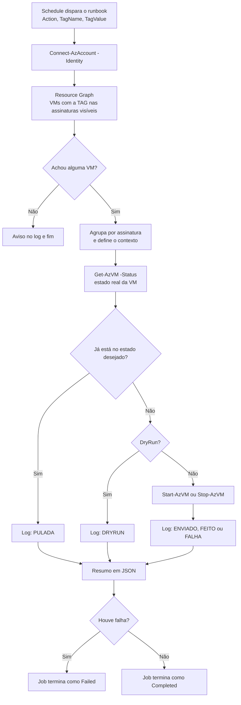

Fala pessoALL! Tudo certo por aí?

O primeiro artigo deste blog, lá em julho de 2025, foi o [Start/Stop de VMs com TAGs](https://blog.ruizsolutions.online/posts/azure-tag-start-stop-vms/). Um Automation Account, um runbook, dois agendamentos e as VMs de desenvolvimento param de cobrar computação fora do horário comercial. A ideia continua valendo.

O jeito de fazer é que envelheceu.

Aquele runbook rodava em **PowerShell 7.2**, versão que o próprio produto PowerShell já tirou de suporte. A identidade recebia **Virtual Machine Contributor** na subscription inteira, que é permissão para criar, apagar e rodar script dentro de qualquer VM, quando o trabalho dela era só ligar e desligar. Ele olhava só a assinatura de contexto da identidade e tratava as VMs em fila, esperando uma terminar para chamar a próxima. E mandava o comando sem perguntar se a máquina já estava no estado certo.

Nada disso impede o runbook antigo de funcionar. Só que, se hoje alguém me pedisse para revisar aquele desenho, eu devolveria com esses quatro apontamentos. Nada mais justo do que eu mesmo corrigir.

<!-- LUIZ: quanto tempo o runbook do artigo original levava para tratar um lote de VMs uma a uma em um laboratório seu? Se tiver o número (quantidade de VMs e minutos), uma frase aqui dá a medida do problema da fila. -->

**Neste artigo, vamos refazer o Start/Stop do zero: Automation Account com System Assigned Managed Identity e uma role customizada de cinco ações, Runtime Environment com PowerShell 7.4, e um único runbook parametrizado que usa o Azure Resource Graph para achar as VMs pela TAG em várias assinaturas, pula quem já está no estado desejado e deixa tudo registrado em log.**

> Esse runbook desaloca a VM com o que estiver rodando nela. Banco de dados, cluster, aplicação que depende de ordem de subida e qualquer máquina que não pode cair sem aviso ficam fora da TAG. Eu também não colocaria a TAG em VM que pertence a um serviço gerenciado, como os nós de um AKS.
{: .prompt-warning }

---

## O que mudou em relação ao artigo original?

| Ponto | Artigo de 2025 | Este artigo |
| --- | --- | --- |
| Runtime | PowerShell 7.2 | Runtime Environment próprio com PowerShell 7.4 |
| Permissão da identidade | Virtual Machine Contributor na subscription | Role customizada com cinco ações |
| Descoberta das VMs | `Get-AzResource` na assinatura de contexto da identidade | Resource Graph, em quantas assinaturas a identidade enxergar |
| Parâmetros | `TAGNAME`, `TAGVALUE`, `SHUTDOWN` | `Action`, `TagName`, `TagValue`, `SubscriptionIds`, `WaitForCompletion`, `DryRun` |
| VM já no estado certo | Não tratava | Confere o estado real e pula |
| Execução | Uma VM por vez, em fila | Dispara e segue para a próxima |
| Log | Saída do job | Uma linha por VM, resumo em JSON e job marcado como Failed se alguma VM falhar |

Três dessas mudanças merecem o porquê.

A primeira é a TAG, que deixou de carregar o horário. No artigo original as TAGs eram `Start = 08:00` e `Stop = 18:00`. Parecia que o valor controlava a hora, mas quem mandava era o schedule, e a TAG só servia de filtro. Trocar `08:00` por `07:00` na VM não adiantava o horário: a máquina deixava de casar com o filtro e saía da rotina sem ninguém perceber. Agora é uma TAG só, **`AutoStartStop`**, e o valor é o nome de um perfil (`business-hours`). O horário mora no schedule.

O parâmetro `SHUTDOWN` virou `Action`. Um booleano que liga a VM quando está em `false` obriga a pessoa a parar para pensar toda vez. `start` e `stop` não.

E a região deixou de ser requisito. O artigo de 2025 dizia que o Automation Account precisava estar na mesma região das VMs. Não precisa: uma conta gerencia recursos de qualquer região e de qualquer assinatura do tenant. Fica o registro da correção.

---

## Auto-shutdown, Start/Stop VMs v2 ou runbook próprio?

Antes de escrever script, vale olhar o que o Azure já entrega pronto.

### Auto-shutdown da VM

Fica no menu **Operations > Auto-shutdown** de cada VM. Você liga a opção, escolhe o horário e o fuso, e pode pedir uma notificação por e-mail ou webhook antes do desligamento.

Dois limites aparecem rápido. A configuração é por VM, e ela só cuida do desligamento: a tela não tem horário para ligar de volta.

Para mim, auto-shutdown é rede de proteção de VM de laboratório e de estudo, aquela que você cria às 22h e esquece ligada.

> O fuso padrão do auto-shutdown é UTC. Se você só digitar `19:00` e salvar, a VM cai às 16h de Brasília. Pelo CLI, o `az vm auto-shutdown --time` recebe a hora sempre em UTC, no formato `hhmm`.
{: .prompt-warning }

### Start/Stop VMs v2

É a solução oficial da Microsoft. Um deploy cria uma Function App, cinco Logic Apps, uma Storage Account e um Application Insights, com dashboard e notificação por e-mail. Além da agenda simples, ela tem um modo **Sequenced**, que respeita ordem de subida pelas TAGs `sequencestart` e `sequencestop`, e um modo **AutoStop**, que desliga a VM quando a CPU fica abaixo de um limite. Para quem precisa de uma dessas duas coisas sem escrever código, é o caminho.

Os pontos que me fazem pensar duas vezes:

1. O alvo é definido por assinatura, resource group ou lista de VMs no JSON de cada Logic App. A TAG `ssv2excludevm` serve para **excluir** uma VM, e não para incluir;
2. O deploy exige **Owner** na subscription, e para cada assinatura adicional a documentação manda dar **Contributor** à Function App;
3. A página do produto avisa que não haverá novos desenvolvimentos nem melhorias, só o necessário para manter os componentes em versão suportada;
4. Você paga por cada serviço que a solução cria.

### Quando o runbook próprio compensa

Quando a seleção precisa ser por **TAG de inclusão**, quando a identidade tem que ter o **menor privilégio possível** e quando você quer poucas peças para manter.

Sendo bem sincero: se o seu ambiente já roda o Start/Stop VMs v2 e ele atende, eu não migraria só por causa deste texto. Eu migraria no dia em que a auditoria perguntasse por que uma Function App tem Contributor em todas as assinaturas.

---

## Como o runbook decide o que fazer



Repare que o runbook consulta a VM em dois lugares. Isso é de propósito.

O Resource Graph atravessa assinaturas em uma chamada só, mas ele é um índice. A documentação diz com todas as letras que o dado é **eventualmente consistente**, com atraso que costuma ficar abaixo de um minuto e pode chegar a alguns minutos. A orientação oficial é usar o Resource Graph para montar a lista de candidatos e confirmar o estado no provedor do recurso logo antes de agir.

É o que o script faz. O Resource Graph responde quais VMs têm a TAG. O `Get-AzVM -Status` responde se a VM está ligada agora.

---

## Pré-requisitos

- Uma assinatura de laboratório com permissão de **Owner**, porque além dos recursos vamos criar uma role customizada e uma atribuição de role;
- **Azure CLI** ou acesso ao **Cloud Shell**. Os comandos `az graph` pedem a extensão `resource-graph`, que o próprio CLI oferece para instalar na primeira execução;
- Uma segunda assinatura no mesmo tenant, só se você quiser testar o Passo 10.

> Esse laboratório gera custo. As VMs cobram computação enquanto estão ligadas, e os discos continuam cobrando mesmo com a VM desalocada. O Azure Automation cobra por minuto de job acima da franquia mensal, e o Log Analytics do Passo 9 cobra pela ingestão. Rode a limpeza do final no mesmo dia.
{: .prompt-info }

---

## Mão na massa!

Nomes que vou usar no laboratório, no mesmo padrão CAF dos artigos anteriores:

| Recurso | Nome |
| --- | --- |
| Resource Group | `rg-startstop-lab-wus2-001` |
| Virtual Network | `vnet-startstop-lab-wus2-001` |
| Subnet | `snet-startstop-lab-wus2-001` |
| VMs | `vm-startstop-lab-001`, `002` e `003` |
| Automation Account | `aa-startstop-lab-wus2-001` |
| Runtime Environment | `rte-pwsh74-startstop` |
| Runbook | `Start-Stop-VMs-Tag` |
| Role customizada | `role-startstop-vm-operator` |

---

### Passo 1 - Criar as VMs do laboratório e aplicar a TAG

Precisamos de alvos: três VMs Linux pequenas, sem IP público, com a TAG em duas delas. A terceira fica sem TAG para provar que o runbook não encosta em quem não foi marcado.

No Cloud Shell (Bash):

```bash
az group create \
  --name rg-startstop-lab-wus2-001 \
  --location westus2

az network vnet create \
  --name vnet-startstop-lab-wus2-001 \
  --resource-group rg-startstop-lab-wus2-001 \
  --location westus2 \
  --address-prefixes 10.60.0.0/24 \
  --subnet-name snet-startstop-lab-wus2-001 \
  --subnet-prefixes 10.60.0.0/27

for i in 1 2 3; do
  az vm create \
    --resource-group rg-startstop-lab-wus2-001 \
    --name vm-startstop-lab-00$i \
    --image Ubuntu2404 \
    --size Standard_B2s \
    --admin-username azureuser \
    --generate-ssh-keys \
    --vnet-name vnet-startstop-lab-wus2-001 \
    --subnet snet-startstop-lab-wus2-001 \
    --public-ip-address ""
done
```

Agora a TAG nas VMs 001 e 002. O `--operation Merge` acrescenta a TAG sem apagar as que já existem no recurso:

```bash
for i in 1 2; do
  VM_ID=$(az vm show \
    --resource-group rg-startstop-lab-wus2-001 \
    --name vm-startstop-lab-00$i \
    --query id \
    --output tsv)

  az tag update \
    --resource-id $VM_ID \
    --operation Merge \
    --tags AutoStartStop=business-hours
done
```

<!-- PRINT 002: Portal, VM vm-startstop-lab-001 > Tags, mostrando a TAG AutoStartStop com o valor business-hours -->
{: .shadow .rounded-10 }
<br>

> Escreva o nome da TAG sempre do mesmo jeito. Para o Azure Resource Manager o nome não diferencia maiúsculas de minúsculas, mas na consulta do Resource Graph a chave em `tags['AutoStartStop']` é comparada como foi digitada. Padrão de TAGs aplicado por Azure Policy é assunto de um próximo artigo.
{: .prompt-tip }

---

### Passo 2 - Conferir o que a TAG resolve no Resource Graph

Antes de entregar essa consulta para um runbook, eu quero ver o que ela devolve. Se você nunca usou o Resource Graph, o artigo [Resource Graph na prática](https://blog.ruizsolutions.online/posts/azure-resource-graph-consultas-essenciais/) cobre a base.

A consulta está no arquivo `consulta-vms-por-tag.kql`:

```kusto
resources
| where type =~ 'microsoft.compute/virtualmachines'
| where tags['AutoStartStop'] =~ 'business-hours'
| project name, resourceGroup, subscriptionId, location, powerState = tostring(properties.extended.instanceView.powerState.code)
| order by name asc
```

1. No portal, pesquise por **Resource Graph Explorer**;
2. Cole a consulta e clique em **Run query**;
3. Confira que voltaram só as VMs `001` e `002`, com a coluna `powerState` em `PowerState/running`.

<!-- PRINT 003: Resource Graph Explorer com a consulta colada e o resultado listando vm-startstop-lab-001 e vm-startstop-lab-002 com powerState PowerState/running -->
{: .shadow .rounded-10 }
<br>

A mesma consulta pelo CLI, em uma linha:

```bash
az graph query -q "resources | where type =~ 'microsoft.compute/virtualmachines' | where tags['AutoStartStop'] =~ 'business-hours' | project name, resourceGroup, subscriptionId, powerState = tostring(properties.extended.instanceView.powerState.code) | order by name asc"
```

> Se a consulta voltar vazia logo depois de você aplicar a TAG, espere um minuto e rode de novo. É o atraso de indexação que comentei acima, e não erro seu.
{: .prompt-info }

---

### Passo 3 - Criar o Automation Account com Managed Identity

1. Pesquise por **Automation Accounts** e clique em **Create**;
2. Na aba **Basics**, informe:
   * Resource group: `rg-startstop-lab-wus2-001`;
   * Automation account name:
   ```text
   aa-startstop-lab-wus2-001
   ```
   * Region: `West US 2`;
3. Na aba **Advanced**, confirme que **System assigned** está marcado. Hoje o portal já traz essa opção ligada por padrão;
4. Na aba **Networking**, mantenha **Public access**. O acesso privado exige Hybrid Runbook Worker e não atende job em nuvem;
5. Clique em **Review + Create** e depois em **Create**.

<!-- PRINT 004: Tela Create an Automation Account, aba Advanced, com a opção System assigned marcada -->
{: .shadow .rounded-10 }
<br>

Com a conta criada, abra **Account Settings > Identity**. Na aba **System assigned** o **Status** precisa estar em **On**. Copie o **Object (principal) ID**: vamos usar no próximo passo.

<!-- PRINT 005: Automation Account > Identity, aba System assigned, com Status On e o campo Object (principal) ID visível -->
{: .shadow .rounded-10 }
<br>

Por que System Assigned e não User Assigned? Porque essa identidade só serve a este Automation Account e nasce e morre com ele. User Assigned faz sentido quando a mesma identidade precisa ser compartilhada entre várias contas.

---

### Passo 4 - Criar a role mínima e atribuir à identidade

Aqui está a mudança que eu considero a mais importante do artigo.

O runbook precisa de quatro coisas em uma VM: ler o recurso, ler o estado, ligar e desalocar. A role **Virtual Machine Contributor** entrega `Microsoft.Compute/virtualMachines/*`, e esse asterisco inclui apagar a VM e executar script dentro dela. Se essa identidade for comprometida, o estrago vai muito além de máquina desligada.

<!-- VALIDAR: rodar o DryRun do Passo 7 só com esta role atribuída. Confirmar que (1) o Get-AzSubscription devolve a assinatura, (2) o Resource Graph devolve as VMs com a coluna powerState preenchida e (3) o Set-AzContext funciona. Se algum dos três falhar, acrescentar Microsoft.Resources/subscriptions/read na role (ou atribuir Reader) e ajustar no texto a contagem de "cinco ações". -->
O arquivo `role-startstop-vm-operator.json`:

```json
{
  "Name": "role-startstop-vm-operator",
  "IsCustom": true,
  "Description": "Permite ler, ligar e desalocar máquinas virtuais. Usada pela Managed Identity do runbook de Start/Stop.",
  "Actions": [
    "Microsoft.Compute/virtualMachines/read",
    "Microsoft.Compute/virtualMachines/instanceView/read",
    "Microsoft.Compute/virtualMachines/start/action",
    "Microsoft.Compute/virtualMachines/deallocate/action",
    "Microsoft.Resources/subscriptions/resourceGroups/read"
  ],
  "NotActions": [],
  "AssignableScopes": [
    "/subscriptions/<SUBSCRIPTION_ID>"
  ]
}
```

A quinta ação, leitura de resource groups, é a única que não é de VM.

Repare também no que **não** está na lista: `powerOff/action`. Essa ação desliga a VM e mantém a máquina alocada, ou seja, a computação continua sendo cobrada. Para FinOps o que interessa é `deallocate/action`.

No Cloud Shell, crie o arquivo com o conteúdo acima, troque o `<SUBSCRIPTION_ID>` e crie a role:

```bash
SUBSCRIPTION_ID=$(az account show --query id --output tsv)

sed -i "s|<SUBSCRIPTION_ID>|$SUBSCRIPTION_ID|g" role-startstop-vm-operator.json

az role definition create --role-definition role-startstop-vm-operator.json
```

<!-- PRINT 006: Cloud Shell com a saída JSON do az role definition create mostrando roleName role-startstop-vm-operator e as cinco actions -->
{: .shadow .rounded-10 }
<br>

> Esse JSON está no formato do `az role definition create`, com `Name`, `IsCustom`, `Actions` e `AssignableScopes` na raiz. O formato que o Portal aceita em **Start from JSON** é outro. Já passei por essa diferença no [artigo do Azure Image Builder](https://blog.ruizsolutions.online/posts/azure-image-builder-windows-linux/), e ela continua pegando gente.
{: .prompt-warning }

Agora a atribuição. Cole no lugar de `<OBJECT_ID>` o valor que você copiou da tela **Identity**:

```bash
PRINCIPAL_ID="<OBJECT_ID>"

az role assignment create \
  --assignee-object-id $PRINCIPAL_ID \
  --assignee-principal-type ServicePrincipal \
  --role "role-startstop-vm-operator" \
  --scope /subscriptions/$SUBSCRIPTION_ID
```

<!-- PRINT 007: Portal, Subscription > Access control (IAM) > Role assignments, filtrado por aa-startstop-lab-wus2-001, mostrando a role role-startstop-vm-operator no escopo da subscription -->
{: .shadow .rounded-10 }
<br>

Atribuí na subscription para o runbook achar VM com a TAG em qualquer resource group. Em ambiente real, se as VMs elegíveis ficam em poucos resource groups conhecidos, eu atribuiria neles.

> A atribuição de role pode levar alguns minutos para valer. Se o primeiro teste do runbook disser que não achou nenhuma VM, espere antes de sair mexendo na role.
{: .prompt-info }

---

### Passo 5 - Criar o Runtime Environment com PowerShell 7.4

O **Runtime Environment** junta linguagem, versão e pacotes em um recurso separado. O runbook aponta para um ambiente, e trocar de versão no futuro é trocar o apontamento, sem tocar no script.

1. No Automation Account, em **Process Automation**, clique em **Runtime Environments**. Se esse item não aparecer no menu, vá em **Overview** e clique em **Try Runtime environment experience**;
2. Clique em **Create**;
3. Na aba **Basics**, informe:
   * Name:
   ```text
   rte-pwsh74-startstop
   ```
   * Language: `PowerShell`;
   * Runtime version: `7.4`;
   * Description: `PowerShell 7.4 para o runbook de Start/Stop por TAG`;
4. Na aba **Packages**, confira que o pacote **Az** já vem na lista e não adicione mais nada;
5. Clique em **Review + Create** e depois em **Create**.

<!-- PRINT 008: Create Runtime Environment, aba Basics, com Name rte-pwsh74-startstop, Language PowerShell e Runtime version 7.4 -->
{: .shadow .rounded-10 }
<br>

<!-- PRINT 009: Create Runtime Environment, aba Packages, mostrando o pacote Az padrão com a versão selecionada e nenhum pacote adicional -->
{: .shadow .rounded-10 }
<br>

<!-- VALIDAR: criar um runbook de teste ligado ao rte-pwsh74-startstop com a linha Get-Module -ListAvailable | Select-Object Name, Version e confirmar que Az.ResourceGraph aparece. Se não aparecer, voltar para este passo a instrução de Add from gallery > Az.ResourceGraph e ajustar o PRINT 009. -->
Sobre o item 4: o `Search-AzGraph` vive no módulo `Az.ResourceGraph`, que faz parte do pacote **Az** desde a versão 12.0.0. O Runtime Environment de PowerShell 7.4 traz o Az 12.3.0 por padrão, então o cmdlet já está lá. Eu não adicionaria o `Az.ResourceGraph` pela galeria sem precisar: a versão mais nova do módulo pode pedir um `Az.Accounts` mais novo que o do pacote padrão, e conflito de versão de módulo às 8h de uma segunda-feira ninguém merece. De qualquer forma, o script confere se o cmdlet existe e para com uma mensagem clara se não existir.

> A página de tipos de runbook já lista o **PowerShell 7.6** como versão suportada, ao lado do 7.4. Se a sua lista de **Runtime version** oferecer o 7.6, pode usar: o script não depende de nada específico de uma ou de outra. O que não faz mais sentido é criar runbook novo em 7.1 ou 7.2.
{: .prompt-tip }

---

### Passo 6 - Criar o runbook

1. Em **Process Automation**, clique em **Runbooks** e depois em **Create**;
2. Na aba **Basics**, informe:
   * Name:
   ```text
   Start-Stop-VMs-Tag
   ```
   * Runbook type: `PowerShell`;
   * Runtime environment: clique em **Select from existing** e escolha `rte-pwsh74-startstop`;
   * Description: `Liga ou desaloca VMs por TAG em uma ou mais assinaturas`;
3. Avance até a revisão e clique em **Create**.

<!-- PRINT 010: Create a runbook, aba Basics, com Name Start-Stop-VMs-Tag, Runbook type PowerShell e Runtime environment rte-pwsh74-startstop -->
{: .shadow .rounded-10 }
<br>

O editor abre em branco. Cole o conteúdo do arquivo **[Start-Stop-VMs-Tag.ps1](https://github.com/lfrleite/Ruiz-Online/blob/main/Start%20Stop%20VMs%20v2/Start-Stop-VMs-Tag.ps1)**:

```powershell
<#
.SYNOPSIS
    Liga ou desaloca VMs do Azure selecionadas por TAG, em uma ou mais assinaturas.

.DESCRIPTION
    Runbook para Azure Automation com Runtime Environment PowerShell 7.4 ou superior.

    O que ele faz, na ordem:
      1. Autentica com a System Assigned Managed Identity do Automation Account.
      2. Consulta o Azure Resource Graph para achar as VMs que têm a TAG informada.
      3. Confere o estado real de cada VM no provedor de Compute antes de agir.
      4. Liga (start) ou desaloca (stop) somente as VMs que precisam mudar de estado.
      5. Escreve uma linha de log por VM e um resumo em JSON no final.

    Módulos usados: Az.Accounts, Az.Compute e Az.ResourceGraph.
    Não existe credencial, segredo ou ID de assinatura fixo no código.

.PARAMETER Action
    start ou stop. O stop sempre desaloca a VM (Stopped (deallocated)).

.PARAMETER TagName
    Nome da TAG, escrito exatamente como está nos recursos. Exemplo: AutoStartStop

.PARAMETER TagValue
    Valor da TAG. Exemplo: business-hours

.PARAMETER SubscriptionIds
    Opcional. IDs de assinatura separados por vírgula.
    Vazio = todas as assinaturas habilitadas que a Managed Identity enxerga (Get-AzSubscription).

.PARAMETER WaitForCompletion
    false (padrão): dispara a operação em cada VM e segue para a próxima.
    true: espera cada VM terminar antes de seguir. Mais lento, porém o log traz o resultado final.

.PARAMETER DryRun
    true: só mostra o que seria feito. Nenhuma VM é alterada.

.NOTES
    Repositório: https://github.com/lfrleite/Ruiz-Online/tree/main/Start%20Stop%20VMs%20v2
#>

param(
    [Parameter(Mandatory = $true)]
    [string] $Action,

    [Parameter(Mandatory = $true)]
    [string] $TagName,

    [Parameter(Mandatory = $true)]
    [string] $TagValue,

    [Parameter(Mandatory = $false)]
    [string] $SubscriptionIds = '',

    [Parameter(Mandatory = $false)]
    [bool] $WaitForCompletion = $false,

    [Parameter(Mandatory = $false)]
    [bool] $DryRun = $false
)

$ErrorActionPreference = 'Stop'

# O sandbox do Azure Automation roda em UTC. O log deixa isso explícito no carimbo de hora.
function Write-Log {
    param(
        [string] $Level,
        [string] $Message
    )

    $line = '{0} [{1}] {2}' -f (Get-Date).ToUniversalTime().ToString('yyyy-MM-ddTHH:mm:ssZ'), $Level, $Message

    switch ($Level) {
        'WARN'  { Write-Warning -Message $line }
        'ERROR' { Write-Error -Message $line -ErrorAction Continue }
        default { Write-Output $line }
    }
}

# ---------------------------------------------------------------------------
# 1. Validação dos parâmetros
#    O Azure Automation só entende tipo, nome, obrigatoriedade e valor padrão.
#    ValidateSet e afins são ignorados, então a validação é feita aqui.
# ---------------------------------------------------------------------------
$Action = "$Action".Trim().ToLowerInvariant()
if ($Action -notin @('start', 'stop')) {
    throw "Parâmetro Action inválido: '$Action'. Use start ou stop."
}

$TagName  = "$TagName".Trim()
$TagValue = "$TagValue".Trim()

# TagName e TagValue entram no texto da consulta KQL. Só passa o que não quebra a consulta.
if ($TagName -notmatch '^[A-Za-z0-9_.\-]{1,128}$') {
    throw "Parâmetro TagName inválido: '$TagName'. Use apenas letras, números, ponto, hífen e sublinhado."
}
if ($TagValue -notmatch '^[A-Za-z0-9_.:\-/ ]{1,256}$') {
    throw "Parâmetro TagValue inválido: '$TagValue'. Use apenas letras, números, espaço, ponto, dois-pontos, barra, hífen e sublinhado."
}

$subscriptionList = @()
if (-not [string]::IsNullOrWhiteSpace($SubscriptionIds)) {
    $subscriptionList = @(
        $SubscriptionIds.Split(',') |
            ForEach-Object { $_.Trim() } |
            Where-Object { $_ -ne '' }
    )
    foreach ($subscriptionId in $subscriptionList) {
        if ($subscriptionId -notmatch '^[0-9a-fA-F]{8}(-[0-9a-fA-F]{4}){3}-[0-9a-fA-F]{12}$') {
            throw "ID de assinatura inválido em SubscriptionIds: '$subscriptionId'."
        }
    }
}

# ---------------------------------------------------------------------------
# 2. Autenticação com a System Assigned Managed Identity
# ---------------------------------------------------------------------------
try {
    # Garante que o runbook não herda o contexto de outro job no mesmo sandbox.
    Disable-AzContextAutosave -Scope Process | Out-Null
    $azContext = (Connect-AzAccount -Identity).Context
}
catch {
    throw "Falha ao autenticar com a Managed Identity do Automation Account: $($_.Exception.Message)"
}

if (-not (Get-Command -Name Search-AzGraph -ErrorAction SilentlyContinue)) {
    throw 'O cmdlet Search-AzGraph não existe neste Runtime Environment. Adicione o pacote Az.ResourceGraph e execute de novo.'
}

# Sem SubscriptionIds, o escopo é a lista de assinaturas que a identidade enxerga.
# A lista vai explícita no -Subscription porque, sem esse parâmetro, o Search-AzGraph
# consulta somente as assinaturas do contexto padrão.
if ($subscriptionList.Count -gt 0) {
    $scopeText = $subscriptionList -join ', '
}
else {
    try {
        $subscriptionList = @(
            Get-AzSubscription -DefaultProfile $azContext |
                Where-Object { $_.State -eq 'Enabled' } |
                ForEach-Object { $_.Id } |
                Select-Object -Unique
        )
    }
    catch {
        throw "Falha ao listar as assinaturas visíveis para a Managed Identity: $($_.Exception.Message)"
    }

    if ($subscriptionList.Count -eq 0) {
        throw 'A Managed Identity não enxerga nenhuma assinatura habilitada. Confira a atribuição da role e aguarde a propagação.'
    }

    $scopeText = "todas as assinaturas visíveis para a identidade ($($subscriptionList.Count))"
}

Write-Log -Level 'INFO' -Message "Início. Action=$Action; TAG $TagName=$TagValue; Escopo=$scopeText; WaitForCompletion=$WaitForCompletion; DryRun=$DryRun"

# ---------------------------------------------------------------------------
# 3. Descoberta das VMs pelo Azure Resource Graph
#    A coluna id precisa estar no project para o Resource Graph devolver o SkipToken.
# ---------------------------------------------------------------------------
$query = @"
resources
| where type =~ 'microsoft.compute/virtualmachines'
| where tags['$TagName'] =~ '$TagValue'
| project id, name, resourceGroup, subscriptionId, location, powerState = tostring(properties.extended.instanceView.powerState.code)
| order by id asc
"@

$vms = [System.Collections.Generic.List[object]]::new()
$skipToken = $null

try {
    do {
        $graphParams = @{
            Query          = $query
            Subscription   = $subscriptionList
            First          = 1000
            DefaultProfile = $azContext
        }
        if ($skipToken) { $graphParams['SkipToken'] = $skipToken }

        $page = Search-AzGraph @graphParams

        if ($null -ne $page -and $null -ne $page.Data) {
            foreach ($row in $page.Data) { $vms.Add($row) }
        }
        $skipToken = if ($null -ne $page) { $page.SkipToken } else { $null }
    } while ($skipToken)
}
catch {
    throw "Falha na consulta ao Azure Resource Graph: $($_.Exception.Message)"
}

Write-Log -Level 'INFO' -Message "VMs encontradas com a TAG: $($vms.Count)"

$summary = [ordered]@{
    action    = $Action
    tagName   = $TagName
    tagValue  = $TagValue
    dryRun    = $DryRun
    found     = $vms.Count
    requested = 0
    skipped   = 0
    simulated = 0
    failed    = 0
}

if ($vms.Count -eq 0) {
    Write-Log -Level 'WARN' -Message 'Nenhuma VM encontrada. Confira o nome da TAG, o valor e se a role da Managed Identity alcança as VMs.'
    Write-Output ('RESUMO ' + ($summary | ConvertTo-Json -Compress))
    return
}

# Estados em que a VM já está onde deveria (ou a caminho) para cada ação.
$alreadyDone = @{
    start = @('PowerState/running', 'PowerState/starting')
    stop  = @('PowerState/deallocated', 'PowerState/deallocating')
}

# ---------------------------------------------------------------------------
# 4. Ação por assinatura
#    O Resource Graph monta a lista. O estado que decide a ação vem do Get-AzVM -Status,
#    porque o Resource Graph é eventualmente consistente.
# ---------------------------------------------------------------------------
foreach ($group in ($vms | Group-Object -Property subscriptionId)) {

    try {
        $subContext = Set-AzContext -Subscription $group.Name -DefaultProfile $azContext
    }
    catch {
        $summary.failed += $group.Count
        Write-Log -Level 'ERROR' -Message "Assinatura $($group.Name): não foi possível definir o contexto. $($group.Count) VM(s) não tratada(s). Erro: $($_.Exception.Message)"
        continue
    }

    foreach ($vm in $group.Group) {

        $vmLabel = "$($vm.subscriptionId)/$($vm.resourceGroup)/$($vm.name)"

        try {
            $instanceView = Get-AzVM -ResourceGroupName $vm.resourceGroup -Name $vm.name -Status -DefaultProfile $subContext
            $powerState = ($instanceView.Statuses |
                    Where-Object { $_.Code -like 'PowerState/*' } |
                    Select-Object -First 1).Code

            if (-not $powerState) { $powerState = 'PowerState/unknown' }

            if ($powerState -in $alreadyDone[$Action]) {
                $summary.skipped++
                Write-Log -Level 'INFO' -Message "PULADA  $vmLabel | estado atual: $powerState | nada a fazer para $Action"
                continue
            }

            if ($DryRun) {
                $summary.simulated++
                Write-Log -Level 'INFO' -Message "DRYRUN  $vmLabel | estado atual: $powerState | seria executado: $Action"
                continue
            }

            $operationParams = @{
                ResourceGroupName = $vm.resourceGroup
                Name              = $vm.name
                DefaultProfile    = $subContext
            }
            if (-not $WaitForCompletion) { $operationParams['NoWait'] = $true }

            if ($Action -eq 'start') {
                $result = Start-AzVM @operationParams
            }
            else {
                # Sem -StayProvisioned o Stop-AzVM desaloca a VM. -Force evita o pedido de confirmação.
                $result = Stop-AzVM @operationParams -Force
            }

            $summary.requested++
            if ($WaitForCompletion) {
                Write-Log -Level 'INFO' -Message "FEITO   $vmLabel | estado anterior: $powerState | $Action concluído com status: $($result.Status)"
            }
            else {
                Write-Log -Level 'INFO' -Message "ENVIADO $vmLabel | estado anterior: $powerState | $Action solicitado sem aguardar o término"
            }
        }
        catch {
            $summary.failed++
            Write-Log -Level 'ERROR' -Message "FALHA   $vmLabel | $Action não executado. Erro: $($_.Exception.Message)"
        }
    }
}

# ---------------------------------------------------------------------------
# 5. Resumo
#    A linha em JSON facilita a consulta no Log Analytics.
#    Se alguma VM falhou, o job termina como Failed para o alerta pegar.
# ---------------------------------------------------------------------------
Write-Output ('RESUMO ' + ($summary | ConvertTo-Json -Compress))

if ($summary.failed -gt 0) {
    throw "Execução terminou com $($summary.failed) falha(s). Veja as linhas FALHA no log do job."
}

Write-Log -Level 'INFO' -Message 'Fim sem falhas.'
```

Clique em **Save**. Ainda não publique.

<!-- PRINT 011: Editor do runbook Start-Stop-VMs-Tag com o script colado e o campo Runtime environment mostrando rte-pwsh74-startstop -->
{: .shadow .rounded-10 }
<br>

Antes de rodar, eu quero que você entenda o que esse script faz de diferente do original:

1. A validação dos parâmetros é feita à mão. O Azure Automation só reconhece tipo, nome, obrigatoriedade e valor padrão de um parâmetro, então `ValidateSet` não é aplicado na entrada e o próprio código confere se `Action` é `start` ou `stop`. O nome e o valor da TAG também passam por um filtro de caracteres, porque os dois entram no texto da consulta KQL. Parâmetro de runbook é entrada de usuário e eu trato como tal;
2. `SubscriptionIds` vazio significa todas as assinaturas que a identidade enxerga. O script busca essa lista com `Get-AzSubscription` e entrega para o `Search-AzGraph`, porque sem o `-Subscription` o cmdlet consulta só as assinaturas do contexto padrão. O escopo de verdade continua sendo o RBAC: o runbook só acha VM onde a role foi atribuída;
3. O `stop` também pega VM em `PowerState/stopped`. Esse é o estado de quem foi desligado por dentro do S.O.: a máquina está parada, mas continua alocada e cobrando computação. O runbook desaloca;
4. O **`-NoWait`** é o padrão. O `Start-AzVM` e o `Stop-AzVM` devolvem o controle assim que o Azure aceita o pedido, e o runbook segue para a próxima VM. É o que acaba com a fila do artigo original. O preço: o log registra que a operação foi **solicitada**, e não que terminou. Com `WaitForCompletion = true` o runbook espera cada VM e registra o status final, só que volta a ser sequencial, e um job no sandbox do Azure é encerrado ao passar de três horas;
5. Se uma VM falhar, o job inteiro termina como **Failed**. As outras VMs são tratadas normalmente e o erro é lançado só no fim. Job `Completed` com erro escondido no meio do log é o tipo de coisa que ninguém vê.

---

### Passo 7 - Testar antes de publicar

O **Test pane** executa o rascunho, mas executa de verdade: o que o runbook fizer nas VMs, está feito. Por isso o primeiro teste é com `DryRun`.

1. No editor, clique em **Test pane**;
2. Preencha os parâmetros:
   * ACTION: `stop`;
   * TAGNAME: `AutoStartStop`;
   * TAGVALUE: `business-hours`;
   * SUBSCRIPTIONIDS: deixe vazio;
   * WAITFORCOMPLETION: `false`;
   * DRYRUN: `true`;
3. Clique em **Start**.

O formato esperado da saída é este. Os valores são exemplo:

```text
2026-11-03T14:02:11Z [INFO] Início. Action=stop; TAG AutoStartStop=business-hours; Escopo=todas as assinaturas visíveis para a identidade (1); WaitForCompletion=False; DryRun=True
2026-11-03T14:02:14Z [INFO] VMs encontradas com a TAG: 2
2026-11-03T14:02:16Z [INFO] DRYRUN  <subscription-id>/rg-startstop-lab-wus2-001/vm-startstop-lab-001 | estado atual: PowerState/running | seria executado: stop
2026-11-03T14:02:17Z [INFO] DRYRUN  <subscription-id>/rg-startstop-lab-wus2-001/vm-startstop-lab-002 | estado atual: PowerState/running | seria executado: stop
RESUMO {"action":"stop","tagName":"AutoStartStop","tagValue":"business-hours","dryRun":true,"found":2,"requested":0,"skipped":0,"simulated":2,"failed":0}
2026-11-03T14:02:17Z [INFO] Fim sem falhas.
```

<!-- PRINT 012: Test pane com os seis parâmetros preenchidos (DRYRUN = true) e a saída mostrando duas linhas DRYRUN e a linha RESUMO com simulated 2 -->
{: .shadow .rounded-10 }
<br>

A hora do log está em UTC porque o sandbox do Azure Automation roda em UTC.

Achou as duas VMs e ignorou a `003`? Identidade, role e consulta estão certas. Agora mude `DRYRUN` para `false` e clique em **Start** de novo.

<!-- PRINT 013: Test pane com DRYRUN = false e a saída mostrando duas linhas ENVIADO com estado anterior PowerState/running e a linha RESUMO com requested 2 -->
{: .shadow .rounded-10 }
<br>

Abra **Virtual machines** em outra aba e acompanhe. As VMs `001` e `002` passam por **Deallocating** e chegam em **Stopped (deallocated)**. A `003` continua **Running**.

<!-- PRINT 014: Lista Virtual machines do portal com vm-startstop-lab-001 e 002 em Stopped (deallocated) e vm-startstop-lab-003 em Running -->
{: .shadow .rounded-10 }
<br>

Agora o teste que o artigo original não tinha. Sem mudar nenhum parâmetro, clique em **Start** mais uma vez. Trecho da saída esperada:

```text
2026-11-03T14:11:40Z [INFO] VMs encontradas com a TAG: 2
2026-11-03T14:11:42Z [INFO] PULADA  <subscription-id>/rg-startstop-lab-wus2-001/vm-startstop-lab-001 | estado atual: PowerState/deallocated | nada a fazer para stop
2026-11-03T14:11:43Z [INFO] PULADA  <subscription-id>/rg-startstop-lab-wus2-001/vm-startstop-lab-002 | estado atual: PowerState/deallocated | nada a fazer para stop
RESUMO {"action":"stop","tagName":"AutoStartStop","tagValue":"business-hours","dryRun":false,"found":2,"requested":0,"skipped":2,"simulated":0,"failed":0}
```

<!-- PRINT 015: Test pane com a segunda execução de stop mostrando duas linhas PULADA com estado atual PowerState/deallocated e RESUMO com skipped 2 -->
{: .shadow .rounded-10 }
<br>

Nenhuma chamada de desligamento foi feita. É isso que deixa o runbook seguro para rodar duas vezes, ser disparado na mão no meio do dia ou conviver com um schedule duplicado por engano.

Para fechar, troque `ACTION` para `start` e execute. As duas VMs voltam para **Running**.

<!-- PRINT 016: Test pane com ACTION = start e a saída mostrando duas linhas ENVIADO com estado anterior PowerState/deallocated -->
{: .shadow .rounded-10 }
<br>

Tudo certo nos quatro testes? Feche o Test pane e clique em **Publish**.

---

### Passo 8 - Agendar o start e o stop

Um runbook, dois schedules. Cada schedule guarda os seus próprios valores de parâmetro.

1. No runbook, em **Resources**, clique em **Schedules** e depois em **Add a schedule**;
2. Clique em **Link a schedule to your runbook** e depois na opção de criar um schedule novo (**Add a schedule**);
3. Preencha o **New schedule**:
   * Name: `sch-start-vms-weekdays`;
   * Description: `Liga as VMs com a TAG de Start/Stop, de segunda a sexta`;
   * Starts: a data do primeiro dia e a hora `08:00`;
   * Time zone: o fuso de quem usa as VMs. No meu caso, o de Brasília;
   * Recurrence: `Recurring`;
   * Recur every: `1` `Week`;
   * Nos dias da semana, marque de segunda a sexta;
4. Clique em **Create**.

<!-- PRINT 017: Painel New schedule preenchido com sch-start-vms-weekdays, Starts 08:00, Time zone de Brasília, Recurring, 1 Week e os dias de segunda a sexta marcados -->
{: .shadow .rounded-10 }
<br>

5. De volta ao painel **Schedule Runbook**, clique em **Parameters and run settings** (o rótulo dessa opção já mudou de nome algumas vezes, é a que abre os parâmetros do runbook) e informe:
   * ACTION: `start`;
   * TAGNAME: `AutoStartStop`;
   * TAGVALUE: `business-hours`;
   * SUBSCRIPTIONIDS: vazio;
   * WAITFORCOMPLETION: `false`;
   * DRYRUN: `false`;
6. Clique em **OK** nos dois painéis.

<!-- PRINT 018: Painel de parâmetros do schedule com ACTION = start, TAGNAME = AutoStartStop, TAGVALUE = business-hours, WAITFORCOMPLETION = false e DRYRUN = false -->
{: .shadow .rounded-10 }
<br>

Repita o processo para o desligamento: schedule `sch-stop-vms-weekdays`, hora `18:00`, e `ACTION` igual a `stop`. Não vou repetir os prints porque as telas são as mesmas.

<!-- PRINT 019: Runbook > Schedules listando sch-start-vms-weekdays e sch-stop-vms-weekdays com a coluna Next run preenchida -->
{: .shadow .rounded-10 }
<br>

> O campo **Time zone** é onde mais se erra nesse passo, igual era no artigo de 2025. Confira a coluna **Next run** depois de salvar: ela precisa mostrar a hora que você espera no seu fuso.
{: .prompt-warning }

Como o runbook pula VM que já está desalocada, o `stop` não precisa ser só de segunda a sexta. Rodando todos os dias, ele pega a VM que alguém ligou na mão no sábado e esqueceu. Em ambiente real eu deixaria o `stop` diário e o `start` só em dia útil.

<!-- LUIZ: você já teve caso de VM que o schedule ligou e que alguém tinha desligado de propósito (manutenção, descomissionamento em andamento)? Como a exceção foi tratada: tirando a TAG, trocando o valor? Duas frases aqui ajudam o leitor a pensar na regra de exceção. -->

---

### Passo 9 - Acompanhar pelo log

Depois da primeira execução agendada, vá em **Process Automation > Jobs** e abra o job. A saída traz as mesmas linhas do teste, e as marcadas com `[WARN]` e `[ERROR]` aparecem nos fluxos de aviso e de erro.

<!-- PRINT 020: Automation Account > Jobs > job do Start-Stop-VMs-Tag disparado pelo schedule, com status Completed e a saída mostrando as linhas ENVIADO e RESUMO -->
{: .shadow .rounded-10 }
<br>

Só que o Azure Automation guarda o log dos jobs por no máximo 30 dias. Para auditoria e para alerta, isso é pouco. O caminho é mandar para um Log Analytics:

1. No Automation Account, em **Monitoring**, clique em **Diagnostic settings** e depois em **Add diagnostic setting**;
2. Dê um nome, marque as categorias **JobLogs** e **JobStreams**;
3. Em **Destination details**, marque o destino **Log Analytics** e escolha o workspace;
4. Clique em **Save**.

<!-- PRINT 021: Diagnostic setting do Automation Account com as categorias JobLogs e JobStreams marcadas e o destino Log Analytics selecionado -->
{: .shadow .rounded-10 }
<br>

Os registros caem na tabela `AzureDiagnostics`, com até 15 minutos entre o evento e a chegada no workspace. As duas consultas do arquivo `logs-runbook-start-stop.kql`:

```kusto
// Linhas de log do runbook, da mais recente para a mais antiga
AzureDiagnostics
| where ResourceProvider == "MICROSOFT.AUTOMATION" and Category == "JobStreams"
| where RunbookName_s == "Start-Stop-VMs-Tag"
| project TimeGenerated, JobId_g, StreamType_s, ResultDescription
| sort by TimeGenerated desc

// Jobs do runbook que terminaram com falha, parados ou suspensos
AzureDiagnostics
| where ResourceProvider == "MICROSOFT.AUTOMATION" and Category == "JobLogs"
| where RunbookName_s == "Start-Stop-VMs-Tag"
| where ResultType == "Failed" or ResultType == "Stopped" or ResultType == "Suspended"
| project TimeGenerated, RunbookName_s, ResultType, JobId_g
```

A primeira devolve cada linha do log na coluna `ResultDescription`. A segunda é a base para uma regra de alerta: como o runbook lança erro quando alguma VM falha, job com `ResultType` igual a `Failed` significa VM que não ligou ou não desligou.

<!-- PRINT 022: Log Analytics com a primeira consulta executada e o resultado mostrando as linhas ENVIADO e RESUMO na coluna ResultDescription -->
{: .shadow .rounded-10 }
<br>

> VM que não desligou às 18h só vira problema na fatura. VM que não ligou às 8h vira problema às 8h05, com gente esperando. Se for criar um alerta só, crie o do `start`.
{: .prompt-tip }

---

### Passo 10 - Estender para outras assinaturas

Passo opcional, e que não muda uma linha do script. O alcance do runbook é definido por onde a identidade tem a role.

1. Edite o `role-startstop-vm-operator.json` e acrescente a outra assinatura em `AssignableScopes`, no mesmo formato `/subscriptions/<ID>`;
2. Atualize a definição:

```bash
az role definition update --role-definition role-startstop-vm-operator.json
```

3. Repita o `az role assignment create` do Passo 4 com o `--scope` apontando para a segunda assinatura.

Com muitas assinaturas, eu usaria um Management Group em `AssignableScopes`, no formato `/providers/Microsoft.Management/managementGroups/<ID>`, e faria a atribuição nele. Para um schedule tratar só algumas assinaturas, preencha `SUBSCRIPTIONIDS` com os IDs separados por vírgula.

> VM com a TAG em uma assinatura onde a identidade não tem a role simplesmente não aparece na consulta. O Resource Graph não devolve erro de permissão: ele devolve menos linhas. Depois de incluir uma assinatura, rode um `DryRun` e confira a contagem.
{: .prompt-danger }

---

## Erros comuns

### O job falha dizendo que o Search-AzGraph não existe

O Runtime Environment está sem o módulo `Az.ResourceGraph`. Antes de mexer, veja o que o ambiente carrega de fato: crie um runbook de uma linha ligado a ele e leia a saída.

```powershell
Get-Module -ListAvailable | Select-Object Name, Version
```

Se o módulo não estiver na lista, abra **Runtime Environments**, selecione `rte-pwsh74-startstop`, use **Add from gallery** para incluir o `Az.ResourceGraph` e clique em **Save**.

### O runbook não acha nenhuma VM

Três causas possíveis: a role ainda não propagou ou foi atribuída no escopo errado, o nome da TAG foi digitado com outra caixa, ou a TAG acabou de ser aplicada e o Resource Graph ainda não indexou. Quando a identidade não tem role em lugar nenhum, o job nem chega na consulta: ele falha avisando que a Managed Identity não enxerga nenhuma assinatura. Nos dois casos, comece pela permissão:

```bash
az role assignment list \
  --assignee $PRINCIPAL_ID \
  --all \
  --output table
```

Depois rode a consulta do Passo 2 com o seu usuário. Se você enxerga as VMs e o runbook não, é permissão. Se nem você enxerga, é TAG.

### AuthorizationFailed ao ligar ou desalocar

A linha `FALHA` do log traz a mensagem do Azure com a ação que faltou. Quase sempre é a role sem `start/action` ou `deallocate/action`, ou a VM em uma assinatura que ficou fora de `AssignableScopes`. Se a linha de erro for a de **não foi possível definir o contexto**, a identidade não enxerga aquela assinatura e o que falta é a atribuição nela. Confira o que a role tem hoje:

```bash
az role definition list \
  --name "role-startstop-vm-operator" \
  --output json \
  --query '[].permissions[0].actions'
```

### O job para sozinho com status Stopped

Você ligou `WaitForCompletion` em um lote grande e a execução passou das três horas do sandbox. Volte para `false` ou divida as VMs em perfis de TAG diferentes, cada um com o seu schedule.

### As VMs ligam ou desligam na hora errada

Fuso do schedule. Abra **Shared Resources > Schedules**, selecione o agendamento e confira **Time zone** e **Next run**. Lembre que a hora dentro do log do job é UTC, e não a do schedule.

### Falha ao autenticar com a Managed Identity

A identidade foi desligada ou nunca foi criada. Em **Account Settings > Identity**, a aba **System assigned** precisa estar com **Status** em **On**. Se ela foi desligada e ligada de novo, compare o **Object (principal) ID** com o que você usou no Passo 4: se mudou, a atribuição de role precisa ser refeita para o ID novo.

---

## Checklist

- [x] Passo 1 - Criar as VMs do laboratório e aplicar a TAG `AutoStartStop`;
- [x] Passo 2 - Conferir no Resource Graph o que a TAG resolve;
- [x] Passo 3 - Criar o Automation Account com System Assigned Managed Identity;
- [x] Passo 4 - Criar a role `role-startstop-vm-operator` e atribuir à identidade;
- [x] Passo 5 - Criar o Runtime Environment com PowerShell 7.4 e o pacote **Az** padrão;
- [x] Passo 6 - Criar o runbook `Start-Stop-VMs-Tag`;
- [x] Passo 7 - Testar com `DryRun`, depois `stop`, `stop` de novo e `start`;
- [x] Passo 8 - Criar os schedules de `start` e de `stop` com os parâmetros de cada um;
- [x] Passo 9 - Conferir o log do job e enviar para o Log Analytics;
- [x] Passo 10 - Estender a role para outras assinaturas, se for o caso.

---

## Limpeza do ambiente

Apagar o resource group não remove a atribuição nem a definição da role, porque as duas ficam no escopo da subscription. A ordem é:

1. Na **Subscription**, abra **Access control (IAM) > Role assignments**, localize `aa-startstop-lab-wus2-001` e remova a atribuição;
2. Apague a role customizada:

```bash
az role definition delete --name "role-startstop-vm-operator"
```

3. Apague o resource group com as VMs e o Automation Account:

```bash
az group delete \
  --name rg-startstop-lab-wus2-001 \
  --yes \
  --no-wait
```

> Em ambiente real, muito cuidado com esse comando. Ele remove tudo o que está dentro do resource group.
{: .prompt-danger }

Se você criou um workspace de Log Analytics só para o Passo 9 em outro resource group, apague também.

---

## Artigos

| Nome | Link |
| :---: | :---: |
| Arquivos deste laboratório | <https://github.com/lfrleite/Ruiz-Online/tree/main/Start%20Stop%20VMs%20v2> |
| Artigo original: Start/Stop de VMs com TAGs | <https://blog.ruizsolutions.online/posts/azure-tag-start-stop-vms/> |
| Azure Automation runbook types | <https://learn.microsoft.com/en-us/azure/automation/automation-runbook-types> |
| Manage Runtime environment and associated runbooks | <https://learn.microsoft.com/en-us/azure/automation/manage-runtime-environment> |
| Using a system-assigned managed identity for an Azure Automation account | <https://learn.microsoft.com/en-us/azure/automation/enable-managed-identity-for-automation> |
| Configure runbook input parameters in Automation | <https://learn.microsoft.com/en-us/azure/automation/runbook-input-parameters> |
| Manage schedules in Azure Automation | <https://learn.microsoft.com/en-us/azure/automation/shared-resources/schedules> |
| Runbook execution in Azure Automation | <https://learn.microsoft.com/en-us/azure/automation/automation-runbook-execution> |
| Configure runbook output and message streams | <https://learn.microsoft.com/en-us/azure/automation/automation-runbook-output-and-messages> |
| Forward Azure Automation diagnostic logs to Azure Monitor | <https://learn.microsoft.com/en-us/azure/automation/automation-manage-send-joblogs-log-analytics> |
| Choose the right query strategy for Azure Resource Graph | <https://learn.microsoft.com/en-us/azure/governance/resource-graph/choose-query-strategy> |
| Understanding the Azure Resource Graph query language | <https://learn.microsoft.com/en-us/azure/governance/resource-graph/concepts/query-language> |
| Search-AzGraph | <https://learn.microsoft.com/en-us/powershell/module/az.resourcegraph/search-azgraph> |
| Quickstart: Run Resource Graph query using Azure PowerShell | <https://learn.microsoft.com/en-us/azure/governance/resource-graph/first-query-powershell> |
| Azure PowerShell release notes | <https://learn.microsoft.com/en-us/powershell/azure/release-notes-azureps> |
| States and billing status of Azure Virtual Machines | <https://learn.microsoft.com/en-us/azure/virtual-machines/states-billing> |
| Create or update Azure custom roles using Azure CLI | <https://learn.microsoft.com/en-us/azure/role-based-access-control/custom-roles-cli> |
| Auto-shutdown a virtual machine | <https://learn.microsoft.com/en-us/azure/virtual-machines/auto-shutdown-vm> |
| Start/Stop VMs v2 overview | <https://learn.microsoft.com/en-us/azure/azure-functions/start-stop-v2/overview> |
| Deploy Start/Stop VMs v2 to an Azure subscription | <https://learn.microsoft.com/en-us/azure/azure-functions/start-stop-v2/deploy> |

---

## The End!

Chegamos ao fim da revisita ao primeiro artigo do blog.

O resultado faz o mesmo que o runbook de 2025 fazia: liga de manhã, desliga à noite. A diferença está no que acontece quando algo sai do roteiro. Se a identidade vazar, ela só consegue ligar e desalocar VM. Se o schedule rodar duas vezes, a segunda execução pula todo mundo. E VM que não ligou deixa de passar batido, porque o job termina como Failed e o log diz qual foi.

E um aviso que eu não vou suavizar: Start/Stop mal governado derruba ambiente. Basta uma TAG aplicada na VM errada, por cópia de template ou por herança mal pensada, e às 18h um servidor que não podia parar está desalocado. A TAG de Start/Stop precisa de dono e de regra escrita.

Economia de verdade em FinOps não para em desligar o que está ligado. No próximo artigo vamos atrás do que ninguém lembra que existe: discos, IPs públicos, NICs e snapshots órfãos, também com Resource Graph.

Espero que vocês tenham curtido tanto quanto eu curti de produzi-lo. Deixem seus comentários no meu Linkedin sobre o que você achou e se fez sentido!

Obrigado mais uma vez por me acompanharem até aqui! Nos vemos na próxima!
