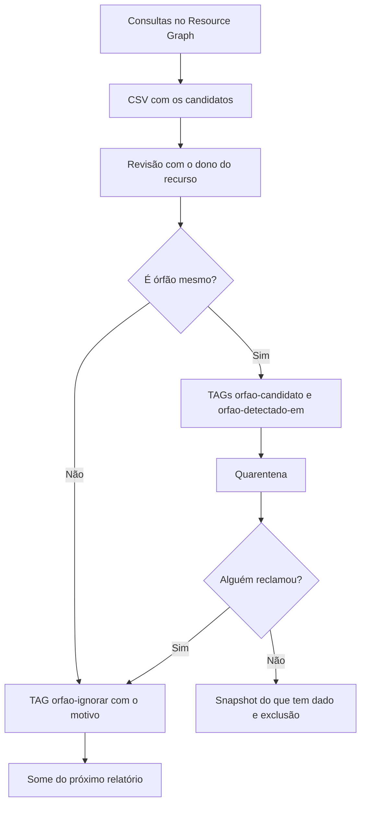

Fala pessoALL! Bora fazer uma faxina?

No [artigo anterior](https://blog.ruizsolutions.online/posts/start-stop-vms-azure-managed-identity/) cuidamos da VM que fica ligada fora de hora. Hoje é o outro lado do desperdício: o que sobra na assinatura depois que a VM vai embora.

Excluir uma VM no Azure não apaga, necessariamente, o que estava pendurado nela. Depende de como ela foi criada: pelo CLI e pelo PowerShell o padrão é manter o disco de S.O., e no portal o destino de cada disco, da NIC e do IP público sai do que foi marcado na tela de criação. Isso é de propósito e eu concordo com a decisão, porque protege contra perda de dados em uma exclusão por engano. O efeito colateral é que o disco que ficou segue cobrando todo mês pelo tipo e pelo tamanho, com VM ou sem VM.

Some a isso snapshot tirado "só pra garantir" antes de uma mudança, IP público reservado para um teste que acabou, NSG de uma subnet que nem existe mais e App Service plan que ficou sem nenhum app.

O caminho mais comum para resolver é abrir a lista de discos no portal, filtrar pelo estado **Unattached**, selecionar tudo e clicar em **Delete**.

É exatamente aí que mora o perigo.

Nem todo disco sem VM é lixo, e exclusão de disco gerenciado não tem volta. Saber o que está solto o Resource Graph resolve rápido. Saber se alguém vai sentir falta, só o dono do recurso responde.

**Neste artigo, vamos montar um conjunto de consultas do Azure Resource Graph para achar discos não anexados, IPs públicos sem associação, NICs soltas, snapshots antigos, NSGs sem uso e App Service plans vazios, tratando os falsos positivos de cada um. Depois usaremos um script PowerShell que gera um CSV e marca os candidatos com TAG, sem apagar nada.**

> Este método acha recurso **sem associação**. Ele não acha recurso ocioso: VM desalocada há meses, banco sem conexão ou gateway sem tráfego são outro tipo de análise, que passa por métrica e pelo Azure Advisor.
{: .prompt-warning }

---

## Mas antes, o que é um recurso órfão?

É um recurso que só fazia sentido ligado a outro, e esse outro não existe mais ou nunca existiu. O disco sem VM é o exemplo clássico, mas a lista é maior:

| Recurso | Como fica órfão | Pesa na fatura? |
| --- | --- | --- |
| Disco gerenciado | VM excluída sem a opção de apagar os discos junto | Sim, pelo tipo e tamanho do disco |
| IP público | NIC, Load Balancer ou gateway removido e o IP ficou | Sim, IP estático cobra associado ou não |
| NIC | VM excluída e a interface ficou | Não tem cobrança direta, mas segura IP e polui o ambiente |
| Snapshot | Tirado antes de uma mudança e esquecido | Sim, armazenamento |
| NSG | Subnet ou NIC removida | O problema aqui é auditoria de segurança mais difícil |
| App Service plan | Apps movidos ou excluídos | Sim, plano pago cobra pelo SKU e pelas instâncias mesmo sem app |
| Load Balancer Standard | Backend pool vazio | Sim, mesmo ocioso |
| NAT Gateway | Sem subnet associada | Sim, por hora |

Nem tudo aí é dinheiro. NIC e NSG soltos entram na faxina porque, quanto mais resto existe no ambiente, mais difícil fica enxergar o que importa.

O processo que vamos construir é este:



Dá mais trabalho que selecionar tudo e apagar? Dá. Mas a outra opção é aposta.

---

## Por que eu não apago direto: os falsos positivos

Antes de rodar qualquer consulta, conheça quem aparece na lista sem ser lixo.

### Disco de VM desalocada

Não é órfão. Enquanto a VM existe, mesmo parada, o disco continua com a propriedade `managedBy` apontando para ela e com `diskState` igual a `Reserved`. Nenhuma consulta deste artigo traz esse disco.

### Disco do Azure Site Recovery

Esse tem `managedBy` vazio e está em uso. Na replicação entre regiões, o Site Recovery cria uma cópia de cada disco com o sufixo `-ASRReplica`, com estado `ActiveSAS` e uma TAG de prefixo `ASR-ReplicaDisk`. Na replicação de VMware e servidores físicos, os discos de recuperação têm o prefixo `asrseeddisk`. Para quem olha só o `managedBy`, são discos soltos.

Apagar um deles quebra a proteção de DR da máquina.

### Disco em upload ou exportação

O disco pode estar sem VM porque alguém está subindo um VHD (`ReadyToUpload`, `ActiveUpload`) ou exportando com uma SAS ativa (`ActiveSAS`).

### Disco de volume persistente do AKS

Quando a storage class usa a reclaim policy de reter, o disco continua existindo depois que o pod é excluído, e a própria Microsoft recomenda revisar esse armazenamento retido de tempos em tempos. Quem decide se aquele volume ainda serve é o time do cluster, então disco em resource group com nome começando por `MC_` pede uma pergunta antes de qualquer ação.

### IP público reservado de propósito

Um IP estático parado pode estar liberado no firewall de um parceiro ou apontado em um registro de DNS, esperando o recurso voltar. Quando o IP estático é excluído, o endereço é devolvido e não tem como pedir o mesmo de volta.

### Snapshot antigo

Idade sozinha não diz nada. O snapshot de 400 dias pode ser lixo ou pode ser a única cópia de um servidor que já foi desligado.

### Recurso criado por pipeline

NSG, plano ou Load Balancer vazio com dois dias de vida pode estar no meio de um deploy.

<!-- LUIZ: qual foi o falso positivo mais perigoso que você já encontrou em uma limpeza de recursos (descreva sem identificar o ambiente)? Um parágrafo curto aqui deixa a seção muito mais forte. -->

> Enquanto ninguém respondeu por um disco solto, ele é só candidato. Órfão ele vira depois da resposta do dono, nunca antes.
{: .prompt-danger }

---

## Pré-requisitos

* Uma assinatura do Azure para o laboratório;
* Permissão de **Contributor** nessa assinatura, para criar o resource group e os recursos de teste;
* Permissão de **Reader** no escopo que será consultado. O Resource Graph só devolve o que a sua conta enxerga;
* Permissão de **Tag Contributor** no mesmo escopo, se for marcar os candidatos. Essa role gerencia TAGs sem dar acesso ao recurso em si, e é a menor que resolve;
* **Cloud Shell**, ou uma estação com Azure CLI e PowerShell 7 com os módulos `Az.Accounts`, `Az.ResourceGraph` e `Az.Resources`.

Se o módulo do Resource Graph ainda não estiver instalado:

```powershell
Install-Module -Name Az.ResourceGraph -Repository PSGallery -Scope CurrentUser
```

No Azure CLI, o comando `az graph` vem da extensão `resource-graph`, que o próprio CLI oferece para instalar na primeira execução.

> Este laboratório gera custo, pequeno mas real: dois discos Standard de 4 GB, um snapshot, um IP público Standard e um App Service plan B1. Rode a limpeza do final do artigo no mesmo dia.
{: .prompt-info }

Se você ainda não tem intimidade com o Resource Graph Explorer e com a paginação, eu sugiro passar antes pelo artigo [Resource Graph na prática](https://blog.ruizsolutions.online/posts/azure-resource-graph-consultas-essenciais/). Aqui vou direto para as consultas.

---

## Mão na massa!

**Todos os arquivos deste laboratório estão no meu repositório: [Recursos Orfaos](https://github.com/lfrleite/Ruiz-Online/tree/main/Recursos%20Orfaos)**

### Passo 1 - Criar os órfãos de laboratório

Para testar as consultas sem depender do que existe no seu ambiente, vamos fabricar os órfãos: um disco que nunca foi anexado, um snapshot cujo disco de origem foi apagado, um IP público sem associação, uma NIC sem VM, um NSG sem subnet e um App Service plan pago e vazio.

No Cloud Shell (Bash), crie o arquivo `01-criar-lab-orfaos.sh` com o conteúdo abaixo, ou baixe do repositório:

```bash
#!/usr/bin/env bash
# Cria um conjunto de recursos "soltos" para testar as consultas de recursos orfaos.
# Uso: bash 01-criar-lab-orfaos.sh
# Requer: Azure CLI autenticado (az login) ou Cloud Shell.

set -euo pipefail

RG="rg-orfaos-lab-wus2-001"
LOCATION="westus2"

DISK_ORFAO="disk-orfaos-lab-wus2-001"
DISK_ORIGEM="disk-orfaos-lab-wus2-002"
SNAPSHOT="snap-orfaos-lab-wus2-001"
PIP="pip-orfaos-lab-wus2-001"
VNET="vnet-orfaos-lab-wus2-001"
SUBNET="snet-orfaos-lab-wus2-001"
NIC="nic-orfaos-lab-wus2-001"
NSG="nsg-orfaos-lab-wus2-001"
PLAN="asp-orfaos-lab-wus2-001"

if ! az account show --output none 2>/dev/null; then
  echo "Sem sessao ativa no Azure CLI. Rode 'az login' e tente de novo." >&2
  exit 1
fi

echo "Assinatura em uso: $(az account show --query name --output tsv)"

echo "[1/8] Resource group"
az group create --name "$RG" --location "$LOCATION" --output none

echo "[2/8] Disco que nunca foi anexado"
az disk create \
  --resource-group "$RG" \
  --name "$DISK_ORFAO" \
  --location "$LOCATION" \
  --size-gb 4 \
  --sku Standard_LRS \
  --output none

echo "[3/8] Disco de origem, snapshot incremental e remocao do disco"
az disk create \
  --resource-group "$RG" \
  --name "$DISK_ORIGEM" \
  --location "$LOCATION" \
  --size-gb 4 \
  --sku Standard_LRS \
  --output none

DISK_ORIGEM_ID=$(az disk show \
  --resource-group "$RG" \
  --name "$DISK_ORIGEM" \
  --query id \
  --output tsv)

az snapshot create \
  --resource-group "$RG" \
  --name "$SNAPSHOT" \
  --source "$DISK_ORIGEM_ID" \
  --incremental true \
  --output none

az disk delete \
  --resource-group "$RG" \
  --name "$DISK_ORIGEM" \
  --yes

echo "[4/8] IP publico sem associacao"
az network public-ip create \
  --resource-group "$RG" \
  --name "$PIP" \
  --location "$LOCATION" \
  --sku Standard \
  --allocation-method Static \
  --output none

echo "[5/8] VNet e subnet para a NIC"
az network vnet create \
  --resource-group "$RG" \
  --name "$VNET" \
  --location "$LOCATION" \
  --address-prefixes 10.251.0.0/16 \
  --subnet-name "$SUBNET" \
  --subnet-prefixes 10.251.1.0/24 \
  --output none

echo "[6/8] NIC sem VM"
az network nic create \
  --resource-group "$RG" \
  --name "$NIC" \
  --vnet-name "$VNET" \
  --subnet "$SUBNET" \
  --output none

echo "[7/8] NSG sem associacao"
az network nsg create \
  --resource-group "$RG" \
  --name "$NSG" \
  --location "$LOCATION" \
  --output none

echo "[8/8] App Service plan pago e vazio"
az appservice plan create \
  --resource-group "$RG" \
  --name "$PLAN" \
  --location "$LOCATION" \
  --sku B1 \
  --is-linux \
  --output none

echo
echo "Recursos criados em $RG:"
az resource list \
  --resource-group "$RG" \
  --query "[].{Nome:name, Tipo:type}" \
  --output table
```

Execute:

```bash
bash 01-criar-lab-orfaos.sh
```

<!-- PRINT 002: Cloud Shell com o final da execução do 01-criar-lab-orfaos.sh, mostrando os passos [1/8] a [8/8] e a tabela "Recursos criados em rg-orfaos-lab-wus2-001" -->
{: .shadow .rounded-10 }
<br>

Confira no portal o resource group `rg-orfaos-lab-wus2-001`. O disco `disk-orfaos-lab-wus2-002` não deve aparecer, porque o script o apaga logo depois de tirar o snapshot.

<!-- PRINT 003: Portal, resource group rg-orfaos-lab-wus2-001, aba Overview listando disco 001, snapshot, IP público, VNet, NIC, NSG e App Service plan -->
{: .shadow .rounded-10 }
<br>

---

### Passo 2 - Discos não anexados

Vamos começar pelo órfão mais conhecido.

1. No portal, pesquise por **Resource Graph Explorer**;
2. Em **Directory**, confira se o escopo inclui a assinatura do laboratório;
3. Cole a consulta abaixo na área **Query 1**;
4. Clique em **Run query**.

```kusto
// 01 - Discos gerenciados nao anexados
resources
| where type =~ 'microsoft.compute/disks'
| where isempty(managedBy)
| where tostring(properties.diskState) =~ 'Unattached'
| where tags !contains 'ASR-ReplicaDisk' and tags !contains 'asrseeddisk'
| where name !startswith 'asrseeddisk' and name !endswith '-ASRReplica'
| where isempty(tags['orfao-ignorar'])
| project id, name, resourceGroup, subscriptionId, location,
    detalhe = strcat('sku=', tostring(sku.name),
        '; tamanhoGB=', tostring(properties.diskSizeGB),
        '; criadoEm=', tostring(properties.timeCreated),
        '; desanexadoEm=', tostring(properties.LastOwnershipUpdateTime)),
    detectadoEm = tostring(tags['orfao-detectado-em'])
| order by id asc
```

<!-- PRINT 004: Resource Graph Explorer com a consulta 01 e a aba Results mostrando o disk-orfaos-lab-wus2-001, com as colunas detalhe e detectadoEm visíveis -->
{: .shadow .rounded-10 }
<br>

Os falsos positivos da seção anterior estão todos aqui:

* `isempty(managedBy)`: disco sem VM, o critério que a documentação oficial usa;
* `diskState =~ 'Unattached'`: tira o disco em upload e o disco com SAS ativa. Só fica o que o próprio Azure descreve como "não está em uso e pode ser anexado a uma VM";
* as duas linhas de `ASR`: excluem réplica e seed do Site Recovery, pela TAG e pelo nome;
* `orfao-ignorar`: a nossa válvula de escape, que explico no Passo 8.

Todas as consultas terminam com as mesmas sete colunas: `id`, `name`, `resourceGroup`, `subscriptionId`, `location`, `detalhe` e `detectadoEm`. É esse formato fixo que deixa o script do Passo 6 juntar tudo em um CSV só.

> No disco do laboratório, o campo `desanexadoEm` vem vazio. A propriedade `LastOwnershipUpdateTime` só é preenchida quando o estado do disco muda, e esse disco nunca foi anexado a nada. Em disco que já pertenceu a uma VM, ela mostra quando ele foi solto, e é a melhor pista de há quanto tempo está parado.
{: .prompt-tip }

Abra o disco no portal e compare. O campo **Disk state** precisa mostrar `Unattached` e **Managed by** fica em branco.

<!-- PRINT 005: Portal, disco disk-orfaos-lab-wus2-001, tela Overview com Disk state = Unattached em destaque -->
{: .shadow .rounded-10 }
<br>

> Se a consulta não trouxer um recurso que você acabou de criar, espere um pouco e rode de novo antes de mexer no KQL.
{: .prompt-info }

---

### Passo 3 - IPs públicos e NICs

Um IP público é considerado sem associação quando não tem `ipConfiguration` (não está em NIC, Load Balancer, gateway, firewall ou Bastion) e não tem `natGateway`.

```kusto
// 02 - IPs publicos sem associacao
resources
| where type =~ 'microsoft.network/publicipaddresses'
| where isempty(properties.ipConfiguration) and isempty(properties.natGateway)
| where isempty(tags['orfao-ignorar'])
| project id, name, resourceGroup, subscriptionId, location,
    detalhe = strcat('sku=', tostring(sku.name),
        '; alocacao=', tostring(properties.publicIPAllocationMethod),
        '; ip=', tostring(properties.ipAddress)),
    detectadoEm = tostring(tags['orfao-detectado-em'])
| order by id asc
```

<!-- PRINT 006: Resource Graph Explorer com a consulta 02 e o pip-orfaos-lab-wus2-001 no resultado, coluna detalhe mostrando sku=Standard; alocacao=Static -->
{: .shadow .rounded-10 }
<br>

A coluna `detalhe` traz o endereço. Antes de liberar um IP, eu sugiro procurar esse endereço nas zonas de DNS e perguntar para quem cuida de firewall. IP público do SKU Standard é sempre estático, então todo IP Standard parado está cobrando.

Agora as NICs. A consulta descarta as que pertencem a uma VM e as que foram criadas por um Private Endpoint:

```kusto
// 03 - NICs sem VM e sem Private Endpoint
resources
| where type =~ 'microsoft.network/networkinterfaces'
| where isnull(properties.virtualMachine) and isnull(properties.privateEndpoint)
| where isempty(tags['orfao-ignorar'])
| project id, name, resourceGroup, subscriptionId, location,
    detalhe = strcat('ipPrivado=', tostring(properties.ipConfigurations[0].properties.privateIPAddress),
        '; temIpPublico=', iff(tostring(properties.ipConfigurations) contains 'publicIPAddress', 'sim', 'nao')),
    detectadoEm = tostring(tags['orfao-detectado-em'])
| order by id asc
```

<!-- PRINT 007: Resource Graph Explorer com a consulta 03 e a nic-orfaos-lab-wus2-001 no resultado, coluna detalhe mostrando ipPrivado e temIpPublico=nao -->
{: .shadow .rounded-10 }
<br>

Preste atenção no `temIpPublico`. Um IP público preso a uma NIC solta **não aparece** na consulta 02, porque está associado a alguma coisa. Quando o campo vier `sim`, você achou dois órfãos de uma vez, e um deles custa dinheiro.

---

### Passo 4 - Snapshots

Aqui são duas consultas, porque são duas perguntas diferentes.

A primeira é por idade. O corte de 30 dias é o mesmo das consultas de referência da Microsoft. Ajuste o `ago(30d)` para a retenção que a sua empresa definiu.

```kusto
// 04 - Snapshots com mais de 30 dias
resources
| where type =~ 'microsoft.compute/snapshots'
| where todatetime(properties.timeCreated) < ago(30d)
| where isempty(tags['orfao-ignorar'])
| project id, name, resourceGroup, subscriptionId, location,
    detalhe = strcat('criadoEm=', tostring(properties.timeCreated),
        '; incremental=', tostring(properties.incremental),
        '; tamanhoGB=', tostring(properties.diskSizeGB),
        '; sku=', tostring(sku.name),
        '; origem=', tostring(properties.creationData.sourceResourceId)),
    detectadoEm = tostring(tags['orfao-detectado-em'])
| order by id asc
```

No laboratório essa consulta volta vazia, e está certo: o snapshot tem minutos de vida. Se quiser ver funcionando, troque temporariamente `ago(30d)` por `ago(1m)`.

A segunda pergunta é mais interessante: quais snapshots apontam para um disco de origem que **não existe mais**?

```kusto
// 05 - Snapshots cujo disco de origem nao existe mais
resources
| where type =~ 'microsoft.compute/snapshots'
| where isempty(tags['orfao-ignorar'])
| extend origemId = tolower(tostring(properties.creationData.sourceResourceId))
| where origemId contains '/providers/microsoft.compute/disks/'
| project id, name, resourceGroup, subscriptionId, location, origemId,
    criadoEm = tostring(properties.timeCreated),
    detectadoEm = tostring(tags['orfao-detectado-em'])
| join kind=leftouter (
    resources
    | where type =~ 'microsoft.compute/disks'
    | project origemId = tolower(id), discoId = id
  ) on origemId
| where isempty(discoId)
| project id, name, resourceGroup, subscriptionId, location,
    detalhe = strcat('criadoEm=', criadoEm, '; origemRemovida=', origemId),
    detectadoEm
| order by id asc
```

<!-- PRINT 008: Resource Graph Explorer com a consulta 05 e o snap-orfaos-lab-wus2-001 no resultado, coluna detalhe mostrando origemRemovida com o ID do disk-orfaos-lab-wus2-002 -->
{: .shadow .rounded-10 }
<br>

> A consulta compara o `sourceResourceId` de cada snapshot com a lista de discos, e o `join` só enxerga os discos do escopo consultado. Se o disco de origem estiver em uma assinatura que ficou fora da consulta, o snapshot aparece como "origem removida" sem ser. Rode sempre com o escopo completo.
{: .prompt-warning }

Quem criou snapshot seguindo o artigo [Criando snapshot de VMs através de TAGs](https://blog.ruizsolutions.online/posts/criando-snapshot-de-vms-atraves-de-tags/) tem a vantagem de já ter o chamado, o solicitante e a data de exclusão gravados no próprio recurso. Snapshot sem nenhuma TAG é o que dá trabalho.

---

### Passo 5 - NSG, App Service plan e os outros

NSG que não está em nenhuma subnet e em nenhuma NIC:

```kusto
// 06 - NSGs sem subnet e sem NIC
resources
| where type =~ 'microsoft.network/networksecuritygroups'
| where isnull(properties.networkInterfaces) and isnull(properties.subnets)
| where isempty(tags['orfao-ignorar'])
| project id, name, resourceGroup, subscriptionId, location,
    detalhe = strcat('regrasCustomizadas=', tostring(array_length(properties.securityRules))),
    detectadoEm = tostring(tags['orfao-detectado-em'])
| order by id asc
```

<!-- PRINT 009: Resource Graph Explorer com a consulta 06 e o nsg-orfaos-lab-wus2-001 no resultado -->
{: .shadow .rounded-10 }
<br>

A coluna `detalhe` mostra quantas regras customizadas o NSG tem. NSG solto com quinze regras foi trabalho de alguém, e eu exportaria as regras antes de pensar em apagar.

App Service plan pago sem nenhum app:

```kusto
// 07 - App Service plans pagos sem nenhum app
resources
| where type =~ 'microsoft.web/serverfarms'
| where toint(properties.numberOfSites) == 0
| where sku.tier !~ 'Free'
| where isempty(tags['orfao-ignorar'])
| project id, name, resourceGroup, subscriptionId, location,
    detalhe = strcat('sku=', tostring(sku.name), '; tier=', tostring(sku.tier)),
    detectadoEm = tostring(tags['orfao-detectado-em'])
| order by id asc
```

<!-- PRINT 010: Resource Graph Explorer com a consulta 07 e o asp-orfaos-lab-wus2-001 no resultado, coluna detalhe mostrando sku=B1 -->
{: .shadow .rounded-10 }
<br>

O plano cobra pelo SKU e pela quantidade de instâncias, tenha app ou não.

Load Balancer Standard sem backend pool e NAT Gateway sem subnet fecham o conjunto. Não criamos nenhum dos dois, então aqui as consultas voltam vazias:

```kusto
// 08 - Load Balancers Standard sem backend pool
resources
| where type =~ 'microsoft.network/loadbalancers'
| where sku.name !~ 'Basic'
| where array_length(properties.backendAddressPools) == 0
| where isempty(tags['orfao-ignorar'])
| project id, name, resourceGroup, subscriptionId, location,
    detalhe = strcat('sku=', tostring(sku.name), '; tier=', tostring(sku.tier)),
    detectadoEm = tostring(tags['orfao-detectado-em'])
| order by id asc
```

```kusto
// 09 - NAT Gateways sem subnet associada
resources
| where type =~ 'microsoft.network/natgateways'
| where isnull(properties.subnets) or array_length(properties.subnets) == 0
| where isempty(tags['orfao-ignorar'])
| project id, name, resourceGroup, subscriptionId, location,
    detalhe = strcat('sku=', tostring(sku.name)),
    detectadoEm = tostring(tags['orfao-detectado-em'])
| order by id asc
```

> Precisa de outro tipo de recurso? Crie um novo arquivo `.kql` que devolva as mesmas sete colunas e coloque na pasta `consultas`. O script do próximo passo passa a executá-lo sem nenhuma alteração.
{: .prompt-tip }

---

### Passo 6 - Gerar o CSV com o script

Rodar nove consultas na mão e exportar uma por uma é castigo. O script `Find-RecursosOrfaos.ps1` lê todos os arquivos `.kql` da pasta `consultas`, executa cada um com paginação, junta o resultado em um CSV e mostra um resumo por categoria.

```powershell
#Requires -Version 7.0
#Requires -Modules Az.Accounts, Az.ResourceGraph, Az.Resources

<#
.SYNOPSIS
    Lista candidatos a recurso orfao com Azure Resource Graph, gera CSV e, se pedido, marca com TAG.

.DESCRIPTION
    Executa cada arquivo .kql da pasta de consultas, pagina o resultado, grava tudo em um CSV
    e mostra um resumo por categoria. Com -MarcarComTag, aplica as TAGs orfao-candidato,
    orfao-detectado-em e orfao-categoria nos recursos encontrados. O script nao apaga nada.

    Cada consulta precisa devolver as colunas:
    id, name, resourceGroup, subscriptionId, location, detalhe, detectadoEm

.PARAMETER PastaConsultas
    Pasta com os arquivos .kql. Padrao: subpasta "consultas" ao lado do script.

.PARAMETER SubscriptionId
    Uma ou mais assinaturas. Sem este parametro e sem -ManagementGroup, a consulta roda no tenant inteiro.

.PARAMETER ManagementGroup
    ID do management group usado como escopo.

.PARAMETER CaminhoCsv
    Caminho do CSV de saida. Padrao: recursos-orfaos-<data>.csv na pasta atual.

.PARAMETER MarcarComTag
    Aplica as TAGs nos candidatos. Aceita -WhatIf e -Confirm.

.EXAMPLE
    ./Find-RecursosOrfaos.ps1 -SubscriptionId '00000000-0000-0000-0000-000000000000'

.EXAMPLE
    ./Find-RecursosOrfaos.ps1 -ManagementGroup 'mg-lab' -MarcarComTag -WhatIf
#>

[CmdletBinding(SupportsShouldProcess = $true, ConfirmImpact = 'Medium')]
param(
    [string]$PastaConsultas = (Join-Path -Path $PSScriptRoot -ChildPath 'consultas'),

    [string[]]$SubscriptionId,

    [string]$ManagementGroup,

    [string]$CaminhoCsv = (Join-Path -Path (Get-Location) -ChildPath ('recursos-orfaos-{0:yyyyMMdd-HHmm}.csv' -f (Get-Date))),

    [switch]$MarcarComTag
)

Set-StrictMode -Version Latest
$ErrorActionPreference = 'Stop'

$colunasObrigatorias = @('id', 'name', 'resourceGroup', 'subscriptionId', 'location', 'detalhe', 'detectadoEm')
$tamanhoPagina = 1000

if ($SubscriptionId -and $ManagementGroup) {
    throw 'Informe -SubscriptionId ou -ManagementGroup, nao os dois.'
}

if (-not (Get-AzContext)) {
    throw 'Nenhuma sessao do Azure encontrada. Rode Connect-AzAccount e execute o script de novo.'
}

if (-not (Test-Path -Path $PastaConsultas -PathType Container)) {
    throw "Pasta de consultas nao encontrada: $PastaConsultas"
}

$arquivos = @(Get-ChildItem -Path $PastaConsultas -Filter '*.kql' -File | Sort-Object -Property Name)
if ($arquivos.Count -eq 0) {
    throw "Nenhum arquivo .kql em $PastaConsultas"
}

function Invoke-ConsultaPaginada {
    param(
        [Parameter(Mandatory)][string]$Consulta
    )

    $parametros = @{
        Query = $Consulta
        First = $tamanhoPagina
    }

    if ($ManagementGroup) {
        $parametros.ManagementGroup = $ManagementGroup
    }
    elseif ($SubscriptionId) {
        $parametros.Subscription = $SubscriptionId
    }
    else {
        $parametros.UseTenantScope = $true
    }

    $linhas = [System.Collections.Generic.List[object]]::new()

    do {
        $resposta = Search-AzGraph @parametros
        foreach ($linha in $resposta.Data) {
            $linhas.Add($linha)
        }
        $parametros.SkipToken = $resposta.SkipToken
    } while ($resposta.SkipToken)

    return $linhas
}

$achados = [System.Collections.Generic.List[object]]::new()
$falhas = 0

foreach ($arquivo in $arquivos) {
    $categoria = $arquivo.BaseName

    # Remove as linhas de comentario antes de enviar a consulta
    $consulta = (Get-Content -Path $arquivo.FullName |
        Where-Object { $_ -notmatch '^\s*//' }) -join "`n"

    try {
        $linhas = @(Invoke-ConsultaPaginada -Consulta $consulta)

        foreach ($linha in $linhas) {
            $faltando = @($colunasObrigatorias | Where-Object { $_ -notin $linha.PSObject.Properties.Name })
            if ($faltando.Count -gt 0) {
                throw "A consulta nao devolveu a(s) coluna(s): $($faltando -join ', ')"
            }

            $achados.Add([pscustomobject]@{
                    Categoria      = $categoria
                    Nome           = $linha.name
                    ResourceGroup  = $linha.resourceGroup
                    SubscriptionId = $linha.subscriptionId
                    Regiao         = $linha.location
                    Detalhe        = $linha.detalhe
                    DetectadoEm    = $linha.detectadoEm
                    Id             = $linha.id
                })
        }

        Write-Host ('{0,-45} {1,5} candidato(s)' -f $categoria, $linhas.Count)
    }
    catch {
        $falhas++
        Write-Warning "Falha na consulta '$categoria': $($_.Exception.Message)"
    }
}

if ($achados.Count -eq 0) {
    Write-Host 'Nenhum candidato encontrado no escopo consultado.'
}
else {
    # -WhatIf:$false: o relatorio e gravado mesmo no ensaio. O -WhatIf vale so para as TAGs.
    $achados | Export-Csv -Path $CaminhoCsv -NoTypeInformation -Encoding utf8BOM -WhatIf:$false
    Write-Host "CSV gravado em: $CaminhoCsv"
}

if ($MarcarComTag -and $achados.Count -gt 0) {
    $hoje = (Get-Date).ToString('yyyy-MM-dd')
    $marcados = 0
    $jaMarcados = 0
    $falhasDeTag = 0

    foreach ($grupo in ($achados | Group-Object -Property Id)) {
        $recursoId = $grupo.Name

        # Quem ja tem data de deteccao mantem a data original
        if ($grupo.Group[0].DetectadoEm) {
            $jaMarcados++
            continue
        }

        $tags = @{
            'orfao-candidato'    = 'true'
            'orfao-detectado-em' = $hoje
            'orfao-categoria'    = (($grupo.Group.Categoria | Sort-Object -Unique) -join '+')
        }

        if ($PSCmdlet.ShouldProcess($recursoId, 'Aplicar TAGs de candidato a orfao')) {
            try {
                Update-AzTag -ResourceId $recursoId -Tag $tags -Operation Merge | Out-Null
                $marcados++
            }
            catch {
                $falhasDeTag++
                Write-Warning "Nao foi possivel marcar $recursoId : $($_.Exception.Message)"
            }
        }
    }

    Write-Host "TAGs aplicadas: $marcados | ja marcados antes: $jaMarcados | falhas: $falhasDeTag"

    $falhas += $falhasDeTag
}

if ($falhas -gt 0) {
    Write-Warning "Execucao terminou com $falhas falha(s). Revise os avisos acima."
    exit 1
}
```

O que importa saber sobre ele:

1. O script não apaga nada. Não existe parâmetro de exclusão, e isso é proposital;
2. A paginação usa `-First 1000` e `-SkipToken`, porque o Resource Graph devolve no máximo 1.000 registros por chamada. Para o token de continuação existir, a consulta precisa manter a coluna `id` e não pode usar `limit` ou `take`;
3. O escopo é sempre explícito. Você informa `-SubscriptionId` ou `-ManagementGroup`, e sem nenhum dos dois ele consulta o tenant inteiro com `-UseTenantScope`;
4. O CSV é gravado mesmo quando você roda com `-WhatIf`. O ensaio vale só para as TAGs.

No Cloud Shell, troque para o PowerShell e suba a pasta do repositório mantendo a estrutura: o script na raiz e os nove arquivos dentro de `consultas`. Depois execute apontando para a assinatura do laboratório:

```powershell
$subscriptionId = (Get-AzContext).Subscription.Id

./Find-RecursosOrfaos.ps1 -SubscriptionId $subscriptionId
```

O resumo esperado tem este formato. Os números abaixo são um exemplo e consideram uma assinatura só com o laboratório, então os seus podem ser maiores:

```text
01-discos-nao-anexados                            1 candidato(s)
02-ips-publicos-sem-associacao                    1 candidato(s)
03-nics-soltas                                    1 candidato(s)
04-snapshots-antigos                              0 candidato(s)
05-snapshots-disco-origem-removido                1 candidato(s)
06-nsgs-sem-associacao                            1 candidato(s)
07-app-service-plans-vazios                       1 candidato(s)
08-load-balancers-sem-backend                     0 candidato(s)
09-nat-gateways-sem-subnet                        0 candidato(s)
CSV gravado em: /home/<usuario>/recursos-orfaos-<data>.csv
```

<!-- PRINT 011: Cloud Shell (PowerShell) com a execução do Find-RecursosOrfaos.ps1 e o resumo por categoria, terminando na linha "CSV gravado em" -->
{: .shadow .rounded-10 }
<br>

Baixe o CSV e abra em uma planilha:

<!-- PRINT 012: CSV aberto no Excel com as oito colunas e as seis linhas do laboratório (disco, IP público, NIC, snapshot, NSG e App Service plan) -->
{: .shadow .rounded-10 }
<br>

É esse arquivo que vai para a revisão com os donos dos recursos. Em ambiente real, eu ordeno por resource group, que normalmente indica o time responsável.

---

### Passo 7 - Marcar os candidatos com TAG

O CSV resolve a conversa de hoje. O problema é a conversa de daqui a um mês, quando ninguém lembra mais qual planilha era a válida.

Por isso o script também sabe marcar o próprio recurso. Com o parâmetro `-MarcarComTag`, cada candidato recebe três TAGs:

| TAG | Valor | Para que serve |
| --- | --- | --- |
| `orfao-candidato` | `true` | Filtro rápido no portal |
| `orfao-detectado-em` | Data da primeira detecção | Conta o tempo de quarentena |
| `orfao-categoria` | Nome do arquivo da consulta | Diz por qual critério o recurso entrou |

Primeiro, sempre, o ensaio. O `-WhatIf` mostra o que seria marcado sem alterar nada:

```powershell
./Find-RecursosOrfaos.ps1 -SubscriptionId $subscriptionId -MarcarComTag -WhatIf
```

<!-- PRINT 013: Cloud Shell com a saída do -WhatIf, uma linha de "What if" para cada um dos seis recursos do laboratório e a linha final "TAGs aplicadas: 0" -->
{: .shadow .rounded-10 }
<br>

Conferiu a lista? Agora de verdade:

```powershell
./Find-RecursosOrfaos.ps1 -SubscriptionId $subscriptionId -MarcarComTag
```

<!-- PRINT 014: Cloud Shell com a execução real, terminando na linha "TAGs aplicadas: 6 | ja marcados antes: 0 | falhas: 0" -->
{: .shadow .rounded-10 }
<br>

A marcação usa `Update-AzTag` com a operação `Merge`, que acrescenta as TAGs novas e preserva as que o recurso já tinha. Nada de `Replace`: trocar o conjunto inteiro de TAGs de um recurso alheio é um jeito rápido de arrumar inimizade.

Abra o disco no portal e confira em **Tags**:

<!-- PRINT 015: Portal, disco disk-orfaos-lab-wus2-001, tela Tags mostrando orfao-candidato, orfao-detectado-em e orfao-categoria -->
{: .shadow .rounded-10 }
<br>

Se você rodar de novo amanhã, quem já tem `orfao-detectado-em` **mantém a data original**. A quarentena conta a partir da primeira detecção, não da última execução. E um snapshot que cai em duas consultas recebe as duas categorias no mesmo valor, separadas por `+`.

Para ver tudo o que está marcado, de qualquer tipo, uma consulta curta resolve:

```kusto
resources
| where isnotempty(tags['orfao-candidato'])
| project name, type, resourceGroup,
    categoria = tostring(tags['orfao-categoria']),
    detectadoEm = tostring(tags['orfao-detectado-em'])
| order by type asc
```

<!-- PRINT 016: Resource Graph Explorer com a consulta acima listando os seis recursos marcados, com as colunas categoria e detectadoEm preenchidas -->
{: .shadow .rounded-10 }
<br>

---

### Passo 8 - Tratar as exceções com orfao-ignorar

Na revisão, o dono do IP público responde: "esse endereço está liberado no firewall de um parceiro, não pode sair".

Resposta legítima. Só que, se nada for feito, esse IP volta no relatório do mês que vem e alguém vai perguntar de novo.

A saída é registrar a decisão no próprio recurso. Todas as consultas têm a linha `where isempty(tags['orfao-ignorar'])`, então basta criar essa TAG com o motivo. No Cloud Shell (Bash):

```bash
PIP_ID=$(az resource show \
  --resource-group rg-orfaos-lab-wus2-001 \
  --name pip-orfaos-lab-wus2-001 \
  --resource-type Microsoft.Network/publicIPAddresses \
  --query id \
  --output tsv)

az tag update \
  --resource-id "$PIP_ID" \
  --operation Merge \
  --tags orfao-ignorar="IP liberado em firewall de parceiro"
```

Rode o script outra vez e o IP não aparece mais:

<!-- PRINT 017: Cloud Shell com nova execução do Find-RecursosOrfaos.ps1 mostrando 02-ips-publicos-sem-associacao com 0 candidato(s) -->
{: .shadow .rounded-10 }
<br>

O valor da TAG é texto livre. Eu sugiro colocar o motivo e o número do chamado, se houver. Exceção sem justificativa escrita vira órfão protegido, então liste de tempos em tempos quem tem `orfao-ignorar` e confirme se o motivo continua valendo.

---

### Passo 9 - Quarentena e exclusão

Chegamos na parte que todo mundo queria fazer no primeiro minuto.

Recurso marcado fica em quarentena. Passado o prazo sem ninguém reclamar, ele pode sair. A consulta abaixo lista quem foi detectado há mais de 30 dias e não ganhou exceção:

```kusto
// Candidatos marcados ha mais de 30 dias e que ninguem reclamou
// A TAG nao some quando o recurso volta a ser usado: cruze com o CSV do dia antes de excluir
resources
| where isnotempty(tags['orfao-detectado-em'])
| where isempty(tags['orfao-ignorar'])
| extend detectadoEm = todatetime(tags['orfao-detectado-em'])
| where detectadoEm < ago(30d)
| project id, name, type, resourceGroup, subscriptionId,
    categoria = tostring(tags['orfao-categoria']),
    detectadoEm
| order by detectadoEm asc
```

No laboratório ela volta vazia, porque acabamos de marcar tudo.

> A TAG não some sozinha quando o recurso volta a ser usado. Um disco marcado hoje e anexado a uma VM na semana que vem continua aparecendo nessa consulta. Antes de excluir, rode o script de novo: só segue para exclusão quem está com a quarentena vencida **e** continua saindo no CSV do dia.
{: .prompt-danger }

<!-- LUIZ: qual prazo de quarentena você costuma usar e quem aprova a exclusão (GMUD, dono do centro de custo, comitê)? Vale trocar o parágrafo abaixo pela sua prática. -->

O prazo é decisão de cada empresa. O que eu não oriento é quarentena menor que um ciclo de fechamento mensal, porque muita rotina só roda uma vez por mês e é justamente ela que vai procurar aquele disco.

Na hora de excluir, a ordem que eu sigo em ambiente real:

1. Para disco, tirar um snapshot antes e deixar o snapshot com data de expiração em TAG. Isso transforma uma exclusão sem volta em uma exclusão com volta;
2. Excluir dentro de uma mudança registrada, com a lista de IDs anexada;
3. Excluir por ID, a partir do CSV aprovado, e não por "tudo que a consulta trouxer hoje". O ambiente muda entre a aprovação e a execução.

Para a limpeza dos snapshots de segurança depois do prazo, o artigo [Removendo snapshots de forma automatizada](https://blog.ruizsolutions.online/posts/removendo-snapshots-de-forma-automatizada/) já cobre o caminho.

> De propósito, este artigo não entrega um script de exclusão em massa. A exclusão é a etapa mais simples de escrever e a única que não se desfaz.
{: .prompt-danger }

---

## E os workbooks prontos?

Você não é obrigado a manter consulta nenhuma. Existem duas alternativas visuais.

A primeira é o **Azure Orphaned Resources**, da comunidade. É um workbook do Azure Monitor mantido no GitHub, com licença MIT, e a própria documentação da Microsoft aponta para ele na página de custos do AKS. Cobre mais tipos de rede do que as nossas nove consultas, além de availability sets, route tables e resource groups vazios. Em compensação, a lista da versão 3.0 não inclui snapshots. A instalação é manual: em **Azure Workbooks**, criar um workbook novo, abrir o **Advanced Editor**, escolher o tipo **Gallery Template**, colar o conteúdo do arquivo `.workbook` do repositório (e não o `.json`), clicar em **Apply** e salvar. Ele também tem um botão para excluir os recursos selecionados, que vem desligado e precisa ser habilitado no painel de filtros.

<!-- PRINT 018: Workbook Azure Orphaned Resources aberto, aba Overview com a contagem de recursos órfãos por tipo no escopo do laboratório -->
{: .shadow .rounded-10 }
<br>

A segunda é o **Cost Optimization workbook**, do Azure Advisor. Fica na galeria de workbooks do Advisor, ainda marcado como preview na data deste artigo, e na aba **Usage Optimization** traz discos não anexados (já ignorando os do Site Recovery), snapshots com mais de 30 dias, snapshots com disco de origem excluído e IPs públicos sem associação. Ele tem uma coluna de **Quick Fix** que apaga o disco direto da tela.

Sendo bem sincero: é prático, e é exatamente o botão que eu não quero na mão de quem está olhando a lista pela primeira vez.

Quando usar o quê? Workbook para enxergar o tamanho do problema e apresentar para a gestão. Consulta e script quando você precisa de processo: CSV para revisão, TAG no recurso, exceção registrada e quarentena.

---

## Erros comuns

### A consulta volta vazia e eu sei que tem órfão

Comece pelo escopo. No Resource Graph Explorer, confira o seletor **Directory**. No script, confira o valor passado em `-SubscriptionId`. Para ver quais assinaturas a sua conta alcança:

```bash
az graph query -q "resources | summarize total = count() by subscriptionId"
```

Assinatura que não aparece nessa lista ou está vazia, ou é uma assinatura onde você não tem **Reader**.

### O script avisa que a consulta não devolveu uma coluna

Acontece quando você adiciona um `.kql` próprio e esquece alguma das sete colunas. A mensagem diz qual faltou, as demais categorias seguem e o script termina com código de saída 1.

### Falha ao aplicar TAG

Três causas para conferir, nesta ordem.

Falta de permissão. Confira as atribuições da conta:

```bash
az role assignment list \
  --assignee <usuario-ou-object-id> \
  --all \
  --output table
```

Lock do tipo **ReadOnly** no recurso, no resource group ou na assinatura. Esse lock bloqueia qualquer atualização, e TAG é atualização. Para listar os locks de um resource group:

```powershell
Get-AzResourceLock -ResourceGroupName rg-orfaos-lab-wus2-001
```

Limite de TAGs. Um recurso aceita no máximo 50, e o script precisa de três.

> Lock do tipo **CanNotDelete** não atrapalha a marcação. E é um ótimo sinal de que alguém já decidiu que aquele recurso deve ficar: antes de discutir se é órfão, descubra quem colocou o lock.
{: .prompt-tip }

### Recurso apareceu na lista e está em uso

É o falso positivo que as consultas não conhecem. Marque com `orfao-ignorar` e o motivo, como no Passo 8. Se o padrão se repetir em muitos recursos, vale mais acrescentar um filtro no `.kql` do que marcar um por um.

---

## Checklist

- [x] Passo 1 - Criar os recursos órfãos de laboratório com o `01-criar-lab-orfaos.sh`;
- [x] Passo 2 - Consultar discos não anexados e entender os filtros de `managedBy`, `diskState` e Site Recovery;
- [x] Passo 3 - Consultar IPs públicos sem associação e NICs soltas;
- [x] Passo 4 - Consultar snapshots por idade e por disco de origem removido;
- [x] Passo 5 - Consultar NSGs, App Service plans, Load Balancers e NAT Gateways sem uso;
- [x] Passo 6 - Gerar o CSV com o `Find-RecursosOrfaos.ps1`;
- [x] Passo 7 - Marcar os candidatos com TAG, primeiro com `-WhatIf`;
- [x] Passo 8 - Registrar exceções com a TAG `orfao-ignorar`;
- [x] Passo 9 - Definir a quarentena e a ordem de exclusão.

---

## Limpeza do ambiente

Aqui sim podemos apagar sem cerimônia, porque fomos nós que criamos tudo há poucos minutos:

```bash
az group delete \
  --name rg-orfaos-lab-wus2-001 \
  --yes \
  --no-wait
```

<!-- PRINT 019: Portal, lista de Resource groups filtrada por "orfaos" sem nenhum resultado, confirmando a exclusão do rg-orfaos-lab-wus2-001 -->
{: .shadow .rounded-10 }
<br>

Se você instalou o workbook da comunidade só para testar, exclua o workbook também.

> Em ambiente real, muito cuidado com esse comando. Ele remove tudo o que estiver dentro do resource group, órfão ou não.
{: .prompt-danger }

---

## Artigos

| Nome | Link |
| :---: | :---: |
| Arquivos deste laboratório | <https://github.com/lfrleite/Ruiz-Online/tree/main/Recursos%20Orfaos> |
| Localizar e excluir discos gerenciados e não gerenciados desanexados | <https://learn.microsoft.com/pt-br/azure/virtual-machines/windows/find-unattached-disks> |
| FinOps best practices for Storage | <https://learn.microsoft.com/en-us/cloud-computing/finops/best-practices/storage> |
| FinOps best practices for Networking | <https://learn.microsoft.com/en-us/cloud-computing/finops/best-practices/networking> |
| FinOps best practices for Web | <https://learn.microsoft.com/en-us/cloud-computing/finops/best-practices/web> |
| Disks - Get (propriedades e estados do disco) | <https://learn.microsoft.com/en-us/rest/api/compute/disks/get> |
| Delete a VM and attached resources | <https://learn.microsoft.com/en-us/azure/virtual-machines/delete> |
| Arquitetura de recuperação de desastre do Azure para o Azure | <https://learn.microsoft.com/pt-br/azure/site-recovery/azure-to-azure-architecture> |
| Public IP addresses | <https://learn.microsoft.com/en-us/azure/virtual-network/ip-services/public-ip-addresses> |
| Trabalhando com grandes conjuntos de dados de recurso do Azure | <https://learn.microsoft.com/pt-br/azure/governance/resource-graph/concepts/work-with-data> |
| Paginar os resultados da consulta do Resource Graph usando o Azure PowerShell | <https://learn.microsoft.com/pt-br/azure/governance/resource-graph/paginate-powershell> |
| Search-AzGraph | <https://learn.microsoft.com/en-us/powershell/module/az.resourcegraph/search-azgraph> |
| Update-AzTag | <https://learn.microsoft.com/en-us/powershell/module/az.resources/update-aztag> |
| Bloquear seus recursos do Azure para proteger sua infraestrutura | <https://learn.microsoft.com/pt-br/azure/azure-resource-manager/management/lock-resources> |
| Pasta de trabalho de Otimização de Custos (Azure Advisor) | <https://learn.microsoft.com/pt-br/azure/advisor/advisor-workbook-cost-optimization> |
| Understand Azure Kubernetes Service (AKS) usage and costs | <https://learn.microsoft.com/en-us/azure/aks/understand-aks-costs> |
| Azure Orphaned Resources (workbook da comunidade) | <https://github.com/dolevshor/azure-orphan-resources> |

---

## The End!

Chegamos ao fim de mais um laboratório.

Achar recurso solto é a parte fácil. O trabalho de verdade é descobrir de quem é, registrar a decisão e dar tempo para alguém reclamar.

Por isso o script marca e não apaga.

Uma TAG errada você corrige em um minuto. Um disco apagado errado você explica em uma reunião.

Minha sugestão é rodar esse relatório todo mês, e não uma vez por ano. Faxina mensal é pequena e ninguém se assusta. E para os recursos novos, marque a opção de excluir disco, NIC e IP junto com a VM já na criação, que aí o órfão nem chega a nascer.

No próximo artigo seguimos na série de custo, com um tema que costuma esconder dinheiro em ambiente Windows: o Azure Hybrid Benefit, onde está ligado e onde deveria estar.

Rodou as consultas no seu ambiente? Me conta lá no LinkedIn quantos candidatos apareceram e qual categoria ganhou. Eu aposto nos discos.

Obrigado por me acompanharem até aqui! Nos vemos na próxima!
