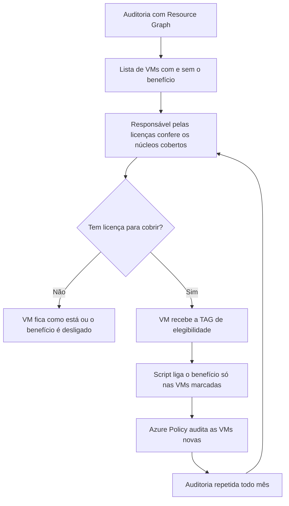

Fala pessoALL! Como estão as coisas por aí?

Seguindo na série de FinOps, hoje o assunto é um desconto que muita empresa já pagou e não usa: o **Azure Hybrid Benefit**.

A história costuma ser a mesma. A empresa tem licenças de Windows Server com Software Assurance, migra para o Azure, e as VMs vão sendo criadas por pessoas diferentes, em épocas diferentes. Na tela de criação existe um checkbox de licenciamento que ninguém marca porque ninguém sabe se pode marcar. A VM paga a licença do Windows embutida na hora de computação, e a licença que já estava comprada fica parada na gaveta.

O contrário também acontece, e esse é o lado que dá problema de verdade. Alguém descobre o checkbox, entende que "é só marcar que fica mais barato" e liga em tudo. Ninguém contou núcleo, ninguém falou com quem cuida das licenças.

Nos dois casos falta saber, com dado na mão, **onde o benefício está ligado e onde não está**. E abrir VM por VM no portal não é resposta para 300 máquinas.

<!-- LUIZ: em alguma auditoria que você já fez, qual era a proporção aproximada de VMs Windows sem o benefício ligado? Se puder contar de forma anonimizada (sem números absolutos do ambiente), entra aqui em uma ou duas frases. -->

**Neste artigo, vamos montar a auditoria do Azure Hybrid Benefit com Azure Resource Graph para Windows Server, SQL Server e Linux, ligar o benefício em uma VM e em lote com um script que só mexe no que foi marcado por TAG, e criar uma Azure Policy que audita toda VM Windows Server sem o benefício e que, se você quiser, passa a exigir a declaração na criação.**

> Este artigo não é consultoria de licenciamento. Eu mostro como enxergar e como aplicar. Se a sua empresa tem direito ao benefício, quantos núcleos estão cobertos e até quando, quem responde é a pessoa ou o parceiro que cuida das suas licenças, com os Product Terms do seu contrato na mão.
{: .prompt-warning }

---

## Mas antes, o que é o Azure Hybrid Benefit?

É o direito de usar no Azure uma licença que você já tem, pagando só a infraestrutura. Ele existe para três famílias de produto, e cada uma guarda a informação em um lugar diferente. Essa é a primeira pegadinha da auditoria.

### Windows Server

Vale para quem tem licenças por núcleo de Windows Server (Standard ou Datacenter) com **Software Assurance ativo** ou assinatura qualificada. Com o benefício ligado, a VM paga a tarifa base de computação, que é a mesma tarifa de uma VM Linux do mesmo tamanho.

Duas regras da documentação que mudam a conta:

* Cada VM consome no mínimo **8 licenças de núcleo**, mesmo que ela tenha 2 ou 4 vCPUs. Acima disso, vale o tamanho da VM: uma instância de 12 núcleos pede 12 licenças;
* Na edição **Standard**, a licença é usada on-premises ou no Azure, não nos dois ao mesmo tempo, salvo uma janela única de até 180 dias para migrar a mesma carga. Na **Datacenter** a regra de uso simultâneo é outra.

No recurso, o benefício é a propriedade `licenseType` da VM com o valor `Windows_Server`. Em Virtual Machine Scale Sets ela fica dentro do `virtualMachineProfile`.

> Trocar o `licenseType` não reinicia a VM e não interrompe o serviço. A documentação é explícita: a operação altera só um metadado de licenciamento.
{: .prompt-info }

### SQL Server

Aqui o benefício **não** fica na VM. Ele fica em outro recurso, o **SQL virtual machine** (`Microsoft.SqlVirtualMachine/sqlVirtualMachines`), que só existe quando a VM está registrada na extensão **SQL IaaS Agent**. A propriedade se chama `sqlServerLicenseType` e aceita `PAYG`, `AHUB` e `DR`.

Uma VM com SQL Server pode, portanto, ter dois benefícios independentes: o do Windows na VM e o do SQL no recurso de SQL. A troca só é suportada para as edições Standard e Enterprise, e também acontece sem reinício.

### Linux (RHEL e SLES)

Para Red Hat Enterprise Linux e SUSE Linux Enterprise Server o benefício troca o modelo da VM entre **PAYG** (software pago por hora, junto com a VM) e **BYOS** (assinatura comprada direto do fornecedor). A propriedade é a mesma `licenseType`. Os valores `RHEL_BYOS` e `SLES_BYOS` levam uma VM PAYG para BYOS.

O caminho contrário também existe, para VM criada com imagem BYOS ou trazida de fora, e usa outros valores: `RHEL_BASE`, `RHEL_EUS`, `RHEL_SAPAPPS`, `RHEL_SAPHA`, `RHEL_BASESAPAPPS` e `RHEL_BASESAPHA` para Red Hat, e `SLES`, `SLES_SAP` e `SLES_HPC` para SUSE. Se um deles aparecer na auditoria, aquela VM está pagando o software por hora.

A conversão de PAYG para BYOS só vale para imagens publicadas pela própria Red Hat ou pela própria SUSE. Para RHEL, a conta do Azure precisa estar no programa **Red Hat Cloud Access** antes de você tentar ligar, e a documentação pede a extensão `AHBForRHEL` instalada na VM para alternar o modelo. Para SUSE a extensão não é necessária. Ubuntu e Debian não entram nessa história.

### Onde olhar cada um

| Produto | Recurso | Propriedade | Valor com benefício |
| --- | --- | --- | --- |
| Windows Server | `Microsoft.Compute/virtualMachines` | `licenseType` | `Windows_Server` |
| SQL Server em VM | `Microsoft.SqlVirtualMachine/sqlVirtualMachines` | `sqlServerLicenseType` | `AHUB` |
| RHEL | `Microsoft.Compute/virtualMachines` | `licenseType` | `RHEL_BYOS` |
| SLES | `Microsoft.Compute/virtualMachines` | `licenseType` | `SLES_BYOS` |

> Você também vai encontrar `Windows_Client` no `licenseType`. Isso não é Azure Hybrid Benefit. É o Multitenant Hosting Rights do Windows 10 e 11, com regra de licenciamento própria. A auditoria separa esse valor para ele não entrar na conta errada.
{: .prompt-info }

O fluxo que eu sugiro é este:



---

## O risco de ligar sem ter a licença

O Azure **não valida** se você tem a licença. Marcar o checkbox ou gravar `Windows_Server` no `licenseType` é uma declaração sua. O portal aceita, nenhum alerta aparece, e a VM passa a ser cobrada pela tarifa reduzida.

A conferência vem depois. A documentação diz, com todas as letras, que a Microsoft se reserva o direito de auditar, a qualquer momento, quem usa o benefício para verificar a elegibilidade. E diz o que você precisa fazer quando o Software Assurance está para vencer: renovar, desligar o benefício ou desprovisionar as cargas.

Ter licença e não ligar é pagar duas vezes pela mesma coisa. Ligar sem ter, ou ligar em mais núcleos do que a empresa comprou, deixa de ser problema de custo e vira problema de conformidade.

O segundo é pior. Por isso eu não oriento ligar o benefício em massa só porque a consulta mostrou VM com ele desligado. A consulta mostra o que **pode** ser ligado. Quem diz o que **deve** ser ligado é o inventário de licenças.

<!-- LUIZ: você já encontrou ambiente com o benefício ligado em mais núcleos do que a empresa tinha de licença, ou com Software Assurance vencido e o benefício ainda ativo? Se sim, descreva em duas ou três frases como foi descoberto, sem identificar o ambiente. -->

---

## Pré-requisitos

* Uma assinatura do Azure para o laboratório;
* **Reader** nas assinaturas auditadas. Para ligar o benefício, **Virtual Machine Contributor**. Para criar e atribuir Policy, **Resource Policy Contributor**;
* Azure Cloud Shell, ou Azure CLI e PowerShell 7 com os módulos `Az.Accounts`, `Az.ResourceGraph` e `Az.Compute`;
* Para os passos 5, 6 e 7, licenças de Windows Server elegíveis que cubram as VMs do laboratório.

> O laboratório cria VMs `Standard_D2s_v5`, que cobram por hora enquanto alocadas, e discos, que cobram mesmo com a VM desligada. Faça a limpeza do final do artigo no mesmo dia.
{: .prompt-info }

> Do passo 5 em diante o laboratório grava `Windows_Server` no `licenseType`, e isso é a mesma declaração de licenciamento que eu acabei de descrever, mesmo em VM de teste que vive uma tarde. Se a sua assinatura de laboratório não tem cobertura de licença, crie as VMs, pare no passo 4 e acompanhe o resto pela leitura.
{: .prompt-danger }

<!-- LUIZ: em qual assinatura você vai tirar os prints dos passos 5 a 7? Confirme antes se ela tem cobertura de licença de Windows Server. Se não tiver, vale dizer isso no texto e trocar os prints desses passos por saídas com -WhatIf e pela policy em modo Audit. -->

---

## Mão na massa!

### Passo 1 - Criar o laboratório

Para a auditoria ter o que mostrar, vamos criar três VMs: uma Windows Server sem o benefício, uma já criada com ele e uma Ubuntu, que serve de controle e não pode aparecer na lista.

| Recurso | Nome |
| --- | --- |
| Resource Group | `rg-ahb-lab-wus2-001` |
| VM Windows sem o benefício | `vm-ahb-win-001` |
| VM Windows com o benefício | `vm-ahb-win-002` |
| VM Linux de controle | `vm-ahb-lnx-001` |

No Cloud Shell (Bash):

```bash
az group create \
  --name rg-ahb-lab-wus2-001 \
  --location westus2
```

Primeira VM, do jeito que a maioria nasce, sem nenhum parâmetro de licença:

```bash
az vm create \
  --resource-group rg-ahb-lab-wus2-001 \
  --name vm-ahb-win-001 \
  --location westus2 \
  --image MicrosoftWindowsServer:WindowsServer:2022-datacenter-azure-edition:latest \
  --size Standard_D2s_v5 \
  --admin-username azureuser \
  --public-ip-address ""
```

O CLI vai pedir a senha do administrador. Digite uma senha forte e guarde, não vamos colocar senha em linha de comando.

Segunda VM, agora com o benefício declarado na criação pelo parâmetro `--license-type`:

```bash
az vm create \
  --resource-group rg-ahb-lab-wus2-001 \
  --name vm-ahb-win-002 \
  --location westus2 \
  --image MicrosoftWindowsServer:WindowsServer:2022-datacenter-azure-edition:latest \
  --size Standard_D2s_v5 \
  --admin-username azureuser \
  --public-ip-address "" \
  --license-type Windows_Server
```

E a VM Linux de controle:

```bash
az vm create \
  --resource-group rg-ahb-lab-wus2-001 \
  --name vm-ahb-lnx-001 \
  --location westus2 \
  --image Canonical:ubuntu-24_04-lts:server:latest \
  --size Standard_D2s_v5 \
  --admin-username azureuser \
  --generate-ssh-keys \
  --public-ip-address ""
```

> As três VMs nascem sem IP público, por causa do `--public-ip-address ""`. Não vamos entrar em nenhuma delas. Tudo neste artigo acontece no plano de controle do Azure.
{: .prompt-tip }

Confira o resultado:

```bash
az vm list \
  --resource-group rg-ahb-lab-wus2-001 \
  --query "[].{Nome:name, SO:storageProfile.osDisk.osType, Licenca:licenseType}" \
  --output table
```

<!-- PRINT 002: Cloud Shell com a saída em tabela do az vm list mostrando as três VMs, a coluna SO e a coluna Licenca preenchida com Windows_Server apenas na vm-ahb-win-002 -->
{: .shadow .rounded-10 }
<br>

---

### Passo 2 - Conferir pelo portal

Antes de automatizar, vale saber onde a informação aparece na tela. São dois lugares.

Em uma VM específica:

1. Acesse a VM `vm-ahb-win-001`;
2. No menu da VM, clique em **Operating system**;
3. Localize a opção **Azure Hybrid Benefit**.

<!-- PRINT 003: Portal, VM vm-ahb-win-001, menu Operating system, com a opção Azure Hybrid Benefit visível e desabilitada -->
{: .shadow .rounded-10 }
<br>

Na lista de VMs:

1. Pesquise por **Virtual machines**;
2. Edite as colunas da lista e inclua **OS licensing benefit**.

A coluna mostra um de três estados: **Azure Hybrid Benefit for Windows**, **Not enabled** ou **Windows client with multi-tenant hosting**.

<!-- PRINT 004: Portal, lista Virtual machines filtrada pelo resource group rg-ahb-lab-wus2-001, com a coluna OS licensing benefit adicionada e os estados das três VMs visíveis -->
{: .shadow .rounded-10 }
<br>

Para três VMs resolve. Para dezenas de assinaturas, essa lista não cruza com SQL e não vira relatório recorrente. É aí que entra o Resource Graph.

---

### Passo 3 - Auditar as VMs Windows com Resource Graph

O básico do Resource Graph Explorer eu expliquei em [Resource Graph na prática](https://blog.ruizsolutions.online/posts/azure-resource-graph-consultas-essenciais/). Aqui vamos direto para a consulta.

**As consultas e os demais arquivos deste laboratório estão no meu repositório: [Azure Hybrid Benefit](https://github.com/lfrleite/Ruiz-Online/tree/main/Azure%20Hybrid%20Benefit)**

1. Pesquise por **Resource Graph Explorer**;
2. Cole a consulta abaixo, do arquivo `ahb-windows-auditoria.kql`, e execute.

```kusto
// Azure Hybrid Benefit - auditoria das VMs Windows
// Lista toda VM com disco de S.O. Windows e classifica pelo valor de licenseType.
// A coluna id precisa ficar no resultado para a paginacao funcionar.
resources
| where type =~ 'microsoft.compute/virtualmachines'
| where tostring(properties.storageProfile.osDisk.osType) =~ 'Windows'
| extend licenseType = tostring(properties.licenseType)
| extend publisher = tostring(properties.storageProfile.imageReference.publisher)
| extend offer = tostring(properties.storageProfile.imageReference.offer)
| extend sku = tostring(properties.storageProfile.imageReference.sku)
| extend situacao = case(
    licenseType =~ 'Windows_Server', 'AHB ligado',
    licenseType =~ 'Windows_Client', 'Windows client',
    isempty(licenseType) or licenseType =~ 'None', 'AHB desligado',
    strcat('Outro valor: ', licenseType))
| extend imagemCliente = publisher =~ 'MicrosoftWindowsDesktop'
| extend powerState = tostring(properties.extended.instanceView.powerState.code)
| project subscriptionId, resourceGroup, name, location,
    vmSize = tostring(properties.hardwareProfile.vmSize),
    publisher, offer, sku, imagemCliente, licenseType, situacao, powerState, tags, id
| order by situacao asc, name asc
```

<!-- PRINT 005: Resource Graph Explorer com a consulta ahb-windows-auditoria.kql e o resultado: vm-ahb-win-001 como AHB desligado, vm-ahb-win-002 como AHB ligado, e a VM Linux ausente da lista -->
{: .shadow .rounded-10 }
<br>

Três detalhes dessa consulta:

O filtro de S.O. usa `properties.storageProfile.osDisk.osType`, e não a imagem. VM criada a partir de imagem customizada ou de disco migrado não tem `publisher` nem `offer` preenchidos, mas o tipo do disco de S.O. está lá.

`licenseType` vazio e `None` significam a mesma coisa para a auditoria. VM que nunca teve o benefício fica com a propriedade vazia, e `None` é o valor que a documentação manda gravar para desligar.

A coluna `imagemCliente` marca as VMs cuja imagem veio do publisher `MicrosoftWindowsDesktop`, o do Windows 10 e 11. Essas não são candidatas a `Windows_Server`. E aqui mora um falso positivo: Windows client criado a partir de **imagem customizada** aparece como `AHB desligado`, porque o Resource Graph não sabe a edição do S.O. que está dentro do disco. Se o ambiente tem Windows 11, separe por resource group ou por TAG antes de levar a lista adiante.

Agora o resumo por assinatura, que é o número que vai para a conversa com quem cuida das licenças. Arquivo `ahb-windows-resumo.kql`:

```kusto
// Azure Hybrid Benefit - resumo por assinatura
// Conta as VMs Windows por assinatura e por valor de licenseType.
resources
| where type =~ 'microsoft.compute/virtualmachines'
| where tostring(properties.storageProfile.osDisk.osType) =~ 'Windows'
| extend licenseType = tostring(properties.licenseType)
| extend licenseType = iff(isempty(licenseType), '(vazio)', licenseType)
| summarize vms = count() by subscriptionId, licenseType
| order by subscriptionId asc, licenseType asc
```

<!-- PRINT 006: Resource Graph Explorer com a consulta ahb-windows-resumo.kql e o resultado agrupado por subscriptionId e licenseType, mostrando uma VM em (vazio) e uma em Windows_Server -->
{: .shadow .rounded-10 }
<br>

A mesma consulta roda pelo CLI. Clone o repositório no Cloud Shell para ter os arquivos na pasta atual. Na primeira execução, a extensão `resource-graph` é instalada sozinha:

```bash
git clone https://github.com/lfrleite/Ruiz-Online.git
cd "Ruiz-Online/Azure Hybrid Benefit"

az graph query -q "$(cat ahb-windows-resumo.kql)"
```

> O Resource Graph devolve no máximo 1.000 registros por chamada. Acima disso é preciso paginar com o skip token, e a resposta só traz o token se a coluna `id` estiver no resultado. Por isso as consultas de lista deste artigo projetam o `id`, e o script do Passo 6 já pagina. O botão **Download as CSV** do portal tem outro limite, de 55.000 registros.
{: .prompt-warning }

---

### Passo 4 - SQL Server e Linux na mesma auditoria

O laboratório não tem SQL Server nem RHEL, então aqui as consultas voltam vazias. Em ambiente real elas fazem parte do mesmo relatório.

SQL Server em VM, arquivo `ahb-sql-vm.kql`:

```kusto
// Azure Hybrid Benefit - SQL Server em VM
// So aparecem aqui as VMs registradas na extensao SQL IaaS Agent.
// sqlServerLicenseType: PAYG, AHUB ou DR.
resources
| where type =~ 'microsoft.sqlvirtualmachine/sqlvirtualmachines'
| project subscriptionId, resourceGroup, name, location,
    edicao = tostring(properties.sqlImageSku),
    oferta = tostring(properties.sqlImageOffer),
    licencaSql = tostring(properties.sqlServerLicenseType),
    vmId = tostring(properties.virtualMachineResourceId), id
| order by licencaSql asc, name asc
```

Preste atenção no que essa consulta **não** mostra. VM com SQL Server instalado na mão e nunca registrada na extensão SQL IaaS Agent não tem o recurso `sqlVirtualMachines`. Ela está rodando SQL e é invisível para a auditoria. Antes de confiar no relatório, confirme se o registro automático na extensão está habilitado nas assinaturas.

> Para SQL Server existe também o **centrally managed Azure Hybrid Benefit**, com licenças atribuídas por escopo em **Cost Management + Billing**. Com ele ativo, o tipo de licença deixa de ser alterável em cada VM e o recurso de SQL mostra **Centrally Managed**. Segundo a documentação, esse modelo não existe para Windows Server nem para quem compra Azure por um parceiro CSP.
{: .prompt-info }

RHEL e SLES, arquivo `ahb-linux-rhel-sles.kql`:

```kusto
// Azure Hybrid Benefit - Linux (RHEL e SLES)
// licenseType vazio significa que a VM segue o modelo de cobranca da imagem usada na criacao.
// RHEL_BYOS e SLES_BYOS indicam assinatura propria (BYOS).
// RHEL_BASE, RHEL_EUS, RHEL_SAPAPPS, RHEL_SAPHA, RHEL_BASESAPAPPS, RHEL_BASESAPHA, SLES, SLES_SAP e SLES_HPC
// indicam VM BYOS ou migrada que foi convertida para PAYG.
resources
| where type =~ 'microsoft.compute/virtualmachines'
| where tostring(properties.storageProfile.osDisk.osType) =~ 'Linux'
| extend licenseType = tostring(properties.licenseType)
| extend publisher = tostring(properties.storageProfile.imageReference.publisher)
| where publisher in~ ('RedHat', 'SUSE') or isnotempty(licenseType)
| project subscriptionId, resourceGroup, name, location, publisher,
    offer = tostring(properties.storageProfile.imageReference.offer),
    sku = tostring(properties.storageProfile.imageReference.sku),
    licenseType = iff(isempty(licenseType), '(vazio)', licenseType), id
| order by publisher asc, name asc
```

No Linux a leitura é diferente. `licenseType` vazio **não** quer dizer que a VM está pagando o software por hora. Quer dizer que ela segue o modelo da imagem com que foi criada. VM criada com imagem BYOS, ou trazida de fora por migração, já é BYOS com o campo vazio. Para RHEL e SLES, olhe `publisher`, `offer` e `sku` junto com o `licenseType` antes de concluir qualquer coisa.

---

### Passo 5 - Ligar o benefício em uma VM

Com a lista na mão e a confirmação de que existe licença, ligar é a parte fácil.

Pelo portal:

1. Acesse a VM `vm-ahb-win-001`;
2. Clique em **Operating system**;
3. Em **Azure Hybrid Benefit**, selecione **Enable**;
4. Se o portal pedir a confirmação de que você tem a licença, marque, e salve a alteração.

<!-- PRINT 007: Portal, VM vm-ahb-win-001, menu Operating system, com Azure Hybrid Benefit em Enable (e a confirmação de licença marcada, se o portal exibir), antes de salvar -->
{: .shadow .rounded-10 }
<br>

Pelo Cloud Shell:

```bash
az vm update \
  --resource-group rg-ahb-lab-wus2-001 \
  --name vm-ahb-win-001 \
  --license-type Windows_Server
```

Para conferir:

```bash
az vm get-instance-view \
  --resource-group rg-ahb-lab-wus2-001 \
  --name vm-ahb-win-001 \
  --query licenseType
```

O retorno esperado é `"Windows_Server"`.

<!-- PRINT 008: Cloud Shell com o az vm get-instance-view retornando "Windows_Server" para a vm-ahb-win-001 -->
{: .shadow .rounded-10 }
<br>

Para voltar ao pagamento por uso, o valor é `None` (a documentação de Linux escreve `NONE`, e vale para RHEL e SLES também). Rode agora, porque o próximo passo precisa da VM de volta ao estado original:

```bash
az vm update \
  --resource-group rg-ahb-lab-wus2-001 \
  --name vm-ahb-win-001 \
  --license-type None
```

Para SQL Server o comando é outro, porque o recurso é outro:

```bash
az sql vm update \
  --resource-group <RESOURCE_GROUP> \
  --name <NOME_DA_VM> \
  --license-type AHUB
```

E para RHEL ou SLES:

```bash
az vm update \
  --resource-group <RESOURCE_GROUP> \
  --name <NOME_DA_VM> \
  --license-type RHEL_BYOS
```

> No Linux, trocar o `licenseType` não encerra o trabalho. Depois da conversão para BYOS a VM precisa ser registrada na Red Hat ou na SUSE para continuar recebendo atualização. Se você parar no comando, a cobrança de software para e o patch também.
{: .prompt-danger }

---

### Passo 6 - Ligar em lote, com TAG e script

O CLI aceita vários IDs de uma vez. Para um resource group inteiro seria assim:

```bash
az vm update \
  --license-type Windows_Server \
  --ids $(az vm list \
    --resource-group rg-ahb-lab-wus2-001 \
    --query "[?storageProfile.osDisk.osType=='Windows'].id" \
    --output tsv)
```

Funciona. E é o tipo de comando que eu não rodaria em ambiente real.

Ele liga o benefício em tudo que é Windows naquele escopo, sem registro de quem aprovou e sem relação nenhuma com a quantidade de licenças. É o "marca o checkbox em tudo" em linha de comando.

Eu sugiro separar a decisão da execução. A decisão fica gravada na própria VM, em uma TAG, e a execução só olha a TAG. É a mesma lógica do artigo de [recursos órfãos](https://blog.ruizsolutions.online/posts/azure-recursos-orfaos-resource-graph/), onde o script marca em vez de apagar.

1. A auditoria gera o CSV com as VMs sem o benefício e a estimativa de núcleos;
2. O responsável pelas licenças devolve a lista do que está coberto;
3. As VMs cobertas recebem a TAG `ahb-elegivel` com o valor `sim`;
4. O script liga o benefício apenas nelas.

O arquivo `Invoke-AhbAuditoria.ps1` já veio no clone do repositório. Conteúdo:

```powershell
#Requires -Version 7.2
#Requires -Modules Az.Accounts, Az.ResourceGraph, Az.Compute

<#
.SYNOPSIS
    Audita o Azure Hybrid Benefit nas VMs Windows e, opcionalmente, liga o beneficio nas VMs marcadas por TAG.

.DESCRIPTION
    1. Consulta o Azure Resource Graph e lista toda VM com S.O. Windows e o valor de licenseType.
    2. Busca a quantidade de vCPUs de cada tamanho de VM e estima os nucleos de licenca (minimo de 8 por VM).
    3. Exporta o resultado em CSV.
    4. Com -Aplicar, liga o Azure Hybrid Benefit (licenseType = Windows_Server) somente nas VMs que
       estao com o beneficio desligado E possuem a TAG de elegibilidade com o valor esperado.

    O script nao decide elegibilidade. Quem decide e a pessoa responsavel pelas licencas, e a decisao
    chega ate aqui pela TAG.

.PARAMETER SubscriptionId
    Uma ou mais assinaturas. Sem este parametro a consulta usa o escopo do tenant.

.PARAMETER CsvPath
    Caminho do arquivo CSV de saida.

.PARAMETER Aplicar
    Liga o Azure Hybrid Benefit nas VMs elegiveis. Sem este parametro o script so audita.

.PARAMETER TagNome
    Nome da TAG que marca a VM como coberta por licenca. Padrao: ahb-elegivel.

.PARAMETER TagValor
    Valor esperado da TAG. Padrao: sim.

.EXAMPLE
    ./Invoke-AhbAuditoria.ps1 -SubscriptionId '00000000-0000-0000-0000-000000000000'

.EXAMPLE
    ./Invoke-AhbAuditoria.ps1 -SubscriptionId '00000000-0000-0000-0000-000000000000' -Aplicar -WhatIf

.EXAMPLE
    ./Invoke-AhbAuditoria.ps1 -SubscriptionId '00000000-0000-0000-0000-000000000000' -Aplicar
#>

[CmdletBinding(SupportsShouldProcess, ConfirmImpact = 'High')]
param(
    [string[]]$SubscriptionId,

    [string]$CsvPath = (Join-Path -Path (Get-Location) -ChildPath ("ahb-auditoria-{0}.csv" -f (Get-Date -Format 'yyyyMMdd-HHmm'))),

    [switch]$Aplicar,

    [ValidateNotNullOrEmpty()]
    [string]$TagNome = 'ahb-elegivel',

    [ValidateNotNullOrEmpty()]
    [string]$TagValor = 'sim'
)

Set-StrictMode -Version Latest
$ErrorActionPreference = 'Stop'

function Get-ValorDaTag {
    param($Tags, [string]$Nome)

    if ($null -eq $Tags) { return $null }

    # As TAGs chegam como dicionario (Get-AzVM) ou como objeto (Search-AzGraph). Trata os dois.
    if ($Tags -is [System.Collections.IDictionary]) {
        foreach ($chave in $Tags.Keys) {
            if ($chave -ieq $Nome) { return [string]$Tags[$chave] }
        }
        return $null
    }

    $propriedade = $Tags.PSObject.Properties | Where-Object { $_.Name -ieq $Nome } | Select-Object -First 1
    if ($null -eq $propriedade) { return $null }

    return [string]$propriedade.Value
}

# --- 1. Sessao -------------------------------------------------------------------------------
$contexto = Get-AzContext
if ($null -eq $contexto) {
    throw 'Nenhuma sessao do Azure encontrada. Execute Connect-AzAccount antes de rodar o script.'
}
Write-Host ("Conta: {0} | Tenant: {1}" -f $contexto.Account.Id, $contexto.Tenant.Id)

# --- 2. Consulta no Resource Graph, com paginacao ---------------------------------------------
$consulta = @"
resources
| where type =~ 'microsoft.compute/virtualmachines'
| where tostring(properties.storageProfile.osDisk.osType) =~ 'Windows'
| extend licenseType = tostring(properties.licenseType)
| extend publisher = tostring(properties.storageProfile.imageReference.publisher)
| project id, subscriptionId, resourceGroup, name, location,
    vmSize = tostring(properties.hardwareProfile.vmSize),
    publisher,
    offer = tostring(properties.storageProfile.imageReference.offer),
    sku = tostring(properties.storageProfile.imageReference.sku),
    licenseType,
    powerState = tostring(properties.extended.instanceView.powerState.code),
    tags
| order by id asc
"@

$linhas = [System.Collections.Generic.List[object]]::new()
$skipToken = $null

do {
    $parametros = @{
        Query = $consulta
        First = 1000
    }
    if ($SubscriptionId) { $parametros.Subscription = $SubscriptionId } else { $parametros.UseTenantScope = $true }
    if ($skipToken) { $parametros.SkipToken = $skipToken }

    try {
        $resposta = Search-AzGraph @parametros
    }
    catch {
        throw "Falha na consulta ao Resource Graph: $($_.Exception.Message)"
    }

    foreach ($item in $resposta.Data) { $linhas.Add($item) }
    $skipToken = $resposta.SkipToken
} while ($skipToken)

Write-Host ("VMs Windows encontradas: {0}" -f $linhas.Count)

if ($linhas.Count -eq 0) {
    Write-Warning 'Nenhuma VM Windows no escopo consultado. Nada a exportar.'
    return
}

# --- 3. vCPUs por tamanho de VM (uma chamada por regiao) --------------------------------------
$vcpusPorRegiao = @{}
foreach ($regiao in ($linhas | Select-Object -ExpandProperty location -Unique)) {
    $mapa = @{}
    try {
        Get-AzComputeResourceSku -Location $regiao |
            Where-Object { $_.ResourceType -eq 'virtualMachines' } |
            ForEach-Object {
                $capacidade = $_.Capabilities | Where-Object { $_.Name -eq 'vCPUs' } | Select-Object -First 1
                if ($null -ne $capacidade) { $mapa[$_.Name] = [int]$capacidade.Value }
            }
    }
    catch {
        Write-Warning ("Nao foi possivel ler os tamanhos de VM da regiao {0}: {1}" -f $regiao, $_.Exception.Message)
    }
    $vcpusPorRegiao[$regiao] = $mapa
}

# --- 4. Relatorio -----------------------------------------------------------------------------
$relatorio = foreach ($vm in $linhas) {
    # Forca string: licenseType ausente pode chegar como $null, e o switch nao casaria com o padrao vazio.
    $licenca = [string]$vm.licenseType

    $situacao = switch -Regex ($licenca) {
        '^Windows_Server$' { 'AHB ligado'; break }
        '^Windows_Client$' { 'Windows client'; break }
        '^(None)?$'        { 'AHB desligado'; break }
        default            { "Outro valor: $licenca" }
    }

    $vcpus = $null
    if ($vcpusPorRegiao.ContainsKey($vm.location) -and $vcpusPorRegiao[$vm.location].ContainsKey($vm.vmSize)) {
        $vcpus = $vcpusPorRegiao[$vm.location][$vm.vmSize]
    }

    $nucleosEstimados = $null
    if ($null -ne $vcpus) { $nucleosEstimados = [math]::Max(8, $vcpus) }

    $valorTag = Get-ValorDaTag -Tags $vm.tags -Nome $TagNome

    [pscustomobject]@{
        SubscriptionId   = $vm.subscriptionId
        ResourceGroup    = $vm.resourceGroup
        Nome             = $vm.name
        Regiao           = $vm.location
        Tamanho          = $vm.vmSize
        vCPUs            = $vcpus
        NucleosEstimados = $nucleosEstimados
        Publisher        = $vm.publisher
        Offer            = $vm.offer
        Sku              = $vm.sku
        ImagemCliente    = ($vm.publisher -ieq 'MicrosoftWindowsDesktop')
        LicenseType      = $licenca
        Situacao         = $situacao
        PowerState       = $vm.powerState
        TagElegibilidade = $valorTag
        Id               = $vm.id
    }
}

try {
    # -WhatIf:$false para o CSV ser gravado tambem quando o script roda com -Aplicar -WhatIf.
    $relatorio | Sort-Object Situacao, Nome | Export-Csv -Path $CsvPath -NoTypeInformation -Encoding utf8 -WhatIf:$false
    Write-Host ("CSV gravado em: {0}" -f $CsvPath)
}
catch {
    throw "Falha ao gravar o CSV em '$CsvPath': $($_.Exception.Message)"
}

$relatorio | Group-Object Situacao | Sort-Object Name | ForEach-Object {
    $nucleos = 0
    foreach ($linha in $_.Group) {
        if ($null -ne $linha.NucleosEstimados) { $nucleos += $linha.NucleosEstimados }
    }
    Write-Host ("{0,-16} VMs: {1,4} | nucleos estimados: {2}" -f $_.Name, $_.Count, $nucleos)
}

# --- 5. Aplicacao (opcional) ------------------------------------------------------------------
if (-not $Aplicar) {
    Write-Host 'Modo auditoria. Nenhuma VM foi alterada. Use -Aplicar para ligar o beneficio nas VMs marcadas com a TAG.'
    return
}

$candidatas = @($relatorio | Where-Object {
        $_.Situacao -eq 'AHB desligado' -and
        -not $_.ImagemCliente -and
        $_.TagElegibilidade -ieq $TagValor
    })

Write-Host ("VMs com AHB desligado e TAG {0}={1}: {2}" -f $TagNome, $TagValor, $candidatas.Count)

$alteradas = 0
$falhas = 0
$assinaturaAtual = (Get-AzContext).Subscription.Id

foreach ($candidata in $candidatas) {
    $alvo = "{0}/{1}" -f $candidata.ResourceGroup, $candidata.Nome

    if (-not $PSCmdlet.ShouldProcess($alvo, 'Definir licenseType = Windows_Server (Azure Hybrid Benefit)')) {
        continue
    }

    try {
        if ($assinaturaAtual -ne $candidata.SubscriptionId) {
            Set-AzContext -SubscriptionId $candidata.SubscriptionId | Out-Null
            $assinaturaAtual = $candidata.SubscriptionId
        }

        $objetoVm = Get-AzVM -ResourceGroupName $candidata.ResourceGroup -Name $candidata.Nome

        # O Resource Graph pode estar atrasado. A TAG e o licenseType sao conferidos de novo na propria VM.
        if ((Get-ValorDaTag -Tags $objetoVm.Tags -Nome $TagNome) -ine $TagValor) {
            Write-Warning ("PULADA {0}: a TAG {1}={2} nao esta mais na VM." -f $alvo, $TagNome, $TagValor)
            continue
        }
        if ($objetoVm.LicenseType -ieq 'Windows_Server') {
            Write-Host ("JA OK  {0}" -f $alvo)
            continue
        }

        $objetoVm.LicenseType = 'Windows_Server'
        Update-AzVM -ResourceGroupName $candidata.ResourceGroup -VM $objetoVm | Out-Null

        $alteradas++
        Write-Host ("OK     {0}" -f $alvo)
    }
    catch {
        $falhas++
        Write-Warning ("FALHA  {0}: {1}" -f $alvo, $_.Exception.Message)
    }
}

Write-Host ("Concluido. Alteradas: {0} | Falhas: {1} | Candidatas: {2}" -f $alteradas, $falhas, $candidatas.Count)

if ($falhas -gt 0) { exit 1 }
```

O script usa a sessão do seu `Connect-AzAccount`. Não tem credencial dentro dele.

A coluna `NucleosEstimados` aplica o mínimo de 8 por VM sobre a quantidade de vCPUs do tamanho. Uma `Standard_D2s_v5` tem 2 vCPUs e entra na conta como 8. É uma **estimativa** para abrir a conversa. A palavra final é dos Product Terms do seu contrato.

No Cloud Shell, troque para o PowerShell. A troca abre uma sessão nova, então volte para a pasta do repositório e rode primeiro só a auditoria:

```powershell
Set-Location "$HOME/Ruiz-Online/Azure Hybrid Benefit"

$subscriptionId = (Get-AzContext).Subscription.Id

./Invoke-AhbAuditoria.ps1 -SubscriptionId $subscriptionId
```

<!-- PRINT 009: Cloud Shell (PowerShell) com a saída do Invoke-AhbAuditoria.ps1 em modo auditoria: total de VMs Windows, caminho do CSV, o resumo por situação com núcleos estimados e a mensagem de que nenhuma VM foi alterada -->
{: .shadow .rounded-10 }
<br>

Agora marque a VM que "foi aprovada". No laboratório a aprovação é você mesmo. O Azure CLI funciona dentro do PowerShell do Cloud Shell, então não precisa trocar de shell:

```powershell
$vmId = az vm show --resource-group rg-ahb-lab-wus2-001 --name vm-ahb-win-001 --query id --output tsv

az tag update --resource-id $vmId --operation Merge --tags ahb-elegivel=sim
```

Rode o script com `-Aplicar` e `-WhatIf` para ver o que seria alterado, sem alterar:

```powershell
./Invoke-AhbAuditoria.ps1 -SubscriptionId $subscriptionId -Aplicar -WhatIf
```

<!-- PRINT 010: Cloud Shell (PowerShell) com a saída do script usando -Aplicar -WhatIf, mostrando a linha What if para rg-ahb-lab-wus2-001/vm-ahb-win-001 e o total de candidatas -->
{: .shadow .rounded-10 }
<br>

Se a lista está certa, rode para valer. O script pede confirmação VM por VM e, antes de alterar, confere de novo na própria VM se a TAG continua lá:

```powershell
./Invoke-AhbAuditoria.ps1 -SubscriptionId $subscriptionId -Aplicar
```

<!-- PRINT 011: Cloud Shell (PowerShell) com a execução real do script: o prompt de confirmação, a linha OK para a vm-ahb-win-001 e o resumo final com alteradas, falhas e candidatas -->
{: .shadow .rounded-10 }
<br>

> O Resource Graph não reflete uma alteração no mesmo segundo. Se a VM não aparecer como candidata logo depois de receber a TAG, espere um pouco e rode de novo.
{: .prompt-tip }

Volte ao Resource Graph Explorer e rode a consulta do Passo 3 outra vez. As duas VMs Windows precisam aparecer como `AHB ligado`.

<!-- PRINT 012: Resource Graph Explorer com a consulta ahb-windows-auditoria.kql executada de novo, as duas VMs Windows como AHB ligado e a TAG ahb-elegivel visível na coluna tags da vm-ahb-win-001 -->
{: .shadow .rounded-10 }
<br>

---

### Passo 7 - Azure Policy: auditar as VMs novas

O script resolve o legado. Sem uma Policy, a VM criada na semana que vem nasce sem o benefício e a auditoria do mês seguinte encontra o mesmo problema.

#### Antes de tudo, conferir o alias

A regra usa aliases do Azure Policy para ler propriedades da VM. O do `licenseType` é o `Microsoft.Compute/licenseType`, o mesmo que os exemplos de Hybrid Use Benefit do repositório oficial `Azure/azure-policy` usam. Ainda no PowerShell, confira se ele aparece na sua assinatura:

<!-- VALIDAR: rodar o comando abaixo no laboratório e confirmar que Microsoft.Compute/licenseType aparece na lista. Anotar o que vem na coluna Atributos e se existe também Microsoft.Compute/virtualMachines/licenseType. Se algum deles vier como Modifiable, dá para avaliar uma definição com efeito modify em uma revisão futura (o JSON removido está guardado em revisao/019.md). -->

```powershell
(Get-AzPolicyAlias -NamespaceMatch 'Microsoft.Compute').Aliases |
    Where-Object { $_.Name -like '*licenseType' } |
    Select-Object Name, @{ Name = 'Atributos'; Expression = { $_.DefaultMetadata.Attributes } }
```

<!-- PRINT 013: Cloud Shell (PowerShell) com a saída do Get-AzPolicyAlias listando os aliases terminados em licenseType, com Microsoft.Compute/licenseType visível e a coluna Atributos -->
{: .shadow .rounded-10 }
<br>

Você precisa ver `Microsoft.Compute/licenseType` na lista. Se ele não estiver lá, pare aqui, porque a definição do próximo bloco depende dele.

> A coluna **Atributos** mostra se o alias aceita o efeito `modify`, que alteraria a propriedade sozinho. Eu não encontrei, nem na documentação nem no repositório oficial, uma definição que grave o `licenseType` com `modify`. Os exemplos oficiais usam `deny`. Por isso este artigo fica na auditoria.
{: .prompt-info }

Sendo bem sincero, eu não sinto falta do `modify` aqui. Uma policy que grava `Windows_Server` em toda VM nova declara licença em nome da empresa sem ninguém ter contado núcleo. É o "marca o checkbox em tudo" do Passo 6, só que automático e para sempre.

#### A definição de auditoria

Volte para o Bash no Cloud Shell e entre de novo na pasta do repositório:

```bash
cd "$HOME/Ruiz-Online/Azure Hybrid Benefit"
```

Arquivo `policy-ahb-windows-audit.rules.json`:

```json
{
  "if": {
    "allOf": [
      {
        "field": "type",
        "equals": "Microsoft.Compute/virtualMachines"
      },
      {
        "anyOf": [
          {
            "field": "Microsoft.Compute/virtualMachines/storageProfile.osDisk.osType",
            "equals": "Windows"
          },
          {
            "field": "Microsoft.Compute/virtualMachines/storageProfile.imageReference.offer",
            "equals": "WindowsServer"
          }
        ]
      },
      {
        "field": "Microsoft.Compute/virtualMachines/storageProfile.imageReference.publisher",
        "notEquals": "MicrosoftWindowsDesktop"
      },
      {
        "field": "Microsoft.Compute/licenseType",
        "notIn": [
          "Windows_Server",
          "Windows_Client"
        ]
      }
    ]
  },
  "then": {
    "effect": "[parameters('effect')]"
  }
}
```

Arquivo `policy-ahb-windows-audit.params.json`:

```json
{
  "effect": {
    "type": "String",
    "metadata": {
      "displayName": "Effect",
      "description": "Audit apenas reporta. Deny bloqueia a criacao de VM Windows Server sem Azure Hybrid Benefit."
    },
    "allowedValues": [
      "Audit",
      "Deny",
      "Disabled"
    ],
    "defaultValue": "Audit"
  }
}
```

A regra reconhece Windows pelo tipo do disco de S.O. ou pela offer `WindowsServer` da imagem, exclui as imagens de Windows client e marca como não conforme toda VM cujo `licenseType` não seja `Windows_Server` nem `Windows_Client`. VM que nunca teve o benefício não tem a propriedade, e para a regra isso conta como "fora da lista".

Crie a definição e atribua no resource group do laboratório:

```bash
SUBSCRIPTION_ID=$(az account show --query id --output tsv)
SCOPE="/subscriptions/$SUBSCRIPTION_ID/resourceGroups/rg-ahb-lab-wus2-001"

az policy definition create \
  --name ahb-windows-audit \
  --display-name "VMs Windows Server devem usar Azure Hybrid Benefit" \
  --description "Audita ou nega VMs Windows Server sem licenseType Windows_Server." \
  --mode Indexed \
  --rules policy-ahb-windows-audit.rules.json \
  --params policy-ahb-windows-audit.params.json

az policy assignment create \
  --name ahb-windows-audit-lab \
  --display-name "Lab - VMs Windows Server devem usar Azure Hybrid Benefit" \
  --policy ahb-windows-audit \
  --scope "$SCOPE" \
  --params '{ "effect": { "value": "Audit" } }'
```

Para ter algo não conforme, crie uma terceira VM Windows sem o benefício, com o mesmo comando do Passo 1 e o nome `vm-ahb-win-003`. Depois dispare a avaliação:

```bash
az policy state trigger-scan --resource-group rg-ahb-lab-wus2-001
```

O comando fica esperando a avaliação terminar, e ela pode levar vários minutos mesmo em um laboratório pequeno. Não cancele.

1. Pesquise por **Policy**;
2. Clique em **Compliance**;
3. Abra a atribuição **Lab - VMs Windows Server devem usar Azure Hybrid Benefit**.

<!-- PRINT 014: Portal, Policy > Compliance, atribuição do laboratório aberta, com a vm-ahb-win-003 listada como Non-compliant e as outras duas VMs Windows como Compliant -->
{: .shadow .rounded-10 }
<br>

Essa lista é a auditoria do Passo 3 rodando sozinha. A VM não conforme entra no mesmo fluxo de antes: vai para quem cuida das licenças, recebe a TAG se estiver coberta, e o script liga.

#### E para exigir o benefício na criação?

O parâmetro `effect` também aceita `Deny`. Com ele, VM Windows Server sem `licenseType` igual a `Windows_Server` não é criada, e quem está criando precisa passar o `--license-type` do Passo 1 ou marcar o checkbox de licença no portal. É o mesmo desenho do exemplo `enforce-hybrid-use-benefit` do repositório oficial.

Eu não oriento usar em escopo amplo. Quem está criando a VM recebe um erro, e a saída mais rápida é marcar o checkbox. Você acabou de construir um mecanismo que empurra todo mundo a declarar licença sem saber se ela existe. Só faz sentido em uma assinatura ou resource group que o responsável pelas licenças já disse que está integralmente coberto, com folga para crescer.

Se quiser ver o erro que o colega vai receber, crie uma segunda atribuição com `Deny`:

<!-- VALIDAR: confirmar no laboratório que a criação da vm-ahb-win-004 sem --license-type é negada com RequestDisallowedByPolicy e quanto tempo a atribuição leva para valer. Conferir também o que o az vm create deixa para trás no resource group (NIC, NSG, VNet) quando a VM é negada. -->

```bash
az policy assignment create \
  --name ahb-windows-deny-lab \
  --display-name "Lab - Exigir Azure Hybrid Benefit em VMs Windows Server" \
  --policy ahb-windows-audit \
  --scope "$SCOPE" \
  --params '{ "effect": { "value": "Deny" } }'
```

Espere alguns minutos para a atribuição entrar em vigor e tente criar a `vm-ahb-win-004` com o comando do Passo 1, sem o `--license-type`. A criação precisa ser recusada com o código `RequestDisallowedByPolicy`, citando a atribuição.

<!-- PRINT 015: Cloud Shell com o az vm create da vm-ahb-win-004 sem --license-type sendo recusado, mostrando o código RequestDisallowedByPolicy e o nome da atribuição Lab - Exigir Azure Hybrid Benefit em VMs Windows Server -->
{: .shadow .rounded-10 }
<br>

Visto o erro, remova a atribuição para o laboratório voltar a ser só auditoria:

```bash
az policy assignment delete \
  --name ahb-windows-deny-lab \
  --scope "$SCOPE"
```

---

### Passo 8 - Conferir na fatura

O `licenseType` diz o que foi declarado. A prova de que a cobrança mudou está nos detalhes de uso, onde o campo **Additional Info** da VM passa a trazer o tipo de imagem `WindowsServerBYOL`:

```json
{"ImageType":"WindowsServerBYOL","ServiceType":"Standard_A1","VMName":"","UsageType":"ComputeHR"}
```

O exemplo é o da documentação, com o `ServiceType` dela.

A cobrança não é aplicada em tempo real. A documentação fala em um atraso de várias horas, então no laboratório você provavelmente vai apagar tudo antes de ver esse registro. Em ambiente real, eu sugiro conferir no fechamento do mês: conte as VMs com `WindowsServerBYOL` e compare com a lista do Resource Graph. Os dois números precisam bater.

---

## Erros comuns

### VM com SQL Server não aparece na consulta de SQL

A VM não está registrada na extensão SQL IaaS Agent. Sem o registro não existe o recurso `sqlVirtualMachines`, e tentar trocar a licença devolve um erro dizendo que o recurso `Microsoft.SqlVirtualMachine/SqlVirtualMachines` não foi encontrado.

Liste o que está registrado e compare com o seu inventário de servidores SQL:

```bash
az graph query -q "resources | where type =~ 'microsoft.sqlvirtualmachine/sqlvirtualmachines' | project name, resourceGroup, id"
```

---

### RHEL não aceita o benefício

A conta ainda não está no Red Hat Cloud Access, ou o registro não propagou da Red Hat para o Azure. A documentação manda abrir chamado se o erro continuar depois de um dia útil. Confira o valor atual:

```bash
az vm get-instance-view \
  --resource-group <RESOURCE_GROUP> \
  --name <NOME_DA_VM> \
  --query licenseType
```

Gravar `RHEL_BYOS` em uma VM SLES, ou o contrário, não atualiza nenhum metadado de cobrança.

---

### A policy não mostra nenhuma VM, ou mostra todas como conformes

Atribuição nova não é avaliada na hora, e VM criada depois da última avaliação ainda não entrou na conta. Dispare a avaliação e espere terminar:

```bash
az policy state trigger-scan --resource-group rg-ahb-lab-wus2-001
```

Se depois disso a atribuição continuar sem recurso nenhum, volte ao começo do Passo 7 e confira o nome do alias.

---

### Windows client de imagem customizada aparece como não conforme

É o mesmo falso positivo da consulta do Passo 3. A regra só exclui VM cuja imagem veio do publisher `MicrosoftWindowsDesktop`, e imagem customizada não tem publisher. Tire essas VMs do escopo ao atribuir, com o parâmetro `--not-scopes` do `az policy assignment create` apontando para o resource group delas, ou crie uma exemption.

---

## Checklist

- [x] Passo 1 - Criar o laboratório;
- [x] Passo 2 - Localizar o benefício no portal;
- [x] Passo 3 - Auditar as VMs Windows com Resource Graph;
- [x] Passo 4 - Incluir SQL Server e RHEL/SLES na auditoria;
- [x] Passo 5 - Ligar e desligar o benefício em uma VM;
- [x] Passo 6 - Marcar as VMs aprovadas com TAG e ligar em lote com o script;
- [x] Passo 7 - Conferir o alias e criar a policy de auditoria;
- [x] Passo 8 - Conferir o registro `WindowsServerBYOL` nos detalhes de uso.

---

## Limpeza do ambiente

Comece pela atribuição e pela definição de Policy. A definição mora na assinatura, não no resource group. Se a atribuição de `Deny` do Passo 7 ainda existir, remova também:

```bash
az policy assignment delete \
  --name ahb-windows-audit-lab \
  --scope "$SCOPE"

az policy definition delete --name ahb-windows-audit
```

Depois, o resource group com as VMs:

```bash
az group delete \
  --name rg-ahb-lab-wus2-001 \
  --yes \
  --no-wait
```

> Em ambiente real, muito cuidado com esse comando. Ele remove tudo dentro do Resource Group.
{: .prompt-danger }

---

## Artigos

| Nome | Link |
| :---: | :---: |
| Arquivos deste laboratório | <https://github.com/lfrleite/Ruiz-Online/tree/main/Azure%20Hybrid%20Benefit> |
| Resource Graph na prática: as consultas essenciais | <https://blog.ruizsolutions.online/posts/azure-resource-graph-consultas-essenciais/> |
| Caça aos recursos órfãos com Resource Graph | <https://blog.ruizsolutions.online/posts/azure-recursos-orfaos-resource-graph/> |
| Explore Azure Hybrid Benefit for Windows VMs | <https://learn.microsoft.com/en-us/azure/virtual-machines/windows/hybrid-use-benefit-licensing> |
| Azure Hybrid Benefit for Windows Server | <https://learn.microsoft.com/en-us/windows-server/get-started/azure-hybrid-benefit> |
| Azure Hybrid Benefit for Linux virtual machines | <https://learn.microsoft.com/en-us/azure/virtual-machines/linux/azure-hybrid-benefit-linux> |
| Change the license model for a SQL virtual machine in Azure | <https://learn.microsoft.com/en-us/azure/azure-sql/virtual-machines/windows/licensing-model-azure-hybrid-benefit-ahb-change?view=azuresql> |
| What is centrally managed Azure Hybrid Benefit for SQL Server? | <https://learn.microsoft.com/en-us/azure/cost-management-billing/scope-level/overview-azure-hybrid-benefit-scope> |
| Quickstart: Paginate Resource Graph query results using Azure PowerShell | <https://learn.microsoft.com/en-us/azure/governance/resource-graph/paginate-powershell> |
| az graph | <https://learn.microsoft.com/en-us/cli/azure/graph?view=azure-cli-latest> |
| Azure Policy definition structure aliases | <https://learn.microsoft.com/en-us/azure/governance/policy/concepts/definition-structure-alias> |
| Azure Policy definitions deny effect | <https://learn.microsoft.com/en-us/azure/governance/policy/concepts/effect-deny> |
| Get compliance data of Azure resources | <https://learn.microsoft.com/en-us/azure/governance/policy/how-to/get-compliance-data> |
| Azure Policy samples: enforce hybrid use benefit | <https://github.com/Azure/azure-policy/tree/master/samples/Compute/enforce-hybrid-use-benefit> |
| az policy definition | <https://learn.microsoft.com/en-us/cli/azure/policy/definition?view=azure-cli-latest> |
| az policy assignment | <https://learn.microsoft.com/en-us/cli/azure/policy/assignment?view=azure-cli-latest> |

---

## The End!

Chegamos ao fim de mais um artigo da série de FinOps.

O Azure Hybrid Benefit é a economia mais fácil de executar que eu conheço no Azure. É um campo de texto na VM. Não reinicia e não pede janela.

E é por ser fácil que ele dá errado.

A dificuldade nunca esteve no comando. Está em saber quantos núcleos a empresa tem direito de usar, quantos já estão em uso, e manter as duas contas batendo com VM nascendo e morrendo todo dia. A parte do Azure eu mostrei aqui. A outra é um inventário de licenças que alguém precisa manter, e essa pessoa precisa receber o seu relatório.

Se eu tivesse que deixar uma regra só: **ninguém liga o benefício sem que a VM esteja em uma lista aprovada por quem cuida das licenças**. O resto é automação em volta dessa regra.

No próximo artigo a conversa continua em FinOps, com a dúvida que aparece logo depois dessa: Reservations ou Savings Plan.

Espero que vocês tenham curtido tanto quanto eu curti de produzi-lo. Deixem seus comentários no meu Linkedin sobre o que você achou e se fez sentido!

Obrigado mais uma vez por me acompanharem até aqui! Nos vemos na próxima!
