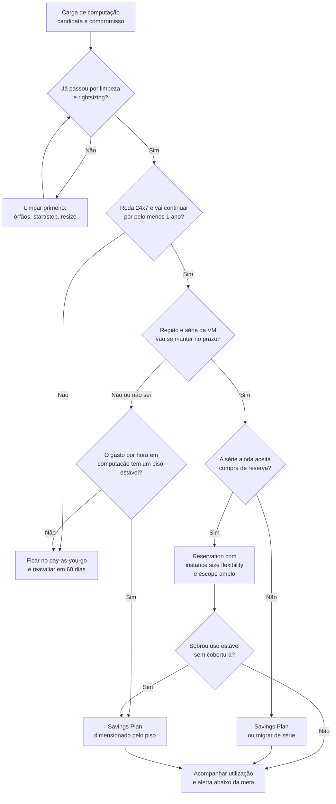

Fala pessoALL! Chegamos pra mais um conteúdo da série de FinOps!

Nos últimos artigos da série de FinOps a conversa foi sobre parar de pagar pelo que ninguém usa: [VM ligada fora do horário](https://blog.ruizsolutions.online/posts/start-stop-vms-azure-managed-identity/), [disco e IP público esquecidos](https://blog.ruizsolutions.online/posts/azure-recursos-orfaos-resource-graph/) e [licença de Windows paga duas vezes](https://blog.ruizsolutions.online/posts/azure-hybrid-benefit-auditoria/). Hoje o assunto é o que sobra depois dessa limpeza, ou seja, aquilo que roda 24 horas por dia e vai continuar rodando.

Para esse pedaço da fatura o Azure oferece dois descontos por compromisso: **Reservations** e **Savings Plan**. Nos dois você se compromete por um ou três anos e paga menos do que no pay-as-you-go. E a discussão costuma travar porque a pergunta vem errada.

A pergunta que costuma aparecer primeiro é "qual dos dois dá mais desconto?".

A pergunta certa é "o que eu tenho certeza de que não vai mudar nos próximos doze meses?".

Desconto de tabela não paga conta, desconto utilizado paga. Uma reserva de três anos comprada para uma série de VM que o time troca seis meses depois vira um boleto mensal por algo que não existe mais. E um savings plan dimensionado em cima de VM que deveria estar desligada só oficializa o desperdício.

**Neste artigo, vamos entender a diferença real entre Reservations e Savings Plan, o que cada um permite mudar depois da compra (escopo, tamanho de instância, troca e cancelamento), como ler as recomendações do Advisor e da tela de compra sem comprar nada, como acompanhar a utilização depois, e fechar com um roteiro de decisão que você pode aplicar no seu ambiente.**

> Este artigo não é conselho comercial nem de contrato. As regras de troca e cancelamento mudam, e uma mudança relevante entra em vigor em 1º de fevereiro de 2027. Antes de assinar qualquer compromisso, confira a política na documentação oficial no dia da compra e alinhe com quem responde pelo financeiro.
{: .prompt-warning }

---

## Mas antes, qual é a diferença real entre os dois?

Uma **Reservation** é um compromisso com um recurso específico. No caso de VM, você escolhe a região, o tamanho, a quantidade e o prazo. O desconto se aplica sozinho, hora a hora, a qualquer VM em execução que bata com esses atributos dentro do escopo. Você não "atribui" a reserva a uma VM.

Um **Savings Plan** é um compromisso com um valor gasto por hora em computação. O Azure aplica o preço com desconto a todo uso elegível até esse valor ser atingido, em qualquer região e em qualquer série de VM. O que passar do compromisso naquela hora é cobrado no pay-as-you-go.

Nos dois, a hora não aproveitada é perdida. A documentação usa o termo *use-it-or-lose-it*: sobra de uma hora não passa para a hora seguinte.

| Ponto | Reservation (VM) | Savings Plan for compute |
| --- | --- | --- |
| Com o que você se compromete | Região, tamanho de VM e quantidade | Valor por hora em computação |
| Prazo | 1 ou 3 anos | 1 ou 3 anos |
| Onde o desconto se aplica | VMs que batem com região e grupo de tamanho | Uso elegível de computação em qualquer região |
| Serviços | O tipo de recurso reservado | VMs, App Service, Functions Premium, Container Instances, Dedicated Host, Container Apps, entre outros |
| Mudar região ou série depois | Só com troca (exchange), enquanto a política permitir | Não precisa, o plano acompanha o uso |
| Cancelar | Reembolso com limite | Não cancela, não reembolsa |
| Renovação automática no momento da compra | Ligada por padrão | Desligada por padrão |
| Pagamento | À vista ou mensal, mesmo custo total | À vista ou mensal, mesmo custo total |

Sobre os percentuais: a documentação fala em economia de **até 72%** para reservas e **até 65%** para savings plan, sempre em relação ao pay-as-you-go. São tetos de catálogo. O desconto do savings plan varia por produto e por prazo, não pelo valor comprometido, e o número que vale para o seu ambiente é o que aparece na tela de compra e na calculadora de preços.

Tem detalhe nessa comparação que pouca gente lê antes de comprar.

Nenhum dos dois cobre licença. Em VM Windows o medidor é dividido em computação e licença do Windows Server, e a reserva só alcança a computação. O savings plan de computação também não cobre software, rede nem storage. Quem resolve a licença é o Azure Hybrid Benefit.

**Reserva de VM não reserva capacidade.** O nome engana. Um deploy pode falhar por falta de capacidade na região mesmo com a reserva comprada e a cota aprovada. Quem garante capacidade é outro recurso, o **On-demand capacity reservation**.

E quando você tem os dois, o Azure aplica primeiro a reserva e depois o savings plan, porque a reserva é mais restrita e costuma ter desconto maior. Isso permite a combinação que eu considero a mais saudável: reserva para a base que não muda, savings plan por cima para o que varia.

> Existe também o **Savings plan for databases**, para serviços como Azure SQL Database, SQL Managed Instance e Cosmos DB. Neste artigo vou ficar em computação.
{: .prompt-info }

---

## Flexibilidade de tamanho de instância

Esse é o recurso que deixa a reserva de VM menos rígida do que parece, e o nome dele é **instance size flexibility**.

Quando a reserva está otimizada para flexibilidade de tamanho, ela vale para todos os tamanhos do mesmo grupo de flexibilidade, e não só para o tamanho que você comprou. Cada tamanho tem uma **ratio**, que é o peso dele dentro do grupo.

Usando a série Ddsv5 como exemplo, com as ratios normalizadas que a documentação publica:

| Tamanho | Ratio normalizada |
| --- | :---: |
| `Standard_D2ds_v5` | 1 |
| `Standard_D4ds_v5` | 2 |
| `Standard_D8ds_v5` | 4 |
| `Standard_D16ds_v5` | 8 |

Uma reserva de quantidade 1 de `Standard_D8ds_v5` (ratio 4) cobre quatro VMs `Standard_D2ds_v5`, ou duas `Standard_D4ds_v5`, ou metade do custo de computação de uma `Standard_D16ds_v5`. O que ela não cobre é uma VM de outro grupo. A pegadinha clássica está aqui: séries com e sem suporte a premium storage são grupos diferentes. A documentação dá o exemplo de uma reserva de `Standard_D1` que não se aplica a `Standard_DS1`.

Na tela de compra existe a opção **Optimize for**, com duas escolhas:

* **Instance size flexibility**, que vem selecionada por padrão;
* **Capacity priority**, que prioriza capacidade de datacenter para os seus deploys e só está disponível quando o escopo é uma única assinatura.

Com capacity priority o desconto deixa de se espalhar pelo grupo. É uma das primeiras coisas que eu olharia em uma reserva subutilizada.

A lista de grupos e ratios era distribuída em um CSV, que deixou de receber atualização em 9 de maio de 2026 e teve a remoção anunciada para 30 de agosto de 2026. Hoje o caminho é a API de catálogo de reservas ou o PowerShell. Um exemplo curto, que só lista e não compra nada:

```powershell
# Requer o módulo Az.Reservations (Install-Module -Name Az.Reservations) e login prévio com Connect-AzAccount
$subscriptionId = (Get-AzContext).Subscription.Id

$catalogo = Get-AzReservationCatalog `
    -SubscriptionId $subscriptionId `
    -Location "westus2" `
    -ReservedResourceType "VirtualMachines"

$catalogo | ForEach-Object {
    $grupo = ($_.SkuProperties | Where-Object Name -eq "ReservationsAutofitGroup").Value
    $ratio = ($_.SkuProperties | Where-Object Name -eq "ReservationsAutofitRatio").Value
    if ($grupo -and $ratio) {
        [PSCustomObject]@{
            Grupo  = $grupo
            Sku    = $_.Name
            Ratio  = $ratio
        }
    }
} | Sort-Object Grupo, { [double]$_.Ratio } | Format-Table
```

<!-- PRINT 002: Cloud Shell (PowerShell) com a saída do Get-AzReservationCatalog filtrada, mostrando as colunas Grupo, Sku e Ratio para a série Ddsv5 em westus2 -->
{: .shadow .rounded-10 }
<br>

> As ratios que saem da API não começam necessariamente em 1. Na série Ddsv5, por exemplo, o menor tamanho vem com ratio 2. O que importa é a proporção entre os tamanhos do mesmo grupo. E elas podem variar por região, então consulte a região onde as VMs rodam.
{: .prompt-tip }

---

## Escopo: onde o desconto pode cair

Os dois produtos têm as mesmas quatro opções de escopo: um resource group, uma assinatura, um management group ou compartilhado (**Shared**), que alcança as assinaturas elegíveis do mesmo contexto de cobrança.

O Azure processa do mais restrito para o mais amplo, nessa ordem. E o escopo pode ser alterado depois da compra, em **Settings > Configuration**, sem virar uma nova transação e sem mexer no prazo.

Minha opinião: escopo restrito só se justifica por rateio, quando uma área pagou pelo compromisso e exige que o desconto fique com ela. Fora isso, escopo amplo diminui a chance de hora perdida.

---

## Troca e cancelamento: leia isso antes de comprar

Essa é a parte que mais mudou nos últimos anos e a que mais pesa na decisão. O que está abaixo é o que a documentação dizia quando escrevi este artigo.

### Reservations

A **troca** (exchange) funciona assim: você devolve uma ou mais reservas e compra outra do mesmo tipo, mudando região, série, tamanho, quantidade ou prazo. A reserva nova começa um prazo novo, e o compromisso total dela precisa ser igual ou maior que o saldo da reserva devolvida. Não há multa nem limite anual para trocas.

O **reembolso** (refund) existe, mas tem teto. A soma dos compromissos cancelados não pode passar de **USD 50.000 em uma janela móvel de 12 meses** por perfil de cobrança ou enrollment. O valor devolvido é calculado pelo menor preço entre o que você pagou e o preço atual da reserva, proporcional aos dias que faltam. A Microsoft informa que hoje não cobra taxa de encerramento antecipado, mas que pode passar a cobrar 12% no futuro, sem data definida.

Um detalhe que ajuda: o reembolso gerado por uma troca não consome esse limite de USD 50.000. Só o cancelamento puro consome.

Existe ainda o **trade-in**, que converte reservas de VM, Dedicated Host e App Service em savings plan de computação, e reservas de banco de dados em savings plan de banco de dados. O compromisso total do plano novo precisa ser igual ou maior que o saldo da reserva, e é uma via de mão única: savings plan não volta a ser reserva nem vira outro savings plan.

Planos Red Hat, SUSE e os pre-purchase ficam fora de troca e de reembolso.

E agora a mudança que eu citei no aviso lá em cima:

> A partir de **1º de fevereiro de 2027**, reservas compradas depois dessa data deixam de ser elegíveis para troca quando o serviço correspondente é coberto por savings plan. Isso inclui Azure Virtual Machines, Azure App Service e Azure SQL Database. Reservas compradas antes dessa data mantêm o direito a uma última troca. A política de cancelamento, o trade-in para savings plan e a flexibilidade de tamanho de instância não mudam.
{: .prompt-danger }

Ficam fora dessa mudança as reservas de serviços que savings plan não cobre e as de produtos descontinuados perto do fim da vida.

Traduzindo para a decisão: uma reserva de VM comprada de fevereiro de 2027 em diante só tem duas saídas se a carga mudar de série ou de região, o reembolso dentro do limite ou a conversão em savings plan. A troca por outra reserva, que era a rede de segurança de quem errava o tamanho, deixa de existir para esses serviços.

Tem outra mudança que já está valendo. Desde **1º de julho de 2026** não é mais possível comprar nem renovar reservas de um ano para as séries Av2, Amv2, Bv1, D, Ds, Dv2, Dsv2, F, Fs, Fsv2, G, Gs, Ls e Lsv2, nem reservas de um e de três anos para Dv3, Dsv3, Ev3 e Esv3. As existentes valem até o fim do prazo. Para essas séries, o caminho indicado pela Microsoft é savings plan ou migração para uma série mais nova.

### Savings Plan

Aqui a regra é curta: **não cancela, não troca e não reembolsa**. O que você pode alterar depois da compra é o escopo, a renovação automática e quem administra. Valor por hora, prazo e frequência de pagamento ficam como foram comprados.

A flexibilidade do savings plan está na aplicação do desconto. Na saída do compromisso ela é zero.

<!-- LUIZ: você já acompanhou uma reserva que ficou subutilizada porque a carga mudou de série ou de região? Como foi resolvido (troca, trade-in, mudança de escopo)? Contar de forma anonimizada, sem números do ambiente. -->

---

## O roteiro de decisão

Juntando tudo, esse é o fluxo que eu seguiria em ambiente real:



A sequência que a Microsoft recomenda vai na mesma linha: rightsizing, depois corrigir as reservas subutilizadas que já existem, e só então comprar reservas novas para a base estável e savings plan para o restante. A documentação tem uma frase que eu gosto: desconto reduz preço, não reduz desperdício.

---

## Pré-requisitos

Para acompanhar a parte prática você vai precisar de:

* Uma assinatura com VMs rodando há algumas semanas, de preferência 30 dias ou mais. As recomendações são calculadas em cima do histórico de uso;
* Para ver recomendações na tela de compra de reserva: role **Owner** ou **Reservation Purchaser** na assinatura. Role customizada que imita essas duas não serve, precisa ser a built-in;
* Para ver recomendações de savings plan: **Owner** ou **Savings plan purchaser** na assinatura, e a assinatura precisa ser de um contrato EA, MCA ou MPA. Assinatura pay-as-you-go antiga não compra savings plan;
* Para ver utilização: acesso RBAC na reserva ou no savings plan (Owner ou Reader), ou a role **Reservation reader** no tenant;
* Para criar alerta de utilização: papel no escopo de cobrança. Em conta MCA, billing profile owner, contributor, reader ou invoice manager. Em conta EA, enterprise admin, inclusive o de somente leitura;
* **Reader** na assinatura para abrir o Azure Advisor.

> Nada do que vamos fazer aqui gera custo. Vamos abrir as telas de compra para ler as recomendações e **parar antes do botão de confirmar**. Se você clicar em comprar, o compromisso é real e de um ou três anos.
{: .prompt-danger }

---

## Mão na massa!

### Passo 1 - Limpar antes de comprometer

As recomendações de compra são calculadas em cima do uso histórico. Se o histórico tem VM superdimensionada e VM de teste que ninguém desligou, a recomendação vai sugerir que você se comprometa com isso por três anos.

Antes de olhar qualquer recomendação, resolva o que os artigos anteriores da série trataram:

1. Recursos órfãos removidos ou marcados;
2. VMs de ambientes não produtivos com horário de start/stop;
3. Recomendações de **resize** e **shutdown** do Advisor avaliadas, aplicadas ou descartadas com justificativa.

Para o item 3, acesse o **Advisor** e abra a categoria **Cost**.

<!-- PRINT 003: Azure Advisor, categoria Cost, lista de recomendações mostrando as de right-size/shutdown de VMs e as de compra de reserva e savings plan na mesma tela -->
{: .shadow .rounded-10 }
<br>

> As recomendações de rightsizing do Advisor não levam em conta reservas e savings plans já comprados. A documentação avisa que, em recomendações que trocam de série, o custo pode até aumentar se você tiver reserva para a série atual. Por isso a ordem importa: rightsizing antes da compra, não depois.
{: .prompt-warning }

Depois de mexer no ambiente, espere o histórico refletir a mudança.

---

### Passo 2 - Separar a base estável do que varia

Agora a pergunta é: quanto do meu uso de VM é realmente constante?

A orientação da documentação para analisar o arquivo de uso é objetiva:

* Filtrar `MeterCategory` igual a `Virtual Machines`;
* Pegar o tamanho real da VM no campo `ServiceType` dentro de `AdditionalInfo`, e não nos campos de subcategoria do medidor ou de produto, que não diferenciam tamanhos com e sem premium storage;
* Usar `ResourceLocation` para a região;
* **Ignorar recursos com menos de 24 horas de uso no dia.**

Esse último ponto resume a lógica da reserva: VM que desliga à noite não é candidata.

O resultado desse passo é uma lista simples, por região e por grupo de tamanho, de quantas VMs ficam ligadas o dia inteiro, todos os dias. Essa é a base.

<!-- PRINT 004: Cost Management > Cost analysis no escopo da assinatura, com filtro para mostrar só o serviço Virtual Machines, Granularity Daily nos últimos 30 dias, mostrando a linha de custo diário estável -->
{: .shadow .rounded-10 }
<br>

---

### Passo 3 - Ler a recomendação de Reservation

1. No portal, pesquise por **Reservations**;
2. Clique em **Add**;
3. Selecione **Virtual machine**;
4. Escolha o **Scope** e a **Subscription** de cobrança;
5. Abra a aba **Recommended**.

<!-- PRINT 005: Tela Reservations > Add > Virtual machine, aba Recommended, com a lista de tamanhos recomendados e a coluna Recommended Quantity visível -->
{: .shadow .rounded-10 }
<br>

O que você precisa saber para ler essa tela:

O cálculo usa o uso hora a hora dos últimos **7, 30 e 60 dias**, simula o custo com e sem reserva para cada quantidade, e recomenda a quantidade que maximiza a economia. Se o seu uso normal é de 50 VMs com picos de 70, a recomendação tende a ficar nas 50.

A recomendação é feita **por tamanho individual, não por grupo de flexibilidade**. Então você pode ver três linhas separadas para D2ds_v5, D4ds_v5 e D8ds_v5 quando, na prática, uma única compra bem calculada pelas ratios cobriria as três. Existe na tela a opção **Optimize for instance size flexibility (preview)**, que agrupa as recomendações por grupo de flexibilidade.

Se as VMs são desligadas com regularidade, a simulação não encontra economia e **nenhuma recomendação aparece**. Não é erro.

A recomendação já desconta reservas e savings plans existentes.

6. Clique em **See details** em uma das linhas.

<!-- PRINT 006: Painel See details de uma recomendação de reserva, com o gráfico de uso ao longo do tempo, a quantidade recomendada, custo da reserva, economia estimada e percentual de utilização -->
{: .shadow .rounded-10 }
<br>

Esse painel mostra o gráfico de uso e deixa você mexer na quantidade. Aumente e a utilização cai, porque você passa a pagar por reserva ociosa. Diminua e a utilização sobe, mas parte do uso volta para o pay-as-you-go.

7. Feche a tela **sem** avançar para a compra.

> O Advisor também mostra recomendação de reserva, mas com duas limitações: só no escopo de uma assinatura e sempre calculada para o prazo de três anos, quando esse prazo existe para o serviço. Para ver por resource group ou para o escopo compartilhado, use a tela de compra. E hoje não há recomendação gerada para o escopo de management group.
{: .prompt-info }

---

### Passo 4 - Ler a recomendação de Savings Plan

1. No portal, pesquise por **Savings plans**;
2. Clique em **Add**;
3. Preencha os campos sem confirmar a compra:
   * **Billing subscription**: a assinatura que paga o plano;
   * **Savings plan**: `Compute`;
   * **Apply to any eligible resource**: o escopo;
   * **Term length**: um ou três anos;
   * **Hourly commitment in USD**: abra a lista de recomendações.

<!-- PRINT 007: Tela Savings plans > Add com os campos preenchidos e a lista de Hourly commitment aberta, mostrando para cada opção o valor por hora, o percentual de economia e o percentual de cobertura -->
{: .shadow .rounded-10 }
<br>

O portal traz até **10 recomendações** para cada combinação de prazo e escopo. Cada uma mostra o valor por hora, a economia estimada sobre o custo atual e o percentual do seu uso de computação que ficaria coberto, somando esse plano com reservas e planos que você já tem. A opção destacada é a de maior economia projetada.

O que muda em relação à reserva:

* Na tela de compra o histórico considerado é de **30 dias**;
* O mecanismo roda uma simulação extra só com os **últimos três dias** e entrega a menor das duas recomendações. É uma proteção contra recomendar compromisso em cima de recurso que você acabou de desligar;
* Subir o compromisso acima do recomendado derruba a utilização por hora. Descer deixa mais uso no pay-as-you-go. A lógica é a mesma da reserva.

Troque o **Term length** entre um e três anos e anote os dois valores.

<!-- PRINT 008: Mesma tela de Savings plans > Add com o Term length alterado para 3 anos, mostrando a nova lista de recomendações para comparação com o print anterior -->
{: .shadow .rounded-10 }
<br>

4. Feche a tela **sem** adicionar ao carrinho.

> Não compre reserva e savings plan no mesmo dia para a mesma carga. As recomendações de um não enxergam a compra do outro na hora. A documentação de reservas fala em esperar pelo menos 3 dias, a de savings plan fala em pelo menos 7, e recomendações de outros escopos podem levar até 25 dias para se ajustar. Eu sugiro ficar com o prazo mais longo: comprar a reserva, esperar as recomendações atualizarem e só então olhar o savings plan.
{: .prompt-warning }

---

### Passo 5 - Decidir prazo, pagamento e renovação

Com as duas recomendações na mão, volte ao fluxograma. Algumas decisões ainda ficam em aberto.

Três anos dá o desconto maior e a aposta maior. Eu só considero três anos para aquilo que consigo descrever sem usar a palavra "provavelmente". Para o resto, um ano.

À vista e mensal têm o mesmo custo total nos dois produtos, então a escolha é de fluxo de caixa. Depois da compra a frequência de pagamento não muda.

Na renovação automática os dois produtos se comportam ao contrário. Na reserva ela vem **ligada por padrão** na compra, no savings plan vem **desligada**. Reserva que renova sozinha para uma carga desativada é dinheiro jogado fora por mais um prazo inteiro. Savings plan que expira sem ninguém perceber devolve tudo para o pay-as-you-go de um dia para o outro. Os dois casos se resolvem do mesmo jeito: data de vencimento na agenda de alguém, com nome.

<!-- PRINT 009: Tela de uma reserva existente (ou da compra) em Renewal, mostrando a opção Automatically purchase a new reservation upon expiry -->
{: .shadow .rounded-10 }
<br>

<!-- LUIZ: qual critério você usa na prática para escolher entre 1 e 3 anos? Tem alguma regra de bolso (por exemplo, percentual máximo do gasto de computação em compromisso de 3 anos)? -->

---

### Passo 6 - Acompanhar a utilização depois da compra

Comprou? O trabalho começa agora.

#### Reservations

1. Pesquise por **Reservations**;
2. A lista mostra a coluna **Utilization (%)** com o último percentual conhecido de cada reserva;
3. Clique no percentual para abrir o histórico e os recursos que consumiram a reserva.

<!-- PRINT 010: Lista de Reservations com a coluna Utilization (%) visível e, se possível, o painel de histórico de utilização aberto para uma das reservas -->
{: .shadow .rounded-10 }
<br>

#### Savings plans

O caminho é o mesmo, pesquisando por **Savings plans**. A lista mostra a utilização do último dia e dos últimos sete dias, e o clique no percentual abre o histórico. Depois da compra, os dados podem levar até **48 horas** para aparecer.

#### Cost analysis com custo amortizado

Para explicar compromisso a quem não é técnico, a visão que eu acho mais clara é a de custo amortizado:

1. Acesse **Cost Management > Cost analysis** no escopo desejado;
2. Adicione o filtro **Pricing Model** com o valor `Reservation` ou `SavingsPlan`;
3. Troque a métrica para **Amortized cost**;
4. Em **Group by**, selecione **Resource**.

<!-- PRINT 011: Cost analysis com a métrica Amortized cost selecionada, filtro Pricing Model: Reservation e Group by Resource em modo tabela, destacando a linha de reserva não utilizada -->
{: .shadow .rounded-10 }
<br>

A documentação avisa que o Cost analysis não mostra custo amortizado de reserva em assinatura pay-as-you-go individual.

No custo amortizado a compra é distribuída pelos dias do prazo e atribuída aos recursos que usaram o benefício. A parte que ninguém usou aparece com o tipo de cobrança `UnusedReservation` ou `UnusedSavingsPlan`. É o desperdício do compromisso, em dinheiro.

#### Pela linha de comando

Para reservas, o Azure CLI tem um comando (ainda marcado como preview) que devolve o resumo de utilização por pedido de reserva:

```bash
az consumption reservation summary list \
  --grain monthly \
  --reservation-order-id <RESERVATION_ORDER_ID>
```

O `<RESERVATION_ORDER_ID>` aparece no portal, na tela da reserva, no campo **Reservation order ID**.

#### Alerta de utilização

Olhar a tela toda semana não escala. Crie um alerta:

1. Acesse **Cost Management + Billing** e selecione o escopo de cobrança;
2. Em **Cost Management**, clique em **Cost alerts**;
3. Clique em **+ Add**;
4. Em **Alert type**, selecione **Reservation utilization**;
5. Preencha:
   * **Utilization percentage**: o limite abaixo do qual o alerta dispara;
   * **Time grain**: `Last 7-days` ou `Last 30-days`;
   * **Start on**: a data em que a regra começa a valer;
   * **Sent**: `Daily`, `Weekly` ou `Monthly`;
   * **Until**: a data final da regra, no máximo três anos à frente;
   * **Recipients**: até 20 endereços de e-mail;
   * **Language**: o idioma do e-mail de alerta;
   * **Alert name**: por exemplo
   ```text
   alert-ri-utilization-lab-001
   ```
6. Clique em **Create**.

<!-- PRINT 012: Tela Create alert rule em Cost alerts com Alert type Reservation utilization e os campos Utilization percentage, Time grain, Start on, Sent, Until, Recipients, Language e Alert name preenchidos -->
{: .shadow .rounded-10 }
<br>

> Esse alerta é criado no escopo de cobrança e monitora todas as reservas daquele escopo, independente do escopo de benefício de cada uma. Ele não cobre os planos pre-purchase. Para savings plan eu não encontrei na documentação um alerta equivalente nessa mesma tela, então o acompanhamento fica por conta da lista de savings plans e do custo amortizado.
{: .prompt-info }

<!-- LUIZ: qual meta de utilização você considera aceitável para reserva e para savings plan antes de agir? E de quanto em quanto tempo revisa? -->

---

### Passo 7 - O que fazer quando a utilização cai

Reserva com utilização baixa tem uma ordem de tentativa, do mais barato para o mais caro:

1. Ampliar o escopo. Em **Settings > Configuration**, mude de assinatura única para **Shared**. Não é transação comercial e resolve boa parte dos casos;
2. Conferir o **Optimize for** na mesma tela e confirmar que está em instance size flexibility;
3. Conferir se as VMs continuam no grupo da reserva. Uma VM migrada para uma série mais nova saiu dele;
4. Trocar a quantidade ociosa por outra reserva, enquanto a política permitir para aquela reserva. Na tela de troca existe o preenchimento automático **Optimize for utilization (7-day)**, que sugere a quantidade a devolver com base nos últimos sete dias;
5. Converter em savings plan pelo trade-in, quando a carga ficou variável demais para reserva;
6. Pedir reembolso, por último, dentro do limite.

Para savings plan subutilizado só existe o primeiro item. Por isso eu sugiro dimensionar pelo piso do gasto por hora, e não pela média.

> No trade-in, o valor mínimo por hora que o portal propõe é só o saldo da reserva dividido pelas horas do novo prazo. Ele não foi calculado para cobrir as VMs que a reserva cobria. Para manter a mesma cobertura o compromisso provavelmente terá que ser maior, e essa conta se faz antes, na calculadora de preços.
{: .prompt-warning }

---

## Erros comuns

### A recomendação não aparece

As causas documentadas são VMs desligadas com frequência, caso em que a simulação não encontra economia, e tipo de assinatura não elegível. No savings plan, confirme o tipo de contrato da conta de cobrança. Depois de uma compra, as recomendações do Advisor podem levar até cinco dias para refletir.

### A reserva está com utilização baixa mesmo tendo VM do tamanho certo

Confira nesta ordem: o escopo da reserva alcança a assinatura onde a VM está? O **Optimize for** está em instance size flexibility? A VM é de uma série com premium storage e a reserva é da série sem, ou o contrário? O resumo por pedido ajuda a ver se o problema é constante ou pontual:

```bash
az consumption reservation summary list \
  --grain daily \
  --reservation-order-id <RESERVATION_ORDER_ID> \
  --start-date 2026-10-01 \
  --end-date 2026-10-07
```

### Utilização do savings plan acima de 100%

Não é erro de cálculo. A aplicação do benefício considera uso que chega até 48 horas depois da hora avaliada, e nessa janela os números podem oscilar, inclusive acima de 100%. Avalie utilização de savings plan sempre com pelo menos dois dias de atraso.

---

## Checklist

- [x] Passo 1 - Limpeza e rightsizing feitos antes de olhar qualquer recomendação de compra;
- [x] Passo 2 - Base estável identificada por região e grupo de tamanho, só com o que roda 24 horas por dia;
- [x] Passo 3 - Recomendação de Reservation lida na tela de compra, com o painel **See details**;
- [x] Passo 4 - Recomendação de Savings Plan lida para um e três anos;
- [x] Passo 5 - Prazo, pagamento e renovação automática decididos, com responsável pela data de vencimento;
- [x] Passo 6 - Utilização acompanhada no portal e no custo amortizado, com alerta de utilização criado;
- [x] Passo 7 - Plano de ação definido para utilização baixa, considerando a política de troca vigente.

---

## Limpeza do ambiente

Se você seguiu o artigo sem confirmar nenhuma compra, não há nada cobrando. O único recurso criado foi a regra de alerta de utilização. Se ela foi só um teste, remova em **Cost Management + Billing > Cost alerts > Alert rules**.

> Reserva comprada "só para testar" não se apaga com `az group delete`. A saída é o reembolso, dentro do limite. Savings plan comprado por engano não tem cancelamento.
{: .prompt-danger }

---

## Artigos

| Nome | Link |
| :---: | :---: |
| Start/Stop de VMs revisitado | <https://blog.ruizsolutions.online/posts/start-stop-vms-azure-managed-identity/> |
| Caça aos recursos órfãos | <https://blog.ruizsolutions.online/posts/azure-recursos-orfaos-resource-graph/> |
| Azure Hybrid Benefit: auditoria | <https://blog.ruizsolutions.online/posts/azure-hybrid-benefit-auditoria/> |
| Decidir entre um plano de economia e uma reserva | <https://learn.microsoft.com/pt-br/azure/cost-management-billing/savings-plan/decide-between-savings-plan-reservation> |
| What are Azure Reservations? | <https://learn.microsoft.com/en-us/azure/cost-management-billing/reservations/save-compute-costs-reservations> |
| What are savings plans? | <https://learn.microsoft.com/en-us/azure/cost-management-billing/savings-plan/savings-plan-compute-overview> |
| Self-service exchanges and refunds for Azure Reservations | <https://learn.microsoft.com/en-us/azure/cost-management-billing/reservations/exchange-and-refund-azure-reservations> |
| Self-service trade-in for savings plans | <https://learn.microsoft.com/en-us/azure/cost-management-billing/savings-plan/reservation-trade-in> |
| Transition guide for retired Azure Reserved VM Instances | <https://learn.microsoft.com/en-us/azure/cost-management-billing/reservations/manage-legacy-vm-reservations-after-july-1-2026> |
| Save costs with Azure Reserved VM Instances | <https://learn.microsoft.com/en-us/azure/virtual-machines/prepay-reserved-vm-instances> |
| Virtual machine size flexibility with Reserved VM Instances | <https://learn.microsoft.com/en-us/azure/virtual-machines/reserved-vm-instance-size-flexibility> |
| Instance size flexibility (ISF) | <https://learn.microsoft.com/en-us/azure/cost-management-billing/reservations/instance-size-flexibility> |
| How the Azure reservation discount is applied to virtual machines | <https://learn.microsoft.com/en-us/azure/cost-management-billing/manage/understand-vm-reservation-charges> |
| How a savings plan discount is applied | <https://learn.microsoft.com/en-us/azure/cost-management-billing/savings-plan/discount-application> |
| Buy a reservation (escopos) | <https://learn.microsoft.com/en-us/azure/cost-management-billing/reservations/prepare-buy-reservation> |
| Savings plan scopes | <https://learn.microsoft.com/en-us/azure/cost-management-billing/savings-plan/scope-savings-plan> |
| Determine what reservation to purchase | <https://learn.microsoft.com/en-us/azure/cost-management-billing/reservations/determine-reservation-purchase> |
| Reservation recommendations | <https://learn.microsoft.com/en-us/azure/cost-management-billing/reservations/reserved-instance-purchase-recommendations> |
| Savings plan recommendations | <https://learn.microsoft.com/en-us/azure/cost-management-billing/savings-plan/purchase-recommendations> |
| Buy a savings plan | <https://learn.microsoft.com/en-us/azure/cost-management-billing/savings-plan/buy-savings-plan> |
| Manage Reservations for Azure resources | <https://learn.microsoft.com/en-us/azure/cost-management-billing/reservations/manage-reserved-vm-instance> |
| Manage savings plans | <https://learn.microsoft.com/en-us/azure/cost-management-billing/savings-plan/manage-savings-plan> |
| Automatically renew reservations | <https://learn.microsoft.com/en-us/azure/cost-management-billing/reservations/reservation-renew> |
| View reservation utilization after purchase | <https://learn.microsoft.com/en-us/azure/cost-management-billing/reservations/reservation-utilization> |
| View savings plan utilization after purchase | <https://learn.microsoft.com/en-us/azure/cost-management-billing/savings-plan/view-utilization> |
| View amortized benefit costs | <https://learn.microsoft.com/en-us/azure/cost-management-billing/reservations/view-amortized-costs> |
| Reservation utilization alerts | <https://learn.microsoft.com/en-us/azure/cost-management-billing/costs/reservation-utilization-alerts> |
| Advisor: otimizar gasto de VM com resize ou shutdown | <https://learn.microsoft.com/en-us/azure/advisor/advisor-cost-recommendations> |
| az consumption reservation summary | <https://learn.microsoft.com/en-us/cli/azure/consumption/reservation/summary?view=azure-cli-latest> |

---

## The End!

Chegamos ao fim de um artigo com menos comando e mais critério do que o normal por aqui.

Se eu tivesse que resumir a decisão em uma frase: reserva é para o que você conhece, savings plan é para o que você sabe que vai existir mas não sabe com que cara.

A reserva entrega o desconto maior e cobra previsibilidade em troca. O savings plan aceita que o ambiente mude de série e de região, mas não aceita devolução. Nenhum dos dois conserta ambiente mal dimensionado.

A data que eu deixaria anotada é 1º de fevereiro de 2027. A partir dela, reserva nova de VM não tem mais a troca como saída de emergência, e passa a valer a pena comprar reserva só para o que é base de verdade.

Compromisso sem dono vira desperdício. Toda reserva e todo savings plan precisam de um nome ao lado e de uma data de vencimento na agenda.

A série de FinOps tratou do que desligar, do que apagar, do que licenciar e do que comprometer. Falta saber de quem é cada recurso, e em um próximo artigo vamos falar de TAGs obrigatórias e herdadas com Azure Policy.

Espero que vocês tenham curtido tanto quanto eu curti de produzi-lo. Deixem seus comentários no meu Linkedin sobre o que você achou e se fez sentido!

Obrigado mais uma vez por me acompanharem até aqui! Nos vemos na próxima!
