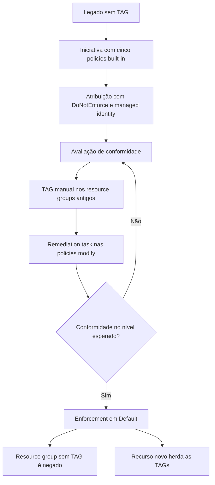

Fala pessoALL! Chegamos pra mais um conteúdo!

Quem acompanha o blog já percebeu que eu gosto de resolver as coisas com TAG. Foi assim no [Start/Stop de VMs](https://blog.ruizsolutions.online/posts/azure-tag-start-stop-vms/), nos [snapshots](https://blog.ruizsolutions.online/posts/criando-snapshot-de-vms-atraves-de-tags/), nas [ondas de patch com escopo dinâmico](https://blog.ruizsolutions.online/posts/azure-update-manager-escopo-dinamico-tags/) e na [versão nova do Start/Stop](https://blog.ruizsolutions.online/posts/start-stop-vms-azure-managed-identity/). Em todos eles a automação procura uma TAG e age em cima do que encontrou.

Só que todos esses artigos partem de uma premissa que eu nunca parei para tratar: a TAG está lá, com o nome certo e o valor certo.

E quando não está?

A VM criada na sexta à tarde sem a TAG de onda não entra em janela nenhuma. O disco criado sem centro de custo aparece no relatório do mês como "sem dono". E tem um detalhe que pega muita gente: **recurso não herda TAG do resource group nem da assinatura**. Você marca o resource group com todo o capricho, olha a VM lá dentro e ela continua sem TAG nenhuma. No Azure isso é por design, e a própria documentação manda resolver com Azure Policy.

Pedir para o time "lembrar de colocar a TAG" funciona por umas duas semanas. Depois entra gente nova, alguém sobe um template antigo, e você volta para a planilha.

<!-- LUIZ: você já pegou um ambiente em que a mesma TAG existia com grafias diferentes (CentroCusto, centro-de-custo, CC)? Se sim, vale um parágrafo aqui contando quantas variações eram e como apareceu no relatório de custo, sem identificar o ambiente. -->

**Neste artigo, vamos montar a governança de TAGs com Azure Policy usando só policies built-in: exigir TAG no resource group, fazer os recursos herdarem do resource group e da assinatura, juntar tudo em uma iniciativa, atribuir com o enforcement desligado para ver o estrago antes, corrigir o legado com remediation task e só então ligar o bloqueio.**

> Não atribua policy de TAG com efeito `deny` direto em produção, com enforcement ligado, sem passar pela etapa de teste. Pipeline e template que criam resource group sem TAG vão começar a falhar na hora, e quem vai receber a ligação é você.
{: .prompt-warning }

---

## Mas antes, o que cada policy de TAG faz?

O Azure já entrega um conjunto de definições prontas na categoria **Tags**. Não precisa escrever JSON de regra para o que vamos fazer aqui. As que interessam:

| Policy built-in | Efeito | O que faz |
| --- | :---: | --- |
| Require a tag on resource groups | deny | Bloqueia criar ou alterar resource group sem a TAG |
| Require a tag on resources | deny | Bloqueia criar ou alterar recurso sem a TAG. Não vale para resource group |
| Inherit a tag from the resource group | modify | Copia a TAG do resource group para o recurso e **substitui** o valor se for diferente |
| Inherit a tag from the resource group if missing | modify | Copia a TAG do resource group só se o recurso não tiver. Valor diferente fica como está |
| Inherit a tag from the subscription | modify | Igual à primeira de herança, com a assinatura como origem |
| Inherit a tag from the subscription if missing | modify | Igual à segunda, com a assinatura como origem |

Existem também as versões **Append a tag...**, mais antigas. A documentação recomenda o `modify` para TAG, porque o `append` não corrige recurso que já existe.

A diferença entre as duas versões de herança parece detalhe e define a sua governança. Por baixo, a versão sem "if missing" usa a operação `addOrReplace`, e a versão "if missing" usa `add`. Na prática:

- TAG que o recurso **não pode** ter diferente do resource group (ambiente, por exemplo): use a versão que substitui;
- TAG que normalmente vem do resource group mas aceita exceção (um recurso compartilhado rateado em outro centro de custo): use a "if missing".

### O efeito modify e a managed identity

O `deny` é simples: a requisição não atende a regra e volta com erro. O `modify` altera a requisição antes de ela chegar no resource provider, então a TAG já nasce no recurso sem ninguém ter digitado. Para recurso **novo ou alterado** isso acontece sozinho. Para recurso que **já existia**, a policy não mexe em nada: só marca como non-compliant e espera você abrir uma **remediation task**.

E a remediation task precisa de permissão para escrever nos recursos. Por isso toda atribuição com `modify` carrega uma **managed identity**, e essa identidade precisa das roles listadas na definição da policy, no campo `roleDefinitionIds`. Nas built-ins de TAG, a role listada é **Contributor**.

> Se você atribui pelo portal, ele cria a identidade e já concede a role sozinho. Por CLI, PowerShell, Bicep ou Terraform a concessão é por sua conta. Sem a role, a remediation task falha, e é justamente nela que você vai precisar da identidade.
{: .prompt-warning }

### Enforcement mode: o botão de teste

Toda atribuição tem a propriedade `enforcementMode`. No portal ela aparece como **Policy enforcement**, com as opções **Enabled** e **Disabled**. Na API e no CLI os valores são `Default` e `DoNotEnforce`. É a mesma coisa com dois nomes, e isso confunde na primeira vez. A API aceita ainda um terceiro valor, `Enroll`, usado com o recurso de enrollments para ligar o efeito escopo por escopo. Não vamos usar aqui.

| Efeito | Enforcement `Default` | Enforcement `DoNotEnforce` |
| --- | --- | --- |
| deny | Criação ou alteração bloqueada | Criação liberada, recurso marcado como non-compliant |
| modify | TAG aplicada sozinha na criação ou alteração | Nada é alterado. Remediation task manual continua disponível |

Com `DoNotEnforce` a conformidade é calculada do mesmo jeito, mas nenhum efeito dispara e nada é registrado no Activity Log. É assim que eu sugiro começar qualquer policy com `deny` ou `modify`.

O fluxo do laboratório fica assim:



---

## O que vamos construir

Três TAGs, cada uma com uma regra diferente, para usar as três variações de policy:

| TAG | Onde é obrigatória | Como chega no recurso |
| --- | --- | --- |
| `Ambiente` | Resource group | Herdada do resource group, sempre. Valor diferente é substituído |
| `CentroDeCusto` | Resource group | Herdada do resource group se o recurso não tiver |
| `Departamento` | Definida na assinatura | Herdada da assinatura se o recurso não tiver |

E os nomes do laboratório:

| Recurso | Nome |
| --- | --- |
| Resource group legado | `rg-tags-legado-wus2-001` |
| VNet, NSG e route table do legado | `vnet-tags-legado-wus2-001`, `nsg-tags-legado-wus2-001`, `rt-tags-legado-wus2-001` |
| Resource group do teste com enforcement desligado | `rg-tags-teste-wus2-001` |
| Resource group criado já com a regra valendo | `rg-tags-novo-wus2-001` |
| Iniciativa | `ini-tags-governanca-lab` |
| Atribuição | `asg-tags-governanca` |

> Repare que os nomes das TAGs não têm acento nem espaço. A documentação de TAGs avisa que caracteres fora do inglês podem causar falha na leitura dos metadados da VM pelo IMDS. `CentroDeCusto` dá menos dor de cabeça que `Centro de Custo`, e `Producao` menos que `Produção`.
{: .prompt-tip }

---

## Pré-requisitos

- Uma assinatura **de laboratório**. A atribuição vai no escopo da assinatura inteira;
- Permissão de **Owner** na assinatura, porque vamos criar atribuição de policy e conceder role para a managed identity;
- Azure Cloud Shell em Bash, ou Azure CLI atualizado na sua máquina;
- Os arquivos do laboratório, que estão no meu repositório: [Azure Policy - Tags](https://github.com/lfrleite/Ruiz-Online/tree/main/Azure%20Policy%20-%20Tags).

> Montei o laboratório só com recursos de rede vazios (VNet, NSG e route table), sem VM, disco ou IP público. A documentação diz que a VNet não tem cobrança; para os outros dois, confira a página de preços se quiser ter certeza. De qualquer forma, rode a limpeza no final para não deixar policy com `deny` esquecida na assinatura.
{: .prompt-info }

---

## Mão na massa!

### Passo 1 - Criar o legado sem TAG

Para a remediação fazer sentido, precisamos de recursos que já existiam antes da policy. O script abaixo cria um resource group e três recursos sem TAG nenhuma, marca só o NSG com valores "errados" de propósito e coloca a TAG `Departamento` na assinatura.

Baixe o arquivo `01-lab-legado.sh` do repositório ou crie com este conteúdo:

```bash
#!/usr/bin/env bash
# 01-lab-legado.sh
# Cria o "legado" do laboratório: um resource group e três recursos sem TAG,
# mais uma TAG na assinatura para testar a herança.
# Só recursos de rede vazios: nada de VM, disco ou IP público.
set -euo pipefail

LOCATION="westus2"
RG="rg-tags-legado-wus2-001"
VNET="vnet-tags-legado-wus2-001"
NSG="nsg-tags-legado-wus2-001"
RT="rt-tags-legado-wus2-001"

if ! SUBSCRIPTION_ID=$(az account show --query id -o tsv 2>/dev/null); then
  echo "Sem sessão ativa. Rode 'az login' e selecione a assinatura de laboratório." >&2
  exit 1
fi
echo "Assinatura em uso: $SUBSCRIPTION_ID"

echo "Criando o resource group $RG sem nenhuma TAG..."
az group create --name "$RG" --location "$LOCATION" --output none

echo "Criando VNet, NSG e route table sem TAG..."
az network vnet create --name "$VNET" --resource-group "$RG" --location "$LOCATION" \
  --address-prefixes 10.210.0.0/24 --output none
az network nsg create --name "$NSG" --resource-group "$RG" --location "$LOCATION" --output none
az network route-table create --name "$RT" --resource-group "$RG" --location "$LOCATION" --output none

echo "Marcando só o NSG com valores diferentes dos que o resource group vai receber..."
NSG_ID=$(az resource show --resource-group "$RG" --name "$NSG" \
  --resource-type Microsoft.Network/networkSecurityGroups --query id --output tsv)
az tag update --resource-id "$NSG_ID" --operation Merge \
  --tags Ambiente=Teste CentroDeCusto=CC-9999 --output none

echo "Aplicando a TAG Departamento na assinatura (Merge preserva as TAGs que já existem)..."
az tag update --resource-id "/subscriptions/$SUBSCRIPTION_ID" --operation Merge \
  --tags Departamento=TI --output none

echo "Pronto. TAGs atuais da assinatura:"
az tag list --resource-id "/subscriptions/$SUBSCRIPTION_ID" --query properties.tags
```

Execute no Cloud Shell:

```bash
chmod +x 01-lab-legado.sh
./01-lab-legado.sh
```

<!-- PRINT 002: Cloud Shell com a saída completa do 01-lab-legado.sh, terminando com o JSON das TAGs da assinatura mostrando Departamento = TI -->
{: .shadow .rounded-10 }
<br>

O NSG com `Ambiente=Teste` e `CentroDeCusto=CC-9999` está ali para provar, lá no Passo 6, a diferença entre a herança que substitui e a herança "if missing".

No portal, abra o resource group `rg-tags-legado-wus2-001` e confira que ele e os recursos estão sem as TAGs do padrão:

<!-- PRINT 003: Portal, resource group rg-tags-legado-wus2-001 > Overview com a coluna de TAGs visível na lista de recursos, mostrando VNet e route table sem TAG e o NSG com Ambiente=Teste e CentroDeCusto=CC-9999 -->
{: .shadow .rounded-10 }
<br>

---

### Passo 2 - Conhecer as built-ins no portal

1. No portal, pesquise por **Policy**;
2. No menu lateral, em **Authoring**, clique em **Definitions**;
3. No filtro de categoria, deixe marcada somente a opção **Tags**;
4. Clique em **Inherit a tag from the resource group if missing** para abrir a definição.

<!-- PRINT 004: Policy > Definitions com o filtro de categoria em Tags, listando as built-ins de TAG -->
{: .shadow .rounded-10 }
<br>

Dentro da definição, olhe a regra com calma. Este é o trecho que importa:

```json
"if": {
  "allOf": [
    {
      "field": "[concat('tags[', parameters('tagName'), ']')]",
      "exists": "false"
    },
    {
      "value": "[resourceGroup().tags[parameters('tagName')]]",
      "notEquals": ""
    }
  ]
}
```

A segunda condição passa batida e pesa muito: a policy só alcança o recurso se **o resource group tiver a TAG com algum valor**. Resource group sem a TAG significa recurso fora da regra, que aparece como compliant mesmo estando sem TAG nenhuma.

Guarde isso. É o motivo de a ordem dos passos 5 e 6 não poder ser invertida.

<!-- PRINT 005: definição Inherit a tag from the resource group if missing aberta no portal, com o JSON visível no trecho do policyRule mostrando o if com as duas condições e o roleDefinitionIds -->
{: .shadow .rounded-10 }
<br>

---

### Passo 3 - Criar a iniciativa

Daria para atribuir as cinco policies uma a uma. Eu não oriento: na hora de trocar o enforcement você precisa lembrar das cinco. A **iniciativa** (policy set definition) junta tudo em um objeto, com uma atribuição e uma managed identity.

A iniciativa é descrita por um array de referências. Cada item aponta para uma definição e passa os parâmetros dela. Este é o arquivo `iniciativa-tags-definitions.json`:

```json
[
  {
    "policyDefinitionReferenceId": "exigir-ambiente-rg",
    "policyDefinitionId": "/providers/Microsoft.Authorization/policyDefinitions/96670d01-0a4d-4649-9c89-2d3abc0a5025",
    "parameters": {
      "tagName": { "value": "Ambiente" }
    }
  },
  {
    "policyDefinitionReferenceId": "exigir-centrodecusto-rg",
    "policyDefinitionId": "/providers/Microsoft.Authorization/policyDefinitions/96670d01-0a4d-4649-9c89-2d3abc0a5025",
    "parameters": {
      "tagName": { "value": "CentroDeCusto" }
    }
  },
  {
    "policyDefinitionReferenceId": "herdar-ambiente-rg",
    "policyDefinitionId": "/providers/Microsoft.Authorization/policyDefinitions/cd3aa116-8754-49c9-a813-ad46512ece54",
    "parameters": {
      "tagName": { "value": "Ambiente" }
    }
  },
  {
    "policyDefinitionReferenceId": "herdar-centrodecusto-rg",
    "policyDefinitionId": "/providers/Microsoft.Authorization/policyDefinitions/ea3f2387-9b95-492a-a190-fcdc54f7b070",
    "parameters": {
      "tagName": { "value": "CentroDeCusto" }
    }
  },
  {
    "policyDefinitionReferenceId": "herdar-departamento-sub",
    "policyDefinitionId": "/providers/Microsoft.Authorization/policyDefinitions/40df99da-1232-49b1-a39a-6da8d878f469",
    "parameters": {
      "tagName": { "value": "Departamento" }
    }
  }
]
```

Dois pontos sobre esse arquivo:

1. A mesma definição aparece duas vezes (`Require a tag on resource groups`), cada uma com uma TAG diferente no parâmetro `tagName`. Isso é permitido, desde que o `policyDefinitionReferenceId` seja diferente;
2. O `policyDefinitionReferenceId` é o nome que você dá para cada policy dentro da iniciativa. Escolha nomes legíveis, porque é por esse nome que a remediation task vai ser criada lá na frente.

A criação da iniciativa e a atribuição estão no mesmo script, `02-iniciativa-e-atribuicao.sh`. Deixe o JSON acima na mesma pasta:

```bash
#!/usr/bin/env bash
# 02-iniciativa-e-atribuicao.sh
# Cria a iniciativa de TAGs com cinco policies built-in e atribui na assinatura
# com enforcement desligado (DoNotEnforce) e managed identity do sistema.
# Precisa do arquivo iniciativa-tags-definitions.json na mesma pasta.
set -euo pipefail

LOCATION="westus2"
INITIATIVE="ini-tags-governanca-lab"
ASSIGNMENT="asg-tags-governanca"
DEFINITIONS_FILE="$(dirname "$0")/iniciativa-tags-definitions.json"

if ! SUBSCRIPTION_ID=$(az account show --query id -o tsv 2>/dev/null); then
  echo "Sem sessão ativa. Rode 'az login' e selecione a assinatura de laboratório." >&2
  exit 1
fi
if [[ ! -f "$DEFINITIONS_FILE" ]]; then
  echo "Arquivo não encontrado: $DEFINITIONS_FILE" >&2
  exit 1
fi

SCOPE="/subscriptions/$SUBSCRIPTION_ID"
INITIATIVE_ID="$SCOPE/providers/Microsoft.Authorization/policySetDefinitions/$INITIATIVE"

echo "Criando a iniciativa $INITIATIVE..."
az policy set-definition create \
  --name "$INITIATIVE" \
  --display-name "Governanca de TAGs (lab)" \
  --description "Exige Ambiente e CentroDeCusto no resource group e faz os recursos herdarem as TAGs do resource group e da assinatura." \
  --metadata '{"category":"Tags"}' \
  --definitions "$(cat "$DEFINITIONS_FILE")" \
  --output none

echo "Atribuindo a iniciativa em $SCOPE com enforcement DoNotEnforce..."
az policy assignment create \
  --name "$ASSIGNMENT" \
  --display-name "Governanca de TAGs (lab)" \
  --scope "$SCOPE" \
  --policy-set-definition "$INITIATIVE_ID" \
  --enforcement-mode DoNotEnforce \
  --mi-system-assigned \
  --location "$LOCATION" \
  --role Contributor \
  --identity-scope "$SCOPE" \
  --output none

PRINCIPAL_ID=$(az policy assignment show --name "$ASSIGNMENT" --scope "$SCOPE" \
  --query identity.principalId --output tsv)
if [[ -z "$PRINCIPAL_ID" ]]; then
  echo "A atribuição foi criada sem managed identity. Confira antes de continuar." >&2
  exit 1
fi

echo "Managed identity da atribuição (principalId): $PRINCIPAL_ID"
echo "Roles da identidade:"
az role assignment list --assignee "$PRINCIPAL_ID" --all --output table
```

```bash
chmod +x 02-iniciativa-e-atribuicao.sh
./02-iniciativa-e-atribuicao.sh
```

<!-- PRINT 006: Cloud Shell com a saída do 02-iniciativa-e-atribuicao.sh mostrando o principalId da managed identity e a tabela de roles com Contributor no escopo da assinatura -->
{: .shadow .rounded-10 }
<br>

Vamos por partes no `az policy assignment create`, porque é o comando central do artigo:

| Parâmetro | Para que serve |
| --- | --- |
| `--enforcement-mode DoNotEnforce` | Atribui sem aplicar efeito nenhum. Só mede |
| `--mi-system-assigned` | Cria a managed identity do sistema na atribuição |
| `--location` | Região da identidade. É obrigatória quando a atribuição tem identidade do sistema e não pode ser alterada depois |
| `--role Contributor` | Role que a identidade recebe. É a que as built-ins de TAG declaram no `roleDefinitionIds` |
| `--identity-scope` | Escopo em que a role é concedida |

> Sendo bem sincero, Contributor na assinatura inteira para uma identidade que só escreve TAG é mais permissão do que eu gostaria. Existe a role **Tag Contributor**, que grava TAG sem dar acesso ao recurso. As built-ins declaram Contributor, e é isso que o portal concede. A página do efeito `modify` cita as duas juntas, "Contributor/Tag Contributor", e a de remediação manda restringir a permissão ao mínimo possível. Pelo CLI nada impede você de conceder outra role, mas eu não encontrei na documentação a garantia de que a remediação dessas built-ins funciona só com Tag Contributor. Trate como teste de laboratório antes de virar padrão.
{: .prompt-info }

<!-- LUIZ: quando você rodar o laboratório, teste trocar --role Contributor por "Tag Contributor" no script e veja se as três remediation tasks completam. Se funcionar, vale registrar aqui o resultado, porque é uma dúvida comum e a documentação não é direta sobre isso. -->

No portal, confira o que foi criado:

1. Em **Policy**, clique em **Definitions** e pesquise por `Governanca de TAGs`;
2. Abra a iniciativa e confira as cinco policies com os parâmetros.

<!-- PRINT 007: Policy > Definitions > iniciativa Governanca de TAGs (lab) aberta, listando as cinco policies com o reference ID e o efeito de cada uma -->
{: .shadow .rounded-10 }
<br>

3. Volte em **Policy**, clique em **Assignments** e abra a atribuição `Governanca de TAGs (lab)`;
4. Clique em **Edit assignment** e confira, na aba **Basics**, o campo **Policy enforcement** em **Disabled**.

<!-- PRINT 008: Edit assignment, aba Basics, com Scope na assinatura do lab e Policy enforcement marcado como Disabled -->
{: .shadow .rounded-10 }
<br>

5. Na aba **Remediation**, confira a **System assigned managed identity** e a região `West US 2`.

<!-- PRINT 009: Edit assignment, aba Remediation, mostrando System assigned managed identity selecionada, a location West US 2 e a permissão Contributor listada -->
{: .shadow .rounded-10 }
<br>

6. Ainda no **Edit assignment**, vá até a aba **Non-compliance messages** e escreva a mensagem que a pessoa vai ler quando for bloqueada:

```text
Resource group sem as TAGs obrigatórias Ambiente e CentroDeCusto. Informe as duas na criação. Dúvidas: time de Cloud.
```

7. Avance até a revisão e clique em **Save**.

<!-- PRINT 010: Edit assignment, aba Non-compliance messages, com a mensagem padrão preenchida -->
{: .shadow .rounded-10 }
<br>

Essa mensagem é o que separa um bloqueio que a pessoa resolve sozinha de um chamado aberto para você.

---

### Passo 4 - Ler a primeira avaliação

Atribuição nova leva por volta de cinco minutos para ser aplicada ao escopo. Só depois disso começa o ciclo de avaliação, e o tempo dele depende da quantidade de recursos. Não existe prazo garantido.

Para não ficar esperando o ciclo automático, que roda uma vez a cada 24 horas, dispare a avaliação do resource group na mão:

```bash
az policy state trigger-scan --resource-group rg-tags-legado-wus2-001
```

O comando só devolve o prompt quando termina. Depois liste o que ficou non-compliant:

```bash
az policy state list \
  --policy-assignment asg-tags-governanca \
  --resource-group rg-tags-legado-wus2-001 \
  --filter "complianceState eq 'NonCompliant'" \
  --query "[].{Recurso:resourceId, Policy:policyDefinitionReferenceId}" \
  --output table
```

<!-- PRINT 011: Cloud Shell com a saída do az policy state list em tabela, com as colunas Recurso e Policy listando o que está non-compliant na atribuição -->
{: .shadow .rounded-10 }
<br>

O resultado esperado, pela regra das definições:

<!-- VALIDAR: conferir no laboratório se a tabela abaixo bate com a saída real. Dois pontos: (1) se VNet e route table aparecem mesmo como compliant nas duas policies de herança do resource group enquanto o resource group está sem TAG; (2) se o próprio resource group aparece com --resource-group ou só na consulta sem esse parâmetro. Ajustar a tabela e o print 011 conforme o resultado. -->

| Policy na iniciativa | Quem aparece como non-compliant |
| --- | --- |
| `exigir-ambiente-rg` | O resource group `rg-tags-legado-wus2-001` |
| `exigir-centrodecusto-rg` | O resource group `rg-tags-legado-wus2-001` |
| `herdar-ambiente-rg` | Ninguém |
| `herdar-centrodecusto-rg` | Ninguém |
| `herdar-departamento-sub` | VNet, NSG e route table |

Olha a pegadinha do Passo 2 acontecendo. A VNet e a route table estão sem `Ambiente` e sem `CentroDeCusto`, e mesmo assim as duas policies de herança do resource group dizem que está tudo certo, porque o resource group ainda não tem valor nenhum para passar adiante.

Quem olha só o percentual dessas duas policies sai achando que o ambiente está bom.

Um aviso sobre a consulta: se o próprio resource group não aparecer na lista, tire o `--resource-group` do comando. O estado dele pode estar registrado no escopo da assinatura.

No portal a mesma informação fica em **Policy > Compliance**, clicando na atribuição:

<!-- PRINT 012: Policy > Compliance > Governanca de TAGs (lab), mostrando o estado Non-compliant, o percentual e a lista das cinco policies com a contagem de recursos non-compliant em cada uma -->
{: .shadow .rounded-10 }
<br>

Agora o teste do enforcement desligado. Tente criar um resource group sem TAG:

```bash
az group create --name rg-tags-teste-wus2-001 --location westus2
```

Ele é criado sem reclamar. Com `DoNotEnforce`, o `deny` não bloqueia e o `modify` não altera nada. O resource group novo só vai aparecer como non-compliant na próxima avaliação.

<!-- PRINT 013: Cloud Shell com o az group create do rg-tags-teste-wus2-001 retornando provisioningState Succeeded, mesmo sem TAG, com a atribuição em DoNotEnforce -->
{: .shadow .rounded-10 }
<br>

> Em ambiente real, é nessa fase que eu deixaria a atribuição por pelo menos um ciclo completo de trabalho do time, com fechamento de mês e rodada do pipeline de infraestrutura no meio. Tudo que aparecer como non-compliant nesse período é coisa que teria quebrado com o enforcement ligado.
{: .prompt-tip }

---

### Passo 5 - Corrigir os resource groups na mão

Resource group sem TAG obrigatória não tem remediation task. A policy é `deny`, e `deny` não corrige nada. E nenhuma policy sabe qual é o centro de custo do `rg-tags-legado-wus2-001`. Essa informação está na cabeça de alguém, e levantar o dono de cada resource group antigo é a parte do trabalho que nenhuma automação tira de você.

Para o laboratório, vamos marcar o resource group legado:

```bash
RG_ID=$(az group show --name rg-tags-legado-wus2-001 --query id --output tsv)

az tag update --resource-id "$RG_ID" --operation Merge \
  --tags Ambiente=Lab CentroDeCusto=CC-1001
```

> Use sempre `--operation Merge` em ambiente que já tem TAG. O `az tag create` e o `--operation Replace` substituem o conjunto inteiro de TAGs do recurso. É o tipo de comando que apaga a TAG de Start/Stop de uma VM sem dar erro nenhum.
{: .prompt-danger }

<!-- PRINT 014: Portal, resource group rg-tags-legado-wus2-001 > Tags mostrando Ambiente = Lab e CentroDeCusto = CC-1001 -->
{: .shadow .rounded-10 }
<br>

---

### Passo 6 - Remediation task para o legado

A remediation task aplica a operação do `modify` nos recursos que já existiam, usando a managed identity da atribuição. Três regras para ter em mente:

1. Uma task corrige **uma policy por vez**. Em iniciativa, você informa qual pelo `policyDefinitionReferenceId`;
2. Ela trabalha em cima dos recursos **já marcados** como non-compliant. Por isso a avaliação precisa rodar de novo depois que o resource group ganhou as TAGs;
3. Ela funciona com o enforcement em `DoNotEnforce`. Dá para corrigir o legado inteiro antes de ligar qualquer bloqueio.

O script `03-remediacao.sh` reavalia o resource group, cria uma task para cada policy `modify` da iniciativa e acompanha cada uma por até dez minutos. Se a task não fechar nesse tempo, ele avisa e mostra o comando para acompanhar:

```bash
#!/usr/bin/env bash
# 03-remediacao.sh
# Reavalia um resource group e cria uma remediation task para cada policy modify
# da iniciativa, limitada a esse resource group.
# Uso: ./03-remediacao.sh <nome-do-resource-group>
set -euo pipefail

RG="${1:-}"
ASSIGNMENT="asg-tags-governanca"
REFERENCE_IDS=("herdar-ambiente-rg" "herdar-centrodecusto-rg" "herdar-departamento-sub")
MAX_CHECKS=40
SLEEP_SECONDS=15

if [[ -z "$RG" ]]; then
  echo "Uso: $0 <nome-do-resource-group>" >&2
  exit 1
fi
if ! SUBSCRIPTION_ID=$(az account show --query id -o tsv 2>/dev/null); then
  echo "Sem sessão ativa. Rode 'az login' e selecione a assinatura de laboratório." >&2
  exit 1
fi
if ! az group show --name "$RG" --output none 2>/dev/null; then
  echo "Resource group não encontrado: $RG" >&2
  exit 1
fi

ASSIGNMENT_ID="/subscriptions/$SUBSCRIPTION_ID/providers/Microsoft.Authorization/policyAssignments/$ASSIGNMENT"
STAMP=$(date +%Y%m%d%H%M)

echo "Reavaliando a conformidade de $RG (pode levar alguns minutos)..."
az policy state trigger-scan --resource-group "$RG"

for REF in "${REFERENCE_IDS[@]}"; do
  NAME="rem-$REF-$STAMP"
  echo "Criando a remediation task $NAME..."
  az policy remediation create \
    --name "$NAME" \
    --resource-group "$RG" \
    --policy-assignment "$ASSIGNMENT_ID" \
    --definition-reference-id "$REF" \
    --output none

  STATE="Running"
  FINISHED="no"
  for ((i = 1; i <= MAX_CHECKS; i++)); do
    STATE=$(az policy remediation show --name "$NAME" --resource-group "$RG" \
      --query provisioningState --output tsv)
    case "$STATE" in
      Succeeded | Complete | Failed | Canceled)
        FINISHED="yes"
        break
        ;;
    esac
    sleep "$SLEEP_SECONDS"
  done
  if [[ "$FINISHED" == "yes" ]]; then
    echo "  $NAME terminou com estado: $STATE"
  else
    echo "  $NAME ainda está em $STATE depois de $((MAX_CHECKS * SLEEP_SECONDS)) segundos." >&2
    echo "  Acompanhe com: az policy remediation show --name $NAME --resource-group $RG" >&2
  fi
  if [[ "$STATE" == "Failed" ]]; then
    echo "  Veja o motivo com: az policy remediation deployment list --name $NAME --resource-group $RG" >&2
  fi
done

echo "Remediation tasks registradas em $RG:"
az policy remediation list --resource-group "$RG" \
  --query "[].{Nome:name, Estado:provisioningState, Policy:policyDefinitionReferenceId}" --output table
```

```bash
chmod +x 03-remediacao.sh
./03-remediacao.sh rg-tags-legado-wus2-001
```

Repare que as tasks são criadas com `--resource-group`. A atribuição está na assinatura, mas a correção fica limitada ao resource group informado. Em ambiente real eu faria assim, um resource group por vez, começando pelos menos críticos.

<!-- PRINT 015: Cloud Shell com a saída do 03-remediacao.sh mostrando as três remediation tasks com estado final e a tabela do az policy remediation list -->
{: .shadow .rounded-10 }
<br>

Pelo portal o caminho é **Policy > Remediation**. A aba **Policies to remediate** lista as policies `modify` e `deployIfNotExists` com recurso pendente, e a aba **Remediation tasks** mostra o andamento de cada task.

<!-- PRINT 016: Policy > Remediation > aba Remediation tasks, com as três tasks rem-herdar-... listadas e o estado de cada uma -->
{: .shadow .rounded-10 }
<br>

Agora confira as TAGs dos três recursos. A consulta `recursos-sem-tag.kql` lista o que ainda está sem alguma das três TAGs. Se você já leu o artigo das [consultas essenciais do Resource Graph](https://blog.ruizsolutions.online/posts/azure-resource-graph-consultas-essenciais/), esta é mais uma para salvar:

```kusto
Resources
| extend Ambiente = tostring(tags['Ambiente'])
| extend CentroDeCusto = tostring(tags['CentroDeCusto'])
| extend Departamento = tostring(tags['Departamento'])
| where isempty(Ambiente) or isempty(CentroDeCusto) or isempty(Departamento)
| project name, type, resourceGroup, subscriptionId, Ambiente, CentroDeCusto, Departamento
| sort by resourceGroup asc, name asc
```

Para ver o resultado da herança recurso a recurso, o portal é mais direto. Abra o resource group legado com a coluna **Tags** visível:

<!-- PRINT 017: Portal, resource group rg-tags-legado-wus2-001 > Overview com a coluna Tags, mostrando VNet e route table com Ambiente=Lab, CentroDeCusto=CC-1001 e Departamento=TI, e o NSG com Ambiente=Lab, CentroDeCusto=CC-9999 e Departamento=TI -->
{: .shadow .rounded-10 }
<br>

O resultado esperado:

| Recurso | Ambiente | CentroDeCusto | Departamento |
| --- | --- | --- | --- |
| `vnet-tags-legado-wus2-001` | `Lab` | `CC-1001` | `TI` |
| `rt-tags-legado-wus2-001` | `Lab` | `CC-1001` | `TI` |
| `nsg-tags-legado-wus2-001` | `Lab` | `CC-9999` | `TI` |

Olha o NSG. O `Ambiente=Teste` que ele tinha foi **substituído** por `Lab`, porque a policy de `Ambiente` é a que usa `addOrReplace`. Já o `CentroDeCusto=CC-9999` ficou intacto, porque a policy de centro de custo é a "if missing".

Você escolhe esse comportamento TAG por TAG quando monta a iniciativa. Pense bem antes: a versão que substitui vai sobrescrever valor que alguém colocou de propósito.

> Alterar o valor da TAG no resource group não atualiza os recursos sozinho. Os recursos que já existem ficam non-compliant na policy de herança e só mudam quando forem alterados por algum motivo ou quando você rodar uma nova remediation task.
{: .prompt-warning }

---

### Passo 7 - Ligar o enforcement

Legado corrigido e time avisado. Agora liga.

```bash
SUBSCRIPTION_ID=$(az account show --query id --output tsv)

az policy assignment update \
  --name asg-tags-governanca \
  --scope "/subscriptions/$SUBSCRIPTION_ID" \
  --enforcement-mode Default
```

Pelo portal é o mesmo **Edit assignment** do Passo 3, com **Policy enforcement** em **Enabled**.

<!-- VALIDAR: depois do az policy assignment update, rodar az policy assignment show --name asg-tags-governanca --scope "/subscriptions/$SUBSCRIPTION_ID" --query "{enforcement:enforcementMode, identidade:identity.type}" e confirmar que a managed identity continua na atribuição. -->

<!-- PRINT 018: Cloud Shell com a saída do az policy assignment update mostrando enforcementMode Default -->
{: .shadow .rounded-10 }
<br>

> A partir deste comando, **qualquer** criação de resource group sem `Ambiente` e `CentroDeCusto` nesta assinatura é negada. Isso inclui resource group criado por serviço em seu nome. Em ambiente real, essa virada é mudança com GMUD, data combinada e comunicação prévia para quem cria recurso.
{: .prompt-danger }

Alteração em atribuição segue o mesmo tempo de uma atribuição nova, por volta de cinco minutos. Espere e passe para os testes.

---

### Passo 8 - Testar o deny e a herança

Primeiro teste, resource group sem TAG:

```bash
az group create --name rg-tags-novo-wus2-001 --location westus2
```

Agora o retorno é um erro com o código `RequestDisallowedByPolicy`, o nome da atribuição, as definições que negaram e a mensagem que escrevemos no Passo 3.

<!-- PRINT 019: Cloud Shell com o erro RequestDisallowedByPolicy do az group create, mostrando a mensagem customizada de non-compliance e o nome da atribuição Governanca de TAGs (lab) -->
{: .shadow .rounded-10 }
<br>

Segundo teste, o mesmo resource group com as TAGs. Vamos pelo portal, para ver a experiência de quem cria:

1. Pesquise por **Resource groups** e clique em **Create**;
2. Na aba **Basics**, informe:
   * Resource group:
   ```text
   rg-tags-novo-wus2-001
   ```
   * Region: `West US 2`;
3. Na aba **Tags**, informe `Ambiente` com valor `Lab` e `CentroDeCusto` com valor `CC-2002`;
4. Clique em **Review + create** e depois em **Create**.

<!-- PRINT 020: Create a resource group, aba Tags preenchida com Ambiente = Lab e CentroDeCusto = CC-2002, antes do clique em Review + create -->
{: .shadow .rounded-10 }
<br>

Terceiro teste, um recurso novo sem TAG dentro dele:

```bash
az network nsg create \
  --name nsg-tags-novo-wus2-001 \
  --resource-group rg-tags-novo-wus2-001 \
  --location westus2

NSG_ID=$(az resource show \
  --resource-group rg-tags-novo-wus2-001 \
  --name nsg-tags-novo-wus2-001 \
  --resource-type Microsoft.Network/networkSecurityGroups \
  --query id --output tsv)

az tag list --resource-id "$NSG_ID" --query properties.tags
```

O comando de criação não tem nenhuma TAG, e o retorno esperado do `az tag list` tem este formato:

```json
{
  "Ambiente": "Lab",
  "CentroDeCusto": "CC-2002",
  "Departamento": "TI"
}
```

<!-- PRINT 021: Cloud Shell com a saída do az tag list do nsg-tags-novo-wus2-001 mostrando as três TAGs herdadas -->
{: .shadow .rounded-10 }
<br>

Duas vieram do resource group e uma da assinatura, sem ninguém digitar.

Falta olhar a conformidade geral. O estado de um recurso recém-criado leva por volta de 15 minutos para aparecer na tela:

<!-- PRINT 022: Policy > Compliance > Governanca de TAGs (lab) depois da remediação e dos testes, mostrando o resource group rg-tags-teste-wus2-001 como único non-compliant -->
{: .shadow .rounded-10 }
<br>

O `rg-tags-teste-wus2-001`, criado no Passo 4 com o enforcement desligado, continua lá como non-compliant. Ligar o enforcement fecha a porta dali para a frente, e o que entrou antes continua sendo trabalho seu.

---

### Passo 9 - A ponte com as TAGs operacionais

Até aqui tratamos TAG organizacional, que faz sentido herdar. As TAGs que os outros artigos do blog usam são de outro tipo: o horário do Start/Stop, a onda de patch, a marca de candidato a exclusão do artigo de [recursos órfãos](https://blog.ruizsolutions.online/posts/azure-recursos-orfaos-resource-graph/). Essas são decisões por recurso, e eu não oriento herdar do resource group. Dez VMs no mesmo resource group raramente reiniciam na mesma madrugada.

Para elas o que serve é **exigir**, e só no tipo de recurso certo. A built-in `Require a tag on resources` vale para qualquer recurso que suporte TAG. Para restringir a VMs sem escrever policy customizada, a atribuição tem o **resource selector**:

<!-- VALIDAR: a estrutura do resource selector (name, selectors, kind resourceType, in) está na documentação da atribuição, mas não há exemplo oficial de --resource-selectors com JSON inline no CLI. Conferir se o comando é aceito como está e se a tela de conformidade lista só VMs. -->

```bash
SUBSCRIPTION_ID=$(az account show --query id --output tsv)

az policy assignment create \
  --name asg-tag-ondapatch-vm \
  --display-name "Exigir TAG OndaPatch em VMs (lab)" \
  --scope "/subscriptions/$SUBSCRIPTION_ID" \
  --policy 871b6d14-10aa-478d-b590-94f262ecfa99 \
  --params '{"tagName":{"value":"OndaPatch"}}' \
  --enforcement-mode DoNotEnforce \
  --resource-selectors '[{"name":"SomenteVMs","selectors":[{"kind":"resourceType","in":["Microsoft.Compute/virtualMachines"]}]}]'
```

O `871b6d14-10aa-478d-b590-94f262ecfa99` é o nome interno da `Require a tag on resources`. Troque `OndaPatch` pelo nome da TAG que você usa nas ondas.

Deixei em `DoNotEnforce` de propósito. Assim a atribuição vira um relatório: a tela de conformidade passa a listar toda VM sem a TAG de onda, que é justamente a VM que o escopo dinâmico do Update Manager nunca vai enxergar. Ligar o `deny` aqui é decisão sua, e só funciona se todo mundo que cria VM souber quais são os valores válidos.

<!-- LUIZ: em ambiente real você liga o deny para TAG de onda de patch em VM ou mantém só como auditoria? Uma ou duas frases com a sua posição fecham bem este passo. -->

---

## Erros comuns

### A remediation task termina com falha de autorização

A managed identity da atribuição está sem a role. Acontece quando a atribuição é feita por CLI sem o `--role`, ou quando a concessão falha porque a identidade ainda não tinha replicado no Microsoft Entra ID.

Confira as roles da identidade:

```bash
SUBSCRIPTION_ID=$(az account show --query id --output tsv)

PRINCIPAL_ID=$(az policy assignment show \
  --name asg-tags-governanca \
  --scope "/subscriptions/$SUBSCRIPTION_ID" \
  --query identity.principalId --output tsv)

az role assignment list --assignee "$PRINCIPAL_ID" --all --output table
```

Se a lista vier vazia, conceda:

```bash
az role assignment create \
  --assignee-object-id "$PRINCIPAL_ID" \
  --assignee-principal-type ServicePrincipal \
  --role Contributor \
  --scope "/subscriptions/$SUBSCRIPTION_ID"
```

---

### A remediation task termina sem corrigir nada

Quase sempre é ordem errada. A task trabalha em cima do que **já está** marcado como non-compliant. Se você colocou a TAG no resource group e abriu a task em seguida, a avaliação antiga ainda dizia que os recursos estavam compliant.

Reavalie antes:

```bash
az policy state trigger-scan --resource-group rg-tags-legado-wus2-001
```

Outra saída é criar a task com `--resource-discovery-mode ReEvaluateCompliance`, que faz uma nova avaliação antes de remediar.

---

### O recurso não herdou a TAG e aparece como compliant

É a segunda condição da regra, a do Passo 2. O resource group, ou a assinatura, não tem a TAG com valor. Confira a origem:

```bash
az tag list --resource-id "$(az group show --name rg-tags-legado-wus2-001 --query id --output tsv)"
```

---

### Criação negada com RequestDisallowedByPolicy

A mensagem de erro traz o nome da atribuição e da definição. Se quem está sendo bloqueado é um serviço que cria resource group por conta própria e não aceita TAG na criação, a saída é tirar aquele escopo da atribuição com `notScopes`, e não desligar a policy inteira.

---

### Policy de TAG em resource group gerenciado por serviço

Cuidado com resource group que o Azure administra para você, como o node resource group do AKS. A documentação do AKS avisa que alterar TAGs criadas pelo serviço nesses recursos é ação não suportada e pode causar erro de scale e de upgrade. Ela orienta aplicar TAG customizada pelo próprio cluster e pelos node pools.

Antes de atribuir herança com substituição em assinatura que tem AKS, confirme que os nomes das suas TAGs não batem com nenhuma TAG criada pelo serviço. Na dúvida, tire o node resource group do escopo com `notScopes`.

---

### A remediação de milhares de recursos para no meio

Cada task remedia por padrão até 500 recursos, com 10 em paralelo. Os limites são 50.000 recursos por task e 30 em paralelo, ajustáveis no PowerShell com `-ResourceCount` e `-ParallelDeploymentCount`. O `az policy remediation create` não tem parâmetro equivalente, então pelo CLI vale o padrão de 500. Em assinatura grande, a primeira task termina com sucesso e ainda sobra recurso non-compliant. Rode de novo ou aumente o limite.

E o serviço apaga o registro da remediation task 60 dias depois da última modificação. Se você precisa de evidência para auditoria, exporte antes.

---

## Checklist

- [x] Passo 1 - Criar o resource group legado e os recursos sem TAG, e marcar a assinatura com `Departamento`;
- [x] Passo 2 - Conhecer as built-ins da categoria Tags e entender a condição de herança;
- [x] Passo 3 - Criar a iniciativa e atribuir na assinatura com `DoNotEnforce`, managed identity e role;
- [x] Passo 4 - Disparar a avaliação, ler a conformidade e confirmar que nada é bloqueado;
- [x] Passo 5 - Colocar as TAGs obrigatórias nos resource groups antigos;
- [x] Passo 6 - Reavaliar e rodar as remediation tasks das três policies `modify`;
- [x] Passo 7 - Trocar o enforcement para `Default`;
- [x] Passo 8 - Testar o `deny` no resource group e a herança no recurso novo;
- [x] Passo 9 - Exigir a TAG operacional só em VMs com resource selector.

---

## Limpeza do ambiente

O que este laboratório deixa para trás é uma policy com `deny` valendo na assinatura inteira. Não esqueça dela.

O script `04-limpeza.sh` remove as atribuições, a role da managed identity, a iniciativa, os resource groups e a TAG da assinatura. Antes de apagar, ele mostra a assinatura em uso e a lista do que vai sair, e só segue se você digitar `SIM`:

```bash
#!/usr/bin/env bash
# 04-limpeza.sh
# Remove a atribuição, a iniciativa, a role da managed identity, os resource groups
# do laboratório e a TAG Departamento da assinatura.
# Pede confirmação antes de apagar qualquer coisa.
set -euo pipefail

INITIATIVE="ini-tags-governanca-lab"
ASSIGNMENTS=("asg-tags-governanca" "asg-tag-ondapatch-vm")
RESOURCE_GROUPS=("rg-tags-legado-wus2-001" "rg-tags-novo-wus2-001" "rg-tags-teste-wus2-001")

if ! SUBSCRIPTION_ID=$(az account show --query id -o tsv 2>/dev/null); then
  echo "Sem sessão ativa. Rode 'az login' e selecione a assinatura de laboratório." >&2
  exit 1
fi
SCOPE="/subscriptions/$SUBSCRIPTION_ID"

echo "Assinatura em uso: $SUBSCRIPTION_ID"
echo "Serão removidos:"
echo "  atribuições: ${ASSIGNMENTS[*]}"
echo "  iniciativa: $INITIATIVE"
echo "  resource groups (com tudo o que estiver dentro): ${RESOURCE_GROUPS[*]}"
echo "  TAG Departamento da assinatura"
read -r -p "Digite SIM para continuar: " CONFIRM
if [[ "$CONFIRM" != "SIM" ]]; then
  echo "Nada foi removido."
  exit 1
fi

for ASSIGNMENT in "${ASSIGNMENTS[@]}"; do
  if az policy assignment show --name "$ASSIGNMENT" --scope "$SCOPE" --output none 2>/dev/null; then
    PRINCIPAL_ID=$(az policy assignment show --name "$ASSIGNMENT" --scope "$SCOPE" \
      --query identity.principalId --output tsv)
    if [[ -n "$PRINCIPAL_ID" ]]; then
      echo "Removendo as roles da managed identity de $ASSIGNMENT..."
      az role assignment delete --assignee "$PRINCIPAL_ID" --scope "$SCOPE" || true
    fi
    echo "Removendo a atribuição $ASSIGNMENT..."
    az policy assignment delete --name "$ASSIGNMENT" --scope "$SCOPE"
  else
    echo "Atribuição $ASSIGNMENT não existe, seguindo."
  fi
done

if az policy set-definition show --name "$INITIATIVE" --output none 2>/dev/null; then
  echo "Removendo a iniciativa $INITIATIVE..."
  az policy set-definition delete --name "$INITIATIVE"
fi

for RG in "${RESOURCE_GROUPS[@]}"; do
  if az group show --name "$RG" --output none 2>/dev/null; then
    echo "Removendo o resource group $RG..."
    az group delete --name "$RG" --yes --no-wait
  fi
done

echo "Removendo a TAG Departamento da assinatura..."
az tag update --resource-id "$SCOPE" --operation Delete --tags Departamento=TI --output none

echo "Limpeza disparada. A exclusão dos resource groups termina em segundo plano."
```

```bash
chmod +x 04-limpeza.sh
./04-limpeza.sh
```

> Em ambiente real, muito cuidado com esse script. Ele apaga resource groups inteiros e remove role no escopo da assinatura. Os nomes estão fixos para ele não alcançar nada além do laboratório, e a confirmação existe para você conferir a assinatura antes.
{: .prompt-danger }

O script remove a role da identidade **antes** de apagar a atribuição. Quando terminar, abra o **Access control (IAM)** da assinatura e confira se não sobrou nenhuma concessão sem dono.

---

## Artigos

| Nome | Link |
| :---: | :---: |
| Arquivos deste laboratório | <https://github.com/lfrleite/Ruiz-Online/tree/main/Azure%20Policy%20-%20Tags> |
| Assign policy definitions for tag compliance | <https://learn.microsoft.com/en-us/azure/azure-resource-manager/management/tag-policies> |
| Use tags to organize your Azure resources and management hierarchy | <https://learn.microsoft.com/en-us/azure/azure-resource-manager/management/tag-resources> |
| Apply tags with Azure CLI | <https://learn.microsoft.com/en-us/azure/azure-resource-manager/management/tag-resources-cli> |
| Tutorial: Manage tag governance with Azure Policy | <https://learn.microsoft.com/en-us/azure/governance/policy/tutorials/govern-tags> |
| Azure Policy definitions modify effect | <https://learn.microsoft.com/en-us/azure/governance/policy/concepts/effect-modify> |
| Azure Policy definitions effect basics | <https://learn.microsoft.com/en-us/azure/governance/policy/concepts/effect-basics> |
| Azure Policy assignment structure | <https://learn.microsoft.com/en-us/azure/governance/policy/concepts/assignment-structure> |
| Azure Policy initiative definition structure | <https://learn.microsoft.com/en-us/azure/governance/policy/concepts/initiative-definition-structure> |
| Remediate non-compliant resources with Azure Policy | <https://learn.microsoft.com/en-us/azure/governance/policy/how-to/remediate-resources> |
| Azure Policy remediation task structure | <https://learn.microsoft.com/en-us/azure/governance/policy/concepts/remediation-structure> |
| Get compliance data of Azure resources | <https://learn.microsoft.com/en-us/azure/governance/policy/how-to/get-compliance-data> |
| Safe deployment of Azure Policy assignments | <https://learn.microsoft.com/en-us/azure/governance/policy/how-to/policy-safe-deployment-practices> |
| Adopt policy-driven guardrails | <https://learn.microsoft.com/en-us/azure/cloud-adoption-framework/ready/enterprise-scale/dine-guidance> |
| Resolve errors for request disallowed by policy | <https://learn.microsoft.com/en-us/azure/azure-resource-manager/troubleshooting/error-policy-requestdisallowedbypolicy> |
| az policy assignment | <https://learn.microsoft.com/en-us/cli/azure/policy/assignment> |
| az policy set-definition | <https://learn.microsoft.com/en-us/cli/azure/policy/set-definition> |
| az policy remediation | <https://learn.microsoft.com/en-us/cli/azure/policy/remediation> |
| az policy state | <https://learn.microsoft.com/en-us/cli/azure/policy/state> |

---

## The End!

Chegamos ao fim de um artigo que eu devia ter escrito antes de todos os outros que usam TAG.

O que eu queria deixar com você é a ordem. Policy de TAG não começa pelo `deny`. Começa medindo, com o enforcement desligado. Depois vem a parte chata, que é descobrir o dono de cada resource group antigo. Depois a remediação. O bloqueio é o último passo, e quando ele chega o ambiente já está arrumado e o time já sabe o que vai acontecer.

Quem inverte essa ordem liga o `deny` na segunda-feira e desliga na terça, depois do terceiro pipeline quebrado.

Outra coisa: herança resolve TAG organizacional. TAG que decide o que uma automação faz com o recurso, como horário de desligamento e onda de patch, é escolha de quem cuida daquele recurso, e para ela a policy certa é a que exige e mostra quem está sem.

TAG sem policy é combinado. E combinado, em ambiente corporativo, dura até a primeira pessoa nova no time.

O próximo artigo muda de assunto e entra em rede: vamos falar do fim do default outbound access e de como dar saída explícita para as VMs.

Espero que vocês tenham curtido tanto quanto eu curti de produzi-lo. Deixem seus comentários no meu Linkedin sobre o que você achou e se fez sentido!

Obrigado mais uma vez por me acompanharem até aqui! Nos vemos na próxima!
