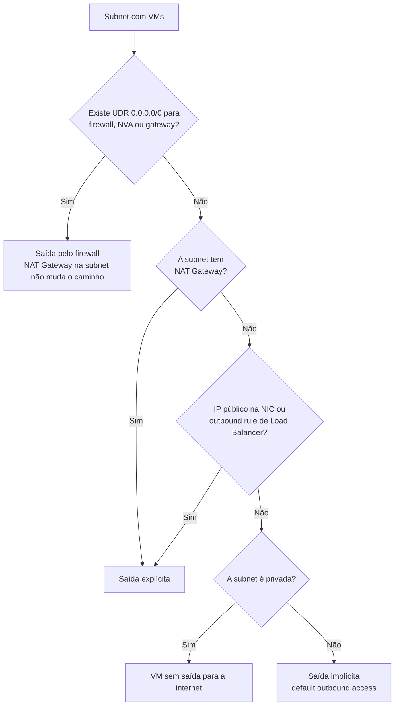

Fala pessoALL! Tudo em ordem por aí?

Durante muitos anos, uma VM criada no Azure sem IP público, sem NAT Gateway e sem Load Balancer chegava na internet do mesmo jeito. A plataforma colocava um IP público de saída por baixo dos panos e a vida seguia. Esse comportamento tem nome: **default outbound access**.

E muita coisa foi construída em cima dele sem que alguém tivesse decidido isso. O `apt update` que funciona, o Windows Update, a ativação do Windows, o agente que fala com um endpoint público, o script de pós-deploy que baixa um pacote.

Só que a regra mudou. Segundo a documentação oficial, nas versões de API liberadas depois de **31 de março de 2026** as subnets de VNets novas nascem com `defaultOutboundAccess` igual a `false`, ou seja, como **subnets privadas**. O Portal já cria assim. Eu esbarrei nisso no artigo de [Azure Image Builder](https://blog.ruizsolutions.online/posts/azure-image-builder-windows-linux/#passo-4---criando-o-nat-gateway), quando precisei colocar um NAT Gateway na frente da VM de build para ela conseguir baixar atualização.

Agora, o ponto que mais gera confusão: **nada foi desligado nas VNets que já existiam**.

O título fala em "fim", mas o que acabou foi o padrão. As VNets antigas continuam entregando o IP implícito, tanto para as VMs que já estavam lá quanto para as VMs novas criadas dentro delas, até alguém transformar a subnet em privada. Ficamos então com dois problemas bem diferentes. Na VNet nova, a VM sobe e não consegue nem rodar um `apt update`. Na VNet antiga, tudo funciona apoiado em um IP que é da Microsoft e que pode mudar sem aviso.

<!-- LUIZ: você já pegou uma VM recém-criada em VNet nova (Portal, Bicep ou Terraform) que subiu sem saída e o time demorou para entender o motivo? Se sim, cabe uma ou duas frases aqui, sem identificar o ambiente. -->

**Neste artigo, vamos reproduzir os dois casos em laboratório: uma subnet com a saída implícita antiga e uma subnet privada sem saída nenhuma. Em seguida criaremos um NAT Gateway para dar saída explícita, descobriremos com Resource Graph quem ainda depende do acesso implícito e migraremos a subnet antiga do jeito certo.**

> NAT Gateway na subnet não resolve todo ambiente. Se a subnet já tem uma UDR mandando `0.0.0.0/0` para um firewall ou NVA, o tráfego continua indo para lá e o NAT Gateway associado a ela não muda o caminho. Em topologia hub-and-spoke com inspeção centralizada, a saída é decidida no hub e a conversa começa com o time de Segurança.
{: .prompt-warning }

---

## Mas antes, o que mudou de verdade?

Vamos separar o que a documentação afirma do que virou boato de corredor.

A mudança em si é pequena. VNet nova, criada com a versão de API posterior a 31/03/2026, nasce com subnets privadas. VM em subnet privada não recebe IP de saída implícito e precisa de um método explícito para alcançar qualquer endpoint público, na internet ou dentro da própria Microsoft. Isso vale para Portal, CLI, PowerShell e templates.

As VNets existentes não foram alteradas. As VMs dentro delas continuam recebendo o IP implícito, e as VMs novas criadas nelas também. Quem já usa um método explícito continua com ele.

Existe um terceiro grupo, e é nele que eu vejo o maior risco: deploy com template ARM, Bicep ou Terraform preso em versão antiga de API. Ele continua criando subnet com a propriedade nula, que na prática permite a saída implícita. No dia em que alguém atualizar a versão da API ou do provider, as subnets novas passam a nascer privadas e o pipeline que funcionava há anos começa a entregar VM sem internet.

E por que a Microsoft recomenda abandonar a saída implícita mesmo onde ela ainda funciona? Os motivos da documentação são bem objetivos:

* O IP é da Microsoft e **pode mudar sem aviso**;
* Com várias NICs na mesma VM, os IPs de saída podem divergir;
* Em Virtual Machine Scale Sets os IPs mudam conforme o conjunto escala;
* Não há suporte a pacotes fragmentados nem a ping ICMP.

Sendo bem sincero, o primeiro item já bastaria. Se um firewall de parceiro libera o seu acesso por IP de origem e esse IP é o implícito, a liberação está apoiada em algo que você não controla.

> Subnets delegadas ou gerenciadas por serviços PaaS ficam fora dessa conversa. A documentação diz que a subnet privada não se aplica a elas, porque ali a saída é responsabilidade do próprio serviço. Já os Virtual Machine Scale Sets em orquestração Flexible nunca recebem IP implícito, com ou sem subnet privada.
{: .prompt-info }

---

## As quatro saídas explícitas, lado a lado

A documentação lista quatro formas de dar saída explícita. Coloquei na mesma tabela o que pesa na hora de escolher:

| Método | Onde se configura | Quando eu usaria | O cuidado |
| --- | --- | --- | --- |
| **NAT Gateway** | Subnet | Na maioria dos casos. É o método que a Microsoft recomenda | Passa na frente dos outros métodos. O IP de saída de toda a subnet muda no momento da associação |
| **Outbound rule em Load Balancer Standard** | Backend pool | Quando já existe um Load Balancer público na frente das VMs | 64.000 portas SNAT por IP de frontend, divididas entre as VMs do pool. Só TCP e UDP, sem ICMP |
| **IP público Standard na NIC** | VM | VM isolada que realmente precisa de endereço próprio | Cada VM vira um ponto exposto e dependente de NSG bem feito. Não escala |
| **Firewall ou NVA com UDR** | Route table da subnet | Ambiente com inspeção e filtro de saída centralizados | Em subnet privada, rotas com next hop `Internet` param de funcionar sem outro método explícito |

Alguns detalhes que só aparecem quando se lê a documentação até o fim:

O **NAT Gateway** entrega 64.512 portas SNAT por IP público, aceita até 16 IPs e distribui as portas sob demanda entre as VMs da subnet. Conexão iniciada de fora não entra por ele. É por isso que ele é a minha primeira escolha quando a necessidade é só sair.

No **Load Balancer**, a recomendação é alocar as portas manualmente na outbound rule. A própria Microsoft classifica esse método como válido para produção, "mas não em escala". E tem uma pegadinha documentada: backend pool configurado **por endereço IP** se comporta como Load Balancer Basic e continua usando a saída implícita. O pool precisa estar configurado por NIC.

O **IP público na NIC** não faz SNAT. É um NAT 1:1, a VM fica com todas as portas efêmeras disponíveis e sai com TCP, UDP, ICMP e ESP. Funciona, mas em ambiente real eu não oriento usar como padrão: vinte VMs viram vinte IPs públicos para proteger.

No **firewall com UDR**, lembre que o Azure Firewall tem 2.496 portas SNAT por IP público para cada instância de backend. Quando isso aperta, a saída documentada é associar um NAT Gateway à `AzureFirewallSubnet`, e o firewall passa a sair pelo IP do NAT.

Quando mais de um método existe ao mesmo tempo, a ordem de precedência documentada é esta:

```text
UDR para virtual appliance ou virtual network gateway
  > NAT Gateway
    > IP público na NIC
      > Outbound rule do Load Balancer
        > Rota padrão do sistema para a internet
```

O raciocínio que eu sigo para cada subnet com VMs fica assim:



---

## Pré-requisitos

* Uma assinatura de laboratório com permissão de **Contributor** no Resource Group que vamos criar. Em ambiente real, **Network Contributor** cobre a parte de rede e **Virtual Machine Contributor** o stop e start das VMs;
* Permissão de **Reader** nas assinaturas que você quiser inventariar com Advisor e Resource Graph;
* **Azure Cloud Shell** em modo Bash, ou Azure CLI atualizado na sua máquina com o `jq` instalado;
* Uma senha forte em mãos para as duas VMs de teste.

> Este laboratório foge do `West US 2` que eu costumo usar e vai para **East US 2** (`eastus2`). O motivo é o **Bastion Developer**, que não tem custo e é o jeito mais simples de entrar em VM sem IP público: ele só existe em algumas regiões, e West US 2 não está na lista. East US 2 está, e também aceita o NAT Gateway StandardV2.
{: .prompt-info }

> Esse laboratório gera custo. As duas VMs cobram por hora ligada, os discos cobram mesmo com a VM parada e o NAT Gateway tem cobrança própria enquanto existir. O Bastion Developer é gratuito. Consulte a página de preços do NAT Gateway e rode a limpeza do final do artigo no mesmo dia.
{: .prompt-warning }

---

## Mão na massa!

### Passo 1 - Criar a VNet com uma subnet legada e uma subnet privada

Para enxergar a diferença, vamos ter na mesma VNet uma subnet que se comporta como as antigas e outra que nasce privada. Eu declaro o `--default-outbound-access` nas duas de propósito. Assim o resultado não depende da versão do CLI que você estiver usando, e esse já é o primeiro aprendizado do artigo: **propriedade declarada não muda quando o padrão da plataforma muda**.

No Cloud Shell, crie o Resource Group e a VNet:

```bash
RG=rg-outbound-lab-eus2-001
LOC=eastus2
VNET=vnet-outbound-lab-eus2-001

az group create --name $RG --location $LOC

az network vnet create \
  --resource-group $RG \
  --name $VNET \
  --location $LOC \
  --address-prefix 10.60.0.0/16
```

> As variáveis valem só para a sessão atual do Cloud Shell. Se a sessão cair, declare `RG`, `LOC` e `VNET` de novo antes de continuar.
{: .prompt-tip }

Agora as duas subnets:

```bash
az network vnet subnet create \
  --resource-group $RG \
  --vnet-name $VNET \
  --name snet-outbound-legacy-eus2-001 \
  --address-prefixes 10.60.1.0/24 \
  --default-outbound-access true

az network vnet subnet create \
  --resource-group $RG \
  --vnet-name $VNET \
  --name snet-outbound-private-eus2-001 \
  --address-prefixes 10.60.2.0/24 \
  --default-outbound-access false
```

Confira como cada uma ficou:

```bash
az network vnet subnet list \
  --resource-group $RG \
  --vnet-name $VNET \
  --query "[].{Subnet:name, DefaultOutbound:defaultOutboundAccess, NatGateway:natGateway.id}" \
  --output table
```

<!-- PRINT 002: Cloud Shell com a saída em tabela do az network vnet subnet list, mostrando snet-outbound-legacy-eus2-001 com DefaultOutbound True, snet-outbound-private-eus2-001 com DefaultOutbound False e a coluna NatGateway vazia nas duas -->
{: .shadow .rounded-10 }
<br>

Vale olhar a mesma coisa no Portal, porque é lá que a maioria das pessoas vai procurar:

1. Pesquise por **Virtual networks** e abra a `vnet-outbound-lab-eus2-001`;
2. No menu lateral, clique em **Subnets**;
3. Abra a `snet-outbound-legacy-eus2-001` e localize a configuração **Default outbound access**, que deve estar como **Enabled**;
4. Abra a `snet-outbound-private-eus2-001` e confira que a mesma configuração está como **Disabled**.

<!-- PRINT 003: Portal, Virtual networks > vnet-outbound-lab-eus2-001 > Subnets > snet-outbound-legacy-eus2-001 aberta, com a configuração Default outbound access em Enabled -->
{: .shadow .rounded-10 }
<br>

<!-- PRINT 004: Portal, Virtual networks > vnet-outbound-lab-eus2-001 > Subnets > snet-outbound-private-eus2-001 aberta, com a configuração Default outbound access em Disabled -->
{: .shadow .rounded-10 }
<br>

> Na tela de criação de VNet e de subnet, a mesma propriedade aparece com outro nome: a caixa **Enable private subnet (no default outbound access)**. São três nomes para a mesma coisa, `defaultOutboundAccess` na API, **Private subnet** na criação e **Default outbound access** na edição. Procure pelo conceito, porque a Microsoft adora mudar o layout do Portal.
{: .prompt-info }

---

### Passo 2 - Criar as duas VMs sem IP público

Uma VM em cada subnet, as duas sem IP público. A única diferença entre elas é a subnet.

Primeiro guarde a senha em uma variável sem deixá-la no histórico do shell:

```bash
read -s -p "Senha das VMs do laboratório: " VM_PASSWORD; echo
```

Crie a VM da subnet legada. O `--public-ip-address ""` é o que impede a criação do IP público:

```bash
az vm create \
  --resource-group $RG \
  --name vm-outbound-legacy-001 \
  --location $LOC \
  --image Ubuntu2404 \
  --size Standard_B2s \
  --vnet-name $VNET \
  --subnet snet-outbound-legacy-eus2-001 \
  --public-ip-address "" \
  --admin-username azureuser \
  --admin-password "$VM_PASSWORD" \
  --authentication-type all \
  --generate-ssh-keys
```

E a VM da subnet privada:

```bash
az vm create \
  --resource-group $RG \
  --name vm-outbound-private-001 \
  --location $LOC \
  --image Ubuntu2404 \
  --size Standard_B2s \
  --vnet-name $VNET \
  --subnet snet-outbound-private-eus2-001 \
  --public-ip-address "" \
  --admin-username azureuser \
  --admin-password "$VM_PASSWORD" \
  --authentication-type all \
  --generate-ssh-keys
```

Repare que nada no comando avisa que a segunda VM vai nascer sem saída. O Azure não reclama de VM sem internet, ele só entrega.

<!-- PRINT 005: Portal, Virtual machines > vm-outbound-private-001 > Overview, mostrando o campo Public IP address vazio e a subnet snet-outbound-private-eus2-001 -->
{: .shadow .rounded-10 }
<br>

---

### Passo 3 - Testar a saída de dentro de cada VM

Hora de ver o comportamento com os próprios olhos. Vamos entrar pelo **Bastion Developer**, que é implantado sozinho na primeira conexão.

1. Abra a VM `vm-outbound-legacy-001` no Portal;
2. No menu lateral, clique em **Connect** e depois em **Bastion**;
3. Em **Authentication Type**, escolha a autenticação por senha;
4. Informe o usuário `azureuser` e a senha definida no Passo 2;
5. Clique em **Connect**.

<!-- PRINT 006: Portal, vm-outbound-legacy-001 > Connect > Bastion, com Authentication Type em senha, Username azureuser preenchido e o botão Connect visível -->
{: .shadow .rounded-10 }
<br>

No terminal da VM, pergunte para a internet com qual IP você está chegando:

```bash
curl -m 10 ifconfig.me
```

<!-- PRINT 007: sessão do Bastion na vm-outbound-legacy-001 com o curl -m 10 ifconfig.me retornando um IP público, que é o IP de saída implícito -->
{: .shadow .rounded-10 }
<br>

Voltou um IP público. Anote esse endereço e procure por ele em **Public IP addresses** na sua assinatura.

Não vai achar.

Esse IP é da Microsoft e pode ser trocado sem aviso.

Agora encerre a sessão e conecte na `vm-outbound-private-001` pelo mesmo caminho. O Bastion Developer atende uma VM por vez, então feche uma antes de abrir a outra. Repita o teste e tente também atualizar a lista de pacotes:

```bash
curl -m 10 ifconfig.me
sudo apt update
```

<!-- PRINT 008: sessão do Bastion na vm-outbound-private-001 com o curl -m 10 ifconfig.me terminando em timeout e o sudo apt update falhando ao conectar nos repositórios -->
{: .shadow .rounded-10 }
<br>

Timeout nos dois.

Não tem NSG bloqueando nem rota errada. A VM simplesmente não tem por onde sair. É isso que acontece hoje com quem cria uma VNet nova e espera o comportamento de antes.

> Se uma VM nova não ativa o Windows ou não alcança repositório, olhe a subnet antes de mexer em NSG ou abrir chamado. A documentação é direta: ativação e atualização de S.O. exigem um método explícito de saída em subnet privada.
{: .prompt-danger }

Um detalhe que a documentação registra: mesmo sem nenhum método de saída, a VM em subnet privada ainda alcança Storage Accounts **da mesma região**. "Sem saída" não quer dizer "isolada", e quem precisa controlar o que sai continua precisando de NSG.

---

### Passo 4 - Criar o NAT Gateway e associar à subnet privada

Vou usar o SKU **StandardV2**. Ele é zone-redundant, tem o mesmo preço do Standard segundo a documentação e é o SKU usado no tutorial oficial de migração da saída implícita. O Standard é zonal: fica em uma única zona ou em "No zone".

No artigo do Image Builder eu usei o **Standard**, e ele continua atendendo. Para dar saída a uma subnet os dois funcionam do mesmo jeito. O que o StandardV2 muda é a redundância entre zonas.

A documentação hoje apresenta o StandardV2 sem rótulo de preview. O que ainda aparece como preview é o uso dele como NAT Gateway gerenciado do AKS. Um detalhe para quem preferir o Portal: o quickstart oficial do StandardV2 ainda manda abrir o **Azure preview portal** nos passos de tela. Aqui vamos pelo CLI.

Três restrições do StandardV2 que precisam estar no radar antes de escolher:

* Só aceita IP público ou prefixo **StandardV2**. IP público Standard não serve;
* Não existe upgrade de Standard para StandardV2. É criar outro e trocar na subnet;
* Não está disponível em todas as regiões. A lista de exceções muda de uma página da documentação para outra, então confira a região na página de SKUs antes de padronizar. East US 2 não aparece em nenhuma delas.

Crie o IP público e o NAT Gateway:

```bash
az network public-ip create \
  --resource-group $RG \
  --name pip-nat-outbound-lab-eus2-001 \
  --location $LOC \
  --sku StandardV2 \
  --allocation-method Static \
  --version IPv4 \
  --zone 1 2 3

az network nat gateway create \
  --resource-group $RG \
  --name nat-outbound-lab-eus2-001 \
  --location $LOC \
  --public-ip-addresses pip-nat-outbound-lab-eus2-001 \
  --idle-timeout 4 \
  --sku StandardV2 \
  --zone 1 2 3
```

O `--idle-timeout 4` é o padrão de 4 minutos para conexão TCP ociosa e pode ir até 120.

Anote o IP que será a sua saída a partir de agora:

```bash
az network public-ip show \
  --resource-group $RG \
  --name pip-nat-outbound-lab-eus2-001 \
  --query ipAddress \
  --output tsv
```

<!-- PRINT 009: Cloud Shell com o retorno do az network public-ip show exibindo o endereço IP do pip-nat-outbound-lab-eus2-001 -->
{: .shadow .rounded-10 }
<br>

O mesmo endereço aparece no Portal:

1. Pesquise por **NAT gateways** e abra o `nat-outbound-lab-eus2-001`;
2. Expanda **Settings** e clique em **Outbound IP**.

<!-- PRINT 010: Portal, NAT gateways > nat-outbound-lab-eus2-001 > Settings > Outbound IP, mostrando o pip-nat-outbound-lab-eus2-001 e o endereço IP associado -->
{: .shadow .rounded-10 }
<br>

Agora o passo que de fato dá a saída, que é associar o NAT Gateway à subnet privada:

```bash
az network vnet subnet update \
  --resource-group $RG \
  --vnet-name $VNET \
  --name snet-outbound-private-eus2-001 \
  --nat-gateway nat-outbound-lab-eus2-001
```

<!-- PRINT 011: Portal, vnet-outbound-lab-eus2-001 > Subnets > snet-outbound-private-eus2-001 aberta, com o campo NAT gateway apontando para nat-outbound-lab-eus2-001 e Default outbound access em Disabled -->
{: .shadow .rounded-10 }
<br>

NAT Gateway criado e não associado a subnet nenhuma é só custo. Parece óbvio, mas é exatamente o que sobra quando alguém cria pelo Portal e pula a aba **Networking**.

---

### Passo 5 - Validar a saída pelo NAT Gateway

Volte na `vm-outbound-private-001` pelo Bastion e repita o teste do Passo 3:

```bash
curl -m 10 ifconfig.me
sudo apt update
```

<!-- PRINT 012: sessão do Bastion na vm-outbound-private-001 com o curl -m 10 ifconfig.me retornando o mesmo IP do pip-nat-outbound-lab-eus2-001 e o sudo apt update concluindo com sucesso -->
{: .shadow .rounded-10 }
<br>

O IP retornado precisa ser o mesmo que você anotou no Passo 4.

Não foi preciso criar rota, reiniciar a VM nem mexer em NSG. O NAT Gateway passa a valer assim que é associado à subnet, e agora o IP de saída é um recurso seu, que aparece no inventário e pode ser informado para quem libera o acesso do outro lado.

---

### Passo 6 - Descobrir quem ainda depende da saída implícita

No laboratório nós sabemos qual VM está na subnet legada. Em um ambiente com dezenas de VNets espalhadas por várias assinaturas, ninguém sabe de cabeça. A documentação oferece o Advisor, e eu complemento com Resource Graph porque um mostra as NICs e o outro mostra as subnets.

#### Pelo Advisor

1. Pesquise por **Advisor** no Portal;
2. Clique em **Operational Excellence**;
3. Procure as recomendações **Add explicit outbound method to disable default outbound** e **Add explicit outbound method to disable default outbound for Virtual Machine Scale Sets**;
4. Abra a recomendação para ver a lista de NICs com IP de saída implícito.

<!-- PRINT 013: Portal, Advisor > Operational Excellence, com a recomendação "Add explicit outbound method to disable default outbound" visível na lista de recomendações -->
{: .shadow .rounded-10 }
<br>

> Se a recomendação ainda não aparecer para as VMs que você acabou de criar, siga pelo Resource Graph. Para o laboratório ele é o caminho mais direto.
{: .prompt-info }

#### Pelo Resource Graph

Se você ainda não usou o Resource Graph Explorer, eu mostrei o básico no artigo [Resource Graph na prática](https://blog.ruizsolutions.online/posts/azure-resource-graph-consultas-essenciais/).

**Os arquivos deste passo estão no meu repositório: [Default Outbound Access](https://github.com/lfrleite/Ruiz-Online/tree/main/Default%20Outbound%20Access)**

A primeira consulta lista toda subnet que **não** está marcada como privada e mostra se ela já tem NAT Gateway, route table ou delegação. Arquivo `subnets-nao-privadas.kql`:

```kusto
// Subnets que ainda não são privadas (defaultOutboundAccess diferente de false).
// Coluna defaultOutboundAccess vazia = propriedade nula, que se comporta como true.
resources
| where type =~ 'microsoft.network/virtualnetworks'
| extend subnets = properties.subnets
| mv-expand subnets limit 2000
| extend subnetId = tostring(subnets.id)
| extend subnetName = tostring(subnets.name)
| extend defaultOutboundAccess = tostring(subnets.properties.defaultOutboundAccess)
| extend natGateway = tostring(subnets.properties.natGateway.id)
| extend routeTable = tostring(subnets.properties.routeTable.id)
| extend delegacoes = array_length(subnets.properties.delegations)
| where defaultOutboundAccess !~ 'false'
| project subnetId, subscriptionId, resourceGroup, vnet = name, subnetName, defaultOutboundAccess, natGateway, routeTable, delegacoes
| order by subnetId asc
```

<!-- PRINT 014: Resource Graph Explorer com a consulta subnets-nao-privadas.kql executada e o resultado mostrando a snet-outbound-legacy-eus2-001 com defaultOutboundAccess true e as colunas natGateway e routeTable vazias -->
{: .shadow .rounded-10 }
<br>

Como ler o resultado:

* `defaultOutboundAccess` **vazio** é subnet criada antes da mudança ou por API antiga. Comporta-se como `true`;
* `natGateway` preenchido significa que a saída já é explícita e só falta tornar a subnet privada;
* `routeTable` preenchido pede que você abra a tabela e veja para onde vai o `0.0.0.0/0`;
* `delegacoes` maior que zero é subnet delegada a um serviço. Deixe fora da lista de trabalho.

O `limit 2000` no `mv-expand` está ali porque o Resource Graph expande por padrão só 128 itens por registro. Sem ele, uma VNet com mais subnets do que isso voltaria cortada.

<!-- VALIDAR: a documentação cita o parâmetro defaultOutboundConnectivityEnabled na NIC, mas não traz consulta de Resource Graph nem exemplo de CLI com ele. Conferir no laboratório se properties.defaultOutboundConnectivityEnabled existe na tabela resources e se retorna true para a NIC da vm-outbound-legacy-001. Se o campo vier com outro nome ou vazio, ajustar a consulta, o arquivo nics-saida-implicita.kql e o print 015. -->

A segunda consulta vai direto nas NICs. A documentação cita um parâmetro no nível da NIC, o `defaultOutboundConnectivityEnabled`, que indica se a plataforma alocou IP implícito para aquela interface. Arquivo `nics-saida-implicita.kql`:

```kusto
// NICs em que a plataforma alocou IP de saída implícito (default outbound access).
resources
| where type =~ 'microsoft.network/networkinterfaces'
| where properties.defaultOutboundConnectivityEnabled == true
| extend vm = tostring(properties.virtualMachine.id)
| extend subnetId = tostring(properties.ipConfigurations[0].properties.subnet.id)
| project nicId = id, subscriptionId, resourceGroup, nic = name, vm, subnetId
| order by nicId asc
```

<!-- PRINT 015: Resource Graph Explorer com a consulta nics-saida-implicita.kql executada e o resultado mostrando a NIC da vm-outbound-legacy-001 na snet-outbound-legacy-eus2-001 -->
{: .shadow .rounded-10 }
<br>

#### Em escala, com script

Para levar isso a uma reunião de planejamento, tela de Portal não serve. O script abaixo roda as duas consultas com `az graph query`, pagina de mil em mil registros e grava um CSV para cada uma. Ele só lê, não altera nada. Se a resposta do CLI vier em formato diferente do esperado, ele para com erro em vez de dizer que não achou nada. Arquivo `inventario-saida-implicita.sh`:

```bash
#!/usr/bin/env bash
# inventario-saida-implicita.sh
# Lista as subnets que ainda não são privadas e as NICs com IP de saída implícito,
# usando o Azure Resource Graph, e grava um CSV para cada consulta.
#
# Uso:
#   bash inventario-saida-implicita.sh                          # assinaturas a que você tem acesso
#   bash inventario-saida-implicita.sh -s <subscriptionId>      # uma assinatura
#   bash inventario-saida-implicita.sh -m <managementGroupId>   # um management group
#   bash inventario-saida-implicita.sh -o ./saida               # pasta de destino dos CSVs
#
# Requisitos: Azure CLI com sessão ativa (az login), jq e permissão de Reader no escopo.
# O script só lê. Nenhum recurso é alterado.

set -euo pipefail

SCRIPT_DIR="$(cd "$(dirname "${BASH_SOURCE[0]}")" && pwd)"
PAGE_SIZE=1000
OUT_DIR="."
SCOPE_ARGS=()

usage() {
  sed -n '2,13p' "${BASH_SOURCE[0]}" | sed 's/^# \{0,1\}//'
}

fail() {
  echo "ERRO: $*" >&2
  exit 1
}

while [[ $# -gt 0 ]]; do
  case "$1" in
    -s|--subscription)
      [[ $# -ge 2 ]] || fail "informe o ID da assinatura depois de $1"
      SCOPE_ARGS=(--subscriptions "$2"); shift 2 ;;
    -m|--management-group)
      [[ $# -ge 2 ]] || fail "informe o ID do management group depois de $1"
      SCOPE_ARGS=(--management-groups "$2"); shift 2 ;;
    -o|--output-dir)
      [[ $# -ge 2 ]] || fail "informe a pasta de destino depois de $1"
      OUT_DIR="$2"; shift 2 ;;
    -h|--help)
      usage; exit 0 ;;
    *)
      usage >&2; fail "parâmetro desconhecido: $1" ;;
  esac
done

command -v az >/dev/null 2>&1 || fail "Azure CLI não encontrado. Use o Cloud Shell ou instale o az."
command -v jq >/dev/null 2>&1 || fail "jq não encontrado. Instale o jq ou use o Cloud Shell."
az account show >/dev/null 2>&1 || fail "sem sessão no Azure. Execute az login antes."

mkdir -p "$OUT_DIR" || fail "não foi possível criar a pasta $OUT_DIR"

WORK_DIR="$(mktemp -d)"
trap 'rm -rf "$WORK_DIR"' EXIT

# Executa uma consulta .kql com paginação e grava o resultado em CSV.
run_query() {
  local kql_file="$1" csv_file="$2" label="$3"
  local query rows total page_file
  local skip=0 page=0
  local skip_args=()

  [[ -f "$kql_file" ]] || fail "arquivo de consulta não encontrado: $kql_file"

  # Remove as linhas de comentário e junta a consulta em uma linha só.
  query="$(grep -vE '^[[:space:]]*//' "$kql_file" | tr '\n' ' ')"

  rm -f "$WORK_DIR"/page-*.json

  while :; do
    page_file="$(printf '%s/page-%05d.json' "$WORK_DIR" "$page")"

    skip_args=()
    if [[ "$skip" -gt 0 ]]; then
      skip_args=(--skip "$skip")
    fi

    if ! az graph query -q "$query" --first "$PAGE_SIZE" \
        ${skip_args[@]+"${skip_args[@]}"} \
        ${SCOPE_ARGS[@]+"${SCOPE_ARGS[@]}"} \
        --query "data" --output json > "$page_file"; then
      fail "a consulta de $label falhou. Confira a mensagem do az acima."
    fi

    # Sem esta checagem, uma resposta em formato inesperado viraria "nenhum registro".
    if ! jq -e 'type == "array"' "$page_file" >/dev/null 2>&1; then
      fail "a resposta de $label não veio como lista de registros. Rode o az graph query na mão e confira o formato da saída."
    fi

    rows="$(jq 'length' "$page_file")"
    if [[ "$rows" -lt "$PAGE_SIZE" ]]; then
      break
    fi

    skip=$((skip + PAGE_SIZE))
    page=$((page + 1))
  done

  jq -s 'add' "$WORK_DIR"/page-*.json > "$WORK_DIR/all.json"
  total="$(jq 'length' "$WORK_DIR/all.json")"

  if [[ "$total" -eq 0 ]]; then
    echo "$label: nenhum registro encontrado."
    return 0
  fi

  jq -r '(.[0] | keys_unsorted) as $cols
         | ($cols | @csv),
           (.[] | [ .[$cols[]] ] | map(if . == null then "" else tostring end) | @csv)' \
    "$WORK_DIR/all.json" > "$csv_file"

  echo "$label: $total registro(s) em $csv_file"
}

STAMP="$(date +%Y%m%d-%H%M%S)"

run_query "$SCRIPT_DIR/subnets-nao-privadas.kql" \
  "$OUT_DIR/subnets-nao-privadas-$STAMP.csv" "Subnets não privadas"

run_query "$SCRIPT_DIR/nics-saida-implicita.kql" \
  "$OUT_DIR/nics-saida-implicita-$STAMP.csv" "NICs com saída implícita"

echo "Concluído."
```

Para executar no Cloud Shell, com os três arquivos na mesma pasta:

```bash
git clone https://github.com/lfrleite/Ruiz-Online.git
cd "Ruiz-Online/Default Outbound Access"
bash inventario-saida-implicita.sh -o ./inventario
```

Sem parâmetro de escopo, o Resource Graph consulta todas as assinaturas a que você tem acesso. Use `-s` para uma assinatura ou `-m` para um management group. A saída tem este formato (os números abaixo são só exemplo):

```text
Subnets não privadas: 3 registro(s) em ./inventario/subnets-nao-privadas-20261119-093000.csv
NICs com saída implícita: 5 registro(s) em ./inventario/nics-saida-implicita-20261119-093000.csv
Concluído.
```

<!-- PRINT 016: Cloud Shell com a execução do inventario-saida-implicita.sh e as duas linhas de resultado indicando os arquivos CSV gerados na pasta inventario -->
{: .shadow .rounded-10 }
<br>

<!-- LUIZ: quando você rodou um levantamento desse tipo pela primeira vez, o que apareceu que ninguém esperava (subnet esquecida, VM de teste antiga, ambiente inteiro saindo por IP implícito)? Uma frase genérica, sem números reais. -->

---

### Passo 7 - Migrar a subnet legada

Aqui é onde mora o risco em ambiente real. A ordem importa:

**Primeiro a saída explícita. Depois a subnet privada. Por último o deallocate.**

Invertendo a ordem, você tira a internet das VMs na primeira vez em que elas forem desalocadas.

Comece associando o mesmo NAT Gateway à subnet legada:

```bash
az network vnet subnet update \
  --resource-group $RG \
  --vnet-name $VNET \
  --name snet-outbound-legacy-eus2-001 \
  --nat-gateway nat-outbound-lab-eus2-001
```

Conecte na `vm-outbound-legacy-001` pelo Bastion e rode o `curl -m 10 ifconfig.me` de novo:

<!-- PRINT 017: sessão do Bastion na vm-outbound-legacy-001 com o curl -m 10 ifconfig.me retornando agora o IP do pip-nat-outbound-lab-eus2-001, diferente do IP do print 007 -->
{: .shadow .rounded-10 }
<br>

O IP de saída mudou sem reiniciar nada.

> Esse é o impacto que precisa estar escrito na GMUD. Toda conexão nova da subnet passa a sair pelo IP do NAT Gateway, inclusive das VMs que tinham IP público próprio na NIC, porque o NAT Gateway tem precedência. Liberação por IP de origem em firewall de parceiro, API de terceiro ou banco externo vai parar de funcionar até o IP novo ser liberado do outro lado. Levante esses destinos e peça a liberação antes da janela. No SKU StandardV2 existe ainda um problema conhecido documentado: conexões já abertas por Load Balancer, Azure Firewall ou IP público na NIC podem ser interrompidas no momento em que o NAT Gateway entra na subnet.
{: .prompt-danger }

<!-- LUIZ: você já viu uma liberação por IP de origem quebrar depois da entrada de um NAT Gateway ou de uma troca de IP de saída? Uma frase curta sobre como foi descoberto, sem identificar o ambiente, cabe logo depois deste aviso. -->

A subnet ainda não é privada. A documentação avisa que, nessa situação, o IP implícito pode continuar alocado para a VM mesmo sem ser usado, e o alerta do Advisor não some. Torne a subnet privada:

```bash
az network vnet subnet update \
  --resource-group $RG \
  --vnet-name $VNET \
  --name snet-outbound-legacy-eus2-001 \
  --default-outbound-access false
```

<!-- PRINT 018: Portal, vnet-outbound-lab-eus2-001 > Subnets > snet-outbound-legacy-eus2-001 aberta, com Default outbound access em Disabled e o campo NAT gateway apontando para nat-outbound-lab-eus2-001 -->
{: .shadow .rounded-10 }
<br>

<!-- VALIDAR: conferir se o az network nic show devolve a propriedade defaultOutboundConnectivityEnabled e quais valores aparecem antes do deallocate e depois do start (esperado: true antes, false ou vazio depois). O print 019 e o erro comum do Advisor dependem disso. -->

Antes de mexer na VM, consulte o parâmetro na NIC:

```bash
NIC_ID=$(az vm show \
  --resource-group $RG \
  --name vm-outbound-legacy-001 \
  --query "networkProfile.networkInterfaces[0].id" \
  --output tsv)

az network nic show --ids $NIC_ID --query defaultOutboundConnectivityEnabled
```

Para a mudança da subnet valer na NIC, a documentação exige **stop e deallocate** da VM. Um restart comum não é o que a documentação pede:

```bash
az vm deallocate --resource-group $RG --name vm-outbound-legacy-001
az vm start --resource-group $RG --name vm-outbound-legacy-001
```

> O deallocate derruba a VM. A aplicação fica fora do ar até o start terminar e o conteúdo do disco temporário pode ser perdido. Em produção isso é mudança com janela de manutenção, GMUD aprovada e validação da aplicação na volta, em lotes pequenos.
{: .prompt-danger }

Repita a consulta da NIC e compare com o valor anterior:

<!-- PRINT 019: Cloud Shell com as duas execuções do az network nic show para a NIC da vm-outbound-legacy-001, antes do deallocate e depois do start, mostrando a mudança no valor de defaultOutboundConnectivityEnabled -->
{: .shadow .rounded-10 }
<br>

Para fechar, execute de novo as duas consultas do Passo 6. Nenhuma delas deve trazer recursos do `rg-outbound-lab-eus2-001`.

> O Resource Graph pode levar alguns minutos para refletir a mudança. Se a NIC ainda aparecer logo depois do start, espere um pouco e rode de novo antes de concluir que não funcionou.
{: .prompt-tip }

O caminho de volta existe e segue a mesma regra, subnet não privada e novo deallocate, mas eu não oriento usar isso como rollback. Rollback de verdade aqui é manter o NAT Gateway e corrigir o que faltou liberar.

---

## Erros comuns

### VM nova sem acesso à internet

Subnet privada sem método explícito de saída. Confira as três propriedades de uma vez:

```bash
az network vnet subnet show \
  --resource-group $RG \
  --vnet-name $VNET \
  --name snet-outbound-private-eus2-001 \
  --query "{DefaultOutbound:defaultOutboundAccess, NatGateway:natGateway.id, RouteTable:routeTable.id}"
```

`DefaultOutbound` igual a `false` com `NatGateway` e `RouteTable` nulos fecha o diagnóstico: a subnet é privada e não tem por onde sair.

---

### NAT Gateway associado e o IP de saída não mudou

Quase sempre existe uma UDR mandando `0.0.0.0/0` para um virtual appliance ou gateway, e ela tem precedência sobre o NAT Gateway. Veja as rotas efetivas da NIC, com a VM ligada (a variável `NIC_ID` é a mesma do Passo 7):

```bash
az network nic show-effective-route-table \
  --ids $NIC_ID \
  --output table
```

Se a rota ativa para `0.0.0.0/0` tem next hop `VirtualAppliance` ou `VirtualNetworkGateway`, a saída é pelo firewall e o NAT Gateway nessa subnet não entra no caminho.

---

### Rotas para Service Tags com next hop Internet pararam de funcionar

É comum ter uma UDR geral para o firewall e exceções para algumas Service Tags com next hop `Internet`, justamente para pular a inspeção. Em subnet privada essas exceções quebram, porque o next hop `Internet` dependia da saída implícita. O comando de rotas efetivas acima mostra quais rotas da subnet estão nessa situação. A correção é dar um método explícito para a subnet ou mandar esse tráfego pelo firewall.

Service Endpoint não entra nessa conta. Ele usa o next hop `VirtualNetworkServiceEndpoint` e continua funcionando.

---

### Alerta do Advisor continua mesmo com NAT Gateway

Faltou tornar a subnet privada ou faltou o stop e deallocate da VM. O parâmetro na NIC mostra em que ponto você parou:

```bash
az network nic show --ids $NIC_ID --query defaultOutboundConnectivityEnabled
```

---

### Erro ao criar o NAT Gateway StandardV2 com um IP público que já existia

StandardV2 só aceita IP público StandardV2. Confira o SKU do IP que você tentou usar:

```bash
az network public-ip show \
  --resource-group $RG \
  --name pip-nat-outbound-lab-eus2-001 \
  --query sku.name \
  --output tsv
```

Se retornar `Standard`, crie um IP novo com `--sku StandardV2` ou use o NAT Gateway no SKU Standard.

---

### VMs atrás de Load Balancer continuam com saída implícita

Backend pool configurado por endereço IP. É um problema conhecido e documentado: nesse formato o pool se comporta como Load Balancer Basic. Reconfigure o pool por NIC ou associe um NAT Gateway à subnet das VMs.

---

## Checklist

- [x] Passo 1 - Criar a VNet com uma subnet legada e uma subnet privada, declarando o `defaultOutboundAccess` nas duas;
- [x] Passo 2 - Criar duas VMs sem IP público, uma em cada subnet;
- [x] Passo 3 - Testar a saída pelo Bastion: IP implícito na subnet legada e timeout na subnet privada;
- [x] Passo 4 - Criar o NAT Gateway StandardV2 e associar à subnet privada;
- [x] Passo 5 - Validar que o IP de saída é o do NAT Gateway;
- [x] Passo 6 - Inventariar subnets e NICs dependentes da saída implícita com Advisor, Resource Graph e script;
- [x] Passo 7 - Migrar a subnet legada: NAT Gateway, subnet privada, deallocate e start.

---

## Limpeza do ambiente

O NAT Gateway cobra enquanto existir, então não deixe para amanhã. Como tudo foi criado no mesmo Resource Group, basta removê-lo:

```bash
az group delete \
  --name rg-outbound-lab-eus2-001 \
  --yes \
  --no-wait
```

<!-- PRINT 020: Portal, Resource groups, com o rg-outbound-lab-eus2-001 em status Deleting ou a lista já sem o grupo do laboratório -->
{: .shadow .rounded-10 }
<br>

> Em ambiente real, muito cuidado com esse comando. Ele remove tudo o que está dentro do Resource Group.
{: .prompt-danger }

Depois da exclusão, confira se sobrou algum recurso do Bastion Developer fora do Resource Group do laboratório e apague também a pasta `inventario` com os CSVs gerados no Cloud Shell.

---

## Artigos

| Nome | Link |
| :---: | :---: |
| Arquivos deste laboratório | <https://github.com/lfrleite/Ruiz-Online/tree/main/Default%20Outbound%20Access> |
| Azure Image Builder na prática | <https://blog.ruizsolutions.online/posts/azure-image-builder-windows-linux/> |
| Resource Graph na prática | <https://blog.ruizsolutions.online/posts/azure-resource-graph-consultas-essenciais/> |
| Acesso de saída padrão no Azure | <https://learn.microsoft.com/pt-br/azure/virtual-network/ip-services/default-outbound-access> |
| What is Azure NAT Gateway? | <https://learn.microsoft.com/en-us/azure/nat-gateway/nat-overview> |
| Azure NAT Gateway SKUs | <https://learn.microsoft.com/en-us/azure/nat-gateway/nat-sku> |
| Quickstart: Create a StandardV2 NAT gateway | <https://learn.microsoft.com/en-us/azure/nat-gateway/quickstart-create-nat-gateway-v2> |
| Tutorial: Migrate outbound access to Azure NAT Gateway | <https://learn.microsoft.com/en-us/azure/nat-gateway/tutorial-migrate-outbound-nat> |
| Use SNAT for outbound connections | <https://learn.microsoft.com/en-us/azure/load-balancer/load-balancer-outbound-connections> |
| Outbound rules for Azure Load Balancer | <https://learn.microsoft.com/en-us/azure/load-balancer/outbound-rules> |
| Scale SNAT ports with Azure NAT Gateway (Azure Firewall) | <https://learn.microsoft.com/en-us/azure/firewall/integrate-with-nat-gateway> |
| Azure virtual network traffic routing | <https://learn.microsoft.com/en-us/azure/virtual-network/virtual-networks-udr-overview> |
| Choose the right Azure Bastion SKU | <https://learn.microsoft.com/en-us/azure/bastion/bastion-sku-comparison> |
| Quickstart: Deploy Azure Bastion from the Azure portal | <https://learn.microsoft.com/en-us/azure/bastion/quickstart-host-portal> |
| az graph | <https://learn.microsoft.com/en-us/cli/azure/graph?view=azure-cli-latest> |

---

## The End!

Esse é daqueles temas em que o título assusta mais do que o conteúdo.

O default outbound access não foi desligado de um dia para o outro. O que mudou foi o padrão: VNet nova nasce com subnet privada, VNet antiga continua como estava. E "continua como estava" quer dizer continuar saindo para a internet por um IP que não é seu.

Para tudo o que for criado daqui para frente, declare o `defaultOutboundAccess` no código, seja Bicep, Terraform ou CLI. Padrão de plataforma muda. Propriedade declarada, não.

Saída para a internet que ninguém decidiu é dívida. Eu prefiro pagar essa dívida em uma janela combinada a descobrir, no meio de um incidente, que o parceiro liberava um IP que nunca foi meu.

Agora que a saída está sob controle, sobra uma pergunta melhor: quanto desse tráfego precisava mesmo passar pela internet? Acesso a Storage, banco e outros serviços PaaS tem caminho privado, e o Private Endpoint com DNS privado é o assunto de um próximo artigo.

Espero que vocês tenham curtido tanto quanto eu curti de produzi-lo. Deixem seus comentários no meu Linkedin sobre o que você achou e se fez sentido!

Obrigado mais uma vez por me acompanharem até aqui! Nos vemos na próxima!
