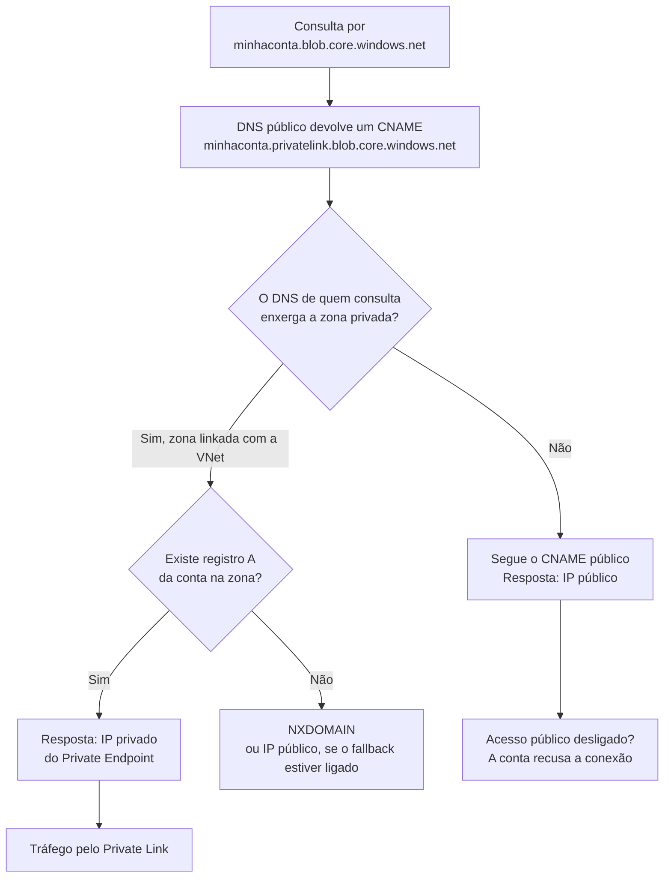

Fala pessoALL! Como vocês estão?

Hoje o assunto é um dos chamados mais repetidos em qualquer time de infra que trabalha com Azure: "criei o Private Endpoint e não funciona".

O roteiro é quase sempre igual. Alguém cria o Private Endpoint da Storage Account, o status aparece como **Approved**, o time de segurança desliga o acesso público e a aplicação para com erro 403. O primeiro suspeito é o NSG. Depois a rota. Depois o firewall. Passa uma tarde inteira e ninguém rodou um `nslookup`.

Sendo bem sincero: na maioria das vezes o endpoint está perfeito. O que falta é o nome da conta resolver para o IP privado. Enquanto resolver para o IP público, o tráfego sai pelo caminho público e o Private Endpoint fica lá, aprovado, cobrando por hora e sem receber um pacote.

<!-- LUIZ: você já atendeu um caso de "Private Endpoint não funciona" que no fim era DNS? Qual era a causa (link de VNet faltando, DNS customizado sem forwarder, zona duplicada) e quanto tempo levou para alguém olhar a resolução de nome? Duas ou três linhas aqui, sem identificar o ambiente. -->

**Neste artigo, vamos montar um laboratório com Storage Account e Private Endpoint criando o endpoint primeiro sem DNS, para ver o problema acontecer. Depois entram a zona `privatelink`, o link com a VNet e o zone group, com teste de resolução de dentro e de fora a cada etapa, até desligar o acesso público. Na sequência vêm os casos que complicam: DNS customizado na VNet, on-premises resolvendo pelo Azure DNS Private Resolver, zona centralizada em hub e uma Azure Policy que cria o registro sozinha.**

> Se o seu ambiente já tem um hub com as zonas `privatelink` centralizadas, não crie zona nova na assinatura da aplicação copiando o laboratório. Zona duplicada com o mesmo nome é uma das causas do problema que este artigo ensina a diagnosticar. Leia o Passo 11 antes.
{: .prompt-warning }

---

## Mas antes, por que quase sempre é DNS?

Porque o Private Endpoint não muda o nome que a aplicação usa.

A aplicação continua chamando `minhaconta.blob.core.windows.net`, com a mesma connection string de sempre, e a documentação pede para não conectar pelo nome `privatelink`. Quem decide se a conexão vai para o IP público ou para o privado é a resposta do DNS.

Quando o primeiro Private Endpoint de uma conta é criado, a Microsoft altera o registro público dela. O nome original vira um CNAME para `minhaconta.privatelink.blob.core.windows.net`. Quem consulta de fora segue esse CNAME pelo DNS público e recebe o IP público. Quem consulta de uma VNet que enxerga a zona privada `privatelink` recebe o IP privado do endpoint.

O fluxo, com os dois desvios que geram chamado:



Para a resposta ser o IP privado, quatro peças precisam existir ao mesmo tempo:

| Peça | Quem cria | O que acontece se faltar |
| --- | --- | --- |
| CNAME público para `privatelink` | A plataforma, quando o endpoint é criado | Nada a fazer, é automático |
| Zona privada `privatelink.blob.core.windows.net` | Você | A consulta segue o CNAME público e volta com IP público |
| Link da zona com a VNet que faz a consulta | Você | Igual: IP público, mesmo com a zona e o registro corretos |
| Registro A da conta na zona, mantido pelo DNS zone group | O zone group do endpoint | NXDOMAIN para quem enxerga a zona |

Um detalhe que confunde: resolver o nome e ter acesso são coisas independentes. Desligar o acesso público não muda uma vírgula do DNS.

---

## O que vamos construir neste laboratório?

Tudo em um único Resource Group, na região **West US 2**, com nomes no padrão do Cloud Adoption Framework:

| Recurso | Nome |
| --- | --- |
| Resource Group | `rg-pedns-lab-wus2-001` |
| Virtual Network | `vnet-pedns-lab-wus2-001` (`10.60.0.0/16`) |
| Subnet da VM de teste | `snet-pedns-vm-wus2-001` (`10.60.1.0/24`) |
| Subnet dos Private Endpoints | `snet-pedns-pe-wus2-001` (`10.60.2.0/24`) |
| Subnet do inbound endpoint | `snet-pedns-dnsin-wus2-001` (`10.60.3.0/28`) |
| VM de teste | `vm-pedns-lab-wus2-001` |
| Storage Account | `stpednslab` + 8 caracteres do ID da assinatura |
| Private Endpoint | `pep-pedns-blob-wus2-001` |
| DNS Private Resolver | `dnspr-pedns-lab-wus2-001` |

O Cloud Shell é o "lado de fora" e uma VM Linux na VNet é o "lado de dentro". Um script de teste mostra os dois na mesma tela, e vamos rodá-lo depois de cada mudança.

> Esse laboratório gera custo. Private Endpoint, zona privada, VM e IP público cobram enquanto existirem, e o DNS Private Resolver do Passo 10 cobra por endpoint, por hora, mesmo sem receber consulta. Os valores estão na calculadora de preços do Azure. Se for só estudo, rode a limpeza no mesmo dia.
{: .prompt-info }

---

## Pré-requisitos

* Uma assinatura do Azure com permissão de **Owner**, porque o laboratório cria role assignment e atribuição de policy;
* Cloud Shell em modo **Bash**, ou um terminal Linux com Azure CLI na versão 2.75.0 ou superior, exigida pela extensão `dns-resolver`;
* Provider `Microsoft.Network` registrado na assinatura;
* Os arquivos do laboratório, que estão no meu repositório: [Private Endpoint DNS](https://github.com/lfrleite/Ruiz-Online/tree/main/Private%20Endpoint%20DNS).

---

## Mão na massa!

Abra o Cloud Shell, baixe os arquivos e entre na pasta:

```bash
git clone https://github.com/lfrleite/Ruiz-Online.git
cd "Ruiz-Online/Private Endpoint DNS"
chmod +x *.sh
```

Os nomes dos recursos ficam no `00-variaveis.sh`, que os outros scripts carregam sozinhos:

```bash
#!/usr/bin/env bash
# Variáveis do laboratório "Private Endpoint e DNS privado".
# Os outros scripts carregam este arquivo sozinhos. Para usar as variáveis
# direto no terminal: source ./00-variaveis.sh

export LOCATION="${LOCATION:-westus2}"
export RG="${RG:-rg-pedns-lab-wus2-001}"
export VNET="${VNET:-vnet-pedns-lab-wus2-001}"
export SNET_VM="${SNET_VM:-snet-pedns-vm-wus2-001}"
export SNET_PE="${SNET_PE:-snet-pedns-pe-wus2-001}"
export SNET_DNS="${SNET_DNS:-snet-pedns-dnsin-wus2-001}"
export NSG="${NSG:-nsg-pedns-vm-wus2-001}"
export VM="${VM:-vm-pedns-lab-wus2-001}"
export PE="${PE:-pep-pedns-blob-wus2-001}"
export ZONA="privatelink.blob.core.windows.net"
export LINK="${LINK:-link-vnet-pedns-lab-wus2-001}"
export RESOLVER="${RESOLVER:-dnspr-pedns-lab-wus2-001}"
export INBOUND="${INBOUND:-in-pedns-lab-wus2-001}"
export ATRIBUICAO="${ATRIBUICAO:-pedns-blob-zone-group}"
export CONTAINER="${CONTAINER:-lab}"
export BLOB="${BLOB:-teste.txt}"
export ARQ_SAS="${ARQ_SAS:-$HOME/.pedns-lab-sas-url}"

if ! az account show --only-show-errors >/dev/null 2>&1; then
  echo "ERRO: sem sessão no Azure CLI. Rode 'az login' e tente de novo." >&2
  return 1 2>/dev/null || exit 1
fi

SUB_ID="$(az account show --query id --output tsv)"
export SUB_ID

# Nome de Storage Account é único no mundo inteiro, então o sufixo sai do ID da assinatura.
export STG="${STG:-stpednslab$(echo "$SUB_ID" | tr -d '-' | cut -c1-8)}"
export FQDN="$STG.blob.core.windows.net"
```

---

### Passo 1 - Rede e VM de teste

Começamos pela VNet com duas subnets, uma para a VM e outra só para Private Endpoints, e por uma VM Ubuntu que vai consultar o DNS de dentro da rede.

A VM recebe IP público para a gente entrar por SSH a partir do terminal onde os scripts rodam. O NSG libera a porta 22 para um único endereço, e quem informa esse endereço é você, como parâmetro. Sem ele o script para e avisa.

```bash
./01-rede-e-vm.sh <IPv4 público de onde o SSH vai sair>
```

Que IP é esse? O IP de saída para a internet do lugar onde você está rodando os scripts. No seu computador é o IP público da sua conexão. No Cloud Shell é o IP de saída da sessão, que você consulta com a ferramenta de sua confiança antes de rodar o script.

Eu preferi deixar esse valor na sua mão. Script que pergunta para um site de terceiro qual endereço deve entrar em regra de firewall não é hábito que eu queira ensinar. O script só aceita um IPv4 único e público: faixa, `0.0.0.0/0` e IP privado são recusados.

Conteúdo do `01-rede-e-vm.sh`:

```bash
#!/usr/bin/env bash
# Passo 1: Resource Group, VNet, duas subnets, NSG e a VM de teste.
# Uso: ./01-rede-e-vm.sh <IPv4 público de onde o SSH vai sair>
# Exemplo: ./01-rede-e-vm.sh 203.0.113.10
# O IP é informado por você. O script não consulta nenhum serviço externo.
set -euo pipefail
source "$(dirname "${BASH_SOURCE[0]}")/00-variaveis.sh"

ORIGEM_SSH="${1:-}"
if [ -z "$ORIGEM_SSH" ]; then
  echo "ERRO: informe o IP público de onde você vai abrir o SSH." >&2
  echo "Uso: $0 <IPv4>   (exemplo: $0 203.0.113.10)" >&2
  exit 1
fi

# Aceita um único endereço IPv4. Faixa aberta em regra de SSH não entra aqui.
ORIGEM_SSH="${ORIGEM_SSH%/32}"
if ! [[ "$ORIGEM_SSH" =~ ^([0-9]{1,3})\.([0-9]{1,3})\.([0-9]{1,3})\.([0-9]{1,3})$ ]]; then
  echo "ERRO: '$ORIGEM_SSH' não é um endereço IPv4 único (exemplo válido: 203.0.113.10)." >&2
  exit 1
fi
for OCTETO in "${BASH_REMATCH[@]:1}"; do
  if [ "$((10#$OCTETO))" -gt 255 ]; then
    echo "ERRO: '$ORIGEM_SSH' não é um endereço IPv4 válido." >&2
    exit 1
  fi
done
case "$ORIGEM_SSH" in
  0.*|10.*|127.*|169.254.*|192.168.*|172.1[6-9].*|172.2[0-9].*|172.3[01].*)
    echo "ERRO: '$ORIGEM_SSH' não é um IP público. A regra precisa do IP de saída para a internet." >&2
    exit 1
    ;;
esac
ORIGEM_SSH="$ORIGEM_SSH/32"

echo ">> Resource Group $RG em $LOCATION"
az group create --name "$RG" --location "$LOCATION" --output none

echo ">> VNet $VNET e subnet das VMs"
az network vnet create \
  --resource-group "$RG" \
  --location "$LOCATION" \
  --name "$VNET" \
  --address-prefixes 10.60.0.0/16 \
  --subnet-name "$SNET_VM" \
  --subnet-prefixes 10.60.1.0/24 \
  --output none

echo ">> Subnet dos Private Endpoints"
az network vnet subnet create \
  --resource-group "$RG" \
  --vnet-name "$VNET" \
  --name "$SNET_PE" \
  --address-prefixes 10.60.2.0/24 \
  --output none

echo ">> NSG $NSG liberando SSH somente para $ORIGEM_SSH"
az network nsg create --resource-group "$RG" --name "$NSG" --output none
az network nsg rule create \
  --resource-group "$RG" \
  --nsg-name "$NSG" \
  --name AllowSSH \
  --priority 1000 \
  --direction Inbound \
  --access Allow \
  --protocol Tcp \
  --destination-port-ranges 22 \
  --source-address-prefixes "$ORIGEM_SSH" \
  --output none

echo ">> VM $VM (Ubuntu 24.04, chave SSH gerada em ~/.ssh)"
az vm create \
  --resource-group "$RG" \
  --name "$VM" \
  --image Ubuntu2404 \
  --size Standard_B2s \
  --vnet-name "$VNET" \
  --subnet "$SNET_VM" \
  --nsg "$NSG" \
  --public-ip-sku Standard \
  --admin-username azureuser \
  --generate-ssh-keys \
  --output none

VM_IP="$(az vm show --show-details --resource-group "$RG" --name "$VM" --query publicIps --output tsv)"
echo
echo "Pronto. IP público da VM de teste: $VM_IP"
```

<!-- PRINT 002: Cloud Shell com a saída completa do 01-rede-e-vm.sh, terminando na linha "Pronto. IP público da VM de teste" -->
{: .shadow .rounded-10 }
<br>

> Se o SSH parar de responder depois que você trocar de rede ou abrir outra sessão do Cloud Shell, confira se a regra `AllowSSH` ainda aponta para o seu IP de saída atual. Para trocar: `az network nsg rule update --resource-group "$RG" --nsg-name "$NSG" --name AllowSSH --source-address-prefixes <novo IP>/32`. Em ambiente real eu não exporia a VM: Azure Bastion resolve sem IP público.
{: .prompt-warning }

Esse IP público também é o que dá saída de internet para a VM. Subnet nova nasce privada, sem a saída implícita de antigamente, assunto do artigo sobre [o fim do default outbound access](https://blog.ruizsolutions.online/posts/azure-default-outbound-access-saida-explicita/).

---

### Passo 2 - Storage Account e um blob para testar

Agora a conta de armazenamento, um container e um arquivo de texto. Resolver o nome não basta como prova, então o script também gera uma URL com SAS de leitura para buscar esse blob.

Nada de chave de conta aqui. O upload usa o seu login do Microsoft Entra ID, a SAS é do tipo **user delegation**, que é a recomendada pela Microsoft, e a role **Storage Blob Data Contributor** é atribuída só nessa conta.

```bash
./02-storage.sh
```

Conteúdo do `02-storage.sh`:

```bash
#!/usr/bin/env bash
# Passo 2: Storage Account, container, um blob de teste e uma URL com SAS de leitura.
# Nada de chave de conta: tudo com Microsoft Entra ID e user delegation SAS.
set -euo pipefail
source "$(dirname "${BASH_SOURCE[0]}")/00-variaveis.sh"

echo ">> Storage Account $STG"
az storage account create \
  --name "$STG" \
  --resource-group "$RG" \
  --location "$LOCATION" \
  --sku Standard_LRS \
  --kind StorageV2 \
  --min-tls-version TLS1_2 \
  --allow-blob-public-access false \
  --output none

STG_ID="$(az storage account show --name "$STG" --resource-group "$RG" --query id --output tsv)"
USER_ID="$(az ad signed-in-user show --query id --output tsv)"

echo ">> Role Storage Blob Data Contributor para o usuário logado, só nesta conta"
ATRIBUICAO_ROLE="$(az role assignment list \
  --assignee "$USER_ID" \
  --role "Storage Blob Data Contributor" \
  --scope "$STG_ID" \
  --query "[0].id" \
  --output tsv)"
if [ -z "$ATRIBUICAO_ROLE" ]; then
  az role assignment create \
    --assignee-object-id "$USER_ID" \
    --assignee-principal-type User \
    --role "Storage Blob Data Contributor" \
    --scope "$STG_ID" \
    --output none
else
  echo "   a role já estava atribuída, seguindo"
fi

echo ">> Container $CONTAINER (o RBAC pode levar alguns minutos para propagar)"
CRIADO=0
for TENTATIVA in $(seq 1 10); do
  if az storage container create \
       --account-name "$STG" \
       --name "$CONTAINER" \
       --auth-mode login \
       --only-show-errors \
       --output none 2>/dev/null; then
    CRIADO=1
    break
  fi
  echo "   tentativa $TENTATIVA de 10 sem permissão ainda, aguardando 30 segundos"
  sleep 30
done
if [ "$CRIADO" -ne 1 ]; then
  echo "ERRO: não consegui criar o container. Confira a role em $STG e rode de novo." >&2
  exit 1
fi

echo ">> Blob $BLOB"
ARQ_TMP="$(mktemp)"
trap 'rm -f "$ARQ_TMP"' EXIT
echo "Se você está lendo isso, o blob respondeu." > "$ARQ_TMP"
az storage blob upload \
  --account-name "$STG" \
  --container-name "$CONTAINER" \
  --name "$BLOB" \
  --file "$ARQ_TMP" \
  --auth-mode login \
  --overwrite true \
  --only-show-errors \
  --output none

echo ">> URL com user delegation SAS, somente leitura, válida por 24 horas"
EXPIRA="$(date -u -d '+1 day' '+%Y-%m-%dT%H:%MZ')"
SAS_URL="$(az storage blob generate-sas \
  --account-name "$STG" \
  --container-name "$CONTAINER" \
  --name "$BLOB" \
  --permissions r \
  --expiry "$EXPIRA" \
  --https-only \
  --auth-mode login \
  --as-user \
  --full-uri \
  --output tsv)"

( umask 077; printf '%s\n' "$SAS_URL" > "$ARQ_SAS" )
echo
echo "Pronto. Endpoint do blob: https://$FQDN"
echo "URL com SAS gravada em $ARQ_SAS (não cole esse conteúdo em print nem em chat)."
```

<!-- PRINT 003: Cloud Shell com a saída do 02-storage.sh, mostrando as tentativas de criação do container (se houver) e as duas linhas finais com o endpoint do blob e o caminho do arquivo da SAS -->
{: .shadow .rounded-10 }
<br>

É normal ver uma ou duas tentativas falhando na criação do container: a role acabou de ser atribuída e o RBAC demora para propagar.

> A URL com SAS dá leitura do blob, por 24 horas, para quem a tiver em mãos. Ela fica em `~/.pedns-lab-sas-url`, com permissão só para o seu usuário. Não mostre esse conteúdo em print.
{: .prompt-danger }

Faça o laboratório no mesmo dia. Com a SAS vencida o teste devolve 403 nos dois lados e confunde a leitura. E depois do Passo 7, com o acesso público desligado, o `02-storage.sh` não consegue gerar outra a partir de fora da VNet.

---

### Passo 3 - A linha de base: como resolve antes do endpoint

Antes de criar qualquer coisa privada, vamos registrar o comportamento original. O script roda `nslookup` e busca o blob duas vezes: no Cloud Shell e dentro da VM, via SSH.

```bash
./teste-dentro-fora.sh
```

Conteúdo do `teste-dentro-fora.sh`:

```bash
#!/usr/bin/env bash
# Mostra, lado a lado, como o nome da Storage Account resolve e o que o blob
# responde de FORA (este terminal) e de DENTRO (a VM de teste, via SSH).
# Uso: ./teste-dentro-fora.sh [IP_DE_UM_SERVIDOR_DNS]
# Com o IP opcional, a consulta de dentro da VM é feita direto nesse servidor.
set -uo pipefail
source "$(dirname "${BASH_SOURCE[0]}")/00-variaveis.sh" || exit 1

SERVIDOR_DNS="${1:-}"
if [ -n "$SERVIDOR_DNS" ] && ! [[ "$SERVIDOR_DNS" =~ ^[0-9]{1,3}(\.[0-9]{1,3}){3}$ ]]; then
  echo "ERRO: '$SERVIDOR_DNS' não é um endereço IPv4. Uso: $0 [IP_DE_UM_SERVIDOR_DNS]" >&2
  exit 1
fi

if [ ! -s "$ARQ_SAS" ]; then
  echo "ERRO: não achei $ARQ_SAS. Rode o 02-storage.sh antes." >&2
  exit 1
fi
SAS_URL="$(cat "$ARQ_SAS")"

VM_IP="$(az vm show --show-details --resource-group "$RG" --name "$VM" --query publicIps --output tsv)"
if [ -z "$VM_IP" ]; then
  echo "ERRO: não consegui o IP público da VM $VM. Ela está ligada?" >&2
  exit 1
fi

echo "================ DE FORA (este terminal) ================"
nslookup "$FQDN" || echo "(nslookup falhou)"
echo "HTTP do blob: $(curl -s -o /dev/null -w '%{http_code}' --max-time 20 "$SAS_URL")"

echo
echo "================ DE DENTRO (VM $VM) ================"
ssh -o StrictHostKeyChecking=accept-new -o ConnectTimeout=15 "azureuser@$VM_IP" \
  "nslookup '$FQDN' $SERVIDOR_DNS || echo '(nslookup falhou)'; \
   echo \"HTTP do blob: \$(curl -s -o /dev/null -w '%{http_code}' --max-time 20 '$SAS_URL')\""
```

<!-- PRINT 004: Cloud Shell com a saída do teste-dentro-fora.sh antes do Private Endpoint: blocos DE FORA e DE DENTRO, os dois com IP público e "HTTP do blob: 200" -->
{: .shadow .rounded-10 }
<br>

Nos dois lados o nome resolve para um IP público e o blob responde 200. Guarde essa tela.

> Se a VM reclamar que o `nslookup` não existe, entre nela por SSH e instale com `sudo apt-get update && sudo apt-get install -y dnsutils`.
{: .prompt-tip }

---

### Passo 4 - Criando o Private Endpoint, de propósito sem DNS

Vamos criar o endpoint pelo portal e responder **No** na integração com DNS. É o que acontece na prática quando o endpoint nasce por script ou em ambiente onde uma policy proíbe criar zona.

1. Pesquise por **Private endpoints** e clique em **+ Create**;
2. Na aba **Basics** informe:
   * Resource group: `rg-pedns-lab-wus2-001`;
   * Name:
   ```text
   pep-pedns-blob-wus2-001
   ```
   * Network Interface Name: mantenha a sugestão;
   * Region: `West US 2`;

<!-- PRINT 005: portal, Create a private endpoint, aba Basics preenchida com rg-pedns-lab-wus2-001, nome pep-pedns-blob-wus2-001 e região West US 2 -->
{: .shadow .rounded-10 }
<br>

3. Clique em **Next: Resource** e informe:
   * Connection method: **Connect to an Azure resource in my directory**;
   * Resource type: `Microsoft.Storage/storageAccounts`;
   * Resource: a conta `stpednslab...` criada no Passo 2;
   * Target subresource: `blob`;

<!-- PRINT 006: portal, aba Resource com Resource type Microsoft.Storage/storageAccounts, a Storage Account do laboratório selecionada e Target subresource blob -->
{: .shadow .rounded-10 }
<br>

4. Clique em **Next: Virtual Network** e informe:
   * Virtual network: `vnet-pedns-lab-wus2-001`;
   * Subnet: `snet-pedns-pe-wus2-001`;
   * Private IP configuration: **Dynamically allocate IP address**;

<!-- PRINT 007: portal, aba Virtual Network com a VNet vnet-pedns-lab-wus2-001, a subnet snet-pedns-pe-wus2-001 e Dynamically allocate IP address -->
{: .shadow .rounded-10 }
<br>

5. Clique em **Next: DNS** e, em **Integrate with private DNS zone**, selecione **No**;

<!-- PRINT 008: portal, aba DNS com a opção Integrate with private DNS zone marcada como No -->
{: .shadow .rounded-10 }
<br>

6. Avance por **Tags** até **Review + create**;
7. Clique em **Create**.

> Cada **Target subresource** (blob, file, queue, table, dfs, web) precisa de um endpoint próprio e de uma zona própria. Conta com namespace hierárquico pede endpoint de `blob` e de `dfs`, senão operações como criar diretório e gerenciar ACL falham.
{: .prompt-info }

Se preferir não abrir o portal, o `03-private-endpoint.sh` faz a mesma coisa:

```bash
#!/usr/bin/env bash
# Passo 4 (alternativa ao portal): Private Endpoint do blob, de propósito SEM DNS.
set -euo pipefail
source "$(dirname "${BASH_SOURCE[0]}")/00-variaveis.sh"

STG_ID="$(az storage account show --name "$STG" --resource-group "$RG" --query id --output tsv)"

echo ">> Private Endpoint $PE na subnet $SNET_PE"
az network private-endpoint create \
  --name "$PE" \
  --resource-group "$RG" \
  --vnet-name "$VNET" \
  --subnet "$SNET_PE" \
  --private-connection-resource-id "$STG_ID" \
  --group-id blob \
  --connection-name "con-$PE" \
  --output none

az network private-endpoint show \
  --name "$PE" \
  --resource-group "$RG" \
  --query "{estado:provisioningState, conexao:privateLinkServiceConnections[0].privateLinkServiceConnectionState.status, dns:customDnsConfigs}" \
  --output json
```

Com o endpoint criado, abra o recurso e vá em **Settings > DNS configuration**. O portal mostra o FQDN e o IP privado que a NIC recebeu, dentro da `10.60.2.0/24`. A conexão aparece como **Approved** porque quem pediu o endpoint também é dono da conta. Quando não é, ela fica **Pending** até o dono aprovar.

<!-- PRINT 009: portal, Private Endpoint pep-pedns-blob-wus2-001 > Settings > DNS configuration, mostrando o FQDN da conta, o IP privado 10.60.2.x e nenhuma zona privada associada -->
{: .shadow .rounded-10 }
<br>

---

### Passo 5 - O teste que explica o chamado

Endpoint criado, aprovado, com IP. Rode o teste de novo:

```bash
./teste-dentro-fora.sh
```

<!-- PRINT 010: Cloud Shell com a saída do teste-dentro-fora.sh depois do endpoint sem DNS: a resposta agora cita o nome privatelink como alias, mas os dois lados continuam com IP público e HTTP 200 -->
{: .shadow .rounded-10 }
<br>

Repare em duas coisas.

A resposta agora traz o nome `privatelink` no meio do caminho. É o CNAME que a plataforma acabou de criar no DNS público.

E a VM, que está na mesma VNet do endpoint, a uma subnet de distância, continua recebendo o **IP público** e falando com a conta pela internet. O Private Endpoint existe e ninguém passa por ele.

Só não deu erro ainda porque o acesso público continua ligado.

---

### Passo 6 - Zona privatelink, link com a VNet e zone group

Agora as três peças que faltam, no `04-dns-privado.sh`:

```bash
./04-dns-privado.sh
```

```bash
#!/usr/bin/env bash
# Passo 6: zona privatelink, link com a VNet e DNS zone group no Private Endpoint.
set -euo pipefail
source "$(dirname "${BASH_SOURCE[0]}")/00-variaveis.sh"

echo ">> Zona privada $ZONA"
az network private-dns zone create \
  --resource-group "$RG" \
  --name "$ZONA" \
  --output none

echo ">> Link da zona com a VNet $VNET (sem auto-registro)"
az network private-dns link vnet create \
  --resource-group "$RG" \
  --zone-name "$ZONA" \
  --name "$LINK" \
  --virtual-network "$VNET" \
  --registration-enabled false \
  --output none

echo ">> DNS zone group no Private Endpoint $PE"
az network private-endpoint dns-zone-group create \
  --resource-group "$RG" \
  --endpoint-name "$PE" \
  --name default \
  --private-dns-zone "$ZONA" \
  --zone-name blob \
  --output none

echo
echo "Registros A na zona:"
az network private-dns record-set a list \
  --resource-group "$RG" \
  --zone-name "$ZONA" \
  --query "[].{Nome:name, TTL:ttl, IP:aRecords[0].ipv4Address}" \
  --output table

echo
echo "Links da zona:"
az network private-dns link vnet list \
  --resource-group "$RG" \
  --zone-name "$ZONA" \
  --query "[].{Link:name, Estado:virtualNetworkLinkState, AutoRegistro:registrationEnabled}" \
  --output table
```

O que cada comando resolve:

Primeiro a zona. O nome precisa ser exatamente o recomendado para o serviço, no caso `privatelink.blob.core.windows.net`. A documentação traz uma tabela com o nome por serviço e por sub-recurso, e avisa que a configuração automática só funciona com esses nomes.

Depois o link, porque zona privada sem link não responde para ninguém. O `--registration-enabled false` desliga o auto-registro, que serve para VMs registrarem o próprio nome e não tem função em zona de Private Endpoint.

E o **DNS zone group**, a peça menos conhecida. É um recurso filho do Private Endpoint que amarra o endpoint à zona. Quem cria o registro A é ele, e é ele quem apaga o registro quando o endpoint é excluído. Cada endpoint aceita um único zone group, com até cinco zonas.

<!-- PRINT 011: Cloud Shell com a saída do 04-dns-privado.sh, mostrando a tabela de registros A (nome da conta, TTL e IP 10.60.2.x) e a tabela de links com Estado Completed -->
{: .shadow .rounded-10 }
<br>

No portal, a zona mostra o link em **Virtual Network Links**. Espere o status virar **Completed** antes de testar, o que pode levar alguns minutos.

<!-- PRINT 012: portal, Private DNS zone privatelink.blob.core.windows.net > Virtual Network Links, com o link link-vnet-pedns-lab-wus2-001 em Link status Completed e auto-registration desabilitado -->
{: .shadow .rounded-10 }
<br>

Teste de novo:

```bash
./teste-dentro-fora.sh
```

<!-- PRINT 013: Cloud Shell com a saída do teste-dentro-fora.sh depois do DNS: DE FORA com IP público e HTTP 200, DE DENTRO com IP 10.60.2.x e HTTP 200 -->
{: .shadow .rounded-10 }
<br>

Agora sim. De fora, IP público. De dentro, um IP da `10.60.2.0/24`. Mesmo nome, mesma URL, duas respostas.

> Responder **Yes** em **Integrate with private DNS zone** faz essas três coisas sozinho, com a zona no Resource Group do endpoint e o link só com a VNet do endpoint. É por isso que no laboratório de todo mundo funciona de primeira, e é por isso que quebra em ambiente corporativo, onde a zona certa fica em outra assinatura e precisa estar linkada com outras VNets.
{: .prompt-warning }

---

### Passo 7 - Desligando o acesso público

Criar o Private Endpoint não fecha o endpoint público. São duas configurações separadas.

```bash
source ./00-variaveis.sh

az storage account update \
  --name "$STG" \
  --resource-group "$RG" \
  --public-network-access Disabled \
  --output none

az storage account show \
  --name "$STG" \
  --resource-group "$RG" \
  --query "{conta:name, acessoPublico:publicNetworkAccess}"
```

Pelo portal o caminho é a conta > **Security + networking** > **Networking** > **Public network access** > **Manage** > **Disable** > **Save**. A Microsoft adora mudar o layout dessa tela, então os nomes podem estar um pouco diferentes quando você ler.

<!-- PRINT 014: portal, Storage Account > Security + networking > Networking, com Public network access em Disabled e a lista de Private endpoint connections mostrando pep-pedns-blob-wus2-001 como Approved -->
{: .shadow .rounded-10 }
<br>

E o teste:

```bash
./teste-dentro-fora.sh
```

<!-- PRINT 015: Cloud Shell com a saída do teste-dentro-fora.sh com acesso público desligado: DE FORA com IP público e HTTP 403, DE DENTRO com IP 10.60.2.x e HTTP 200 -->
{: .shadow .rounded-10 }
<br>

<!-- VALIDAR: confirmar no print 015 que o código devolvido de fora, com acesso público desligado e URL com user delegation SAS, é mesmo 403. A documentação cita 403 como sintoma, sem mostrar a saída. Se vier outro código, ajustar este parágrafo, a tabela abaixo e as descrições dos prints 015 e 016. -->

De fora o nome continua resolvendo para o IP público e a conta recusa a requisição. De dentro, tudo igual. Esse é o estado final que a gente queria.

O que esperar em cada momento do laboratório:

| Momento | De fora (Cloud Shell) | De dentro (VM) |
| --- | --- | --- |
| Passo 3, antes do endpoint | IP público, HTTP 200 | IP público, HTTP 200 |
| Passo 5, endpoint sem DNS | IP público, HTTP 200 | IP público, HTTP 200 |
| Passo 6, zona, link e zone group | IP público, HTTP 200 | IP privado, HTTP 200 |
| Passo 7, acesso público desligado | IP público, HTTP 403 | IP privado, HTTP 200 |
| Passo 8, link removido | IP público, HTTP 403 | IP público, HTTP 403 |

---

### Passo 8 - Quebrando de propósito

Quero que você veja o chamado nascer. Remova o link da zona com a VNet, a causa mais comum segundo o guia de troubleshooting da Microsoft:

```bash
source ./00-variaveis.sh

az network private-dns link vnet delete \
  --resource-group "$RG" \
  --zone-name "$ZONA" \
  --name "$LINK" \
  --yes
```

Espere um ou dois minutos e rode o `./teste-dentro-fora.sh`.

<!-- PRINT 016: Cloud Shell com a saída do teste-dentro-fora.sh sem o link: DE DENTRO agora com IP público e HTTP 403, igual ao lado de fora -->
{: .shadow .rounded-10 }
<br>

A VM voltou a receber o IP público e agora leva 403.

Olhe o ambiente como quem acabou de receber o chamado: endpoint **Approved**, zona criada, registro A com o IP certo, NSG intacto. Tudo verde no portal e a aplicação parada.

Recrie o link e confirme que voltou:

```bash
az network private-dns link vnet create \
  --resource-group "$RG" \
  --zone-name "$ZONA" \
  --name "$LINK" \
  --virtual-network "$VNET" \
  --registration-enabled false \
  --output none

./teste-dentro-fora.sh
```

Até aqui foi o caminho simples: uma VNet, DNS do Azure, tudo na mesma assinatura. Os próximos quatro passos são os casos em que isso não basta.

---

### Passo 9 - Quando a VNet usa DNS customizado

A zona privada só é consultada quando a pergunta chega ao DNS do Azure, o endereço `168.63.129.16`, vinda de uma VNet linkada.

Se a VNet está configurada com servidores DNS customizados, como controladores de domínio, a VM pergunta para eles. E se eles não repassarem a consulta para o `168.63.129.16`, a zona privada nunca entra na história.

Para saber se é o seu caso:

```bash
source ./00-variaveis.sh

az network vnet show \
  --resource-group "$RG" \
  --name "$VNET" \
  --query "{vnet:name, dnsServers:dhcpOptions.dnsServers}"
```

Lista vazia significa DNS do Azure. Lista com IPs significa DNS customizado, e aí o ajuste é no servidor DNS.

A dúvida que aparece nessa hora: o encaminhamento é para a zona `privatelink.blob.core.windows.net` ou para a `blob.core.windows.net`?

Para a zona **pública**, `blob.core.windows.net`.

A página de integração de DNS do Private Endpoint traz isso em um aviso de *Important*: o conditional forwarder deve ser feito para o *public DNS zone forwarder* recomendado, e o exemplo dela é `database.windows.net` em vez de `privatelink.database.windows.net`. A tabela de zonas por serviço tem uma coluna só para esse valor, **Public DNS zone forwarders**, e na linha do blob está `blob.core.windows.net`.

<!-- VALIDAR: o parágrafo abaixo é o meu raciocínio sobre o motivo. A documentação dá a regra e não explica o porquê. Se quiser prova em laboratório, suba um BIND ou Windows DNS na VNet com forwarder geral para um resolvedor público, teste o conditional forwarder só na zona privatelink e depois só na zona pública, e compare o nslookup. -->

O motivo, na minha leitura, está no que a máquina pergunta. Ela consulta `minhaconta.blob.core.windows.net`. O nome `privatelink` só aparece depois, como CNAME, dentro da resposta. Com o forwarder na zona pública, a pergunta inteira vai para o DNS do Azure, que segue o CNAME, acha a zona privada linkada e devolve o IP privado. Com o forwarder só na zona `privatelink`, a pergunta original sai pelo caminho padrão do servidor, e o resolvedor de cima pode devolver a cadeia já resolvida, com o CNAME e o IP público juntos. O forwarder da `privatelink` nem entra em cena.

Você vai encontrar exemplo da própria Microsoft com `privatelink.blob.core.windows.net` no conditional forwarder, inclusive no guia de troubleshooting que eu uso neste artigo. Eu fico com a página de integração, que é a referência de desenho e tem o aviso explícito.

Tem um preço. Toda consulta de blob passa a ir para o DNS do Azure, inclusive a de contas que não são suas. Conta sem Private Endpoint resolve normalmente. Conta de terceiro que tem Private Endpoint em outro lugar cai no NXDOMAIN do Passo 11, e a saída está lá.

Em um Windows DNS Server dentro da VNet:

1. Abra o **DNS Manager**;
2. Clique com o botão direito em **Conditional Forwarders** e escolha **New Conditional Forwarder**;
3. Em **DNS Domain** informe a zona pública do serviço, por exemplo `blob.core.windows.net`;
4. Em **IP address** informe `168.63.129.16`;
5. Clique em **OK**.

Em BIND, o equivalente em `/etc/bind/named.conf.local`:

```text
zone "blob.core.windows.net" {
    type forward;
    forwarders { 168.63.129.16; };
};
```

Se o servidor não tem outro forwarder configurado, o caminho mais curto é o forwarder geral dele apontar para o `168.63.129.16`. É assim que a documentação desenha o DNS forwarder dentro do Azure.

Dois detalhes que só aparecem na hora do aperto:

* A VNet onde o servidor DNS está precisa estar linkada com a zona privada. Para o DNS do Azure, quem está perguntando é a VNet do servidor, não a VNet da máquina que originou a consulta;
* Em Windows DNS encaminhando para o Azure, a Microsoft orienta aumentar o **Forwarding Timeout** para mais de quatro segundos. Com o valor padrão, registros de zona privada podem acabar resolvidos com IP público.

> Trocou os servidores DNS de uma VNet? As VMs só pegam a mudança depois de renovar o lease de DHCP ou reiniciar. Em ambiente real isso é GMUD com janela.
{: .prompt-warning }

---

### Passo 10 - On-premises resolvendo com o Azure DNS Private Resolver

Um servidor no datacenter, conectado por VPN ou ExpressRoute, alcança o IP privado do endpoint. O que ele não alcança é o `168.63.129.16`, que só responde de dentro de uma VNet. Alguém dentro do Azure precisa receber a consulta e perguntar por ele.

Hoje esse alguém é o **Azure DNS Private Resolver**, serviço gerenciado cujo **inbound endpoint** é um IP privado na sua VNet que aceita consultas vindas de fora e resolve com as zonas linkadas àquela VNet.

```bash
./05-private-resolver.sh
```

```bash
#!/usr/bin/env bash
# Passo 10: Azure DNS Private Resolver com um inbound endpoint.
# É para esse IP que o DNS on-premises aponta o conditional forwarder
# da zona pública do serviço (blob.core.windows.net).
set -euo pipefail
source "$(dirname "${BASH_SOURCE[0]}")/00-variaveis.sh"

echo ">> Extensão dns-resolver do Azure CLI"
az extension add --name dns-resolver --only-show-errors

echo ">> Subnet dedicada e delegada para o inbound endpoint"
az network vnet subnet create \
  --resource-group "$RG" \
  --vnet-name "$VNET" \
  --name "$SNET_DNS" \
  --address-prefixes 10.60.3.0/28 \
  --delegations Microsoft.Network/dnsResolvers \
  --output none

VNET_ID="$(az network vnet show --resource-group "$RG" --name "$VNET" --query id --output tsv)"
SUBNET_ID="$(az network vnet subnet show --resource-group "$RG" --vnet-name "$VNET" --name "$SNET_DNS" --query id --output tsv)"

echo ">> Private Resolver $RESOLVER"
az dns-resolver create \
  --name "$RESOLVER" \
  --resource-group "$RG" \
  --location "$LOCATION" \
  --id "$VNET_ID" \
  --output none

echo ">> Inbound endpoint $INBOUND"
az dns-resolver inbound-endpoint create \
  --name "$INBOUND" \
  --dns-resolver-name "$RESOLVER" \
  --resource-group "$RG" \
  --location "$LOCATION" \
  --ip-configurations "[{private-ip-allocation-method:Dynamic,id:$SUBNET_ID}]" \
  --output none

INBOUND_IP="$(az dns-resolver inbound-endpoint show \
  --name "$INBOUND" \
  --dns-resolver-name "$RESOLVER" \
  --resource-group "$RG" \
  --query "ipConfigurations[0].privateIpAddress" \
  --output tsv)"

echo
echo "Pronto. IP do inbound endpoint: $INBOUND_IP"
echo "Teste: ./teste-dentro-fora.sh $INBOUND_IP"
```

Não temos datacenter no laboratório, mas dá para simular a consulta do DNS on-premises mandando o `nslookup` direto para o IP do inbound endpoint:

```bash
./teste-dentro-fora.sh <IP do inbound endpoint>
```

<!-- PRINT 017: Cloud Shell com a saída do 05-private-resolver.sh (linha "IP do inbound endpoint: 10.60.3.x") e, em seguida, o teste-dentro-fora.sh passando esse IP, com o nslookup de dentro da VM respondendo pelo servidor 10.60.3.x o IP privado 10.60.2.x -->
{: .shadow .rounded-10 }
<br>

A resposta é o IP privado do Private Endpoint. É para o IP do inbound endpoint que o DNS on-premises aponta o conditional forwarder.

A zona desse forwarder é a mesma do Passo 9: a **pública**, `blob.core.windows.net`, agora apontando para o IP do inbound endpoint. O guia de Private Link em escala do Cloud Adoption Framework descreve igual, com os servidores on-premises encaminhando a zona pública de cada serviço para o Private Resolver do hub. Eu só encerro a mudança depois de um `nslookup` feito no próprio servidor on-premises.

O que precisa caber no desenho:

* A subnet do inbound endpoint é dedicada e delegada para `Microsoft.Network/dnsResolvers`, com tamanho entre `/28` e `/24`;
* O resolver referencia uma única VNet, da mesma região, e VNet com criptografia habilitada não é suportada;
* O firewall on-premises e o NSG precisam permitir TCP e UDP 53 até o IP do inbound endpoint.

> O Private Resolver cobra por hora enquanto existir. Terminou o teste, apague: `az dns-resolver inbound-endpoint delete --dns-resolver-name "$RESOLVER" --name "$INBOUND" --resource-group "$RG" --yes` e depois `az dns-resolver delete --name "$RESOLVER" --resource-group "$RG" --yes`.
{: .prompt-danger }

---

### Passo 11 - Zona centralizada no hub

Em topologia hub-spoke, o laboratório acima vira problema se cada time repetir o que fizemos. Cada assinatura cria a sua `privatelink.blob.core.windows.net`, cada zona fica com um pedaço dos registros, e cada VNet só enxerga a zona com a qual está linkada.

O modelo que a Microsoft documenta no Cloud Adoption Framework é outro:

* **Uma** zona por serviço, na assinatura de conectividade, sob responsabilidade do time de rede. Nada de misturar serviços diferentes na mesma zona: a documentação avisa que isso apaga registro A;
* A zona linkada com o hub. Se as spokes usam o DNS do hub (Private Resolver ou firewall com DNS proxy), só o hub precisa do link. Se usam o DNS do Azure direto, cada spoke precisa do próprio link com a mesma zona;
* Os Private Endpoints continuam nas assinaturas das aplicações, e o zone group de cada um aponta para a zona central pelo ID do recurso;
* Quem cria o zone group precisa da role **Private DNS Zone Contributor** na zona. O time de aplicação normalmente não tem, e é aí que entra a policy do próximo passo.

<!-- LUIZ: nos ambientes hub-spoke que você já administrou, onde ficavam as zonas privatelink e quem tinha permissão de escrita nelas? Algum caso de zona duplicada em assinatura de aplicação que valha contar em duas linhas, sem identificar o ambiente? -->

Tem um efeito colateral. Quando a VNet passa a enxergar a zona `privatelink.blob.core.windows.net`, qualquer conta de armazenamento que tenha Private Endpoint em algum lugar passa a ser procurada ali. A conta de um parceiro, por exemplo: ela tem o CNAME `privatelink`, a sua zona não tem o registro dela, e a resposta é NXDOMAIN.

Para isso existe o **fallback para a internet**, configurado por link:

```bash
az network private-dns link vnet update \
  --resource-group "$RG" \
  --zone-name "$ZONA" \
  --name "$LINK" \
  --resolution-policy NxDomainRedirect
```

Com `NxDomainRedirect`, quando a zona privada responde NXDOMAIN o DNS do Azure tenta a resolução pública. No portal é a opção **Enable fallback to internet** dentro do link, e só vale para zonas de Private Link.

Eu ligaria o fallback nas zonas de serviços que o ambiente também consome de terceiros, e blob é o caso clássico. A alternativa, registro A manual com o IP público do terceiro, quebra no dia em que esse IP mudar.

---

### Passo 12 - Policy que cria o registro sozinha

O último ajuste é tirar o DNS da mão de quem cria o endpoint.

O time de aplicação cria o Private Endpoint com **Integrate with private DNS zone** em **No**, e uma Azure Policy de efeito `DeployIfNotExists` detecta o endpoint e cria o zone group apontando para a zona central. Existe uma definição built-in por sub-recurso. Para blob é a **Configure a private DNS Zone ID for blob groupID**, que recebe o parâmetro `privateDnsZoneId`.

```bash
./06-policy-zone-group.sh
```

```bash
#!/usr/bin/env bash
# Passo 12: atribui a policy built-in "Configure a private DNS Zone ID for blob groupID"
# no Resource Group do laboratório, com identidade gerenciada e a role que ela pede.
set -euo pipefail
source "$(dirname "${BASH_SOURCE[0]}")/00-variaveis.sh"

POLICY_ID="/providers/Microsoft.Authorization/policyDefinitions/75973700-529f-4de2-b794-fb9b6781b6b0"
# Network Contributor: é a role que a própria definição declara em roleDefinitionIds.
ROLE_ID="4d97b98b-1d4f-4787-a291-c67834d212e7"

RG_ID="$(az group show --name "$RG" --query id --output tsv)"
ZONA_ID="$(az network private-dns zone show --resource-group "$RG" --name "$ZONA" --query id --output tsv)"

echo ">> Atribuição $ATRIBUICAO no escopo $RG"
az policy assignment create \
  --name "$ATRIBUICAO" \
  --display-name "Lab: zone group automatico para Private Endpoint de blob" \
  --policy "$POLICY_ID" \
  --scope "$RG_ID" \
  --params "{ 'privateDnsZoneId': { 'value': '$ZONA_ID' } }" \
  --mi-system-assigned \
  --location "$LOCATION" \
  --identity-scope "$RG_ID" \
  --role "$ROLE_ID" \
  --output none

az policy assignment show \
  --name "$ATRIBUICAO" \
  --scope "$RG_ID" \
  --query "{atribuicao:name, identidade:identity.principalId}" \
  --output json
```

A atribuição nasce com uma **Managed Identity**, que executa o deployment do zone group. A role que a definição declara em `roleDefinitionIds` é a **Network Contributor**. É larga para o que a policy faz, mas é com ela que a remediação funciona. Pelo CLI a role não é concedida automaticamente como no portal, por isso o script passa `--role` e `--identity-scope`. No modelo com hub, a identidade também precisa de **Private DNS Zone Contributor** no Resource Group das zonas, em outra assinatura. Sem isso a policy aparece como atribuída e nunca cria nada.

Identidade de policy e remediação eu expliquei com calma no artigo de [TAGs obrigatórias e herdadas com Azure Policy](https://blog.ruizsolutions.online/posts/azure-policy-tags-obrigatorias-herdadas/).

Para ver a policy trabalhando, vamos apagar o zone group que criamos na mão e pedir a remediação:

```bash
source ./00-variaveis.sh

az network private-endpoint dns-zone-group delete \
  --endpoint-name "$PE" \
  --name default \
  --resource-group "$RG"

az network private-dns record-set a list \
  --resource-group "$RG" \
  --zone-name "$ZONA" \
  --query "[].{Nome:name, IP:aRecords[0].ipv4Address}" \
  --output table

RG_ID="$(az group show --name "$RG" --query id --output tsv)"

az policy remediation create \
  --name rem-pedns-zone-group \
  --resource-group "$RG" \
  --policy-assignment "$RG_ID/providers/Microsoft.Authorization/policyAssignments/$ATRIBUICAO" \
  --resource-discovery-mode ReEvaluateCompliance
```

<!-- VALIDAR: confirmar que a lista de registros A volta vazia depois de apagar o zone group. A documentação só afirma a remoção do registro quando o Private Endpoint é excluído. Se o registro ficar, reescrever a frase abaixo. -->

Sem zone group ninguém mantém o registro A, e o esperado é a lista voltar vazia. A remediação reavalia o Resource Group, encontra o endpoint sem zone group e faz o deployment:

```bash
az policy remediation show \
  --name rem-pedns-zone-group \
  --resource-group "$RG" \
  --query provisioningState \
  --output tsv

az network private-endpoint dns-zone-group list \
  --endpoint-name "$PE" \
  --resource-group "$RG" \
  --query "[].name" \
  --output tsv
```

Quando terminar, o endpoint terá um zone group chamado `deployedByPolicy` e o registro A estará de volta na zona.

<!-- PRINT 018: portal, Private Endpoint pep-pedns-blob-wus2-001 > Settings > DNS configuration, mostrando o zone group deployedByPolicy associado à zona privatelink.blob.core.windows.net e o registro com IP 10.60.2.x -->
{: .shadow .rounded-10 }
<br>

> Endpoint novo é corrigido pela policy alguns minutos depois da criação. Endpoint que já existia só é corrigido por tarefa de remediação. E se você adotar esse modelo, tire a integração de DNS do seu Bicep ou Terraform, como a própria documentação pede.
{: .prompt-info }

---

## Erros comuns

### O nome resolve para IP público de dentro da VNet

A causa mais comum é a zona não estar linkada com a VNet que consulta. A segunda é DNS customizado sem encaminhamento para o `168.63.129.16`.

```bash
az network private-dns link vnet list \
  --resource-group <rg-da-zona> \
  --zone-name privatelink.blob.core.windows.net \
  --output table
```

Depois de corrigir, espere um ou dois minutos. Em Windows, limpe o cache com `ipconfig /flushdns`.

---

### NXDOMAIN de dentro da VNet

A zona está linkada, mas não tem registro A para aquele nome. Ou o endpoint foi criado sem zone group, ou a conta é de terceiro e tem Private Endpoint em outro lugar (Passo 11).

```bash
az network private-dns record-set a list \
  --resource-group <rg-da-zona> \
  --zone-name privatelink.blob.core.windows.net \
  --query "[].{Nome:name, IP:aRecords[0].ipv4Address}" \
  --output table
```

---

### Funciona no Azure e não funciona no on-premises

Eu olharia três pontos, nesta ordem: conditional forwarder apontando direto para o `168.63.129.16`, forwarder criado só para a zona `privatelink` em vez da zona pública do serviço, e encaminhamento para um servidor em VNet que não está linkada com a zona. Do datacenter, pergunte direto para o inbound endpoint:

```bash
nslookup <conta>.blob.core.windows.net <IP do inbound endpoint>
```

Se essa consulta devolve o IP privado e a consulta normal não, o problema está no forwarder on-premises.

---

### A policy está atribuída e não cria o zone group

Confira se a identidade da atribuição tem role no Resource Group das zonas e se o endpoint já não tinha um zone group. A definição built-in não traz condição de existência: qualquer zone group presente deixa o endpoint como conforme, mesmo apontando para a zona errada.

---

### Um script para olhar tudo de uma vez

O `diagnostico-pe-dns.sh` roda as verificações na ordem em que eu investigaria. É somente leitura e serve para qualquer Private Endpoint.

```bash
./diagnostico-pe-dns.sh rg-pedns-lab-wus2-001 pep-pedns-blob-wus2-001 \
  rg-pedns-lab-wus2-001 privatelink.blob.core.windows.net
```

```bash
#!/usr/bin/env bash
# Diagnóstico somente leitura de um Private Endpoint e do DNS em volta dele.
# Uso: ./diagnostico-pe-dns.sh <rg-do-pe> <nome-do-pe> <rg-da-zona> <nome-da-zona> [id-da-vnet-de-origem]
# Exemplo:
#   ./diagnostico-pe-dns.sh rg-pedns-lab-wus2-001 pep-pedns-blob-wus2-001 \
#     rg-pedns-lab-wus2-001 privatelink.blob.core.windows.net
set -uo pipefail

if [ "$#" -lt 4 ]; then
  echo "Uso: $0 <rg-do-pe> <nome-do-pe> <rg-da-zona> <nome-da-zona> [id-da-vnet-de-origem]" >&2
  exit 1
fi

PE_RG="$1"
PE_NOME="$2"
ZONA_RG="$3"
ZONA_NOME="$4"
VNET_ORIGEM_ID="${5:-}"

if ! az account show --only-show-errors >/dev/null 2>&1; then
  echo "ERRO: sem sessão no Azure CLI. Rode 'az login' e tente de novo." >&2
  exit 1
fi

titulo() { echo; echo "---- $1 ----"; }

titulo "1. O Private Endpoint existe e a conexão foi aprovada?"
if ! az network private-endpoint show \
      --name "$PE_NOME" \
      --resource-group "$PE_RG" \
      --query "{nome:name, estado:provisioningState, conexao:privateLinkServiceConnections[0].privateLinkServiceConnectionState.status, fqdnEsperado:customDnsConfigs}" \
      --output json; then
  echo "ERRO: Private Endpoint $PE_NOME não encontrado em $PE_RG." >&2
  exit 1
fi

titulo "2. Qual IP privado a NIC do endpoint recebeu?"
NIC_ID="$(az network private-endpoint show --name "$PE_NOME" --resource-group "$PE_RG" --query "networkInterfaces[0].id" --output tsv)"
az network nic show \
  --ids "$NIC_ID" \
  --query "ipConfigurations[].{config:name, ipPrivado:privateIPAddress, fqdns:privateLinkConnectionProperties.fqdns}" \
  --output json

titulo "3. O endpoint tem DNS zone group? Apontando para qual zona?"
az network private-endpoint dns-zone-group list \
  --endpoint-name "$PE_NOME" \
  --resource-group "$PE_RG" \
  --query "[].{grupo:name, zonas:privateDnsZoneConfigs[].privateDnsZoneId}" \
  --output json

titulo "4. Quais registros A existem na zona $ZONA_NOME?"
az network private-dns record-set a list \
  --zone-name "$ZONA_NOME" \
  --resource-group "$ZONA_RG" \
  --query "[].{Nome:name, TTL:ttl, IP:aRecords[0].ipv4Address}" \
  --output table \
  || echo "AVISO: zona $ZONA_NOME não encontrada em $ZONA_RG."

titulo "5. A zona está linkada com quais VNets?"
az network private-dns link vnet list \
  --zone-name "$ZONA_NOME" \
  --resource-group "$ZONA_RG" \
  --query "[].{Link:name, Estado:virtualNetworkLinkState, Fallback:resolutionPolicy, VNet:virtualNetwork.id}" \
  --output table

titulo "6. A VNet de origem usa DNS do Azure ou DNS customizado?"
if [ -z "$VNET_ORIGEM_ID" ]; then
  SUBNET_ID="$(az network private-endpoint show --name "$PE_NOME" --resource-group "$PE_RG" --query "subnet.id" --output tsv)"
  VNET_ORIGEM_ID="${SUBNET_ID%/subnets/*}"
  echo "(sem VNet informada, olhando a VNet do próprio endpoint)"
fi
az network vnet show \
  --ids "$VNET_ORIGEM_ID" \
  --query "{vnet:name, dnsServers:dhcpOptions.dnsServers}" \
  --output json

echo
echo "Leitura rápida:"
echo "- conexao diferente de Approved: o problema ainda não é DNS."
echo "- sem zone group e sem registro A: o endpoint foi criado sem integração de DNS."
echo "- registro A certo, mas a VNet de origem fora da lista de links: falta o link."
echo "- dnsServers preenchido: o servidor customizado precisa encaminhar a zona pública do serviço para 168.63.129.16."
```

---

## Checklist

- [x] Passo 1 - Criar a rede e a VM de teste;
- [x] Passo 2 - Criar a Storage Account, o blob e a URL com SAS;
- [x] Passo 3 - Registrar a resolução antes do endpoint;
- [x] Passo 4 - Criar o Private Endpoint sem integração de DNS;
- [x] Passo 5 - Confirmar que a VM ainda resolve o IP público;
- [x] Passo 6 - Criar a zona, o link e o zone group;
- [x] Passo 7 - Desligar o acesso público e validar;
- [x] Passo 8 - Remover o link, reproduzir a falha e recriar;
- [x] Passo 9 - Verificar DNS customizado na VNet;
- [x] Passo 10 - Consultar pelo inbound endpoint do Private Resolver;
- [x] Passo 11 - Revisar zona centralizada e fallback;
- [x] Passo 12 - Atribuir a policy e remediar.

---

## Limpeza do ambiente

A atribuição de policy está no escopo do Resource Group. Eu prefiro apagá-la antes do grupo:

```bash
source ./00-variaveis.sh

RG_ID="$(az group show --name "$RG" --query id --output tsv)"

az policy assignment delete --name "$ATRIBUICAO" --scope "$RG_ID"

az group delete --name "$RG" --yes --no-wait

rm -f "$ARQ_SAS"
```

> Em ambiente real, muito cuidado com o `az group delete`. Ele remove tudo o que estiver dentro do Resource Group, e Private Endpoint apagado leva o registro de DNS junto.
{: .prompt-danger }

---

## Artigos

| Nome | Link |
| :---: | :---: |
| Arquivos deste laboratório | <https://github.com/lfrleite/Ruiz-Online/tree/main/Private%20Endpoint%20DNS> |
| O fim do default outbound access | <https://blog.ruizsolutions.online/posts/azure-default-outbound-access-saida-explicita/> |
| TAGs obrigatórias e herdadas com Azure Policy | <https://blog.ruizsolutions.online/posts/azure-policy-tags-obrigatorias-herdadas/> |
| Cenários de integração de DNS do Azure Private Endpoint | <https://learn.microsoft.com/pt-br/azure/private-link/private-endpoint-dns-integration> |
| Azure Private Endpoint private DNS zone values | <https://learn.microsoft.com/en-us/azure/private-link/private-endpoint-dns> |
| Use private endpoints for Azure Storage | <https://learn.microsoft.com/en-us/azure/storage/common/storage-private-endpoints> |
| Tutorial: Connect to a storage account using an Azure Private Endpoint | <https://learn.microsoft.com/en-us/azure/private-link/tutorial-private-endpoint-storage-portal> |
| Quickstart: Create a private endpoint by using the Azure CLI | <https://learn.microsoft.com/en-us/azure/private-link/create-private-endpoint-cli> |
| Troubleshoot private endpoint DNS resolution failure | <https://learn.microsoft.com/en-us/troubleshoot/azure/private-link/troubleshoot-private-endpoint-dns-resolution> |
| Fallback to internet for Azure Private DNS zones | <https://learn.microsoft.com/en-us/azure/dns/private-dns-fallback> |
| O que é o Resolvedor Privado de DNS do Azure? | <https://learn.microsoft.com/pt-br/azure/dns/dns-private-resolver-overview> |
| Azure IP address 168.63.129.16 overview | <https://learn.microsoft.com/en-us/azure/virtual-network/what-is-ip-address-168-63-129-16> |
| Private Link and DNS integration at scale | <https://learn.microsoft.com/en-us/azure/cloud-adoption-framework/ready/azure-best-practices/private-link-and-dns-integration-at-scale> |
| Remediate non-compliant resources with Azure Policy | <https://learn.microsoft.com/en-us/azure/governance/policy/how-to/remediate-resources> |
| Create a user delegation SAS for a container or blob with the Azure CLI | <https://learn.microsoft.com/en-us/azure/storage/blobs/storage-blob-user-delegation-sas-create-cli> |

---

## The End!

Chegamos ao fim de um laboratório que eu sugiro rodar uma vez antes de abrir o primeiro Private Endpoint em produção.

Private Endpoint é metade rede e metade DNS, e a metade que dá problema é a segunda. Endpoint aprovado não prova nada. A prova é um `nslookup` rodado de onde a aplicação roda, devolvendo um IP privado.

O que eu levaria daqui: uma zona por serviço, em um lugar só. Link com toda VNet que consulta, ou com a VNet do DNS que consulta por elas. Registro criado por zone group, nunca na mão.

E não desligue o acesso público antes de validar a resolução em todas as redes que consomem o recurso, on-premises incluído. Na ordem inversa, um ajuste de DNS vira indisponibilidade.

Private Endpoint sem DNS é só uma NIC parada na subnet.

No próximo artigo a gente continua em rede, com a migração de NSG flow logs para VNet flow logs.

Espero que vocês tenham curtido tanto quanto eu curti de produzi-lo. Deixem seus comentários no meu Linkedin sobre o que você achou e se fez sentido!

Obrigado mais uma vez por me acompanharem até aqui! Nos vemos na próxima!
