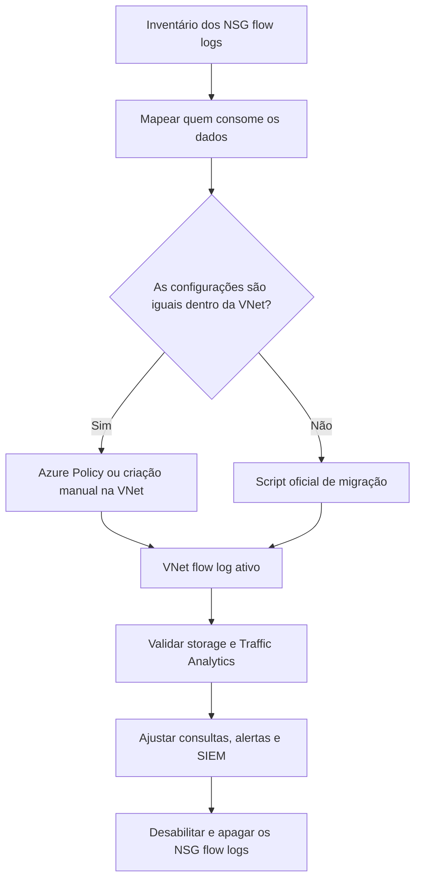

Fala pessoALL! Tudo certo por aí?

Hoje o assunto é um daqueles avisos de aposentadoria que todo mundo leu, marcou como "depois eu vejo" e seguiu a vida: os **NSG flow logs** vão embora.

A documentação da Microsoft dá a data: **30 de setembro de 2027**. Só que a primeira metade dessa aposentadoria já aconteceu. Desde **30 de junho de 2025** não dá mais para criar NSG flow log novo. O que existe continua funcionando, e o que não existe não nasce mais.

E o que acontece em 2027? A Microsoft diz que apaga os recursos de NSG flow log das assinaturas e que o Traffic Analytics deixa de ser suportado em cima deles. Os arquivos que já estão na storage account ficam, seguindo a retenção que você configurou. Ou seja: o histórico sobrevive, a coleta não.

O substituto é o **VNet flow log**, e sendo bem sincero, eu gosto mais dele. Você liga na VNet e pronto, em vez de sair caçando NSG por NSG. O problema é que essa migração tem cara de troca de chave e não é. O JSON muda de formato, o container muda de nome, a tabela do Log Analytics muda, e quem tem SIEM, workbook ou alerta lendo o formato antigo descobre isso no dia seguinte.

<!-- LUIZ: você já viu algum parser de SIEM, workbook ou alerta parar de trazer dado depois da troca de NSG flow log para VNet flow log? Se sim, conte aqui em duas frases o que quebrou e como percebeu, sem identificar o ambiente. -->

**Neste artigo, vamos levantar os NSG flow logs que ainda existem com o Resource Graph, entender o que muda no formato e na conta, criar um VNet flow log com Traffic Analytics em laboratório, validar que os dados chegaram e passar pelo caminho de migração do script oficial até o desligamento dos flow logs antigos.**

> Como não é mais possível criar NSG flow log, o laboratório deste artigo não consegue reproduzir o "antes" em uma assinatura nova. A parte de criação e validação do VNet flow log você executa do zero. A parte do script de migração só roda de verdade em assinatura que ainda tenha NSG flow log ativo, e é nela que você vai aplicar o que está nos Passos 1, 7 e 8.
{: .prompt-warning }

---

## O que muda de um para o outro?

O NSG flow log registra o tráfego que passa por um **Network Security Group**. Para cobrir uma VM com NSG na subnet e na NIC, a recomendação era ligar o flow log nos dois e conferir os dois.

O VNet flow log registra o tráfego que passa pela **rede virtual**. O alvo pode ser a VNet inteira, uma subnet ou uma NIC, e a precedência quando existe mais de um é NIC, depois subnet, depois VNet.

Na prática:

| Ponto | NSG flow logs | VNet flow logs |
| --- | --- | --- |
| Onde liga | Em cada NSG | Na VNet, na subnet ou na NIC |
| Criação de novos | Bloqueada desde 30/06/2025 | Disponível |
| Regras do Virtual Network Manager | Não identifica | Identifica (security admin rules) |
| Estado de criptografia da VNet | Não registra | Registra |
| Bytes e pacotes em fluxo stateless | Não | Sim |
| Application Gateway, VPN gateway, ExpressRoute gateway, API Management | Não suportado | Suportado |
| VMs das famílias D, E e F v6 | Não suportado | Suportado |
| Container na storage account | `insights-logs-networksecuritygroupflowevent` | `insights-logs-flowlogflowevent` |
| Tabela do Traffic Analytics | `AzureNetworkAnalytics_CL` | `NTANetAnalytics` |

A linha das VMs v6 merece atenção. Se o seu ambiente já começou a usar essas famílias, existe tráfego que o NSG flow log simplesmente não enxerga hoje.

O fluxo que eu seguiria em ambiente real é este:



### O formato do arquivo muda, e muda bastante

Os dois escrevem um `PT1H.json` por hora e por MAC address na storage account. As semelhanças acabam aí.

Uma tupla de NSG flow log versão 2, no exemplo da documentação:

```text
1542110377,10.5.16.4,203.0.113.118,59831,443,T,O,A,B,,,,
```

Uma tupla de VNet flow log, também da documentação:

```text
1663146003599,10.0.0.6,192.0.2.180,23956,443,6,O,B,NX,0,0,0,0
```

Lendo campo a campo:

| Campo | NSG flow log v2 | VNet flow log |
| --- | --- | --- |
| Protocolo | `T` ou `U` | Número IANA (`6` é TCP, `17` é UDP) |
| Permitido ou negado | Campo próprio, `A` ou `D` | Não existe campo próprio. Negado é o estado `D` |
| Estado do fluxo | `B`, `C`, `E` | `B`, `C`, `E`, `D` |
| Criptografia | Não existe | `X`, `NX` e variações |
| MAC address | Dentro de cada grupo de fluxos (`mac`) | No nível do registro (`macAddress`) |
| Regra | `rule` dentro de `properties.flows` | `rule` dentro de `flowRecords.flows[].flowGroups[]`, junto com o `aclID` |
| Categoria | `NetworkSecurityGroupFlowEvent` | `FlowLogFlowEvent` |

Repare na segunda linha. Na tupla antiga, a oitava posição é a decisão (`A` ou `D`) e a nona é o estado. Na nova, a oitava é o estado (`B`, `C`, `E` ou `D`) e a nona é a criptografia. Um parser que conta posição continua achando `D` no tráfego negado, mas nunca mais acha um `A`: todo fluxo permitido some da contagem, e o campo que ele lia como estado passa a trazer `NX`.

Ele não dá erro. Ele entrega número errado.

> Se existe SIEM, script ou ferramenta de terceiros lendo os blobs direto da storage account, essa pessoa ou esse time precisa saber da migração **antes** dela acontecer. O container muda, o caminho muda e a tupla muda.
{: .prompt-danger }

### E a conta, muda?

O modelo de cobrança é o mesmo: os dois são cobrados por GB de **Network flow logs collected**, com uma franquia de 5 GB por mês por assinatura. O Traffic Analytics cobra por GB processado e não tem franquia. Storage e Log Analytics são cobrados à parte.

A documentação descreve o VNet flow log como mais eficiente em custo e, na mesma página, avisa que o volume pode subir, porque ele registra tráfego que o NSG nunca viu, como o que atravessa os gateways. Em uma VNet só com VMs eu esperaria gravar menos, porque acaba a duplicidade de NSG na subnet e na NIC. Em uma VNet hub com VPN gateway ou ExpressRoute gateway, eu esperaria o contrário.

Não vou colocar preço aqui porque ele muda por região. Olhe o volume da primeira semana antes de ligar o resto do ambiente.

<!-- LUIZ: em algum ambiente que você migrou, o volume gravado na storage account subiu ou caiu depois da troca? Se tiver uma ordem de grandeza (percentual, não valor), vale uma frase aqui. -->

---

## Pré-requisitos

- Assinatura do Azure com permissão de **Owner** ou **Contributor** no laboratório. Em ambiente real, a role **Network Contributor** cobre o flow log, mas não inclui as ações de `Microsoft.Storage` nem as de `Microsoft.OperationalInsights` e `Microsoft.Insights` exigidas pelo Traffic Analytics;
- Provider **Microsoft.Insights** registrado na assinatura;
- Storage account **Standard**, na **mesma região** da VNet. Premium não é suportado, e a retenção automática só funciona em conta general-purpose v2;
- Log Analytics workspace, se for usar Traffic Analytics;
- Azure CLI 2.39.0 ou superior, ou o Cloud Shell;
- Para o script oficial de migração: **PowerShell 7** com o módulo Az.

> Permissão herdada de Management Group não é suportada para habilitar o Traffic Analytics. Se o seu acesso vem só por herança de MG, a criação do flow log passa e a parte de analytics falha.
{: .prompt-info }

> Esse laboratório gera custo: duas VMs, um IP público Standard, a storage account, a ingestão no Log Analytics e o processamento do Traffic Analytics. Faça a limpeza do final do artigo no mesmo dia.
{: .prompt-info }

---

## Mão na massa!

### Passo 1 - Levantar os NSG flow logs que ainda existem

Antes de migrar qualquer coisa, eu quero uma fotografia do "antes": quais flow logs existem, em que alvo, com qual storage account, qual retenção e se o Traffic Analytics está ligado.

O portal mostra isso em **Network Watcher > Flow logs**, mas para dezenas de assinaturas o Resource Graph resolve em uma consulta. Todo flow log, de NSG ou de VNet, é um recurso do tipo `microsoft.network/networkwatchers/flowlogs`. O que diferencia um do outro é o `targetResourceId`.

Se você ainda não usa o Resource Graph no dia a dia, o artigo de [consultas essenciais](https://blog.ruizsolutions.online/posts/azure-resource-graph-consultas-essenciais/) explica a ferramenta.

**Os arquivos deste artigo estão no meu repositório: [VNet Flow Logs](https://github.com/lfrleite/Ruiz-Online/tree/main/VNet%20Flow%20Logs)**

Consulta `024-inventario-nsg-flow-logs.kql`:

```kusto
// Artigo 024 - Migrando de NSG flow logs para VNet flow logs
// Azure Resource Graph: inventario dos flow logs por tipo de alvo.
// Rodar no Resource Graph Explorer ou pelo script 024-inventario-nsg-flow-logs.sh
resources
| where type =~ 'microsoft.network/networkwatchers/flowlogs'
| extend alvo = tolower(tostring(properties.targetResourceId))
| extend tipoAlvo = case(
    alvo contains '/networksecuritygroups/', 'NSG (migrar)',
    alvo contains '/subnets/', 'Subnet',
    alvo contains '/networkinterfaces/', 'NIC',
    alvo contains '/virtualnetworks/', 'VNet',
    'Outro')
| extend habilitado = tobool(properties.enabled)
| extend versao = toint(properties.format.version)
| extend retencaoDias = toint(properties.retentionPolicy.days)
| extend ta = properties.flowAnalyticsConfiguration.networkWatcherFlowAnalyticsConfiguration
| extend trafficAnalytics = tobool(ta.enabled)
| extend intervaloTA = toint(ta.trafficAnalyticsInterval)
| extend workspace = tostring(ta.workspaceResourceId)
| extend storage = tostring(properties.storageId)
| project subscriptionId, location, name, tipoAlvo, habilitado, versao, retencaoDias, trafficAnalytics, intervaloTA, alvo, storage, workspace
| order by tipoAlvo asc, subscriptionId asc, location asc
```

1. Pesquise por **Resource Graph Explorer** no portal;
2. Cole a consulta no editor;
3. Confira o escopo no topo da tela, para não consultar só uma assinatura sem perceber;
4. Clique em **Run query**.

<!-- PRINT 002: Resource Graph Explorer com a consulta de inventário colada e a grade de resultados visível, colunas name, tipoAlvo, habilitado, trafficAnalytics e alvo aparecendo. Em assinatura sem NSG flow log, tirar este print depois do Passo 4, com a linha do VNet flow log do laboratório -->
{: .shadow .rounded-10 }
<br>

Tudo que aparecer como `NSG (migrar)` é o seu backlog.

Para guardar o resultado em arquivo, o script `024-inventario-nsg-flow-logs.sh` roda a mesma consulta pelo CLI e grava um JSON com data e hora no nome:

```bash
#!/usr/bin/env bash
# Artigo 024 - Migrando de NSG flow logs para VNet flow logs
# Roda a consulta 024-inventario-nsg-flow-logs.kql no Azure Resource Graph
# e grava o resultado em JSON para servir de fotografia do "antes".
#
# Uso:
#   az login
#   bash 024-inventario-nsg-flow-logs.sh                      # todas as assinaturas que voce enxerga
#   bash 024-inventario-nsg-flow-logs.sh <subId1> <subId2>    # so as assinaturas informadas
#
# O script so le. Ele nao altera nenhum flow log.

set -euo pipefail

DIR="$(cd "$(dirname "${BASH_SOURCE[0]}")" && pwd)"
KQL="$DIR/024-inventario-nsg-flow-logs.kql"
SAIDA="inventario-flow-logs-$(date +%Y%m%d-%H%M).json"

if ! command -v az >/dev/null 2>&1; then
  echo "ERRO: Azure CLI nao encontrado. Use o Cloud Shell ou instale o az." >&2
  exit 1
fi

if ! az account show >/dev/null 2>&1; then
  echo "ERRO: sem sessao ativa. Rode 'az login' antes." >&2
  exit 1
fi

if [ ! -f "$KQL" ]; then
  echo "ERRO: arquivo $KQL nao encontrado. Deixe o .kql na mesma pasta do script." >&2
  exit 1
fi

# Remove as linhas de comentario e junta a consulta em uma linha so
QUERY="$(grep -v '^//' "$KQL" | tr '\n' ' ')"

ESCOPO=()
if [ "$#" -gt 0 ]; then
  ESCOPO=(--subscriptions "$@")
fi

echo "Consultando o Resource Graph..."
az graph query -q "$QUERY" --first 1000 ${ESCOPO[@]+"${ESCOPO[@]}"} --output json > "$SAIDA"

echo "Resultado completo gravado em: $SAIDA"
echo "Atencao: --first aceita no maximo 1000 registros por chamada."
echo "Se o seu ambiente tiver mais flow logs que isso, rode por assinatura."
```

> Guarde esse arquivo. Depois da migração ele é a sua referência para conferir se cada NSG flow log ganhou um substituto e para responder quando alguém perguntar "antes a gente logava isso?".
{: .prompt-tip }

Anote também quem consome os dados hoje: workbook, alerta de log, consulta salva, exportação para SIEM, script que baixa blob. O inventário técnico não mostra isso, e é a parte que dá trabalho.

---

### Passo 2 - Escolher o caminho da migração

A documentação oferece três caminhos e diz quando usar cada um.

O **script oficial** é indicado quando nem todas as NICs e subnets da VNet têm flow log, ou quando os NSG flow logs de uma mesma VNet têm configurações diferentes e você quer preservar essas diferenças.

A **Azure Policy** é indicada quando a configuração é uniforme dentro da VNet e você quer ligar o flow log na VNet inteira. A policy built-in se chama **Deploy a flow log resource with target virtual network**, e existe a irmã de auditoria, **Audit flow logs configuration for every virtual network**. Na lista de parâmetros documentada da policy de deploy aparecem região, storage account, Network Watcher e retenção. Não aparece workspace de Traffic Analytics, então confira esse ponto antes de contar com ela para isso.

O terceiro caminho é o **manual**: criar o VNet flow log pelo portal ou CLI e desligar os antigos. Para ambiente pequeno é o que eu faria, e é o que vamos fazer no laboratório.

Minha opinião: se você nunca teve motivo para logar só metade de uma VNet, não replique a bagunça antiga. Ligue na VNet inteira. A policy ainda cobre a VNet que alguém criar no mês que vem.

---

### Passo 3 - Montar o laboratório

Vamos criar uma VNet com uma subnet, um NSG com uma regra de bloqueio proposital, duas VMs Linux, uma storage account e um Log Analytics workspace.

| Recurso | Nome |
| --- | --- |
| Resource Group | `rg-flowlogs-lab-wus2-001` |
| Virtual Network | `vnet-flowlogs-lab-wus2-001` |
| Subnet | `snet-flowlogs-app-wus2-001` |
| NSG | `nsg-flowlogs-app-wus2-001` |
| VM com IP público | `vm-flowlogs-lab-001` |
| VM sem IP público | `vm-flowlogs-lab-002` |
| Log Analytics workspace | `log-flowlogs-lab-wus2-001` |
| VNet flow log | `fl-vnet-flowlogs-lab-wus2-001` |

A `vm-flowlogs-lab-001` recebe um IP público Standard na NIC. Ele não está ali para acesso remoto: nenhuma regra de entrada é criada. Ele serve como método explícito de saída, porque subnet nova tende a nascer privada. Esse assunto está detalhado no artigo sobre o [fim do default outbound access](https://blog.ruizsolutions.online/posts/azure-default-outbound-access-saida-explicita/). De quebra, IP público exposto costuma atrair varredura da internet, e isso gera tráfego negado de verdade para olharmos depois.

No Cloud Shell, baixe o script `024-lab-vnet-flow-logs.sh` e execute passando um nome de storage account que seja só seu:

```bash
bash 024-lab-vnet-flow-logs.sh stflowlogslab<seu-sufixo>
```

Conteúdo do script:

```bash
#!/usr/bin/env bash
# Artigo 024 - Migrando de NSG flow logs para VNet flow logs
# Monta o laboratorio: VNet, NSG, duas VMs Linux, storage account e workspace.
# O VNet flow log em si e criado no Passo 4 do artigo (portal ou CLI).
#
# Uso:
#   az login
#   bash 024-lab-vnet-flow-logs.sh <nome-da-storage-account>
#
# O nome da storage account e global: 3 a 24 caracteres, so minusculas e numeros.
# Nenhuma credencial fica no script. As VMs usam chave SSH gerada pelo az.

set -euo pipefail

if [ "$#" -ne 1 ]; then
  echo "Uso: bash 024-lab-vnet-flow-logs.sh <nome-da-storage-account>" >&2
  exit 1
fi

STORAGE="$1"
if ! [[ "$STORAGE" =~ ^[a-z0-9]{3,24}$ ]]; then
  echo "ERRO: nome de storage account invalido: $STORAGE" >&2
  exit 1
fi

if ! az account show >/dev/null 2>&1; then
  echo "ERRO: sem sessao ativa. Rode 'az login' antes." >&2
  exit 1
fi

# ---------- Variaveis ----------
LOCATION="westus2"
RG="rg-flowlogs-lab-wus2-001"
VNET="vnet-flowlogs-lab-wus2-001"
SUBNET="snet-flowlogs-app-wus2-001"
NSG="nsg-flowlogs-app-wus2-001"
VM1="vm-flowlogs-lab-001"
VM2="vm-flowlogs-lab-002"
VM_SIZE="Standard_B2s"   # troque se o tamanho nao estiver disponivel na sua assinatura
WORKSPACE="log-flowlogs-lab-wus2-001"

trap 'echo "ERRO na linha $LINENO. Confira a mensagem acima antes de rodar de novo." >&2' ERR

echo "1/6 Registrando o provider Microsoft.Insights..."
az provider register --namespace Microsoft.Insights

echo "2/6 Criando o resource group..."
az group create --name "$RG" --location "$LOCATION" --output none

echo "3/6 Criando NSG, regra de bloqueio e VNet..."
az network nsg create --resource-group "$RG" --name "$NSG" --location "$LOCATION" --output none

# Nega TCP 8080 dentro da VNet. Existe so para produzir fluxo negado de proposito.
az network nsg rule create --resource-group "$RG" --nsg-name "$NSG" \
  --name "Deny-TCP-8080-Inbound" --priority 200 --direction Inbound --access Deny \
  --protocol Tcp --source-address-prefixes VirtualNetwork --source-port-ranges '*' \
  --destination-address-prefixes VirtualNetwork --destination-port-ranges 8080 --output none

az network vnet create --resource-group "$RG" --name "$VNET" --location "$LOCATION" \
  --address-prefixes 10.60.0.0/16 --subnet-name "$SUBNET" --subnet-prefixes 10.60.1.0/24 \
  --nsg "$NSG" --output none

echo "4/6 Criando as VMs (leva alguns minutos)..."
# VM 001: IP publico Standard na NIC, que e um metodo explicito de saida.
# Nenhuma regra de entrada e criada: o NSG da subnet continua negando a internet.
az vm create --resource-group "$RG" --name "$VM1" --location "$LOCATION" \
  --image Ubuntu2404 --size "$VM_SIZE" --vnet-name "$VNET" --subnet "$SUBNET" \
  --nsg "" --public-ip-sku Standard --admin-username azureuser --generate-ssh-keys --output none

# VM 002: sem IP publico. Serve de destino para o trafego interno.
az vm create --resource-group "$RG" --name "$VM2" --location "$LOCATION" \
  --image Ubuntu2404 --size "$VM_SIZE" --vnet-name "$VNET" --subnet "$SUBNET" \
  --nsg "" --public-ip-address "" --admin-username azureuser --generate-ssh-keys --output none

echo "5/6 Criando a storage account (Standard, general-purpose v2)..."
az storage account create --resource-group "$RG" --name "$STORAGE" --location "$LOCATION" \
  --sku Standard_LRS --kind StorageV2 --min-tls-version TLS1_2 \
  --allow-blob-public-access false --output none

echo "6/6 Criando o Log Analytics workspace..."
az monitor log-analytics workspace create --resource-group "$RG" --name "$WORKSPACE" \
  --location "$LOCATION" --output none

echo
echo "Laboratorio pronto."
echo "Resource group : $RG"
echo "VNet           : $VNET"
echo "Storage account: $STORAGE"
echo "Workspace      : $WORKSPACE"
```

<!-- PRINT 003: Cloud Shell com a execução do 024-lab-vnet-flow-logs.sh concluída, mostrando as etapas 1/6 a 6/6 e o bloco final "Laboratorio pronto" com os nomes dos recursos -->
{: .shadow .rounded-10 }
<br>

Confirme o registro do provider antes de seguir:

```bash
az provider show --namespace Microsoft.Insights --query registrationState --output tsv
```

O retorno esperado é `Registered`.

<!-- PRINT 004: portal, resource group rg-flowlogs-lab-wus2-001 > Overview, lista de recursos com a VNet, o NSG, as duas VMs, o IP público, a storage account e o workspace -->
{: .shadow .rounded-10 }
<br>

---

### Passo 4 - Criar o VNet flow log com Traffic Analytics

Agora a parte que interessa. Pelo portal:

1. Pesquise por **Network Watcher**;
2. No menu lateral, em **Logs**, clique em **Flow logs**;
3. Clique em **+ Create**;

<!-- PRINT 005: Network Watcher | Flow logs com a lista vazia (ou só com flow logs antigos) e o botão + Create em destaque -->
{: .shadow .rounded-10 }
<br>

4. Na aba **Basics**, em **Flow log type**, selecione **Virtual network** e clique em **+ Select target resource**;
5. Marque a `vnet-flowlogs-lab-wus2-001` e clique em **Confirm selection**;

<!-- PRINT 006: painel Select target resource com as opções Virtual network, Subnet e Network interface visíveis, a vnet-flowlogs-lab-wus2-001 marcada e o botão Confirm selection -->
{: .shadow .rounded-10 }
<br>

6. Em **Flow Log Name**, informe:
   ```text
   fl-vnet-flowlogs-lab-wus2-001
   ```
7. Em **Storage accounts**, selecione a conta criada no Passo 3;
8. Em **Retention (days)**, informe `7`;

<!-- PRINT 007: aba Basics de Create a flow log preenchida: Flow log type Virtual network, alvo vnet-flowlogs-lab-wus2-001, Flow Log Name fl-vnet-flowlogs-lab-wus2-001, storage account do laboratório e Retention (days) 7 -->
{: .shadow .rounded-10 }
<br>

9. Clique em **Next: Analytics**;
10. Marque **Enable traffic analytics**;
11. Em **Traffic analytics processing interval**, selecione **Every 10 mins**;
12. Em **Log Analytics Workspace**, selecione `log-flowlogs-lab-wus2-001`;

<!-- PRINT 008: aba Analytics com Enable traffic analytics marcado, Traffic analytics processing interval em Every 10 mins e o workspace log-flowlogs-lab-wus2-001 selecionado -->
{: .shadow .rounded-10 }
<br>

13. Clique em **Review + create**;
14. Clique em **Create**.

> Se você deixar o campo do workspace como está, o portal cria um `DefaultWorkspace-{SubscriptionID}-{Region}` em um resource group `defaultresourcegroup-{Region}`. Em laboratório isso só suja a assinatura. Em ambiente real, isso espalha dado de rede em um workspace que ninguém governa.
{: .prompt-warning }

O intervalo padrão do Traffic Analytics é de 1 hora. Escolhi 10 minutos porque em laboratório ninguém quer esperar.

Quem prefere CLI resolve em um comando:

```bash
az network watcher flow-log create \
  --location westus2 \
  --resource-group rg-flowlogs-lab-wus2-001 \
  --name fl-vnet-flowlogs-lab-wus2-001 \
  --vnet vnet-flowlogs-lab-wus2-001 \
  --storage-account stflowlogslab<seu-sufixo> \
  --retention 7 \
  --traffic-analytics true \
  --workspace log-flowlogs-lab-wus2-001 \
  --interval 10
```

Um detalhe que confunde na primeira vez: o `--resource-group` desse comando é o da VNet, mas o recurso de flow log **não** é criado nele. Ele nasce no resource group do Network Watcher, o `NetworkWatcherRG`, dentro do `NetworkWatcher_westus2`. É lá que você consulta:

```bash
az network watcher flow-log show \
  --name fl-vnet-flowlogs-lab-wus2-001 \
  --resource-group NetworkWatcherRG \
  --location westus2
```

<!-- PRINT 009: Network Watcher | Flow logs listando fl-vnet-flowlogs-lab-wus2-001 com status habilitado, alvo vnet-flowlogs-lab-wus2-001, storage account e traffic analytics visíveis nas colunas -->
{: .shadow .rounded-10 }
<br>

Abra também o resource group do laboratório. O Traffic Analytics criou ali uma data collection rule e um data collection endpoint com o prefixo `NWTA`.

<!-- PRINT 010: resource group rg-flowlogs-lab-wus2-001 mostrando os recursos de data collection rule e data collection endpoint com prefixo NWTA ao lado do workspace -->
{: .shadow .rounded-10 }
<br>

> Não mexa nos recursos `NWTA`. Não renomeie, não mova, não coloque lock. A documentação avisa que qualquer operação neles pode fazer o Traffic Analytics parar, e que recurso com lock não é limpo quando o flow log é apagado.
{: .prompt-danger }

---

### Passo 5 - Gerar tráfego e conferir o arquivo na storage account

Flow log sem tráfego é pasta vazia. O script `024-gerar-trafego.sh` usa o Run Command para, de dentro da `vm-flowlogs-lab-001`, fazer três coisas em sequência: uma saída HTTPS para a internet, uma conexão na porta 22 da `vm-flowlogs-lab-002` (permitida pela regra padrão de VNet) e uma tentativa na porta 8080 (negada pela regra que criamos).

```bash
#!/usr/bin/env bash
# Artigo 024 - Migrando de NSG flow logs para VNet flow logs
# Gera trafego permitido e negado a partir da vm-flowlogs-lab-001 usando Run Command.
# Nao abre SSH nem RDP para a internet.
#
# Uso:
#   az login
#   bash 024-gerar-trafego.sh

set -euo pipefail

RG="rg-flowlogs-lab-wus2-001"
VM1="vm-flowlogs-lab-001"
VM2="vm-flowlogs-lab-002"

if ! az account show >/dev/null 2>&1; then
  echo "ERRO: sem sessao ativa. Rode 'az login' antes." >&2
  exit 1
fi

VM2_IP="$(az vm show --resource-group "$RG" --name "$VM2" --show-details --query privateIps --output tsv)"

if [ -z "$VM2_IP" ]; then
  echo "ERRO: nao consegui ler o IP privado da $VM2. A VM existe e esta ligada?" >&2
  exit 1
fi

echo "IP privado da $VM2: $VM2_IP"
echo "Gerando trafego a partir da $VM1 (cerca de 1 minuto)..."

az vm run-command invoke --resource-group "$RG" --name "$VM1" \
  --command-id RunShellScript \
  --scripts "for i in 1 2 3 4 5; do
    curl -s -o /dev/null -m 5 https://learn.microsoft.com && echo 'saida 443 ok';
    timeout 3 bash -c '</dev/tcp/$VM2_IP/22' && echo 'intra-vnet 22 ok';
    timeout 3 bash -c '</dev/tcp/$VM2_IP/8080' || echo 'intra-vnet 8080 sem resposta';
    sleep 5;
  done"
```

<!-- PRINT 011: Cloud Shell com a saída do 024-gerar-trafego.sh, mostrando o IP privado da vm-flowlogs-lab-002 e, no bloco de mensagem do Run Command, as linhas "saida 443 ok", "intra-vnet 22 ok" e "intra-vnet 8080 sem resposta" -->
{: .shadow .rounded-10 }
<br>

Aguarde alguns minutos e vá conferir a storage account:

1. Abra a storage account do laboratório;
2. Em **Data storage**, clique em **Containers**;
3. Entre no container **insights-logs-flowlogflowevent**;
4. Navegue pelas pastas até o arquivo `PT1H.json`.

O caminho segue este padrão:

```text
insights-logs-flowlogflowevent/flowLogResourceID=/{subscriptionID}_NETWORKWATCHERRG/NETWORKWATCHER_{Region}_{ResourceName}-{ResourceGroupName}-FLOWLOGS/y={year}/m={month}/d={day}/h={hour}/m=00/macAddress={macAddress}/PT1H.json
```

<!-- PRINT 012: storage account > Containers > insights-logs-flowlogflowevent navegado até a pasta macAddress=... com o arquivo PT1H.json e o caminho completo na barra de navegação -->
{: .shadow .rounded-10 }
<br>

A documentação mostra esse caminho de duas formas, uma na aba do portal e outra nas de PowerShell e CLI. Navegue e copie o que aparecer no seu ambiente.

Baixe o arquivo pelo menu **...** e abra em um editor. O que você procura é um bloco com a regra `Deny-TCP-8080-Inbound` e uma tupla com o estado `D`. O formato esperado é parecido com este, que é só um exemplo montado para o laboratório:

```json
{
  "aclID": "<guid-do-nsg>",
  "flowGroups": [
    {
      "rule": "Deny-TCP-8080-Inbound",
      "flowTuples": [
        "<timestamp>,10.60.1.4,10.60.1.5,<porta-origem>,8080,6,I,D,NX,0,0,0,0"
      ]
    }
  ]
}
```

<!-- PRINT 013: PT1H.json aberto em editor com um bloco de regra Deny-TCP-8080-Inbound e uma flowTuple com destino na porta 8080, protocolo 6 e estado D, e o campo flowLogVersion visível no topo do registro -->
{: .shadow .rounded-10 }
<br>

> O VNet flow log escreve nesse blob de minuto em minuto, por append. A documentação pede para não editar, sobrescrever nem apagar o conteúdo do blob da hora corrente, porque isso pode fazer todas as gravações seguintes daquela hora falharem. Baixar para ler não tem problema.
{: .prompt-warning }

---

### Passo 6 - Validar no Traffic Analytics

O dado bruto está na storage account. Agora quero ver o dado processado no workspace.

Aqui a paciência conta. Com intervalo de 10 minutos, o Traffic Analytics busca os blobs a cada 10 minutos, mas a documentação diz que a ingestão no Log Analytics pode levar até 1 hora, e que o dashboard pode demorar até 30 minutos para mostrar algo na primeira vez. Se você abrir logo depois de criar e encontrar tudo vazio, não saia recriando o flow log.

1. Em **Network Watcher**, no menu lateral, clique em **Traffic analytics**;
2. Selecione o workspace `log-flowlogs-lab-wus2-001`;
3. No seletor de recursos, escolha o resource group da **VNet**.

<!-- PRINT 014: Network Watcher | Traffic analytics com o workspace log-flowlogs-lab-wus2-001 selecionado e os blocos de fluxos permitidos e negados mostrando números -->
{: .shadow .rounded-10 }
<br>

Para consulta direta, abra o workspace em **Logs**. As consultas estão no arquivo `024-validacao-traffic-analytics.kql`:

```kusto
// Artigo 024 - Migrando de NSG flow logs para VNet flow logs
// Rodar no Log Analytics workspace usado pelo Traffic Analytics.
// Execute um bloco por vez.

// 1 - O que chegou na tabela nova e com quais valores
NTANetAnalytics
| where SubType == "FlowLog" and TimeGenerated > ago(24h)
| summarize Registros = count() by FlowType, FlowDirection, FlowStatus
| order by Registros desc

// 2 - Trafego negado por regra e porta
NTANetAnalytics
| where SubType == "FlowLog" and TimeGenerated > ago(24h)
| where DeniedInFlows > 0 or DeniedOutFlows > 0
| summarize Negados = sum(DeniedInFlows + DeniedOutFlows) by AclGroup, AclRule, DestPort, L4Protocol
| top 20 by Negados desc

// 3 - Quem conversa com quem dentro da rede
NTANetAnalytics
| where SubType == "FlowLog" and TimeGenerated > ago(24h)
| where isnotempty(SrcSubnet) and isnotempty(DestSubnet)
| summarize TotalBytes = sum(BytesSrcToDest + BytesDestToSrc) by SrcIp, DestIp, DestPort, L4Protocol
| top 20 by TotalBytes desc

// 4 - Tabela nova, registros por hora (acompanhar durante a virada)
NTANetAnalytics
| where SubType == "FlowLog" and TimeGenerated > ago(48h)
| summarize RegistrosNovos = count() by bin(TimeGenerated, 1h)
| order by TimeGenerated asc

// 5 - Tabela antiga, registros por hora (so existe em workspace que recebeu NSG flow logs)
AzureNetworkAnalytics_CL
| where SubType_s == "FlowLog" and TimeGenerated > ago(48h)
| summarize RegistrosAntigos = count() by bin(TimeGenerated, 1h)
| order by TimeGenerated asc
```

Rode a primeira e olhe os valores que aparecem em `FlowDirection` e `FlowStatus` no seu ambiente antes de escrever filtro em cima deles. A página de schema lista esses campos com letras (`I`, `O`, `A`, `D`) e a página de consultas de exemplo filtra por `Inbound` e `Outbound`. Na dúvida, o que vale é o que está na sua tabela.

<!-- PRINT 015: Log Analytics com a consulta 1 e o resultado, colunas FlowType, FlowDirection, FlowStatus e Registros visíveis, com pelo menos uma linha IntraVNet -->
{: .shadow .rounded-10 }
<br>

A segunda consulta precisa trazer a `Deny-TCP-8080-Inbound` na porta 8080. E, se o IP público da `vm-flowlogs-lab-001` já estiver no ar há algum tempo, vai trazer também a regra padrão de negação de entrada com portas que você nunca abriu. É a internet batendo na porta.

<!-- PRINT 016: resultado da consulta 2 com AclRule Deny-TCP-8080-Inbound e DestPort 8080, mais as linhas da regra padrão de negação de entrada com as portas tentadas a partir da internet -->
{: .shadow .rounded-10 }
<br>

#### De-para das consultas antigas

Esse é o trabalho que ninguém coloca no cronograma. Toda consulta, alerta e workbook que lê `AzureNetworkAnalytics_CL` precisa ser reescrito para `NTANetAnalytics`. Os nomes das colunas perdem o sufixo de tipo e alguns mudam de nome:

| `AzureNetworkAnalytics_CL` | `NTANetAnalytics` |
| --- | --- |
| `SubType_s` | `SubType` |
| `FlowType_s` | `FlowType` |
| `SrcIP_s` e `DestIP_s` | `SrcIp` e `DestIp` |
| `DestPort_d` | `DestPort` |
| `NSGList_s` | `AclGroup` |
| `NSGRule_s` | `AclRule` |
| `VM1_s` e `VM2_s` | `SrcVm` e `DestVm` |
| `Subnet1_s` e `Subnet2_s` | `SrcSubnet` e `DestSubnet` |
| `OutboundBytes_d` | `BytesSrcToDest` |
| `InboundBytes_d` | `BytesDestToSrc` |
| `AzureNetworkAnalyticsIPDetails_CL` | `NTAIpDetails` |

O histórico não é convertido. O que foi ingerido na tabela antiga fica nela, pelo tempo de retenção do workspace. Para um relatório que atravessa a data da virada, você vai consultar as duas tabelas.

---

### Passo 7 - Migrar com o script oficial

Este passo é para quem tem NSG flow log de verdade. No laboratório novo a tela vai aparecer com os contadores zerados, e tudo bem.

A Microsoft entrega um script PowerShell gerado pelo próprio portal, já com as suas assinaturas e regiões:

1. Em **Network Watcher**, em **Logs**, clique em **Migrate flow logs**;
2. Selecione as assinaturas que têm NSG flow logs para migrar;
3. Para cada assinatura, selecione as regiões. O campo **Total NSG flow logs** mostra o total das assinaturas e **Selected NSG flow logs** mostra quantos estão nas regiões escolhidas;
4. Clique em **Download script and JSON file**.

<!-- PRINT 017: Network Watcher | Migrate flow logs com assinatura e região selecionadas, contadores Total NSG flow logs e Selected NSG flow logs visíveis e o botão Download script and JSON file. Em assinatura sem NSG flow log os contadores ficam em zero -->
{: .shadow .rounded-10 }
<br>

O download é um `MigrateFlowLogs.zip` com dois arquivos:

```text
MigrationFromNsgToAzureFlowLogging.ps1
RegionSubscriptionConfig.json
```

Extraia, abra um PowerShell 7 autenticado no Azure e execute o script. O primeiro menu é este:

```text
Select one of the following options for flowlog migration:
1. Run analysis
2. Delete NSG flowlogs
3. Quit
```

Escolha **1**. A opção **2** desse primeiro menu, **Delete NSG flowlogs**, não tem explicação na página de migração, e eu não usaria às cegas. O caminho que a documentação descreve para apagar os flow logs antigos é o portal, e é ele que está no Passo 8.

Na análise, o script pede o caminho do JSON e a quantidade de threads, com padrão de 16. A análise gera um relatório na tela e um arquivo `AnalysisReport-<subscriptionId>-<region>-<time>.html` na mesma pasta, dizendo quantos NSG flow logs serão desabilitados e quantos VNet flow logs serão criados. Compare com o inventário do Passo 1 antes de seguir.

Depois da análise aparece o segundo menu:

```text
Select one of the following options for flowlog migration:
1. Re-Run analysis
2. Proceed with migration with aggregation
3. Proceed with migration without aggregation
4. Quit
```

A diferença entre as opções 2 e 3 está no exemplo da própria documentação: um NSG associado a três NICs da mesma VNet vira **um** VNet flow log na VNet com agregação, ou **três** flow logs, um por NIC, sem agregação. Eu iria de agregação, salvo se existir motivo real para manter a granularidade.

No fim, o script mostra o resumo e pergunta:

```text
Do you want to rollback? You won't get the option to revert the actions done now again (y/n):
```

Responder `n` confirma a migração. Responder `y` desfaz. Depois do `n`, não tem volta pelo script.

> Enquanto o script roda, não altere a topologia das regiões e assinaturas envolvidas. Nada de criar subnet, mover NIC ou trocar NSG no meio da migração. Em ambiente corporativo isso pede janela e aviso para os outros times.
{: .prompt-danger }

Dois limites documentados que valem a leitura antes de rodar:

- Em **VM scale set com load balancer**, o script liga o flow log na subnet do scale set. Se as NICs não compartilhavam o mesmo NSG flow log, ele usa a configuração de uma delas;
- Ambientes com **PaaS** em que o NSG flow log está na sua assinatura e o recurso alvo está em outra não são suportados. Nesses, crie o VNet flow log manualmente na VNet ou subnet.

<!-- LUIZ: se você rodar o script em uma assinatura antiga com NSG flow log ativo, tire os prints do relatório de análise e do resumo final e me diga quantos NSG flow logs viraram quantos VNet flow logs com agregação. Vale incluir aqui como exemplo, sem nome de recurso real. -->

---

### Passo 8 - Desligar e apagar os NSG flow logs antigos

Aqui a documentação se contradiz um pouco, e eu prefiro mostrar isso a esconder. A visão geral do VNet flow log recomenda **desabilitar o NSG flow log antes** de habilitar o novo nos mesmos workloads, para evitar registro duplicado e custo extra. O guia de design de monitoramento de rede recomenda desligar o antigo **depois** de confirmar que o novo está gravando.

Eu fico com a segunda ordem. Algumas horas de log duplicado custam dinheiro. Algumas horas sem log nenhum, justo no dia em que alguém mexeu na rede, custam uma investigação que não vai ter resposta. O que eu não faria é deixar os dois ligados por semanas.

Com o script oficial você não escolhe a ordem: na mesma execução ele cria os VNet flow logs e deixa os NSG flow logs migrados como **desabilitados**. Fica faltando apagar.

Pelo portal:

1. Em **Network Watcher > Flow logs**, adicione um filtro para listar só os flow logs de NSG das assinaturas e regiões migradas;
2. Marque os flow logs que estão desabilitados;
3. Clique em **Delete**;
4. Digite `delete` e confirme.

<!-- PRINT 018: Network Watcher | Flow logs com filtro por tipo aplicado, flow logs de NSG com status desabilitado selecionados e o botão Delete em destaque. Em assinatura sem NSG flow log, tirar o print só do filtro aplicado -->
{: .shadow .rounded-10 }
<br>

Se você migrou manualmente, o desligamento é por sua conta. Um NSG flow log com Traffic Analytics ligado só pode ser desabilitado depois que o Traffic Analytics for desligado nele: abra o flow log, desmarque **Enable traffic analytics**, salve, e só então use o **Disable** da lista. Para apagar pelo CLI:

```bash
az network watcher flow-log delete \
  --location <regiao> \
  --name <nome-do-nsg-flow-log>
```

> Apagar o flow log não apaga os dados. Os blobs continuam na storage account até a retenção vencer ou até alguém remover. Se o seu requisito de auditoria pede um ano de histórico, o container `insights-logs-networksecuritygroupflowevent` precisa ficar onde está.
{: .prompt-info }

Rode de novo a consulta do Passo 1. O objetivo é a coluna `tipoAlvo` não trazer mais nenhuma linha `NSG (migrar)`.

---

## Erros comuns

### A página de flow logs mostra "Failed to load" ou a criação falha por autorização

Quase sempre é o provider `Microsoft.Insights` sem registro na assinatura.

```bash
az provider show --namespace Microsoft.Insights --query registrationState --output tsv
```

---

### O flow log foi criado e o container não aparece

Confira três coisas: se a storage account é Standard e está na mesma região da VNet, se existe tráfego passando e se o flow log está habilitado.

```bash
az network watcher flow-log show \
  --name fl-vnet-flowlogs-lab-wus2-001 \
  --resource-group NetworkWatcherRG \
  --location westus2 \
  --query "{habilitado:enabled, alvo:targetResourceId, storage:storageId}"
```

Se a storage account usa firewall, a documentação pede a exceção **Allow Azure services on the trusted services list to access this storage account**.

---

### O Traffic Analytics está vazio

Antes de 30 minutos, é só espera. Depois disso, verifique se você selecionou o resource group da VNet no seletor do dashboard, e não o da VM ou do NSG. Confira também se a tabela existe e tem dado:

```kusto
NTANetAnalytics
| where TimeGenerated > ago(2h)
| summarize count() by SubType
```

Workspace atrás de Network Security Perimeter não é suportado pelo Traffic Analytics.

---

### Recursos aparecem como "Unknown"

O Traffic Analytics redescobre VMs, NICs, VNets e subnets a cada 6 horas. Tráfego de uma VM criada depois da última descoberta fica como `Unknown` até a próxima. O mesmo vale quando a outra ponta do fluxo está em uma assinatura sem nenhum flow log enviando para o mesmo workspace.

---

## Checklist

- [x] Passo 1 - Inventário dos flow logs por tipo de alvo e lista de quem consome os dados;
- [x] Passo 2 - Caminho de migração escolhido: script, Policy ou manual;
- [x] Passo 3 - Laboratório criado com VNet, NSG, VMs, storage account e workspace;
- [x] Passo 4 - VNet flow log criado com Traffic Analytics;
- [x] Passo 5 - Tráfego gerado e `PT1H.json` conferido no container `insights-logs-flowlogflowevent`;
- [x] Passo 6 - Dados validados na tabela `NTANetAnalytics` e consultas antigas mapeadas;
- [x] Passo 7 - Script oficial analisado e executado nas assinaturas com NSG flow log;
- [x] Passo 8 - NSG flow logs desabilitados e apagados, inventário refeito.

---

## Limpeza do ambiente

O flow log mora no resource group do Network Watcher, então apagar o resource group do laboratório não leva ele junto. Comece por ele:

```bash
az network watcher flow-log delete \
  --location westus2 \
  --name fl-vnet-flowlogs-lab-wus2-001
```

Depois, o resource group:

```bash
az group delete \
  --name rg-flowlogs-lab-wus2-001 \
  --yes \
  --no-wait
```

> Em ambiente real, muito cuidado com esse comando. Ele remove tudo dentro do Resource Group, inclusive a storage account com os logs.
{: .prompt-danger }

Confira se não sobrou flow log órfão na região:

```bash
az network watcher flow-log list --location westus2 --output table
```

<!-- PRINT 019: Cloud Shell com o flow-log delete executado, o az group delete disparado e o flow-log list da região westus2 sem o flow log do laboratório -->
{: .shadow .rounded-10 }
<br>

---

## Artigos

| Nome | Link |
| :---: | :---: |
| Arquivos deste laboratório | <https://github.com/lfrleite/Ruiz-Online/tree/main/VNet%20Flow%20Logs> |
| Resource Graph na prática: as consultas essenciais | <https://blog.ruizsolutions.online/posts/azure-resource-graph-consultas-essenciais/> |
| O fim do default outbound access | <https://blog.ruizsolutions.online/posts/azure-default-outbound-access-saida-explicita/> |
| Migrate from NSG flow logs to virtual network flow logs | <https://learn.microsoft.com/en-us/azure/network-watcher/nsg-flow-logs-migrate> |
| Virtual network flow logs overview | <https://learn.microsoft.com/en-us/azure/network-watcher/vnet-flow-logs-overview> |
| Create, change, enable, disable, or delete virtual network flow logs | <https://learn.microsoft.com/en-us/azure/network-watcher/vnet-flow-logs-manage> |
| Flow logging for network security groups | <https://learn.microsoft.com/en-us/azure/network-watcher/nsg-flow-logs-overview> |
| Change, enable, disable, or delete NSG flow logs | <https://learn.microsoft.com/en-us/azure/network-watcher/nsg-flow-logs-manage> |
| Audit and deploy virtual network flow logs using Azure Policy | <https://learn.microsoft.com/en-us/azure/network-watcher/vnet-flow-logs-policy> |
| Traffic analytics overview | <https://learn.microsoft.com/en-us/azure/network-watcher/traffic-analytics> |
| Traffic analytics schema and data aggregation | <https://learn.microsoft.com/en-us/azure/network-watcher/traffic-analytics-schema> |
| Use queries in traffic analytics | <https://learn.microsoft.com/en-us/azure/network-watcher/traffic-analytics-queries> |
| Azure RBAC permissions for Network Watcher | <https://learn.microsoft.com/en-us/azure/network-watcher/rbac-permissions> |
| Network Watcher FAQ | <https://learn.microsoft.com/en-us/azure/network-watcher/frequently-asked-questions> |
| az network watcher flow-log | <https://learn.microsoft.com/en-us/cli/azure/network/watcher/flow-log> |
| Microsoft.Network networkWatchers/flowLogs | <https://learn.microsoft.com/en-us/azure/templates/microsoft.network/networkwatchers/flowlogs> |

---

## The End!

Chegamos ao fim de um artigo com mais leitura do que clique, e foi de propósito. Criar um VNet flow log é rápido. O que consome o tempo de uma migração dessas é descobrir quem lê os dados antigos, reescrever consulta, avisar o time de segurança e acompanhar a conta na primeira semana.

A data de 30 de setembro de 2027 parece longe. Eu não esperaria. O NSG flow log já não cobre as VMs v6, já não pode ser criado em NSG novo, e a cada VNet que nasce o seu ambiente fica com um pedaço a mais sem log. Quem migra agora escolhe a janela. Quem deixa para 2027 migra na semana em que a Microsoft apagar os recursos.

Flow log que ninguém consulta é só conta de storage. Aproveite a migração para decidir o que você quer saber da sua rede.

Espero que vocês tenham curtido tanto quanto eu curti de produzi-lo. Deixem seus comentários no meu Linkedin sobre o que você achou e se fez sentido!

Obrigado mais uma vez por me acompanharem até aqui! Nos vemos na próxima!
