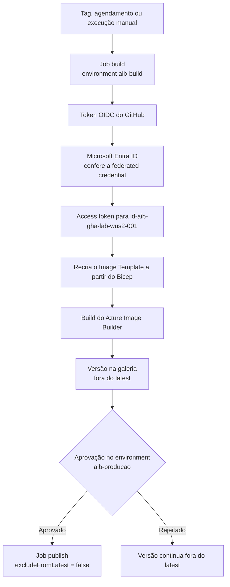

Fala pessoALL! Chegamos na continuação que eu fiquei devendo!

No final do artigo sobre o [Azure Image Builder](https://blog.ruizsolutions.online/posts/azure-image-builder-windows-linux/) eu deixei uma promessa: o próximo passo natural daquele laboratório seria levar os templates para um repositório e deixar um pipeline cuidar do build. Promessa feita, promessa cobrada.

Naquele artigo o processo inteiro saiu do Cloud Shell. Criamos o JSON, rodamos o `sed` para trocar os parâmetros, criamos o template e disparamos o build na mão. Para aprender o serviço é o melhor caminho. Para manter Golden Image viva por dois anos, não.

O problema aparece no terceiro mês. Quem rodou o último build? O JSON que está no Cloud Shell de alguém é o mesmo que gerou a imagem que está em produção? E quando sai o patch do mês, alguém lembra de rodar de novo?

Tem ainda a questão da credencial. O jeito antigo de ligar pipeline ao Azure era criar um service principal, gerar um client secret e colar no GitHub. Funciona, até o secret vencer numa sexta à noite ou aparecer em um log que não devia.

**Neste artigo, vamos pegar o laboratório do artigo anterior e colocar a imagem Ubuntu 24.04 dentro de um pipeline do GitHub Actions: template em Bicep versionado no repositório, login no Azure por OIDC sem nenhum secret de senha, versão da imagem vinda da tag ou do número do run, build agendado uma vez por mês e uma aprovação manual antes de a versão virar `latest` na Azure Compute Gallery.**

> Este artigo não recria a rede, a galeria nem a Managed Identity do Image Builder. Ele parte do ambiente `rg-aib-lab-wus2-001` do artigo anterior. Se você removeu aquele laboratório, refaça até o Passo 8 de lá antes de continuar aqui.
{: .prompt-warning }

---

## Mas antes, como um pipeline entra no Azure sem senha?

O nome técnico é **workload identity federation**. Na prática, o Microsoft Entra ID passa a confiar em tokens emitidos por outro provedor de identidade, que aqui é o GitHub.

A cada job, o GitHub emite um token OIDC assinado. Dentro dele vai um campo chamado **subject**, que diz de onde aquele job veio: qual repositório e qual branch, tag ou environment. Do lado do Azure existe uma **federated credential** com o subject esperado. Se os dois batem, o Entra ID troca o token do GitHub por um access token do Azure. No repositório ficam só três identificadores, e nenhum deles é senha: client ID, tenant ID e subscription ID.

A federated credential pode ficar em dois lugares: em um **app registration** ou em uma **User Assigned Managed Identity**. A documentação da Microsoft trata os dois como opções válidas para o `azure/login`.

Eu vou de Managed Identity neste laboratório, por dois motivos.

O primeiro é permissão. Em muita empresa o registro de aplicativos no Entra ID é bloqueado para usuário comum, e o time de infra precisa abrir chamado para alguém criar o app registration. Managed Identity é recurso do Azure, e Contributor no Resource Group já resolve.

O segundo é o tempo do token. O README da action `azure/login` avisa que o access token obtido por OIDC dura por padrão 1 hora quando a identidade é um service principal e 24 horas quando é Managed Identity. Build de imagem Windows com Windows Update passa de 1 hora com facilidade. Com app registration, o risco é o pipeline perder a sessão no meio da espera.

O desenho final fica assim:



Repare que são **duas identidades** no jogo e elas não se misturam:

| Identidade | Quem usa | Para quê |
| --- | --- | --- |
| `id-aib-lab-wus2-001` | O serviço Azure Image Builder | Gravar a versão na galeria e entrar na subnet. Já existe desde o artigo anterior |
| `id-aib-gha-lab-wus2-001` | O GitHub Actions | Criar o Image Template, disparar o build e alterar a versão na galeria. Vamos criar agora |

---

## Pré-requisitos

* O laboratório do [artigo anterior](https://blog.ruizsolutions.online/posts/azure-image-builder-windows-linux/) de pé: Resource Group, VNet com NAT Gateway, Managed Identity `id-aib-lab-wus2-001` com a role atribuída, galeria `gal_aib_lab_wus2_001` e a Image Definition `imgdef-ubuntu2404`;
* Permissão de **Owner** ou de **User Access Administrator** mais **Contributor** na assinatura, para criar a role customizada e o role assignment;
* Uma conta no GitHub e um repositório novo para o laboratório;
* O repositório do laboratório precisa ser **público**, a não ser que a sua organização tenha GitHub Enterprise. Environments existem em repositório público em todos os planos atuais, mas a regra de **Required reviewers** em repositório privado só funciona no Enterprise. Nos planos Free, Pro e Team ela vale apenas para repositório público;
* Azure CLI. O Cloud Shell atende.

> O custo deste laboratório é o mesmo do anterior: o NAT Gateway cobrando por hora, os recursos temporários de cada build e o armazenamento de cada versão publicada na galeria. Do lado do GitHub, o job fica quase todo o tempo parado esperando o build, então confira como o seu plano cobra os minutos de runner antes de agendar isso em repositório privado.
{: .prompt-info }

---

## Mão na massa!

### Passo 1 - Criar a identidade do pipeline, a role e as federated credentials

Tudo o que o lado Azure precisa cabe em um script. Antes de rodar, vale entender o que ele faz.

#### A role do pipeline

O pipeline não precisa de Contributor. Ele precisa criar e executar Image Template, usar a identidade do Image Builder, fazer um deployment de Bicep e alterar uma versão de imagem. Só isso.

<!-- VALIDAR: rodar o pipeline inteiro só com esta role e conferir três pontos. (1) Se o deployment do Bicep falhar com erro de autorização citando a subnet, incluir Microsoft.Network/virtualNetworks/read e Microsoft.Network/virtualNetworks/subnets/join/action na role: o Learn exige o join apenas da identidade do template (id-aib-lab-wus2-001) e não diz nada sobre quem cria o template. (2) Se o curinga Microsoft.VirtualMachineImages/imageTemplates/* cobre delete, write, read e run. (3) Se galleries/images/versions/write basta para o az sig image-version update do job publish. -->

**Acesse o meu repositório e baixe os arquivos da pasta [Azure Image Builder - GitHub Actions](https://github.com/lfrleite/Ruiz-Online/tree/main/Azure%20Image%20Builder%20-%20GitHub%20Actions)**

Conteúdo do `Custom_Role_AIB_Pipeline.json`:

```json
{
  "Name": "role-aib-lab-pipeline",
  "IsCustom": true,
  "Description": "Permite ao pipeline do GitHub Actions criar e executar Image Templates do Azure VM Image Builder e alterar versões de imagem na Azure Compute Gallery.",
  "Actions": [
    "Microsoft.VirtualMachineImages/imageTemplates/*",
    "Microsoft.ManagedIdentity/userAssignedIdentities/read",
    "Microsoft.ManagedIdentity/userAssignedIdentities/assign/action",
    "Microsoft.Compute/galleries/read",
    "Microsoft.Compute/galleries/images/read",
    "Microsoft.Compute/galleries/images/versions/read",
    "Microsoft.Compute/galleries/images/versions/write",
    "Microsoft.Resources/deployments/read",
    "Microsoft.Resources/deployments/write",
    "Microsoft.Resources/deployments/validate/action",
    "Microsoft.Resources/deployments/operations/read",
    "Microsoft.Resources/deployments/operationstatuses/read",
    "Microsoft.Resources/subscriptions/resourceGroups/read"
  ],
  "NotActions": [],
  "AssignableScopes": [
    "/subscriptions/<SUBSCRIPTION_ID>"
  ]
}
```

A linha que mais gente esquece é a `Microsoft.ManagedIdentity/userAssignedIdentities/assign/action`. O template referencia a identidade `id-aib-lab-wus2-001`, e quem cria um recurso com uma User Assigned Identity precisa ter o direito de atribuir essa identidade.

> No artigo anterior a role foi criada pelo Portal, com o JSON dentro do wrapper `properties`. Este arquivo está no outro formato, o do `az role definition create`, com `Name`, `IsCustom`, `Actions` e `AssignableScopes` na raiz. Lá eu avisei que os dois não são intercambiáveis, e continua valendo.
{: .prompt-warning }

#### O subject da federated credential

Aqui mora o erro mais comum de quem configura OIDC pela primeira vez. A federated credential não aceita curinga em nenhum campo, e o subject precisa bater caractere por caractere com o que o GitHub envia.

O formato depende de como o job roda:

```text
repo:<owner>/<repo>:ref:refs/heads/main          job disparado na branch main
repo:<owner>/<repo>:ref:refs/tags/v1.1.0         job disparado pela tag v1.1.0
repo:<owner>/<repo>:environment:aib-producao     job que declara um environment
```

Quando o job declara um `environment`, o subject passa a ser o do environment, e não o da branch ou da tag. Isso resolve um problema chato do nosso pipeline: ele vai ser disparado por tag, por agendamento e na mão. Se cada job usar um environment, duas credenciais cobrem os três gatilhos. Sem environment, eu precisaria de uma credencial por tag, o que não faz sentido.

Tem um segundo detalhe, e esse é recente. Repositórios criados a partir de 15 de julho de 2026 emitem o subject no **formato imutável**, com o ID numérico do owner e do repositório depois de um `@`:

```text
repo:<owner>@<owner_id>/<repo>@<repo_id>:environment:aib-producao
```

A mudança existe para fechar uma brecha: no formato antigo, só com nomes, um repositório renomeado ou recriado com o mesmo nome continuava batendo com a credencial. Repositórios antigos seguem no formato por nome até alguém optar pelo novo nas configurações de OIDC, ou até serem renomeados ou transferidos: depois dessa data, renomear ou transferir também muda o subject para o formato imutável. Se você tem pipeline antigo com OIDC, guarde essa informação, porque um simples rename de repositório passa a quebrar o login.

Como o repositório deste laboratório é novo, ele já nasce no formato imutável. Os dois IDs saem da API do GitHub. Com a GitHub CLI autenticada:

```bash
gh api repos/<owner>/<repo> --jq '{owner_id: .owner.id, repo_id: .id}'
```

Sem a GitHub CLI, o mesmo endpoint responde por `curl` quando o repositório é público. O ID do repositório é o campo `id` da raiz e o do owner é o `id` dentro de `owner`:

```bash
curl -s https://api.github.com/repos/<owner>/<repo>
```

#### O script

Coloque o `setup-oidc-github.sh` e o `Custom_Role_AIB_Pipeline.json` na mesma pasta do Cloud Shell.

Conteúdo do `setup-oidc-github.sh`:

```bash
#!/usr/bin/env bash
# Prepara o lado Azure do pipeline de Golden Image com GitHub Actions e OIDC.
# Cria a identidade do pipeline, a role customizada, o role assignment e as
# duas federated credentials (uma por environment do GitHub).
#
# Uso:
#   export GH_OWNER="<usuario-ou-organizacao>"
#   export GH_REPO="<repositorio>"
#   export GH_OWNER_ID="<id-numerico-do-owner>"   # só para subject imutável
#   export GH_REPO_ID="<id-numerico-do-repo>"     # só para subject imutável
#   bash setup-oidc-github.sh

set -euo pipefail

RESOURCE_GROUP="rg-aib-lab-wus2-001"
LOCATION="westus2"
PIPELINE_IDENTITY="id-aib-gha-lab-wus2-001"
ROLE_NAME="role-aib-lab-pipeline"
ROLE_FILE="Custom_Role_AIB_Pipeline.json"
ENV_BUILD="aib-build"
ENV_PUBLISH="aib-producao"
ISSUER="https://token.actions.githubusercontent.com"
AUDIENCE="api://AzureADTokenExchange"

: "${GH_OWNER:?Defina GH_OWNER com o usuário ou a organização do GitHub}"
: "${GH_REPO:?Defina GH_REPO com o nome do repositório}"
GH_OWNER_ID="${GH_OWNER_ID:-}"
GH_REPO_ID="${GH_REPO_ID:-}"

if ! az account show >/dev/null 2>&1; then
  echo "ERRO: sem sessão no Azure. Rode 'az login' antes." >&2
  exit 1
fi

if [[ ! -f "$ROLE_FILE" ]]; then
  echo "ERRO: $ROLE_FILE não está na pasta atual." >&2
  exit 1
fi

if ! az group show --name "$RESOURCE_GROUP" >/dev/null 2>&1; then
  echo "ERRO: o Resource Group $RESOURCE_GROUP não existe. Ele vem do laboratório anterior." >&2
  exit 1
fi

SUBSCRIPTION_ID=$(az account show --query id -o tsv)
TENANT_ID=$(az account show --query tenantId -o tsv)
RG_SCOPE="/subscriptions/${SUBSCRIPTION_ID}/resourceGroups/${RESOURCE_GROUP}"

# Subject no formato imutável quando os dois IDs foram informados.
if [[ -n "$GH_OWNER_ID" && -n "$GH_REPO_ID" ]]; then
  SUBJECT_PREFIX="repo:${GH_OWNER}@${GH_OWNER_ID}/${GH_REPO}@${GH_REPO_ID}"
elif [[ -z "$GH_OWNER_ID" && -z "$GH_REPO_ID" ]]; then
  SUBJECT_PREFIX="repo:${GH_OWNER}/${GH_REPO}"
else
  echo "ERRO: informe GH_OWNER_ID e GH_REPO_ID juntos, ou nenhum dos dois." >&2
  exit 1
fi

echo "==> Identidade do pipeline: $PIPELINE_IDENTITY"
if ! az identity show --resource-group "$RESOURCE_GROUP" --name "$PIPELINE_IDENTITY" >/dev/null 2>&1; then
  az identity create \
    --resource-group "$RESOURCE_GROUP" \
    --name "$PIPELINE_IDENTITY" \
    --location "$LOCATION" \
    --output none
fi

CLIENT_ID=$(az identity show --resource-group "$RESOURCE_GROUP" --name "$PIPELINE_IDENTITY" --query clientId -o tsv)
PRINCIPAL_ID=$(az identity show --resource-group "$RESOURCE_GROUP" --name "$PIPELINE_IDENTITY" --query principalId -o tsv)

echo "==> Role customizada: $ROLE_NAME"
ROLE_COUNT=$(az role definition list --name "$ROLE_NAME" --query "length(@)" -o tsv)
if [[ "$ROLE_COUNT" == "0" ]]; then
  TMP_ROLE=$(mktemp)
  trap 'rm -f "$TMP_ROLE"' EXIT
  sed "s|<SUBSCRIPTION_ID>|${SUBSCRIPTION_ID}|g" "$ROLE_FILE" > "$TMP_ROLE"
  az role definition create --role-definition "$TMP_ROLE" --output none
  echo "    Role criada. Aguardando 30 segundos pela propagação."
  sleep 30
fi

echo "==> Role assignment no escopo $RESOURCE_GROUP"
az role assignment create \
  --assignee-object-id "$PRINCIPAL_ID" \
  --assignee-principal-type ServicePrincipal \
  --role "$ROLE_NAME" \
  --scope "$RG_SCOPE" \
  --output none

# As credenciais da mesma identidade precisam ser criadas uma de cada vez.
for ENV_NAME in "$ENV_BUILD" "$ENV_PUBLISH"; do
  echo "==> Federated credential: ${SUBJECT_PREFIX}:environment:${ENV_NAME}"
  az identity federated-credential create \
    --name "fic-github-${ENV_NAME}" \
    --identity-name "$PIPELINE_IDENTITY" \
    --resource-group "$RESOURCE_GROUP" \
    --issuer "$ISSUER" \
    --subject "${SUBJECT_PREFIX}:environment:${ENV_NAME}" \
    --audiences "$AUDIENCE" \
    --output none
done

echo
echo "Valores para os secrets do repositório ${GH_OWNER}/${GH_REPO}:"
echo "  AZURE_CLIENT_ID       = $CLIENT_ID"
echo "  AZURE_TENANT_ID       = $TENANT_ID"
echo "  AZURE_SUBSCRIPTION_ID = $SUBSCRIPTION_ID"
```

Para executar, informe o owner e o repositório. Os dois IDs entram quando o repositório usa o formato imutável:

```bash
export GH_OWNER="<usuario-ou-organizacao>"
export GH_REPO="<repositorio>"
export GH_OWNER_ID="<id-numerico-do-owner>"
export GH_REPO_ID="<id-numerico-do-repo>"

bash setup-oidc-github.sh
```

<!-- PRINT 002: Cloud Shell com a saída do setup-oidc-github.sh: as linhas "==>" de identidade, role, role assignment e das duas federated credentials, e no final os três valores AZURE_CLIENT_ID, AZURE_TENANT_ID e AZURE_SUBSCRIPTION_ID (cobrir os GUIDs) -->
{: .shadow .rounded-10 }
<br>

Guarde os três valores do final. Eles vão para o GitHub no Passo 3.

O script cria as duas credenciais em sequência de propósito: gravações simultâneas de federated credential na mesma identidade são recusadas com conflito. E cada identidade aceita no máximo 20 credenciais, mais um motivo para não sair criando uma por branch.

Confira o resultado no Portal:

1. Pesquise por **Managed Identities** e abra `id-aib-gha-lab-wus2-001`;
2. No menu lateral, em **Settings**, clique em **Federated credentials**;
3. Confirme as duas credenciais e o **Subject identifier** de cada uma.

<!-- PRINT 003: Portal, Managed Identity id-aib-gha-lab-wus2-001 > Settings > Federated credentials, listando fic-github-aib-build e fic-github-aib-producao com a coluna Subject identifier visível -->
{: .shadow .rounded-10 }
<br>

<!-- PRINT 004: Portal, Resource Group rg-aib-lab-wus2-001 > Access control (IAM) > Role assignments, mostrando id-aib-gha-lab-wus2-001 com role-aib-lab-pipeline e id-aib-lab-wus2-001 com role-aib-lab-image-builder -->
{: .shadow .rounded-10 }
<br>

> Quem consegue executar um Image Template consegue, por tabela, fazer tudo o que a identidade daquele template faz. Por isso a role do pipeline fica só no Resource Group do laboratório, e a aprovação de quem altera a branch principal do repositório passa a ser controle de acesso ao Azure. Trate o repositório com esse peso.
{: .prompt-danger }

---

### Passo 2 - Levar o template para o repositório, agora em Bicep

No artigo anterior o template era um JSON com marcadores `<IDENTITY_ID>` e `<SUBSCRIPTION_ID>` trocados por `sed`. Em pipeline isso vira fonte de erro. O Bicep resolve os IDs sozinho com `resourceId()` e recebe a versão como parâmetro.

Crie um repositório no GitHub e monte esta estrutura:

```text
.github/
  workflows/
    build-golden-image.yml
image/
  aib-ubuntu2404-gha.bicep
```

Conteúdo do `image/aib-ubuntu2404-gha.bicep`:

```bicep
// Image Template do Azure VM Image Builder para Ubuntu 24.04 LTS.
// Reaproveita a identidade, a rede e a galeria do laboratório rg-aib-lab-wus2-001.

@description('Região do Image Template. Precisa ser a mesma da Image Definition.')
param location string = resourceGroup().location

@description('Nome do Image Template.')
param templateName string = 'aib-ubuntu2404-gha'

@description('Versão que será publicada na galeria, no formato Major.Minor.Patch.')
param imageVersion string

@description('Managed Identity usada pelo Image Builder durante o build.')
param buildIdentityName string = 'id-aib-lab-wus2-001'

param galleryName string = 'gal_aib_lab_wus2_001'
param imageDefinitionName string = 'imgdef-ubuntu2404'
param vnetName string = 'vnet-aib-lab-wus2-001'
param buildSubnetName string = 'snet-aib-build-wus2-001'
param aciSubnetName string = 'snet-aib-aci-wus2-001'

@description('Commit que originou o build. Vai para as tags da versão.')
param gitSha string = 'manual'

@description('Número do run do GitHub Actions. Vai para as tags da versão.')
param runNumber string = '0'

var buildIdentityId = resourceId('Microsoft.ManagedIdentity/userAssignedIdentities', buildIdentityName)
var galleryImageId = resourceId('Microsoft.Compute/galleries/images', galleryName, imageDefinitionName)
var buildSubnetId = resourceId('Microsoft.Network/virtualNetworks/subnets', vnetName, buildSubnetName)
var aciSubnetId = resourceId('Microsoft.Network/virtualNetworks/subnets', vnetName, aciSubnetName)

resource imageTemplate 'Microsoft.VirtualMachineImages/imageTemplates@2024-02-01' = {
  name: templateName
  location: location
  identity: {
    type: 'UserAssigned'
    userAssignedIdentities: {
      '${buildIdentityId}': {}
    }
  }
  properties: {
    buildTimeoutInMinutes: 120
    source: {
      type: 'PlatformImage'
      publisher: 'Canonical'
      offer: 'ubuntu-24_04-lts'
      sku: 'server'
      version: 'latest'
    }
    customize: [
      {
        type: 'Shell'
        name: 'UpdatePackages'
        inline: [
          'sudo apt-get update -y'
          'sudo DEBIAN_FRONTEND=noninteractive apt-get upgrade -y'
        ]
      }
      {
        type: 'Shell'
        name: 'InstallBasicPackages'
        inline: [
          'sudo DEBIAN_FRONTEND=noninteractive apt-get install -y curl wget vim net-tools htop unzip ca-certificates gnupg lsb-release'
        ]
      }
      {
        type: 'Shell'
        name: 'ConfigureTimezone'
        inline: [
          'sudo timedatectl set-timezone America/Sao_Paulo'
        ]
      }
      {
        type: 'Shell'
        name: 'CreateBuildInfo'
        inline: [
          'sudo mkdir -p /opt/buildinfo'
          'echo "Imagem base Ubuntu 24.04 versao ${imageVersion}, commit ${gitSha}, run ${runNumber}" | sudo tee /opt/buildinfo/image-info.txt'
          'date | sudo tee -a /opt/buildinfo/image-info.txt'
        ]
      }
      {
        type: 'Shell'
        name: 'ValidateAzureLinuxAgent'
        inline: [
          'systemctl status walinuxagent --no-pager || true'
        ]
      }
      {
        type: 'Shell'
        name: 'CleanUp'
        inline: [
          'sudo apt-get autoremove -y'
          'sudo apt-get clean'
          'sudo rm -rf /var/lib/apt/lists/*'
        ]
      }
    ]
    distribute: [
      {
        type: 'SharedImage'
        galleryImageId: '${galleryImageId}/versions/${imageVersion}'
        runOutputName: 'runoutput-ubuntu2404-gha'
        artifactTags: {
          source: 'azure-image-builder'
          os: 'ubuntu-24.04'
          environment: 'lab'
          pipeline: 'github-actions'
          gitSha: gitSha
          runNumber: runNumber
        }
        targetRegions: [
          {
            name: location
            replicaCount: 1
            storageAccountType: 'Standard_LRS'
          }
        ]
        excludeFromLatest: true
      }
    ]
    vmProfile: {
      vmSize: 'Standard_D2ds_v5'
      osDiskSizeGB: 64
      vnetConfig: {
        subnetId: buildSubnetId
        containerInstanceSubnetId: aciSubnetId
      }
    }
  }
}

output templateId string = imageTemplate.id
output publishedVersion string = imageVersion
```

Os customizers são os mesmos seis do Ubuntu do artigo anterior. A única linha diferente dentro deles é a do `image-info.txt`, que agora grava a versão, o commit e o número do run. Fora isso, mudaram quatro pontos.

O `galleryImageId` agora termina em `/versions/<versão>`. O Image Builder aceita os dois jeitos: sem a versão, ele gera um número sozinho, e com a versão ele usa a que você mandou. Em pipeline eu quero mandar, porque a versão precisa contar de qual commit ela saiu.

O `excludeFromLatest` passou para `true`. A versão é publicada, pode ser usada por quem apontar para ela pelo número, mas quem cria VM pedindo `latest` continua recebendo a anterior. É essa propriedade que dá sentido à aprovação.

O `replicationRegions` deu lugar ao `targetRegions`. A documentação marca o primeiro como obsoleto para galeria desde a API `2022-07-01`. O artigo anterior ainda usava o antigo. Template novo já nasce no formato atual.

E as `artifactTags` ganharam `gitSha` e `runNumber`. Daqui a seis meses, quando alguém perguntar o que tem dentro da versão `1.0.14`, a resposta está na própria versão.

<!-- PRINT 005: GitHub, aba Code do repositório mostrando a árvore com .github/workflows/build-golden-image.yml e image/aib-ubuntu2404-gha.bicep -->
{: .shadow .rounded-10 }
<br>

---

### Passo 3 - Criar os environments e os secrets no GitHub

Os dois environments precisam existir com exatamente os nomes usados nas federated credentials: `aib-build` e `aib-producao`.

1. No repositório, clique em **Settings**;
2. No menu lateral, clique em **Environments**;
3. Clique em **New environment**;
4. Informe o nome:
   ```text
   aib-build
   ```
5. Clique em **Configure environment** e não adicione nenhuma regra. Esse environment existe só para dar um subject estável ao job de build.

Repita para o segundo, que é onde fica a trava:

1. Clique em **New environment** e informe:
   ```text
   aib-producao
   ```
2. Clique em **Configure environment**;
3. Marque **Required reviewers** e adicione quem pode aprovar. São até 6 pessoas ou times, e basta um aprovar;
4. Marque **Prevent self-review**, para que quem disparou o pipeline não aprove a própria imagem;
5. Clique em **Save protection rules**.

<!-- PRINT 006: GitHub, Settings > Environments > aib-producao, com Required reviewers marcado, um revisor adicionado e Prevent self-review marcado, antes de clicar em Save protection rules -->
{: .shadow .rounded-10 }
<br>

<!-- PRINT 007: GitHub, Settings > Environments listando aib-build (sem regras) e aib-producao (com protection rule) -->
{: .shadow .rounded-10 }
<br>

> Se o workflow citar um environment que não existe, o GitHub cria um com aquele nome, vazio e sem regra nenhuma. Um erro de digitação em `aib-producao` no YAML e a aprovação some sem aviso. No nosso caso o login falharia em seguida, porque não existe federated credential para o nome errado, e esse é mais um efeito útil de amarrar a credencial ao environment.
{: .prompt-warning }

> Se a opção **Required reviewers** não aparecer na tela, confira se o repositório é público. Em repositório privado ela só existe no GitHub Enterprise.
{: .prompt-warning }

> Em laboratório com uma pessoa só, o **Prevent self-review** trava você mesmo. Para testar sozinho, deixe desmarcado. Em ambiente real eu não abro mão dele.
{: .prompt-tip }

Agora os três identificadores:

1. Ainda em **Settings**, vá em **Secrets and variables** e depois em **Actions**;
2. Clique em **New repository secret**;
3. Crie os três, com os valores que o script mostrou no Passo 1:

```text
AZURE_CLIENT_ID
AZURE_TENANT_ID
AZURE_SUBSCRIPTION_ID
```

<!-- PRINT 008: GitHub, Settings > Secrets and variables > Actions, aba Secrets, listando os três repository secrets AZURE_CLIENT_ID, AZURE_TENANT_ID e AZURE_SUBSCRIPTION_ID -->
{: .shadow .rounded-10 }
<br>

Sozinhos, esses três valores não autenticam ninguém: sem um token OIDC emitido pelo GitHub para o repositório e o environment certos, o Entra ID recusa a troca. A documentação orienta guardar como secret mesmo assim, e eu sigo.

---

### Passo 4 - Entender o workflow

Conteúdo do `.github/workflows/build-golden-image.yml`:

```yaml
name: build-golden-image

on:
  workflow_dispatch:
    inputs:
      image_version:
        description: 'Versão no formato Major.Minor.Patch. Vazio usa o prefixo mais o número do run.'
        required: false
        type: string
  schedule:
    - cron: '17 6 15 * *'
      timezone: 'America/Sao_Paulo'
  push:
    tags:
      - 'v*.*.*'

permissions:
  id-token: write
  contents: read

concurrency:
  group: aib-ubuntu2404
  cancel-in-progress: false

env:
  RESOURCE_GROUP: rg-aib-lab-wus2-001
  GALLERY_NAME: gal_aib_lab_wus2_001
  IMAGE_DEFINITION: imgdef-ubuntu2404
  TEMPLATE_NAME: aib-ubuntu2404-gha
  TEMPLATE_FILE: image/aib-ubuntu2404-gha.bicep
  VERSION_PREFIX: '1.0'
  BUILD_WAIT_MINUTES: '120'

jobs:
  build:
    name: Build da imagem
    runs-on: ubuntu-latest
    environment: aib-build
    timeout-minutes: 150
    outputs:
      image_version: ${{ steps.version.outputs.image_version }}
    steps:
      - name: Checkout
        uses: actions/checkout@v6

      - name: Definir a versão da imagem
        id: version
        env:
          INPUT_VERSION: ${{ inputs.image_version }}
        run: |
          set -euo pipefail
          if [[ "$GITHUB_REF_TYPE" == "tag" ]]; then
            VERSION="${GITHUB_REF_NAME#v}"
          elif [[ -n "${INPUT_VERSION:-}" ]]; then
            VERSION="$INPUT_VERSION"
          else
            VERSION="${VERSION_PREFIX}.${GITHUB_RUN_NUMBER}"
          fi
          if [[ ! "$VERSION" =~ ^[0-9]+\.[0-9]+\.[0-9]+$ ]]; then
            echo "::error::Versão inválida: '$VERSION'. Use Major.Minor.Patch, só com números."
            exit 1
          fi
          echo "Versão da imagem: $VERSION"
          echo "image_version=$VERSION" >> "$GITHUB_OUTPUT"

      - name: Login no Azure com OIDC
        uses: azure/login@v3
        with:
          client-id: ${{ secrets.AZURE_CLIENT_ID }}
          tenant-id: ${{ secrets.AZURE_TENANT_ID }}
          subscription-id: ${{ secrets.AZURE_SUBSCRIPTION_ID }}

      - name: Conferir se a versão já existe na galeria
        env:
          IMAGE_VERSION: ${{ steps.version.outputs.image_version }}
        run: |
          set -euo pipefail
          if az sig image-version show \
              --resource-group "$RESOURCE_GROUP" \
              --gallery-name "$GALLERY_NAME" \
              --gallery-image-definition "$IMAGE_DEFINITION" \
              --gallery-image-version "$IMAGE_VERSION" \
              --output none 2>/dev/null; then
            echo "::error::A versão $IMAGE_VERSION já existe em $IMAGE_DEFINITION. Escolha outra."
            exit 1
          fi
          echo "Versão $IMAGE_VERSION livre."

      - name: Remover o Image Template anterior
        run: |
          set -euo pipefail
          if az image builder show --name "$TEMPLATE_NAME" --resource-group "$RESOURCE_GROUP" --output none 2>/dev/null; then
            echo "Template $TEMPLATE_NAME encontrado. Removendo antes de recriar."
            az image builder delete --name "$TEMPLATE_NAME" --resource-group "$RESOURCE_GROUP"
            az image builder wait --name "$TEMPLATE_NAME" --resource-group "$RESOURCE_GROUP" --deleted --timeout 900
          else
            echo "Nenhum template anterior."
          fi

      - name: Criar o Image Template a partir do Bicep
        env:
          IMAGE_VERSION: ${{ steps.version.outputs.image_version }}
        run: |
          set -euo pipefail
          az deployment group create \
            --name "aib-gha-${GITHUB_RUN_NUMBER}-${GITHUB_RUN_ATTEMPT}" \
            --resource-group "$RESOURCE_GROUP" \
            --template-file "$TEMPLATE_FILE" \
            --parameters templateName="$TEMPLATE_NAME" \
                         imageVersion="$IMAGE_VERSION" \
                         gitSha="$GITHUB_SHA" \
                         runNumber="$GITHUB_RUN_NUMBER" \
            --output none

      - name: Disparar o build
        run: |
          set -euo pipefail
          az image builder run \
            --name "$TEMPLATE_NAME" \
            --resource-group "$RESOURCE_GROUP" \
            --no-wait

      - name: Acompanhar o build
        run: |
          set -euo pipefail
          FALHAS_CONSULTA=0
          for ((i = 1; i <= BUILD_WAIT_MINUTES; i++)); do
            # Uma falha isolada na consulta não pode derrubar o job com o build ainda rodando.
            if ! STATE=$(az image builder show \
              --name "$TEMPLATE_NAME" \
              --resource-group "$RESOURCE_GROUP" \
              --query "lastRunStatus.runState" \
              --output tsv); then
              FALHAS_CONSULTA=$((FALHAS_CONSULTA + 1))
              if ((FALHAS_CONSULTA >= 5)); then
                echo "::error::Cinco consultas seguidas ao Image Template falharam."
                exit 1
              fi
              echo "[$i min] consulta falhou ($FALHAS_CONSULTA de 5). Tentando de novo."
              sleep 60
              continue
            fi
            FALHAS_CONSULTA=0
            echo "[$i min] runState: ${STATE:-aguardando início}"
            case "$STATE" in
              Succeeded)
                exit 0
                ;;
              "" | Running)
                sleep 60
                ;;
              *)
                az image builder show \
                  --name "$TEMPLATE_NAME" \
                  --resource-group "$RESOURCE_GROUP" \
                  --query "lastRunStatus"
                echo "::error::Build terminou com estado $STATE."
                exit 1
                ;;
            esac
          done
          echo "::error::Build não terminou em $BUILD_WAIT_MINUTES minutos."
          exit 1

  publish:
    name: Publicar como latest
    needs: build
    runs-on: ubuntu-latest
    environment: aib-producao
    timeout-minutes: 30
    steps:
      - name: Login no Azure com OIDC
        uses: azure/login@v3
        with:
          client-id: ${{ secrets.AZURE_CLIENT_ID }}
          tenant-id: ${{ secrets.AZURE_TENANT_ID }}
          subscription-id: ${{ secrets.AZURE_SUBSCRIPTION_ID }}

      - name: Incluir a versão no latest
        env:
          IMAGE_VERSION: ${{ needs.build.outputs.image_version }}
        run: |
          set -euo pipefail
          az sig image-version update \
            --resource-group "$RESOURCE_GROUP" \
            --gallery-name "$GALLERY_NAME" \
            --gallery-image-definition "$IMAGE_DEFINITION" \
            --gallery-image-version "$IMAGE_VERSION" \
            --set publishingProfile.excludeFromLatest=false \
            --output none

      - name: Conferir o resultado
        env:
          IMAGE_VERSION: ${{ needs.build.outputs.image_version }}
        run: |
          set -euo pipefail
          az sig image-version show \
            --resource-group "$RESOURCE_GROUP" \
            --gallery-name "$GALLERY_NAME" \
            --gallery-image-definition "$IMAGE_DEFINITION" \
            --gallery-image-version "$IMAGE_VERSION" \
            --query "{versao:name, excludeFromLatest:publishingProfile.excludeFromLatest, estado:provisioningState}" \
            --output table
```

É bastante YAML, então vamos por partes.

Comece pelo bloco `permissions`. Sem a linha `id-token: write` o job não consegue pedir o token OIDC e o `azure/login` falha antes de falar com o Azure. Ela não dá permissão de escrita em nada do repositório, só libera a emissão do token.

A versão da imagem tem três origens, nesta ordem. Se o gatilho foi uma tag `v1.1.0`, a versão é `1.1.0`. Se foi execução manual com o campo preenchido, vale o que foi digitado. Nos outros casos, que incluem o agendamento, a versão é o `VERSION_PREFIX` mais o número do run, por exemplo `1.0.14`. A galeria só aceita o formato `Major.Minor.Patch` com números, e o passo recusa qualquer coisa diferente antes de gastar um minuto de build.

Logo depois do login vem uma conferência na galeria. Se a versão já existir, o Image Builder só descobre na hora de distribuir, depois de customizar a imagem inteira. Uma consulta de dois segundos no começo evita perder o build todo.

O passo seguinte apaga o template antigo, e isso tem explicação: o Image Template não aceita atualização. Se você reenviar um template com o mesmo nome, a resposta é esta:

```text
'Conflict'. Details: Update/Upgrade of image templates is currently not supported
```

Por isso o pipeline remove o template do run anterior, espera a exclusão terminar com o `az image builder wait --deleted` e só então cria outro a partir do Bicep do commit atual. A exclusão também leva embora o staging resource group `IT_...` daquele template, com os logs do build passado. Eu deixo o template vivo entre um run e outro justamente para ter esses logs à mão se alguém reclamar da imagem no meio do mês.

Para disparar o build eu uso `--no-wait`. Sem ele, o `az image builder run` fica preso esperando o build acabar. Eu prefiro disparar e consultar o `lastRunStatus.runState` uma vez por minuto: o log do job mostra o andamento, e quando o build falha a mensagem do Image Builder aparece no próprio GitHub. O laço tolera até cinco consultas seguidas com erro antes de desistir, para uma falha de rede de um minuto não derrubar um job que está esperando um build de uma hora.

E o `concurrency` lá no topo? Dois runs ao mesmo tempo disputariam o mesmo nome de template, e um apagaria o que o outro acabou de criar. O grupo de concorrência coloca o segundo na fila.

Por último, o `environment` aparece nos dois jobs. O `aib-build` não tem regra e serve para o subject. O `aib-producao` tem os revisores, e o job `publish` só começa depois da aprovação.

> O job de build tem `timeout-minutes: 150` e o laço espera 120 minutos. Em runner hospedado pelo GitHub cada job pode rodar no máximo 6 horas. Se você adaptar este pipeline para Windows Server, aumente os dois valores junto com o `buildTimeoutInMinutes` do template e fique longe desse teto.
{: .prompt-info }

Faça o commit dos dois arquivos na branch principal.

---

### Passo 5 - Primeira execução, na mão

1. No repositório, clique na aba **Actions**;
2. No menu lateral, selecione o workflow **build-golden-image**;
3. Clique em **Run workflow**;
4. Deixe o campo de versão vazio e confirme em **Run workflow**.

<!-- PRINT 009: GitHub, aba Actions > build-golden-image, com o painel Run workflow aberto mostrando a branch main e o campo de versão vazio -->
{: .shadow .rounded-10 }
<br>

Abra o run e acompanhe o job **Build da imagem**. O primeiro ponto de atenção é o passo de login. Se ele passou, a federação está certa.

<!-- PRINT 010: GitHub, log do job Build da imagem com o passo "Login no Azure com OIDC" expandido e concluído com sucesso -->
{: .shadow .rounded-10 }
<br>

Depois vem a espera. O log do passo **Acompanhar o build** segue este formato (exemplo, os tempos do seu ambiente serão outros):

```text
[1 min] runState: aguardando início
[2 min] runState: Running
[3 min] runState: Running
...
[N min] runState: Succeeded
```

<!-- PRINT 011: GitHub, log do passo "Acompanhar o build" mostrando as linhas de runState Running e a última com Succeeded -->
{: .shadow .rounded-10 }
<br>

Enquanto isso, no Portal, o template `aib-ubuntu2404-gha` aparece no Resource Group, ao lado dos que você criou na mão no artigo anterior.

<!-- PRINT 012: Portal, Resource Group rg-aib-lab-wus2-001 com o Image Template aib-ubuntu2404-gha aberto, mostrando o status da última execução -->
{: .shadow .rounded-10 }
<br>

<!-- LUIZ: quanto tempo levou o build do Ubuntu 24.04 neste laboratório, do "Disparar o build" até o Succeeded? Vale citar o número real aqui. -->

Quando o job termina, a versão já está na galeria, só que fora do `latest`. Confirme pelo Cloud Shell:

```bash
az sig image-version list \
  --resource-group rg-aib-lab-wus2-001 \
  --gallery-name gal_aib_lab_wus2_001 \
  --gallery-image-definition imgdef-ubuntu2404 \
  --query "[].{versao:name, excludeFromLatest:publishingProfile.excludeFromLatest, estado:provisioningState}" \
  --output table
```

<!-- PRINT 013: Cloud Shell com a tabela do az sig image-version list mostrando a versão nova do pipeline com excludeFromLatest True (e, se existir, a versão criada no artigo anterior com False) -->
{: .shadow .rounded-10 }
<br>

---

### Passo 6 - Testar, aprovar e publicar como latest

O run agora está parado no job **Publicar como latest**, esperando um revisor. Ele pode ficar assim por até 30 dias antes de o GitHub encerrar.

Use esse intervalo para criar uma VM a partir da versão nova e validar, do mesmo jeito que fizemos no [Passo 17 do artigo anterior](https://blog.ruizsolutions.online/posts/azure-image-builder-windows-linux/), trocando o `versions/latest` do `--image` pelo número da versão:

```bash
SUBSCRIPTION_ID=$(az account show --query id -o tsv)

az vm create \
  --resource-group rg-aib-lab-wus2-001 \
  --name vm-test-ubuntu2404-gha-001 \
  --location westus2 \
  --image "/subscriptions/$SUBSCRIPTION_ID/resourceGroups/rg-aib-lab-wus2-001/providers/Microsoft.Compute/galleries/gal_aib_lab_wus2_001/images/imgdef-ubuntu2404/versions/<VERSAO>" \
  --admin-username azureuser \
  --generate-ssh-keys \
  --vnet-name vnet-aib-lab-wus2-001 \
  --subnet snet-aib-test-wus2-001 \
  --size Standard_D2s_v5 \
  --security-type TrustedLaunch
```

Dentro da VM, o arquivo de build info mostra a versão, o commit e o run que geraram a imagem:

```bash
cat /opt/buildinfo/image-info.txt
```

Validou? Então aprove:

1. Abra o run no GitHub;
2. Clique em **Review deployments**;
3. Marque o environment `aib-producao` e, se quiser, deixe um comentário dizendo o que foi testado;
4. Clique em **Approve and deploy**.

<!-- PRINT 014: GitHub, página do run com o job Build da imagem concluído, o job Publicar como latest em espera e o aviso com o botão Review deployments -->
{: .shadow .rounded-10 }
<br>

<!-- PRINT 015: GitHub, janela de revisão do deployment com aib-producao marcado, comentário preenchido e os botões Reject e Approve and deploy -->
{: .shadow .rounded-10 }
<br>

O job `publish` faz um novo login, agora com o subject do environment `aib-producao`, e roda um único comando de alteração: `excludeFromLatest=false`. Nada é reconstruído nem copiado. A versão que você testou passa a ser elegível para quem pede `latest`.

<!-- PRINT 016: GitHub, página do run com os dois jobs concluídos em verde e o passo "Conferir o resultado" mostrando a tabela com excludeFromLatest False -->
{: .shadow .rounded-10 }
<br>

E se o revisor clicar em **Reject**? O workflow termina como falho e a versão fica na galeria, publicada e fora do `latest`, cobrando armazenamento. O pipeline não apaga nada sozinho. Limpeza de versão rejeitada ou antiga é assunto para um próximo artigo.

> Lembre que `latest` na galeria é a maior versão entre as que não estão excluídas, comparando Major, depois Minor, depois Patch. Se você aprovar a `1.0.14` com uma `1.1.0` já publicada, o `latest` continua sendo a `1.1.0`.
{: .prompt-info }

---

### Passo 7 - Versão por tag e o build mensal

Com o caminho manual validado, os outros dois gatilhos já estão prontos no YAML.

#### Versão por tag

Mudou o conteúdo da imagem, como um pacote novo ou um ajuste de configuração? Altere o Bicep por pull request, faça o merge e crie a tag:

```bash
git tag v1.1.0
git push origin v1.1.0
```

O push da tag dispara o workflow e a versão publicada será `1.1.0`. O `gitSha` nas tags da versão aponta para o commit exato.

<!-- PRINT 017: GitHub, aba Actions listando um run do build-golden-image disparado pela tag v1.1.0, com o nome da tag visível na linha do run -->
{: .shadow .rounded-10 }
<br>

#### Build mensal agendado

O bloco `schedule` roda todo dia 15, às 06:17 no horário de São Paulo. A chave `timezone` aceita o nome IANA do fuso. Sem ela, o cron é lido em UTC. O minuto quebrado é de propósito, e eu explico logo abaixo. Escolhi o dia 15 porque a segunda terça-feira do mês, quando a Microsoft libera as atualizações mensais, cai sempre entre os dias 8 e 14. Para o Ubuntu isso pesa pouco, porque o `apt-get upgrade` traz o que estiver no repositório no dia. Mas quando você levar um template Windows para o mesmo pipeline, o customizer de Windows Update no dia 15 já encontra o pacote daquele mês.

Tem três comportamentos do agendamento que a documentação do GitHub registra e que mudam o que você pode esperar dele:

* Ele sempre roda no último commit da branch padrão. O que está em outra branch não entra;
* O horário não é garantido. Em momentos de carga alta o disparo atrasa, e se a fila estiver cheia demais o job pode ser descartado. A documentação cita o início de cada hora como horário de pico e sugere agendar em outro minuto, e é por isso que o cron está em `17 6` e não em `0 6`;
* Em repositório público, workflow agendado é desativado automaticamente depois de 60 dias sem atividade no repositório. Um pipeline mensal em um repositório que quase não recebe commit vai parar sozinho, em silêncio.

Eu não confiaria a atualização mensal da imagem de produção a um agendamento sem monitorar, por fora do pipeline, se ele rodou.

<!-- LUIZ: você já viu um agendamento mensal de pipeline deixar de rodar sem ninguém perceber? Se sim, conte em duas linhas como foi descoberto, sem identificar o ambiente. -->

> O Image Builder tem um gatilho próprio, o trigger do tipo `SourceImage`, que refaz o build quando a imagem base do Marketplace é atualizada. Ele dispensa o cron, mas a versão e a aprovação saem do controle do repositório. Para este desenho eu fico com o agendamento do pipeline.
{: .prompt-info }

No build agendado a versão sai como `1.0.<número do run>`. Sendo bem sincero, misturar tag e número do run na mesma Image Definition pede disciplina. A regra que eu sugiro: tag sempre sobe o Major ou o Minor, e o Patch fica para os rebuilds mensais. Quando criar a tag `v1.1.0`, mude o `VERSION_PREFIX` do workflow para `1.1` no mesmo pull request. Assim o rebuild do mês seguinte sai como `1.1.<run>` e continua acima da versão da tag.

> No environment `aib-producao` existe a opção **Deployment branches and tags**. Em ambiente real eu restrinjo para a branch principal e para tags no padrão `v*.*.*`, com **Add deployment branch or tag rule**. Sem isso, um workflow alterado em qualquer branch consegue pedir aprovação para publicar.
{: .prompt-tip }

---

## Erros comuns

### AADSTS70021 ou AADSTS700213 no passo de login

A mensagem é "No matching federated identity record found for presented assertion". O Entra ID recebeu o token do GitHub e não achou credencial com aquele issuer e aquele subject.

As causas, em ordem de frequência: subject no formato por nome em repositório que emite o formato imutável, nome do environment diferente entre o YAML e a credencial, e job sem `environment` tentando usar credencial de environment.

Liste o que está cadastrado e compare com o subject que aparece no erro:

```bash
az identity federated-credential list \
  --identity-name id-aib-gha-lab-wus2-001 \
  --resource-group rg-aib-lab-wus2-001 \
  --query "[].{nome:name, subject:subject}" \
  --output table
```

Se a credencial foi criada há poucos minutos, espere. A documentação avisa que a propagação leva um tempo e que o erro `AADSTS70021` aparece nessa janela.

> A federated credential com subject errado é criada sem erro nenhum. O Azure não valida se aquele repositório ou environment existe. O problema só aparece no login.
{: .prompt-warning }

---

### O login falha antes de chegar no Azure

Quase sempre falta o `id-token: write` no bloco `permissions`. Sem ele o runner não consegue emitir o token OIDC.

---

### Conflict: Update/Upgrade of image templates is currently not supported

O template com aquele nome já existe. No pipeline isso acontece quando o passo de remoção foi pulado ou falhou. Remova na mão e rode de novo:

```bash
az image builder delete \
  --name aib-ubuntu2404-gha \
  --resource-group rg-aib-lab-wus2-001
```

---

### Erro de autorização na criação do template

O deployment do Bicep falha com uma mensagem de autorização que cita a ação que a identidade do pipeline não tem. Confira o role assignment:

```bash
az role assignment list \
  --assignee "$(az identity show -g rg-aib-lab-wus2-001 -n id-aib-gha-lab-wus2-001 --query principalId -o tsv)" \
  --all \
  --output table
```

Se a role está atribuída e o erro continua, leia qual ação a mensagem cita e inclua na role com `az role definition update`. A ação que costuma faltar é a `assign/action` da Managed Identity. Se a mensagem citar a subnet, as que faltam são `Microsoft.Network/virtualNetworks/read` e `Microsoft.Network/virtualNetworks/subnets/join/action`.

---

### O build falha na distribuição dizendo que a versão já existe

Alguém publicou aquela versão entre a conferência do começo e o fim do build, ou a conferência foi removida do workflow. Rode novamente com outra versão. A imagem customizada daquele build é perdida.

---

### O build fica em Running até estourar o tempo

A causa aqui está no build, e o pipeline só mostra o sintoma: subnet sem saída para a internet ou customizer esperando interação. O diagnóstico está na seção de erros comuns do artigo anterior, e o `customization.log` fica no storage account do staging resource group do template.

---

## Checklist

- [x] Passo 1 - Identidade `id-aib-gha-lab-wus2-001`, role `role-aib-lab-pipeline` atribuída no Resource Group e duas federated credentials criadas;
- [x] Passo 2 - Repositório com o template Bicep em `image/` e o workflow em `.github/workflows/`;
- [x] Passo 3 - Environments `aib-build` e `aib-producao` criados, revisores configurados e os três secrets cadastrados;
- [x] Passo 4 - Workflow revisado e enviado para a branch principal;
- [x] Passo 5 - Primeira execução manual concluída e versão publicada fora do `latest`;
- [x] Passo 6 - VM de teste validada, aprovação registrada e versão incluída no `latest`;
- [x] Passo 7 - Build por tag testado e agendamento mensal conferido.

---

## Limpeza do ambiente

Comece pela VM de teste e pelo template do pipeline:

```bash
az vm delete \
  --resource-group rg-aib-lab-wus2-001 \
  --name vm-test-ubuntu2404-gha-001 \
  --yes

az image builder delete \
  --name aib-ubuntu2404-gha \
  --resource-group rg-aib-lab-wus2-001
```

> Depois do `az vm delete`, confira no Resource Group se o disco, a NIC, o IP público e o NSG da VM de teste também saíram. O que sobrar continua cobrando.
{: .prompt-warning }

Depois, a identidade do pipeline. As federated credentials são removidas junto com ela:

```bash
az role assignment delete \
  --assignee "$(az identity show -g rg-aib-lab-wus2-001 -n id-aib-gha-lab-wus2-001 --query principalId -o tsv)" \
  --scope "/subscriptions/$(az account show --query id -o tsv)/resourceGroups/rg-aib-lab-wus2-001"

az identity delete \
  --resource-group rg-aib-lab-wus2-001 \
  --name id-aib-gha-lab-wus2-001

az role definition delete --name "role-aib-lab-pipeline"
```

No GitHub, desative o workflow ou apague o repositório, para o agendamento não tentar rodar contra uma identidade que não existe mais.

O restante do ambiente (rede, NAT Gateway, galeria e as versões publicadas) é o do artigo anterior, e a limpeza completa está descrita lá. Se você pretende seguir para o próximo artigo da série, sobre versionamento e limpeza na Compute Gallery, mantenha a galeria e as versões.

---

## Artigos

| Nome | Link |
| :---: | :---: |
| Arquivos deste laboratório | <https://github.com/lfrleite/Ruiz-Online/tree/main/Azure%20Image%20Builder%20-%20GitHub%20Actions> |
| Azure Image Builder na prática: Windows Server 2022/2025 e Linux Ubuntu 24.04 e Debian 13 | <https://blog.ruizsolutions.online/posts/azure-image-builder-windows-linux/> |
| Use the Azure Login action with OpenID Connect | <https://learn.microsoft.com/en-us/azure/developer/github/connect-from-azure-openid-connect> |
| Configure a user-assigned managed identity to trust an external identity provider | <https://learn.microsoft.com/en-us/entra/workload-id/workload-identity-federation-create-trust-user-assigned-managed-identity> |
| Important considerations and restrictions for federated identity credentials | <https://learn.microsoft.com/en-us/entra/workload-id/workload-identity-federation-considerations> |
| Migrate GitHub Actions federated credentials to immutable subjects | <https://learn.microsoft.com/en-us/entra/workload-id/workload-identities-github-immutable-subjects> |
| Create an Azure Image Builder Bicep or ARM template JSON template | <https://learn.microsoft.com/en-us/azure/virtual-machines/linux/image-builder-json> |
| Troubleshoot Azure VM Image Builder | <https://learn.microsoft.com/en-us/azure/virtual-machines/linux/image-builder-troubleshoot> |
| Best practices for Azure VM Image Builder | <https://learn.microsoft.com/en-us/azure/virtual-machines/image-builder-best-practices> |
| az image builder | <https://learn.microsoft.com/en-us/cli/azure/image/builder> |
| List, update, and delete gallery resources | <https://learn.microsoft.com/en-us/azure/virtual-machines/update-image-resources> |
| Create or update Azure custom roles using Azure CLI | <https://learn.microsoft.com/en-us/azure/role-based-access-control/custom-roles-cli> |
| GitHub Docs - Configuring OpenID Connect in Azure | <https://docs.github.com/en/actions/how-tos/secure-your-work/security-harden-deployments/oidc-in-azure> |
| GitHub Docs - OpenID Connect reference | <https://docs.github.com/en/actions/reference/security/oidc> |
| GitHub Docs - Managing environments for deployment | <https://docs.github.com/en/actions/how-tos/deploy/configure-and-manage-deployments/manage-environments> |
| GitHub Docs - Reviewing deployments | <https://docs.github.com/en/actions/how-tos/deploy/configure-and-manage-deployments/review-deployments> |
| GitHub Docs - Events that trigger workflows | <https://docs.github.com/en/actions/reference/workflows-and-actions/events-that-trigger-workflows> |
| Action azure/login | <https://github.com/Azure/login> |

---

## The End!

Promessa do artigo anterior cumprida.

A imagem é a mesma de antes, com as mesmas customizações. O que mudou de lá para cá é quem aperta o botão e o que fica registrado: o template tem histórico de commit, a versão carrega o commit que a gerou, o build do mês roda sem depender da memória de ninguém, e a troca do `latest` tem nome e data de quem aprovou.

Um ponto que eu faço questão de repetir: OIDC tira a senha do caminho, mas não tira a responsabilidade. A partir de agora, quem consegue alterar a branch principal daquele repositório consegue gerar imagem na sua assinatura. Proteção de branch, revisão de pull request e revisores no environment agora fazem parte do controle de acesso ao Azure, e o time de infra precisa cuidar deles como cuida de RBAC.

E não se iluda com o agendamento. Pipeline mensal que ninguém olha é pipeline que um dia para sem ninguém ver.

No próximo artigo eu fecho essa série olhando para a Compute Gallery: esquema de versão, replicação entre regiões, data de fim de vida e um script para remover versões antigas sem derrubar quem ainda depende delas. Depois de alguns meses de build automático, a galeria é o lugar onde a conta começa a aparecer.

Espero que vocês tenham curtido tanto quanto eu curti de produzi-lo. Deixem seus comentários no meu Linkedin sobre o que você achou e se fez sentido!

Obrigado mais uma vez por me acompanharem até aqui! Nos vemos na próxima!
