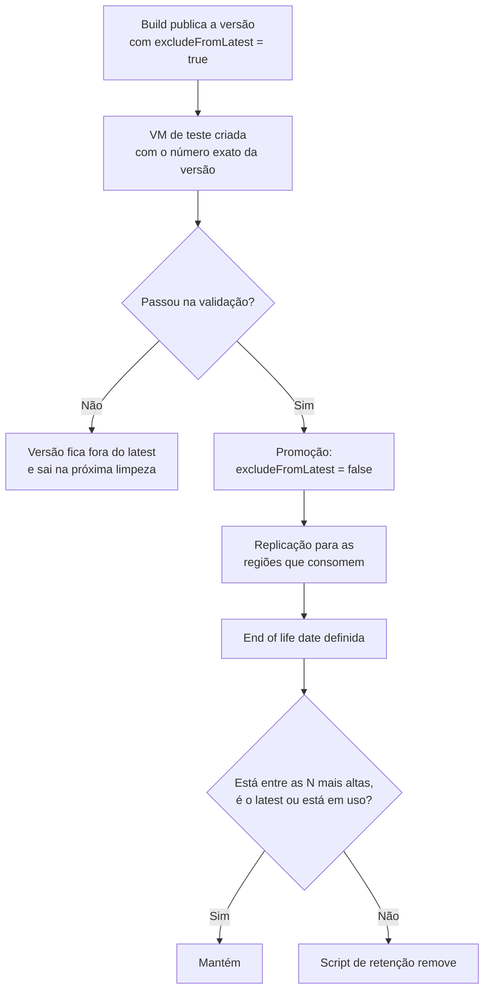

Fala pessoALL! Como estão as coisas por aí?

Nos dois últimos artigos dessa série nós montamos a fábrica de imagens. Primeiro com o [Azure Image Builder publicando Windows e Linux na galeria](https://blog.ruizsolutions.online/posts/azure-image-builder-windows-linux/), depois com o [pipeline no GitHub Actions gerando versão nova sem ninguém abrir o portal](https://blog.ruizsolutions.online/posts/azure-image-builder-github-actions-oidc/).

Só que fábrica funcionando traz um problema que quase ninguém planeja: o estoque.

Cada build deixa uma versão nova na **Azure Compute Gallery**. Com agenda mensal e quatro imagens, em um ano são 48 versões. Se cada uma estiver replicada em duas regiões, são 96 cópias guardadas e cobradas, e a maioria nunca mais vai ser usada para criar uma VM.

E tem o outro lado da moeda. No primeiro dia em que alguém decide "fazer uma faxina" na galeria pelo portal, a chance de apagar justamente a versão que um scale set usa para escalar é bem real.

A pergunta que fica: quem decide qual versão é a `latest`, até quando uma versão vale, em quais regiões ela precisa existir e quando ela pode ser apagada?

**Neste artigo, vamos pegar a galeria criada no laboratório do Image Builder e colocar regra nela: um esquema de numeração de versões, publicação fora do `latest` com promoção depois do teste, end of life date, replicação para uma segunda região, um script que remove versões antigas mantendo as N mais altas, e as proteções contra exclusão acidental. No final, uma passada rápida por compartilhamento via RBAC.**

> Este artigo reaproveita os recursos do laboratório do [Azure Image Builder](https://blog.ruizsolutions.online/posts/azure-image-builder-windows-linux/): o resource group `rg-aib-lab-wus2-001`, a galeria `gal_aib_lab_wus2_001` e a image definition `imgdef-debian13`. Se você já apagou tudo, precisa de pelo menos uma galeria com uma image definition e uma versão publicada para acompanhar.
{: .prompt-info }

> A escolha da `imgdef-debian13` é de propósito. Se você rodou o pipeline do artigo anterior, a `imgdef-ubuntu2404` já tem versões `1.0.x` e talvez uma `1.1.0`, e os números deste laboratório bateriam de frente com elas. A definition do Debian só tem a versão que o Image Builder gerou lá no primeiro artigo.
{: .prompt-warning }

---

## O que a galeria guarda, e o que você paga por isso

Vale relembrar a hierarquia, porque cada regra deste artigo mora em um nível diferente:

| Nível | O que é | O que dá para alterar depois de criado |
| ----- | ------- | -------------------------------------- |
| Gallery | O repositório | Descrição |
| Image definition | O "tipo" da imagem: S.O., geração, publisher, offer e SKU | vCPU e memória recomendadas, descrição, end of life date |
| Image version | O que de fato vira disco de VM | Regiões, replica count por região, exclude from latest, end of life date |

Repare na última linha. **Tudo o que interessa para governar o ciclo de vida de uma imagem é alterável na versão**, sem precisar publicar de novo. O que não dá para mudar é a origem da versão e o tipo de storage em que ela foi gravada.

O serviço da galeria em si não cobra nada. O que cobra é o armazenamento de cada réplica, tarifado como snapshot, e o tráfego de saída da primeira cópia quando você replica para outra região.

A conta é esta:

```text
custo de armazenamento = tamanho ocupado da imagem x réplicas por região x regiões x quantidade de versões
```

O detalhe que confunde é o "tamanho ocupado". A documentação dá o exemplo de um disco de S.O. de 127 GB que ocupa só 10 GB: a cobrança é sobre os 10 GB, e não sobre o tamanho do disco. Para saber o valor de verdade, o lugar é o Cost Management filtrado pelo resource group da galeria.

O ciclo de vida que vamos montar fica assim:



---

## Pré-requisitos

* Laboratório do Image Builder em pé, com pelo menos uma versão publicada em `imgdef-debian13`;
* Permissão de **Contributor** no resource group para criar, alterar e apagar versões;
* Permissão de **Owner** ou **User Access Administrator** para os passos de lock e de RBAC;
* Azure Cloud Shell em Bash. O script de limpeza usa `sort -V` e `date -d`, do GNU coreutils. No Terminal do macOS ele não roda sem ajuste;
* A VNet `vnet-aib-lab-wus2-001` com a subnet `snet-aib-test-wus2-001`, para as VMs de teste.

> A replicação para a segunda região e as VMs de teste geram custo. Nada alto, mas rode a limpeza do final do artigo no mesmo dia.
{: .prompt-warning }

---

## Mão na massa!

### Passo 1 - Levantar o que existe hoje na galeria

Antes de mexer, vamos olhar. No Cloud Shell, guarde os nomes em variáveis, porque elas aparecem em todos os comandos daqui para frente:

```bash
RG="rg-aib-lab-wus2-001"
GALLERY="gal_aib_lab_wus2_001"
IMGDEF="imgdef-debian13"

IMGDEF_ID=$(az sig image-definition show \
  --resource-group $RG \
  --gallery-name $GALLERY \
  --gallery-image-definition $IMGDEF \
  --query id \
  --output tsv)

echo $IMGDEF_ID
```

Agora a lista de versões com os campos que importam:

```bash
az sig image-version list \
  --resource-group $RG \
  --gallery-name $GALLERY \
  --gallery-image-definition $IMGDEF \
  --query "[].{Versao:name, Publicada:publishingProfile.publishedDate, ForaDoLatest:publishingProfile.excludeFromLatest, FimDeVida:publishingProfile.endOfLifeDate, Regioes:join(', ', publishingProfile.targetRegions[].name), Estado:provisioningState}" \
  --output table
```

O formato esperado da saída é este (os valores são só exemplo, os seus vão ser outros):

```text
Versao        Publicada                         ForaDoLatest    Regioes    Estado
------------  --------------------------------  --------------  ---------  ---------
0.xxxxx.xxxx  2026-06-07T00:00:00.000000+00:00  False           West US 2  Succeeded
```

<!-- PRINT 002: Cloud Shell com a saída em tabela do az sig image-version list para imgdef-debian13, mostrando a versão criada pelo Image Builder, a data de publicação, ForaDoLatest e a região -->
{: .shadow .rounded-10 }
<br>

Se o seu template do Image Builder não definiu número de versão, o nome foi gerado pelo serviço. Funciona, mas não diz nada para quem lê.

> O limite da galeria é por assinatura e por região: 100 galerias, 1.000 image definitions e 10.000 versões de imagem. Parece muito, até um pipeline sem limpeza rodar alguns anos em várias definitions.
{: .prompt-info }

---

### Passo 2 - Adotar um esquema de versão

O nome de uma versão é sempre `MajorVersion.MinorVersion.Patch`. Só entram dígitos e pontos, e cada parte precisa caber em um inteiro de 32 bits.

A regra que mais pega gente desprevenida é a do `latest`:

**O `latest` é a versão de número mais alto, e não a mais recente.**

O Azure compara primeiro o Major, depois o Minor, depois o Patch. A data de publicação não entra na conta. Se você publicar hoje uma `1.0.5` em uma definition que já tem uma `2.0.0` do ano passado, o `latest` continua sendo a `2.0.0`.

Com isso em mente, existem dois esquemas que eu vejo funcionar:

| Esquema | Exemplo | Quando faz sentido |
| ------- | ------- | ------------------ |
| Semântico | `1.0.0`, `1.0.1`, `1.1.0`, `2.0.0` | Imagem com mudanças controladas. Major para troca de S.O. ou quebra de compatibilidade, Minor para pacote ou agente novo, Patch para rebuild mensal de atualização |
| Por data | `2026.12.3` | Imagem reconstruída em agenda fixa, em que a pergunta que importa é "de quando é essa imagem?" |

Os dois são válidos para o Azure. O que não funciona é misturar. Uma `2026.12.3` na mesma definition de uma `1.4.0` vai ser o `latest` para sempre.

Sendo bem sincero, para Golden Image de servidor eu sugiro o semântico. Ele obriga quem publica a pensar se aquilo é um rebuild de rotina ou uma mudança de verdade.

Para o laboratório precisamos de algumas versões. Em vez de rodar o Image Builder várias vezes, vamos copiar a versão que já existe para números novos, já que a galeria aceita outra versão de imagem como origem.

Guarde o ID da versão atual:

```bash
SOURCE_ID=$(az sig image-version list \
  --resource-group $RG \
  --gallery-name $GALLERY \
  --gallery-image-definition $IMGDEF \
  --query "[0].id" \
  --output tsv)

echo $SOURCE_ID
```

E crie a `1.0.0` e a `1.0.1` a partir dela:

```bash
az sig image-version create \
  --resource-group $RG \
  --gallery-name $GALLERY \
  --gallery-image-definition $IMGDEF \
  --gallery-image-version 1.0.0 \
  --image-version $SOURCE_ID \
  --location westus2 \
  --target-regions westus2=1 \
  --replica-count 1
```

```bash
az sig image-version create \
  --resource-group $RG \
  --gallery-name $GALLERY \
  --gallery-image-definition $IMGDEF \
  --gallery-image-version 1.0.1 \
  --image-version $SOURCE_ID \
  --location westus2 \
  --target-regions westus2=1 \
  --replica-count 1
```

Cada comando só devolve o prompt quando a cópia termina. Com `--no-wait` o terminal fica livre e você acompanha pelo portal.

<!-- PRINT 003: Portal, gal_aib_lab_wus2_001 > imgdef-debian13 > Versions, listando a versão original do Image Builder e as novas 1.0.0 e 1.0.1 com Provisioning state Succeeded -->
{: .shadow .rounded-10 }
<br>

> A região da origem precisa estar na lista de `--target-regions`. Se você tentar criar a versão sem incluir a região onde ela nasce, o comando falha reclamando que as regiões de publicação precisam conter a localização da versão.
{: .prompt-warning }

---

### Passo 3 - Publicar fora do latest, testar e só então promover

Esse é o passo que eu considero o mais importante do artigo.

Quando uma versão nasce com `excludeFromLatest` igual a `false`, todo deployment que pede a imagem mais nova passa a receber essa versão no minuto em que a publicação termina. Sem teste e sem aprovação de ninguém.

Em ambiente real eu não oriento publicar assim. O caminho mais seguro é a versão nascer **fora do latest**, ser testada pelo número exato, e só depois ser promovida.

Vamos publicar a `1.1.0` desse jeito:

```bash
az sig image-version create \
  --resource-group $RG \
  --gallery-name $GALLERY \
  --gallery-image-definition $IMGDEF \
  --gallery-image-version 1.1.0 \
  --image-version $SOURCE_ID \
  --location westus2 \
  --target-regions westus2=1 \
  --replica-count 1 \
  --exclude-from-latest true
```

Nesse momento a `1.1.0` é a versão de número mais alto, mas o `latest` continua resolvendo para a `1.0.1`. Dá para provar isso criando uma VM que pede a mais nova. Para pedir o `latest` de uma imagem de galeria, o campo de imagem recebe o ID da **image definition**, sem número de versão:

```bash
az vm create \
  --resource-group $RG \
  --name vm-test-acg-latest-001 \
  --location westus2 \
  --image $IMGDEF_ID \
  --admin-username azureuser \
  --generate-ssh-keys \
  --vnet-name vnet-aib-lab-wus2-001 \
  --subnet snet-aib-test-wus2-001 \
  --size Standard_D2s_v5 \
  --security-type TrustedLaunch
```

Depois de criada, pergunte para a VM de qual versão ela nasceu:

```bash
az vm show \
  --resource-group $RG \
  --name vm-test-acg-latest-001 \
  --query "storageProfile.imageReference.{Imagem:id, VersaoExata:exactVersion}" \
  --output table
```

O campo `exactVersion` é somente leitura e mostra a versão que o Azure escolheu na hora da criação. O esperado aqui é `1.0.1`.

<!-- PRINT 004: Cloud Shell com a saída do az vm show da vm-test-acg-latest-001 mostrando o ID da image definition e VersaoExata 1.0.1, mesmo com a 1.1.0 já publicada -->
{: .shadow .rounded-10 }
<br>

Agora o teste da versão nova. A VM de validação aponta para o número exato:

```bash
az vm create \
  --resource-group $RG \
  --name vm-test-acg-110-001 \
  --location westus2 \
  --image "$IMGDEF_ID/versions/1.1.0" \
  --admin-username azureuser \
  --generate-ssh-keys \
  --vnet-name vnet-aib-lab-wus2-001 \
  --subnet snet-aib-test-wus2-001 \
  --size Standard_D2s_v5 \
  --security-type TrustedLaunch
```

> Assim como no laboratório do Image Builder, o `az vm create` cria um IP público e abre a porta de SSH. Para laboratório resolve, para ambiente real não.
{: .prompt-warning }

Valide o que for crítico para a sua imagem: boot, login, agentes, pacotes. Aprovou? Promova:

```bash
az sig image-version update \
  --resource-group $RG \
  --gallery-name $GALLERY \
  --gallery-image-definition $IMGDEF \
  --gallery-image-version 1.1.0 \
  --set publishingProfile.excludeFromLatest=false
```

<!-- PRINT 005: Portal, página da versão 1.1.0 em imgdef-debian13 mostrando o campo Exclude from latest como No depois da promoção -->
{: .shadow .rounded-10 }
<br>

O mesmo comando, com `true`, é o seu **rollback**. Se a `1.1.0` der problema em produção, você tira ela do `latest` e o próximo deployment volta a receber a `1.0.1`. Sem apagar nada e sem republicar.

Promover uma versão não mexe em VM que já existe. O `latest` só vale para o que for criado depois.

Existe também a exclusão do `latest` por região, dentro de cada item de `targetRegions`. Quando a global e a regional estão definidas, vale a regional. Serve para liberar uma versão primeiro em uma região e segurar nas outras.

<!-- LUIZ: você já viu uma versão nova virar latest sem teste e causar problema em deployment? Se sim, conte em duas ou três linhas o que aconteceu, sem identificar o ambiente. -->

---

### Passo 4 - Definir a end of life date

A **end of life date** é a data a partir da qual aquela versão não deveria mais ser usada.

E aqui vai a parte que a maioria entende errado: **ela é informativa**. Passou da data, a versão continua criando VM normalmente. O Azure não bloqueia nada.

Então para que serve? Para três coisas:

* Deixar registrado na própria versão até quando ela é suportada, em vez de isso morar em planilha;
* Servir de critério para automação, como o script do Passo 6;
* Ativar a proteção contra exclusão que veremos no Passo 7.

Vamos marcar a `1.0.0` com uma data já próxima e a `1.1.0` com uma data mais distante:

```bash
az sig image-version update \
  --resource-group $RG \
  --gallery-name $GALLERY \
  --gallery-image-definition $IMGDEF \
  --gallery-image-version 1.0.0 \
  --set publishingProfile.endOfLifeDate=2027-01-31T00:00:00+00:00
```

```bash
az sig image-version update \
  --resource-group $RG \
  --gallery-name $GALLERY \
  --gallery-image-definition $IMGDEF \
  --gallery-image-version 1.1.0 \
  --set publishingProfile.endOfLifeDate=2027-06-30T00:00:00+00:00
```

Ajuste as datas para o dia em que você estiver executando e use sempre uma data no futuro. Na image definition, data no passado é recusada com o erro `EndOfLifeDate must be set to a future date`.

<!-- PRINT 006: Portal, lista Versions de imgdef-debian13 com a coluna End of life date preenchida para a 1.0.0 e a 1.1.0 -->
{: .shadow .rounded-10 }
<br>

> A image definition também tem uma end of life date própria, que vale como referência para todas as versões dela. Eu prefiro controlar na versão, porque é lá que a decisão acontece.
{: .prompt-tip }

---

### Passo 5 - Replicar para outra região e ajustar as réplicas

Uma versão só cria VM nas regiões em que ela tem réplica. Se o seu time cria VM em `Brazil South` e a imagem só existe em `West US 2`, o deployment falha dizendo que a imagem não está disponível naquela região.

São dois números diferentes e é comum confundir. As **target regions** dizem em quais regiões a versão existe. O **replica count** diz quantas cópias existem dentro de cada região.

O replica count não é redundância de dados, é capacidade de criação em paralelo. A recomendação da Microsoft é uma réplica para cada 20 VMs criadas ao mesmo tempo, e no mínimo três para imagem de produção.

Para laboratório, uma réplica por região resolve. Vamos levar a `1.1.0` para `Brazil South`:

```bash
az sig image-version update \
  --resource-group $RG \
  --gallery-name $GALLERY \
  --gallery-image-definition $IMGDEF \
  --gallery-image-version 1.1.0 \
  --target-regions westus2=1 brazilsouth=1
```

O `--target-regions` substitui a lista inteira. Por isso a `westus2` aparece de novo: se você passar só a região nova, está pedindo para remover a de origem.

A replicação demora. O tempo depende do tamanho da imagem e da quantidade de regiões, e a documentação fala em algumas horas nos piores casos. Para acompanhar por região:

```bash
az sig image-version show \
  --resource-group $RG \
  --gallery-name $GALLERY \
  --gallery-image-definition $IMGDEF \
  --gallery-image-version 1.1.0 \
  --expand ReplicationStatus \
  --query "replicationStatus.summary[].{Regiao:region, Estado:state, Progresso:progress}" \
  --output table
```

O estado de cada região passa por `Replicating` e termina em `Completed`. Só depois disso dá para criar VM por lá.

<!-- PRINT 007: Cloud Shell com a saída do az sig image-version show --expand ReplicationStatus da versão 1.1.0, com West US 2 em Completed e Brazil South em Replicating com o percentual de progresso -->
{: .shadow .rounded-10 }
<br>

Pelo portal o caminho é: galeria, image definition, a versão, e **Update replication** no topo da página.

<!-- PRINT 008: Portal, tela Update replication da versão 1.1.0 com as duas regiões listadas, replica count 1 em cada e o tipo de storage -->
{: .shadow .rounded-10 }
<br>

Repare que replicamos **só a `1.1.0`**. A `1.0.0` e a `1.0.1` continuam apenas em `West US 2`.

Essa é a economia mais fácil de fazer em uma galeria: a versão corrente fica em todas as regiões que consomem, e as antigas ficam só na região de origem, como recurso de rollback. A própria documentação cita esse desenho para reduzir custo de armazenamento.

Quando uma versão deixar de ser a corrente, o mesmo comando com a lista menor recolhe as réplicas. Não execute agora: vamos fazer isso na limpeza, no final do artigo.

> O tipo de storage da versão (`Standard_LRS`, `Standard_ZRS` ou `Premium_LRS`) é definido na criação e não pode ser alterado depois. A Microsoft recomenda ZRS onde a região tem zonas de disponibilidade. Se a versão nasceu em LRS e você quer ZRS, é versão nova.
{: .prompt-info }

---

### Passo 6 - Remover versões antigas mantendo as N mais altas

Chegamos na limpeza.

A galeria não tem política de retenção nativa. Não existe um campo "manter as últimas 3". Ou alguém apaga na mão, ou você automatiza.

Antes de apagar qualquer coisa, entenda o que acontece com quem usa a versão. VM que já existe não é afetada, porque o disco dela é uma cópia independente da imagem. Já o scale set que referencia a versão quebra: o scale out falha, porque ele precisa da imagem de origem para criar instância nova.

Por isso o script abaixo não usa só a posição da versão na fila. Ele mantém uma versão quando ela:

1. Está entre as N de número mais alto da image definition;
2. É a versão que o `latest` resolve hoje, mesmo que esteja fora das N;
3. É referenciada por algum scale set da assinatura atual;
4. Tem end of life date no futuro.

E ele não apaga nada sem o parâmetro `--executar`. Rodou sem ele, é simulação.

**Acesse o meu repositório e baixe o arquivo [acg-limpar-versoes.sh](https://github.com/lfrleite/Ruiz-Online/blob/main/Azure%20Compute%20Gallery/acg-limpar-versoes.sh)**

Conteúdo do arquivo:

```bash
#!/usr/bin/env bash
#
# acg-limpar-versoes.sh
# Remove versões antigas de imagem em uma Azure Compute Gallery, mantendo as N mais altas
# de cada image definition.
#
# Por padrão o script NÃO apaga nada: ele só mostra o que faria. Para apagar, use --executar.
#
# Uma versão nunca é removida quando:
#   - está entre as N versões mais altas da image definition;
#   - é a versão que o "latest" resolve hoje (a mais alta com excludeFromLatest = false);
#   - é referenciada por algum Virtual Machine Scale Set da assinatura atual;
#   - tem end of life date no futuro (a não ser que você passe --ignorar-eol).
#
# Requisitos: Azure CLI autenticado (az login) e bash com GNU sort e GNU date.
# O Azure Cloud Shell atende aos dois.
#
# Uso:
#   ./acg-limpar-versoes.sh -g <resource-group> -r <galeria> [-i <image-definition>] [-k <N>] [--ignorar-eol] [--executar]
#
# Exemplos:
#   ./acg-limpar-versoes.sh -g rg-aib-lab-wus2-001 -r gal_aib_lab_wus2_001 -k 3
#   ./acg-limpar-versoes.sh -g rg-aib-lab-wus2-001 -r gal_aib_lab_wus2_001 -i imgdef-debian13 -k 2 --executar

set -euo pipefail

RESOURCE_GROUP=""
GALLERY=""
IMAGE_DEFINITION=""
KEEP=3
EXECUTAR="false"
IGNORAR_EOL="false"

uso() {
  sed -n '2,23p' "$0" | sed 's/^# \{0,1\}//'
}

erro() {
  echo "ERRO: $*" >&2
  exit 1
}

while [[ $# -gt 0 ]]; do
  case "$1" in
    -g|--resource-group|-r|--gallery-name|-i|--image-definition|-k|--manter)
      [[ $# -ge 2 ]] || { uso; erro "o parâmetro $1 precisa de um valor"; }
      case "$1" in
        -g|--resource-group)   RESOURCE_GROUP="$2" ;;
        -r|--gallery-name)     GALLERY="$2" ;;
        -i|--image-definition) IMAGE_DEFINITION="$2" ;;
        -k|--manter)           KEEP="$2" ;;
      esac
      shift 2
      ;;
    --ignorar-eol)         IGNORAR_EOL="true"; shift ;;
    --executar)            EXECUTAR="true"; shift ;;
    -h|--help)             uso; exit 0 ;;
    *)                     uso; erro "parâmetro desconhecido: $1" ;;
  esac
done

[[ -n "$RESOURCE_GROUP" ]] || { uso; erro "informe o resource group com -g"; }
[[ -n "$GALLERY" ]]        || { uso; erro "informe a galeria com -r"; }
[[ "$KEEP" =~ ^[0-9]+$ ]]  || erro "o valor de -k precisa ser um número inteiro"
[[ "$KEEP" -ge 1 ]]        || erro "o valor de -k precisa ser 1 ou maior"

command -v az >/dev/null 2>&1 || erro "Azure CLI não encontrado"
az account show --output none 2>/dev/null || erro "sem sessão no Azure. Rode az login antes"

SUBSCRIPTION_NAME=$(az account show --query name --output tsv)
AGORA=$(date -u +%s)

echo "Assinatura : $SUBSCRIPTION_NAME"
echo "Galeria    : $GALLERY ($RESOURCE_GROUP)"
echo "Manter     : $KEEP versões mais altas por image definition"
if [[ "$EXECUTAR" == "true" ]]; then
  echo "Modo       : EXECUÇÃO (as versões candidatas serão apagadas)"
else
  echo "Modo       : simulação (nada será apagado, use --executar para apagar)"
fi
echo

# Image definitions a tratar
if [[ -n "$IMAGE_DEFINITION" ]]; then
  az sig image-definition show \
    --resource-group "$RESOURCE_GROUP" \
    --gallery-name "$GALLERY" \
    --gallery-image-definition "$IMAGE_DEFINITION" \
    --output none || erro "image definition $IMAGE_DEFINITION não encontrada"
  DEFINICOES="$IMAGE_DEFINITION"
else
  DEFINICOES=$(az sig image-definition list \
    --resource-group "$RESOURCE_GROUP" \
    --gallery-name "$GALLERY" \
    --query "[].name" \
    --output tsv)
fi

[[ -n "$DEFINICOES" ]] || { echo "Nenhuma image definition encontrada. Nada a fazer."; exit 0; }

# IDs de imagem referenciados por scale sets da assinatura atual (em minúsculas).
# Apagar uma versão usada por scale set quebra o scale out e o reimage dele.
# Se a consulta falhar (falta de permissão de leitura em scale sets, por exemplo), o script
# para aqui. Seguir em frente seria apagar versão sem saber se algum scale set depende dela.
if ! VMSS_BRUTO=$(az vmss list \
  --query "[].virtualMachineProfile.storageProfile.imageReference.id" \
  --output tsv); then
  erro "não consegui listar os scale sets da assinatura. Sem essa lista o script não apaga nada"
fi
VMSS_REFS=$(echo "$VMSS_BRUTO" | tr '[:upper:]' '[:lower:]')

TOTAL_CANDIDATAS=0
TOTAL_APAGADAS=0
TOTAL_FALHAS=0

for DEF in $DEFINICOES; do
  echo "== $DEF"

  # Uma linha por versão: nome, excludeFromLatest, endOfLifeDate, id
  LINHAS=$(az sig image-version list \
    --resource-group "$RESOURCE_GROUP" \
    --gallery-name "$GALLERY" \
    --gallery-image-definition "$DEF" \
    --query "[].[name, to_string(publishingProfile.excludeFromLatest || \`false\`), publishingProfile.endOfLifeDate || 'none', id]" \
    --output tsv)

  if [[ -z "$LINHAS" ]]; then
    echo "   sem versões"
    echo
    continue
  fi

  # Ordena da versão mais alta para a mais baixa (Major, depois Minor, depois Patch)
  ORDENADAS=$(echo "$LINHAS" | sort -t $'\t' -k1,1 -V -r)

  # Versão que o latest resolve hoje: a mais alta que não está excluída
  LATEST=$(echo "$ORDENADAS" | awk -F '\t' 'tolower($2) != "true" { print $1; exit }')

  POSICAO=0
  while IFS=$'\t' read -r NOME EXCLUIDA EOL ID; do
    POSICAO=$((POSICAO + 1))
    MOTIVO=""

    if [[ "$POSICAO" -le "$KEEP" ]]; then
      MOTIVO="entre as $KEEP mais altas"
    elif [[ "$NOME" == "$LATEST" ]]; then
      MOTIVO="é o latest atual"
    elif [[ -n "$VMSS_REFS" ]] && echo "$VMSS_REFS" | grep -qxF "$(echo "$ID" | tr '[:upper:]' '[:lower:]')"; then
      MOTIVO="referenciada por scale set"
    elif [[ "$IGNORAR_EOL" != "true" && "$EOL" != "none" ]]; then
      # Data que o date não entende vira motivo para manter, nunca para apagar.
      if ! EOL_EPOCH=$(date -u -d "$EOL" +%s 2>/dev/null); then
        MOTIVO="end of life com data ilegível: $EOL"
      elif [[ "$EOL_EPOCH" -gt "$AGORA" ]]; then
        MOTIVO="end of life em ${EOL%%T*}"
      fi
    fi

    if [[ -n "$MOTIVO" ]]; then
      printf '   manter   %-14s %s\n' "$NOME" "($MOTIVO)"
      continue
    fi

    TOTAL_CANDIDATAS=$((TOTAL_CANDIDATAS + 1))

    if [[ "$EXECUTAR" != "true" ]]; then
      printf '   apagaria %-14s\n' "$NOME"
      continue
    fi

    printf '   apagando %-14s ' "$NOME"
    if SAIDA=$(az sig image-version delete \
        --resource-group "$RESOURCE_GROUP" \
        --gallery-name "$GALLERY" \
        --gallery-image-definition "$DEF" \
        --gallery-image-version "$NOME" < /dev/null 2>&1); then
      echo "ok"
      TOTAL_APAGADAS=$((TOTAL_APAGADAS + 1))
    else
      echo "FALHOU"
      echo "$SAIDA" | sed 's/^/      /' >&2
      TOTAL_FALHAS=$((TOTAL_FALHAS + 1))
    fi
  done <<< "$ORDENADAS"

  echo
done

echo "Resumo: $TOTAL_CANDIDATAS candidata(s), $TOTAL_APAGADAS apagada(s), $TOTAL_FALHAS falha(s)."

if [[ "$TOTAL_FALHAS" -gt 0 ]]; then
  exit 1
fi
```

Envie o arquivo para o Cloud Shell, dê permissão de execução e rode primeiro em simulação, mantendo as 2 versões mais altas:

```bash
chmod +x acg-limpar-versoes.sh

./acg-limpar-versoes.sh -g $RG -r $GALLERY -i $IMGDEF -k 2
```

O formato esperado da saída é este. Os números de versão dependem do que existe na sua galeria:

```text
Assinatura : <nome da sua assinatura>
Galeria    : gal_aib_lab_wus2_001 (rg-aib-lab-wus2-001)
Manter     : 2 versões mais altas por image definition
Modo       : simulação (nada será apagado, use --executar para apagar)

== imgdef-debian13
   manter   1.1.0          (entre as 2 mais altas)
   manter   1.0.1          (entre as 2 mais altas)
   manter   1.0.0          (end of life em 2027-01-31)
   apagaria 0.xxxxx.xxxx

Resumo: 1 candidata(s), 0 apagada(s), 0 falha(s).
```

<!-- PRINT 009: Cloud Shell com a execução do acg-limpar-versoes.sh em modo simulação, mostrando as linhas manter com o motivo entre parênteses e a linha apagaria -->
{: .shadow .rounded-10 }
<br>

A `1.0.0` ficou porque demos a ela uma end of life date no futuro. Conferiu que as candidatas são mesmo descartáveis? Agora sim, com `--executar`:

```bash
./acg-limpar-versoes.sh -g $RG -r $GALLERY -i $IMGDEF -k 2 --executar
```

<!-- PRINT 010: Cloud Shell com a execução do acg-limpar-versoes.sh com --executar, mostrando a linha apagando seguida de ok e o resumo final -->
{: .shadow .rounded-10 }
<br>

Sem o `-i`, o script percorre todas as image definitions da galeria.

O script tem limites, e é melhor conhecer antes de confiar:

* Ele só enxerga scale sets da **assinatura em que você está logado**. Se a galeria é consumida por outras assinaturas, use a end of life date como trava;
* Ele não sabe de template, pipeline ou runbook com número de versão fixo no código. Isso precisa ser tratado com o dono do código antes;
* A ordenação é pelo número da versão, igual à regra do `latest`. Se a sua galeria mistura esquemas de numeração, arrume isso primeiro.

Para virar rotina, dá para colocar o script como último job do pipeline do [artigo anterior](https://blog.ruizsolutions.online/posts/azure-image-builder-github-actions-oidc/). A `role-aib-lab-pipeline` criada lá não dá conta sozinha, e isso é intencional: ela não tem ação de exclusão. Para o script rodar no pipeline, a identidade `id-aib-gha-lab-wus2-001` precisa de mais duas ações. A `Microsoft.Compute/galleries/images/versions/delete`, para apagar as versões, e a `Microsoft.Compute/virtualMachineScaleSets/read` no escopo da assinatura, para o script conseguir listar os scale sets. Sem a segunda, o script para logo no começo com erro, em vez de apagar versão sem saber se algum scale set depende dela.

Eu só faria isso depois de algumas rodadas manuais em simulação.

A mesma lógica de retenção, aplicada a snapshots, está no artigo [Removendo snapshots de forma automatizada](https://blog.ruizsolutions.online/posts/removendo-snapshots-de-forma-automatizada/).

<!-- LUIZ: quantas versões por imagem você costuma manter e qual o critério (número fixo, tempo, último trimestre)? Uma frase com a sua regra pessoal dá mais peso a esse passo. -->

---

### Passo 7 - Proteger a galeria contra exclusão acidental

Automatizamos a exclusão. Agora o contrário: impedir que algo seja apagado quando não deveria. São três camadas, e cada uma protege de uma coisa diferente.

#### Lock na galeria

O lock **CanNotDelete** na galeria é herdado por tudo o que está dentro dela, image definitions e versões incluídas. É a recomendação da própria Microsoft para evitar exclusão acidental de imagem.

```bash
az lock create \
  --name lock-gal-aib-nao-apagar \
  --lock-type CanNotDelete \
  --resource-group $RG \
  --resource-name $GALLERY \
  --resource-type Microsoft.Compute/galleries \
  --notes "Galeria de Golden Images. Remover o lock apenas para limpeza planejada de versoes."
```

Pelo portal o caminho é a galeria, **Locks**, **Add**, com o tipo **Delete**. No portal o lock se chama Delete, na linha de comando se chama CanNotDelete. É o mesmo lock.

<!-- PRINT 011: Portal, galeria gal_aib_lab_wus2_001 > Locks, com o lock lock-gal-aib-nao-apagar do tipo Delete criado e a nota visível -->
{: .shadow .rounded-10 }
<br>

Para ver o lock trabalhando, tente apagar uma versão:

```bash
az sig image-version delete \
  --resource-group $RG \
  --gallery-name $GALLERY \
  --gallery-image-definition $IMGDEF \
  --gallery-image-version 1.0.0
```

O comando é recusado e a mensagem de erro cita o lock.

<!-- PRINT 012: Cloud Shell com o erro retornado pelo az sig image-version delete na versão 1.0.0, citando o lock lock-gal-aib-nao-apagar -->
{: .shadow .rounded-10 }
<br>

O lock tem efeitos colaterais que você precisa conhecer antes de aplicar.

O primeiro: ele bloqueia o script de limpeza também. Lock vale para todo mundo, inclusive para a automação e para o Owner. A limpeza vira um procedimento de remover o lock, rodar o script e recriar o lock.

O segundo é menos óbvio. Com o lock ativo não dá para remover atribuição de RBAC feita na galeria. Se você deu Reader para um grupo nesse escopo, não consegue tirar enquanto o lock existir.

E o terceiro aparece na hora de desmontar o laboratório: um `az group delete` em um resource group com um recurso bloqueado falha por completo, sem exclusão parcial.

Para remover o lock:

```bash
LOCK_ID=$(az lock show \
  --name lock-gal-aib-nao-apagar \
  --resource-group $RG \
  --resource-type Microsoft.Compute/galleries \
  --resource-name $GALLERY \
  --query id \
  --output tsv)

az lock delete --ids $LOCK_ID
```

#### Bloqueio de exclusão antes do end of life

Essa é a proteção que eu acho mais elegante, porque ela é por versão e convive com a automação.

Com `blockDeletionBeforeEndOfLife` ligado, a versão não pode ser apagada enquanto a end of life date dela não chegar. Aplique na `1.1.0`, que já tem data definida. O lock CanNotDelete não impede alteração, então não precisa remover ele para esse comando:

```bash
az sig image-version update \
  --resource-group $RG \
  --gallery-name $GALLERY \
  --gallery-image-definition $IMGDEF \
  --gallery-image-version 1.1.0 \
  --block-deletion-before-end-of-life true
```

Quem tentar apagar a `1.1.0` antes de 30/06/2027 recebe o erro `DeleteGalleryImageVersionBlockedBeforeEndOfLife`. Para apagar antes da hora, é preciso desligar a propriedade de forma explícita ou antecipar a data. Ou seja, vira uma decisão consciente, e não um clique errado.

É aqui que a end of life date deixa de ser só informativa.

> Na referência do Azure CLI, os parâmetros `--end-of-life-date` e `--block-deletion-before-end-of-life` aparecem marcados com aviso de breaking change. Antes de colocar esses comandos em pipeline, confira a página do comando na versão do CLI que você usa.
{: .prompt-warning }

#### Remoção de regiões replicadas

A terceira camada é o `safetyProfile.allowDeletionOfReplicatedLocations`. Com o valor `false`, ninguém remove uma região da lista de réplicas daquela versão. Protege contra o erro do Passo 5, o de passar a lista de `--target-regions` incompleta:

```bash
az sig image-version update \
  --resource-group $RG \
  --gallery-name $GALLERY \
  --gallery-image-definition $IMGDEF \
  --gallery-image-version 1.1.0 \
  --set safetyProfile.allowDeletionOfReplicatedLocations=false
```

Se mais adiante o comando para recolher réplicas for recusado, é essa propriedade. Volte ela para `true`, ajuste as regiões e proteja de novo.

> A galeria também tem **soft delete**, que guarda a versão apagada por 7 dias para recuperação. Na data deste artigo o recurso está em preview, a documentação só cobre portal e REST, exige registro da feature e o prazo de 7 dias não pode ser alterado. Vale acompanhar, mas eu não desenharia a proteção de produção em cima de preview.
{: .prompt-info }

---

### Passo 8 - Compartilhar a galeria por RBAC

A galeria, a image definition e a versão são recursos do Azure. Compartilhar é dar permissão de leitura, e a recomendação é atribuir no nível da **galeria**, não em versão individual.

Para dar acesso a um grupo do Microsoft Entra ID:

```bash
GALLERY_ID=$(az sig show \
  --resource-group $RG \
  --gallery-name $GALLERY \
  --query id \
  --output tsv)

az role assignment create \
  --assignee-object-id <OBJECT_ID_DO_GRUPO> \
  --assignee-principal-type Group \
  --role "Reader" \
  --scope $GALLERY_ID
```

Um detalhe que gera chamado: quem recebe acesso por RBAC **não consegue listar** as imagens compartilhadas com ele. Você precisa entregar o ID da imagem. O jeito mais limpo é passar o ID da image definition (o `$IMGDEF_ID` do Passo 1), que sempre entrega o `latest`.

Se outras equipes consomem o `latest` da sua galeria, a promoção do Passo 3 é a sua mudança em produção.

Existem mais dois modelos. O **direct shared gallery** compartilha a galeria com todos os usuários de uma assinatura ou de um tenant, mas continua em preview, exige registro, precisa de uma galeria nova criada já com essa opção e tem limite de 30 assinaturas e 5 tenants. O **community gallery** publica as imagens para qualquer pessoa com assinatura do Azure. Para compartilhar entre assinaturas do mesmo tenant, RBAC resolve e é o que eu recomendo.

---

## Erros comuns

### There is no latest image version exists

Aparece ao criar uma VM pelo ID da image definition quando **todas** as versões estão com exclude from latest ligado. É comum logo depois de adotar a publicação fora do `latest`, quando ninguém promoveu a primeira versão.

```bash
az sig image-version list \
  --resource-group $RG \
  --gallery-name $GALLERY \
  --gallery-image-definition $IMGDEF \
  --query "[].{Versao:name, ForaDoLatest:publishingProfile.excludeFromLatest}" \
  --output table
```

Pelo menos uma versão precisa estar com `False`.

---

### The gallery image is not available in region

A versão não tem réplica na região onde a VM está sendo criada. Quando o erro cita a image definition, sem número de versão, nenhuma versão incluída no `latest` existe naquela região.

```bash
az sig image-version list \
  --resource-group $RG \
  --gallery-name $GALLERY \
  --gallery-image-definition $IMGDEF \
  --query "[].{Versao:name, ForaDoLatest:publishingProfile.excludeFromLatest, Regioes:join(', ', publishingProfile.targetRegions[].name)}" \
  --output table
```

Ou replique a versão para a região, ou crie a VM em uma região onde ela existe.

---

### DeleteGalleryImageVersionBlockedBeforeEndOfLife

A versão está com `blockDeletionBeforeEndOfLife` ligado e a data ainda não chegou. Confira:

```bash
az sig image-version show \
  --resource-group $RG \
  --gallery-name $GALLERY \
  --gallery-image-definition $IMGDEF \
  --gallery-image-version 1.1.0 \
  --query "{FimDeVida:publishingProfile.endOfLifeDate, Protecao:safetyProfile}"
```

Se for mesmo para apagar, desligue a proteção:

```bash
az sig image-version update \
  --resource-group $RG \
  --gallery-name $GALLERY \
  --gallery-image-definition $IMGDEF \
  --gallery-image-version 1.1.0 \
  --block-deletion-before-end-of-life false
```

---

### Exclusão recusada por lock

A versão não apaga, o script de limpeza termina com falha, ou o `az group delete` não remove o resource group. Liste os locks do resource group:

```bash
az lock list \
  --resource-group $RG \
  --query "[].{Nome:name, Tipo:level, Recurso:id}" \
  --output table
```

---

### Replicação que não termina

Replicação de imagem grande para várias regiões é demorada. A orientação da documentação é acompanhar com `--expand ReplicationStatus`, como fizemos no Passo 5, e esperar até seis horas antes de tratar como falha. Se falhar, execute o comando de novo. Com muitas regiões, replique em etapas.

---

## Checklist

- [x] Passo 1 - Levantar as versões existentes, com data, regiões e exclude from latest;
- [x] Passo 2 - Adotar um esquema de numeração e criar as versões `1.0.0` e `1.0.1`;
- [x] Passo 3 - Publicar a `1.1.0` fora do `latest`, testar pelo número exato e promover;
- [x] Passo 4 - Definir a end of life date das versões;
- [x] Passo 5 - Replicar a versão corrente para a segunda região e acompanhar o status;
- [x] Passo 6 - Rodar o script de retenção em simulação e depois com `--executar`;
- [x] Passo 7 - Aplicar lock na galeria e bloqueio de exclusão antes do end of life;
- [x] Passo 8 - Compartilhar a galeria por RBAC no nível da galeria.

---

## Limpeza do ambiente

Comece pelas VMs de teste:

```bash
az vm delete --resource-group $RG --name vm-test-acg-latest-001 --yes
az vm delete --resource-group $RG --name vm-test-acg-110-001 --yes
```

NIC, IP público, NSG e disco podem ficar para trás. Confira o resource group depois.

Recolha a réplica da segunda região, se ainda não fez:

```bash
az sig image-version update \
  --resource-group $RG \
  --gallery-name $GALLERY \
  --gallery-image-definition $IMGDEF \
  --gallery-image-version 1.1.0 \
  --set safetyProfile.allowDeletionOfReplicatedLocations=true

az sig image-version update \
  --resource-group $RG \
  --gallery-name $GALLERY \
  --gallery-image-definition $IMGDEF \
  --gallery-image-version 1.1.0 \
  --target-regions westus2=1
```

Se for desmontar o laboratório inteiro, remova antes o lock da galeria (comando no Passo 7) e desligue o `blockDeletionBeforeEndOfLife` da `1.1.0` (comando na seção de erros). Com o lock ativo a exclusão do resource group falha por inteiro. A proteção da `1.1.0` eu desligo junto para a exclusão não esbarrar nela no meio do caminho. Depois siga a limpeza do [artigo do Image Builder](https://blog.ruizsolutions.online/posts/azure-image-builder-windows-linux/#limpeza-do-ambiente), que apaga os image templates e o resource group.

> Se a atribuição de Reader do Passo 8 foi feita só para teste, remova também. Lembre que com o lock ativo essa remoção é recusada.
{: .prompt-tip }

---

## Artigos

| Nome | Link |
| :---: | :---: |
| Arquivos deste laboratório | <https://github.com/lfrleite/Ruiz-Online/tree/main/Azure%20Compute%20Gallery> |
| Azure Image Builder na prática | <https://blog.ruizsolutions.online/posts/azure-image-builder-windows-linux/> |
| Image Builder com GitHub Actions e OIDC | <https://blog.ruizsolutions.online/posts/azure-image-builder-github-actions-oidc/> |
| Store and share resources in Azure Compute Gallery | <https://learn.microsoft.com/en-us/azure/virtual-machines/azure-compute-gallery> |
| Store and share images in an Azure Compute Gallery | <https://learn.microsoft.com/en-us/azure/virtual-machines/shared-image-galleries> |
| Create an image definition and an image version | <https://learn.microsoft.com/en-us/azure/virtual-machines/image-version> |
| List, update, and delete gallery resources | <https://learn.microsoft.com/en-us/azure/virtual-machines/update-image-resources> |
| az sig image-version | <https://learn.microsoft.com/en-us/cli/azure/sig/image-version> |
| Gallery Image Versions - Create Or Update (REST) | <https://learn.microsoft.com/en-us/rest/api/compute/gallery-image-versions/create-or-update> |
| Troubleshoot images in an Azure Compute Gallery | <https://learn.microsoft.com/en-us/azure/virtual-machines/troubleshooting-shared-images> |
| Soft Delete in Azure Compute Gallery (Preview) | <https://learn.microsoft.com/en-us/azure/virtual-machines/soft-delete-gallery> |
| Lock your Azure resources to protect your infrastructure | <https://learn.microsoft.com/en-us/azure/azure-resource-manager/management/lock-resources> |
| Share gallery resources by using RBAC | <https://learn.microsoft.com/en-us/azure/virtual-machines/share-gallery> |
| Share a gallery with all users in a subscription or tenant (preview) | <https://learn.microsoft.com/en-us/azure/virtual-machines/share-gallery-direct> |

---

## The End!

Fechamos a parte de imagens que começou lá no Image Builder.

Galeria sem regra vira dois problemas ao mesmo tempo: conta crescendo com versão que ninguém usa, e risco de alguém apagar a versão errada na hora de arrumar.

Se eu tivesse que escolher uma única coisa deste artigo para aplicar amanhã, seria a publicação fora do `latest`. Ela custa um parâmetro e transforma "o build terminou" em "alguém aprovou". A limpeza economiza dinheiro, mas é essa separação que evita incidente.

A segunda seria a end of life date com o bloqueio de exclusão. Para o dia a dia eu prefiro ela ao lock na galeria, porque a proteção fica na versão que importa e a automação continua trabalhando nas outras.

E o script de retenção, por favor, rode em simulação até confiar nele. Versão de imagem apagada só volta se você tiver de onde reconstruir.

Ainda dentro do tema de compute, em um próximo artigo vamos olhar para as VMs que já existem e que ficaram para trás em segurança de boot, com o Trusted Launch.

Espero que tenham curtido. Deixem nos comentários do meu LinkedIn como vocês controlam as versões de imagem hoje, e se alguém já passou pelo susto de um `latest` trocado sem aviso.

Obrigado por me acompanharem até aqui! Nos vemos na próxima!
