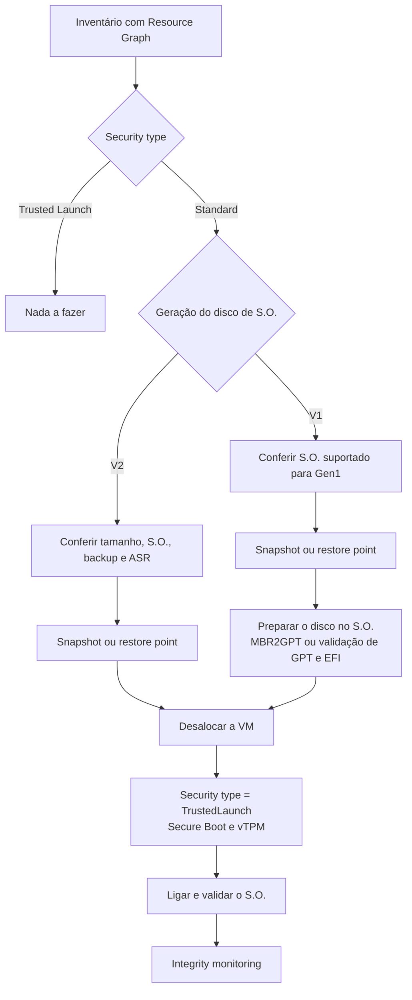

Fala pessoALL! Prontos pra mais um?

Hoje o assunto é segurança de VM, daquele tipo que fica quieto no canto até aparecer em uma recomendação do Advisor ou do Defender for Cloud: **Trusted Launch**.

Toda VM Gen2 que você cria hoje pelo portal, pelo CLI ou pelo PowerShell já nasce com Trusted Launch. Secure Boot ligado, vTPM ligado, e pouca gente repara. O problema está no que foi criado antes disso virar padrão, ou no que nasceu de template antigo sem o bloco `securityProfile`. Essas VMs continuam com o **Security type** em **Standard**, e ninguém vai mudar isso por você.

E aí vem a dúvida natural: preciso recriar a VM?

Não precisa. Para VM Gen2 é a troca de uma propriedade com a máquina desalocada. Para VM Gen1 também existe caminho, com preparo dentro do S.O. e sem volta para Gen1 depois.

O que me incomoda nesse tema é ele ser tratado como "é só marcar a caixinha". A troca em si é um comando. O que estraga a janela é o que está em volta: backup em policy Standard, VM criada a partir de imagem da galeria que o portal se recusa a converter, módulo de kernel sem assinatura no Linux, tamanho de VM que não aceita o recurso.

**Neste artigo, vamos levantar com Resource Graph quais VMs ainda estão em Standard, conferir pré-requisitos e limitações, converter duas VMs Gen2 (uma pelo portal e outra por script), preparar e converter uma VM Gen1, fazer o rollback e ver o que muda em backup e em imagens. Com snapshot antes, como sempre por aqui.**

> Este procedimento não serve para VM protegida por Azure Site Recovery sem antes desligar a replicação, para tamanho de VM fora da lista de suporte, nem para Linux que depende de módulo de kernel sem assinatura e precisa de Secure Boot ligado. Se a sua VM cai em um desses casos, leia a parte de pré-requisitos antes de abrir a janela.
{: .prompt-warning }

---

## Mas antes, o que o Trusted Launch adiciona de fato?

Trusted Launch é um **Security type** de VM Gen2. Ele junta três coisas que podem ser ligadas de forma independente.

O **Secure Boot** fica no firmware da VM e só deixa subir bootloader, kernel e drivers de kernel assinados por um publicador confiável. É a proteção contra bootkit e rootkit, e é também o item que pode te deixar com uma VM que não liga, se o S.O. tiver componente de boot sem assinatura.

O **vTPM** é um TPM 2.0 virtual, dedicado à VM. Guarda chaves e as medições da cadeia de boot, e é o que torna possível a atestação remota.

O **Integrity monitoring** é a parte que quase todo mundo esquece. Ele instala a extensão **Guest Attestation**, que usa o vTPM para atestar o boot no Azure Attestation, com o resultado aparecendo no Microsoft Defender for Cloud. Depende de Secure Boot e vTPM ligados.

| Item | Gen2 Standard | Trusted Launch |
| --- | --- | --- |
| Boot UEFI | Sim | Sim |
| Secure Boot | Não | Opcional, recomendado |
| vTPM | Não | Ligado por padrão |
| Atestação de boot no Defender for Cloud | Não | Com a extensão Guest Attestation |
| Custo adicional | Não | Não |

Dois detalhes que só aparecem lendo o FAQ: a VM em Trusted Launch mostra cerca de 50 MB a menos de memória para o S.O., e a proteção vale para o disco de S.O., não para discos de dados.

### O que já é padrão para VM nova

Portal, Azure CLI e PowerShell criam VM Gen2 nova em Trusted Launch por padrão. Para ARM template, Bicep, Terraform e SDK, o comportamento depende da versão de API: a partir da `2025-11-01`, uma VM Gen2 sem `securityProfile` nasce em Trusted Launch quando a imagem, o disco de origem e o tamanho suportam. Em versão de API mais antiga, a ausência do `securityProfile` continua criando a VM sem Trusted Launch.

Esse padrão não mexe em VM que já existe. É daí que sai o passivo: tudo o que foi criado antes, mais o que continua saindo de template antigo.

### O fluxo que vamos seguir



---

## Pré-requisitos

* Permissão de **Contributor** na assinatura ou no Resource Group do laboratório;
* **Azure CLI 2.86.0 ou superior**. É a partir dessa versão que o CLI aceita `--security-type Standard`, que usamos para criar as VMs do laboratório fora do padrão e para o rollback;
* Cota de vCPU para três VMs `Standard_D2s_v5` em `West US 2`;
* Acesso administrativo ao S.O. das VMs, por RDP, SSH ou Azure Bastion;
* Uma janela de manutenção. A conversão exige a VM **desalocada**.

E o que a VM precisa ter para ser convertida:

* Tamanho de uma família suportada. B, D, E, F, Fx e L estão na lista. A, Dv2, Dv3 e quase toda a família M ficam fora;
* S.O. suportado: Windows Server 2016 em diante, Windows 10 e 11, Ubuntu 18.04 em diante, Debian 11 em diante e as versões de RHEL, SLES, Oracle Linux, Alma, Rocky e Azure Linux listadas na documentação;
* Azure Backup em policy **Enhanced**, se a VM tem backup;
* Azure Site Recovery desligado para a VM, se ela é replicada;
* Nenhuma dependência de Managed Image nem de hibernação em Linux, que não são suportados com Trusted Launch.

> Para Gen1 a lista de S.O. é menor: Windows Server 2016, Debian e Azure Linux ficam de fora. No caso do Windows Server 2016, o caminho documentado é subir o S.O. para 2019 ou 2022 antes, tema do artigo de [upgrade in-place do Windows Server](https://blog.ruizsolutions.online/posts/upgrade-in-place-windows-server-azure-vm/).
{: .prompt-info }

> Este laboratório gera custo enquanto as três VMs existirem, e os snapshots e restore points cobram armazenamento. Se for só estudo, rode a limpeza do final no mesmo dia.
{: .prompt-info }

---

## Mão na massa!

Os arquivos deste laboratório estão no meu repositório: [Trusted Launch](https://github.com/lfrleite/Ruiz-Online/tree/main/Trusted%20Launch).

| Recurso | Nome |
| --- | --- |
| Resource Group | `rg-tl-lab-wus2-001` |
| VM Windows Server 2022 Gen2 Standard | `vm-tlwing2-001` |
| VM Ubuntu 24.04 Gen2 Standard | `vm-tllnxg2-001` |
| VM Windows Server 2022 Gen1 | `vm-tlwing1-001` |

### Passo 1 - Criar o laboratório

Precisamos de VMs que **não** estejam em Trusted Launch, e hoje isso dá mais trabalho do que parece: se você criar uma VM Gen2 sem dizer nada, ela nasce em Trusted Launch. Por isso o script passa `--security-type Standard` nas duas VMs Gen2. A terceira usa a SKU Gen1 do Windows Server 2022.

Crie o arquivo `01-lab-trusted-launch.sh` no Cloud Shell:

```bash
#!/usr/bin/env bash
# 01-lab-trusted-launch.sh
# Cria o laboratório do artigo: uma VM Windows Gen2 Standard, uma VM Linux Gen2 Standard
# e uma VM Windows Gen1. Nenhuma delas nasce com Trusted Launch.
# Uso: ./01-lab-trusted-launch.sh

set -euo pipefail

RG="rg-tl-lab-wus2-001"
LOCATION="westus2"
SIZE="Standard_D2s_v5"
ADMIN_USER="azureuser"
CLI_MINIMO="2.86.0"

erro() { echo "ERRO: $*" >&2; exit 1; }
trap 'echo "Falha na linha $LINENO. Confira o que já foi criado em $RG antes de rodar de novo." >&2' ERR

command -v az >/dev/null || erro "Azure CLI não encontrado."
az account show >/dev/null 2>&1 || erro "Sessão não autenticada. Rode az login antes."

CLI_ATUAL=$(az version --query '"azure-cli"' -o tsv)
MENOR=$(printf '%s\n%s\n' "$CLI_MINIMO" "$CLI_ATUAL" | sort -V | head -n 1)
if [[ "$MENOR" != "$CLI_MINIMO" ]]; then
  erro "Azure CLI $CLI_ATUAL. Para criar VM Gen2 com --security-type Standard é preciso $CLI_MINIMO ou superior."
fi

read -r -s -p "Senha do administrador das VMs Windows: " ADMIN_PASSWORD
echo
if [[ ${#ADMIN_PASSWORD} -lt 12 ]]; then
  erro "Use uma senha com pelo menos 12 caracteres."
fi

echo "[1/4] Resource group $RG em $LOCATION"
az group create --name "$RG" --location "$LOCATION" -o none

echo "[2/4] VM Windows Server 2022 Gen2 com Security type Standard"
az vm create \
  --resource-group "$RG" \
  --name vm-tlwing2-001 \
  --location "$LOCATION" \
  --image MicrosoftWindowsServer:WindowsServer:2022-datacenter-g2:latest \
  --size "$SIZE" \
  --admin-username "$ADMIN_USER" \
  --admin-password "$ADMIN_PASSWORD" \
  --security-type Standard \
  -o none

echo "[3/4] VM Ubuntu 24.04 Gen2 com Security type Standard"
az vm create \
  --resource-group "$RG" \
  --name vm-tllnxg2-001 \
  --location "$LOCATION" \
  --image Canonical:ubuntu-24_04-lts:server:latest \
  --size "$SIZE" \
  --admin-username "$ADMIN_USER" \
  --generate-ssh-keys \
  --security-type Standard \
  -o none

echo "[4/4] VM Windows Server 2022 Gen1"
az vm create \
  --resource-group "$RG" \
  --name vm-tlwing1-001 \
  --location "$LOCATION" \
  --image MicrosoftWindowsServer:WindowsServer:2022-datacenter:latest \
  --size "$SIZE" \
  --admin-username "$ADMIN_USER" \
  --admin-password "$ADMIN_PASSWORD" \
  -o none

unset ADMIN_PASSWORD

echo "Geração de cada disco de S.O. criado:"
az disk list --resource-group "$RG" \
  --query "[].{Disco:name, Geracao:hyperVGeneration, SO:osType}" -o table
```

Execute:

```bash
chmod +x 01-lab-trusted-launch.sh
./01-lab-trusted-launch.sh
```

A senha é pedida no terminal e não fica gravada no arquivo. No final, o script lista a geração de cada disco de S.O.: o esperado é `V2` para os dois primeiros e `V1` para o terceiro.

<!-- PRINT 002: Cloud Shell com a execução do 01-lab-trusted-launch.sh concluída e a tabela final mostrando os três discos de S.O. com a coluna Geracao em V2, V2 e V1 -->
{: .shadow .rounded-10 }
<br>

> O `az vm create` cria um IP público para cada VM e abre a porta de RDP ou SSH. Para laboratório resolve, para ambiente real não. Ali o acesso seria por Azure Bastion, ou pelo menos com a origem restrita no NSG.
{: .prompt-warning }

Abra a `vm-tlwing2-001` no portal e olhe a aba **Properties** do **Overview**. O campo **Security type** mostra **Standard** e o **VM generation** mostra **V2**. É esse o estado que estamos caçando.

<!-- PRINT 003: Overview da vm-tlwing2-001, aba Properties, com os campos VM generation V2 e Security type Standard em destaque -->
{: .shadow .rounded-10 }
<br>

---

### Passo 2 - Descobrir quais VMs estão em Standard com Resource Graph

Abrir VM por VM não escala. Para o inventário eu uso o **Resource Graph**, que já apareceu aqui no artigo das [consultas essenciais](https://blog.ruizsolutions.online/posts/azure-resource-graph-consultas-essenciais/).

Duas propriedades resolvem a classificação. O Security type fica em `properties.securityProfile.securityType` da VM, e só interessa quando vale `TrustedLaunch` ou `ConfidentialVM`. A geração eu leio de `properties.hyperVGeneration` do **disco de S.O.**, que é um recurso próprio e está lá com a VM ligada ou desalocada. Por isso o `join` da VM com o disco.

Consulta `inventario-trusted-launch.kql`:

```kusto
Resources
| where type =~ 'microsoft.compute/virtualmachines'
| extend securityType = tostring(properties.securityProfile.securityType)
| extend secureBoot = tostring(properties.securityProfile.uefiSettings.secureBootEnabled)
| extend vTpm = tostring(properties.securityProfile.uefiSettings.vTpmEnabled)
| extend vmSize = tostring(properties.hardwareProfile.vmSize)
| extend osType = tostring(properties.storageProfile.osDisk.osType)
| extend osDiskId = tolower(tostring(properties.storageProfile.osDisk.managedDisk.id))
| join kind=leftouter (
    Resources
    | where type =~ 'microsoft.compute/disks'
    | project osDiskId = tolower(id), generation = tostring(properties.hyperVGeneration)
  ) on osDiskId
| extend situacao = case(
    securityType =~ 'TrustedLaunch', 'Trusted Launch',
    securityType =~ 'ConfidentialVM', 'Confidential VM',
    generation =~ 'V2', 'Gen2 Standard',
    generation =~ 'V1', 'Gen1',
    'Sem geracao no disco')
| project subscriptionId, resourceGroup, name, location, osType, vmSize, generation, securityType, secureBoot, vTpm, situacao
| order by situacao asc, name asc
```

1. No portal, pesquise por **Resource Graph Explorer**;
2. Confira o escopo no topo da tela, em **Scope**, para incluir as assinaturas que interessam;
3. Cole a consulta e clique em **Run query**.

<!-- PRINT 004: Resource Graph Explorer com a consulta inventario-trusted-launch.kql e o resultado listando as três VMs do laboratório, coluna situacao com Gen2 Standard, Gen2 Standard e Gen1 -->
{: .shadow .rounded-10 }
<br>

A coluna `situacao` separa o ambiente em quatro grupos: Trusted Launch, Confidential VM, **Gen2 Standard** e **Gen1**. O valor `Sem geracao no disco` aparece para VM com disco não gerenciado ou disco sem a propriedade, e pede conferência manual.

Para levar a uma reunião, a versão resumida ajuda mais. Consulta `resumo-trusted-launch.kql`:

```kusto
Resources
| where type =~ 'microsoft.compute/virtualmachines'
| extend securityType = tostring(properties.securityProfile.securityType)
| extend osDiskId = tolower(tostring(properties.storageProfile.osDisk.managedDisk.id))
| join kind=leftouter (
    Resources
    | where type =~ 'microsoft.compute/disks'
    | project osDiskId = tolower(id), generation = tostring(properties.hyperVGeneration)
  ) on osDiskId
| extend situacao = case(
    securityType =~ 'TrustedLaunch', 'Trusted Launch',
    securityType =~ 'ConfidentialVM', 'Confidential VM',
    generation =~ 'V2', 'Gen2 Standard',
    generation =~ 'V1', 'Gen1',
    'Sem geracao no disco')
| summarize total = count() by situacao
| order by total desc
```

<!-- PRINT 005: Resource Graph Explorer com a consulta resumo-trusted-launch.kql e o resultado com as linhas Gen2 Standard total 2 e Gen1 total 1 -->
{: .shadow .rounded-10 }
<br>

Pelo CLI, com a extensão `resource-graph` instalada:

```bash
az graph query -q "$(cat inventario-trusted-launch.kql)" -o table
```

> O grupo **Gen2 Standard** é o que eu atacaria primeiro: a conversão não mexe no disco e tem rollback. O grupo **Gen1** pede preparo dentro do S.O. e não volta, então eu trato como projeto separado.
{: .prompt-tip }

O Azure também aponta essas VMs: o Advisor tem uma recomendação para VM Gen2 sem Trusted Launch, e existem duas policies built-in de auditoria, `Virtual Machine should have TrustedLaunch enabled` e `Disks and OS image should support TrustedLaunch`. Para acompanhar a evolução servem bem. Para decidir a ordem de trabalho, eu prefiro a consulta.

<!-- LUIZ: em um ambiente que você já levantou, qual foi a proporção aproximada entre Gen2 Standard e Gen1? Só a ordem de grandeza, sem número real de ambiente nenhum. -->

---

### Passo 3 - Conferir os pré-requisitos da VM

Antes de parar qualquer máquina, três conferências.

Começo pelo tamanho. O `az vm list-skus` devolve as capacidades do tamanho na região. O que interessa: `HyperVGenerations` precisa incluir `V2`, e a capacidade `TrustedLaunchDisabled` não pode aparecer como `True`.

```bash
az vm list-skus \
  --resource-type virtualMachines \
  --location westus2 \
  --query "[?name=='Standard_D2s_v5'].capabilities[] | [?name=='HyperVGenerations' || name=='TrustedLaunchDisabled']" \
  -o table
```

<!-- PRINT 006: Cloud Shell com a saída do az vm list-skus para Standard_D2s_v5 mostrando a linha HyperVGenerations e nenhuma linha TrustedLaunchDisabled -->
{: .shadow .rounded-10 }
<br>

Se `TrustedLaunchDisabled` não aparece na saída de um tamanho Gen2, o tamanho suporta Trusted Launch.

Depois, backup e replicação. Se a VM tem Azure Backup, abra o Recovery Services vault, vá em **Backup Items > Azure Virtual Machine** e veja em qual policy ela está. Sendo Standard, migre para Enhanced antes. Se a VM é replicada por Site Recovery, a replicação precisa ser desligada. Os dois assuntos têm seção própria mais abaixo.

Por último, o Secure Boot no Linux. VM criada direto de imagem do Marketplace não costuma ter problema. O risco está em kernel customizado, driver de terceiro ou módulo compilado na própria máquina. A Microsoft publica a ferramenta `SBInfo`, do pacote **Linux Security Package**, para listar o que está sem assinatura:

```bash
sudo sbinfo -u -m -k -b
```

Os comandos de instalação por distribuição estão no FAQ do Trusted Launch, na tabela de artigos. As instruções para distribuições baseadas em Debian ainda citam repositórios de versões antigas do Ubuntu, então valide a instalação em uma VM de teste antes de levar para as demais.

> Se o `sbinfo` listar componente sem assinatura, são duas saídas: resolver a assinatura, ou converter com vTPM ligado e **Secure Boot desligado**. A segunda protege menos, e a atestação do Integrity monitoring falha sem Secure Boot. Ainda assim é melhor do que descobrir na volta da janela que a VM não liga.
{: .prompt-warning }

---

### Passo 4 - Snapshot antes de mexer

Quem acompanha o blog já sabe: nada de alteração em VM sem ponto de retorno. O passo a passo de snapshot por TAG está no artigo [Criando snapshot de VMs através de TAGs](https://blog.ruizsolutions.online/posts/criando-snapshot-de-vms-atraves-de-tags/). Para uma VM só, o CLI resolve:

```bash
OS_DISK_ID=$(az vm show \
  --resource-group rg-tl-lab-wus2-001 \
  --name vm-tlwing2-001 \
  --query "storageProfile.osDisk.managedDisk.id" \
  -o tsv)

az snapshot create \
  --resource-group rg-tl-lab-wus2-001 \
  --name snap-vm-tlwing2-001-pre-tl \
  --source "$OS_DISK_ID" \
  --incremental true
```

<!-- PRINT 007: Portal, lista de Snapshots do rg-tl-lab-wus2-001 mostrando o snap-vm-tlwing2-001-pre-tl criado -->
{: .shadow .rounded-10 }
<br>

A documentação do upgrade recomenda **restore point** de VM, que tem a vantagem de pegar todos os discos de uma vez. São dois comandos: a coleção, amarrada à VM, e o ponto dentro dela.

```bash
VM_ID=$(az vm show \
  --resource-group rg-tl-lab-wus2-001 \
  --name vm-tlwing2-001 \
  --query id -o tsv)

az restore-point collection create \
  --resource-group rg-tl-lab-wus2-001 \
  --collection-name rpc-vm-tlwing2-001 \
  --location westus2 \
  --source-id "$VM_ID"

az restore-point create \
  --resource-group rg-tl-lab-wus2-001 \
  --collection-name rpc-vm-tlwing2-001 \
  --name rp-pre-tl-manual
```

<!-- PRINT 008: Portal, Restore point collection rpc-vm-tlwing2-001 aberta, mostrando o restore point rp-pre-tl-manual com estado Succeeded -->
{: .shadow .rounded-10 }
<br>

> O ponto de retorno de antes do upgrade serve para **recriar** os discos e a VM no estado anterior. É esse o uso que a documentação do upgrade dá ao restore point. Para o Azure Backup ela é explícita: ponto de recuperação tirado antes da conversão restaura a VM inteira ou discos de dados, e não pode ser usado para restaurar ou substituir só o disco de S.O. Planeje a volta como recriação da VM.
{: .prompt-danger }

---

### Passo 5 - Gen2 Standard para Trusted Launch pelo portal

Vamos converter a `vm-tlwing2-001` pelo portal.

1. Abra a VM e confirme, no **Overview**, que o **VM generation** é **V2**;
2. Clique em **Stop** e aguarde o estado **Stopped (deallocated)**;
3. Ainda no **Overview**, clique no valor **Standard** do campo **Security type**. O portal abre a tela **Configuration** da VM;
4. Na seção **Security type**, abra a lista e selecione **Trusted launch**;
5. Marque **Secure Boot** e **vTPM**;
6. Clique em **Save** e aguarde a atualização terminar;
7. Volte ao **Overview**, confira o **Security type** e clique em **Start**.

<!-- PRINT 009: Overview da vm-tlwing2-001 com Status Stopped (deallocated) e o link Standard do campo Security type em destaque -->
{: .shadow .rounded-10 }
<br>

<!-- PRINT 010: Tela Configuration da vm-tlwing2-001 com Security type em Trusted launch e as caixas Secure Boot e vTPM marcadas, antes de clicar em Save -->
{: .shadow .rounded-10 }
<br>

<!-- PRINT 011: Overview da vm-tlwing2-001, aba Properties, com Security type Trusted launch e os indicadores de Secure Boot e vTPM habilitados -->
{: .shadow .rounded-10 }
<br>

Repare em um detalhe da conversão: o **vTPM** vem ligado por padrão e o **Secure Boot não**. Se você só trocar o Security type e salvar, fica com meio Trusted Launch. Marque o Secure Boot, a menos que o Passo 3 tenha mostrado motivo para não marcar.

> O portal **não** converte VM Gen2 criada a partir de imagem da Azure Compute Gallery, de Managed Image ou de disco de S.O. Para essas, o caminho é CLI, PowerShell ou ARM template. Quem montou as VMs a partir das imagens do artigo do [Azure Image Builder](https://blog.ruizsolutions.online/posts/azure-image-builder-windows-linux/) vai cair exatamente aqui.
{: .prompt-warning }

---

### Passo 6 - Gen2 Standard para Trusted Launch pelo Azure CLI

Para a `vm-tllnxg2-001` vamos usar o CLI. A conversão inteira são três comandos. Deixo aqui para você enxergar o que acontece, mas não execute ainda, porque o script logo abaixo faz o mesmo com as conferências em volta:

```bash
az vm deallocate \
  --resource-group rg-tl-lab-wus2-001 \
  --name vm-tllnxg2-001

az vm update \
  --resource-group rg-tl-lab-wus2-001 \
  --name vm-tllnxg2-001 \
  --security-type TrustedLaunch \
  --enable-secure-boot true \
  --enable-vtpm true

az vm start \
  --resource-group rg-tl-lab-wus2-001 \
  --name vm-tllnxg2-001
```

A saída do `az vm update` traz o `securityProfile` neste formato:

```json
{
  "securityProfile": {
    "securityType": "TrustedLaunch",
    "uefiSettings": {
      "secureBootEnabled": true,
      "vTpmEnabled": true
    }
  }
}
```

Para dezenas de VMs eu não rodaria isso na mão. O script abaixo confere geração e tamanho, pede confirmação, cria o restore point, converte e valida. Ele para no primeiro erro e avisa se a VM pode ter ficado desalocada.

Crie o arquivo `02-upgrade-trusted-launch.sh`:

```bash
#!/usr/bin/env bash
# 02-upgrade-trusted-launch.sh
# Converte uma VM existente para Trusted Launch: confere geração e tamanho,
# cria um restore point, desaloca, troca o Security type, liga e valida.
# Uso: ./02-upgrade-trusted-launch.sh -g <resource-group> -n <vm> [--sem-secure-boot] [--gen1-preparada] [--yes]

set -euo pipefail

RG=""
VM=""
SECURE_BOOT="true"
GEN1_PREPARADA="false"
CONFIRMADO="false"

uso() {
  echo "Uso: $0 -g <resource-group> -n <vm> [--sem-secure-boot] [--gen1-preparada] [--yes]"
}

erro() { echo "ERRO: $*" >&2; exit 1; }

while [[ $# -gt 0 ]]; do
  case "$1" in
    -g|--resource-group) RG="${2:-}"; shift 2 ;;
    -n|--name) VM="${2:-}"; shift 2 ;;
    --sem-secure-boot) SECURE_BOOT="false"; shift ;;
    --gen1-preparada) GEN1_PREPARADA="true"; shift ;;
    -y|--yes) CONFIRMADO="true"; shift ;;
    -h|--help) uso; exit 0 ;;
    *) uso; erro "Parâmetro desconhecido: $1" ;;
  esac
done

if [[ -z "$RG" || -z "$VM" ]]; then
  uso
  exit 1
fi

trap 'echo "Falha na linha $LINENO. A VM pode ter ficado desalocada: confira com az vm get-instance-view e ligue com az vm start se for o caso." >&2' ERR

command -v az >/dev/null || erro "Azure CLI não encontrado."
az account show >/dev/null 2>&1 || erro "Sessão não autenticada. Rode az login antes."

echo "[1/6] Lendo a configuração atual de $VM"
VM_ID=$(az vm show -g "$RG" -n "$VM" --query id -o tsv)
LOCATION=$(az vm show -g "$RG" -n "$VM" --query location -o tsv)
SIZE=$(az vm show -g "$RG" -n "$VM" --query hardwareProfile.vmSize -o tsv)
SEC_TYPE=$(az vm show -g "$RG" -n "$VM" --query securityProfile.securityType -o tsv)
OS_DISK_ID=$(az vm show -g "$RG" -n "$VM" --query storageProfile.osDisk.managedDisk.id -o tsv)

if [[ -z "$OS_DISK_ID" ]]; then
  erro "A VM não usa disco gerenciado no S.O. Este script não cobre esse caso."
fi

GERACAO=$(az disk show --ids "$OS_DISK_ID" --query hyperVGeneration -o tsv)
echo "      Tamanho: $SIZE | Geração do disco: ${GERACAO:-desconhecida} | Security type: ${SEC_TYPE:-Standard}"

case "$SEC_TYPE" in
  TrustedLaunch) echo "A VM já está em Trusted Launch. Nada a fazer."; exit 0 ;;
  ConfidentialVM) erro "Confidential VM não entra neste procedimento." ;;
esac

if [[ "$GERACAO" != "V2" && "$GEN1_PREPARADA" != "true" ]]; then
  erro "O disco de S.O. não está marcado como Geração 2 (valor lido: '${GERACAO:-vazio}'). Se a VM é Gen1, faça o snapshot, prepare o disco dentro do S.O. (MBR2GPT no Windows, validação de GPT e EFI no Linux) e rode de novo com --gen1-preparada."
fi

echo "[2/6] Conferindo se $SIZE aceita Geração 2 e Trusted Launch em $LOCATION"
CAPS=$(az vm list-skus --resource-type virtualMachines --location "$LOCATION" \
  --query "[?name=='$SIZE'].capabilities[] | [?name=='HyperVGenerations' || name=='TrustedLaunchDisabled'].[name, value]" -o tsv)

if [[ -z "$CAPS" ]]; then
  erro "Não encontrei o tamanho $SIZE em $LOCATION."
fi
if ! grep -q "HyperVGenerations.*V2" <<<"$CAPS"; then
  erro "O tamanho $SIZE não suporta Geração 2. Troque o tamanho antes."
fi
if grep -qi "TrustedLaunchDisabled.*true" <<<"$CAPS"; then
  erro "O tamanho $SIZE está marcado com TrustedLaunchDisabled. Troque o tamanho antes."
fi

if [[ "$CONFIRMADO" != "true" ]]; then
  echo
  echo "A VM $VM será DESALOCADA (fica indisponível) e convertida para Trusted Launch."
  if [[ "$GERACAO" != "V2" ]]; then
    echo "Ela é Gen1: depois da conversão não existe volta para Gen1."
  fi
  read -r -p "Digite o nome da VM para confirmar: " RESPOSTA
  if [[ "$RESPOSTA" != "$VM" ]]; then
    erro "Confirmação não confere. Nada foi alterado."
  fi
fi

echo "[3/6] Criando restore point da VM"
RPC="rpc-$VM"
RP="rp-pre-tl-$(date +%Y%m%d%H%M)"
az restore-point collection create -g "$RG" --collection-name "$RPC" \
  --location "$LOCATION" --source-id "$VM_ID" -o none
az restore-point create -g "$RG" --collection-name "$RPC" --name "$RP" -o none
echo "      Restore point $RP criado na coleção $RPC"

echo "[4/6] Desalocando a VM"
az vm deallocate -g "$RG" -n "$VM" -o none

echo "[5/6] Trocando o Security type para TrustedLaunch (Secure Boot: $SECURE_BOOT, vTPM: true)"
az vm update -g "$RG" -n "$VM" \
  --security-type TrustedLaunch \
  --enable-secure-boot "$SECURE_BOOT" --enable-vtpm true -o none

echo "[6/6] Ligando e validando"
az vm start -g "$RG" -n "$VM" -o none

SEC_FINAL=$(az vm show -g "$RG" -n "$VM" --query securityProfile.securityType -o tsv)
az vm show -g "$RG" -n "$VM" \
  --query "{VM:name, SecurityType:securityProfile.securityType, SecureBoot:securityProfile.uefiSettings.secureBootEnabled, vTPM:securityProfile.uefiSettings.vTpmEnabled}" -o table

if [[ "$SEC_FINAL" != "TrustedLaunch" ]]; then
  erro "O Security type ficou como '${SEC_FINAL:-Standard}'. Revise o Activity Log da VM."
fi

echo "Concluído. Agora entre na VM por RDP ou SSH e confirme que o S.O. subiu normalmente."
```

Execute apontando para a VM Linux:

```bash
chmod +x 02-upgrade-trusted-launch.sh
./02-upgrade-trusted-launch.sh -g rg-tl-lab-wus2-001 -n vm-tllnxg2-001
```

<!-- PRINT 012: Cloud Shell com a execução do 02-upgrade-trusted-launch.sh na vm-tllnxg2-001, a confirmação com o nome da VM, as seis etapas e a tabela final com SecurityType TrustedLaunch, SecureBoot True e vTPM True -->
{: .shadow .rounded-10 }
<br>

Antes de desalocar, o script pede que você digite o nome da VM. É de propósito: desalocar derruba o que estiver rodando nela. Para rodar em lote, sem a pergunta, existe o `--yes`.

O parâmetro `--sem-secure-boot` converte só com vTPM, para o caso do Linux com módulo sem assinatura. O `--gen1-preparada` libera a execução em VM Gen1, ou em VM cujo disco de S.O. não informa a geração, e só deve ser usado depois do preparo do Passo 8.

Depois do script, entre na VM por SSH e confirme que o sistema subiu e que os serviços estão de pé.

<!-- LUIZ: quanto tempo levou, no seu laboratório, entre o deallocate e a VM responder de novo? Vale colocar o número real aqui para o leitor dimensionar a janela. -->

---

### Passo 7 - Validar dentro do S.O. e ligar o Integrity monitoring

No Windows, conecte por RDP na `vm-tlwing2-001`, abra o PowerShell como administrador e rode:

```powershell
Confirm-SecureBootUEFI
Get-Tpm
```

O primeiro comando devolve `True` quando o Secure Boot está ativo. No segundo, olhe `TpmPresent` e `TpmReady`.

<!-- PRINT 013: PowerShell na vm-tlwing2-001 com Confirm-SecureBootUEFI retornando True e a saída do Get-Tpm com TpmPresent True e TpmReady True -->
{: .shadow .rounded-10 }
<br>

Agora o terceiro componente. Com Secure Boot e vTPM ligados, falta a atestação:

1. Na VM, acesse **Settings > Configuration**;
2. Na seção **Security type**, marque **Integrity monitoring**;
3. Clique em **Save**.

<!-- PRINT 014: Tela Configuration da vm-tlwing2-001 com as caixas Secure Boot, vTPM e Integrity monitoring marcadas -->
{: .shadow .rounded-10 }
<br>

Essa ação instala a extensão **Guest Attestation**, que aparece em **Extensions + applications**.

<!-- PRINT 015: Tela Extensions + applications da vm-tlwing2-001 mostrando a extensão GuestAttestation com Provisioning succeeded -->
{: .shadow .rounded-10 }
<br>

Essa extensão precisa falar com o serviço de atestação. NSG com saída restrita tem que liberar a service tag `AzureAttestation`, e firewall tem que liberar `*.attest.azure.net`. Em subnet privada sem saída explícita ela também não chega lá, assunto do artigo sobre o [fim do default outbound access](https://blog.ruizsolutions.online/posts/azure-default-outbound-access-saida-explicita/).

E os alertas de falha de atestação dependem dos recursos de segurança aprimorada do Defender for Cloud. Sem eles, a extensão fica instalada e ninguém é avisado de nada.

---

### Passo 8 - O caminho da Gen1

Aqui a conversa muda de tom.

O disco de S.O. de uma VM Gen1 normalmente está em **MBR**, sem partição EFI. A Gen2 exige **GPT** e **EFI system partition**. Então, antes de trocar qualquer coisa no Azure, o disco precisa ser convertido por dentro do S.O. E não existe upgrade só para Gen2: a única conversão de Gen1 suportada é direto para Trusted Launch.

> Uma VM convertida de Gen1 para Trusted Launch **não volta para Gen1**. O rollback disponível leva para Gen2 sem Trusted Launch. Para ter a Gen1 de volta, só restaurando a VM inteira, com os discos, a partir do backup, snapshot ou restore point tirado antes.
{: .prompt-danger }

Por isso a ordem aqui é rígida: **snapshot primeiro, conversão do disco depois**. Repita o Passo 4 para a `vm-tlwing1-001` antes de continuar. O restore point que o script cria vem depois da conversão do disco e não substitui esse snapshot.

Dois avisos da documentação para Windows. Se o volume do S.O. estiver com BitLocker ou criptografia equivalente, desative antes e reative depois do upgrade. E depois da conversão de MBR para GPT **não é mais possível estender o volume de sistema**. Se o C: está apertado, aumente antes.

**No Windows**, conecte por RDP na `vm-tlwing1-001` e abra um prompt como administrador.

Primeiro, desfragmente o volume do S.O. Isso reduz o risco de a conversão falhar por falta de espaço livre no fim das partições:

```text
Defrag C: /U /V
```

Depois, valide o layout do disco. Se a validação falhar, **pare aqui**:

```text
MBR2GPT /validate /allowFullOS
```

<!-- PRINT 016: Prompt de comando na vm-tlwing1-001 com a saída do MBR2GPT /validate /allowFullOS terminando em validação concluída com sucesso -->
{: .shadow .rounded-10 }
<br>

Validação concluída, execute a conversão:

```text
MBR2GPT /convert /allowFullOS
```

A saída esperada tem este formato, segundo a documentação:

```text
MBR2GPT: Attempting to convert disk 0
MBR2GPT: Retrieving layout of disk
MBR2GPT: Validating layout, disk sector size is: 512 bytes
MBR2GPT: Trying to shrink the OS partition
MBR2GPT: Creating the EFI system partition
MBR2GPT: Installing the new boot files
MBR2GPT: Performing the layout conversion
MBR2GPT: Migrating default boot entry
MBR2GPT: Adding recovery boot entry
MBR2GPT: Fixing drive letter mapping
MBR2GPT: Conversion completed successfully
MBR2GPT: Before the new system can boot properly you need to switch the firmware to boot to UEFI mode!
```

<!-- PRINT 017: Prompt de comando na vm-tlwing1-001 com a saída completa do MBR2GPT /convert /allowFullOS até a linha Conversion completed successfully -->
{: .shadow .rounded-10 }
<br>

A última linha é o recado, e a página do MBR2GPT repete: depois da conversão para GPT, o firmware precisa passar a fazer boot em modo UEFI. Só que a VM ainda é Gen1, com boot por BIOS, e continua assim até o upgrade.

<!-- VALIDAR: o Learn não descreve o que acontece se a VM Gen1 for reiniciada depois do MBR2GPT e antes do upgrade. Se quiser documentar o sintoma, teste em uma VM descartável, com snapshot. -->

Por isso não reinicie nem desligue a VM por dentro do S.O. nesse intervalo. O procedimento da Microsoft vai da conversão direto para o upgrade, e quem faz a parada é o próprio upgrade.

**No Linux**, o upgrade de Gen1 só é suportado para VM criada a partir de imagem do Marketplace. Quem usa imagem das distribuições endossadas (Canonical, Red Hat e SUSE) não altera nada no S.O.: o disco já vem com GPT e partição EFI. O que se faz é validar. Os comandos abaixo são os da documentação, e o upgrade só segue se os três resultados baterem (`gpt`, o nome de uma partição e `/boot/efi present in /etc/fstab`):

```bash
bootDevice=$(echo "/dev/$(sudo lsblk -no pkname $(sudo df /boot | awk 'NR==2 {print $1}'))")
sudo blkid $bootDevice -o value -s PTTYPE
sudo fdisk -l $bootDevice | grep EFI | awk '{print $1}'
sudo grep -qs '/boot/efi' /etc/fstab && echo '/boot/efi present in /etc/fstab' || echo '/boot/efi missing in /etc/fstab'
```

Com o disco pronto, o upgrade da Gen1 pelo portal tem uma diferença em relação à Gen2: a VM começa **ligada**.

1. Abra a `vm-tlwing1-001` e confirme que o **VM generation** é **V1** e que ela está **Running**;
2. No **Overview**, clique em **Standard** no campo **Security type**;
3. Na tela **Configuration**, selecione **Trusted launch** na lista **Security type**;
4. Marque a confirmação de que o volume do S.O. foi atualizado e validado;
5. Marque **Secure Boot** e **vTPM** e clique em **Save**;
6. O portal avisa que a VM precisa ser desalocada para concluir. Confirme em **Yes**;
7. Terminada a atualização, confira o **Overview** e clique em **Start**.

<!-- PRINT 018: Tela Configuration da vm-tlwing1-001 com Security type Trusted launch, a caixa de confirmação do Guest OS volume marcada e as caixas Secure Boot e vTPM marcadas -->
{: .shadow .rounded-10 }
<br>

<!-- PRINT 019: Overview da vm-tlwing1-001, aba Properties, agora com VM generation V2 e Security type Trusted launch -->
{: .shadow .rounded-10 }
<br>

Pelo CLI, os comandos são os mesmos do Passo 6. Com o script, é só liberar a trava:

```bash
./02-upgrade-trusted-launch.sh -g rg-tl-lab-wus2-001 -n vm-tlwing1-001 --gen1-preparada
```

Depois que a VM subir, abra o **Disk Management**. Existe um problema conhecido, em VM com disco temporário, em que a letra **D:** vai parar na partição System Reserved e o disco temporário vira **E:**. O contorno documentado é mover o pagefile de D: para C:, reiniciar, remover a letra D: da partição e reiniciar de novo.

<!-- PRINT 020: Disk Management na vm-tlwing1-001 depois do upgrade, mostrando o disco de S.O. em GPT com a partição EFI e as letras de unidade atribuídas -->
{: .shadow .rounded-10 }
<br>

E dois efeitos colaterais que ficam para sempre na VM convertida de Gen1:

* A **referência de imagem** da VM continua apontando para a imagem Gen1 de origem. Um **Reimage** com essa referência deixa a VM sem boot;
* O **automatic guest patching** de S.O. de servidor se baseia nessa mesma referência de imagem.

> Se o plano for converter um Windows Server 2019 Gen1 para Trusted Launch e depois fazer upgrade in-place para o 2022, atenção: existe um problema conhecido de falha de boot nessa sequência, com a mensagem "The boot loader did not load an operating system". Segundo a documentação, está corrigido do Windows Server 2025 em diante. Snapshot do disco de S.O. antes do upgrade in-place.
{: .prompt-warning }

<!-- LUIZ: você já passou por falha no MBR2GPT (por exemplo "Cannot find room for the EFI system partition")? Se sim, qual foi a causa e como resolveu? Um parágrafo aqui vale mais que a lista genérica. -->

---

### Passo 9 - Rollback

Para testar o rollback, vamos usar a `vm-tllnxg2-001`.

O rollback de Trusted Launch leva a VM de volta para **Gen2 sem Trusted Launch**, colocando o Security type em `Standard`. Três condições:

* Não existe no portal. É CLI, PowerShell ou template;
* Exige Azure CLI **2.86.0** ou superior, Azure PowerShell **15.6.1** ou superior, ou API `Microsoft.Compute` **2025-11-01** ou superior;
* É uma operação **de mão única**. Depois do rollback, não dá para religar o Trusted Launch na mesma VM.

Leia a terceira de novo.

Rollback aqui é saída de emergência. Se a ideia é só contornar um problema de Secure Boot, é muito melhor desligar o Secure Boot e manter o vTPM.

```bash
az vm deallocate \
  --resource-group rg-tl-lab-wus2-001 \
  --name vm-tllnxg2-001

az vm update \
  --resource-group rg-tl-lab-wus2-001 \
  --name vm-tllnxg2-001 \
  --security-type Standard

az vm start \
  --resource-group rg-tl-lab-wus2-001 \
  --name vm-tllnxg2-001
```

A saída do `az vm update` volta com o `securityProfile` zerado:

```json
{
  "securityProfile": {
    "securityType": null,
    "uefiSettings": null
  }
}
```

<!-- PRINT 021: Cloud Shell com a saída do az vm update --security-type Standard na vm-tllnxg2-001 mostrando securityProfile com securityType null e uefiSettings null -->
{: .shadow .rounded-10 }
<br>

Rode a consulta resumida do Passo 2 de novo. O resultado esperado no fim do laboratório: duas VMs em Trusted Launch e uma em Gen2 Standard, que é a que sofreu rollback.

<!-- PRINT 022: Resource Graph Explorer com a consulta resumo-trusted-launch.kql no fim do laboratório, mostrando Trusted Launch total 2 e Gen2 Standard total 1 -->
{: .shadow .rounded-10 }
<br>

---

## E o backup, o Site Recovery e as imagens?

Essa é a parte que separa o laboratório do ambiente real.

### Azure Backup

VM com backup em policy **Standard** não aceita a troca para Trusted Launch. A policy precisa ser **Enhanced**, e essa migração tem regras próprias:

* Não tem volta para a policy Standard;
* Dispara um job de backup que pode levar horas em VM grande;
* Pode aumentar o custo, por causa dos snapshots usados no Instant Restore;
* Não pode haver job de backup em andamento para a VM no momento da migração.

Pelo portal, é no item de backup da VM, trocando o **Policy subtype** para **Enhanced**. Pelo CLI:

```bash
az backup item set-policy \
  --resource-group <rg-do-vault> \
  --vault-name <nome-do-vault> \
  --container-name <nome-da-vm> \
  --name <nome-da-vm> \
  --backup-management-type AzureIaasVM \
  --workload-type VM \
  --policy-name <policy-enhanced>
```

Feita a conversão, o backup em policy Enhanced continua rodando. Planeje a migração da policy **dias antes** da janela do Trusted Launch, não na mesma noite.

### Azure Site Recovery

VM protegida por Site Recovery não pode ser migrada com a replicação ativa. O portal bloqueia. O CLI e o PowerShell não bloqueiam, o que é pior. O roteiro documentado é desabilitar a replicação, desinstalar a extensão do Site Recovery e o mobility service, converter e proteger de novo.

O preço: os **recovery points existentes são apagados** e a VM fica sem DR até a replicação ser refeita.

Para Linux tem mais um detalhe: a matriz de suporte do Site Recovery só cobre VMs Linux Trusted Launch criadas depois de 1º de abril de 2024, em uma lista específica de distribuições. Antes de converter um Linux antigo que depende de DR, confirme se ele vai poder ser protegido de novo.

### Imagens e galeria

**Managed Image** não é suportada com Trusted Launch. Se o seu processo de golden image ainda captura managed image, ele para de funcionar para VM convertida, e o destino passa a ser a **Azure Compute Gallery**. Lá, o Security type da image definition decide quem pode usar a imagem:

| Security type da definição | Origem da imagem | O que consegue criar |
| --- | --- | --- |
| `TrustedLaunchSupported` | VHD, managed image ou versão de imagem Gen2, sem VM Guest State | VM Gen2 Standard ou Trusted Launch |
| `TrustedLaunch` | Captura de VM Trusted Launch, disco de S.O. gerenciado ou snapshot dele | Somente VM Trusted Launch |

O **VM Guest State** (VMGS) é um blob gerenciado pelo Azure, amarrado ao disco de S.O., que guarda as bases de assinatura do Secure Boot. É por causa dele que a captura de uma VM Trusted Launch só serve para criar outra VM Trusted Launch. Já a `TrustedLaunchSupported`, que usamos nas quatro definições do artigo do Image Builder, atende os dois tipos de VM. Vale rever esse ponto junto com a organização das versões que tratamos no artigo da [Compute Gallery](https://blog.ruizsolutions.online/posts/azure-compute-gallery-versionamento-limpeza/).

Um último limite: VM em Trusted Launch não pode ser redimensionada para uma família de tamanho que não suporta o recurso.

---

## Erros comuns

### O portal não oferece a troca do Security type

Acontece com VM Gen2 criada a partir de imagem da Compute Gallery, de managed image ou de disco de S.O., e com VM protegida por Site Recovery. Confira a origem do disco:

```bash
az vm show \
  --resource-group rg-tl-lab-wus2-001 \
  --name vm-tlwing2-001 \
  --query "{Imagem:storageProfile.imageReference, CreateOption:storageProfile.osDisk.createOption}"
```

Se a imagem vier de uma galeria, ou o `CreateOption` não for `FromImage`, use o CLI do Passo 6.

---

### A VM não liga depois de habilitar o Secure Boot

Algum componente de boot não tem assinatura confiável. No portal, abra a VM e vá em **Help > Resource Health**: a falha de validação do Secure Boot aparece ali.

O contorno é desligar o Secure Boot, ligar a VM e investigar com o `sbinfo`:

```bash
az vm update \
  --resource-group rg-tl-lab-wus2-001 \
  --name vm-tllnxg2-001 \
  --enable-secure-boot false
```

A documentação lista três causas: imagem antiga com componente de boot não confiável, imagem construída fora do Marketplace ou com boot modificado, e, descartadas as duas, VM possivelmente infectada por bootkit ou rootkit. A terceira não é para ignorar.

---

### MBR2GPT falha com "Cannot find room for the EFI system partition"

As causas documentadas: falta de espaço livre no volume de sistema, volume corrompido, serviços **Virtual Disk** ou **Optimize Drives** sem conseguir rodar (o tipo de inicialização dos dois deve ser Manual), ou disco que já tem as quatro partições que o MBR permite.

Para o volume corrompido:

```text
chkdsk C:/v/f
```

Para as quatro partições, veja qual partição de recovery está em uso e quais existem:

```powershell
ReAgentc /info
Get-Partition -DiskNumber 0
```

Se existir uma partição de recovery extra que não é a usada pelo WinRE, ela pode ser removida com `Remove-Partition -DiskNumber 0 -PartitionNumber X`. Com snapshot tirado antes, por favor.

---

### A extensão Guest Attestation fica em falha de provisionamento

O erro cita `Microsoft.Azure.Security.WindowsAttestation.GuestAttestation` ou o equivalente `LinuxAttestation`. A causa documentada é rede: NSG ou firewall bloqueando a saída para o Azure Attestation. Veja o estado da extensão:

```bash
az vm get-instance-view \
  --resource-group rg-tl-lab-wus2-001 \
  --name vm-tlwing2-001 \
  --query "instanceView.extensions[?name=='GuestAttestation'].statuses"
```

Libere a service tag `AzureAttestation` na saída do NSG e `*.attest.azure.net` no firewall.

---

## Checklist

- [x] Passo 1 - Criar as três VMs do laboratório fora do padrão Trusted Launch;
- [x] Passo 2 - Levantar com Resource Graph quais VMs estão em Gen2 Standard e em Gen1;
- [x] Passo 3 - Conferir tamanho, backup, replicação e compatibilidade de Secure Boot;
- [x] Passo 4 - Criar snapshot ou restore point antes de qualquer alteração;
- [x] Passo 5 - Converter uma VM Gen2 pelo portal com Secure Boot e vTPM;
- [x] Passo 6 - Converter uma VM Gen2 pelo CLI com o script de upgrade;
- [x] Passo 7 - Validar dentro do S.O. e ligar o Integrity monitoring;
- [x] Passo 8 - Preparar o disco e converter a VM Gen1;
- [x] Passo 9 - Testar o rollback e entender que ele é de mão única.

---

## Limpeza do ambiente

O laboratório inteiro está em um Resource Group, incluindo snapshots e restore point collections:

```bash
az group delete \
  --name rg-tl-lab-wus2-001 \
  --yes \
  --no-wait
```

> Em ambiente real, muito cuidado com esse comando. Ele remove tudo o que está dentro do Resource Group.
{: .prompt-danger }

Fora do laboratório, a limpeza é definir por quanto tempo os snapshots de antes da conversão ficam guardados. Para apagar depois do prazo, o artigo [Removendo snapshots de forma automatizada](https://blog.ruizsolutions.online/posts/removendo-snapshots-de-forma-automatizada/) resolve.

---

## Artigos

| Nome | Link |
| :---: | :---: |
| Arquivos deste laboratório | <https://github.com/lfrleite/Ruiz-Online/tree/main/Trusted%20Launch> |
| Trusted Launch for Azure virtual machines | <https://learn.microsoft.com/en-us/azure/virtual-machines/trusted-launch> |
| Enable Trusted launch on existing Azure Gen2 VMs | <https://learn.microsoft.com/en-us/azure/virtual-machines/trusted-launch-existing-vm> |
| Upgrade existing Azure Gen1 VMs to Trusted launch | <https://learn.microsoft.com/en-us/azure/virtual-machines/trusted-launch-existing-vm-gen-1> |
| Trusted launch FAQs | <https://learn.microsoft.com/en-us/azure/virtual-machines/trusted-launch-faq> |
| MBR2GPT.EXE | <https://learn.microsoft.com/en-us/windows/deployment/mbr-to-gpt> |
| Deploy a virtual machine with Trusted Launch enabled | <https://learn.microsoft.com/en-us/azure/virtual-machines/trusted-launch-portal> |
| Boot integrity monitoring overview | <https://learn.microsoft.com/en-us/azure/virtual-machines/boot-integrity-monitoring-overview> |
| Support for Generation 2 VMs on Azure | <https://learn.microsoft.com/en-us/azure/virtual-machines/generation-2> |
| Create VM restore points | <https://learn.microsoft.com/en-us/azure/virtual-machines/create-restore-points> |
| Migrate Azure VM backups from standard to enhanced policy | <https://learn.microsoft.com/en-us/azure/backup/backup-azure-vm-migrate-enhanced-policy> |
| Azure Site Recovery support for Azure trusted launch virtual machines | <https://learn.microsoft.com/en-us/azure/site-recovery/concepts-trusted-vm> |
| Understanding the Azure Resource Graph query language | <https://learn.microsoft.com/en-us/azure/governance/resource-graph/concepts/query-language> |
| az restore-point | <https://learn.microsoft.com/en-us/cli/azure/restore-point> |

---

## The End!

Chegamos ao fim de mais um.

A minha leitura: a parte da **Gen2 Standard** não tem desculpa para ficar parada. Não custa nada, a troca é pequena e tem rollback. Eu faria em ondas, começando por DEV, com o script e a lista saída do Resource Graph.

Já a **Gen1** eu não trataria como tarefa de janela comum. Mexe em tabela de partição, não volta, e deixa a referência de imagem desencontrada. Para servidor que pode ser recriado a partir de uma golden image Gen2, sendo bem sincero, eu recriaria. O upgrade de Gen1 fica para aquele servidor que ninguém sabe reinstalar.

Nos dois casos, o trabalho de verdade está antes do comando: policy de backup, replicação, tamanho, assinatura dos módulos no Linux. Quem pula essa parte descobre os pré-requisitos na ordem errada.

Em um próximo artigo a gente sai um pouco das VMs e fala de atualização de nós no AKS.

Se você já converteu VMs no seu ambiente, me conta no LinkedIn como foi, principalmente se esbarrou em algo que não está aqui.

Obrigado por acompanhar até o final! Nos vemos na próxima!
