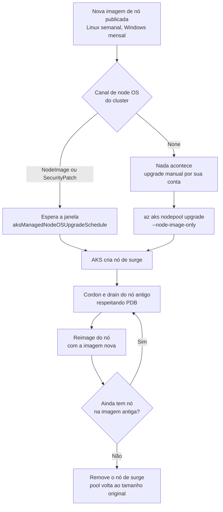

Fala pessoALL! Bora falar de Kubernetes hoje?

Quem vem do mundo de VM costuma olhar para um cluster AKS e fazer a pergunta errada: "qual é a versão do Kubernetes?". A pergunta é boa, só não é a única. Um cluster pode estar na versão mais nova do Kubernetes e, ao mesmo tempo, rodando nós com um kernel de meses atrás.

Isso acontece porque o AKS tem **duas esteiras de atualização** que andam em ritmos diferentes. Uma troca a versão do Kubernetes. A outra troca a **imagem de nó**, que é o disco de S.O. de onde cada nó nasce. E é pela segunda que chega a correção de kernel, de containerd e dos pacotes do S.O.

É comum o time tratar "upgrade do AKS" como um evento só, feito duas ou três vezes por ano, com GMUD, janela e gente de plantão. Enquanto isso a imagem de nó, que a Microsoft publica toda semana para Linux, fica parada. Quando o scanner de vulnerabilidade aponta o kernel do nó, a primeira reação é procurar um jeito de rodar `apt upgrade` dentro dele.

Não é por aí.

Nó de AKS não se mantém como a gente mantém VM. Nos artigos da série de patch, começando pelo [Azure Update Manager do zero](https://blog.ruizsolutions.online/posts/azure-update-manager-do-zero/), a lógica era avaliar a máquina e instalar o que falta nela. No AKS a lógica é outra: o nó é descartável e a correção vem trocando o disco dele por um mais novo. É a mesma ideia de Golden Image que usamos no artigo de [Azure Image Builder](https://blog.ruizsolutions.online/posts/azure-image-builder-windows-linux/), só que aqui quem constrói e publica a imagem é o próprio AKS.

**Neste artigo, vamos subir um cluster de laboratório, separar o que é upgrade de versão do Kubernetes do que é upgrade de imagem de nó, conferir a imagem atual e a disponível, atualizar um node pool na mão com surge acompanhando cada etapa, e depois deixar o cluster se cuidando sozinho com os canais de auto-upgrade e duas janelas de planned maintenance.**

> Este artigo cobre cluster **AKS Standard**. No **AKS Automatic** os canais já vêm definidos (`stable` para o cluster e `NodeImage` para o S.O. dos nós) e não podem ser trocados, você só ajusta a janela. Clusters com Node Auto-Provisioning também seguem outra lógica de troca de imagem, que não vou tratar aqui.
{: .prompt-warning }

---

## Duas esteiras, dois ritmos

Antes dos comandos, vale separar bem as duas coisas, porque elas usam comandos parecidos e isso confunde.

| | Upgrade de versão do Kubernetes | Upgrade de imagem de nó |
| --- | --- | --- |
| O que muda | Control plane e, depois, o kubelet dos node pools | O disco de S.O. dos nós: kernel, pacotes, containerd, binários do nó |
| Frequência de publicação | Versões minor a cada três meses, mais ou menos, e patches no meio do caminho | Linux toda semana, Windows todo mês |
| Mexe em API do Kubernetes | Sim, pode remover API depreciada | Não |
| Comando manual | `az aks upgrade --kubernetes-version` | `az aks nodepool upgrade --node-image-only` |
| Canal automático | `--auto-upgrade-channel` | `--node-os-upgrade-channel` |
| Janela de manutenção | `aksManagedAutoUpgradeSchedule` | `aksManagedNodeOSUpgradeSchedule` |

Dois detalhes dessa tabela costumam passar batido.

O primeiro: **upgrade só do control plane não troca kernel nenhum**. O control plane é gerenciado pela Microsoft e os seus nós continuam com o mesmo disco. Já o upgrade de versão em um node pool leva junto a imagem de nó mais recente, se ela ainda não estiver aplicada. Ou seja, quem atualiza Kubernetes com frequência acaba atualizando imagem de carona, e quem não atualiza fica com as duas coisas paradas.

O segundo: a nova imagem leva até duas semanas para chegar em todas as regiões. Ela existe no release notes antes de existir na sua região.

### Por que a correção de kernel chega pela imagem?

Um nó Linux do AKS é uma VM de um Virtual Machine Scale Set, criada a partir de uma imagem mantida pelo AKS. Essa imagem carrega os patches de segurança do S.O., as atualizações de kernel, o kubelet e os componentes do nó, tudo testado em conjunto.

Kernel novo só entra em uso depois de um reboot. O AKS não reinicia nó por conta própria quando o S.O. instala um pacote, e nos canais gerenciados (`NodeImage` e `SecurityPatch`) o unattended upgrade do Linux fica desligado. Então o caminho oficial para o kernel novo é o **reimage**: o AKS cria um nó extra, esvazia um nó antigo com cordon e drain, regrava o disco dele com a imagem nova e segue para o próximo.

E tem um motivo mais prático: se você atualizasse os pacotes dentro do nó, a imagem usada para criar nós novos continuaria a antiga, e no próximo scale-out o nó nasceria desatualizado.



### Os canais de auto-upgrade

São duas configurações independentes no cluster.

**Canal do cluster** (`--auto-upgrade-channel`), que decide a versão do Kubernetes:

| Canal | O que faz |
| --- | --- |
| `none` | Não atualiza sozinho. É o padrão se você não mexer |
| `patch` | Sobe para o último patch suportado, mantendo a versão minor |
| `stable` | Sobe para o último patch da minor N-1, onde N é a minor mais nova suportada |
| `rapid` | Sobe para o último patch da minor mais nova |
| `node-image` | Legado. Atualizava só a imagem de nó. Não use, o canal de node OS substituiu |

**Canal de node OS** (`--node-os-upgrade-channel`), que decide como o S.O. dos nós é mantido:

| Canal | O que faz |
| --- | --- |
| `None` | Nenhuma atualização de segurança automática. A responsabilidade é toda sua |
| `Unmanaged` | O próprio S.O. aplica os updates todo dia (unattended upgrade no Ubuntu, dnf-automatic no Azure Linux). O reboot fica por sua conta, com algo como o kured. Em Windows se comporta como `None` |
| `SecurityPatch` | Só correções de segurança, testadas pelo AKS. Aplica a quente quando dá e só faz reimage quando precisa, como em certos pacotes de kernel. Gera custo de armazenamento de VHD no resource group de nós e não existe para node pool Windows |
| `NodeImage` | Imagem nova toda semana, com correções de segurança e de bug. Sempre com reimage, respeitando janela e surge. Sem custo extra de VHD |

Desde a API 2023-06-01, cluster AKS Standard novo já nasce com `NodeImage` no canal de node OS. Cluster mais antigo, ou criado por template que fixa o valor, pode estar em `None` sem ninguém saber.

Minha escolha para a maioria dos ambientes: `NodeImage` nos nós, com janela semanal, e `patch` no cluster, com janela mensal. `SecurityPatch` faz sentido quando o prazo para corrigir vulnerabilidade é apertado e você aceita não receber correção de bug por esse caminho. Canal `None` em produção só com processo manual escrito e com dono.

<!-- LUIZ: em algum ambiente você já encontrou cluster com Kubernetes em dia e imagem de nó parada há meses? Vale contar de forma anônima como isso apareceu (scanner, auditoria, incidente) -->

---

## Pré-requisitos

* Assinatura do Azure com permissão de **Contributor** no resource group do laboratório. Em cluster que já existe, a role **Azure Kubernetes Service Contributor Role** é suficiente para as operações de upgrade;
* **Azure CLI** atualizada (`az upgrade`) e **kubectl**. O canal `SecurityPatch` exige CLI 2.61.0 ou mais nova, e o rollback de node pool, 2.88.0;
* Shell **Bash**. Os scripts e o `jsonpath` do artigo usam sintaxe de Bash;
* Cota de vCPU na região para os quatro nós do laboratório mais os nós de surge;
* Arquivos do laboratório, que estão no meu repositório: [AKS Upgrades](https://github.com/lfrleite/Ruiz-Online/tree/main/AKS%20Upgrades).

> Esse laboratório gera custo. São quatro VMs ligadas o tempo todo, mais discos e Load Balancer. O control plane fica no tier `free`. Se for só estudo, faça a limpeza do final do artigo assim que terminar os prints.
{: .prompt-info }

---

## Mão na massa!

### Passo 1 - Criar o cluster de laboratório com os canais desligados

Vamos criar o cluster com os dois canais em "desligado" de propósito. Assim ele não se atualiza sozinho no meio do laboratório e conseguimos ver o upgrade manual acontecendo.

Primeiro as variáveis, que serão usadas até o final:

```bash
RG="rg-aks-lab-wus2-001"
CLUSTER="aks-upgrade-lab-wus2-001"
LOCATION="westus2"
```

Resource group e cluster:

```bash
az group create --name $RG --location $LOCATION

az aks create \
  --resource-group $RG \
  --name $CLUSTER \
  --location $LOCATION \
  --tier free \
  --nodepool-name systempool \
  --node-count 1 \
  --auto-upgrade-channel none \
  --node-os-upgrade-channel None \
  --generate-ssh-keys
```

Não informei `--node-vm-size`, então o serviço escolhe um tamanho padrão para a região. Se a sua assinatura tiver restrição de SKU, informe um tamanho que você tenha cota.

> Repare na diferença de maiúsculas: o canal do cluster é `none`, em minúsculas, e o de node OS é `None`, com N maiúsculo. São listas de valores diferentes na CLI.
{: .prompt-tip }

<!-- PRINT 002: Cloud Shell com o final da saída do az aks create mostrando provisioningState Succeeded e o bloco autoUpgradeProfile com os dois canais desligados -->
{: .shadow .rounded-10 }
<br>

Agora um node pool de usuário com três nós, que é onde faremos o upgrade. O label `workload=demo` serve para prender a aplicação de teste nesse pool:

```bash
az aks nodepool add \
  --resource-group $RG \
  --cluster-name $CLUSTER \
  --name userpool \
  --mode User \
  --node-count 3 \
  --labels workload=demo
```

Por que três nós? Com um nó só, o upgrade acontece e você não vê nada. Com três dá para acompanhar o surge, o cordon e o drain passando de nó em nó.

Credenciais do cluster e conferência:

```bash
az aks get-credentials --resource-group $RG --name $CLUSTER

kubectl get nodes -o wide
```

A coluna **KERNEL-VERSION** é a que nos interessa. Anote o valor, vamos comparar depois.

<!-- PRINT 003: saída do kubectl get nodes -o wide com os quatro nós (um systempool e três userpool) em Ready, destacando as colunas OS-IMAGE e KERNEL-VERSION -->
{: .shadow .rounded-10 }
<br>

---

### Passo 2 - Subir uma aplicação com PodDisruptionBudget

Upgrade de nó sem carga rodando não ensina nada. Quem segura ou libera o drain é o **PodDisruptionBudget (PDB)**, então vamos colocar um no laboratório.

Crie o arquivo `demo-pdb.yaml`:

```yaml
apiVersion: v1
kind: Namespace
metadata:
  name: demo-upgrade
---
apiVersion: apps/v1
kind: Deployment
metadata:
  name: web-demo
  namespace: demo-upgrade
  labels:
    app: web-demo
spec:
  replicas: 3
  selector:
    matchLabels:
      app: web-demo
  template:
    metadata:
      labels:
        app: web-demo
    spec:
      nodeSelector:
        workload: demo
      containers:
      - name: nginx
        image: mcr.microsoft.com/azurelinux/base/nginx:1.28
        ports:
        - containerPort: 80
        resources:
          requests:
            cpu: 100m
            memory: 128Mi
          limits:
            cpu: 250m
            memory: 256Mi
---
apiVersion: policy/v1
kind: PodDisruptionBudget
metadata:
  name: web-demo-pdb
  namespace: demo-upgrade
spec:
  minAvailable: 2
  selector:
    matchLabels:
      app: web-demo
```

São três réplicas e o PDB exige duas disponíveis. Isso deixa o AKS tirar um pod por vez, que é o comportamento saudável.

```bash
kubectl apply -f demo-pdb.yaml

kubectl get pods -n demo-upgrade -o wide
kubectl get pdb -n demo-upgrade
```

<!-- PRINT 004: saída do kubectl get pods -n demo-upgrade -o wide com os três pods Running em nós do userpool, e do kubectl get pdb mostrando web-demo-pdb com MIN AVAILABLE 2 e ALLOWED DISRUPTIONS 1 -->
{: .shadow .rounded-10 }
<br>

> Um PDB que não permite nenhuma interrupção, como `maxUnavailable: 0` ou `minAvailable` igual ao número de réplicas, trava o drain e derruba o upgrade inteiro. Repare que a causa está no manifesto da aplicação. O time de infra leva a culpa pelo upgrade que falhou, mas quem corrige é o dono do deployment.
{: .prompt-danger }

---

### Passo 3 - Conferir a imagem atual e a disponível

A imagem em uso fica na propriedade `nodeImageVersion` de cada node pool:

```bash
az aks nodepool list \
  --resource-group $RG \
  --cluster-name $CLUSTER \
  --query "[].{Name:name, K8s:orchestratorVersion, NodeImageVersion:nodeImageVersion}" \
  --output table
```

O formato esperado é parecido com este. Os valores abaixo são só exemplo:

```text
Name        K8s     NodeImageVersion
----------  ------  ----------------------------------------
systempool  1.33.1  AKSUbuntu-2404gen2containerd-202604.07.0
userpool    1.33.1  AKSUbuntu-2404gen2containerd-202604.07.0
```

Dá para ler bastante coisa nesse nome: distribuição e versão do S.O., geração da VM, runtime e, no final, a **data da imagem**. Se o cluster usa `SecurityPatch`, o label do nó ganha ainda um segundo sufixo com a data do último patch de segurança aplicado.

A imagem mais recente que o AKS oferece para aquele pool, na sua região, vem de outro comando:

```bash
az aks nodepool get-upgrades \
  --resource-group $RG \
  --cluster-name $CLUSTER \
  --nodepool-name userpool \
  --query latestNodeImageVersion \
  --output tsv
```

Se `nodeImageVersion` for diferente de `latestNodeImageVersion`, existe upgrade de imagem para fazer.

Fazer isso pool a pool cansa rápido. Deixei no repositório o script `aks-node-image-status.sh`, que percorre todos os node pools do cluster e mostra as duas versões lado a lado:

```bash
#!/usr/bin/env bash
# Compara a imagem de nó em uso com a mais recente disponível em cada node pool de um cluster AKS.
# Uso: ./aks-node-image-status.sh <resource-group> <cluster>
# Retorno: 0 = todos os pools na imagem mais recente | 2 = existe pool atrasado | 1 = erro
set -euo pipefail

RG="${1:-}"
CLUSTER="${2:-}"

if [[ -z "$RG" || -z "$CLUSTER" ]]; then
  echo "Uso: $0 <resource-group> <cluster>" >&2
  exit 1
fi

if ! command -v az >/dev/null 2>&1; then
  echo "Azure CLI não encontrada no PATH." >&2
  exit 1
fi

if ! az account show >/dev/null 2>&1; then
  echo "Sem sessão ativa no Azure. Execute 'az login' antes de rodar o script." >&2
  exit 1
fi

if ! POOLS=$(az aks nodepool list \
  --resource-group "$RG" \
  --cluster-name "$CLUSTER" \
  --query "[].name" \
  --output tsv); then
  echo "Não consegui listar os node pools de '$CLUSTER' em '$RG'. Confira os nomes e a sua permissão." >&2
  exit 1
fi

if [[ -z "$POOLS" ]]; then
  echo "O cluster '$CLUSTER' não retornou nenhum node pool." >&2
  exit 1
fi

ATRASADOS=0
printf '%-14s %-10s %-52s %-52s %s\n' "POOL" "K8S" "IMAGEM ATUAL" "IMAGEM DISPONIVEL" "SITUACAO"

for POOL in $POOLS; do
  ATUAL=$(az aks nodepool show \
    --resource-group "$RG" \
    --cluster-name "$CLUSTER" \
    --name "$POOL" \
    --query nodeImageVersion \
    --output tsv)

  K8S=$(az aks nodepool show \
    --resource-group "$RG" \
    --cluster-name "$CLUSTER" \
    --name "$POOL" \
    --query orchestratorVersion \
    --output tsv)

  DISPONIVEL=$(az aks nodepool get-upgrades \
    --resource-group "$RG" \
    --cluster-name "$CLUSTER" \
    --nodepool-name "$POOL" \
    --query latestNodeImageVersion \
    --output tsv)

  if [[ "$ATUAL" == "$DISPONIVEL" ]]; then
    SITUACAO="em dia"
  else
    SITUACAO="ATRASADO"
    ATRASADOS=$((ATRASADOS + 1))
  fi

  printf '%-14s %-10s %-52s %-52s %s\n' "$POOL" "$K8S" "$ATUAL" "$DISPONIVEL" "$SITUACAO"
done

if [[ "$ATRASADOS" -gt 0 ]]; then
  echo
  echo "$ATRASADOS node pool(s) com imagem de nó mais nova disponível."
  exit 2
fi

echo
echo "Todos os node pools estão na imagem de nó mais recente da região."
```

```bash
chmod +x aks-node-image-status.sh
./aks-node-image-status.sh $RG $CLUSTER
```

O script devolve código de saída `2` quando existe pool atrasado. Isso ajuda se você quiser chamar ele de um pipeline ou de um agendamento e alertar alguém.

<!-- PRINT 005: saída do aks-node-image-status.sh listando systempool e userpool com as colunas IMAGEM ATUAL, IMAGEM DISPONIVEL e SITUACAO -->
{: .shadow .rounded-10 }
<br>

> Cluster recém-criado nasce na imagem mais recente da região. Logo depois do Passo 1 o script vai dizer que está tudo em dia, e não há o que atualizar. Para ver um upgrade de verdade você tem dois caminhos: deixar o laboratório parado até sair a próxima imagem semanal (o canal `None` impede que ele se atualize sozinho) ou rodar os próximos passos em um cluster de teste que já esteja atrasado.
{: .prompt-warning }

Para saber se a imagem nova já chegou na sua região, a fonte é o **AKS release tracker**, na aba **AKS Node Image**. Ela mostra a imagem mais recente e as três anteriores por região, e a ordem em que as regiões recebem.

<!-- PRINT 006: página do AKS release tracker (releases.aks.azure.com) na aba AKS Node Image, com a linha da região West US 2 visível mostrando a imagem mais recente e as anteriores -->
{: .shadow .rounded-10 }
<br>

<!-- LUIZ: quanto tempo o laboratório ficou parado até aparecer a imagem nova em West US 2? Se preferir, diga se usou um cluster mais antigo para tirar os prints do upgrade -->

---

### Passo 4 - Ajustar o surge do node pool

O **max surge** define quantos nós extras o AKS cria para fazer o upgrade. É a configuração que mais pesa no tempo total e no impacto.

Por padrão o AKS trabalha com um nó extra, o que significa um nó por vez. Em um pool de três nós isso é aceitável. Em um pool de sessenta, vira uma tarde inteira. Confira o valor do seu pool antes de assumir que é o padrão.

O valor aceita número inteiro ou percentual. A Microsoft recomenda `33%` para node pool de produção, e `100%` só em ambiente de teste, porque drena todos os nós ao mesmo tempo.

```bash
az aks nodepool update \
  --resource-group $RG \
  --cluster-name $CLUSTER \
  --name userpool \
  --max-surge 33%
```

Em um pool de três nós, 33% arredonda para cima e dá um nó de surge, igual ao padrão. A diferença é que a configuração fica gravada no pool e vale para os próximos upgrades, inclusive os automáticos.

<!-- PRINT 007: saída do az aks nodepool update com as configurações de upgrade do pool visíveis e o max surge em 33% -->
{: .shadow .rounded-10 }
<br>

> O parâmetro `--max-surge` existe no `az aks nodepool upgrade`, mas ele **não pode ser usado junto com `--node-image-only`**. Para upgrade de imagem o surge precisa ser ajustado antes, com `az aks nodepool update`. É o tipo de coisa que você descobre na mensagem de erro.
{: .prompt-warning }

Nó de surge consome cota de vCPU e IP da subnet. Antes de subir o surge em ambiente real, confira as duas coisas.

Existem mais dois ajustes no mesmo comando que eu sugiro conhecer:

* `--drain-timeout`: quanto tempo o AKS espera os pods saírem do nó. O padrão é 30 minutos, com mínimo de 5 minutos e máximo de 24 horas. Estourou o tempo, o upgrade para;
* `--node-soak-duration`: pausa entre drenar um nó e seguir para o próximo, de 0 a 30 minutos. O padrão é 0. Serve para dar tempo de olhar o monitoramento antes do nó seguinte.

---

### Passo 5 - Atualizar a imagem do node pool

O comando em si é curto:

```bash
az aks nodepool upgrade \
  --resource-group $RG \
  --cluster-name $CLUSTER \
  --name userpool \
  --node-image-only
```

Sem o `--node-image-only`, esse mesmo comando faz upgrade de versão do Kubernetes do pool. Uma flag separa as duas esteiras.

Para todos os node pools de uma vez existe o `az aks upgrade --node-image-only`. Eu prefiro ir pool a pool: começo pelo de carga menos crítica, valido e só então sigo.

No laboratório vamos usar o script `aks-nodepool-image-upgrade.sh`, que faz a sequência inteira: confere se há imagem nova, ajusta o surge, dispara o upgrade e acompanha até o fim.

```bash
#!/usr/bin/env bash
# Atualiza somente a imagem de nó de um node pool do AKS, ajustando o surge antes, e acompanha até o fim.
# Uso: ./aks-nodepool-image-upgrade.sh <resource-group> <cluster> <node-pool> [max-surge] [--yes]
# Exemplo: ./aks-nodepool-image-upgrade.sh rg-aks-lab-wus2-001 aks-upgrade-lab-wus2-001 userpool 33%
# Sem --yes o script pede confirmação antes de disparar o upgrade.
set -euo pipefail

RG="${1:-}"
CLUSTER="${2:-}"
POOL="${3:-}"
MAX_SURGE="${4:-33%}"
CONFIRMA="${5:-}"
INTERVALO=30          # segundos entre uma consulta e outra
LIMITE_MINUTOS=120    # tempo máximo de acompanhamento

if [[ -z "$RG" || -z "$CLUSTER" || -z "$POOL" ]]; then
  echo "Uso: $0 <resource-group> <cluster> <node-pool> [max-surge] [--yes]" >&2
  exit 1
fi

if ! command -v az >/dev/null 2>&1; then
  echo "Azure CLI não encontrada no PATH." >&2
  exit 1
fi

if ! az account show >/dev/null 2>&1; then
  echo "Sem sessão ativa no Azure. Execute 'az login' antes de rodar o script." >&2
  exit 1
fi

consulta_pool() {
  az aks nodepool show \
    --resource-group "$RG" \
    --cluster-name "$CLUSTER" \
    --name "$POOL" \
    --query "$1" \
    --output tsv
}

if ! ATUAL=$(consulta_pool nodeImageVersion); then
  echo "Não encontrei o node pool '$POOL' no cluster '$CLUSTER'." >&2
  exit 1
fi

ESTADO=$(consulta_pool provisioningState)
if [[ "$ESTADO" != "Succeeded" ]]; then
  echo "O node pool está em '$ESTADO'. Resolva a operação anterior antes de iniciar outra." >&2
  exit 1
fi

DISPONIVEL=$(az aks nodepool get-upgrades \
  --resource-group "$RG" \
  --cluster-name "$CLUSTER" \
  --nodepool-name "$POOL" \
  --query latestNodeImageVersion \
  --output tsv)

if [[ -z "$DISPONIVEL" ]]; then
  echo "O AKS não retornou a imagem disponível para '$POOL'. Rode 'az aks nodepool get-upgrades' na mão e confira." >&2
  exit 1
fi

echo "Imagem atual:      $ATUAL"
echo "Imagem disponível: $DISPONIVEL"

if [[ "$ATUAL" == "$DISPONIVEL" ]]; then
  echo "O node pool já está na imagem mais recente. Nada a fazer."
  exit 0
fi

if [[ "$CONFIRMA" != "--yes" ]]; then
  echo
  echo "Os nós de '$POOL' serão drenados e regravados com a imagem nova, um lote por vez."
  read -r -p "Digite o nome do node pool para confirmar: " RESPOSTA
  if [[ "$RESPOSTA" != "$POOL" ]]; then
    echo "Confirmação não confere. Nada foi alterado." >&2
    exit 1
  fi
fi

echo
echo "Ajustando o max surge do node pool para $MAX_SURGE..."
az aks nodepool update \
  --resource-group "$RG" \
  --cluster-name "$CLUSTER" \
  --name "$POOL" \
  --max-surge "$MAX_SURGE" \
  --output none

echo "Disparando o upgrade somente da imagem de nó..."
az aks nodepool upgrade \
  --resource-group "$RG" \
  --cluster-name "$CLUSTER" \
  --name "$POOL" \
  --node-image-only \
  --no-wait

INICIO=$(date +%s)
while true; do
  ESTADO=$(consulta_pool provisioningState)
  IMAGEM=$(consulta_pool nodeImageVersion)
  DECORRIDO=$(( ($(date +%s) - INICIO) / 60 ))
  echo "$(date '+%H:%M:%S') | estado: $ESTADO | imagem: $IMAGEM | ${DECORRIDO} min"

  if [[ "$ESTADO" == "Succeeded" && "$IMAGEM" == "$DISPONIVEL" ]]; then
    echo
    echo "Upgrade concluído. Node pool '$POOL' em $IMAGEM."
    exit 0
  fi

  if [[ "$ESTADO" == "Failed" || "$ESTADO" == "Canceled" ]]; then
    echo
    echo "O upgrade terminou em '$ESTADO'. Veja o Activity Log do cluster e os eventos com 'kubectl get events'." >&2
    exit 1
  fi

  if [[ "$DECORRIDO" -ge "$LIMITE_MINUTOS" ]]; then
    echo
    echo "Passei de $LIMITE_MINUTOS minutos acompanhando. A operação continua no Azure, confira o estado manualmente." >&2
    exit 1
  fi

  sleep "$INTERVALO"
done
```

```bash
chmod +x aks-nodepool-image-upgrade.sh
./aks-nodepool-image-upgrade.sh $RG $CLUSTER userpool 33%
```

<!-- PRINT 008: saída do aks-nodepool-image-upgrade.sh mostrando imagem atual, imagem disponível, a confirmação com o nome do node pool e as primeiras linhas do acompanhamento com estado Upgrading -->
{: .shadow .rounded-10 }
<br>

> Não dá para escolher uma imagem de nó mais antiga: o AKS recusa downgrade de versão de imagem. O que existe é o **rollback de node pool**, que devolve o pool só para a versão imediatamente anterior, e só nos sete dias seguintes ao upgrade. Trato dele logo depois do Passo 6. Como é saída de emergência e não plano, a ordem continua importando: primeiro o ambiente de teste, depois produção.
{: .prompt-danger }

Antes de drenar qualquer nó, o script pede que você digite o nome do node pool. Para chamar de pipeline ou de agendamento, passe `--yes` como quinto parâmetro.

---

### Passo 6 - Acompanhar o upgrade

Deixe o script rodando e abra um segundo terminal. É aqui que dá para ver o que o AKS faz por baixo.

Comece pelos nós entrando e saindo:

```bash
kubectl get nodes -o wide --watch
```

Você vai ver um quarto nó do `userpool` aparecer, que é o surge. Em seguida um dos nós antigos muda para `Ready,SchedulingDisabled`, que é o cordon. Depois ele some e volta, já com a imagem nova.

<!-- PRINT 009: saída do kubectl get nodes durante o upgrade com o nó de surge do userpool em Ready e um nó antigo em Ready,SchedulingDisabled -->
{: .shadow .rounded-10 }
<br>

A imagem de cada nó aparece no label `kubernetes.azure.com/node-image-version`:

```bash
kubectl get nodes -o jsonpath='{range .items[*]}{.metadata.name}{"\t"}{.metadata.labels.kubernetes\.azure\.com\/node-image-version}{"\n"}{end}'
```

No meio do processo esse comando mostra nós nas duas imagens, lado a lado. É a melhor forma de saber quanto falta.

O AKS também registra eventos de cada etapa:

<!-- VALIDAR: o comando abaixo é o da documentação, mas field selector separado por vírgula costuma funcionar como E lógico no kubectl. Se voltar vazio durante o upgrade, trocar por kubectl get events -A filtrando Drain, Surge e Upgrade com grep. -->

```bash
kubectl get events --field-selector reason=Drain,reason=Surge,reason=Upgrade
```

O formato esperado é parecido com este. Nomes de nó e tempos são exemplo:

```text
default  9m22s  Normal  Surge    node/aks-userpool-12345678-vmss000003  Created a surge node [aks-userpool-12345678-vmss000003 userpool] for agentpool userpool
default  2m1s   Normal  Drain    node/aks-userpool-12345678-vmss000001  Draining node: [aks-userpool-12345678-vmss000001]
```

<!-- PRINT 010: saída do kubectl get events com os eventos de Surge e Drain do userpool durante o upgrade -->
{: .shadow .rounded-10 }
<br>

E a aplicação, que é o que importa no fim das contas:

```bash
kubectl get pods -n demo-upgrade -o wide --watch
```

Os pods mudam de nó um de cada vez e o PDB mantém pelo menos dois em pé durante todo o processo.

Quando o script terminar, confira o resultado final:

```bash
./aks-node-image-status.sh $RG $CLUSTER

kubectl get nodes -o wide
```

O `userpool` aparece com a imagem nova e a coluna **KERNEL-VERSION** dos três nós muda, se a imagem nova trouxe kernel novo. O `systempool` continua na imagem antiga, porque não mexemos nele.

<!-- PRINT 011: saída do aks-node-image-status.sh depois do upgrade, com userpool em dia e systempool ATRASADO, seguida do kubectl get nodes -o wide mostrando KERNEL-VERSION diferente entre os nós do userpool e o nó do systempool -->
{: .shadow .rounded-10 }
<br>

Pelo portal, o registro da operação fica em **Activity log** do cluster. Os upgrades automáticos aparecem no mesmo lugar.

<!-- PRINT 012: portal do Azure, cluster aks-upgrade-lab-wus2-001 > Activity log, com a operação de upgrade do agent pool userpool em Succeeded e o horário visível -->
{: .shadow .rounded-10 }
<br>

Repita o Passo 5 para o `systempool` e o cluster fica todo na mesma imagem. Aqui eu não vou refazer o processo, é o mesmo comando trocando o nome do pool.

### E se a imagem nova der problema?

Até pouco tempo atrás a resposta era "segue em frente e corrige". Hoje existe o **rollback de node pool**, com Azure CLI 2.88.0 ou superior e sem precisar da extensão `aks-preview`.

Ele devolve o pool para a última combinação de versão do Kubernetes e imagem de nó que estava em uso. Se o último upgrade foi só de imagem, volta só a imagem.

Primeiro veja se existe para onde voltar:

```bash
az aks nodepool get-rollback-versions \
  --resource-group $RG \
  --cluster-name $CLUSTER \
  --name userpool
```

Se o comando não devolver versão nenhuma, não há rollback possível para aquele pool. Havendo, o comando é este:

<!-- VALIDAR: executar o rollback no userpool logo depois do upgrade do Passo 5, com os dois canais ainda desligados, e conferir se nodeImageVersion volta para a imagem anterior. Confirmar também a versão do Azure CLI do Cloud Shell (2.88.0 ou superior). -->

```bash
az aks nodepool rollback \
  --resource-group $RG \
  --cluster-name $CLUSTER \
  --name userpool
```

As regras que limitam o uso:

* Só vale por **sete dias** depois que o upgrade terminou;
* Volta uma versão só. Não dá para escolher a imagem nem encadear rollbacks;
* O canal de auto-upgrade do cluster precisa estar desligado. Para a imagem anterior voltar de fato, o canal de node OS também. No nosso laboratório os dois ainda estão desligados, então este é o momento de testar;
* Os nós são substituídos de novo. Capacidade e PDB precisam permitir a troca, como no upgrade;
* Não desfaz troca de S.O. do pool, como de Ubuntu para Azure Linux.

O rollback tira do nó as correções de segurança que a imagem nova trouxe. A própria documentação trata como medida temporária: voltou, achou a causa, atualiza de novo.

---

### Passo 7 - Ligar os canais de auto-upgrade

Fazer na mão uma vez é ótimo para aprender. Fazer na mão toda semana, em todos os clusters, não se sustenta.

Vamos ligar os dois canais no mesmo comando:

```bash
az aks update \
  --resource-group $RG \
  --name $CLUSTER \
  --auto-upgrade-channel patch \
  --node-os-upgrade-channel NodeImage
```

Para conferir:

```bash
az aks show \
  --resource-group $RG \
  --name $CLUSTER \
  --query autoUpgradeProfile
```

<!-- PRINT 013: saída do az aks show --query autoUpgradeProfile com o canal de node OS em NodeImage e o canal do cluster em patch -->
{: .shadow .rounded-10 }
<br>

Pelo portal, as duas configurações ficam em lugares diferentes, o que não ajuda:

1. Canal de node OS: no cluster, em **Settings**, clique em **Cluster configuration**;
2. Em **Security updates**, o campo é **Node security channel type**;
3. Canal do cluster: em **Settings**, clique em **Upgrades**;
4. Em **Kubernetes version**, clique em **Upgrade version** e use o campo **Automatic upgrade**.

<!-- PRINT 014: portal do Azure, cluster > Settings > Cluster configuration, seção Security updates com Node security channel type em Node Image -->
{: .shadow .rounded-10 }
<br>

> Mudança de canal pode levar até 24 horas para valer. Não espere o cluster se atualizar minutos depois do comando.
{: .prompt-info }

> Com auto-upgrade do cluster ligado, você perde a opção de atualizar só o control plane. O `az aks upgrade --control-plane-only` passa a retornar erro, porque o auto-upgrade sempre leva control plane e node pools juntos.
{: .prompt-warning }

Usei `patch` porque ele mantém a versão minor e aplica só as correções. A troca de minor, que pode remover API, eu prefiro fazer de forma manual e planejada. Quem não quer correr o risco de sair da janela de suporte usa `stable`.

---

### Passo 8 - Criar as janelas de planned maintenance

Canal ligado sem janela definida significa que o AKS escolhe a hora. Em ambiente corporativo isso não combina com GMUD nem com horário comercial.

O **planned maintenance** tem três tipos de configuração, e os nomes são fixos:

| Nome | Controla |
| --- | --- |
| `default` | Os releases semanais do AKS: componentes do control plane e add-ons |
| `aksManagedAutoUpgradeSchedule` | Os upgrades de versão do Kubernetes feitos pelo canal do cluster |
| `aksManagedNodeOSUpgradeSchedule` | Os upgrades feitos pelo canal de node OS |

As três podem existir no mesmo cluster. Vamos criar as duas que conversam com os canais.

Janela semanal para a imagem de nó, domingo às 02:00 no horário de Brasília, com quatro horas de duração:

```bash
az aks maintenanceconfiguration add \
  --resource-group $RG \
  --cluster-name $CLUSTER \
  --name aksManagedNodeOSUpgradeSchedule \
  --schedule-type Weekly \
  --day-of-week Sunday \
  --interval-weeks 1 \
  --start-time 02:00 \
  --duration 4 \
  --utc-offset=-03:00
```

Janela mensal para a versão do Kubernetes, no primeiro sábado do mês:

```bash
az aks maintenanceconfiguration add \
  --resource-group $RG \
  --cluster-name $CLUSTER \
  --name aksManagedAutoUpgradeSchedule \
  --schedule-type RelativeMonthly \
  --day-of-week Saturday \
  --week-index First \
  --interval-months 1 \
  --start-time 02:00 \
  --duration 4 \
  --utc-offset=-03:00
```

> Para offset negativo, use o sinal de igual, como nos exemplos da documentação: `--utc-offset=-03:00`. Um valor que começa com hífen, separado por espaço, tende a ser lido como outro parâmetro. E sem informar o offset a janela fica em UTC: o seu "domingo de madrugada" vira sábado às 23:00.
{: .prompt-warning }

Confira o que ficou gravado:

```bash
az aks maintenanceconfiguration list \
  --resource-group $RG \
  --cluster-name $CLUSTER
```

<!-- PRINT 015: saída do az aks maintenanceconfiguration list com as duas configurações, mostrando durationHours 4, startTime 02:00, utcOffset -03:00 e os blocos schedule weekly e relativeMonthly -->
{: .shadow .rounded-10 }
<br>

No portal, as janelas aparecem em **Settings** > **Upgrades**, no campo **Automatic upgrade scheduler**, e em **Cluster configuration**, no campo **Security channel scheduler**.

<!-- PRINT 016: portal do Azure, cluster > Settings > Upgrades, com o Automatic upgrade em patch e o Automatic upgrade scheduler mostrando a janela mensal configurada -->
{: .shadow .rounded-10 }
<br>

Algumas regras da janela que mudam a forma de planejar:

* A duração vai de 4 a 24 horas;
* A janela controla o **início**. Uma operação que começou dentro dela continua até terminar, mesmo passando do horário. O que o AKS não faz é começar trabalho novo depois que a janela fechou;
* É **best effort**. A Microsoft se reserva o direito de fazer manutenção urgente fora da janela;
* Período de congelamento, como fim de ano ou fechamento de mês, se configura com `notAllowedDates`, e essa propriedade só existe quando a janela é criada por arquivo JSON com `--config-file`;
* Se sair uma imagem mais nova com a janela ainda aberta, o AKS pode atualizar o pool duas vezes na mesma noite. Não é defeito;
* A janela do AKS não tem relação com a manutenção de plataforma do Azure nas VMs do scale set. São coisas independentes.

E um ponto que eu faço questão de reforçar: **não coloque a mesma janela em todos os clusters da assinatura**. A própria documentação avisa que isso pode gerar throttling no ARM e falhar upgrade. Mais importante que o throttling é a lógica de ondas: DEV em um dia, homologação alguns dias depois, produção por último. Se a imagem nova quebrar alguma coisa, você descobre antes de ela chegar em produção.

<!-- LUIZ: qual defasagem entre DEV, HML e PRD você costuma recomendar para janela de node OS? Um exemplo real de dias da semana ajuda o leitor -->

### Como saber que a janela rodou

O upgrade automático usa o mesmo mecanismo do manual, então os comandos do Passo 6 continuam valendo. O que muda é que você não estava olhando quando aconteceu.

Três lugares para conferir no dia seguinte:

1. O script `aks-node-image-status.sh`, que mostra se a imagem mudou;
2. O **Activity log** do cluster;
3. A tabela `containerserviceeventresources` do Azure Resource Graph, onde o AKS grava os eventos agendados de manutenção.

```kusto
containerserviceeventresources
| where type == "microsoft.containerservice/managedclusters/scheduledevents"
| where id contains "aks-upgrade-lab-wus2-001"
| project name, properties
```

Para receber aviso por e-mail antes e depois da janela, o caminho documentado é o **AKS Communication Manager**, que monta uma regra de alerta em cima dessa mesma tabela. Com ele o aviso chega uma semana antes e um dia antes da manutenção, além do resultado.

---

## Erros comuns

### Upgrade para no drain por causa de PDB

É o primeiro que eu conferiria. A mensagem segue este formato:

```text
Code: UpgradeFailed
Message: Drain node ... failed when evicting pod ... Cannot evict pod as it would violate the pod's disruption budget.
```

Diagnóstico:

```bash
kubectl get pdb --all-namespaces
```

Procure PDB com **ALLOWED DISRUPTIONS** igual a 0. A correção certa é na aplicação: mais réplicas ou um PDB que permita ao menos uma saída.

Para o upgrade não morrer por causa de um nó teimoso, dá para mudar o comportamento do pool:

```bash
az aks nodepool update \
  --resource-group $RG \
  --cluster-name $CLUSTER \
  --name userpool \
  --undrainable-node-behavior Cordon
```

Com `Cordon`, o nó que não drena fica em quarentena, com o label `kubernetes.azure.com/upgrade-status=Quarantined`, e o upgrade segue nos outros. Depois você trata o nó bloqueado com calma. O limite de quantos nós podem ficar bloqueados (`--max-blocked-nodes`) hoje só existe na extensão `aks-preview` da CLI, por isso deixei de fora.

> Existe também o `--enable-force-upgrade` do `az aks upgrade`, a partir do Azure CLI 2.79.0, que ignora o PDB. Eu não oriento usar fora de emergência de segurança. Ele pode drenar todos os pods de uma aplicação ao mesmo tempo, e aí a indisponibilidade é certa.
{: .prompt-danger }

---

### Não tem cota, capacidade ou IP para o nó de surge

O nó extra precisa de cota de vCPU e de capacidade do SKU na região. Sem isso aparecem erros como `SKUNotAvailable`, `AllocationFailed` ou `OverconstrainedAllocationRequest`.

Confira a cota em **Quotas** no portal antes de aumentar o surge. Se não for possível conseguir capacidade, a saída é trocar surge por indisponibilidade, com `--max-surge 0 --max-unavailable 1`. O AKS passa a drenar os nós existentes sem criar nenhum novo. Só não esqueça que o pool fica com um nó a menos durante o processo, e que isso não é permitido em system node pool.

Com Azure CNI o limite pode ser a subnet, e o erro é `SubnetIsFull`. A conta da documentação é `(número de nós + maxSurge) * (1 + maxPods)`. Ou você amplia a subnet, ou reduz o surge.

---

### A janela está configurada e nada aconteceu

Os motivos documentados, na ordem em que eu conferiria:

1. O canal ainda está em `None`. A janela só agenda, ela não liga o auto-upgrade;
2. A janela foi criada ou alterada menos de 15 minutos antes do horário de início;
3. O canal foi alterado há menos de 24 horas;
4. O cluster estava parado no horário da janela;
5. A imagem nova ainda não chegou na região. Confira no release tracker;
6. O node pool é grande e está sem surge configurado. O upgrade automático só dispara se a estimativa de tempo total couber em 24 horas.

```bash
az aks show --resource-group $RG --name $CLUSTER --query autoUpgradeProfile

az aks maintenanceconfiguration show \
  --resource-group $RG \
  --cluster-name $CLUSTER \
  --name aksManagedNodeOSUpgradeSchedule
```

---

### Não consigo mudar o canal de node OS

Acontece quando o canal do cluster está no legado `node-image`. Nessa situação o AKS fixa o canal de node OS em `NodeImage` e não deixa trocar. Mude primeiro o canal do cluster para `patch`, `stable` ou `none`.

Outro caso documentado: `SecurityPatch` falhando com `RequestDisallowedByPolicy` quando existe Azure Policy com efeito `deny` exigindo chave própria (CMK) no disco de S.O. Se for o seu caso, use `NodeImage`.

---

## Checklist

- [x] Passo 1 - Criar o cluster de laboratório com os dois canais desligados e o node pool de usuário;
- [x] Passo 2 - Subir a aplicação de teste com PodDisruptionBudget;
- [x] Passo 3 - Conferir a imagem de nó atual e a disponível em cada node pool;
- [x] Passo 4 - Ajustar o max surge do node pool;
- [x] Passo 5 - Atualizar somente a imagem de nó do node pool;
- [x] Passo 6 - Acompanhar surge, cordon, drain e reimage, e validar imagem e kernel no final;
- [x] Passo 7 - Ligar o canal do cluster e o canal de node OS;
- [x] Passo 8 - Criar as janelas `aksManagedNodeOSUpgradeSchedule` e `aksManagedAutoUpgradeSchedule` e conferir a execução.

---

## Limpeza do ambiente

O laboratório inteiro está em um resource group:

```bash
az group delete \
  --name rg-aks-lab-wus2-001 \
  --yes \
  --no-wait
```

Depois de alguns minutos, confira se o resource group de nós, aquele que começa com `MC_`, também foi removido. É nele que ficam as VMs, os discos e o Load Balancer, ou seja, é ele que gera a conta.

> Em ambiente real, muito cuidado com esse comando. Ele remove tudo dentro do resource group, sem perguntar duas vezes.
{: .prompt-danger }

---

## Artigos

| Nome | Link |
| :---: | :---: |
| Arquivos deste laboratório | <https://github.com/lfrleite/Ruiz-Online/tree/main/AKS%20Upgrades> |
| Azure Update Manager do zero | <https://blog.ruizsolutions.online/posts/azure-update-manager-do-zero/> |
| Azure Image Builder na prática | <https://blog.ruizsolutions.online/posts/azure-image-builder-windows-linux/> |
| Upgrade Azure Kubernetes Service (AKS) node images | <https://learn.microsoft.com/en-us/azure/aks/node-image-upgrade> |
| Autoupgrade node OS images in AKS | <https://learn.microsoft.com/en-us/azure/aks/auto-upgrade-node-os-image> |
| Automatically upgrade an AKS cluster | <https://learn.microsoft.com/en-us/azure/aks/auto-upgrade-cluster> |
| Use planned maintenance to schedule and control upgrades | <https://learn.microsoft.com/en-us/azure/aks/planned-maintenance> |
| Configure rolling upgrades for AKS node pools | <https://learn.microsoft.com/en-us/azure/aks/upgrade-aks-node-pools-rolling> |
| Upgrade options and recommendations for AKS clusters | <https://learn.microsoft.com/en-us/azure/aks/upgrade-cluster> |
| Roll back node pool versions in AKS | <https://learn.microsoft.com/en-us/azure/aks/roll-back-node-pool-version> |
| Upgrade the AKS cluster control plane | <https://learn.microsoft.com/en-us/azure/aks/upgrade-aks-cluster> |
| Node images in AKS | <https://learn.microsoft.com/en-us/azure/aks/node-images> |
| Apply security and kernel updates to Linux nodes in AKS | <https://learn.microsoft.com/en-us/azure/aks/node-updates-kured> |
| AKS release tracker | <https://learn.microsoft.com/en-us/azure/aks/release-tracker> |
| Set up the AKS communication manager | <https://learn.microsoft.com/en-us/azure/aks/aks-communication-manager> |
| Patch and upgrade AKS worker nodes and Kubernetes versions | <https://learn.microsoft.com/en-us/azure/architecture/operator-guides/aks/aks-upgrade-practices> |
| az aks maintenanceconfiguration | <https://learn.microsoft.com/en-us/cli/azure/aks/maintenanceconfiguration> |
| az aks nodepool | <https://learn.microsoft.com/en-us/cli/azure/aks/nodepool> |

---

## The End!

Chegamos ao final, e dessa vez com um tema que foge um pouco das VMs que costumam aparecer por aqui.

O upgrade de versão todo mundo planeja, porque dá medo. O de imagem de nó não dá medo nenhum, e por isso ninguém faz. Só que é ele que entrega kernel corrigido, e ele sai toda semana.

O que eu deixaria configurado em qualquer cluster sob minha responsabilidade: canal de node OS em `NodeImage`, janela semanal fora do horário de pico, surge ajustado ao tamanho do pool e PDB em toda aplicação que importa. O nó passa a se renovar sozinho e o trabalho manual fica para a troca de versão minor, que merece mesmo atenção de gente.

E um recado para quem cuida de mais de um cluster: janela defasada entre ambientes vale mais que qualquer ferramenta. A imagem que passou uma semana em DEV sem quebrar nada chega em produção com muito menos risco.

Cluster que só é atualizado quando o scanner reclama já está atrasado.

Se você já deixou algum cluster no automático, me conta no LinkedIn qual canal escolheu e se a janela se comportou como você esperava.

Obrigado por acompanhar mais esta série até o fim! Nos vemos na próxima!
